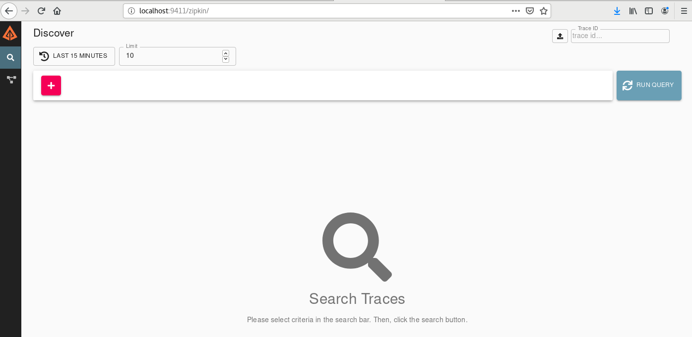
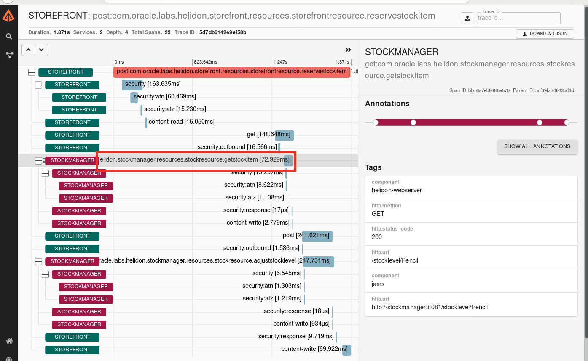

# Cloud Native - Helidon and operations

<details><summary><b>Self guided student - video introduction</b></summary>

This video is an introduction to the Helidon operations support lab. Depending on your browser settings it may open in this tab / window or open a new one. Once you've watched it please return to this page to continue the labs.

[](https://youtu.be/MF7LaX0nH-o "Helidon operations support lab introduction video")

---

</details>

## Introduction

**Estimated module duration** 20 mins.

### Objectives

Here we will see how you can use the Helidon features to transparently enable tracing of requests from start to finish, enabling you to understand your process flow. We also examine how to enable the automatic collection of metrics so monitoring tools can see the operational characteristics of your microservice. 

### Prerequisites

You need to have completed the **Communicating between microservices with Helidon** module.

## Step 1: Why care about operations ?

One thing that many developers used to forget is that once they have finished writing code it still has to run and be maintained. With the introduction of DevOps a lot of developers suddenly found they were the ones being woken up in the middle of the night to fix problems in their code. That changes the perception somewhat and now many developers are acutely aware that they will have ongoing involvement in the code well after the time it compiles cleanly and passed the test suite.

To help maintain and operate systems after they have been released a lot of information is needed, especially in situations where a bug may be on one service, but not show up until the resulting data has passed through several other microservices. 

Equally performance information is key to understanding how well the services are running, and in the event of a performance problem which specific microservice it it that's got the problem!

Fortunately for us and other developers Helidon has support for tools and and producing data that will help diagnose problems, and determine if there is a problem in the first place.

## Step 2: Tracing
We now managed to achieve the situation where we have a set of microservices that cooperate to perform specific function. However we don't know exactly how they are operating in reality, we do of course know how they operate in terms of our design!

Tracing in a microservices environment allows us to see the flow of a request across all of the microservices involved, not just the sequence of method calls in a particular service. 

Helidon has built-in support for tracing. There are a few steps that we need to take to activate this.

Firstly we need to deploy a tracing engine, Helidon supports several tracing engines, but for this lab we will use the Zipkin engine. For now we will use docker to run Zipkin. In the Kubeneres labs we will see how we can run Zipkin in Kubernetes.

In the VM you have docker installed and running, so to start zipkin:

  1. Open a terminal on your Linux desktop
  
  2. Run the following command in a terminal of your VM to start Zipkin in a container:
  
  - `docker run -d -p 9411:9411 --name zipkin --rm openzipkin/zipkin:2.22.0`

  ```
Unable to find image 'openzipkin/zipkin:2.22.0' locally
Trying to pull repository docker.io/openzipkin/zipkin ... 
2.22.0: Pulling from docker.io/openzipkin/zipkin
188c0c94c7c5: Pull complete 
83b546a0aa9f: Pull complete 
6590a03e44cb: Pull complete 
191153915ba8: Pull complete 
3c70ec14e7fc: Pull complete 
598fd661c65f: Pull complete 
06458562a6a5: Pull complete 
ca79758f3569: Pull complete 
698b89937939: Pull complete 
85014952e781: Pull complete 
4c6d8bff9e55: Pull complete 
Digest: sha256:7f85762573af407b2cffe7c796412218aebf05e6a0acca594448fa0e41de9e26
Status: Downloaded newer image for openzipkin/zipkin:2.22.0
413188a06bd102e55e5f0231c28063ad8f9175ede1f53dce51044d97a9825ab9
```

<details><summary><b>What's with the number after the image name ?</b></summary>

Docker images are tagged to help identify specific versions of an image. This let's us know which version we are dealing with. If you don't specify a version then the latest image is used.

There are many reasons why you may want to specify a version number, for example you may want to know that the image will not change on you and exhibit unexpected behavior. In the case of this lab we don't want the UI images you see to change without us knowing it and suddenly be different from those in the instructions. Of course that could also apply to other changes, an API may have changed in a different version and literally your code can't talk to it!

Other reasons may be that you are in an industry like the aerospace sector or finance industry where you have to maintain rigid version controls for regulatory reasons.

---

</details>

  3. Now open a browser in the **Virtual machine desktop** 

  4. Open a browser **in the VM** navigate to : http://localhost:9411/zipkin/ 

  

Now you need to add the zipkin packages to the pom.xml file for **both** the storefront and stockmanager projects. This will trigger Helidon to automatically setup the tracing, no code changes are needed by you at all to use the tracing.

  5. For **both** the storefront and stockmanager projects open the pom.xml file, this is in the top level of the project, towards the end of the files for the project.

  6. Look for the dependency `helidon-tracing-zipkin` in **each** pom.xml file, you may want to use the search facility (Control-F) to look for zipkin, it will be towards the end of the dependencies section. You will find a section that has been commented out and looks like the following (The way the file is formated may mean this is on one line, or spread across multiple lines)

  ```xml
		<!-- tracing calls -->
		<!-- 
		<dependency>
			<groupId>io.helidon.tracing</groupId>
			<artifactId>helidon-tracing-zipkin</artifactId>
		</dependency>
		-->
```

  7. Remove the `<!--` and `-->` around the dependency ONLY

The result will look something like, if it's all on one line that's fins as long as the `<!--` and `-->` around the dependency have been removed)
  
```xml
		<!-- tracing calls -->
		<dependency>
			<groupId>io.helidon.tracing</groupId>
			<artifactId>helidon-tracing-zipkin</artifactId>
		</dependency>
```

  8. Save **both** of the pom.xml files

You now need to tell Helidon what to call the tracing requests and where traces should be sent.

  9. In the **storefront** project, navigate to the toplevel folder **conf** and open file **storefront-config.yaml**

  10. Uncomment the **tracing** lines to specify the relevant project name as the service and the host as "zipkin"

  ```yaml
    tracing:
      service: "storefront"
      host: "zipkin"
```

  11. Navigate to the **stockmanager** project, open the **conf** folder and open file **stockmanager-conf.yaml**

  12. Uncomment the **tracing** lines 

  ```yaml
    tracing:
      service: "stockmanager"
      host: "zipkin"
```

    

  13. **Stop** any existing storefront and stockmanager instances

  14. Then **restart** them.

  15. Make a request, for example reserving stock (this may take a few seconds due to the lazy initialization) 
  
  -  `curl -i -X POST -u jill:password -d '{"requestedItem":"Pencil", "requestedCount":7}' -H "Content-type:application/json" http://localhost:8080/store/reserveStock`

  ```
HTTP/1.1 200 OK
Content-Type: application/json
Date: Mon, 28 Sept 2020 15:46:29 GMT
connection: keep-alive
content-length: 37

{"itemCount":143,"itemName":"Pencil"}
```

We've successfully reserved 7 pencils

  16. Go to the **zipkin web page** and click the `Run Query` button, you'll see the list of traces (the details you have will of course be different)

  

You can see that this took a while to run, nearly 8 seconds in fact. This is because of the lazy initialization in both the storefront and stock manager microservices.

Let's see what happens once we've re-made the request.
 
  17. re-run the request
  
   -  `curl -i -X POST -u jill:password -d '{"requestedItem":"Pencil", "requestedCount":7}' -H "Content-type:application/json" http://localhost:8080/store/reserveStock`

  ```
HTTP/1.1 200 OK
Content-Type: application/json
Date: Tue, 29 Sept 2020 17:33:00 GMT
connection: keep-alive
content-length: 37

{"itemCount":136,"itemName":"Pencil"}
```


  18. Go to the **zipkin web page** and click the `Run Query` button

  

We can see that this request was a lot faster at 1.8761 seconds

  19.Click on the `Show` on the trace row zipkin will display the full details of our trace.

  

Importantly even though they are in separate microservices and the flow switches between them several times we can see the overall flow, what part of the service was called when and how long it took. This let's developers understand exactly how the initial request was processed and how long each step took.

For requests into the service (the first of these is the first entry in the trace and selected for you) we can see what the request details are, in the tags section to the right of the page , in this case an http POST to /store/reserveStock

  20. Click **once** on the text to the right of the first stock manager entry

  

Now on the right we can see the details of this sub request, made from the storefront to the stockmanager. Feel free to further explore the zipkin UI if you wish, there's a lot if information available to help explore and diagnose problems.

## Step 3: Metrics
Tracking solutions like Zipkin can provide us with detail on how a single request is processed, but they are not going to be able to tell us how many requests were made, and what the distribution of requests per second is. This is the kind of thing that is needed by the operations team to understand how the microservice is being used, and where enhancements may be a good idea (especially where to focus development work for performance enhancements)

### Step 3a: Counting calls

The pom.xml would usually need to be updated for the metrics, that's already been done for you here.

  1. Go to the project **Storefront**, and navigate to folder **resources**
  
  2. Open the file **StorefrontResources.java**.
  
  3. Add the following annotation:
  
  -  `@Counted`

The result will look like

  ```java
@Path("/store")
@RequestScoped
@Counted
@Authenticated
@Timeout(value = 15, unit = ChronoUnit.SECONDS)
@Slf4j
@NoArgsConstructor
public class StorefrontResource {
```

<details><summary><b>Java Imports</b></summary>

You may need to add the following import to the class

```java
import org.eclipse.microprofile.metrics.annotation.Counted;
```
---

</details>

<details><summary><b>Details on the annotation</b></summary>


The counter will increment each time the method is called, but will not decrement when it's exited. If you wanted to have a particular method report how many threads were currently in it (perhaps to determine when resource limits may be reached) you'd use `@ConcurrentGauge` which would decrement the counter when a thread left the method giving the number of threads in a method.

A note on names, the default name for a counter is based on the class and method, that can be long (as we'll see in the output soon) but you can override the default name and for counters on *methods* you can specify a name for the counter E.g. `@Counted(name="MyListCounter")` This makes the output easier to understand, but do please chose a sensible name. You can also specify a description of the counter and help text if you like (examples of system generated versions are below)

That's it, you don't need to do anything else, Helidon will automatically generate a set of counters for all of the requests it processes.

---

</details>

  4. Restart the storefront service.

  5. Now look at the metrics endpoint :
  
  - `curl -i -X GET http://localhost:9080/metrics`

  ```
HTTP/1.1 200 OK
Content-Type: text/plain;charset=UTF-8
Date: Mon, 6 Jan 2020 16:43:11 GMT
connection: keep-alive
content-length: 22309

# TYPE base:classloader_current_loaded_class_count counter
# HELP base:classloader_current_loaded_class_count Displays the number of classes that are currently loaded in the Java virtual machine.
base:classloader_current_loaded_class_count 8181
...
...
a lot more!!!!
...
...
# TYPE vendor:requests_meter_one_min_rate_per_second gauge
vendor:requests_meter_one_min_rate_per_second 0.0
# TYPE vendor:requests_meter_five_min_rate_per_second gauge
vendor:requests_meter_five_min_rate_per_second 0.0
# TYPE vendor:requests_meter_fifteen_min_rate_per_second gauge
vendor:requests_meter_fifteen_min_rate_per_second 0.0
```

It'a **lot** of data, but it's broken up into sections.


<details><summary><b>Diving into the tracing details</b></summary>


The `base` data e.g. 

```
# TYPE base:classloader_current_loaded_class_count counter
# HELP base:classloader_current_loaded_class_count Displays the number of classes that are currently loaded in the Java virtual machine.
base:classloader_current_loaded_class_count 8181
```
is core data about the operation of the JVM, this is the kind of data you care about if you want to do things like customize the garbage collector (though I recommend never doing that as nowadays it's highly adaptive and will do a way better job at figuring out how it should behave than you'll ever do)

The requests under the `vendor` section relate to the Helidon frameworks operation

```
# TYPE vendor:requests_count counter
# HELP vendor:requests_count Each request (regardless of HTTP method) will increase this counter
vendor:requests_count 0
```

The data under the `application`` section relate to counters applied on the application code itself.

```
# TYPE application:com_oracle_labs_helidon_storefront_resources_storefront_resource_list_all_stock counter
# HELP application:com_oracle_labs_helidon_storefront_resources_storefront_resource_list_all_stock 
application:com_oracle_labs_helidon_storefront_resources_storefront_resource_list_all_stock 0
# TYPE application:com_oracle_labs_helidon_storefront_resources_storefront_resource_reserve_stock_item counter
# HELP application:com_oracle_labs_helidon_storefront_resources_storefront_resource_reserve_stock_item 
application:com_oracle_labs_helidon_storefront_resources_storefront_resource_reserve_stock_item 0
```

These ones tell us how often the ListAllStock and reserveStockItem methods have been called. 

Lastly you'll see there are quite a lot that start `application:ft_`

```
# TYPE application:ft_com_oracle_labs_helidon_storefront_resources_storefront_resource_failed_list_stock_item_invocations_total counter
# HELP application:ft_com_oracle_labs_helidon_storefront_resources_storefront_resource_failed_list_stock_item_invocations_total The number of times the method was called
application:ft_com_oracle_labs_helidon_storefront_resources_storefront_resource_failed_list_stock_item_invocations_total 0
```

These are generated automatically because we've enabled fault tolerance, the ft_ counters keep track of how many times the fallback has been called, if the fallback returned useful data or itself generated an exception and so on.

As we only just restarted the storefront it's not a surprise that these are all zero.

---

</details>


<details><summary><b>What's with all the metrics starting `application_ft` ?</b></summary>

In an earlier lab we setup a fall back on the listAllStock and reserveStock methods. The fault tolerance system will automatically create metrics to determine how often fault are encountered, time taken and so on.

---

</details>

### Step 3b: Limiting the output of the metrics request

There is a lot of data returned, including system data, let's see how we can limit that to just our application

  1. If you like you can limit the scope of the returned metrics by specifying the scope in the request:

  -  `curl -i -X GET http://localhost:9080/metrics/application`

  ```
HTTP/1.1 200 OK
Content-Type: text/plain;charset=UTF-8
Date: Mon, 6 Jan 2020 17:07:17 GMT
connection: keep-alive
content-length: 15576

# TYPE application:com_oracle_labs_helidon_storefront_resources_storefront_resource_storefront_resource counter
# HELP application:com_oracle_labs_helidon_storefront_resources_storefront_resource_storefront_resource 
application:com_oracle_labs_helidon_storefront_resources_storefront_resource_storefront_resource 5
...
...
```

Of if you're only interested in a specific metric you can just retrieve that, provided it's been named.


### Step 3c: Testing with real counter data

Let's make a couple of list stock requests, then look at the list_all_stock counter

  1. Run the following command 5 times : 
  
  -  `curl -i -X GET -u jill:password http://localhost:8080/store/stocklevel`

  ```
HTTP/1.1 200 OK
Content-Type: application/json
Date: Mon, 6 Jan 2020 16:58:21 GMT
connection: keep-alive
content-length: 148

[{"itemCount":5000,"itemName":"pin"},{"itemCount":136,"itemName":"Pencil"},{"itemCount":50,"itemName":"Eraser"},{"itemCount":100,"itemName":"Book"}]
```

  2. Now let's look at the metrics (I removed a bunch of unneeded output here to focus on the counters):

  -  `curl -i -X GET http://localhost:9080/metrics/`

  ```
HTTP/1.1 200 OK
Content-Type: text/plain
Date: Tue, 17 Nov 2020 17:24:07 GMT
connection: keep-alive
content-length: 15212

# TYPE application_com_oracle_labs_helidon_storefront_resources_StorefrontResource_StorefrontResource_total counter
# HELP application_com_oracle_labs_helidon_storefront_resources_StorefrontResource_StorefrontResource_total 
application_com_oracle_labs_helidon_storefront_resources_StorefrontResource_StorefrontResource_total 5
# TYPE application_com_oracle_labs_helidon_storefront_resources_StorefrontResource_failedListStockItem_total counter
# HELP application_com_oracle_labs_helidon_storefront_resources_StorefrontResource_failedListStockItem_total 
application_com_oracle_labs_helidon_storefront_resources_StorefrontResource_failedListStockItem_total 0
# TYPE application_com_oracle_labs_helidon_storefront_resources_StorefrontResource_listAllStock_total counter
# HELP application_com_oracle_labs_helidon_storefront_resources_StorefrontResource_listAllStock_total 
application_com_oracle_labs_helidon_storefront_resources_StorefrontResource_listAllStock_total 5
...
...
```

We can see that now 5 requests in total have been made to the storefront resource (`application_com_oracle_labs_helidon_storefront_resources_StorefrontResource_StorefrontResource_total`), and 5 requests to the listAllStock method (`application_com_oracle_labs_helidon_storefront_resources_StorefrontResource_listAllStock_total`), the others have had none. If we were looking for a place to optimize things then perhaps we might like to consider looking at that method first!


Why port 9080 ? Well you may recall that in the helidon core lab we defined the network as having two ports, one for the main application on port 8080 and another for admin functions on port 9080, we then specified that metrics (and health which we'll see later) were in the admin category so they are on the admin port. It's useful to split these things so we don't risk the core function of the microservice getting mixed up with operation data.  

### Step 3d: Other types of metrics
There are other types of metrics, for examples times. 

  1. Open the file **StorefrontResource.java**

  2. Locate the method **listAllStock**

  3. Add a counter, timer and a meter annotation:

  ```java
    @Counted(name = "stockReporting")
    @Timed(name = "listAllStockTimer")
    @Metered(name = "listAllStockMeter", absolute = true)
```

The resulting code will look like 

  ```java
	@GET
	@Path("/stocklevel")
	@Produces(MediaType.APPLICATION_JSON)
	@Fallback(fallbackMethod = "failedListStockItem")
  	@Counted(name = "stockReporting")
	@Timed(name = "listAllStockTimer")
	@Metered(name = "listAllStockMeter", absolute = true)
	public Collection<ItemDetails> listAllStock() {
```

<details><summary><b>Java Imports</b></summary>

You may need to add the following imports to the class

```java
import org.eclipse.microprofile.metrics.annotation.Metered;
import org.eclipse.microprofile.metrics.annotation.Timed;
```

---

</details>

Note that here we are naming our Counter, timer and metrics, we can do this as we are doing it on the method, This will make finding the details easier.

The *absolute=true* on the meter means that the class name won't be prepended, it will just be called listAllStockMeter 


  4. Now **restart** the **storefront** and make a few calls

  -  `curl -i -X GET -u jill:password http://localhost:8080/store/stocklevel`

  ```
HTTP/1.1 200 OK
Content-Type: application/json
Date: Mon, 6 Jan 2020 17:19:49 GMT
connection: keep-alive
content-length: 148

[{"itemCount":5000,"itemName":"pin"},{"itemCount":136,"itemName":"Pencil"},{"itemCount":50,"itemName":"Eraser"},{"itemCount":100,"itemName":"Book"}]
```

  5	. Now let's get the details specific to our named meter by specifying it in the metrics data request:

  -  `curl -i -X GET http://localhost:9080/metrics/application/listAllStockMeter`

  ```
HTTP/1.1 200 OK
Content-Type: text/plain;charset=UTF-8
Date: Mon, 6 Jan 2020 17:20:41 GMT
connection: keep-alive
content-length: 726

# TYPE application:list_all_stock_meter_total counter
# HELP application:list_all_stock_meter_total 
application:list_all_stock_meter_total 5
# TYPE application:list_all_stock_meter_rate_per_second gauge
application:list_all_stock_meter_rate_per_second 0.08133631423819475
# TYPE application:list_all_stock_meter_one_min_rate_per_second gauge
application:list_all_stock_meter_one_min_rate_per_second 0.03716438621959536
# TYPE application:list_all_stock_meter_five_min_rate_per_second gauge
application:list_all_stock_meter_five_min_rate_per_second 0.014179223683357264
# TYPE application:list_all_stock_meter_fifteen_min_rate_per_second gauge
application:list_all_stock_meter_fifteen_min_rate_per_second 0.005264116322948982
```

### Step 3e: Combining counters, metrics, timers and so on
You can have multiple annotations on your class / methods as you've just seen, but be careful that you don't get naming collisions, if you do your program will likely fail to start.

By default any of `@Metric`, `@Timed`, `@Counted` etc. will use a name that's depending on the class / method name, it does **not** append the type of thing it's actually measuring. So if you had `@Counted` on the class and `@Timed` a class (or `@Counted` and `@Timed` on a particular method) then there would be a naming clash between the two of them. It's best to get into the habit of naming these, and putting the type in the name. Then you also get the additional benefit of being able to easily extract it using the metrics url like `http://localhost:9080/metrics/application/listAllStockMeter`

---

## End of the module, what's next ?

You have finished the **Operations support with Helidon** lab. 

The next lab in the Helidon core labs is **Cloud Native support in Helidon**

## Acknowledgements

* **Author** - Tim Graves, Cloud Native Solutions Architect, EMEA OCI Centre of Excellence
* **Contributor** - Jan Leemans, Director Business Development, EMEA Divisional Technology
* **Last Updated By** - Tim Graves, November 2020

## Need Help ?

If you are doing this module as part of an instructor led lab then please just ask the instructor.

If you are working through this module self guided then please submit feedback or ask for help using our [LiveLabs Support Forum](https://community.oracle.com/tech/developers/categories/OCI%20Native%20Development). Please click the **Log In** button and login using your Oracle Account. Click the **Ask A Question** button to the left to start a *New Discussion* or *Ask a Question*.  Please include your workshop name and lab name.  You can also include screenshots and attach files.  Engage directly with the author of the workshop.

If you do not have an Oracle Account, click [here](https://profile.oracle.com/myprofile/account/create-account.jspx) to create one.