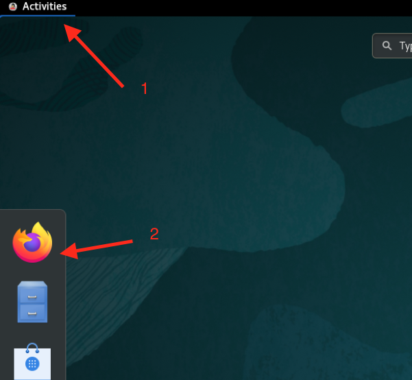
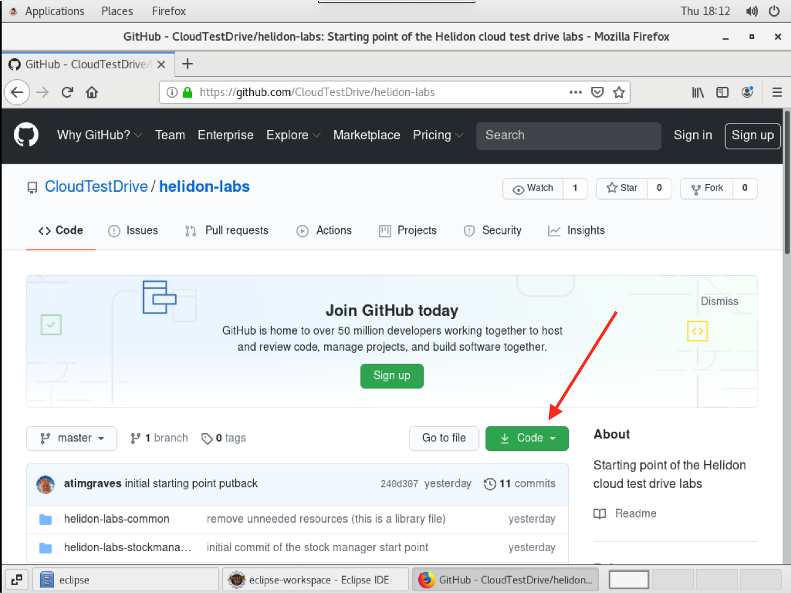
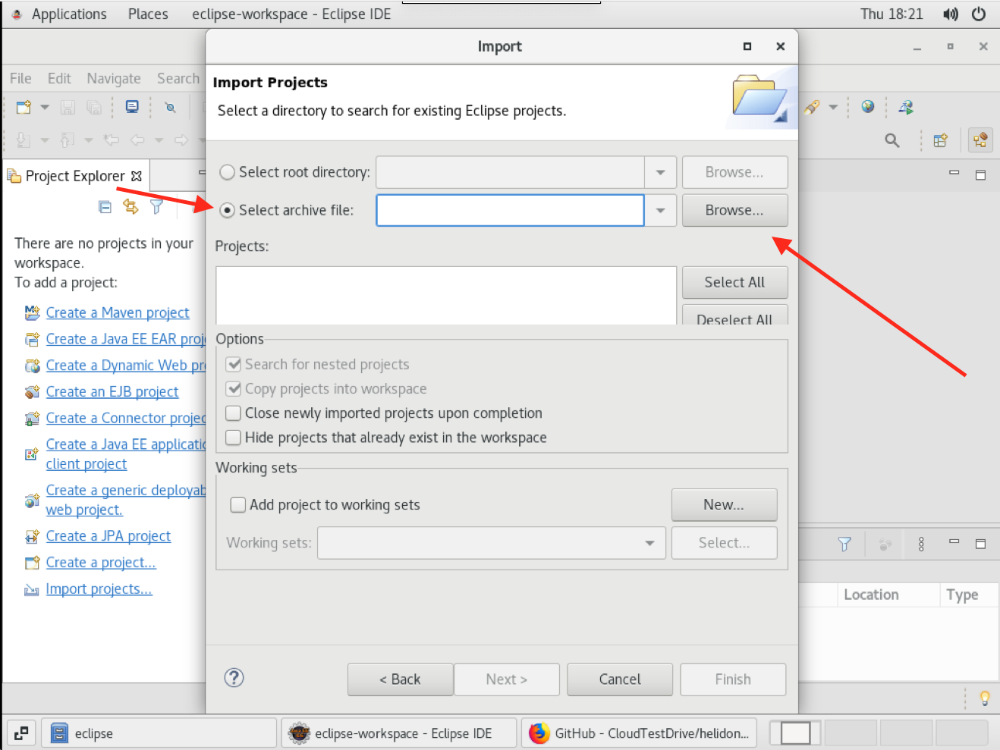
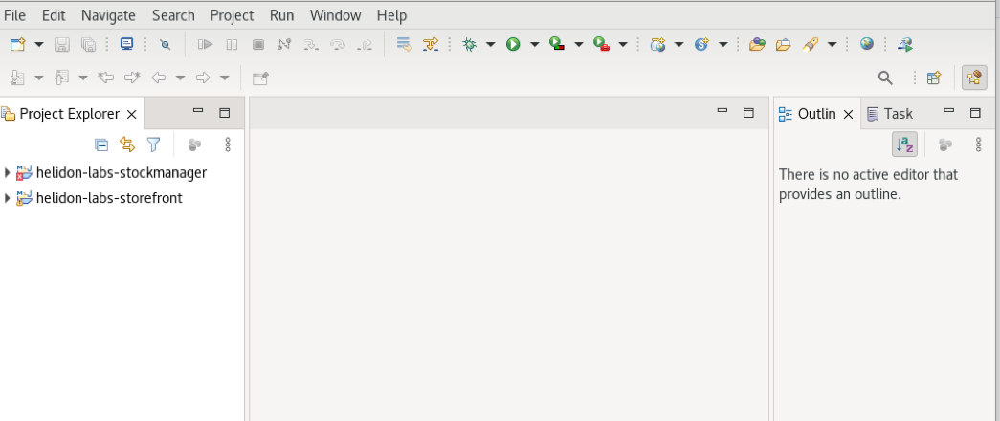
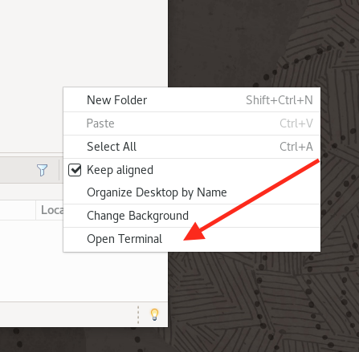

# Cloud Native - Configure your Developer VM for the Helidon labs

## Introduction

**Estimated module duration** 10 mins.

### Objectives

This module takes you through the process of setting up your development virtual machine and loading the template code to do the Helidon and Docker labs

### Prerequisites

You need to have completed the tasks in the **Setting up your tenancy** module.

## Task 1: Configuring the VM hosts file.

To make it easier to switch to the Kubernetes environment we are using hostnames rather than IP addresses to locate the various services.

The cloud-native-support project you downloaded during the initial setup has a script that will do this for you.

  1. Open a terminal by clicking the **Activities** m enu on the upper left of your VNC window, then the terminal icon

  

  2. In the terminal switch to the script directory

  - `cd $HOME/cloud-native-setup/cloud-native-setup/scripts/helidon-basics`

  3. Run the script to update the hosts file

  - `bash add-helidon-basics-hosts.sh`

  ```
Testing if zipkin is in /etc/hosts
Updating hosts file to add zipkin as localhost aliases
Added zipkin to /etc/hosts
Testing if stockmanager is in /etc/hosts
Updating hosts file to add stockmanager as localhost aliases
Added stockmanager to /etc/hosts
Testing if storefront is in /etc/hosts
Updating hosts file to add storefront as localhost aliases
Added storefront to /etc/hosts
```

The script will update the host file. Note that in some versions of the VM these entries already exist, in which case the script will just confirm they are present and won't make any modifications.

  4. Close the terminal using the `x` on the windows upper right corner.

Please **do not** run any other scripts you may find in these directories until instructed to do so, or you may end up with your environment in an unexpected state!

## Task 2: Importing our template code

To save you from having to completely create all of the Eclipse projects and classes from the beginning we have created some template code which you will use as a starting point. This needs to be imported into Eclipse.

### Task 2a. Downloading the code zip file.

  1. In the **virtual machine** open the Firefox web browser in the virtual machine - Click **Activities** on thge upper left of the VNC window, then click the **Firefox** icon 

  

  2. In the browser **in the virtual machine** go to the URL `https://github.com/CloudTestDrive/helidon-labs`

  3. Click the `Code` button

  

  4. Click the `Download ZIP` option

  

  5. If a save options menu is displayed Click the `Save file` option, then `OK`

  

When the download is complete the Firefox download icon will turn completely blue

  

### Task 2b. Importing the downloaded zip file

  1. Switch back to Eclipse

  2. Click the `File` menu, then `Import`

  

  3. Open the `General` node, then chose the `Existing projects into Workspace` option. Click `Next`

  

  4. Chose the `Select archive file` radio button, then click `Browse` on that row

  

  5. On the left menu chose `Downloads` then in the resulting list chose the download you just made - it should be called `helidon-labs-master.zip` Note that though the image here only shows a single file in your downloads there may be other files (the setup and DB wallet for example) depending on which other steps you have already done.

  6. Click the `Open` button

  

  7. Click `Select All` to make sure all the projects are imported (the list of projects may differ slightly from that shown in the example below), then click the `Finish` button

  

Eclipse will import the projects and start importing the Maven dependencies. Note that depending on the steps you have already taken you may see other projects in the projects list.

  

This may take a few mins. **Do not worry if you see errors during this process** (usually indicated by a white cross in a red box, as seem by the helidon-labs-stockmanager projectr in the above image). These are to be expected as Eclipse imports the code, then updates the Maven configuration and other elements. Once the building indicator (lower right) has gone away the errors should have gone. Expect to see yellow warning triangles though - these are telling about unused code that we will be completing during the lab modules.

## Task 3: Configuring to use the Wallet file

When you setup the VM the database Wallet file will have been downloaded to $HOME/Downloads, we want to place it in the right location for the labs and with the right name. It is **very** important that you follow the exact instructions below to ensure you are in the right directory as otherwise you may delete the lab files!

Note that these instructions assume you configured the Eclipse workspace in the location we told you to. If you don't have a $HOME/workspace adjust the steps below to reflect where your workspace is.

You need to open a terminal window in the Development VM

  1. Click **right** on the red background of the desktop in the development VM (you may need to shrink or move other windows to get this.

  2. In the popup menu chose `Open Terminal`

  

  3. Delete any existing wallet information
  
  - `rm -rf $HOME/workspace/helidon-labs-stockmanager/Wallet_ATP`

  4. Create a new wallet directory
  
  - `mkdir -p $HOME/workspace/helidon-labs-stockmanager/Wallet_ATP`

  5. Navigate to the stock manager folder
  
  - `cd $HOME/workspace/helidon-labs-stockmanager/Wallet_ATP`

  6. Copy the downloaded wallet file from the downloads to the folder (we're copying rather than moving so it will remain in Downloads ready to be used in other lab modules)
  
  - `cp $HOME/Downloads/Wallet_*.zip .`

  7. Unpack the wallet 
  
  - `unzip Wallet_*.zip`

We now need to locate the wallet connection details.

  8. Look at the contents of the tnsnames.ora file to get the database connection name

  - `cat tnsnames.ora`

  ```
  tg_high = (description= (retry_count=20)(retry_delay=3)(address=(protocol=tcps)(port=1522)(host=adb.eu-frankfurt-1.oraclecloud.com))(connect_data=(service_name=cgipkrq1hwcdlkv_tg_high.atp.oraclecloud.com))(security=(ssl_ser
  ver_cert_dn="CN=adwc.eucom-central-1.oraclecloud.com,OU=Oracle BMCS FRANKFURT,O=Oracle Corporation,L=Redwood City,ST=California,C=US")))
  
  tg_low = (description= (retry_count=20)(retry_delay=3)(address=(protocol=tcps)(port=1522)(host=adb.eu-frankfurt-1.oraclecloud.com))(connect_data=(service_name=cgipkrq1hwcdlkv_tg_low.atp.oraclecloud.com))(security=(ssl_serve
  r_cert_dn="CN=adwc.eucom-central-1.oraclecloud.com,OU=Oracle BMCS FRANKFURT,O=Oracle Corporation,L=Redwood City,ST=California,C=US")))
  
  tg_medium = (description= (retry_count=20)(retry_delay=3)(address=(protocol=tcps)(port=1522)(host=adb.eu-frankfurt-1.oraclecloud.com))(connect_data=(service_name=cgipkrq1hwcdlkv_tg_medium.atp.oraclecloud.com))(security=(ssl
  _server_cert_dn="CN=adwc.eucom-central-1.oraclecloud.com,OU=Oracle BMCS FRANKFURT,O=Oracle Corporation,L=Redwood City,ST=California,C=US")))
  
  tg_tp = (description= (retry_count=20)(retry_delay=3)(address=(protocol=tcps)(port=1522)(host=adb.eu-frankfurt-1.oraclecloud.com))(connect_data=(service_name=cgipkrq1hwcdlkv_tg_tp.atp.oraclecloud.com))(security=(ssl_server_
  cert_dn="CN=adwc.eucom-central-1.oraclecloud.com,OU=Oracle BMCS FRANKFURT,O=Oracle Corporation,L=Redwood City,ST=California,C=US")))
  
  tg_tpurgent = (description= (retry_count=20)(retry_delay=3)(address=(protocol=tcps)(port=1522)(host=adb.eu-frankfurt-1.oraclecloud.com))(connect_data=(service_name=cgipkrq1hwcdlkv_tg_tpurgent.atp.oraclecloud.com))(security=
  (ssl_server_cert_dn="CN=adwc.eucom-central-1.oraclecloud.com,OU=Oracle BMCS FRANKFURT,O=Oracle Corporation,L=Redwood City,ST=California,C=US")))
  ```

  9. Locate the "high" connection and take a note of the name, in the example above this is tg_high **Your file will contain different names**

  10. Be sure to write down the database connection name you have just found, you will need it later


## End of the setup

Congratulations, you have successfully setup your VM with the template code. You can now start on the **Core Helidon** module.

## Acknowledgements

* **Author** - Tim Graves, Cloud Native Solutions Architect, EMEA OCI Centre of Excellence
* **Author** - Jan Leemans, Director Business Development, EMEA Divisional Technology
* **Last Updated By** - Tim Graves, November 2020

