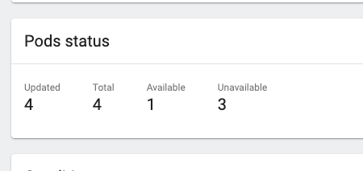
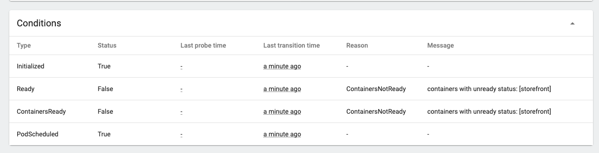
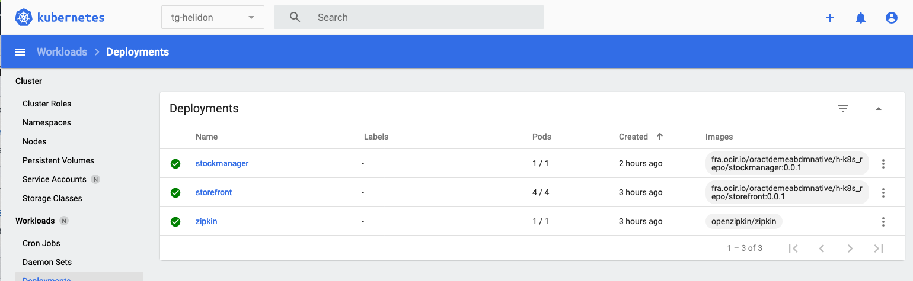
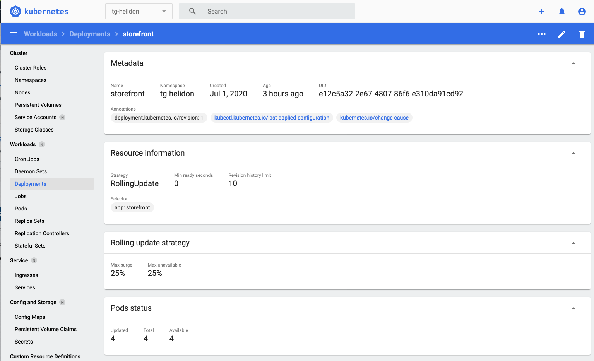

# Cloud Native - Horizontal Scaling manually

<details><summary><b>Self guided student - video introduction</b></summary>


This video is an introduction to the Kubernetes horizontal scaling lab. Depending on your browser settings it may open in this tab / window or open a new one. Once you've watched it please return to this page to continue the labs.

[](https://youtu.be/1hIQ5TRPt-M "Kubernetes horizontal scaling lab introduction video")

---

</details>

## Introduction

This is one of the core Kubernetes labs

**Estimated module duration** 20 mins.

### Objectives

This module explores how you can use Kubernetes to easily change the number of pods providing your service.

### Prerequisites

You need to complete the **Cloud native with Kubernetes** module.


## Task 1: Manual scaling

In most cases a microservice is horizontally scalable, at least if the services were developed using the principles defined in [The 12 factors](https://12factor.net/)

Kubernetes has built in support for easily managing the horizontal scaling of services.

In many of the labs when you've looked at the contents of the namespace you'll have seen things called replica sets, and may have wondered what they are. We can get this info using kubectl. 

  1. Let's look at the replica sets. In the OCI Cloud Shell, type
  
  -  `kubectl get all`

  ```
NAME                                READY   STATUS    RESTARTS   AGE
pod/stockmanager-6456cfd8b6-4mpl2   1/1     Running   0          118m
pod/storefront-74cd999d8-dzl2n      1/1     Running   0          152m
pod/zipkin-88c48d8b9-vdn47          1/1     Running   0          152m

NAME                   TYPE        CLUSTER-IP      EXTERNAL-IP   PORT(S)             AGE
service/stockmanager   ClusterIP   10.100.65.58    <none>        8081/TCP,9081/TCP   7h14m
service/storefront     ClusterIP   10.96.237.252   <none>        8080/TCP,9080/TCP   7h14m
service/zipkin         ClusterIP   10.104.81.126   <none>        9411/TCP            7h14m

NAME                           READY   UP-TO-DATE   AVAILABLE   AGE
deployment.apps/stockmanager   1/1     1            1           118m
deployment.apps/storefront     1/1     1            1           152m
deployment.apps/zipkin         1/1     1            1           152m

NAME                                      DESIRED   CURRENT   READY   AGE
replicaset.apps/stockmanager-6456cfd8b6   1         1         1       118m
replicaset.apps/storefront-74cd999d8      1         1         1       152m
replicaset.apps/zipkin-88c48d8b9          1         1         1       152m
```

You can see that there is a replica set for each deployment. They are actually implicitly defined in the deployment yaml files, though they don't have an explicit section the `replicas : 1` line tells the Kubernetes deployment to automatically create a replica set for us with one of the pods (as the pod is described later in the file). If we hadn't specified the `replicas : 1` line it defaults to a single pod. Kubernetes will create a replica set automatically for us with a single pod for each deployment, and as we've seen in the health, liveness and readiness labs if there is a problem it will automatically restart the services so that there is one service available.

<details><summary><b>Deployments vs replica sets</b></summary>

In Kubernetes a deployment defines the micro-service, this is regardless of the service version.

A replica set manages a specific number of replicas for a specific version.

This is especially useful for things like rolling upgrades as we will see in that section.

---

</details>

We can if we want modify the number of replicas in the deployment by modifying the YAML and then re-applying it, or of course we could use the kubectl scale command to do it as well, but for this lab we're going to use the dashbaord.

  2. Open the dashboard and switch to your namespace (tg-helidon in my case) 

  3. In the left menu under the **Workloads** section chose **Deployments**

  

(I know you can go direct to the replica sets, but I want to show how they are connected to the deployments)

You can see our three deployments (Zipkin, storefront and stock manager) and in the Pods column we can see that each has 1 / 1 pods (So one pod running out of a requested one pod to run). 

  4. Click on the `storefront` deployment for more details.

  

  5. We'll see the details of the deployment, scroll down a bit to get to the **Replica sets** section

  

In the **New replica set** section we can see details of the current replica set, there is nothing in the **Old Replica Sets** section as we haven't made any rolling updates, we'll do that later in the lab.

  6. In the **New replica set** section if we click on the replica set name we can see the details of it

  

In the **Pod Status** section we can see that there is 1 pod running out of 1 pod desired.

  7. Go back to the storefront deployment.

Scaling the deployment is simple, :

  8. Click on the **Scale** Icon on the upper right of the deployment page 
  
  9. In the new pop up enter the desired number of pods you want. Enter 4

  

  10.  Click the **Scale** button

Kubernetes immediately gets to work creating new pods for us, you can see this in the pod status section of the page

  

<details><summary><b>Changing the number of replicas using kubectl</b></summary>

We can of course change the number of replicas using kubectl as well (it's just more visual using the dashboard)

To do this we can find out the current number of replicas in a deployment. Note that we operate at the deployment, not the replica set. If you tried changing the number in the replica set then you'll find that the deployment will come along and almost instantly reset the count to what the deployment thinks it should be, regardless of what you just told the replica set (I know this doesn't seem right when you first look at it, but it's sensible if you consider what happens in situations like a rolling update, more on which later).

The following is an example showing how it could be done, please just look at these, but follow the lab and in this section only make changes in the dashboard.

First you would find out how many replicas you have in your deployment

```
$ kubectl get deployments
NAME           READY   UP-TO-DATE   AVAILABLE   AGE
stockmanager   1/1     1            1           4d2h
storefront     1/1     1            1           4d1h
zipkin         1/1     1            1           4d2h
```

Then you'd modify the number of replicas in the deployment, in this case to 2 replicas

```
$ kubectl scale --replicas=2 deployment storefront
deployment.apps/storefront scaled
```

Then you'd see how the upgrade was going

```
kubectl get deployments
NAME           READY   UP-TO-DATE   AVAILABLE   AGE
stockmanager   1/1     1            1           4d2h
storefront     1/2     2            2           4d1h
zipkin         1/1     1            1           4d2h
```

Notice that the deployment now says 1/2 meaning there is one running pod, but 2 are required. The reason we don't see both as being ready is because one is probably waiting for it's readiness checks to start running.

---

</details>

  11. Scroll down to the **Replica sets** section of the deployment

  

And if we drill down into the replica set we can see the pods themselves being created

  12. Click on the replica set name

  

Notice that most of these have a grey partially complete "pie graph" at the start of the line. That means that the pod is in the process of starting up (probably pulling the image). On your screen you may have a red warning circle, that means that the pod has started, but is not yet ready (I.e. the readiness probe is failing). The green check is on the original pod, which was of course running before we started the scaling operation. The Service will send requests to the pods marked green

Remember that the storefront uses a readiness probe, so it may be a while before those pods are reporting ready.

  13. Click on the pod name of a pod that is not yet ready, Look at the **Conditions** section.

  

You can see the details of the startup process, in this case the pod is not ready because the container within it is not yet ready.

After a short while the pod will become ready


Once they are ready return to the replica set

  14. Click the replica set name in the controlled by section (storefront-579968f88b in this case)

  

That returns you to the replica set page, you can see that they will show up in the replica set as ready 

  15. I had to scroll down a little to get this image

  

  16. If you scroll down in the replica set page you'll see the **Events** section, and can see the pods have been created.

  

And if we go back to the deployments list we'll see the pods is now 4 of 4 ready

  17. Click **Deployments** on the left menu

  

There are 4/4 pods for the storefront deployment. Let's go to the storefront deployment 

  18. - Click the `storefront` deployment in the list

  

In the pods section we can see that we have 4 pods

  19. If on the deployments page we scroll down to the **Events** section and see the list of events for that deployment, our scaling event is there!
  

If you are on a Kubernetes cluster with multiple physical nodes the scaling operation will try and place the pods on different nodes, protecting the service so if one node fails for any reason the other nodes can still be used to provide the service.

<details><summary><b>Why scale the deployment, not the replica set ?</b></summary>

Kubernetes technically supports scaling on the replica set as well as the deployment, however what actually controls the scaling is the replication controller. If you try and change the number of replicas directly in the replica set it will (briefly) make the change. 

Unfortunately the replication controller that is connected to the deployment doesn't pick up on changes to the replica set, only to the deployment, so the deployment replication controller will recognize the change in pods and will immediately try and correct the situation and revert the change.

I don't know why you can even scale a replica set in this situation, but I suspect that this is some kind of historical hold-over.

---

</details>

## Task 2: Reset the count

- To prepare for the following lab sections please go back to the storefront deployment and follow the approach described above to scale it back down to a single pod.

## End of the module, what's next ?

You have reached the end of this section of the lab. The next module is `Auto scaling`

## Acknowledgements

* **Author** - Tim Graves, Cloud Native Solutions Architect, EMEA OCI Centre of Excellence
* **Contributor** - Jan Leemans, Director Business Development, EMEA Divisional Technology
* **Last Updated By** - Tim Graves, November 2020
