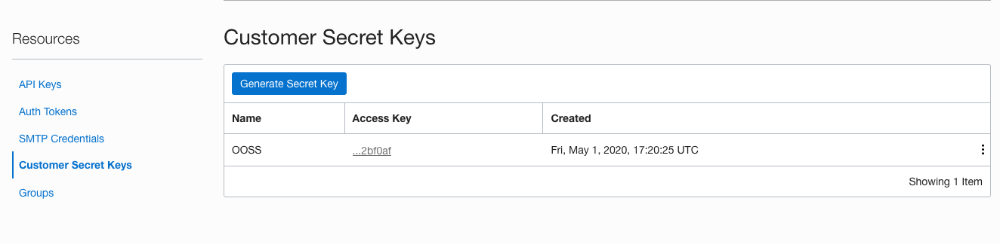
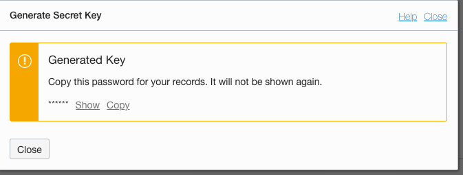
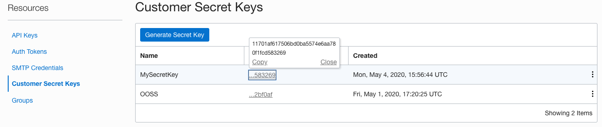
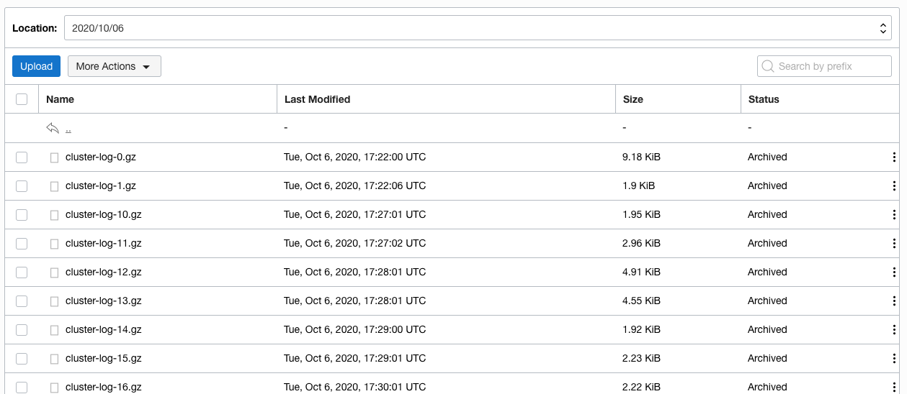
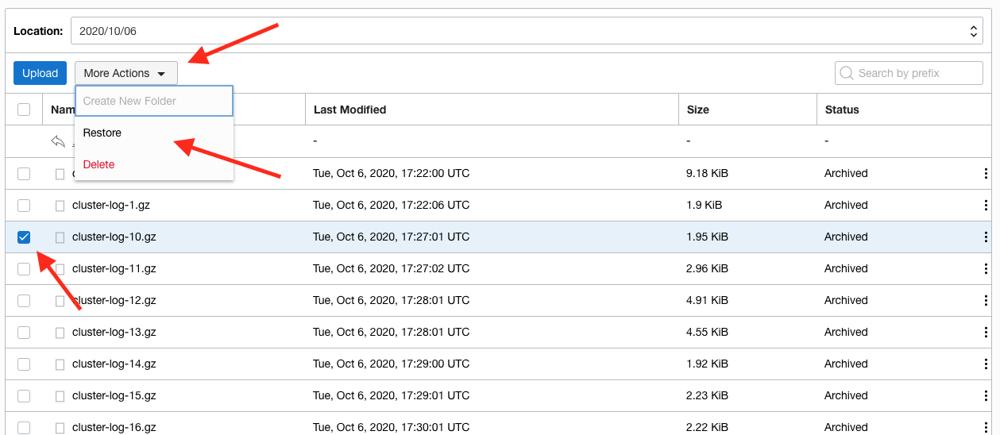
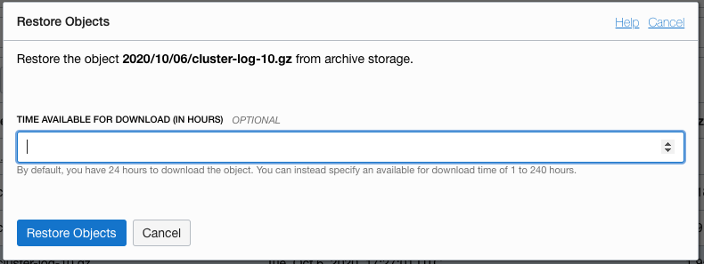
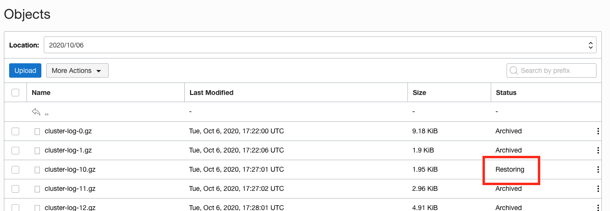
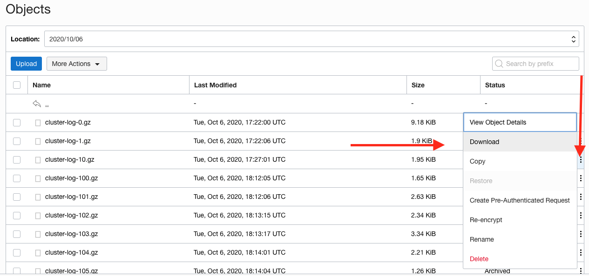
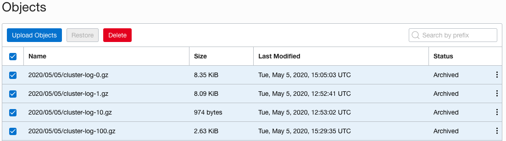

# Cloud Native - Log Capture for Archive

<details><summary><b>Self guided student - video introduction</b></summary>


This video is an introduction to the Log Capture for archive labs. Depending on your browser settings it may open in this tab / window or open a new one. Once you've watched it please return to this page to continue the labs.
[](https://youtu.be/lqsq1RtsV28 "Kubernetes log capture for archive video")

---

</details>

## Introduction

This is one of the optional sets of Kubernetes labs

**Estimated module duration** 20 mins.

### Objectives

This module shows how to install and configure the log capture tool Fluentd, and write data to the Oracle Object Storage service archive for long term retention of the log data.

### Prerequisites

You need to complete the **Rolling update** module (last of the core Kubernetes labs modules). You can have done any of the other optional module sets. The **log capture for processing** module is also optional.

## Task 1: Capturing data to archive it

<details><summary><b>The problem with log data in a distributed cloud native environment</b></summary>


Many applications generate log data, in the case of Java programs this is usually achieved by a logging library, in the case of the Helidon parts of the labs we have used the Simple Logging Facade (The @slf4j Lombok annotation in the code) which allows us to easily switch the actuall logging engine being used. Other languages also have their own logging frameworks, for example in Ruby there is the Logger class, and in there are open source libraries like log4c.

Most Unix (and Linux) systems provide support for syslogd which enables system operations as well as code to generate log messages.

The problem is that the output of the log messages is not always consistent, for example syslogd writes it's data to a system directory and most code logging frameworks have many different output mechanisms including files, the system console, and also standard output.

To make things even more complicated there are many different output formats, plain ASCII is common, but json, xml are often used. Even something as simple as the date / time is often specified by the authors of the code itself and is in their local format (it's rare to see a log event using seconds / milliseconds as per Unix / Java time)

All of these options make logging complicated, where to capture the data and what it looks like make it very difficult to have consistent logging, and given that micro-service based architectures are often deployed using micro-services from many locations and in many programming languages this is a problem.

Fortunately the 12 factors has a [simple recommendation on logging](https://12factor.net/logs) that addresses at least some of these problems. The recommendation is that logs should be treated as a stream of data being sent to the applications standard out, and that the rest of the process is a problem for the execution environment.

As part of its design Kubernetes does save all the information sent by a pod to its standard out, and we have seen this when we look at the logs for a pod, we did this earlier on when we used the dashboard to have a log at the logs, and also the command `kubectl logs <pod> -n <namespace>` let's us see the logs (use `-f` to "follow" the log as new information is added)

This is good, but with in a distributed architecture a single request may (almost certainly will) be processed by multiple individual micro-services. We've seen how zipkin can be used to generate trace data as a request traverses multiple micro-services, but how can integrate the log data ?

---

</details>


Sometimes you want to save log data in the longer term, possibly for legal reasons. While the initial part of the process is similar the approach used for capturing log data for processing the storage structure needed for long term storage of data is usually very different from that needed for the analysis of the data. This is especially true if the chance is high that the data will not ever be used ("Write Only Data") where you need to meet the obligations to store it, but are focused on the costs or saving and storing, and the cost of a very occasional retrieval is less important. For example it may be considered very reasonable to not index log data that is in being held for long term storage, but only group it in large chunks, say one chunk per day) understanding that if data is needed that the entire days data may need to be processed, but accepting the cost of doing that as it's less than the overhead of creating and maintaining an index with a higher resolution.

We're going to now look at how to extract data and save it to a storage service. This section is based on [this blog entry created by Ankit Bansal](http://www.ankitbansal.net/centralized-logging-in-oracle-kubernetes-engine-with-object-storage/#) but modified to fit in with the specific environment of the lab and to split the configuration of the storage from the fluentd basic configuration.

Note, if you have the fluentd configuration setup monitoring to Elastic Search you can leave that running if you like. It is of course consuming resources, but there are situations where you may want long term storage of log data as well as short term analytics. 

## Task 2: Create the logging namespace

If you  did not do the capture log for processing, or deleted the logging namespace at the end of that module you will need to create a namespace for this module.

As with elsewhere in the labs we do this module in it's own namespace. 

  1. In the cloud console type 
  
  - `kubectl create namespace logging`
  
  ```
namespace/logging created
```

If the namespace already exists this command will report : `Error from server (AlreadyExists): namespaces "logging" already exists`

## Task 3: Storing the log data

Kubernetes writes the log data it captures to files on the host that's running the node. To get the data we therefore need to run a program on every node that accesses the log files and sends them to the storage.

So far we've just asked Kubernetes to create deployments / replica sets / pods and it's determined the node they will run based on the best balance of availability and resources, how do we ensure that we can run a service in each node ? 

Well the daemonset in Kubernetes allows the definition of a pod that will run on every node in the cluster, we just have to define the daemonset and the template of the pod that's going to do the work and Kubernetes will deal with the rest, ensuring that even if nodes are added or removed that a pod matching the daemonset definition is running on the node.

<details><summary><b>Other benefits of using daemon sets</b></summary>

The daemon set is a separate pod, running with it's own set of resources, thus while it does consume resources at the node and cluster level it doesn't impact the performance of the pods it's extracting log data for.

Additionally the daemon set can look at the log data for all of the pods in the node, if we did the logging within a pod (say by replacing the log processor or your micro-service) then you'd have to modify every pod, but by logging it to standard out and using a deamonset you can capture the data of all of the logs at the same time, and only need to make changes in a single place.

---

</details>

Why run the data gathering in a pod ? Well why not ? While we could run the data capture process by hand manually on each node then we'd have to worry about stopping and starting the service, restarting if it fails, managing and updating configuration files and so on. If we just run it in a Kubernetes pod we can let Kubernetes do all of it's magic for us and we can focus on defining the capture process, and leave running it to Kubernetes! 

How will our capture pod get the log data though ? We've seen previously how we can use volumes to bring in a config map or secret to a pod and make it look like it's part of the local file system, well there are several other types of source for a volume (in the Prometheus section we briefly saw how helm setup an external storage object as a volume for storing the data). One of the volume types provides the ability to bring in a local file system, in this case in the node as part of the pods file structure.

Fluentd is an open source solution to processing the log data, it's basically an engine, reading data from input sources and sending them to output sources (that's more complicated than you'd think when dealing with potentially large numbers of high volume sources). it supports multiple input sources, including reading log files saved from the containers by Kubernetes (imported from the node into the pods via a volume) It also supports many output types.

We will be using one of the built in output plug-ins of Fluentd that allows us to write to storage solutions that provide a Amazon Simple Storage Service (S3) compatible interface. In this case we will be writing the data to the Oracle Object Storage Service, but you could of course use other compatible services.

### Task 3a: Gathering the required information

The first thing we need to do is to gather a bit of data about the storage service to configure the fluentd output plugin.

We need to provide five pieces of information, The region ID and the storage service endpoint URL. The keys (Secret and public) that as a pair give access to the storage API and the name of the storage bucket to hold the saved data.

We also need to specify what OCI Compartment the data will be stored in - S3 does not have the concept of compartments, so as we're using the Oracle Object Storage S3 compatible API we need to specify the compartment to be used when the data arrives.

We will gather a number of bits of information here, **please save it** in a text editor or notepad for later use!

Firstly let's get the OCI Region details.

  1. On the upper right of the OCI browser UI you will see the name of **your** current region

  

In the example above this is Germany Central (Frankfurt) **but yours may vary**

However we need the region ID, not the name

  2. Click on the name you will get a list of regions enabled for your tenancy.

  

  3. Click the **Manage Regions** button to get a list of the infrastructure regions, along with their details
  
  

Regions that are enabled for **your** tenancy are in green, the ones in grey are not enabled.

  4. Locate **your** region in the list (it will have a green region icon) Then locate the region identifier, these are the details for the region I'm using Frankfurt in Germany.

  

We can see here that the region identifier for Frankfurt (the region I'm using) is `eu-frankfurt-1` **your region identifier will be different if you are not in this region**

Next we need to get the storage endpoint this is of the form `https://<object storage namespace>.compat.objectstorage.<region identifier>.oraclecloud.com` Obviously we need to determine the value of `<object storage namespace>` (you have just retrieved the region identifier)

  5. In the upper right of the screen you can access your tenancy details.

  

  6. Click on the little "shadow" of a person to access your profile.

  

  7. Click on the tenancy name (oractdemeabdnmative in this case) to access the tenancy details

  

In this case in the Object Storage Settings you can see that the `Object Storage Namespace` is `oractdemeabdmnative` It will be different in other tenancies. This particular tenancy is quite old which is why the storage namespace is the same as the tenancy name, recent tenancies have a storage namespace that is a set of random letters and numbers.

The object storage endpoint is `https://<object storage namespace>.compat.objectstorage.<region identifier>.oraclecloud.com` Replace `<object storage namespace>` with the value you've just retrieved and `<region identifier>` with the value you gathered earlier.

For example **FOR MY TENANCY, YOURS WILL VARY** it might be  `https://oractdemeabdmnative.compat.objectstorage.eu-frankfurt-1.oraclecloud.com`

  8. Save the Object Storage Service endpoint in your texteditor for later use.

  9. Note the value for the `Amazon S3 Compatibility API Designated Compartment:` (`JAM` in this case)

This is the OCI compartment that will be used to hold the storage bucket. In this case the compartment is named `JAM` If there is no compartment shown then the storage bucket will be created in the root compartment. If you want to change that (only do this if this is your tenancy, if it belongs to your organization then make sure your tenancy admin is OK with you changing it as you might break other things) then click the `Edit Object Storage Settings` and chose another compartment (if this is a new tenancy you may only have the root compartment).

**Important** You need to have rights to create storage objects in the compatibility compartment, If this is a trial tenancy then you will be operating as the tenancy administrator, if it's a commercial tenancy you may need to check with your admins to ensure you have the appropriate rights.

We need to have security keys to access the S3 compliant storage API. Access those from the User details. 

  10. Click on the little "shadow" of a person to access your profile.

  

  11. Click on your name (in this case oracleidentitycloudservice/tim.graves) to go to your account details.

  12. Locate the resources section, this is on the lower left of the page (you may need to scroll down to see it

  

  13. Click on the **Customer Secret Keys** in the resources section.

The table changes to showing the **Customer Secret Keys** table

  

In this case there is already one Customer secret key for my account.

Note, if you have already generated a Customer Secret Key for another reason (you may have been doing a different lab) and you still have both the key and the secret, then you can re-use those values. You only need to do this if you do not have the information for a secret key you've previously generated.

To generate a new Customer Secret Key 

  14. Click the generate secret key button. 

  

  15. Provide a name that you'll be able to remember, in this case I'm using `MySecretKey` but you chose your own

  16. Click the **Generate Secret Key** button, to get the system to generate a key pair for you.

  

**VITALLY IMPORTANT**

  17. Click the **Copy** link to copy the secret key, be sure to paste it into a texteditor or somewhere safe (this is a secret key, so it needs to be protected against access). **You cannot retrieve it at any point once this popup is closed** 

  18. **ONLY** after you'ce copied and saved the secret key click the **Close** button

  

You'll see the newly generated key in the list (remember in this case I had an existing key, you may not have in which case you'll only see the key you just generated)

You now need to get the access key (this is the other part of the generated key pair)

  19. Click on the **Access key** for the key you just generated, if you have multiple keys remember to chose the key you just generated (the name you chose will help you)

  

  20. Click on the **Copy** link to get a copy of the key, save this in a text editor or something.

You have now gathered the information we need to write data into the Object Storage Service.

### Task 3b: Create the storage bucket to hold the logs

You can let the S3 integration just create the storage bucket, but the scenario we are looking at here is for the long term retention of the log data for occasional access, in that case you want the cheapest possible storage, and for that you need the archive storage tier for the storage bucket. This is not the default tier so it needs to be set when the Oracle Object Storage Service bucket is created. The archive tier does mean that there is a delay to retrieve the data (Archive after all is about long term efficient storage of the data) so if you were planning on doing something with the data directly (For example uploading into the Oracle log analytics service) as you'd be transferring them once they were uploaded to the storage service, and probably only retaining them for a short while after that you would use the standard tier.

<details><summary><b>What's the difference between Standard and Archive tiers?</b></summary>


The **Standard** storage tier is designed for immediate access, the **Archive** tier is designed for infrequent access, may have a time delay (up to an hour) between requesting and being able to access the data. There is a significant cost difference between the two storage tiers, at the time of writing this document (early May 2020)  for the Object storage service data in the archive tier was 1/10th the cost of standard tier in terms of GB data stored / month.

Though it is an implementation detail (and I genuinely don't know if this is the case or not) it is highly likely that data placed in archive storage is actually held on magnetic tape, not disk. To make the data available for access the tape must be loaded into a tape drive from it's slot in the tape library (and there may be a delay for a tape drive to be available). Then the tape drivers has to wind the tape to the right position to read the data (think of the old cassete tapes you may have has in your car when you wanted to locate a particular song - tapes are linear access devices, **not** true random access devices). Then the drive has to read the data into a cache to make it available for access. All of this takes time and if you want to load data on a tape that is currently being used to write other data then you will also have to wait for the current write operations to complete before the tape can be repositioned to access your data. Thus there are several reasons why it can take a while to make archive data available for retrieval. For more information on tape libraries (the large libraries are impressive beasts and can hold over 100,000 tapes each).

In both cases the data is encrypted at rest, and is protected via the use of multiple copies and checksums.

---

</details>

Here we're using the archive tier as that's the most cost effective for long term data retention, but if you were writing the data to storage on a temporary basis (maybe you are using [Oracle Log Analytics](https://www.oracle.com/cloud/systems-management/log-analytics.html) and have configured it to load the data from storage once a day) then there is no point in using the archive tier as don't want the delay to retrieve the data and as you'd be wiping them every day once they were uploaded you would use the standard tier.

Let's create our storage bucket. 

  1. Log in to the OCI console in your web browser

  2. Click on the "Hamburger" menu, then in the **Core Infastructure** section click on **Object Storage** then **Object Storage** 

  

This will take you to the storage service page

  

  3. Make sure in the compartments list you have selected the compartment used for the Amazon S3 Compatibility (this was shown in the tenancy details earlier). This may be `root` if there isn't a S3 compatibility compartment specified for the tenancy

You will now see a list of buckets in this compartment, In this case there is just one called `TG` In your tenancy there may be a zero or more existing buckets.

  

We're going to create a new bucket set for archive storage

  4. Click the **Create Bucket** button.

  5. In the popup name the bucket `<YOUR INITIALS>-FLUENTD` For fluentd to write to this bucket the name **must** be entirely in UPPER CASE and you **must** replace <YOUR INITIALS> with something unique to you!

  6. Change the storage tier option to **archive**

  

  7. Click the **Create Bucket** button

Note, if the bucket name must be unique across your entire tenancy in the region, if it's not (even if the other bucket is in a different compartment) you will not be able to create it and will have to try again using a different name.

You will now see the list of buckets in your compartment. Remember that in my case the `TG` bucket existed previously, so there are two shown here.

  

Note that the storage tier for the new bucket (named TG-FLUENTD in this case **but yours will vary**) is **Archive** This means all data will be held in a long term storage model which is much cheaper, but may take time to become available when requested.

### Task 3c: Configuring the log monitoring process.

  1. In the OCI Cloud shell Change to the logging folder.
  
  - `cd $HOME/helidon-kubernetes/management/logging`

There are a several of yaml files that we will use. These will all be applied in the `logging` namespace

The `fluentd-to-ooss-configmap.yaml` file defines a configuration map representing the basic configuration for fluentd, in this case it tells it to use the S3 compatible output for all log data. This is mounted into the pod as the the `fluentd.conf` file. This config map brings in some of the environment variables that are defined in the `fluentd-s3-configmap` and processed when the `fluentd-daemonset-oss-rbac.yaml` is applied and the logs start. Kubernetes uses the syntax `"#{ENV['SWITCH_LOG_FILE_INTERVAL']}"` to identify that the environment variable needs to be substituted.

The `fluentd-s3-configmap.yaml` contains a config map with the specific settings we will be using (these are what you gathered above) which are applied to the environment variables inside the pod. You will need to edit this to hold the values you gathered.

The `fluentd-daemonset-oss-rbac.yaml` configures the cluster role, service account, binding between the two and also the details of the daemonset that gathers the log data and writes it to the S3 compatible storage service. The daemon set uses the values that are set in the `fluentd-s3-configmap.yaml` for it's environment variables (look at the file for the details of how the environment variables are defined in terms of config map entries). This means we won't need to change the daemon set configuration / it's yaml file if we want to change those settings.

**IMPORTANT** In Kubernetes 1.20 the default container engine switched from Docker to CRI-O, Docker logs were written in JSON format, wheras CRI-O uses a format called Logrus.

This lab module has been updated to work with the 1.20 CRI-O log format, but if you are using a version of Kubernetes with Docker as the container engine (Kubernetes removed Docker support in 1.20, so this is probabaly 1.19 or earlier) you will need to modify the `fluentd-daemonset-oss-rbac.yaml` and remove the following lines in the container environment section.

```
          - name: FLUENT_CONTAINER_TAIL_PARSER_TYPE
            value: "cri"
          - name: FLUENT_CONTAINER_TAIL_PARSER_TIME_FORMAT
            value: "%Y-%m-%dT%H:%M:%S.%N%:z"
```

<details><summary><b>How does Kubernetes know where to get the environment variable values ?</b></summary>

The container template in the daemon set description has a section that allows the definition of environment variables. These can come from many different sources, including constant values, config maps and secrets.

As an example of the YAML uses that does this see the following small segment of this file

```yaml
    containers:
      - name: fluentd-to-ooss
        image: fluent/fluentd-kubernetes-daemonset:v1-debian-s3
        env:
          # Bring the values you're likely to need to customise in from the config map, thus limiting the number of places we are likely to need to make changes.   
          - name: SWITCH_LOG_FILE_INTERVAL
            valueFrom:
              configMapKeyRef:
                name: fluentd-s3-config
                key: SWITCH_LOG_FILE_INTERVAL
```

in the `env:` section we see the name of the environment variable (`SWITCH_LOG_FILE_INTERVAL` in this case) that it comes from the key `SWITCH_LOG_FILE_INTERVAL` which is in the config map called `fluentd-s3-config`

---

</details>

  1. You will need to edit the `fluentd-s3-configmap.yaml` file and update it with the values you gathered earlier. Remember to keep the values in double quotes.

  - ACCESS_KEY - This is the OCI access key

  - ACCESS_SECRET - This is the OCI secret key

  - REGION - The OCI Region

  - STORAGE_END_POINT - The object storage endpoint

  - BUCKET_NAME - The name of the bucket you created

Do not change the ROTATION_INTERVAL setting, leave that set to 60

The following is an **example** of the updated file. This specific example **will not work** in your tenancy, you will need to use the values you gathered for your tenancy.

```yaml
apiVersion: v1
kind: ConfigMap
metadata:
  name: fluentd-s3-config
  namespace: logging
data:
  ACCESS_KEY: "225c7ab16d07465e1234567e724863ea552e11b0"
  ACCESS_SECRET: "bgUdGT20T4KpFh5bkJR0pYBwxR4size2utj3f+W2mJ8="
  BUCKET_NAME: "TG-FLUENTD"
  REGION: "eu-frankfurt-1"
  STORAGE_END_POINT: "https://oractdemeabdmnative.compat.objectstorage.eu-frankfurt-1.oraclecloud.com"
  SWITCH_LOG_FILE_INTERVAL: "60"
```

<details><summary><b>What's the SWITCH_LOG_FILE_INTERVAL for?</b></summary>

The `SWITCH_LOG_FILE_INTERVAL` tells fluentd how often to switch to a new output file.

For lab purposes we have setup the configuration with a 60 second cycle on switching log files. This is to enable us to see output in a reasonable time (the files don't show up in the object storage until they have been written and closed, then the archiving process completed. In a normal situation this would be set to a much higher value, say 3600 seconds, so the log files would switch once an hour (so if you use this config file in a production environment remember to update the `SWITCH_LOG_FILE_INTERVAL` value to reflect your needs).

---

</details>

### Task 3d: Actually starting the log capture

First we will create the `fluentd-config-to-ooss` config map, this is in the `fluentd-to-ooss-configmap.yaml` This is the basic configuration of fluentd and tells it to output to the S3 service, it just used environment variable place holders for the actual setting details though, the Kubernetes runtime will replace those with the actual values from the environment when the configuration map is added to the pod as it starts.

  1. In the OCI Cloud Shell type 
  
  - `kubectl apply -f fluentd-to-ooss-configmap.yaml`

  ```
configmap/fluentd-config-to-ooss configured
```
<details><summary><b>Why didn't I need to specify a namespace ?</b></summary>


The namespace can be specified on the kubectl command line, in which case it would have looked like `kubectl apply -f fluentd-to-ooss-configmap.yaml --namespace logging` But to make the lab a little easier (and to reduce typing) I specified the namespace in the yaml file in the meta data section 

```yaml
apiVersion: v1
kind: ConfigMap
metadata:
  name: fluentd-s3-config
  namespace: logging
data:
```
---

</details>

Now let's apply the configuration settings specific to our environment we just setup. These are the settings used to setup the environment variables inside the the daemonset configuration

  2. In the OCI Cloud Shell type 
  
  - `kubectl apply -f fluentd-s3-configmap.yaml`
  
  ```
configmap/fluentd-s3-config configured
```

Finally let's start the daemonset itself

  3. In the OCI Cloud Shell type 
  
  - `kubectl apply -f fluentd-daemonset-ooss-rbac.yaml`

  ```
serviceaccount/fluentd-to-ooss created
clusterrole.rbac.authorization.k8s.io/fluentd-to-ooss created
clusterrolebinding.rbac.authorization.k8s.io/fluentd-to-ooss created
daemonset.apps/fluentd-to-ooss created
```
Let's make sure that everything has started

  4. In the OCI Cloud Shell type 
  
  - `kubectl get daemonsets -n logging`

```
NAME              DESIRED   CURRENT   READY   UP-TO-DATE   AVAILABLE   NODE SELECTOR   AGE
fluentd-to-ooss   2         2         2       2            2           <none>          88s
```

We can see that there are 2 instances running, this is because the cluster I am using has 2 nodes, and Kubernetes will ensure that there is a pod for each daemonset running on each node (restarting it on the same node if the pod crashes)

Let's get the specifics of the pods

  5. In the OCI Cloud Shell type 
  
  - `kubectl get pods -n logging`
  
```
NAME                                    READY   STATUS             RESTARTS   AGE
fluentd-to-ooss-fgx4s                   1/1     Running            0          55s
fluentd-to-ooss-frkrp                   1/1     Running            0          55s
```

In this case I had left the fluentd and elastic search instances running from the log capture for processing module running. This is why you can see a total of 6 fluentd pods running, three (fluentd-to-es) writing to Elastic Search (whcih itself has a number of pods) and three (fluentd-to-ooss) writing to Oracle Object Storage Service. If you have not done the log capture for processing lab (or tidies up after it) then you should only see three fluend based pods.

<details><summary><b>What's with the CrashLoopBackOff STATUS ?</b></summary>

You may occasionally see a fluentd pod with status CrashLoopBackOff, this is usually due to the pod having problems getting log data, it seems there is a problem in fluentd where it sometimes crashes on reading specific Kubernetes log files. Kubernetes of course recognises the failure and restarts the pod for us automatically, and fluentd will recover.

---

</details>


Let's look at the logs from one of these pods, in this case I'm going to use `fluentd-to-ooss-fgx4s` but of course the pod name you have will be different.

  6. In the OCI Cloud Shell type 
  
  - `kubectl logs -n logging fluentd-to-ooss-fgx4s`

  ```
2020-05-05 14:53:35 +0000 [info]: parsing config file is succeeded path="/fluentd/etc/override/fluent.conf"
2020-05-05 14:53:35 +0000 [info]: gem 'fluent-plugin-concat' version '2.4.0'
2020-05-05 14:53:35 +0000 [info]: gem 'fluent-plugin-detect-exceptions' version '0.0.13'
...
more gem stuff
...
2020-05-05 14:53:35 +0000 [info]: gem 'fluentd' version '1.10.2'
2020-05-05 14:53:37 +0000 [info]: using configuration file: <ROOT>
  <source>
    @type prometheus
    bind "0.0.0.0"
    port 24231
    metrics_path "/metrics"
  </source>
...
Long list of sources
...
  <match **>
    @type s3
    @id out_s3
    @log_level "info"
    s3_bucket "TG-FLUENTD"
    s3_endpoint "https://oractdemeabdmnative.compat.objectstorage.eu-frankfurt-1.oraclecloud.com"
    s3_region "eu-frankfurt-1"
    s3_object_key_format "%{path}%Y/%m/%d/cluster-log-%{index}.%{file_extension}"
    <inject>
      time_key "time"
      tag_key "tag"
      localtime false
    </inject>
    <buffer>
      @type "file"
      path "/var/log/fluentd-buffers/s3.buffer"
      timekey 60
      timekey_use_utc true
      chunk_limit_size 256m
    </buffer>
  </match>
</ROOT>
2020-05-05 14:53:37 +0000 [info]: starting fluentd-1.10.2 pid=6 ruby="2.6.6"
2020-05-05 14:53:37 +0000 [info]: spawn command to main:  cmdline=["/usr/local/bin/ruby", "-Eascii-8bit:ascii-8bit", "/fluentd/vendor/bundle/ruby/2.6.0/bin/fluentd", "-c", "/fluentd/etc/override/fluent.conf", "-p", "/fluentd/plugins", "--gemfile", "/fluentd/Gemfile", "--under-supervisor"]
2020-05-05 14:53:37 +0000 [info]: adding match in @FLUENT_LOG pattern="fluent.**" type="null"
2020-05-05 14:53:37 +0000 [info]: adding filter pattern="kubernetes.**" type="kubernetes_metadata"
2020-05-05 14:53:38 +0000 [info]: adding match pattern="**" type="s3"
2020-05-05 14:53:38 +0000 [info]: adding source type="prometheus"
2020-05-05 14:53:38 +0000 [info]: adding source type="prometheus_output_monitor"
2020-05-05 14:53:38 +0000 [info]: adding source type="tail"
...
more adding source stuff
...
2020-05-05 14:53:38 +0000 [info]: adding source type="tail"
2020-05-05 14:53:38 +0000 [info]: #0 starting fluentd worker pid=15 ppid=6 worker=0
2020-05-05 14:53:38 +0000 [info]: #0 [in_tail_container_logs] following tail of /var/log/containers/kube-flannel-ds-kbphm_kube-system_install-cni-95d15a83f2fc30c51a4467c7e8314cdd442c62e430d61f31f6dfa9cb72e5836e.log
2020-05-05 14:53:38 +0000 [info]: #0 [in_tail_container_logs] following tail of /var/log/containers/kube-proxy-mx5cq_kube-system_kube-proxy-92ac482f6ee8ab963ec3660877efc007e75f967a46a7a3e6514f0fb961e2fc93.log
2020-05-05 14:53:38 +0000 [info]: #0 [in_tail_container_logs] following tail of /var/log/containers/kube-flannel-ds-kbphm_kube-system_kube-flannel-f2bc3614d3e7079f83a75ace155a42be641243320b5f9ca088ecd6961b739279.log
2020-05-05 14:53:38 +0000 [info]: #0 [in_tail_container_logs] following tail of /var/log/containers/proxymux-client-t5m64_kube-system_proxymux-client-821a69cbc98bccf181260fc184fc5172ef5487812098eafffa1b269a7e3572e0.log
...
Lots more output
...
```

The log data shows is the sources whish fluentd is scanning looking for the log data, The match section is the contents of the config map we specified in `fluentd-to-ooss-configmap.yaml` but note that there are values for items like `s3-bucket` which reflect the settings we provided in the `fluentd-s3-configmap.yaml` file of our environment specific settings.

<details><summary><b>If the log is reporting an unexpected error</b></summary>


You may find that the log is reporting an error similar to this :

  ```
  [error]: #0 unexpected error error_class=Aws::S3::Errors::BucketAlreadyExists error="Either the bucket 'TG-FLCOMPAT' in namespace 'oractdemeabdmnative' already exists or you are not authorized to create it"`
  ```
  
There are several possible causes. 

The most likely problem is that you do not have permission to modify the bucket (if you have a trial tenancy should have full admin rights if you are using the user that created the tenancy)

To fix this get your tenancy admin to create a group, say COMPATSTORAGE, add your user to the group and then create policies to allow members of the group, below are the policies that apply in my tenancy
   
   ```
   Allow group COMPATSTORAGE to manage buckets in compartment JAM
   Allow group COMPATSTORAGE to manage objects in compartment JAM
   ```
   
It may be that the bucket name is already in use (though this should have generated an error when you created the bucket earlier (OCI does not allow duplicate bucket names in the tenancy, even in different compartments).

---

</details>

Do some requests to the storefront service which will generate log data

If your cloud shell session is new or has been restarted then the shell variable `$EXTERNAL_IP` may be invalid, expand this section if you think this may be the case to check and reset it if needed.

<details><summary><b>How to check if $EXTERNAL_IP is set, and re-set it if it's not</b></summary>

**To check if `$EXTERNAL_IP` is set**

If you want to check if the variable is still set type `echo $EXTRNAL_IP` if it returns the IP address you're ready to go, if not then you'll need to re-set it.

**To get the external IP address if you no longer have it**

In the OCI Cloud shell type

  -  `kubectl --namespace ingress-nginx get services -o wide ingress-nginx-controller`
  
  ```
NAME                       TYPE           CLUSTER-IP    EXTERNAL-IP      PORT(S)                      AGE   SELECTOR
ingress-nginx-controller   LoadBalancer   10.96.61.56   132.145.235.17   80:31387/TCP,443:32404/TCP   45s   app.kubernetes.io/component=controller,app.kubernetes.io/instance=ingress-nginx,app.kubernetes.io/name=ingress-nginx
```

The External IP of the Load Balancer connected to the ingresss controller is shown in the EXTERNAL-IP column.

**To set the variable again**

  - `export EXTERNAL_IP=<External IP>`
  
---

</details>

  7. In the OCI Cloud Shell terminal type.
  
  - `curl -i -k -X GET -u jack:password https://store.$EXTERNAL_IP.nip.io/store/stocklevel`
  
  ```
HTTP/1.1 200 OK
Server: nginx/1.17.8
Date: Thu, 23 Apr 2020 18:38:50 GMT
Content-Type: application/json
Content-Length: 149
Connection: keep-alive
Strict-Transport-Security: max-age=15724800; includeSubDomains

[{"itemCount":100,"itemName":"Book"},{"itemCount":50,"itemName":"Eraser"},{"itemCount":500,"itemName":"Pencil"},{"itemCount":5000,"itemName":"Pins"}]
```

Do this several times


## Task 4: The saved log files

Though the creation of the logs in the Object Storage Service is pretty cloud independent actually retrieving them is outside Kubernetes and specific to the cloud provider. The instructions below apply to the Oracle Object Storage Service.

Open the Object storage page on the OCI web console again and navigate to the bucket you created

The Object storage UI provides a pseudo directory structure view. In this case there's only one "directory"

  1. Click on the year

  

  2. Continue navigating down the pseudo directory structure until you get to the objects created today

  

You can see the list of logs that have been saved. Note that all of them have a status of `Archived`.

If you can't see the list of files and fluentd has been running for a while try clicking on the **More Actions** button, then **Refresh**

Let's start the process to restore from the archive.

  3. Click the selection checkbox next to **one** of the entries. Then click the **More Actions** button and chose **Restore** from the menu

  

Note that the **Restore** and **Delete** buttons are now enabled.

  4. Click the **Restore** button, the confirm restore popup is shown

  

By default the restored data is available for 24 hours before it's only available in the archive again, you can change this duration if you like, but for now we'll leave the field blank which keeps the default 24 hours download window. The storage service will be charging you the extra copy for the time it's spent online, so you want to keep that to a minimum that meets your needs

  5. Click the **Restore** button in the popup and the object storage service will trigger the restore process to start.

  

You can see that the status is now `Restoring`. Of course there is also a REST API to allow you to automate this process if you wanted in a production environment.

It can take several hours for the restore process to complete, especially if you chose multiple objects (remember we chose **Archive** as the storage tier as we wanted to show how to do long term cost effective storage of log data, and the archive tier is far more cost effective compared to the **Standard** tier, but the balance of that is the time to restore if you need to access the data. 

If you want to progress with the lab then you can do so and come back to this section later to look at the restored data.

Once the restore process has completed you will see that the objects state becomes `Restored` (The images below were taken about an hour after starting the restore process). If you don't want to wait for the restore to complete just look at the images below to see what can be done, then follow the instructions in the **Tidying up the environment** section.

  

  6. Click the three vertical dots just to the right of the word Restored to get the object menu.

  

  7. Click the **Download** option on this menu

Your web browser will start to download the object and depending on the web browser you will get a download options popup. This is the one I got when doing a similar download using Firefox on MacOS Catalina

  

To access the restored object follow whatever the normal procedure is on your computer to access a downloaded `.gz` file.

## Task 5: Tidying up the environment


If you are in a trial tenancy there are limitations on how many resources you can have in use at any time, and you may need them for other modules. The simplest way to release the resources used in his module (including the load balancer) is to delete the entire namespace.

If you want to leave the log capture running to see more of the data please feel free to do so (this particular module only generates storage objects) but do remember that this is consuming processing and storage resources. If you don't want to keep those tasks running the simplest way to stop all of the log capture activities is to delete the entire `logging` namespace. 

  1. To delete the `logging` namespace (if you have chosen to do this). In the OCI Cloud Shell type 
  
  - `kubectl delete namespace logging`
  
  ```
namespace "logging" deleted
```

This may take a short time as there is quite a lot of stuff to be stopped and removed form the Kubernetes cluster.

Note that this will **not** reclaim the Object storage space used as the Object storage service is outside the Kubernetes environment. 

<details><summary><b>To reclaim the Object storage capacity used</b></summary>


If you want to reclaim the object storage capacity you've used for the log data (and you have looked at the restored data, or do not want to look at it) then follow these instructions.

You should have stopped the log capture first of course!

In the Object bucket details screen 

- Check that you have the right storage bucket, if you have a commercial or production tenancy you will not be popular if you delete someone else's data!

- Click the checkbox next to the **Name** heading at the top of the objects table



- Click the **Delete** button.

Confirm

May need to repeat if there are multiple pages of objects.

Once you have deleted all of the captured log data objects than you can also delete the bucket if you want.
Make sure you are in the bucket and it is empty


- Click on the **Delete** button above the bucket details

You will be presented with a confirmation screen


- Click the **Delete** button to confirm.

Only if the bucket is empty will the delete process complete. If it's not then you will get the following error


Even though it seems you can press **Delete** anyway this won't have any effect (Yes, this seems odd to me as well). Click on the **Cancel** button and make sure you have selected all the objects and deleted them, then try to delete the bucket again.

Once the bucket has been successfully deleted you will be returned to the list of buckets in the S3 compatibility compartment (`JAM` in my case)


Of course there is also a REST API to allow you to automate this process if you wanted in a production environment.

---

</details>

## Summary

We have seen how you can capture log data for long term storage, in this case using fluentd and saving the data to the Oracle Object Storage Service as archived objects. 

Of course if the cost savings of the long term storage are outweighed by the time taken to retrieve the log data (maybe you're only holding it for a few days and it's being used often in that time) then you can use the standard storage tier which os more expensive, but offers immediate access.

## End of the module, what's next ?

You can chose from the various Kubernetes optional module sets.

## Acknowledgements

* **Author** - Tim Graves, Cloud Native Solutions Architect, EMEA OCI Centre of Excellence
* **Contributor** - Jan Leemans, Director Business Development, EMEA Divisional Technology
* **Last Updated By** - Tim Graves, August 2021
