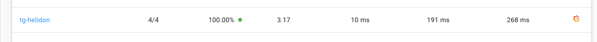
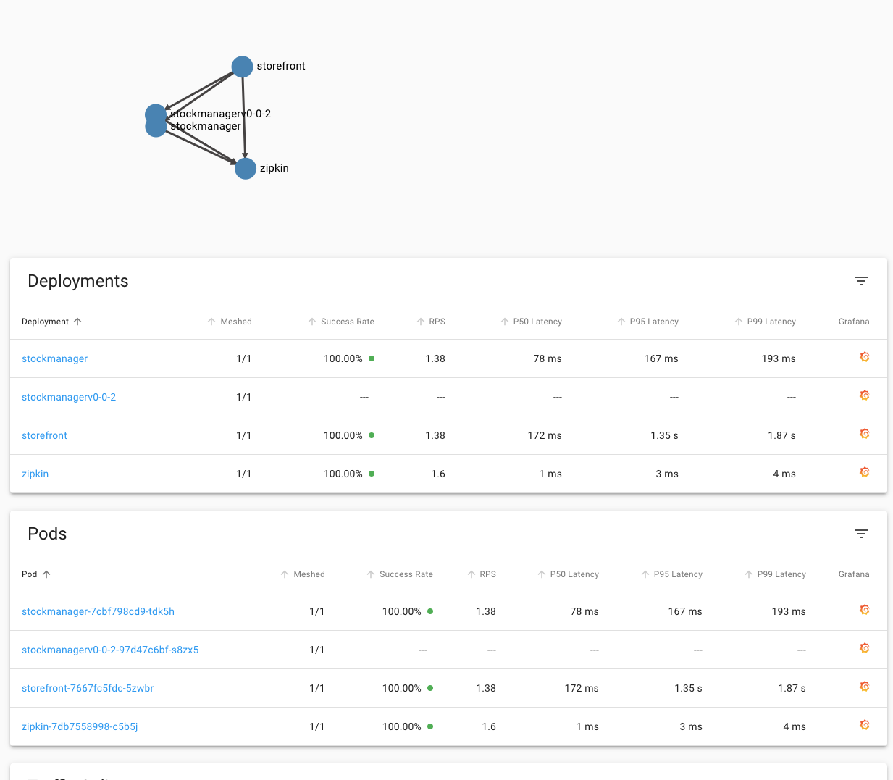

# Cloud Native - Exploring traffic splits with a Service mesh.


<details><summary><b>Self guided student - video introduction</b></summary>


This video is an introduction to the Service mesh traffic splits lab. Depending on your browser settings it may open in this tab / window or open a new one. Once you've watched it please return to this page to continue the labs.

[](https://youtu.be/ghANv-uM7Ec "Using the service mesh traffic split capability introduction video")

---

</details>

## Introduction

This is one of the optional sets of Kubernetes labs

**Estimated module duration** 20 mins.

### Objectives

This module shows how to use the Linkerd traffic split functionality to do a trial (canary) deployment of an update, and also to do some simple chaos engineering to see howthe system behaves if a component is unavailable.

### Prerequisites

You need to complete the **Rolling update** module (last of the core Kubernetes labs modules). You must have completed the **Installing the Linkerd service mesh** module. You can have done any of the other optional module sets, or any combination of the other service mesh modules.

## Task 1: What is a a traffic split, and what can I do with it ?

A traffic split is just what it says, the traffic sent to a service is split between the implementation instances. In core Kubernetes this is done using the selector in the service to locate pods with matching  labels. Then traffic sent to the service is split between the different pods, often using a round robin approach so each pod responds in turn.

In a service mesh a traffic split can do the traditional Kubernetes round robin approach, but it can do a lot more. For example there could be two different versions of the service, with the service mesh sending a percentage of the traffic to the different versions. This is useful if for example you want to try out one of the versions to see if it produced better business results (called A/B testing) or maybe you want to try out a new version of your micro-service before fully rolling it out. By diverting a small percentage of the traffic to it you can find out in the real deployed environment if it has any faults or returns errors. If it does then the new version is abandoned and the traffic all goes to instances of the old version, but if the new version turns out to be more reliable than the old one then you complete the rollout process and switch entirely to the new version.

Some service mesh implementations even have the ability to examine the headers in the request and make traffic split decisions based on those. An example of this in use would be to test out a new micro-service version in the real live environment, but limiting it's access to only requests with specific headers, thus a test team could deploy the new version, but the service mesh would only route the requests with that specific header to the new version. The rest of the environment would remain the same so the new version is being tested in the real production environment.

You can even use the traffic split to deliberately introduce faults to your environment to see how the system behaves, for example how well the upstream service handles bad result data, or even no response at all. This later function is part of a larger discipline called [Chaos Engineering](https://en.wikipedia.org/wiki/Chaos_engineering) but we will look at a very small part of it here.

Note that in a lot of these cases you use additional external automation tools to manage the service mesh traffic split (and to use it's monitoring) to adjust the traffic split.

This module was written using the information in the [Linkerd fault injection page.](https://linkerd.io/2/tasks/fault-injection/)

## Task 2: Canary deployments with a service mesh traffic split

### Task 2a: What is a canary deployment ?

A canary deployment is a method of doing a small trial deployment, operating within the overall production infrastructure, and if the trial works you can expand it, if the trial deployment fails then it can be removed.

<details><summary><b>Why the term canary ?</b></summary>


Historically canaries were used in underground mines as they were far more sensitive to dangerous atmospheric contaminants than humans, and mines frequently had pockets of carbon monoxide,  as well other dangerous or explosive gases lik methane. The miners would carry a canary in a cage (or a [canary resucitator](https://blog.scienceandindustrymuseum.org.uk/canary-resuscitator/)) with them, sometimes at the end of a long pole carried before them, so the canary went first. If the canary remained well then in went the humans. If however the canary became unwell then the humans knew it was not safe for them to proceed, and exited the area (one hopes taking the canary with them!)

---

</details>

### Task 2b: What are we going to do ?

In this lab we are going to go through the process of **manually** performing a canary deployment, along with recovering it. We're doing this manually so you get the full details of what's happening, however normally you would use automated tools like [Flagger](https://flagger.app) or [Spinaker](https://www.spinnaker.io/) to actually perform the steps for you (and at a much finer granularity)

We are going to deploy a version of the stockmanager service that deliberately breaks sometimes, from this you can gather than we will not be completing the deployment, but rolling it back!

More importantly we are going to do this while keeping the stockmanager service online all the time.

### Task 2c: Identifying the deployments

The order here is important, this is because the basic stockmanager service is only looking for deployments which match the selector of `app: stockmanager`, so if we were to just roll out the new version then the service would match the old and new versions. To do that we need a way to identify the different **versions** of a dpeloyment

Let's switch to the right directory

  1. In the OCI Cloud Shell type 
  
  - `cd $HOME/helidon-kubernetes/service-mesh`

First we need to make a small change to our existing stock manager deployment, adding the version number to the deployment, this will let us differentiate it from the newer version we are about to deploy.

The file stockmanager-deployment-v0.0.1.yaml is our "standard deployment file which we have used in other modules, it just has additional version attributes for the `spec.selector.matchLabels` and `spec.template.metadata.labels` sections as shown below

 ```yaml
  selector:
    matchLabels:
      app: stockmanager
      version: 0.0.1
  strategy:
    rollingUpdate:
      maxSurge: 1
      maxUnavailable: 1
    type: RollingUpdate
  template:
    metadata:
      annotations:
        prometheus.io/path: /metrics
        prometheus.io/port: "9081"
        prometheus.io/scrape: "true"
      creationTimestamp: null
      labels:
        app: stockmanager
        version: 0.0.1
    spec:
      containers:
```

Unfortunately since Kubernetes 1.17 we cannot just change the labels by updating the deployment with the new configuration as the labels for a deployment are set when it's created, so we'll have to delete and re-apply it. 

  2. Let's remove the old deployment. In the OCI Cloud shell type

  - `kubectl delete deployment stockmanager` 

  ```
deployment/stockmanager: deleted
```

  3. And create the new one. In the OCI Cloud Shell type 

  - `kubectl apply -f stockmanager-deployment-v0.0.1.yaml`
  
  ```
deployment.apps/stockmanager created
```

If we have a look at the pods we'll see that the stockmanager deployment has been restarted, and it's a new pod

  4. In the OCI Cloud shell type
  - ` kubectl get pods`

```
NAME                             READY   STATUS    RESTARTS   AGE
stockmanager-7cbf798cd9-tdk5h    2/2     Running   0          5m48s
storefront-7667fc5fdc-5zwbr      2/2     Running   0          22h
zipkin-7db7558998-c5b5j          2/2     Running   0          22h
```

Let's make sure our service is still running (note that we haven't changed the service itself, it's selector will match the old and new versions of the pod)

If your cloud shell session is new or has been restarted then the shell variable `$EXTERNAL_IP` may be invalid, expand this section if you think this may be the case to check and reset it if needed.

<details><summary><b>How to check if $EXTERNAL_IP is set, and re-set it if it's not</b></summary>

**To check if `$EXTERNAL_IP` is set**

If you want to check if the variable is still set type `echo $EXTRNAL_IP` if it returns the IP address you're ready to go, if not then you'll need to re-set it.

**To get the external IP address if you no longer have it**

In the OCI Cloud shell type

  -  `kubectl --namespace ingress-nginx get services -o wide ingress-nginx-controller`
  
  ```
NAME                       TYPE           CLUSTER-IP    EXTERNAL-IP      PORT(S)                      AGE   SELECTOR
ingress-nginx-controller   LoadBalancer   10.96.61.56   132.145.235.17   80:31387/TCP,443:32404/TCP   45s   app.kubernetes.io/component=controller,app.kubernetes.io/instance=ingress-nginx,app.kubernetes.io/name=ingress-nginx
```

The External IP of the Load Balancer connected to the ingresss controller is shown in the EXTERNAL-IP column.

**To set the variable again**

  - `export EXTERNAL_IP=<External IP>`
  
---

</details>


  5. In the OCI Cloud shell type the following
  
  - `curl -i -k  -u jack:password https://store.$EXTERNAL_IP.nip.io/store/stocklevel`

  ```
HTTP/2 200 
server: nginx/1.17.8
date: Thu, 04 Jun 2020 16:38:55 GMT
content-type: application/json
content-length: 149
strict-transport-security: max-age=15724800; includeSubDomains

[{"itemCount":410,"itemName":"Pencil"},{"itemCount":50,"itemName":"Eraser"},{"itemCount":4490,"itemName":"Pins"},{"itemCount":100,"itemName":"Book"}]
```

As the pod has restarted you may have a delay or have to retry the request as the database connection is established.

### Task 2d: Create versioned services

Now we have a mechanism to differentiate between the 0.0.1 and future versions of the deployment we're going to create two new service definitions, one having a selector that matches the  0.0.1 version of the stockmanager service we just deployed, and one for the 0.0.2 version - we haven't actually deployed the 0.0.2 version yet, that comes later.

We need to do define the version based services now so we can create the traffic split that interposes itself between the original service (stockmanager) and the separate deployments. Remember that the original stockmanager service definition only has a selector for the label `app: stockmanager` so if we created the deployments before we put the traffic split in place the original stockmanager service would match both the old and new deployments and we wouldn't have any control over the traffic.  Because of this the traffic split which used versions of services to differentiate and target traffic couldn't be deployed before we've created the per version services.

The versioned services are defined in a couple of yaml files. The key differences are that their selectors mean they are bound to specific versions of the deployment. This means that the selector specifies the version to match. Our previous service (which is still running) allowed connections to any version of the service as it didn't select using the version.

```
apiVersion: v1
kind: Service
metadata:
  name: stockmanagerv0-0-2
spec:
  type: ClusterIP
  selector:
    app: stockmanager
    version: 0.0.2
  ports:
    - name: stockmanager
      protocol: TCP
      port: 8081
    - name: stockmanager-mgt
      protocol: TCP
      port: 9081
```


  1. Let's deploy the 0.0.1 service version - this has a service name stockmanagerv0-0-1 (we have to use use `-` because the service name is used by Kubernetes as part of it's internal DNS setup, and of course a `.` represents a break point in the DNS naming scheme). In the OCI Cloud shell type the following
  
  - `kubectl apply -f stockmanager-v0.0.1-service.yaml`

  ```
service/stockmanagerv0-0-1 created
```

  2. And the 0.0.2 service version - nor surprisingly this has a service name stockmanagerv0-0-2. In the OCI CLoud shell type the following
  
  - `kubectl apply -f stockmanager-v0.0.2-service.yaml`

  ```
service/stockmanagerv0-0-2 created
```

**For demonstration purposes only** I have supplied a couple of ingress configurations that will let us see the difference between the two versions. In a normal canary deployment you would **not** do this, but in the lab it helps make clear what's happening.   When we installed Linkerd and the ingress rule for it's UI we ran a script that set the IP address of the host and certificate all the other ingress rules files, so we don't need to update it this time.

  3. In the OCI CLoud shell type the following
  
  - `kubectl apply -f ingressStockmanagerCanaryRules.yaml`

  ```
ingress.networking.k8s.io/stockmanager-canary-ingress created
```

These ingress rules connect to the versioned services, not the original stockmanager which does not have a version in it's selector

  4. Let's check them out. Firstly the 0.0.1 specific version. In the OCI CLoud shell type the following
  
  - `curl -i -k  -u jack:password https://store.$EXTERNAL_IP.nip.io/stockmanagerv0-0-1/stocklevel`

  ```
HTTP/2 200 
server: nginx/1.17.8
date: Thu, 04 Jun 2020 17:06:41 GMT
content-type: application/json
content-length: 149
strict-transport-security: max-age=15724800; includeSubDomains

[{"itemCount":410,"itemName":"Pencil"},{"itemCount":50,"itemName":"Eraser"},{"itemCount":4490,"itemName":"Pins"},{"itemCount":100,"itemName":"Book"}]
```

Accessing the 0.0.1 version the ingress connects to the 0.0.1 service which has the 0.0.1 version of the pods in it's selector. As we earlier updated the existing deployment with this there is a active set of pods behind it and we get results as we'd expect

  5. Now let's try the 0.0.2 version (expect an error)
  
  - `curl -i -k  -u jack:password https://store.$EXTERNAL_IP.nip.io/stockmanagerv0-0-2/stocklevel`

  ```
HTTP/2 503 
server: nginx/1.17.8
date: Thu, 04 Jun 2020 17:06:47 GMT
content-type: text/html
content-length: 197
strict-transport-security: max-age=15724800; includeSubDomains

<html>
<head><title>503 Service Temporarily Unavailable</title></head>
<body>
<center><h1>503 Service Temporarily Unavailable</h1></center>
<hr><center>nginx/1.17.8</center>
</body>
</html>
```

For the 0.0.2 version we get a 503 - Service Unavailable response. The ingress controller can map to the 0.0.2 service, but the 0.0.2 service has a selector which is looking for pods with a label `version: 0.0.2` and so far we haven't created any of those.

### Task 2e: Creating the traffic split

Now we have to create the traffic split. We need to do this before creating the 0.0.2 deployment because the original (un-versioned) stockmanager service is still running and being used by the storefront. The original service has a selector that will match on **any** pod with the label `app: stockmanager` **regardless** of what the version it is. Once the traffic split is in place it will intercept traffic for the original service, so only after that is it safe to create the new deployments and still retain full control of the traffic.

We are going to deploy our split on the service `stockmanager` (In service mesh terms this is known as the `Apex Service` as it's the actual top level service) The traffic split will intercept any traffic sent to the `stockmanager` service and split it between the backend services (also known as `Leaf services`) it specifies - in this case the `stockmanagerv0-0-1` service and the `stockmanagerv0-0-2` service. The example we are using here has two backends, but of course you can have more if you need to.

As we can see below, that breakdown sends all the traffic to the v0.0.1 version and none to the v0.0.2 version, we need to do this because we haven't setup any pods for the 0.0.2 service yet, so it couldn't respond to requests.

```
apiVersion: split.smi-spec.io/v1alpha1
kind: TrafficSplit
metadata:
  name: stockmanager-canary
spec:
  service: stockmanager
  backends:
  - service: stockmanagerv0-0-1
    weight: 90
  - service: stockmanagerv0-0-2
    weight: 0
```
<details><summary><b>How are the weights applied to the split ?</b></summary>


In this example we have applied a weight of 90 to the v0.0.1 part of the split, and zero to the second. The numbers are not percentages, and don't even need to add up to 100.

The algorithm seems to be add the total of the weights together, then split based on the weight for each individual backend divided by the total of the weights.

Thus with two services a weight of 1 on each would still be a 50/50 split (in percentage terms) but a split of 1 and 4 would be 20% to the first services and 80% to the second.

By having a weight of 0 on the 0.0.2 split it means that no requests will be sent to it.

---

</details>

  1. Let's apply the traffic split we just looked at. In the OCI Cloud shell type
  
  - `kubectl apply -f stockmanager-canary-traffic-split.yaml`
  
  ```
trafficsplit.split.smi-spec.io/stockmanager-canary created
```

As the traffic split is now in place and it's intercepting requests to the original service.

We can confirm this by making a few requests

  2. In the OCI Cloud shell type
  
  - `curl -i -k  -u jack:password https://store.$EXTERNAL_IP.nip.io/store/stocklevel`
  
  ```
HTTP/2 200 
server: nginx/1.17.8
date: Fri, 05 Jun 2020 12:21:11 GMT
content-type: application/json
content-length: 149
strict-transport-security: max-age=15724800; includeSubDomains

[{"itemCount":410,"itemName":"Pencil"},{"itemCount":50,"itemName":"Eraser"},{"itemCount":4490,"itemName":"Pins"},{"itemCount":100,"itemName":"Book"}]
```

Do this a few times and you'll see all of the requests succeeding

Now we have confirmed that the original setup is working as it should be we can safely setup the 0.0.2 pods

  3. In the OCI Shell type
  
  - `kubectl apply -f stockmanager-deployment-v0.0.2.yaml`

```
deployment.apps/stockmanagerv0-0-2 created
```

After waiting a short while for the new deployment to start we can check that the new version is configured using the 0.0.2 ingress. We are using the "broken" version of the stockmanager service we saw in the troubleshooting module, so expect some errors
 

  4. In the OCI Cloud Shell type
  
  - `curl -i -k  -u jack:password https://store.$EXTERNAL_IP.nip.io/stockmanagerv0-0-2/stocklevel`
  
Note that it may take a short while for the v0.0.2 stockmanager to start, so you may get a 502 Bad Gateway or a delay while the stockmanager does it's lazy initialization and the database connection is established.

<details><summary><b>Why won't I get a timeout ?</b></summary>


The `@Timeout` annotation is actually on the storefront class, it will trigger if the stockmanager takes a while to respond. The Ingress rule on the `/stockmanagerv0-0-2/stocklevel` path goes direct to the stockmanager service, this does not have any timeouts set.

---

</details>
  
Assuming you don't have a bad gateway (if you do wait a short time and retry)

You will **either** get back some real data

```
HTTP/2 200 
server: nginx/1.17.8
date: Fri, 05 Jun 2020 12:40:40 GMT
content-type: application/json
content-length: 149
strict-transport-security: max-age=15724800; includeSubDomains

[{"itemCount":410,"itemName":"Pencil"},{"itemCount":50,"itemName":"Eraser"},{"itemCount":4490,"itemName":"Pins"},{"itemCount":100,"itemName":"Book"}]
```

**OR** you will get back an error message

```
HTTP/2 500 
server: nginx/1.17.8
date: Fri, 05 Jun 2020 12:40:42 GMT
content-length: 0
strict-transport-security: max-age=15724800; includeSubDomains
```

If you do this a few times you will find that about half of the requests succeed, that's as expected as the config map for the stock manager service still has a setting of `errorgenerationrate: 0.5`.

Now we've seen that the services are behaving as expected let's start up the load generator

  5. Open a new window using your OCI account and start a cloud shell. You will need to set the `EXTERNAL_IP` variable in this new window, if you can't remember it or don;t have it written down expend ths section below and follow the instructions.
  
<details><summary><b>How to get and set $EXTERNAL_IP</b></summary>

**To get the external IP address if you no longer have it**

In the OCI Cloud shell type

  -  `kubectl --namespace ingress-nginx get services -o wide ingress-nginx-controller`
  
  ```
NAME                       TYPE           CLUSTER-IP    EXTERNAL-IP      PORT(S)                      AGE   SELECTOR
ingress-nginx-controller   LoadBalancer   10.96.61.56   132.145.235.17   80:31387/TCP,443:32404/TCP   45s   app.kubernetes.io/component=controller,app.kubernetes.io/instance=ingress-nginx,app.kubernetes.io/name=ingress-nginx
```

The External IP of the Load Balancer connected to the ingresss controller is shown in the EXTERNAL-IP column.
  
---

</details>
 
  - `export EXTERNAL_IP=<External IP>`
  
  6. In the **new** OCI Cloud shell go to the script directory
  
  - `cd $HOME/helidon-kubernetes/service-mesh`
  
  7. Start the load generator
  
  - `bash generate-service-mesh-load.sh $EXTERNAL_IP 1 &`
  
 ```
 Iteration 1
 Iteration 2
 ....
 ```

This will continue generating the load making a request roughly every second.

Note, the OCI Cloud Shell session will terminate (and thus kill off the load generator) after 20 minutes of inactivity. If this happens you will see the throughput figures for your namespace and services in the Linkerd and Grafana UI's drop to zero and potentially even disappear if they fall outside the time ranges displayed.  Just re-open the OCI Cloud chell and start the load generator again.

We can use the Linkerd web UI to see how the traffic is working

  8. In your laptop web browser go to `https://linkerd.<external IP>.nip.io` (Replace `External IP with the load balancers IP)

If needed accept that it's a self signed certificate and login as `admin` with password you set when installing linkerd

<details><summary><b>If you need to remind yourself of your ingress controller external IP address</b></summary>


- In the OCI Cloud Shell type :
  - `kubectl get services -n ingress-nginx`

```
NAME                                          TYPE           CLUSTER-IP     EXTERNAL-IP      PORT(S)                      AGE
ingress-nginx-nginx-ingress-controller        LoadBalancer   10.96.196.6    130.61.195.102   80:31969/TCP,443:31302/TCP   3h
ingress-nginx-nginx-ingress-default-backend   ClusterIP      10.96.17.121   <none>           80/TCP                       3h
```

look at the `ingress-nginx-nginx-ingress-controller` row, IP address in the `EXTERNAL-IP` column is the one you want, in this case that's `130.61.195.102` **but yours will vary**

---

</details>


Locate your namespace on the list, you'll see that it's running fine with 100% success rate

  

  9. Click on your namespace name (`tg-helidon` in my case) 

  10. On the left menu click on **Traffic Splits**

  

As you'd expect we can see all the traffic is going to the 0.0.1 version and it's all successful. Keep this page open

### Task 2f: Sending data to our new service

At the moment we're sending the data to the 0.0.1 service, but now we want to start sending some date to a 0.0.2 version and see how well it does.

Let's adjust the split

  1. In the OCI Cloud shell type
  
  - `kubectl edit trafficsplit stockmanager-canary`
  
  2. Go down to the backends section and for the service stockmanagerv-0-0-2 change the weight to 10

The result will look like this (the order of the elements may vary)

```
  service: stockmanager
  backends:
  - service: stockmanagerv0-0-1
    weight: 90
  - service: stockmanagerv0-0-2
    weight: 10
```

  3. Save the file

  ```
trafficsplit.split.smi-spec.io/stockmanager-canary edited
```

  4. Go back to the traffic split on the linkerd browser page

  

You will see that the split is now 90 to the v0.0.1 stockmanager and 10% to the v0.0.2 stock manager. As only 10% of the requests are going to the 0.0.2 version it may take a short while for data to be displayed for it.

The success rate column for the v0.0.1 is still 100%, but in this case the success rate for the 0.0.2 version is 33.33% Of course the exact number will vary depending on how many requests have been sent to it and the random behavior of it it generates an error or not. Given that the load generator is set to send one request a second, that only 10% of those are being sent to our test v0.0.2 service, and it only errors half the time only about 5% of the requests will actually have an error - so you may have to wait a bit to short time before seeing any errors. Also it can take a bit of time for the statistics to propagate up to the UI.

  5. Click on **Namespaces** 

  6. In the HTTP Metrics list click on **your** namespace

  

We can see that **in this case** the stockmanagerv0-0-2 deployment is still showing 33.33% success rate (yours may of course vary)

Basically this is a pretty significant indication that our updated deployment has a problem, and should not be deployed in production! Of course this is somewhat artificial, it may be that in production your original service generates a few errors normally, and the new one is marginally better, and unless the results were very clear cut like this you'd probably monitor it for a while.

If you look at the top of the page you can also see the traffic flows in the namespace as a graph, as you would expect the flow out of the storefront to **both** versions of the stockmanager.

Of course all the time we've been doing this the requests have still been serviced, even if a small number have been failing.

Once you've finished looking at the split we need to stop the load generator

  7. In the OCI cloud shell where you are running the load balancer stop the generator using Control-C

### Task 2g: It's failed, but what if it had worked ?

If it had worked then you would gradually adjust the traffic split, over time sending more traffic to the new deployment. Once it was taking all of the load then you could remove the deployment for the old version, and the associated service.

You **might** delete the traffic split (so requests to the stockmanager service were no longer being intercepted) or you might leave it in place, but remove the old version of the service. That way you would have all of the building blocks in place to easily start testing the next version of the service.

During this entire time period the overall stockmanager service would still have been operating, servicing requests (even if a few of the requests had had problems).

Remember, we've been doing this as a **manual** process to show you what's actually happening, in most cases where you have a CI/CD pipeline you'd use automation to manage the canary process, and it would perform the steps needed to completely switch to the new version automatically.

### Task 2h : We've discovered the new version is broken, what to do ?

Well obviously in the short term we don't want a broken version of the service if we have a working one, so the absolute first thing we need to do is to remove the new version from the traffic-split

  1. In the OCI Cloud shell type
  
  - `kubectl edit trafficsplit stockmanager-canary`
  
  2. Go down to the backends section and for the service stockmanagerv-0-0-2 change the weight to 0

The result will look like this (the order of the elements may vary)

```
  service: stockmanager
  backends:
  - service: stockmanagerv0-0-1
    weight: 90
  - service: stockmanagerv0-0-2
    weight: 0
```

  3. Save the file which will update the traffic split

```
trafficsplit.split.smi-spec.io/stockmanager-canary edited
```

If you look at the traffic split now you'll find  that it's reverted to all the traffic being sent to the working version


Of course it will take a short while for the statistics to catch up (**in this case** we're seeing the results of old traffic showing up in the numbers for the 0.0.2 version, which is why it shows 50% failures, even though the weight is zero) but after a short while if you go to the namespaces list you'll see everything back to 100% Success for your namespace 

  4. In the linkerd UI click **Namespaces** on the upper left

  5. Click **your** namespace in the HTTP Metrics section

  

#### Following actions

Remember, we've been doing this as a **manual** process to show you what's actually happening, your CI/CD tooling would normally handle this for you automatically.

Now there are lot's of actions you can take, what **we** are going to do soon is reset everything back to where it was prior to doing the canary split (so other lab modules have a common starting point) But in practice you are unlikely to do this.

Another option is if you have some idea as to the cause of the fault and can fix it quickly, in that case you'd probably create a new image and re-deploy it, that way you'd just need to update the traffic split to start sending some traffic to the updated "new" version.

### Task 2i: Resetting to our initial state

In this case (and this is probably what the CI/CD connected automation would do) we'll just remove everything. You do of course need to do this in the right order, or there may be a short period where the original stockmanager service would map onto both the old and new versions (and thus the new broken version may be sent requests).

I've put a small a script in place to do this for us

  1. In the OCI Cloud Shell type
  
  - `bash stop-canary.sh`

```
deployment.apps "stockmanagerv0-0-2" deleted
trafficsplit.split.smi-spec.io "stockmanager-canary" deleted
ingress.networking.k8s.io "stockmanager-v0-0-1" deleted
ingress.networking.k8s.io "stockmanager-v0-0-2" deleted
service "stockmanagerv0-0-2" deleted
service "stockmanagerv0-0-1" deleted
```

<details><summary><b>We haven't removed the version on the original deployment ?</b></summary>

Well spotted! We're going to leave the version in place on the original service. There are a few reasons for this.

1/ It does no harm, the original service will match any deployment as it only looks for the `app: stockmanger`  so will sent traffic to any matching deployment regardless of the deployments version attributes

2/ It's actually a good idea to specify version information as standard. 

3/ It lets you quickly and easily see which version you're dealing with, and also makes it easier to implement traffic splits in the future (if you wished to do so) as the version info is already in place.

---

</details>

## Task 3: Using a traffic split to test resilience (A bit of Chaos)

We're going to use a traffic split to send some messages to a fake zipkin endpoint which will generate errors, this will let us see how well our micro-services handle the situation where zipkin becomes unavailable.

We will do this by creating a fault injection service, this will respond to **all** requests with a 504 (Bad Gateway) error. Then we will use the Traffic Split to send some of the requests to it (In the same way as we sent some of the requests to the new version of the stock manager)

This is a very simple example of [Chaos Engineering](https://principlesofchaos.org)

### Task 3a: Setup the fault injection service

Switch to the service mesh directory

  1. In the OCI Cloud Shell type 
  
  - `cd $HOME/helidon-kubernetes/service-mesh`

Let's setup the fault injector, this is basically a simple nginx based web server that returns a HTTP 504 error status (Gateway timeout) each time it's accessed.

First we need to setup the config map for nginx, below is the contents of nginx-fault-injector-configmap.yaml. It defines a config rule for nginx that will always return a 504 error

```
apiVersion: v1
kind: ConfigMap
metadata:
  name: fault-injector-configmap
data:
 nginx.conf: |-
    events {}
    http {
        server {
          listen 80;
            location / {
                return 504;
            }
        }
    }
```

  2. In the OCI Cloud shell type
  
  - `kubectl apply -f nginx-fault-injector-configmap.yaml`

  ```
configmap/fault-injector-configmap created
```

Next let's start a service for the nginx instance (feel free to  look at the contents of the yaml, it's a standard service definition, but it maps the incoming port 9411 to port 80 in the deployments)

  3. In the OCI Cloud shell type
  
  - `kubectl apply -f fault-injector-service.yaml`

  ```  
service/fault-injector created
```

Start the nginx fault injector deployment

  4. In the OCI Cloud shell type
  
  - `kubectl apply -f nginx-fault-injector-deployment.yaml`

```
deployment.apps/fault-injector created
```

For testing purposes we'll run an ingress, normally you wouldn't need to do this, but I want to show you that the fault injector service does indeed return 504 errors. When we installed Linkerd and the ingress rule for it's UI we ran a script that set the IP address of the host and certificate all the other ingress rules files, so we don't need to that again.

  6. In the OCI Cloud shell type
  
  - `kubectl apply -f ingressFaultInjectorRules.yaml`

  ```
ingress.networking.k8s.io/fault-injector created
```

Test the fault injection returns the right value

  7. In the OCI Cloud shell type

  - `curl -i -k https://store.$EXTERNAL_IP.nip.io/fault`

  ```
Handling connection for 9411
HTTP/1.1 504 Gateway Time-out
Server: nginx/1.19.0
Date: Wed, 03 Jun 2020 13:22:02 GMT
Content-Type: text/html
Content-Length: 167
Connection: keep-alive

<html>
<head><title>504 Gateway Time-out</title></head>
<body>
<center><h1>504 Gateway Time-out</h1></center>
<hr><center>nginx/1.19.0</center>
</body>
</html>
```

OK, the 504 / Gateway Time-out response is generated as we expect.

### Task 3b: Deploy the traffic split

So far all we've done is to create a service that generates 504 errors, not much use by itself! We need to look at the traffic split to redirect some of the traffic for the original service to this new one.

Let's look at the traffic split, below is the contents of fault-injector-traffic-split.yaml

```
apiVersion: split.smi-spec.io/v1alpha1
kind: TrafficSplit
metadata:
  name: fault-injector
spec:
  service: zipkin
  backends:
  - service: zipkin
    weight: 50
  - service: fault-injector-zipkin
    weight: 50
```

The weight indicates how many requests of the service should go to each backend, so in this example we have a 50% split between fault and working, normally you would have a lower number of requests being sent to the fault-injector (after all, if it does break things you don't want your end customers to be impacted, especially in a production environment if you wern't sure what would happen, but here we want to be confident we'll see some "failures"  generated.

OK, now we know what it is let's deploy it.

  1. In the OCI Cloud shell type 
  
  - `kubectl apply -f  fault-injector-traffic-split.yaml`
  
```
trafficsplit.split.smi-spec.io/fault-injector-split created
```

Let's look at the traffic split in the linkerd UI

  2. In your web browser go to `https://linkerd.<external IP>.nip.io` (replace `External IP` with the IP address of the load balancer as usual)

  3. On the upper left click the **Namespace dropdown** (It may display `DEFAULT` or another namespace name)

  

  4. Click **your namespace** in the list (tg-helidon in my case, but yours should be different)

  5. On the left menu in the configuration section click **Traffic Splits**

  

You will be shown the traffic splits page

  

This Shows the traffic split details

  6. Click on the name of the traffic-split `fault-injector`

  

We can see the details of the traffic split, the **Apex Service** indicates the service the traffic split is operating on, the **Leaf service** shows where the traffic will be split to and the **Weight** indicates the probability of that split option, in this case it's 500/1000 in each case. Of course you could potentially have additional splits.

Keep this page open

### Task 3c: Testing what happens

Let's generate some requests to see what happens

  1. In the OCI Cloud Shell type the following
  
  - `curl -i -k  -u jack:password https://store.$EXTERNAL_IP.nip.io/store/stocklevel`

  ```  
HTTP/2 200 
server: nginx/1.17.8
date: Wed, 03 Jun 2020 18:38:20 GMT
content-type: application/json
content-length: 149
strict-transport-security: max-age=15724800; includeSubDomains

[{"itemCount":410,"itemName":"Pencil"},{"itemCount":50,"itemName":"Eraser"},{"itemCount":4490,"itemName":"Pins"},{"itemCount":100,"itemName":"Book"}]
```

Well the good news is that we got a result, assuming that our requests were randomly assigned to the faulty zipkin sertvice it seems that having a faulty zipkin service does not immediately break the services that depend on it ! Make a few more requests - just in case the first request was assigned to the "good" zipkin (we want it to have a chance to hit the bad one), then return to your web browser (hopefully you left it on the details page of the fault-injection traffic split)

Below is what **I** saw, and it seems that **in this case** the random number generator means that the few requests I made to the traffic split that was connected to the origional zipkin service had all been passed to fault-injector-zipkin which of course failed them all.


**Yours may be different** You may see a partial split where some succeeded and some failed (so some going to the `zipkin` and some going to `fault-injector-zipkin`), of you may see them all succeeding (I.e. all going to the `zipkin` service) as the traffic split works randomly it's impossible to predict exactly

In this case you can see that requests to the fault-injection traffic split had a 0% success rate, and were passed to the failt-injector-zipkin service which had a 0% success rate. Of course your numbers may vary and it's unlikely you'll have all traffic going to the fault injector as I had here

So I can show you what it looks like if there are only some failures I made a few more curl requests and came back to the page


**Again yours will almost certainly be different**

Here we see that 66.67% of the requests to the traffic split had failed (the bar at the top of the service also indicates the failure rate) and that 100% of the requests to zipkin had succeeded, while 100% of the requests to the fault-injector-zipkin service had failed. In this case given the fault-injector-zipkin service will always fail this is what we would expect, but as you'll see later when we look at canary deployments it's not a pure 100% success or failure in all cases.

Of course this is useful, but in this case all it's telling us is that the `zipkin` service always works and the `fault-injector-zipkin` service always fails. What does that mean for the requests to the zipkin service.

  2. In the **Tools** section on the  left menu click on **Routes**

  3. In the **Namespace dropdown** chose the name of **your** namespace (tg-helidon in the example below)

  4. In the **Resource** dropdown chose **Deployment**

  5. In the **To Namespace** dropdown chose the name of **your** namespace (tg-helidon in the example below)

  6. In the **To resource** dropdown chose `deployment/zipkin`

  

This will generate reports from any deployment to the `zipkin` deployment (it is of course possible to look at specific deployments, but this shows us a good overview)

  7. Click the **Start** button

  8. In the OCI cloud shell make multiple curl requests of the form
  
  - `curl -i -k  -u jack:password https://store.$EXTERNAL_IP.nip.io/store/stocklevel`
  
  9. Looking at the Linkerd UI we can see the result.

  

(you may have to scroll down a bit to see the deployment details)

We can see that **in this case** 50% of the requests from the storefront deployment to the zipkin deployment have failed, the same is true for the stockmanager. We know that our traffic split is doing what we expected and that we are failing the requests and potentially causing chaos! (If you'd like to please feel free to do a Dr Evil or Bond villan manic laugh at this point)

This is great, but how is our service handling it ?

Unless something very unexpected from the point of view of the lab writer has happened all the time you have been getting a reply to the curl command of something like 

```
[{"itemCount":410,"itemName":"Pencil"},{"itemCount":50,"itemName":"Eraser"},{"itemCount":4490,"itemName":"Pins"},{"itemCount":100,"itemName":"Book"}]
```

And you have not had any HTTP errors, this is a pretty good indicator that our service is continuing to work, out little experiment in chaos engineering has given us useful information!

<details><summary><b>What's happening in the pod itself ?</b></summary>


Wile the service itself is still delivering results fine it's possible that there are useful bit's of information in the logs that might help improve reliability.

First we need the pod name

- In the OCI Cloud shell type 

 - `kubectl get pods`

```
NAME                             READY   STATUS    RESTARTS   AGE
fault-injector-b5bf94d48-f7wbq   2/2     Running   0          55m
stockmanager-7945b54576-9f7q7    2/2     Running   0          69m
storefront-7667fc5fdc-5zwbr      2/2     Running   0          69m
zipkin-7db7558998-c5b5j          2/2     Running   0          69m
```

Now we want to get the logs of the pod itself, in **my** case that's `stockmanager-7945b54576-9f7q7`, but of course yours will be different.

Let's use kubectl to get the logs. Note that as the pod now contains multiple containers due to linkerd injecting them automatically we need to specify the container we want the logs for, as it's named in the deployment. In this case that's the stockmanager container.


- In the OCI Cloud Shell type the following, replace the pod name with your stockmanager pod name :

  - `kubectl logs stockmanager-7945b54576-9f7q7 stockmanager`

```
... Loads of stuff ....
2020.06.03 18:10:01 INFO com.oracle.labs.helidon.stockmanager.resources.StockResource Thread[helidon-4,5,server]: Getting all stock items
Hibernate: 
    SELECT
        departmentName,
        itemName,
        itemCount 
    FROM
        StockLevel 
    WHERE
        departmentName='Tims Shop'
2020.06.03 18:10:02 INFO com.oracle.labs.helidon.stockmanager.resources.StockResource Thread[helidon-4,5,server]: Returning 4 stock items
2020.06.03 18:10:02 WARNING zipkin2.reporter.AsyncReporter$BoundedAsyncReporter Thread[AsyncReporter{URLConnectionSender{http://zipkin:9411/api/v2/spans}},5,main]: Spans were dropped due to exceptions. All subsequent errors will be logged at FINE level.
2020.06.03 18:10:02 WARNING zipkin2.reporter.AsyncReporter$BoundedAsyncReporter Thread[AsyncReporter{URLConnectionSender{http://zipkin:9411/api/v2/spans}},5,main]: Dropped 8 spans due to IOException(Server returned HTTP response code: 504 for URL: http://zipkin:9411/api/v2/spans)
java.io.IOException: Server returned HTTP response code: 504 for URL: http://zipkin:9411/api/v2/spans
        at java.base/sun.net.www.protocol.http.HttpURLConnection.getInputStream0(HttpURLConnection.java:1919)
        at java.base/sun.net.www.protocol.http.HttpURLConnection.getInputStream(HttpURLConnection.java:1515)
        at zipkin2.reporter.urlconnection.URLConnectionSender.skipAllContent(URLConnectionSender.java:232)
        at zipkin2.reporter.urlconnection.URLConnectionSender.send(URLConnectionSender.java:227)
        at zipkin2.reporter.urlconnection.URLConnectionSender$HttpPostCall.doExecute(URLConnectionSender.java:266)
        at zipkin2.reporter.urlconnection.URLConnectionSender$HttpPostCall.doExecute(URLConnectionSender.java:258)
        at zipkin2.Call$Base.execute(Call.java:380)
        at zipkin2.reporter.AsyncReporter$BoundedAsyncReporter.flush(AsyncReporter.java:285)
        at zipkin2.reporter.AsyncReporter$Flusher.run(AsyncReporter.java:354)
        at java.base/java.lang.Thread.run(Thread.java:834)

Hibernate: 
    SELECT
        departmentName,
        itemName,
        itemCount 
    FROM
        StockLevel 
    WHERE
        departmentName='Tims Shop'
... Loads of stuff ....

```

In this case we can find (within a lot of other stuff) the error log details when the stockmanager tried to talk to the zipkin service. We can see that zipkin is dropping the spans.

**If you cannot find this** do not worry, there is a **lot** of log data.

---

</details>

We've seen that the traffic split has let us inject a fault so that the zipkin service is not available, our clients have continued as expected, but what would happens if we inject a fault such that the stockmanager itself becomes unavailable ?

### Task 3d: What about more serious faults

Disrupting access to zipkin is an example of where there is a fault that is not causing a problem to the overall service.

If we had however done this to the stock manager service (when we looked at canary deployments we to some extent did this as the "broken" version generated 5xx errors) we would have seen that a fault in the stockmanager did actually mean that the storefront picked up the error, and could not proceed (in that case the storefront returned a 424 Failed Dependency to the user)

In **some** cases one service failing cannot be recovered from directly. We could however have instructed the service mesh that when the stockmanager has a problem then [it should retry the request.](https://linkerd.io/2/tasks/configuring-retries/) This would mean that for intermittent errors the retry might have succeeded.

### Task 3e: What about the Kubernetes health services ? 

You may be concerned about the impact of traffic splits on the health of the underlying service, after all if we're redirecting requests to the 504 error generator doesn't this mean that the readiness and liveness checks would start restarting the containers. 

Fortunately for us those are defined in the deployment, not the service, so Kubernetes talks directly to the pods in the deployment and doesn't go through the service layer (and thus potentially the traffic split). Thus even if a service is apparently delivering errors to it's service it should still pass the health checks (assuming it's healthy of course :-) )

The same should also apply to the deployment defined actions like prometheus metrics scraping.

Of course there are some actions that might be impacted, for example if you had a service that you used for your own data gathering, going to a endpoint that was behind the traffic split then that may start failing, but most folks would use the standard Kuernetes components

### Task 3f: Hum, this could cause me customer problems

You probably don't want to start doing this type of chaos engineering on your production environments until you've tested it thoroughly in your dev and test environments. However there is another option here, you could use header based requests to identify "test traffic, and just make sure you chose a header that wouldn't normally come from your real customers.

### Task 3g: Cleaning up the fault injection

For now let's remove the Traffic split and the fault-injector components we created. I have created a simple script that removes them for us.

  1. In the OCI Cloud shell type
  
  - `bash stop-fault-injection.sh`

```
trafficsplit.split.smi-spec.io "fault-injector" deleted
ingress.networking.k8s.io "fault-injector" deleted
service "fault-injector" deleted
deployment.apps "fault-injector" deleted
configmap "fault-injector-configmap" deleted
```

## Task 4: Other criteria for splitting the traffic

The [Service mesh specification for traffic splits](https://github.com/servicemeshinterface/smi-spec/blob/master/apis/traffic-split/v1alpha3/traffic-split.md) supports other mechanisms (be warned not all service mesh implementation support this specification, and not all support all the traffic split options).

One interesting one is to have a split based on an `HTTPRouteGroup` This is interesting because it allows you to split traffic based on HTTP elements such as the presence (or not) of specific headers / header values. For example you could split traffic base on if the users browser was Firefox or not. More interestingly you could add a custom header to your request, for example declaring that the request should be treated in a particular way, thus you could have a header "DevelopmentUser", the request would progress through the connected microservices as usual until it got to the particular traffic split, then the traffic split would sent only traffic with that header to the service. This means you can test an update to your microservice in the fully operational production environment, with no risk that non developers would use the in-test version. Naturally for this to be safe your microservcies have to fail safe in that they don't just crash entirely when calling another service that fails (or you have multiple instances and just let Kubernetes handle restarting them). This solves many of the problems of testing in that it is genuinely operating in the production environment, not a test environment that you believe is "close to" the production environment (but in reality unlikely to be so as the load and scale is usually much smaller for cost reasons)

Of course splitting by header is assuming that the headers are correctly passed on between micro-services.

The service mesh standard also defines capabilities that allow you to apply access controls within the mesh, so for example restricting access to the /metrics endpoint to prometheus would prevent unauthorized applications trying to get details of how your system was running.

## End of the module, What's next ?

You can chose from the remaining **Linkerd service mesh** modules or switch to one of the other Kubernetes optional module sets.

## Acknowledgements

* **Author** - Tim Graves, Cloud Native Solutions Architect, EMEA OCI Centre of Excellence
* **Contributor** - Charles Pretzer, Bouyant, Inc for reviewing and sanity checking parts of this document.
* **Last Updated By** - Tim Graves, July 2021
