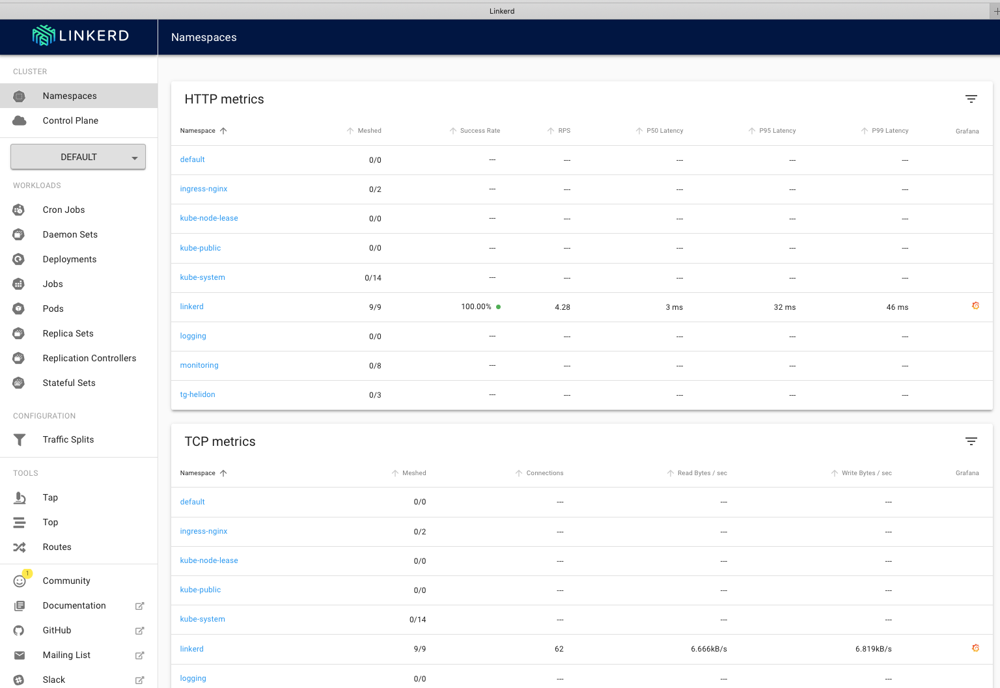
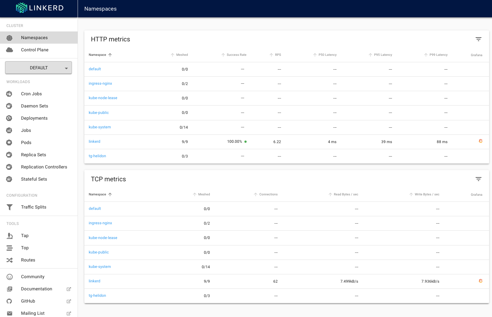
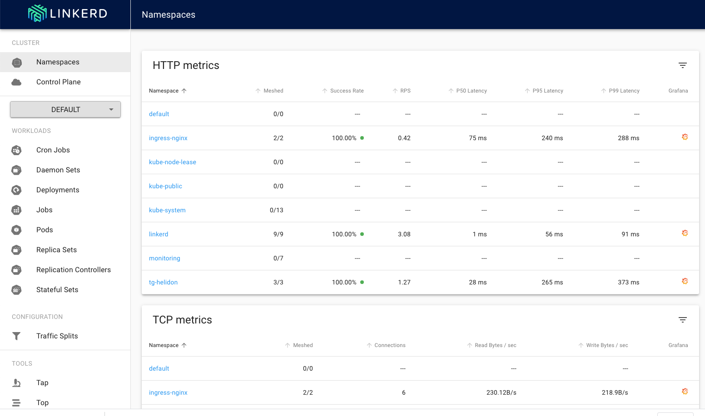
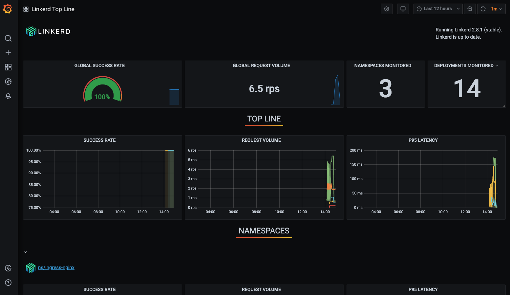

# Cloud Native - Service mesh install and setup


<details><summary><b>Self guided student - video introduction</b></summary>


This video is an introduction to the Service mesh basics lab. Depending on your browser settings it may open in this tab / window or open a new one. Once you've watched it please return to this page to continue the labs.

[](https://youtu.be/jfNp6VEfFEk "Service mesh setup lab introduction video")

---

</details>


## Introduction

This is one of the optional sets of Kubernetes labs

**Estimated module duration** 20 mins.

### Objectives

This module shows how to install and configure the Linkerd service mesh, and enable its use with the microservices.

### Prerequisites

You need to complete the **Rolling update** module (last of the core Kubernetes labs modules). You can have done any of the other optional module sets.

## Task 1: What is a service mesh

The concept behind a service mesh is pretty simple. It's basically a set of network proxies that are conceptually interposed between the containers running on a pod and the external network of the pod. This is achieved by the service mesh management capability (the control plane) which automatically adds proxies (the data plane) to the pods when the pods are started (if the pod is in a namespace that requests this via annotations)

The following diagram (from [buoyant.io](https://buoyant.io)) shows the components in the [linkerd](https://linkerd.io) service mesh, but other service mesh implementations have a similar structure. In this architecture, the proxies run as containers within the pod using the [sidecar pattern](https://dzone.com/articles/sidecar-design-pattern-in-your-microservices-ecosy-1)


The data plane consists of proxies which intercept the network operations of the pods and can apply rules to the data, for example restricting which services can be called by other services, encrypting data between proxies so cross microservice connections are transparently encrypted, splitting or mirroring traffic to help with update processes, and also gathering metrics on the number of calls, how often a cross microservice call failed and such like. Of course in a non Kubernetes environment you may have had your network switches or host operating systems do this, and many organizations had various levels of networking (separated by firewalls) for users, web applications, and databases, but in Kubernetes the boundary between the physical and logical compute resources is blurred, so using a service mesh allows you to have a simple implementation approach that applies regardless of if pods are running on the same node, different nodes in the same environment, or potentially even between data centers in opposite sides of the world.

The control plans does what it says on the box, it provides control functions to the data plane, for example getting and updating certificates, providing a management point so you can set the properties you want the data plane to implement (and passing those to the data plane)

The mechanisms to do this are relatively simple to the user, though the internal implementation details of a service mash can be very complex!

Service meshes can also provide functionality across multiple clusters, in these modules we will be using Linkerd, and that provides the capability to extend the service discovery across multiple Kubernetes clusters, that means a service in a different cluster can appear as if it was a local part of the data plane, enabling things like automatic connection to a service in a different cluster and automatic connection encryption between services in different clusters.

### What service meshes are there ?

There are multiple service mesh implementations available, a non exclusive list (there are others) includes Linkerd, Istio, Consul, Kuma, Maesh, Aspen Mesh, and Grey Matter. 

Most Service mesh implementations are open source to some level, but currently only [Linkerd](https://linkerd.io/) from [Buoyant Inc.](https://buoyant.io/) is listed as being a Cloud Native Computing Foundation (the governance body for open source Kubernetes related things) project though there have been press discussions that Istio may be donated by Google to an open source foundation.

Currently there is no agreed standard on how to manage a service mesh, or even exactly what it does, though the [CNCF Service Mesh Interface project](https://smi-spec.io/)  is starting to define one. 

## Task 2: What does that mean as an cluster operator or administrator?

Well the short version is that you need to be careful in choosing the right service mesh to meet your needs!

The longer version is that at least some of your concerns about managing networking within Kubernetes deployments have gone away. In addition, you will gain insight into the traffic and overall health of your applications running in Kubernetes.

Installing a service mesh adds an additional layer of abstraction to your cluster. This is not unlike the network overlay that runs on your cluster. There is a processing overhead to this, but it's pretty small. 

Ultimately, the way to think about a service mesh as a cluster operator is to consider that adding this layer will result in better observability and security for your applications.

## Task 3: Which service mesh to use ?

There is no simple answer to this, as none of them are built into Kubernetes and there is no official standard. 

Factors to consider are functionality, if it's fully or partially open source, what support is available (most service mesh implementations have a company behind them that provides commercial support on the open source product) and also if you want to follow the CNCF projects list or not (some Kubernetes users are only willing to consider official CNCS projects for compatibility and other reasons)

The important thing is to define your requirements before selecting a service mesh.

## Task 4: How to install the Linkerd service mesh ?

For the purposes of this lab we've chosen to use Linkerd as it's a long standing service mesh implementation and is the only CNCF supported service mesh project (at the time of writing.) It also has a reputation for being simple to install and use. The Linkerd website has an [FAQ on the differences](https://linkerd.io/2/faq/#whats-the-difference-between-linkerd-and-istio) and open source implications

Linkerd is installed in two parts, the linkerd command which runs local to your environment (similar to the kubectl command) and the linkerd control pane which runs in your Kubernetes cluster (similar to the Kubernetes cluster management elements) and manages the data plane.

These instructions are based on the [Getting started](https://linkerd.io/2.11/getting-started/) page at Linkerd.io and install Linkerd v2.11, 

It's worth noting that Linkerd can also be installed using its [helm chart](https://linkerd.io/2/tasks/install-helm/) but today we're going to do it manually step by step.

### Task 4a: Installing the linkerd CLI

As linkerd is not a core Kubernetes component it's not included in the Oracle OCI Shell, so we need to do that first.

  1. In the OCI Cloud Shell type the follwing
  
  - `curl -sL https://run.linkerd.io/install | sh`
  
  ```
Downloading linkerd2-cli-stable-2.10.0-linux...
  % Total    % Received % Xferd  Average Speed   Time    Time     Time  Current
                                 Dload  Upload   Total   Spent    Left  Speed
100   644  100   644    0     0   1556      0 --:--:-- --:--:-- --:--:--  1559
100 37.0M  100 37.0M    0     0  13.5M      0  0:00:02  0:00:02 --:--:-- 21.1M
Download complete!

Validating checksum...
Checksum valid.

Linkerd stable-2.11.0 was successfully installed 🎉


Add the linkerd CLI to your path with:

  export PATH=$PATH:/home/tim_graves/.linkerd2/bin

Now run:

  linkerd check --pre                     # validate that Linkerd can be installed
  linkerd install | kubectl apply -f -    # install the control plane into the 'linkerd' namespace
  linkerd check                           # validate everything worked!
  linkerd dashboard                       # launch the dashboard

Looking for more? Visit https://linkerd.io/2.11/next-steps
```
  
Warning, this may take a while to run, in my case it usually takes around 30 seconds, but sometimes has taken as long as 20 mins if for some reason the download was not fast.
  
  2. Now we need to add the linkerd command to our path. In the OCI Cloud Shell type 
  
  - `export PATH=$PATH:$HOME/.linkerd2/bin`
  
This is only a temporary change, that applies to the current OCI Cloud shell session. To make it permanent we need to edit the $HOME/.bashrc file

  3. Use your preferred editor (vi, vim, nano etc.) edit $HOME/.bashrc

  4. At the end of the file add and new line containing 

  ```
export PATH=$PATH:$HOME/.linkerd2/bin
```

  5. Lastly let's check the status of the linkerd installation. In the OCI Cloud Shell type
  
  - `linkerd version`

  ```
Client version: stable-2.11.0
Server version: unavailable
```

The server is unavailable because we haven't installed it yet. The version numbers will of course change over time, but these are the ones when this lab module was written.


### Task 4b: Installing linkerd into your Kubernetes cluster

Though we have the linkerd client application we still need to install the linkerd control plan in our cluster (The control plane will handle deploying the proxies in the data plane)

Firstly let's make sure that the cluster meets the requirements to deploy linkerd

  1. In the OCI Cloud shell type :
  
  - `linkerd check --pre`
  
  ```
kubernetes-api
--------------
√ can initialize the client
√ can query the Kubernetes API

kubernetes-version
------------------
√ is running the minimum Kubernetes API version
√ is running the minimum kubectl version

pre-kubernetes-setup
--------------------
√ control plane namespace does not already exist
√ can create non-namespaced resources
√ can create ServiceAccounts
√ can create Services
√ can create Deployments
√ can create CronJobs
√ can create ConfigMaps
√ can create Secrets
√ can read Secrets
√ can read extension-apiserver-authentication configmap
√ no clock skew detected

pre-kubernetes-capability
-------------------------
‼ has NET_ADMIN capability
    found 2 PodSecurityPolicies, but none provide NET_ADMIN, proxy injection will fail if the PSP admission controller is running
    see https://linkerd.io/checks/#pre-k8s-cluster-net-admin for hints
‼ has NET_RAW capability
    found 2 PodSecurityPolicies, but none provide NET_RAW, proxy injection will fail if the PSP admission controller is running
    see https://linkerd.io/checks/#pre-k8s-cluster-net-raw for hints

linkerd-version
---------------
√ can determine the latest version
√ cli is up-to-date

Status check results are √
```

The pre-install check that the Kubernetes cluster (and the configuration of kubectl) is able to install linkerd. All the checks have passed (the tick by each line) so we're good to install the linkerd control plane.

The linkerd control plan process used the linkerd command to generate the configuration yaml, which is then processed by kubectl. 

  2.  In the OCI Cloud Shell type
  
  - `linkerd install | kubectl apply -f -`
  
```
linkerd install | kubectl apply -f -
namespace/linkerd created
clusterrole.rbac.authorization.k8s.io/linkerd-linkerd-identity created
clusterrolebinding.rbac.authorization.k8s.io/linkerd-linkerd-identity created
serviceaccount/linkerd-identity created
clusterrole.rbac.authorization.k8s.io/linkerd-linkerd-controller created
clusterrolebinding.rbac.authorization.k8s.io/linkerd-linkerd-controller created
serviceaccount/linkerd-controller created
clusterrole.rbac.authorization.k8s.io/linkerd-linkerd-destination created
clusterrolebinding.rbac.authorization.k8s.io/linkerd-linkerd-destination created

...

Lots of messages about resources being created
...
deployment.apps/linkerd-tap created
configmap/linkerd-config-addons created
serviceaccount/linkerd-grafana created
configmap/linkerd-grafana-config created
service/linkerd-grafana created
deployment.apps/linkerd-grafana created
```
  
<details><summary><b>If you want to see exactly what is being done</b></summary>


To find out exactly what linkerd is going to install we can execute it without sending the output to kubectl. There is a lot of output, so we're going to redirect it to a file

- In the OCI Cloud Shell type
  - `linkerd install > /tmp/linkerd-install-output`

To see the YAML

- In the OCI Cloud Shell type
  - `more /tmp/linkerd-install-output`
  
```
---
###
### Linkerd Namespace
###
---
kind: Namespace
apiVersion: v1
metadata:
  name: linkerd
  annotations:
    linkerd.io/inject: disabled
  labels:
    linkerd.io/is-control-plane: "true"
    config.linkerd.io/admission-webhooks: disabled
    linkerd.io/control-plane-ns: linkerd
---
###
### Identity Controller Service RBAC
###
---
kind: ClusterRole
apiVersion: rbac.authorization.k8s.io/v1
metadata:
  name: linkerd-linkerd-identity
  labels:
    linkerd.io/control-plane-component: identity
    linkerd.io/control-plane-ns: linkerd

... lots and lots more yaml output...
```

There is a lot of output here, we've only seen the beginning of it above

---

</details>

Let's check that the linkerd command can talk to the control plane

  3. After a few mins delay for the linkerd control plane to startup, In the OCI Cloud Shell type
  
  - `linkerd version`

```
Client version: stable-2.11.0
Server version: stable-2.11.0
```

Expect a short delay while the linkerd command contacts the control plane servers.

If you get `Unavailable` for the server version or an error message that means the control plane is still starting, wait a short time and then re-run the command.

We can see the version information (this was correct at the time of writing, you make have later versions.)

Linkerd creates it's own namespace so we can check what's in there using kubectl 

  4. In the OCI Cloud shell type 
  
  - `kubectl get namespaces`

  ```
NAME              STATUS   AGE
default           Active   29d
ingress-nginx     Active   28d
kube-node-lease   Active   29d
kube-public       Active   29d
kube-system       Active   29d
linkerd           Active   63s
logging           Active   7d22h
monitoring        Active   27d
tg-helidon        Active   27d
```

(Depending on what lab modules you've done, and the name you gave your namespace the list will vary)

And we can see what's in the linkerd namespace

  5. In the OCI Cloud shell type
  
  - `kubectl get all -n linkerd`

  ```
NAME                                          READY   STATUS    RESTARTS   AGE
pod/linkerd-controller-b8f9df548-m45zw        2/2     Running   0          4m20s
pod/linkerd-destination-77cc876746-vslqf      2/2     Running   0          4m19s
pod/linkerd-identity-695d64dfdf-sgdkh         2/2     Running   0          4m20s
pod/linkerd-proxy-injector-6d9db65bff-s77pm   2/2     Running   0          4m19s
pod/linkerd-sp-validator-5c77df9f7b-5nkp5     2/2     Running   0          4m19s

NAME                                TYPE        CLUSTER-IP     EXTERNAL-IP   PORT(S)    AGE
service/linkerd-controller-api      ClusterIP   10.96.27.60    <none>        8085/TCP   4m20s
service/linkerd-dst                 ClusterIP   10.96.175.38   <none>        8086/TCP   4m20s
service/linkerd-dst-headless        ClusterIP   None           <none>        8086/TCP   4m20s
service/linkerd-identity            ClusterIP   10.96.38.40    <none>        8080/TCP   4m20s
service/linkerd-identity-headless   ClusterIP   None           <none>        8080/TCP   4m20s
service/linkerd-proxy-injector      ClusterIP   10.96.46.245   <none>        443/TCP    4m19s
service/linkerd-sp-validator        ClusterIP   10.96.193.45   <none>        443/TCP    4m19s

NAME                                     READY   UP-TO-DATE   AVAILABLE   AGE
deployment.apps/linkerd-controller       1/1     1            1           4m20s
deployment.apps/linkerd-destination      1/1     1            1           4m19s
deployment.apps/linkerd-identity         1/1     1            1           4m20s
deployment.apps/linkerd-proxy-injector   1/1     1            1           4m19s
deployment.apps/linkerd-sp-validator     1/1     1            1           4m19s

NAME                                                DESIRED   CURRENT   READY   AGE
replicaset.apps/linkerd-controller-b8f9df548        1         1         1       4m21s
replicaset.apps/linkerd-destination-77cc876746      1         1         1       4m20s
replicaset.apps/linkerd-identity-695d64dfdf         1         1         1       4m21s
replicaset.apps/linkerd-proxy-injector-6d9db65bff   1         1         1       4m20s
replicaset.apps/linkerd-sp-validator-5c77df9f7b     1         1         1       4m20s

NAME                              SCHEDULE       SUSPEND   ACTIVE   LAST SCHEDULE   AGE
cronjob.batch/linkerd-heartbeat   32 16 * * *    False     0        <none>          4m20s
```

Linkerd has created a number of items, but note that all of the pods have 2 instances (for high availability).

Let's get linkerd to check that it's been installed correctly and everything is running.

  6. In the OCI Cloud Shell type
  
  - `linkerd check`
  
```
kubernetes-api
--------------
√ can initialize the client
√ can query the Kubernetes API

kubernetes-version
------------------
√ is running the minimum Kubernetes API version
√ is running the minimum kubectl version

linkerd-existence
-----------------
√ 'linkerd-config' config map exists
√ heartbeat ServiceAccount exist
√ control plane replica sets are ready
√ no unschedulable pods
√ controller pod is running
√ can initialize the client
√ can query the control plane API

linkerd-config
--------------
√ control plane Namespace exists
√ control plane ClusterRoles exist
√ control plane ClusterRoleBindings exist
√ control plane ServiceAccounts exist
√ control plane CustomResourceDefinitions exist
√ control plane MutatingWebhookConfigurations exist
√ control plane ValidatingWebhookConfigurations exist
√ control plane PodSecurityPolicies exist

linkerd-identity
----------------
√ certificate config is valid
√ trust anchors are using supported crypto algorithm
√ trust anchors are within their validity period
√ trust anchors are valid for at least 60 days
√ issuer cert is using supported crypto algorithm
√ issuer cert is within its validity period
√ issuer cert is valid for at least 60 days
√ issuer cert is issued by the trust anchor

linkerd-api
-----------
√ control plane pods are ready
√ control plane self-check
√ [kubernetes] control plane can talk to Kubernetes
√ [prometheus] control plane can talk to Prometheus
√ tap api service is running

linkerd-version
---------------
√ can determine the latest version
√ cli is up-to-date

control-plane-version
---------------------
√ control plane is up-to-date
√ control plane and cli versions match

linkerd-addons
--------------
√ 'linkerd-config-addons' config map exists

linkerd-grafana
---------------
√ grafana add-on service account exists
√ grafana add-on config map exists
√ grafana pod is running

Status check results are √
```

If the linkerd environment is not yet running the check will block until the services are starting.

You can see that everything is running fine, there is a lot more output as the check confirms that linkerd itself has all the elements it needs to operate, and it is working fine.

Prior to version 2.10.0 Linkerd used to install a number of other components as standard (Prometheus, Grafana and the Linkerd dashboard) but they are now installed separately as Linkerd extensions. This allows you to setup clusters that are managed by the cli / yaml files without the overhead of the visuals. Importantly to help us with debugging the viz extentions also include the Linkerd tap service which will let us look into the requests as they flow through the service mesh.

For this lab however we want to see the visuals, so let's install them. First we're going to install the underlying support for visualization.

  7. In the OCI Cloud Shell type
  
  - `linkerd viz install | kubectl apply -f -`

```
namespace/linkerd-viz created
clusterrole.rbac.authorization.k8s.io/linkerd-linkerd-viz-metrics-api created
clusterrolebinding.rbac.authorization.k8s.io/linkerd-linkerd-viz-metrics-api created
serviceaccount/metrics-api created
serviceaccount/grafana created
clusterrole.rbac.authorization.k8s.io/linkerd-linkerd-viz-prometheus created
clusterrolebinding.rbac.authorization.k8s.io/linkerd-linkerd-viz-prometheus created
serviceaccount/prometheus created
clusterrole.rbac.authorization.k8s.io/linkerd-linkerd-viz-tap created
clusterrole.rbac.authorization.k8s.io/linkerd-linkerd-viz-tap-admin created
clusterrolebinding.rbac.authorization.k8s.io/linkerd-linkerd-viz-tap created
clusterrolebinding.rbac.authorization.k8s.io/linkerd-linkerd-viz-tap-auth-delegator created
serviceaccount/tap created
rolebinding.rbac.authorization.k8s.io/linkerd-linkerd-viz-tap-auth-reader created
secret/tap-k8s-tls created
apiservice.apiregistration.k8s.io/v1alpha1.tap.linkerd.io created
role.rbac.authorization.k8s.io/web created
rolebinding.rbac.authorization.k8s.io/web created
clusterrole.rbac.authorization.k8s.io/linkerd-linkerd-viz-web-check created
clusterrolebinding.rbac.authorization.k8s.io/linkerd-linkerd-viz-web-check created
clusterrolebinding.rbac.authorization.k8s.io/linkerd-linkerd-viz-web-admin created
clusterrole.rbac.authorization.k8s.io/linkerd-linkerd-viz-web-api created
clusterrolebinding.rbac.authorization.k8s.io/linkerd-linkerd-viz-web-api created
serviceaccount/web created
rolebinding.rbac.authorization.k8s.io/viz-psp created
service/metrics-api created
deployment.apps/metrics-api created
configmap/grafana-config created
service/grafana created
deployment.apps/grafana created
configmap/prometheus-config created
service/prometheus created
deployment.apps/prometheus created
service/tap created
deployment.apps/tap created
clusterrole.rbac.authorization.k8s.io/linkerd-tap-injector created
clusterrolebinding.rbac.authorization.k8s.io/linkerd-tap-injector created
serviceaccount/tap-injector created
secret/tap-injector-k8s-tls created
mutatingwebhookconfiguration.admissionregistration.k8s.io/linkerd-tap-injector-webhook-config created
service/tap-injector created
deployment.apps/tap-injector created
service/web created
deployment.apps/web created
```
If you looked at the namespaces you'd see a new namespace called `linkerd-viz` has appeared, this contains the services for the visuals we just installed
<details><summary><b>Other Linkerd extensions</b></summary>

Linkerd has a number of other extensions that include things like Jeager (tracing), multi cluster support, and also support for 3rd party extensions for example the [Boyant Cloud (Which provides a hosted dash board for displaying the linkerd metrics)](https://buoyant.io/cloud)

</details>

Now let's make sure everything installed correctly 

  8. In the OCI CLoud shell type 
  
  - `linkerd check`
  
```
...
(You'll see the previous check output first)
...
Linkerd extensions checks
=========================

linkerd-viz
-----------
√ linkerd-viz Namespace exists
√ linkerd-viz ClusterRoles exist
√ linkerd-viz ClusterRoleBindings exist
√ tap API server has valid cert
√ tap API server cert is valid for at least 60 days
√ tap API service is running
√ linkerd-viz pods are injected
√ viz extension pods are running
√ prometheus is installed and configured correctly
√ can initialize the client
√ viz extension self-check

Status check results are √

```

At the end of the output we'll see the status of the extensions.

## Task 5: Configuring access to the linkerd UI

Linkerd is managed via the linkerd command OR via it's browser based dashboard. In general you want to use the dashboard as it give you access to the Grafana instance provided by Linkerd and thus you get the visualizations.

There are several ways to access the linkerd dashboard. In a production deployment you would use an ingress with very strict security rules, and configure linkerd to only accept external connections via that ingress, but to fully implement that requires the use of a certificate and DNS configuration.

For ease of setting up the lab we are going to use an ingress but relax the security constraints around accessing the linkerd web front end a bit **YOU SHOULD NEVER DO THIS IN A PRODUCTION ENVIRONMENT** - a service mesh like linkerd controls the entire communications network in your cluster, unauthorized access to it would enable hackers to have complete control of your cluster communications.


### Task 5a: Removing the linkerd-web hosts restriction

The first thing we need to do is to remove the restriction in the linkerd web front end on which hosts are allowed to access the web front end. Of course you would not do this in a production system!

  1. In the OCI Cloud shell type
  
  - `kubectl edit deployment web -n linkerd-viz`
  
  2. In the spec.template.spec.containers.args locate the line that is like 
  
```
- -enforced-host=^(localhost|127\\.0\\.0\\.1|linkerd-web\\.linkerd\\.svc\\.cluster\\.local|linkerd-web\\.linkerd\\.svc|\\[::1\\])(:\\d+)?$
```

  3. Remove all of the value section of the line after the `=` the new line will look like

``` 
        - -enforced-host=
```

  4. Save the changes

kubectl will pick them up and apply them, Kubernetes will restart the linkerd-web deployment with the new arguments and linkerd-web will no longer enforce the check on the hostnames.


### Task 5b: Securing the connection to the linkerd UI

<details><summary><b>How to check if $EXTERNAL_IP is set, and re-set it if it's not</b></summary>

**To check if `$EXTERNAL_IP` is set**

If you want to check if the variable is still set type `echo $EXTRNAL_IP` if it returns the IP address you're ready to go, if not then you'll need to re-set it.

**To get the external IP address if you no longer have it**

In the OCI Cloud shell type

  -  `kubectl --namespace ingress-nginx get services -o wide ingress-nginx-controller`
  
  ```
NAME                       TYPE           CLUSTER-IP    EXTERNAL-IP      PORT(S)                      AGE   SELECTOR
ingress-nginx-controller   LoadBalancer   10.96.61.56   132.145.235.17   80:31387/TCP,443:32404/TCP   45s   app.kubernetes.io/component=controller,app.kubernetes.io/instance=ingress-nginx,app.kubernetes.io/name=ingress-nginx
```

The External IP of the Load Balancer connected to the ingresss controller is shown in the EXTERNAL-IP column.

**To set the variable again**

  - `export EXTERNAL_IP=<External IP>`
  
---

</details>

Curiously the linkerd-web ingress does not by default use a TLS certificate to ensure that the connection to it is encrypted, as we will be sending passwords we want to ensure it is encrypted, to do which we need to create a TLS secret in Kubernetes that the ingress controller can use.

We will use step to help us here, it was installed when you did the cloud shell setup
  
  1. Move to the directory containing the scripts for the service mesh lab
  
  - `cd $HOME/helidon-kubernetes/service-mesh`

  2. In the OCI Cloud shell run the following.
  
  - `$HOME/keys/step certificate create linkerd.$EXTERNAL_IP.nip.io tls-linkerd-$EXTERNAL_IP.crt tls-linkerd-$EXTERNAL_IP.key --profile leaf  --not-after 8760h --no-password --insecure --ca $HOME/keys/root.crt --ca-key $HOME/keys/root.key`

  ```
  Your certificate has been saved in tls-linkerd-123.456.789.123.crt.
  Your private key has been saved in tls-linkerd-123.456.789.123.key.
```

(The above is example output, your files will be based on the IP you provided)

  3. Now let's put this in a Kubernetes TLS secret. In the OCI Cloud shell
  
  - `kubectl create secret tls tls-linkerd --key tls-linkerd-$EXTERNAL_IP.key --cert tls-linkerd-$EXTERNAL_IP.crt -n linkerd-viz`
  

### Task 5c: Create a login password to secure the connection

The default configuration for the linkerd-web service includes a password of admin/admin. Obviously this is for demo purposes, but we should use something more secure (and of course you **must** use a strong password in a production environment!)

First let's create a password file for the admin user. In the example below I'm using `ZaphodBeeblebrox` as the password, but please feel free to change this if you like

  1. In the OCI Cloud Shell type
  
  - `htpasswd -c -b auth admin ZaphodBeeblebrox`

  ```
Adding password for user admin
```

Now having create the password file we need to add it to Kuberntes as a secret so the ingress controller can use it.

  2. In the OCI Cloud Shell type
  
  - `kubectl create secret generic web-ingress-auth -n linkerd-viz --from-file=auth`

  ```
secret/web-ingress-auth created
```

### Task 5d: Creating an ingress rule to access the UI

We are now going to create the ingress rule. This is based on the example on the linkerd website, but with the following changes: 

It does not define the web authentication secret in this yaml (we did that above)

If specifies the TLS secret we defined above so the connection is secure

Though these are not perfect they do ensure that users need to be authenticated and that their authentication details are protected by using an encrypted connection.

As with the base services because we are using a certificate with the DNS name embedded in it for the host we need to modify the ingress rules to add this. The script `set-ingress-ip.sh` will do this for us. Of course in a real production environment where you have a DNS entry pointing to the ingress controller and also a certificate using that name you would not have to do this, but for now in this lab we don't have the time to wait for that to be setup and the DNS updates to propagate.

  1. In the OCI Cloud shell type
  
  - `bash set-ingress-ip.sh $EXTERNAL_IP`
  

  2. Apply the ingress rule - in the OCI Cloud Shell type
  
  - `kubectl apply -f ingressLinkerdRules.yaml`
  
```
ingress.networking.k8s.io/web-ingress created
```

Now you can go to the ingress ip address for the linkerd UI

  3. In your laptop web browser go to `https://linkerd.<external IP>.nip.io` (Replace `<External IP>` witrh the IP address of the load balancer)


You will probably be challenged as you have a self signed certificate.

  4. In the browser, accept a self signed certificate. There are several way you may need to do this and they vary by browser and version. as of the time of writing (Sept 2020) the following worked using the browsers on MacOs
  
  - In Safari you will be presented with a page saying "This Connection Is Not Private" Click the "Show details" button, then you will see a link titled `visit this website` click that, then click the `Visit Website` button on the confirmation pop-up. To update the security settings you may need to enter a password, use Touch ID or confirm using your Apple Watch.
  - In Firefox once the security risk page is displayed click on the "Advanced" button, then on the "Accept Risk and Continue" button
  - In Chrome once the "Your connection is not private" page is displayed click the advanced button, then you may see a link titled `Proceed to ....(unsafe)` click that. 
  
We have had reports that some versions of Chrome will not allow you to override the page like this, for Chrome 83 at least one solution is to click in the browser window and type the words `thisisunsafe` (copy and past doesn't seem to work, you need to actually type it.) Alternatively use a different browser.


Next you will be presented with the login challenge. The image below was captured using Safari, different browsers have slightly different looks, but the basic content is the same.

  

  5. Login with `admin` as the username, for the password use the one you used when creating the login password above. Some browsers offer the change to remember the password details for later use. Feel free to do so if you like, or if you prefer you can re-enter the username and password when prompted by the browser.

You'll be presented with the linkerd-web main page

  

Let's also check you can access the grafana dashboard that's been installed by linkerd

  6. In your web browser go to `https://linkerd.<externalIP>.nip.io/grafana`(replace `<External IP>` as usual) Note if you did not save the username / password details you may be prompted to re-enter them

I have found that for some versions of Firefox that grafana complains about reverse-proxy settings. You may find that you need to use chrome or safari to access the grafana page.

  

<details><summary><b>Other options for linkerd access</b></summary>


Exposing linkerd via an ingress allows anyone who has access to the external point of the ingress (and the password) to access it. This may be required due to the way your organization operates, but you can also restrict access to the linkerd UI by using the linkerd command to setup a secure tunnel for you.

You need to have the linkerd client installed on your machine.

On your local laptop (which must already be configured with the appropriate Kuberntes configuration and other credentials your provider may require)

- Open a terminal window and type
  - `linkerd dashboard`

```
Linkerd dashboard available at:
http://localhost:50750
Grafana dashboard available at:
http://localhost:50750/grafana
Opening Linkerd dashboard in the default browser
Failed to open Linkerd dashboard automatically
```

This will setup the tunnel for you. You can then access linkerd and the grafana environment using the url's above. Normally this command will open a web connection for you, but in this case I was using a remote terminal with no graphical desktop available, so running a web browser was not possible.

---

</details>

### Task 5e: Enabling our pods for linkerd

In the linkerd UI you will have seen that it was only active on the linkerd namespace, none of the other services were reporting (in the Grafana output would have seen the namespaces monitored count was 1, in the main web page there was only information displayed on the linkerd namespace)

This is to be expected, linkerd will only install itself into pods where the namespace has the annotation `linkerd.io/inject: enabled`

You can of course do this by editing the namespace directly via the yaml file that created it (actually we used a script that called kubectl in this lab, so there isn't a yaml file) or by using `kubectl edit` or having kubectl annotate the namespace directly using `kubectl annotate `but the linkerd command provides us with a nice tool to do this for us, and let's us use it to build scripts .

First let's see what this looks like

  1. in the OCI shell type the following, replacing <ns name> with your namespace 
  
  - `kubectl get namespace <ns name> -o yaml`
  
  ```
apiVersion: v1
kind: Namespace
metadata:
  creationTimestamp: "2020-04-16T14:07:53Z"
  name: tg-helidon
  resourceVersion: "239255"
  selfLink: /api/v1/namespaces/tg-helidon
  uid: c77e0d99-e3b4-42cc-ad87-881c245aadf3
spec:
  finalizers:
  - kubernetes
status:
  phase: Active
```

The above output was using tg-helidon as the namespace name, but of course you will have used a different name so the output will be different.

<details><summary><b>If you can't remember your namespace name</b></summary>

If you followed the lab instructions correctly your namespace should be named <your initials>-helidon

To get a list of the available namespaces

- In the OC Cloud Shell type
  - `kubectl get namespace`

```
NAME              STATUS   AGE
default           Active   36d
ingress-nginx     Active   35d
kube-node-lease   Active   36d
kube-public       Active   36d
kube-system       Active   36d
linkerd           Active   7d2h
tg-helidon        Active   35d
```

(This is the cluster I'm using to test the lab, so it's been running a while, the age reported in your example will probably be measured in hours, not days!)

---

</details>

We can use the linkerd command to add the annotations, first let's just see what it does

  2. In the OCI Cloud shell type the following replacing `<ns-name>` with your namespace name
  
  - `kubectl get namespace <ns-name> -o yaml | linkerd inject -`

  ```
apiVersion: v1
kind: Namespace
metadata:
  annotations:
    linkerd.io/inject: enabled
  name: tg-helidon
  resourceVersion: "239255"
  selfLink: /api/v1/namespaces/tg-helidon
  uid: c77e0d99-e3b4-42cc-ad87-881c245aadf3
spec:
  finalizers:
  - kubernetes
status:
  phase: Active
---

namespace "tg-helidon" injected
```

You can see that there is now a annotations section with the annotation `linkerd.io/inject: enabled` (As before this is the output for my namespace)

The text `namespace "tg-helidon" injected` is just for information, it doesn't actually appear in the output (technically it's been sent to stderr, not stdout)

Let's have kubectl apply the change

  3. In the OCI Cloud shell type the following replacing `<ns-name>` with your namespace name
  
  - `kubectl get namespace <ns-name> -o yaml | linkerd inject - | kubectl replace -f -`
  
  ```
namespace "tg-helidon" injected

namespace/tg-helidon configured
```

The first line of the output is from the linkerd command telling us that its added the annotation, the second is from the kubectl replace command telling us that the previous configuration has been replaced with the new one.

Let's have a look at the web page again, refresh the main web page in the browser



It doesn't look very different, and if you looked at the Grafana page that would still report it was only be monitoring one namespace. How come ? We added the annotation!

Well the reason for this is to do with the way a service mesh works. 

The following diagram (from [buoyant.io](https://buoyant.io)) shows the components in the [linkerd](https://linkerd.io) service mesh

 

If you look at the data plane you can see what a pod looks like when the service mesh is enabled. In addition to the application containers in the pods you'll see there is also a container in the pod called `linkerd-proxy` This is a container that's automatically added to the pod for you when the pod is deployed. The proxy is what does the day to day activities of the service mesh as it intercepts the network traffic, does the metric counting, connection encryption and so on.

The linkerd control plane running in the cluster can intercept the request to create a pod and if the namespace has the `linkerd.io/inject` annotation set to `true` the control plane will automatically inject the proxy for to the pod configuration for us, this is good news as it means that we don't need to modify our configuration to add the proxy manually. There is of course a downside to this, because linkerd (and other service meshes) add the proxy when the pod is created then existing pods won't have that in place. If you want more details on how the injection process works there is info on the [Linkerd website automatic proxy injection page](https://linkerd.io/2/features/proxy-injection/)

We can of course delete and recreate the deployments which will restart the pods triggering the proxies to be added, but this is a bit drastic and will result in the service being unavailable for a short time, so we're going to use a different approach which is to restart the deployments as if we were doing a rolling upgrade, that way there will always be some pods running the service as it transitions (this feature was added in Kubernetes 1.15, if you have an older version you'll have to stop and restart the deployments)

Let's get the list of deplpyments

  4. In the OCI Cloud shell type 
  
  - `kubectl get deployments`

  ```
NAME           READY   UP-TO-DATE   AVAILABLE   AGE
stockmanager   1/1     1            1           14d
storefront     1/1     1            1           14d
zipkin         1/1     1            1           14d
```

We can see in this case we have deployments for stockmanager, storefront and zipkin. Depending on which other optional modules you've done there may be additional deployments in the list.

Sadly there doesn't seem to be a way to restart all of the deployments in a namespace (maybe that will be added in a future Kubernetes release) so we have to restart each one individually.

  5. In the OCI Cloud shell type the following, if you have additional deployments from other optional modules in these labs add them to the list or re-run with the namespace for those deployments

  - `kubectl rollout restart deployments storefront stockmanager zipkin`

  ```
deployment.apps/storefront restarted
deployment.apps/stockmanager restarted
deployment.apps/zipkin restarted
```

<details><summary><b>What has actually been done to my pod ?</b></summary>

Restarting the pods triggered linkerd to do it's automatic update of the pod adding the proxy. It actually also added something called an `init container` which is a container that is run as the pod starts up. The init container actually re-writes the networking configuration in the main application pod to send all connections to the the proxy. 

- In the OCI Cloud shell type the following
  
  - ` kubectl get pods`
  
```
NAME                            READY   STATUS    RESTARTS   AGE
stockmanager-654f44d59d-bjn2v   2/2     Running   0          7m55s
storefront-8ddc6db75-nxlnm      2/2     Running   0          7m55s
zipkin-84466dc99f-w5hhc         2/2     Running   0          7m55s
```

Note that pods have 2/2 in the READY column, this means that there are **two** containers running in the pod, previously would have seen 1/1 meaning only one container was running, (the application)

Let's see what's in those pods, here we're going to use the jsonpath ooption to kubectl to reduce the amount of output

- In the OCI Cloud shell (remember to substitute the pod name for your storefront!)

  - `kubectl get pods storefront-8ddc6db75-nxlnm   -o jsonpath='{.spec.containers[*].name}'`

```
storefront linkerd-proxy
```

The two containers are listed, the `storefront` application container and the `linkerd-proxy` container.

<details><summary><b>If you want so see all the detail on the pod (including the init container)</b></summary>


The following will generate a **lot** of output, you'll see it's **way** bigger than the yaml file you used to define the deployment!

- In the OCI Cloud shell (remember to substitute the pod name for your stockmanager!)

  - `kubectl get pod stockmanager-654f44d59d-bjn2v -o yaml`

```yaml
apiVersion: v1
kind: Pod
metadata:
  annotations:
    kubectl.kubernetes.io/restartedAt: "2020-05-21T17:27:41Z"
    linkerd.io/created-by: linkerd/proxy-injector stable-2.7.1
    linkerd.io/identity-mode: default
    linkerd.io/proxy-version: stable-2.8.1
    prometheus.io/path: /metrics
    prometheus.io/port: "9081"
    prometheus.io/scrape: "true"
  creationTimestamp: "2020-05-21T17:27:41Z"
  generateName: stockmanager-654f44d59d-
  labels:
    app: stockmanager
    linkerd.io/control-plane-ns: linkerd
    linkerd.io/proxy-deployment: stockmanager
    pod-template-hash: 654f44d59d
  name: stockmanager-654f44d59d-bjn2v
  namespace: tg-helidon
  ownerReferences:
  - apiVersion: apps/v1
    blockOwnerDeletion: true
    controller: true
    kind: ReplicaSet
    name: stockmanager-654f44d59d
    uid: 088909ae-deb5-401f-a0a1-c9b23dbeb40e
  resourceVersion: "8437962"
  selfLink: /api/v1/namespaces/tg-helidon/pods/stockmanager-654f44d59d-bjn2v
  uid: 67957775-ca04-4e8b-a06e-5901f0042582
spec:
  containers:
  - image: fra.ocir.io/oractdemeabdmnative/h-k8s_repo/stockmanager:0.0.1
    imagePullPolicy: IfNotPresent
    name: stockmanager
    ports:
    - containerPort: 8081
      name: service-port
      protocol: TCP
    - containerPort: 9081
      name: health-port
      protocol: TCP
    resources:
      limits:
        cpu: 250m
      requests:
        cpu: 250m
    terminationMessagePath: /dev/termination-log
    terminationMessagePolicy: File
    volumeMounts:
    - mountPath: /conf
      name: sm-config-map-vol
      readOnly: true
    - mountPath: /confsecure
      name: sm-conf-secure-vol
      readOnly: true
    - mountPath: /Wallet_ATP
      name: sm-wallet-atp
      readOnly: true
    - mountPath: /var/run/secrets/kubernetes.io/serviceaccount
      name: default-token-t7mhn
      readOnly: true
  - env:
    - name: LINKERD2_PROXY_LOG
      value: warn,linkerd=info
    - name: LINKERD2_PROXY_DESTINATION_SVC_ADDR
      value: linkerd-dst.linkerd.svc.cluster.local:8086
    - name: LINKERD2_PROXY_CONTROL_LISTEN_ADDR
      value: 0.0.0.0:4190
    - name: LINKERD2_PROXY_ADMIN_LISTEN_ADDR
      value: 0.0.0.0:4191
    - name: LINKERD2_PROXY_OUTBOUND_LISTEN_ADDR
      value: 127.0.0.1:4140
    - name: LINKERD2_PROXY_INBOUND_LISTEN_ADDR
      value: 0.0.0.0:4143
    - name: LINKERD2_PROXY_DESTINATION_GET_SUFFIXES
      value: svc.cluster.local.
    - name: LINKERD2_PROXY_DESTINATION_PROFILE_SUFFIXES
      value: svc.cluster.local.
    - name: LINKERD2_PROXY_INBOUND_ACCEPT_KEEPALIVE
      value: 10000ms
    - name: LINKERD2_PROXY_OUTBOUND_CONNECT_KEEPALIVE
      value: 10000ms
    - name: _pod_ns
      valueFrom:
        fieldRef:
          apiVersion: v1
          fieldPath: metadata.namespace
    - name: LINKERD2_PROXY_DESTINATION_CONTEXT
      value: ns:$(_pod_ns)
    - name: LINKERD2_PROXY_IDENTITY_DIR
      value: /var/run/linkerd/identity/end-entity
    - name: LINKERD2_PROXY_IDENTITY_TRUST_ANCHORS
      value: |
        -----BEGIN CERTIFICATE-----
        MIIBhDCCASmgAwIBAgIBATAKBggqhkjOPQQDAjApMScwJQYDVQQDEx5pZGVudGl0
        eS5saW5rZXJkLmNsdXN0ZXIubG9jYWwwHhcNMjAwNTE0MTQwNDA2WhcNMjEwNTE0
        MTQwNDI2WjApMScwJQYDVQQDEx5pZGVudGl0eS5saW5rZXJkLmNsdXN0ZXIubG9j
        YWwwWTATBgcqhkjOPQIBBggqhkjOPQMBBwNCAAQISrJZ03NeTDRhTat47wIZ6jqJ
        /7S3WhIIygaWcPHyWjAQMa/+l9KSa9OR34wK9NWx0TN4oDQpCea6Rx/IMB86o0Iw
        QDAOBgNVHQ8BAf8EBAMCAQYwHQYDVR0lBBYwFAYIKwYBBQUHAwEGCCsGAQUFBwMC
        MA8GA1UdEwEB/wQFMAMBAf8wCgYIKoZIzj0EAwIDSQAwRgIhAOovTGff057hl3bk
        vnv5n6NatvY9oLEJdLfM1gRanRbEAiEAw2JD+BvfaS5skaQ/b1CRtYbtINO0Us0w
        q3NkC2nqPHM=
        -----END CERTIFICATE-----
    - name: LINKERD2_PROXY_IDENTITY_TOKEN_FILE
      value: /var/run/secrets/kubernetes.io/serviceaccount/token
    - name: LINKERD2_PROXY_IDENTITY_SVC_ADDR
      value: linkerd-identity.linkerd.svc.cluster.local:8080
    - name: _pod_sa
      valueFrom:
        fieldRef:
          apiVersion: v1
          fieldPath: spec.serviceAccountName
    - name: _l5d_ns
      value: linkerd
    - name: _l5d_trustdomain
      value: cluster.local
    - name: LINKERD2_PROXY_IDENTITY_LOCAL_NAME
      value: $(_pod_sa).$(_pod_ns).serviceaccount.identity.$(_l5d_ns).$(_l5d_trustdomain)
    - name: LINKERD2_PROXY_IDENTITY_SVC_NAME
      value: linkerd-identity.$(_l5d_ns).serviceaccount.identity.$(_l5d_ns).$(_l5d_trustdomain)
    - name: LINKERD2_PROXY_DESTINATION_SVC_NAME
      value: linkerd-destination.$(_l5d_ns).serviceaccount.identity.$(_l5d_ns).$(_l5d_trustdomain)
    - name: LINKERD2_PROXY_TAP_SVC_NAME
      value: linkerd-tap.$(_l5d_ns).serviceaccount.identity.$(_l5d_ns).$(_l5d_trustdomain)
    image: gcr.io/linkerd-io/proxy:stable-2.7.1
    imagePullPolicy: IfNotPresent
    livenessProbe:
      failureThreshold: 3
      httpGet:
        path: /metrics
        port: 4191
        scheme: HTTP
      initialDelaySeconds: 10
      periodSeconds: 10
      successThreshold: 1
      timeoutSeconds: 1
    name: linkerd-proxy
    ports:
    - containerPort: 4143
      name: linkerd-proxy
      protocol: TCP
    - containerPort: 4191
      name: linkerd-admin
      protocol: TCP
    readinessProbe:
      failureThreshold: 3
      httpGet:
        path: /ready
        port: 4191
        scheme: HTTP
      initialDelaySeconds: 2
      periodSeconds: 10
      successThreshold: 1
      timeoutSeconds: 1
    resources: {}
    securityContext:
      allowPrivilegeEscalation: false
      readOnlyRootFilesystem: true
      runAsUser: 2102
    terminationMessagePath: /dev/termination-log
    terminationMessagePolicy: FallbackToLogsOnError
    volumeMounts:
    - mountPath: /var/run/linkerd/identity/end-entity
      name: linkerd-identity-end-entity
    - mountPath: /var/run/secrets/kubernetes.io/serviceaccount
      name: default-token-t7mhn
      readOnly: true
  dnsPolicy: ClusterFirst
  enableServiceLinks: true
  initContainers:
  - args:
    - --incoming-proxy-port
    - "4143"
    - --outgoing-proxy-port
    - "4140"
    - --proxy-uid
    - "2102"
    - --inbound-ports-to-ignore
    - 4190,4191
    image: gcr.io/linkerd-io/proxy-init:v1.3.2
    imagePullPolicy: IfNotPresent
    name: linkerd-init
    resources:
      limits:
        cpu: 100m
        memory: 50Mi
      requests:
        cpu: 10m
        memory: 10Mi
    securityContext:
      allowPrivilegeEscalation: false
      capabilities:
        add:
        - NET_ADMIN
        - NET_RAW
      privileged: false
      readOnlyRootFilesystem: true
      runAsNonRoot: false
      runAsUser: 0
    terminationMessagePath: /dev/termination-log
    terminationMessagePolicy: FallbackToLogsOnError
    volumeMounts:
    - mountPath: /var/run/secrets/kubernetes.io/serviceaccount
      name: default-token-t7mhn
      readOnly: true
  nodeName: 10.0.10.3
  priority: 0
  restartPolicy: Always
  schedulerName: default-scheduler
  securityContext: {}
  serviceAccount: default
  serviceAccountName: default
  terminationGracePeriodSeconds: 30
  tolerations:
  - effect: NoExecute
    key: node.kubernetes.io/not-ready
    operator: Exists
    tolerationSeconds: 300
  - effect: NoExecute
    key: node.kubernetes.io/unreachable
    operator: Exists
    tolerationSeconds: 300
  volumes:
  - configMap:
      defaultMode: 420
      name: sm-config-map
    name: sm-config-map-vol
  - name: sm-conf-secure-vol
    secret:
      defaultMode: 420
      secretName: sm-conf-secure
  - name: sm-wallet-atp
    secret:
      defaultMode: 420
      secretName: sm-wallet-atp
  - name: default-token-t7mhn
    secret:
      defaultMode: 420
      secretName: default-token-t7mhn
  - emptyDir:
      medium: Memory
    name: linkerd-identity-end-entity
status:
  conditions:
  - lastProbeTime: null
    lastTransitionTime: "2020-05-21T17:27:44Z"
    status: "True"
    type: Initialized
  - lastProbeTime: null
    lastTransitionTime: "2020-05-21T17:27:48Z"
    status: "True"
    type: Ready
  - lastProbeTime: null
    lastTransitionTime: "2020-05-21T17:27:48Z"
    status: "True"
    type: ContainersReady
  - lastProbeTime: null
    lastTransitionTime: "2020-05-21T17:27:41Z"
    status: "True"
    type: PodScheduled
  containerStatuses:
  - containerID: docker://d8130bf907b4ae54206496125d14eafc590760b8ec26d8e05309f8e79c525cda
    image: gcr.io/linkerd-io/proxy:stable-2.7.1
    imageID: docker-pullable://gcr.io/linkerd-io/proxy@sha256:22af88a12d252f71a3aee148d32d727fe7161825cb4164776c04aa333a1dcd28
    lastState: {}
    name: linkerd-proxy
    ready: true
    restartCount: 0
    state:
      running:
        startedAt: "2020-05-21T17:27:45Z"
  - containerID: docker://513a84ab22bef8b3b425e1a074344373a4d53c2529540eed331341d3ed71a0a4
    image: fra.ocir.io/oractdemeabdmnative/h-k8s_repo/stockmanager:0.0.1
    imageID: docker-pullable://fra.ocir.io/oractdemeabdmnative/h-k8s_repo/stockmanager@sha256:5e6b0a6539e86cb9615faf3387a5924032f708737cfead227cb83d3d5cf53761
    lastState: {}
    name: stockmanager
    ready: true
    restartCount: 0
    state:
      running:
        startedAt: "2020-05-21T17:27:44Z"
  hostIP: 10.0.10.3
  initContainerStatuses:
  - containerID: docker://b3f8435a9c0d7c8cce343684a6e939c7cacef58a09fd55474faf7f59981e4d0e
    image: gcr.io/linkerd-io/proxy-init:v1.3.2
    imageID: docker-pullable://gcr.io/linkerd-io/proxy-init@sha256:e1d81404c653b8479df0316f68dfa0cbbb2c34f4e987483d4cb832a9b1d9cd0a
    lastState: {}
    name: linkerd-init
    ready: true
    restartCount: 0
    state:
      terminated:
        containerID: docker://b3f8435a9c0d7c8cce343684a6e939c7cacef58a09fd55474faf7f59981e4d0e
        exitCode: 0
        finishedAt: "2020-05-21T17:27:44Z"
        reason: Completed
        startedAt: "2020-05-21T17:27:43Z"
  phase: Running
  podIP: 10.244.0.72
  qosClass: Burstable
  startTime: "2020-05-21T17:27:41Z"
```
---

</details>

---

</details>

Of course we also want to have the traffic from the ingress controller protected by the service mesh as well (this is actually pretty important as the ingress controller is an access point, so in the unlikely situation it was hacked you want to stop it seeing other traffic internal to the cluster)

Let's do the same process for that namespace

First update the ingress-nginix namespace

  6. In the OCI Cloud shell type :

  - `kubectl get namespace ingress-nginx -o yaml | linkerd inject - | kubectl replace -f -`

  ```
namespace "ingress-nginx" injected

namespace/ingress-nginx replaced
```

Now get the list of deployments in the ingress-nginx namespace

  7. In the OCI Cloud shell type :

  - `kubectl get deployments -n ingress-nginx`

  ```
NAME                       READY   UP-TO-DATE   AVAILABLE   AGE
ingress-nginx-controller   1/1     1            1           20h
```

And next update them so the proxy will be added.


  8. In the OCI Cloud shell type :

  - `kubectl rollout restart deployments -n ingress-nginx ingress-nginx-controller`

  ```
deployment.apps/ingress-nginx-nginx-ingress-controller restarted
```

Now let's make a few calls to the service to check it's all working fine (you may want to wait a few mins for the ingress controller to restart)

Let's do some requests to the stock manager service which will generate log data

If your cloud shell session is new or has been restarted then the shell variable `$EXTERNAL_IP` may be invalid, expand this section if you think this may be the case to check and reset it if needed.

<details><summary><b>How to check if $EXTERNAL_IP is set, and re-set it if it's not</b></summary>

**To check if `$EXTERNAL_IP` is set**

If you want to check if the variable is still set type `echo $EXTRNAL_IP` if it returns the IP address you're ready to go, if not then you'll need to re-set it.

**To get the external IP address if you no longer have it**

In the OCI Cloud shell type

  -  `kubectl --namespace ingress-nginx get services -o wide ingress-nginx-controller`
  
  ```
NAME                       TYPE           CLUSTER-IP    EXTERNAL-IP      PORT(S)                      AGE   SELECTOR
ingress-nginx-controller   LoadBalancer   10.96.61.56   132.145.235.17   80:31387/TCP,443:32404/TCP   45s   app.kubernetes.io/component=controller,app.kubernetes.io/instance=ingress-nginx,app.kubernetes.io/name=ingress-nginx
```

The External IP of the Load Balancer connected to the ingresss controller is shown in the EXTERNAL-IP column.

**To set the variable again**

  - `export EXTERNAL_IP=<External IP>`
  
---

</details>

  9. In the OCI Cloud Shell terminal type the following, be prepared for an error
  
  - `curl -i -k -X GET -u jack:password https://store.$EXTERNAL_IP.nip.io/store/stocklevel`
  
  ```
HTTP/1.1 200 OK
Server: nginx/1.17.8
Date: Thu, 23 Apr 2020 18:38:50 GMT
Content-Type: application/json
Content-Length: 149
Connection: keep-alive
Strict-Transport-Security: max-age=15724800; includeSubDomains

[{"itemCount":100,"itemName":"Book"},{"itemCount":50,"itemName":"Eraser"},{"itemCount":500,"itemName":"Pencil"},{"itemCount":5000,"itemName":"Pins"}]
```

As you have restarted the services you may get 424 failed dependency errors as the services start up. If you do simply retry the request.

Let's go and look at the Linkerd dashboards again

  10. In your laptop web browser go to `https://linklerd.<external IP>.nip.io` (replace `<external IP>` with the IP address of your ingress controller)

You may get a certificate warning again, in which case follow the procedures for your browser to accept the self signed certificate

If you are asked to login use `admin` as the user name and the password you setup earlier in this module when you created the ingress for linkerd

You can now see the main page of the linkerd UI



Good news! We can see that there is http traffic in the ingress-ngnix namespace and TCP traffic in the tg-helidon namespace (your namespace will of course be different)

  11. If we go to the Grafana page in your laptop web browser go to 
  
  ```
  https://linkerd.<external IP>.nip.io/grafana
  ```

  

In some rare situations Grafana may not show all of the namespaces and services, I'm not sure exactly why, but I think it gets occasionally gets confused by times and timezones. And it will only show information (including summaries) of the display range.

  12. Let's adjust the visualization range to cover the last 12 hours. In the upper right you will see the time range selection

  

In this case it's showing `May 20,2020,12:00:00 to May 22,2020 11:59:59` but it might also be showing a relative time range like `Last 5 minutes`

  13. Click time range to get the selection choice 

  

  14. Click the **Last 12 hours** option

  

We can see that there are three namespaces being monitored and 14 deployments. You may need to play around a bit with the time range in the UI to get the proper details.

## End of the module, What's next ?

You can chose from the remaining `Linkerd service mesh` modules or switch to one of the other Kubernetes optional module sets.

## Acknowledgements

* **Author** - Tim Graves, Cloud Native Solutions Architect, EMEA OCI Centre of Excellence
* **Contributor** - Charles Pretzer, Bouyant, Inc for reviewing and sanity checking parts of this document.
* **Last Updated By** - Tim Graves, August 2021
