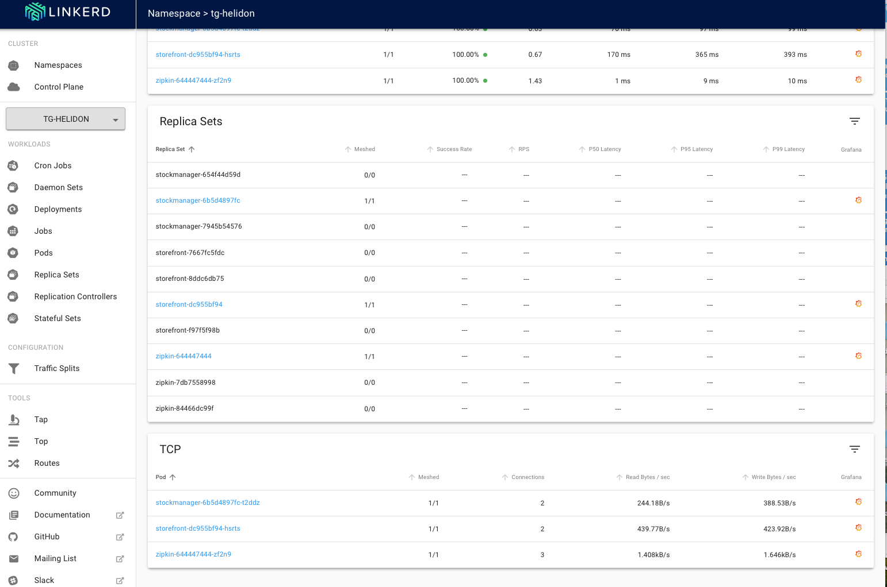
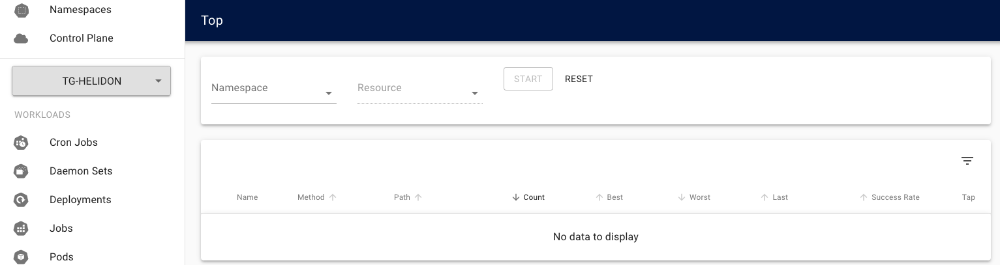
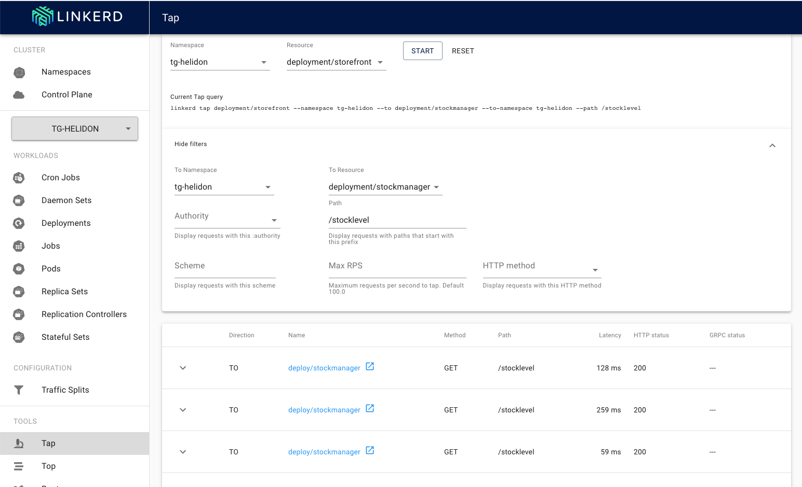
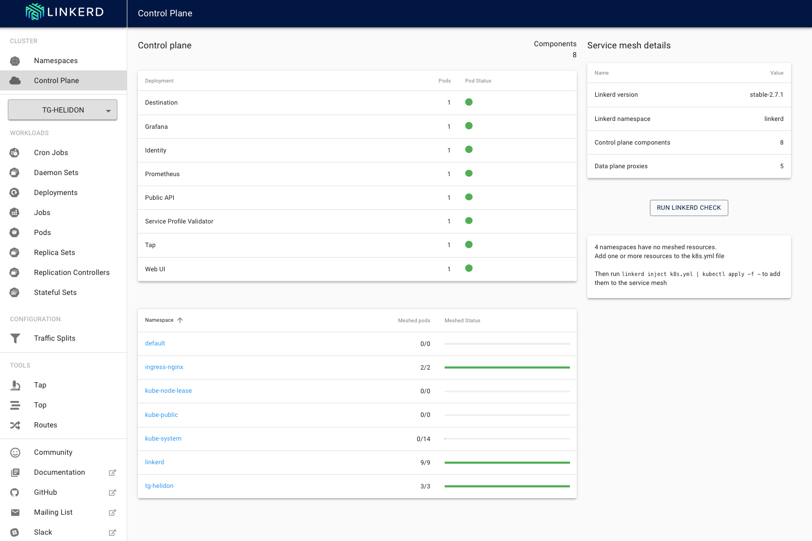
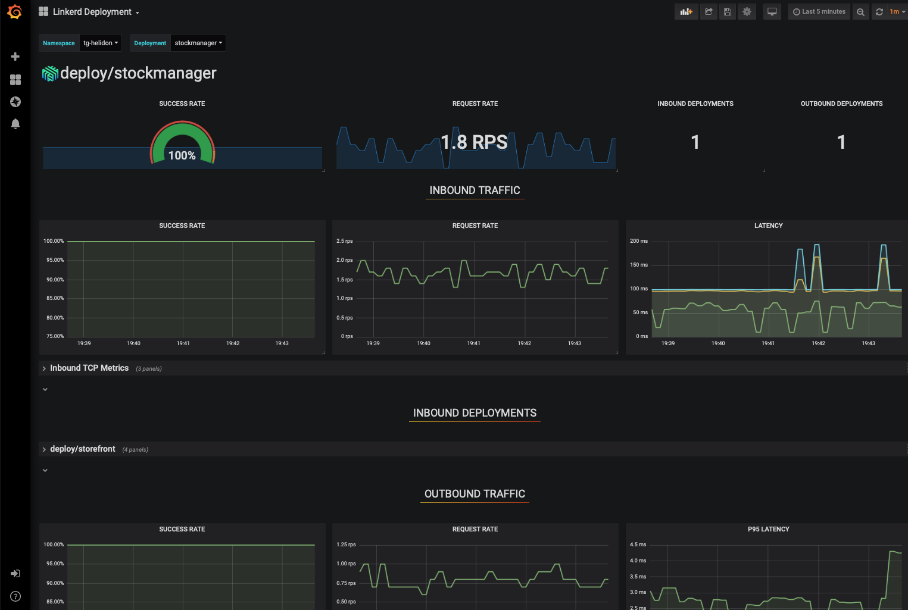
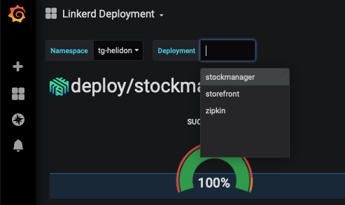
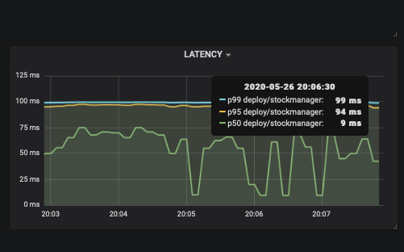
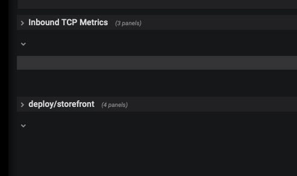
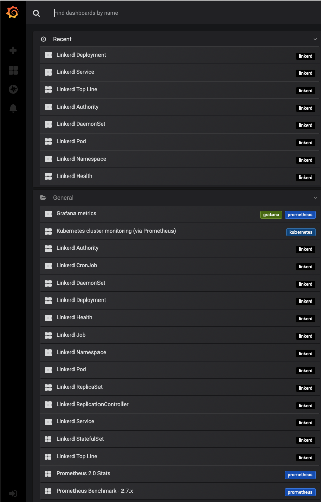

# Cloud Native - Monitoring traffic flows with a Service mesh


<details><summary><b>Self guided student - video introduction</b></summary>


This video is an introduction to the monitoring traffic with a Service mesh lab. Depending on your browser settings it may open in this tab / window or open a new one. Once you've watched it please return to this page to continue the labs.

[](https://youtu.be/sLOM1FUcPwE "Using the service mesh to monitor traffic introduction video")

---

</details>

## Introduction

This is one of the optional sets of Kubernetes labs

**Estimated module duration** 20 mins.

### Objectives

This module shows how to use Linkerd to see the traffic flows between your microservices.

### Prerequisites

You need to complete the `Rolling update` module (last of the core Kubernetes labs modules). You must have completed the `Installing the Linkerd service mesh` module. You can have done any of the other optional module sets, or any combination of the other service mesh modules.

## Task 1: Using the service mesh to see what's happening

We've seen how to install and run the service mesh, we're now doing to look at how to use it.

### Task 1a: Starting a load generator

The first thing we need is some load so we can see what the service mesh is doing, there is a load generator script we can use to do this

Change to the directory for the service mesh scripts

  1. In the OCI Cloud shell type
  
  - `cd $HOME/helidon-kubernetes/service-mesh`

Once you are in the directory start the load generator

If your cloud shell session is new or has been restarted then the shell variable `$EXTERNAL_IP` may be invalid, expand this section if you think this may be the case to check and reset it if needed.

<details><summary><b>How to check if $EXTERNAL_IP is set, and re-set it if it's not</b></summary>

**To check if `$EXTERNAL_IP` is set**

If you want to check if the variable is still set type `echo $EXTRNAL_IP` if it returns the IP address you're ready to go, if not then you'll need to re-set it.

**To get the external IP address if you no longer have it**

In the OCI Cloud shell type

  -  `kubectl --namespace ingress-nginx get services -o wide ingress-nginx-controller`
  
  ```
NAME                       TYPE           CLUSTER-IP    EXTERNAL-IP      PORT(S)                      AGE   SELECTOR
ingress-nginx-controller   LoadBalancer   10.96.61.56   132.145.235.17   80:31387/TCP,443:32404/TCP   45s   app.kubernetes.io/component=controller,app.kubernetes.io/instance=ingress-nginx,app.kubernetes.io/name=ingress-nginx
```

The External IP of the Load Balancer connected to the ingresss controller is shown in the EXTERNAL-IP column.

**To set the variable again**

  - `export EXTERNAL_IP=<External IP>`
  
---

</details>


  2. In the OCI Cloud shell type 
  
  - `bash generate-service-mesh-load.sh $EXTERNAL_IP 2`
  
 ```
Iteration 1
Iteration 2
....
 ```

This will continue generating the load making a request roughly every 2 seconds.

Note, the OCI Cloud Shell session will terminate (and thus kill off the load generator) after 20 minutes of inactivity. If this happens you will see the throughput figures for your namespace and services in the Linkerd and Grafana UI's drop to zero and potentially even disappear if they fall outside the time ranges displayed.

If that happens while you are doing the service mesh labs the solution is to connect back to the OCI CLoud shell and restart the load generator

### Task 1b: Viewing the load

  1. In your laptop web browser go to `https://linkerd.<external IP>.nip.io` (replace `<External IP>` with that of your load balancer)

You may be challenged as you have a self signed certificate. Follow the normal procedures in your browser to accept the connection and proceed.

Next you may be presented with the login challenge.


  2. If you are login with `admin` as the username, for the password use the one you used when creating the login password during the linkerd installation in the previous module.

You'll be presented with the linkerd-web main page, unlike when you saw this previously now it's showing load for your services.


You can see that in both the HTTP metrics and TCP metrics sections the namespace tg-hekidon (your namespace will be different of course) is showing a request rate.

Unlike the Kubernetes dashboard the linkerd UI is very much about providing you with data about what's happening. The data is captured by the linkerd-proxies that form the data plane of the service mesh and then made available via the Promtheus implementation the linkerd install process created. The UI doesn't really offer options for configuring linkerd

A key point here is that this UI is showing you the **current** load (well actually data collated and processed over the very recent history. To see historical data we can use the Grafana instance that the linkerd install process setup. We'll get to that later in the module, for now we're just going to look at the Linkerd UI

<details><summary><b>What are the column headings?</b></summary>


Note, Clicking on a column name will cause the data in the table to be sorted by that column in ascending order, this is useful for example if you had a lot of namespaces to quickly see which ones had the most traffic or failures. Clicking on the column name a second time will change the sort order to be descending.

In the HTTP Metrics section the columns are :

`Namespace` - The name of the namespace

`Meshed` - the number of deployments in the namespace that are part of the service mesh, in this case it's all of the ones in your namespace and the ingress-nginx namespace, but it is possible that in some cases a deployment may not be included (perhaps a deployment has not been restarted, or a deployment has annotations that explicitly disable the use of the service mesh)

`Success Rate` - How often a request made by a deployment within the namespace succeeds, this can be the start of diagnosing problems

`RPS` - The number of requests per second

`P50 Latency` - The maximum time taken to respond to for the fastest 50% of requests.

`P95 Latency` - The maximum time taken to respond to for the fastest 95% of requests.

`P99 Latency` - The maximum time taken to respond to for the fastest 99% of requests.

`Grafana` - If the namespace is in the mesh a little Garafana logo will appear here, clicking on it will switch to the Grafana UI showing the HTTP details for the namespace. **Don't do this now**, we'll look at it later on

In the TCP Metrics section the columns are :

`Namespace` - The name of the namespace

`Meshed` - the number of deployments in the namespace that are part of the service mesh

`Connections` - The number of active connections (I believe this has some averaging applied)

`Read Bytes/sec` and `Write Bytes/sec` - The data volumes being written and read in the namespace

`Grafana` - If the namespace is in the mesh a little Garafana logo will appear here

---

</details>

### Task 1c: Namespace specific load

Let's now look at the specific data for your namespace. 

  1. In the **HTTP metrics** section click on the **name** of your namespace (mine is `tg-helidon`, but yours will be different)

  

The most obvious thing we see here it the data routing network at the top of the page. This shows us which services are initiating connections to which other services within the namespace. We've got an easy way to see our data flows between microservices (to be precise the ones that have the service mesh proxy installed!)

You can see the expected `storefront` to `stockmanager` connection, but also that **both** of them are sending data to the `zipkin` service. This is actually the tracing data. I included zipkin in the deployments with the linkerd-proxy so help show more detail in the graph, but in a production environment you may not want want to do this. 

<details><summary><b>How to exclude a service from the service mesh ?</b></summary>


Once a namespace has the `linkerd.io/inject: enabled` annotation set then all deployments (and thus app pods) started in the namespace will be detected by the linkerd control plane and the linkerd-proxy (and init) containers will be automatically injected without you having to do anything. This allows you to easily use linkerd in situations where you're using a deployment tool (e.g. helm) and not have to modify the helm charts yourself. 

To prevent this from happening simply add the annotation `linkerd.io/inject: disabled` to the pod / deployment, then when the service starts the linkerd control plane will know not to setup the linkerd-proxy and init containers for that pod / pods in the deployment.

---

</details>

<details><summary><b>What about the database connection ?</b></summary>


There are a couple of points here. Firstly we are looking at HTTP data. It's quite probable that the connection which JDBC uses to actually talk to the database is not HTTP based, so we wouldn't expect it to show up in an HTTP report.

But even it we were looking at the TCP metrics report we still wouldn't see the connections from the stockmanager to the database. This is because the database exists outside the service mesh (and the entire Kubernetes cluster) So though the service mesh can see the TCP connection being setup there is no service mesh at the "other" end to receive the connection, thus it will not be able to generate the metrics data as it just doesn't have the information.

Of course if the database was implemented as a Kubernetes based service (perhaps we were using MySQL in the cluster as our database) then the connection from the stock manager to the database would show up if we had enabled linkerd on the pods in that deployment.

---

</details>


We can see reporting details on a number of Kubernetes objects within the namespace in addition to the route diagram.

There are details on the deployments and also specific pods. 

  2. If we scroll down a bit we can see further information.

  

We can see the traffic broken down by replica set and the TCP traffic. 

You will see something unusual in the replica sets section above (and potentially in your environment as well if you've done any of the modules which involve upgrading a deployment) The display is showing not just the current replica set (these are in blue and are clickable links) but it's also showing the other older replica sets (these are not links and contain no pods.) 

This may seem pointless, but it's actually very important if we look at this from a rolling upgrade perspective. As seen in the rolling upgrade module, we were upgrading a deployment then there will be **two** (at least) replica sets with pods that are actively servicing the deployment. Each replica set will reflect a different configuration, the old and the new ones. By breaking the information down per replica set during the rolling update (or roll back) we will be able to see how each replica set (and thus configuration) is behaving. Of course the rolling upgrades we have done so far have been configured to complete as soon as possible, but as we will see later there are other approaches (e.g. canary deployments) where the process takes a lot longer with the traffic being split between the deployment and being able to determine if the new version is working properly. There being able to examine what is happening for each version (or have automation manage that for you) is critical.

Let's look at what the pod is specifically doing, in the pods section 

  3. Click on the stock manager pod, in my case that's stockmanager-6b5d4897fc-t2ddz but of course yours will be different

  

Note that you may also see information for linkerd pods such as the prometheus and tap service. Don't worry if you don't, but we will ignore them as they are basically the internal workings of the service mesh communicating with the proxy in the stockmanager pod to gather information. 

Firstly we can see the other pods that are talking to this stock manager pod (the storefront) and the Kubernetes pods it's talking to (zipkin) The database not being a Kuberntes service isn't shown.

Below that we can the specific details. There's a lot of data we can see about the message flows and volumes, even in a simple setup like this one.

### Task 1d: What network traffic is happening ?

So far we've seen what's happening on the pods, but as the service mesh is a layer 7 proxy it knows what's happening within the requests. Note in mid October 2020 as I was testing this module I found this section of the lab works best with Chrome, some features did work in Firefox. The live monitoring features did not work in Safari. Those browsers may have been updated since then of course.

  1. On the left hand menu in the tools section 

  


  2. Click on the **Top** option

We switch to the Top screen

  

Here we can have a look at the REST API calls being made to / from a service.

  3. Click on the **Namespace**, select **your** namespace from the list

  

  4. Click on the **Resource** section (this may have been updated when you selected a namespace) 

  5. Select `deloyment/storefront` from the list

  

Note that the UI is displaying what the query would be if you ran the linkerd command manually, in this case it's `linkerd top deployment/storefront --namespace tg-helidon` This helps you understand how you could write scripts to gather information if you liked)

  6. Click the **Start** button (when you selected the resource it may have automatically started, in which case **do not** click the `Stop` button)

  7. Wait a short while for requests to be made and data to be gathered

  

We can now see that the storefront deployment has been receiving requests from the ingress controller on `/store/stocklevel` and making requests to the stockmanager on `/stocklevel` and occasionally connecting to Zipkin to report the tracing spans on `/api/v2/spans` More importantly we can see how many requests there have been and their timings, a useful tool for understanding what's actually happening within your collection of microservices. 

You may also see requests to /status, /metrics and /health/live These are the Kubernetes framework checking to ensure that the pod is alive and ready, and Prometheus gathering performance metrics.

  8. Click the **Tap** icon  on the right of the `To stockmanager` row

  

This is the Tap page, it let's us look at individual requests so we can see how things are going, and also diagnose problems. If it's not obvious you could also get to it by clicking the **Tap** menu option in the tools section on the left hand menu.

For now we are not going to change any of these settings as we're just exploring, but you can see there are options to filter the requests, for example only looking at HTTP PUT rather than all requests

  9. Click the **Start** button

Wait a short while for requests to be made and data to be gathered

  

We see the results as they are generated, let's look at them

  10. Click the **Stop** button 

  11. Click on the "down arrow" - at the start of each row to the left of the `Direction` column

  

We can now see the details of the request. Note that we **do not** see the content of the request, only the header information (content could of course contain private information, admittedly the basic auth can easily be reversed, but in a production rather than a lab environment you's use something like JWT or OAUTH2.) We can however see the duration of the request, and other information that could be very useful in diagnosing  problems (something we will look at in another module)

### Task 1e: Status of linkerd itself

Finally let's have a quick look at the status of the linkerd control plane itself

We've currently been looking at the services, deployments and pods within the namespaces, we need to switch to the control plane view.

  1. Click **Control Plane** on the upper left.

  

It's not a surprise, but we can now see the details of the control plane :-)

  

In the control plane we can see the deployments, the green dots indicate all is well with the services, to the right of that we have a summary of the actual installation. Then there is the list of all of the namespaces currently part of the mesh (this is clickable in the same way as the namespaces list we saw at the start of this module.)

<details><summary><b>What happens if the control plane fails ?</b></summary>

Obviously if the service mesh is managing all of the network traffic flowing in your cluster then there's a concern as to what will happen if the service mesh itself fails.

The details below cover Linkerd but the basic principles apply to all service meshes.

Firstly the control plane is itself running in Kuernetes, this means if the control plans services have problems then the containers will be restarted automatically by Kubernetes, equally upgrades can be done in a rolling manner.

If the control plane does have a significant failure then existing proxies (i.e. for existing pods) will continue to operate, though they won't get any updates to their configuration until the control plane comes back. Of course any new pods will not get their configuration, so will not be able to communicate (though they should get the additional proxy containers configured in the pods for when the control plane becomes available.)

In summary - what you have working will continue to work, but making changes will not be effective until the control plane restarts.

There is more information on control plan failure in [the linkerd FAQ](https://linkerd.io/2/faq/#what-happens-to-linkerds-proxies-if-the-control-plane-is-down)

---

</details>

## Task 2: Looking at the Grafana visualizations.

The data we've seen so far is the live view, but if we wanted to understand what was happening over a longer period of time (say to understand how the request breakdown changes over the day) we want to look at historical data. To do that we will use the Grafana visualizations that the linkerd install setup for us. 

We could of course go direct to the Grafana page for a specific item (all the tables have a little Grafana icon  which would take us there directly) but let's start out looking at the Grafana overview

  1. In your laptop web browser go to `https://linkerd.<external IP>.nip.io/grafana`

  

The first few rows show us a summary of everything that's running in the system, As expected everything is fine in this image.

The remainder of the Grafana dashboard shows us what's happening broken down by namespace, you don't need to do anything to get these, this will update as you add or remove namespaces from linkerd. 

  2. You may have to scroll down to find it, as they are in alphabetical order, but here is the section for my namespace

  

  3. Click on the name for your namespace, mine is ns/tg-helidon, but yours of course will vary.

  

This takes us to a details page for our namespace. It's showing us the page for the stock manager deployment, but you could change that (please **don't**) using the dropdowns on the upper left

  

  4. Hover your mouse above the **Latency** graph on the right

  

This give us a report of the latency of handling requests , the green line hows the max latency for 50% or the requests, the other lines show us the max latency for 95% and 99% of the requests.

Grafana is showing us an overview in the first few sets of panels. There are however a number of panel sets that are currently hidden

  

  5. Click on the **>** to the left of the **Inbound TCP Metrics** heading

  

This will expand the panel and we can see more details.

Let's look at the TCP performance graph on the right hand side. In my deployment there are two "buckets" of performance, the lower white one and the upper red one (yours may of course vary)

  6. Hover your mouse over the lower "bucket" to get a tool tip like popup

  

We can see that this is reporting that 50 requests were received in the 0 to 2 millisecond range (on my system the upper red line is reporting one request in the 21-23 millisecond range)

There are many other dashboards provided by Grafana, they all have the same basic functionality, but look at the data in different ways

  7. On the upper left click the dashboard name, in this case `Linkerd Deployment`

  

You will get a long list of dashboards

  

The ones that have recently been visited are listed first (I've been exploring a fair bit as I write this module, so there are many recent's in my list, yours may only contain the `Linkerd Deployments` dashboard.) Then the full list of available dashboards. The ones relating to Linkerd are indicated by their name, and also the `linkers` tag on the right side of the list.

Feel free to explore the dashboards if you like, the Linkerd Health dashboard provides information on the operation of linkerd itself, whcih may be of interest to the linkerd developers.

## Task 3: Stopping the load generator

  1. In the OCI cloud shell stop the load generator using Control-C
  
## End of the module, What's next ?

You can chose from the remaining **Linkerd service mesh** modules or switch to one of the other Kubernetes optional module sets.

## Acknowledgements

* **Author** - Tim Graves, Cloud Native Solutions Architect, EMEA OCI Centre of Excellence
* **Contributor** - Charles Pretzer, Bouyant, Inc for reviewing and sanity checking parts of this document.
* **Last Updated By** - Tim Graves, July 2021
