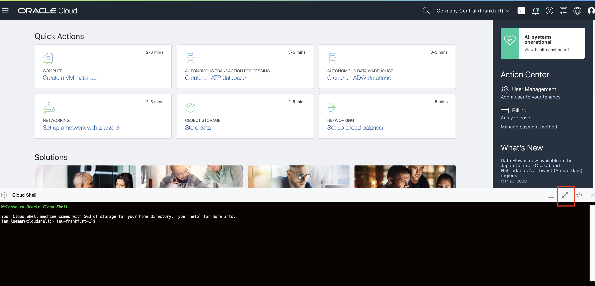

# Kubernetes labs - Cloud Shell setup

## Introduction

**Estimated module duration** 10 mins.

### Objectives

This module takes you through the process of setting up your OCI Cloud shell environment for the Kubernetes labs (including the optional labs)

### Prerequisites

You need to complete the **Create your Kubernetes cluster** module.

## Step 1: Accessing the cloud shell

You will be using the **Oracle OCI Cloud shell** to run the Kubernetes parts of the labs.

The **OCI Cloud Shell** is accessible through the Oracle Cloud GUI, and has a number of elements set up out of the box, like the Oracle Cloud Command Line Interface, and it also has quite some useful command-line tools pre-installed, like git, docker, kubectl, helm and more.

To access the OCI Cloud Shell, you can use the native browser on your laptop (you don't need to use the Linux desktop VM anymore).

  1. Login to your Oracle Cloud Console

  2. Click the icon on the top right of your screen:  **>_**

  

  3. This will result in the OCI Cloud Shell to be displayed at the bottom of your window.

  

  4. To maximise the size of the OCI Cloud Shell window, click the "Arrows" button on the right of the console as indicated above:


Note, in some steps you may want to minimize the OCI Cloud Shell so you can get information from the GUI. Click the arrows icon again  to minimize the OCI Cloud Shell and see the Oracle Cloud GUI again. Alternatively you can open a second browser window or tab onto the Oracle Cloud GUI.

In some steps you are asked to edit files. The OCI Cloud Shell supports typical Linux editors such at `vi`, `emacs` and `nano` Use the editor you prefer to make changes to files. When you use kubectl to edit configuration directly however it uses a vi style editor.

<details><summary><b>Not familiar with vi ?</b></summary>

If you are not familiar with vi this is a very short intro

vi is a modal editor, there are two modes, navigating around (done using the cursor keys on your keyboard) and editing

To edit navigate to the place you want to change using the keyboard arrows, 

  **x** key on the keyboard will delete the character under the cursor
	
  **i** key will switch to editing mode and start to insert in front of the cursor (you can use delete etc.) 
  
  To switch back to the navigation mode then press the **Escape** key on your keyboard.

When you have finished changing the file then press the **Escape** key on your keyboard then press **ZZ** (that's capital Z twice) to save the file and exit

For more details on vi there is a [guide here](http://heather.cs.ucdavis.edu/~matloff/UnixAndC/Editors/ViIntro.html)

---

</details>

<details><summary><b>Permissions problem accessing the OCI Cloud Shell ?</b></summary>

If you are denied access to the OCI Cloud Shell then it means that you do not have the right policies set for your groups in your tenancy. This can happen in existing tenancies if you are not an admin or been given rights via a policy. (In a trial tenancy you are usually the admin with all rights so it's not generally an issue there.) 

You will need to ask your tenancy admin to add you to a group which has rights to access the OCI Cloud Shell. See the [Required IAM policy](https://docs.cloud.oracle.com/en-us/iaas/Content/API/Concepts/cloudshellintro.htm#RequiredIAMPolicy) in the OCI Cloud Shell documentation.

---

</details>

## Step 2: Downloading the scripts and templates

Firstly we need to download all of the scripts, templates and other configuration data to run the labs into your OCI Cloud Shell environment. You have a few GB of storage so these will fit just fine. The scripts and instructions are stored in git.


  1. Open the OCI Cloud Shell

  2. Make sure you are in the top level directory
  
  - `cd $HOME`
  
  3. Clone the repository with all scripts from github into your OCI Cloud Shell environment
  
  - `git clone https://github.com/CloudTestDrive/helidon-kubernetes.git`
  
## Step 3: Downloading the database wallet file

Usually you do not hard code the database details in to the images, they are held externally. This is for security reasons, and also convenience, you may decide to switch to a different database, or just change the user password of the database, and it's a lot easier doing that through configuration than having to rebuild the image.

To keep the secrets outside the image means that you need to get the database connection details so you can add them to your Kubernetes configuration.

We will use the OCI Cloud Shell to download the database wallet file. 
  
  1. Make sure you are in the top level directory
  
  - `cd $HOME`
  
  2. Attention: replace the example ODIC below with the OCID of your database. If you didn't copy this when you created the database or don't have it then if you go to the database page for your instance (Hamburger -> Oracle Database -> Autonomous Transaction Processing -> your instance) it will be shown there with a **copy** link)
    
  - `oci db autonomous-database generate-wallet --file Wallet.zip --password 'Pa$$w0rd' --autonomous-database-id ocid1.autonomousdatabase.oc1.eu-frankfurt-1.aa8d698erlewaiehqrfklhfoeqwfaalkdhfuieiq`

  ```
Downloading file  [####################################]  100%
```

  3. Create the wallet directory and navigate to it:
  
  - `mkdir -p $HOME/helidon-kubernetes/configurations/stockmanagerconf/Wallet_ATP`
  
  - `cd $HOME/helidon-kubernetes/configurations/stockmanagerconf/Wallet_ATP`
  
  4. Copy the wallet file to the directory
  
  - `cp $HOME/Wallet.zip .`
  
  5. Unzip the wallet file
  
  - `unzip Wallet.zip`
  
  6. Look at the contents of the tnsnames.ora file to get the database connection names
  
  - `cat tnsnames.ora`

  ```
jleoow_high = (description= (retry_count=20)(retry_delay=3)(address=(protocol=tcps)(port=1522)(host=adb.eu-frankfurt-1.oraclecloud.com))(connect_data=(service_name=cgipkrq1hwcdlkv_jleoow_high.atp.oraclecloud.com))(security=(ssl_server
_cert_dn="CN=adwc.eucom-central-1.oraclecloud.com,OU=Oracle BMCS FRANKFURT,O=Oracle Corporation,L=Redwood City,ST=California,C=US")))

jleoow_low = (description= (retry_count=20)(retry_delay=3)(address=(protocol=tcps)(port=1522)(host=adb.eu-frankfurt-1.oraclecloud.com))(connect_data=(service_name=cgipkrq1hwcdlkv_jleoow_low.atp.oraclecloud.com))(security=(ssl_server_c
ert_dn="CN=adwc.eucom-central-1.oraclecloud.com,OU=Oracle BMCS FRANKFURT,O=Oracle Corporation,L=Redwood City,ST=California,C=US")))

jleoow_medium = (description= (retry_count=20)(retry_delay=3)(address=(protocol=tcps)(port=1522)(host=adb.eu-frankfurt-1.oraclecloud.com))(connect_data=(service_name=cgipkrq1hwcdlkv_jleoow_medium.atp.oraclecloud.com))(security=(ssl_se
rver_cert_dn="CN=adwc.eucom-central-1.oraclecloud.com,OU=Oracle BMCS FRANKFURT,O=Oracle Corporation,L=Redwood City,ST=California,C=US")))

jleoow_tp = (description= (retry_count=20)(retry_delay=3)(address=(protocol=tcps)(port=1522)(host=adb.eu-frankfurt-1.oraclecloud.com))(connect_data=(service_name=cgipkrq1hwcdlkv_jleoow_tp.atp.oraclecloud.com))(security=(ssl_server_cer
t_dn="CN=adwc.eucom-central-1.oraclecloud.com,OU=Oracle BMCS FRANKFURT,O=Oracle Corporation,L=Redwood City,ST=California,C=US")))

jleoow_tpurgent = (description= (retry_count=20)(retry_delay=3)(address=(protocol=tcps)(port=1522)(host=adb.eu-frankfurt-1.oraclecloud.com))(connect_data=(service_name=cgipkrq1hwcdlkv_jleoow_tpurgent.atp.oraclecloud.com))(security=(ss
l_server_cert_dn="CN=adwc.eucom-central-1.oraclecloud.com,OU=Oracle BMCS FRANKFURT,O=Oracle Corporation,L=Redwood City,ST=California,C=US")))
```

  You will see a list of the various connection types to your database.

  7. Locate the "high" connection type to your database and take a note of the full name, in the example above that's `jleoow_high` **but yours will differ**

  8. Be sure to write down the database connection name you have just found, you will need it later

  9. Return to the home directory

  - `cd $HOME`

## Step 4: Setting up your department Id

To allow for some lab situations where there are multiple users in the same database we separate tables by department Id, like many other parts of these labs this will be based on your name or initials.

We need to configure the stockmanager-config.yaml file. You need to do this even if you have done the Helidon labs as the set of configuration data downloaded into the OCI Cloud Shell is generic and does not include the customizations you made in the Helidon labs 

  1. Navigate into the folder 
  
  - `cd $HOME/helidon-kubernetes/configurations/stockmanagerconf/conf`
  
  2. Open the file **stockmanager-config.yaml**
  
  3. In the `app:` section, add a property **department** with **your** your name, initials or something that's going to be **unique**
  
  -  `department: "your_name"`

Example (Yours will be different of course)

```yaml
app:
  persistenceUnit: "stockmanagerJTA"
  department: "timsDepartment"
```
 
  4. Save the changes to the file
 
## End of the setup module, What's next ?

Go to the **Setting up the cluster and getting your services running in Kubernetes** lab

## Acknowledgements

* **Author** - Tim Graves, Cloud Native Solutions Architect, EMEA OCI Centre of Excellence
* **Contributor** - Jan Leemans, Director Business Development, EMEA Divisional Technology
* **Last Updated By** - Tim Graves, November 2020

## Need Help ?

If you are doing this module as part of an instructor led lab then please just ask the instructor.

If you are working through this module self guided then please submit feedback or ask for help using our [LiveLabs Support Forum](https://community.oracle.com/tech/developers/categories/OCI%20Native%20Development). Please click the **Log In** button and login using your Oracle Account. Click the **Ask A Question** button to the left to start a *New Discussion* or *Ask a Question*.  Please include your workshop name and lab name.  You can also include screenshots and attach files.  Engage directly with the author of the workshop.
 