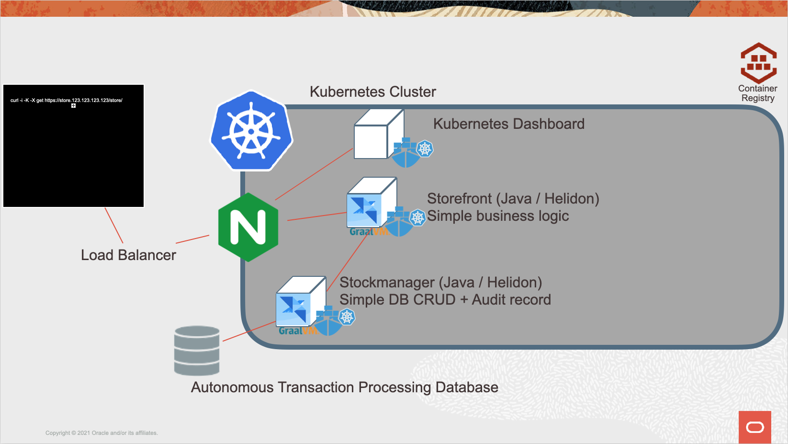

# Cloud Native - Kubernetes labs

## Deploying to Kubernetes 

<b>Self guided student - video introduction</b>

This video is an introduction to the Kubernetes labs. Depending on your browser settings it may open in this tab / window or open a new one. Once you've watched it please return to this page to continue the labs.

---

## Prerequisites

These labs can be run in many different ways, but in all cases you will need access to a Oracle Cloud Tenancy and be signed in to it.

Please look at the instructions in the Prerequisites section for details of how to sign up for a free trial tenancy and how to log into it. If you already have access to a tenancy (you may be in an instructor led lab, or have a pre-existing tenancy) then go direct to Prerequisites Step 2 which covers how to login to the tenancy.

## Getting Help

If you are in an instructor led lab then clearly just ask your instructor, if you are working through this self guided then each module has a section at the end for getting help. 

## Introduction

In this series of labs we will focus on the specific features of Kubernetes to run Microservices.  These labs use a pre-built set of docker images but you can if you did the **Helidon** and **Docker** modules you can use the images you created there if you wish. 

### Lab conventions

We have used a few layout tricks to make the reading of this tutorial more intuitive : 

- If you see a "Bullet" sign, this means **you** need to perform some sort of **action**.  This can be 
  - Opening a window and navigating to some point in a file system
  - Executing some command on the command line of a terminal window :
    -  For example : `ls -al`

As we cover quite some theoretical concepts, we included pretty verbose explanations.  To make the lab easier to grasp, we placed the longer parts in *Collapsibles*:

<b>Click this title to expand!</b>

If you feel you are already pretty familiar with a specific concept, you can just skip it, or read quickly through the text, then re-collapse the text section by re-clicking on the title. 

---

## What you are about to create

You are about to create a Kubernetes deployment with two microservices, Storefront and Stockmanager. These are very simple microservcies to show a very small bit of business logic and how to access the Autonomous Transaction Processing database. Once they are running you will look at how Kubernetes delivers high availability, horizontal scaling and rolling upgrades. There will also be the System services of an Ingress controller with associated load balancer and the Kubernetes dashboard 

## Setup your core tenancy using scripts

This module takes you through the process of using the scripts we have provided to gather data, create compartments,and a database used by the microservices running in Kubernetes. If you have already created these in a previous lab you can skip this module

Please follow the tasks in the **Setup your core tenancy using scripts** section (click the name in the labs index)

## Setup the Kubernetes environment using scripts

This module takes you through the process of using the scripts we have provided to create a Kubernetes cluster. If you have already created this in a previous lab you can skip this module

Please follow the tasks in the **Setup your kubernetes environment using scripts** section (click the name in the labs index)

## Setup your container images using scripts

This module takes you through the process of using the scripts we have provided to build the container images you will be using in your Kubernetes cluster and to push them into the Oracle Container Image Registry (OCIR) If you have already created these in a previous lab you can skip this module

Please follow the tasks in the **Setup your container images using scripts** section (click the name in the labs index)

## Basic Kubernetes - Setting up your cluster and running your services

This section covers how to run the docker images in kubenetes, how to use Kubernetes secrets to hold configuration and access information, how to use an ingress to expose your application on a web port. Basically this covers how to make your docker based services run in in a Kubernetes cluster.

We also look at using Helm to install Kubernetes "infrastructure" such as the ingress server

## Cloud Native with Kubernetes

### Is it running, and what to do if it isn't

Kubernetes doesn't just provide a platform to run containers in, it also provides a base for many other things including a comprehensive service availability framework which handles monitoring containers and services to see if they are still running, are still alive and are capable of responding to requests.

## Horizontal and Auto Scaling

Kubernetes also supports horizontal scaling of services, enabling multiple instances of a service to run with the load being shared amongst all of them. 

This horizontal scaling lab shows how you can manually control the number of instances.

Horizontal scaling provides you with a manual process to control how many instances of a microservice you have running, but Kubernetes also offers a mechanism to automatically change the number of instances.

This auto scaling labs shows how you can have Kubernetes automatically scale the number of instances for you.

## Rolling out deployment updates

Commonly when a service is deployed it will be updated, Kubernetes provides support for performing rolling upgrades, ensuring that the service continues running during the upgrade. Built into this are easy ways to reverse a deployment roll out to one of it's previous states.

---

## Further Information

For links to useful web pages and other information that I found while writing these labs see the further information on Kubernetes section

## End of this tutorial

We hope you enjoy doing the labs, and that they will be useful to you. 

When you finish the modules in this lab the take the time for a cup of tea (or other beverage of your choice). While you're having that well earned break we recommend that you visit the [Oracle live labs site](https://apexapps.oracle.com/pls/apex/dbpm/r/livelabs/home) for a wide range of other labs on a variety of subjects.

## Acknowledgements

* **Author** - Tim Graves, Cloud Native Solutions Architect, EMEA OCI Centre of Excellence
* **Last Updated By** - Tim Graves, November 2020

