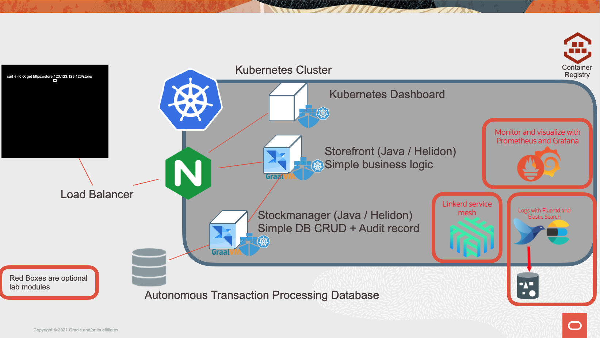

# Cloud Native - Kubernetes labs

## Monitoring, Logging and Service Meshes with Kubernetes

## Prerequisites

These labs can be run in many different ways, but in all cases you will need access to a Oracle Cloud Tenancy and be signed in to it.

Please look at the instructions in the Prerequisites section for details of how to sign up for a free trial tenancy and how to log into it. If you already have access to a tenancy (you may be in an instructor led lab, or have a pre-existing tenancy) then go direct to Prerequisites Step 2 which covers how to login to the tenancy.

## Getting Help

If you are in an instructor led lab then clearly just ask your instructor, if you are working through this self guided then each module has a section at the end for getting help. 

## Introduction

In this series of labs we will focus on how to monitor microsertvices using Prometheus and to visualise performance data using Grafana, It will show how to capture and save log messages in Elastic or Object Storage and how to use the Linked service mesh to monitor request flows, trouble shoot problems and co canary deployments (as well as a little chaos engineering)

It is not required that you have previously done the core Kubernetes lab, but if you are unfamiliar with Kubernetes you may find the concepts easier to understand if you have done so.

### Lab conventions

We have used a few layout tricks to make the reading of this tutorial more intuitive : 

- If you see a "Bullet" sign, this means **you** need to perform some sort of **action**.  This can be 
  - Opening a window and navigating to some point in a file system
  - Executing some command on the command line of a terminal window :
    -  For example : `ls -al`

As we cover quite some theoretical concepts, we included pretty verbose explanations.  To make the lab easier to grasp, we placed the longer parts in *Collapsibles*:

<b>Click this title to expand!</b>

If you feel you are already pretty familiar with a specific concept, you can just skip it, or read quickly through the text, then re-collapse the text section by re-clicking on the title. 

---

## What you are about to create

You are about to use a Kubernetes deployment with two microservices, Storefront and Stockmanager to see how to setup monitoring in Kubernetes using Prometheus and Grafana, how to process log data from the microservices using fluentd, Elastic search and to store it in Oracle object storage. Then you will see how the Linkerd service mesh can be used to monitor traffic flows between the microservices, to use those flows to troubleshoot and to do a canary deployment (as well as a little chaos engineering).

The image below shows the basic structure of the microservices we will be working with and the elements within this lab are highlighted with red boxes.

## Setup your core tenancy using scripts

This module takes you through the process of using the scripts we have provided to gather data, create compartments,and a database used by the microservices running in Kubernetes. If you have already created these in a previous lab you can skip this module

Please follow the tasks in the **Setup your core tenancy using scripts** section (click the name in the labs index)

## Setup the Kubernetes environment using scripts

This module takes you through the process of using the scripts we have provided to create a Kubernetes cluster. If you have already created this in a previous lab you can skip this module

Please follow the tasks in the **Setup your kubernetes environment using scripts** section (click the name in the labs index)

## Setup your container images using scripts

This module takes you through the process of using the scripts we have provided to build the container images you will be using in your Kubernetes cluster and to push them into the Oracle Container Image Registry (OCIR) If you have already created these in a previous lab you can skip this module

Please follow the tasks in the **Setup your container images using scripts** section (click the name in the labs index)

## Installing the initial Kubernetes services using scripts

To get the microservices we will be using running in Kubernetes there are a number of tasks, to make it easier and allow for a Dev Ops focused lab we have created a script that will automatically go through the steps in the main Kubernetes lab. If you already have the storefront and stockmanager microservices running in Kubernetes you can skip this module.

Note that if the Kubernetes cluster has not finished being created you can proceed to a subsequent module, then return to this one later (as long as you complete it before you start the deployments process it's fine)

## Part 1 Monitoring your services

Once a service is running in Kubernetes we want to start seeing how well it's working in terms of the load on the service. At a basic level this is CPU / IO's but more interesting are things like the number of requests being serviced. You will need to do this module if you are going to do the Grafana for data display module.

Monitoring metrics may also help us determining things like how changes when releasing a new version of the service may effect it's operation, for example does adding a database index increase the services efficiency by reducing lookup times, or increase it by adding extra work when updating the data. With this information you can determine if a change is worthwhile keeping.

You will need to have completed the Promethus module before stating the Grafana module

#### Part 1a. Monitoring services -  Prometheus for data gathering

Once a service is running in Kubernetes we want to start seeing how well it's working in terms of the load on the service. At a basic level this is CPU / IO's but more interesting are things like the number of requests being serviced. You will need to do this module if you are going to do the Grafana for data display module.

Monitoring metrics may also help us determining things like how changes when releasing a new version of the service may effect it's operation, for example does adding a database index increase the services efficiency by reducing lookup times, or increase it by adding extra work when updating the data. With this information you can determine if a change is worthwhile keeping.

The process for installing and using Prometheus is detailed in the Prometheus module.

### Part  1b. Monitoring services - Grafana for data display
To do this optional module you will have to have completed the optional Promtheus for data gathering module.

As you've seen Prometheus is great at capturing the data, but it's not the worlds best tool for displaying the data. Fortunately for us there is an open source tool called **Grafana** which is way better than Prometheus at this.

The process for installing and using Grafana is detailed in the Visualising with Grafana module

## Part 2. Capturing and processing log data

These modules are self standing, you can do either of them, or both. They have no dependencies and currently there are no other optional modules dependent on them.

Both these lab modules use fluentd to read the log data within the Kuberntes environment

### Part 2a. Log Capture for processing

This optional module shows how you can use fluentd to capture the log data, and then write the output to Elastic Search (often used to help process log data in Cloud Native deployments). The module is intended as an example of how to handle log data for people who will need instant indexed access to the log data.

To understand how to do do this look at the Log capture for processing module.

### Part 2b. Log Capture for long term storage (archive)

This optional module shows how you can use fluentd to capture the log data, and then write the output to a long term storage offering, In this case we will be writing to the S3 compatible Oracle Object Storage Service. The module is intended as an example to how to handle log data for people that need to retain log data for the long term (perhaps for legal reasons) but don't need instant access, so can use the most cost effective long term storage.

The process here is covered in the Log Capture For Archive module.

## Part 3. Service meshes

These labs are semi-independent, You must do the 3a Service mesh install and setup module, but after that you can do most of the Service mesh modules in any order order listed, the exception is if you want to do the traffic split module you must have done the troubleshooting module. If you don't want to do all of them you can stop at any point. If you decide to uninstall the linkerd service mesh then obviously (I hope!) do that once you have completed the all service mesh labs you want to do!

You do not need to have completed the monitoring or logging modules to do these service mesh modules

A service mesh is two parts, a control plane that manages the mesh, and a data layer that is automatically added to your Kubernetes deployments by the control plane (usually by what's known as a sidecar container). The data plane sits between your micro-service implementations and the underlying network, and manages your network activities. Depending on the implementation the data plane can even cross multiple Kubernetes clusters, making them appear as one. 

The data plane provides support for things like automatically encrypting traffic exiting your micro-service implementation and decrypt it on arrival at the next (whilst automatically handling certificate management for you). It can also do things like traffic management functions where it implements the service balancing (again this can be cross cluster for some service mesh implementations) and traffic balancing where a portion of the traffic is diverted to a test instance, perhaps for automated A/B testing or for a canary rollout where a CI/CD toolkit triggers a deployment, and the tooling in conjunction with the service mesh tests it out on a small subset of the traffic, automatically canceling the rollout if there are problems.

Service meshes can also monitor the traffic flowing throughout your clusters, enabling the gathering of detailed request / response statistics, for example what the failure rate is of requests to a particular endpoint.

As they are part of the network they can also split the network traffic, enabling activities like canary rollouts and testing the system by injecting faults.

### Part 3a Service mesh install and setup

You must do this module before you can do any of the other service mesh modules

This module shows how to install the Linkerd service mesh, and enable it on the micro-servcies we have been using for this lab.

Instalation is covered in the Installing the Linkerd service mesh module

#### Part 3b. Monitoring traffic with the service mesh

You must have done the service mesh install and setup module before this one.

This module shows how to use the service mesh we installed in Optional lab 3a to report on the traffic between the micro-services in our application on the cluster.

You can see how to do traffic monitoring in the Traffic monitoring with a Linkerd service mesh module.

### Part 3c. Using the service mesh to troubleshoot problems

You must have done the service mesh install and setup module before this one.

This modules uses a simulated "broken" implementation of the stockmanager service to generate errors, then we use the service mesh monitoring capabilities to see where the error is and the conditions around it.

To understand how to troubleshoot using the service mesh see the  service mesh see the Using the Linkerd service mesh for troubleshooting module.

### Part 3d. Using the traffic split facility of the service mesh

You must have done the service mesh install and setup module, and the service mesh troubleshooting module before this one.

This module looks at the traffic split capability in the service mesh implementations to see how it can be used for testing purposes, for example injecting faults to do some chaos engineering and test out the overall environment.

This module also used the traffic split capability of the service mesh to show how you can do a canary deployment

Discover what you can do with a service mesh traffic splits in the Traffic splits with the Linkerd service mesh (Canary deployments, and chaos engineering) module.

### Part 3e Uninstalling the service mesh

**Only** do this after you have completed the service mesh lab modules you want to do.

To learn how to uninstall the service mesh see the it Uninstalling the Linkerd service mesh module.

---

## Further Information

For links to useful web pages and other information that I found while writing these labs see the further information on Kubernetes section

## End of this tutorial

We hope you enjoy doing the labs, and that they will be useful to you. 

When you finish the modules in this lab the take the time for a cup of tea (or other beverage of your choice). While you're having that well earned break we recommend that you visit the [Oracle live labs site](https://apexapps.oracle.com/pls/apex/dbpm/r/livelabs/home) for a wide range of other labs on a variety of subjects.

## End of this tutorial

We hope you enjoy doing the labs, and that they will be useful to you. 

When you finish the modules in this lab the take the time for a cup of tea (or other beverage of your choice). While you're having that well earned break we recommend that you visit the [Oracle live labs site](https://apexapps.oracle.com/pls/apex/dbpm/r/livelabs/home) for a wide range of other labs on a variety of subjects.

## Acknowledgements

* **Author** - Tim Graves, Cloud Native Solutions Architect, EMEA OCI Centre of Excellence
* **Last Updated By** - Tim Graves, February 2022

