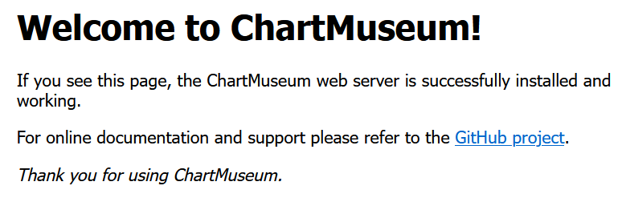
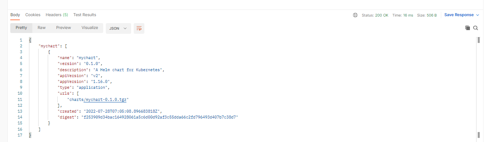

# Deploy a private helm repository with ChartMuseum and Let's Encrypt
  
## Deploy ChartMuseum

### Install ChartMuseum from a helm chart

ChartMuseum is an open-source, easy to deploy, Helm Chart Repository server.

1. Create a namespace:

```
kubectl create namespace chartmuseum
```

3. Add the helm repo:

```
helm repo add chartmuseum https://chartmuseum.github.io/charts
```

4. Generate the installation manifest:

```
helm show values chartmuseum/chartmuseum > chartmuseum.yaml
```

5. Edit the chartmuseum.yaml:

```
env.open.STORAGE: local
env.open.DISABLE_API: false
env.open.AUTH_ANONYMOUS_GET: true
env.open.AUTH_REALM: chartmuseum

env.secret.BASIC_AUTH_USER: curator
env.secret.BASIC_AUTH_PASS: password

```

6. Install ChartMuseum

```
helm install --namespace chartmuseum chartmuseum chartmuseum/chartmuseum -f chartmuseum.yaml
```

7. Configure the domain name with nip.io

```
ingress.enabled: true
ingress.hosts:
    - name: chartmuseum.LOAD-BALANCER-IP.nip.io
      path: /
      tls: false
ingress.ingressClassName: nginx
```

8. Update ChartMuseum deployment

```
helm upgrade chartmuseum chartmuseum/chartmuseum -f chartmuseum.yaml
```

9. Verify ChartMuseum is working by accessing http://chartmuseum.LOAD-BALANCER-IP.nip.io in you browser or using curl:

```
curl http://chartmuseum.$EXTERNAL_IP.nip.io
```

10. You should see something like the following:



### Create and push a custom chart to ChartMuseum

1. Install helm push plugin:

```
helm plugin install https://github.com/chartmuseum/helm-push
```

2. Add ChartMuseum as repo:

```
helm repo add --username curator --password password cm http://chartmuseum.$EXTERNAL_IP.nip.io
```

3. Create a basic chart for testing:

```
helm create mychart
```

4. Package the chart for testing:

```
helm package mychart
```

5. Push the chart to ChartMuseum:

```
helm cm-push mychart cm
```

6. Update the repo:

```
helm repo update
```

7. Search for mychart. It should appear in the local copy and in ChartMuseum

```
helm search repo cm
```

8. Check OCI Object Storage to confirm the chart has been successfully stored.


### Test Authentication
We want a similar experience to public helm repos:

- GET: anonymous
- POST: requires authentication
- DELETE: requires authentication

We'll use [Postman](https://www.postman.com/) to test the above operation on ChartMuseum.

#### Testing GET

The purpose of testing GET anonymously is to mimic the experience of users when downloading and installing public helm charts.

1. Open Postman
2. Put the URL of your ChartMuseum API: http://chartmuseum.LOAD-BALANCER-IP.nip.io/api/charts
3. Click 'Send'
4. You should be able to see your helm chart as below:



#### TESTING POST or DELETE anonymously

The purpose of testing POST or DELETE anonymously is to mimic the experience of chart maintainers. We don't want anybody to be able to create or delete charts so we want to ensure that anonymous POST or DELETE fail.

1. Repeat the previous exercise but this time select either the POST or DELETE method to the following url: http://chartmuseum.LOAD-BALANCER-IP.nip.io/api/charts/mychart/0.1.0
2. Verify that this fails

#### TESTING POST or DELETE with authentication

The purpose of testing POST or DELETE anonymously is to mimic the experience of chart maintainers. We want authorized users to be able to update their charts.

1. Repeat the previous exercise but this time select either the POST or DELETE method to the following url: http://chartmuseum.LOAD-BALANCER-IP.nip.io/api/charts/mychart/0.1.0
2. Set the authentication to Basic Auth and use curator/password as username and password respectively
3. Verify that you are able to delete your chart.

This concludes Part 2 of this lab.
