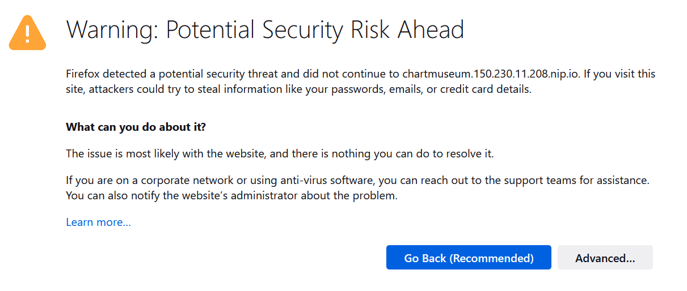

# Deploy a private helm repository with ChartMuseum and Let's Encrypt


## Enable TLS

Now, that we know our ChartMuseum requires at least an authentication, we also want to encrypt the traffic by adding TLS. We will use Let's Encrypt and cert-manager to automate the management and issuance of TLS certificates.

### Install cert-manager

We'll first install cert-manager:

1. Deploy the cert-manager CRDs:

```
kubectl apply -f https://github.com/cert-manager/cert-manager/releases/download/v1.9.1/cert-manager.crds.yaml
```

2. Add the helm repo:

```
helm repo add jetstack https://charts.jetstack.io
```

3. Install cert-manager

```
helm install cert-manager --namespace cert-manager --version v1.9.1 jetstack/cert-manager --create-namespace
```

4. Verify the installation. All pods should be running.

```
kubectl get pods --namespace cert-manager
```

5. Test webhook works by creating a file ```test-resources.yaml```:

```yaml
apiVersion: v1
kind: Namespace
metadata:
  name: cert-manager-test
---
apiVersion: cert-manager.io/v1
kind: Issuer
metadata:
  name: test-selfsigned
  namespace: cert-manager-test
spec:
  selfSigned: {}
---
apiVersion: cert-manager.io/v1
kind: Certificate
metadata:
  name: selfsigned-cert
  namespace: cert-manager-test
spec:
  dnsNames:
    - example.com
  secretName: selfsigned-cert-tls
  issuerRef:
    name: test-selfsigned
----
```

6. Create the test resources:

```
kubectl apply -f test-resources.yaml
```

8. Check the status of the newly created certificate. You may need to wait a few seconds before cert-manager processes the certificate request.

```
kubectl describe certificate -n cert-manager-test
```

9. You should be able to see:

```yaml
...
Spec:
  Dns Names:
    example.com
  Issuer Ref:
    Name:       test-selfsigned
  Secret Name:  selfsigned-cert-tls
Status:
  Conditions:
    Last Transition Time:  2022-07-28T07:11:25Z
    Message:               Certificate is up to date and has not expired
    Observed Generation:   1
    Reason:                Ready
    Status:                True
    Type:                  Ready
  Not After:               2022-10-26T07:11:25Z
  Not Before:              2022-07-28T07:11:25Z
  Renewal Time:            2022-09-26T07:11:25Z
  Revision:                1
Events:
  Type    Reason     Age   From                                       Message
  ----    ------     ----  ----                                       -------
  Normal  Issuing    14s   cert-manager-certificates-trigger          Issuing certificate as Secret does not exist
  Normal  Generated  13s   cert-manager-certificates-key-manager      Stored new private key in temporary Secret resource "selfsigned-cert-khkrk"
  Normal  Requested  13s   cert-manager-certificates-request-manager  Created new CertificateRequest resource "selfsigned-cert-6zz7r"
  Normal  Issuing    13s   cert-manager-certificates-issuing          The certificate has been successfully issued
```

10. Clean up the test resources:

```
kubectl delete -f test-resources.yaml
```

### Configure Let's Encrypt Issuers

For reference, you can follow the [quick-start guide](https://cert-manager.io/docs/tutorials/acme/nginx-ingress/#step-7---deploy-a-tls-ingress-resource) for using cert-manager with Nginx Ingress.

1. Create a staging issuer manifest by creating a ```staging-issuer.yaml```:

```yaml
apiVersion: cert-manager.io/v1
kind: Issuer
metadata:
    name: le-staging
    namespace: chartmuseum
spec:
  acme:
    # The ACME server URL
    server: https://acme-staging-v02.api.letsencrypt.org/directory
    # Email address used for ACME registration
    email: user@example.com
    # Name of a secret used to store the ACME account private key
    privateKeySecretRef:
        name: le-staging
    # Enable the HTTP-01 challenge provider
    solvers:
    - http01:
        ingress:
            class: nginx
```

2. Replace the email address above with yours.

3. Create the staging issuer:

```
kubectl create -f staging-issuer.yaml
```

4. Repeat steps 1-2 but create a ```production-issuer.yaml```. Remember to change the email address as well:

```yaml
apiVersion: cert-manager.io/v1
kind: Issuer
metadata:
    name: le-prod
    namespace: chartmuseum
spec:
  acme:
    # The ACME server URL
    server: https://acme-v02.api.letsencrypt.org/directory
    # Email address used for ACME registration
    email: user@example.com
    # Name of a secret used to store the ACME account private key
    privateKeySecretRef:
        name: le-prod
    # Enable the HTTP-01 challenge provider
    solvers:
    - http01:
        ingress:
            class: nginx
```

5. Create the production issuer:

```
kubectl create -f production-issuer.yaml
```

6. Check the staging issuer status:

```
kubectl describe issuer le-staging
```

7. Check the production issuer status:

```
kubectl describe issuer le-prod
```

8. In both cases you should see something like the following:

```
  Conditions:
    Last Transition Time:  2022-07-27T16:27:11Z
    Message:               The ACME account was registered with the ACME server
    Observed Generation:   1
    Reason:                ACMEAccountRegistered
    Status:                True
    Type:                  Ready
Events:                    <none>
```

### Enable TLS on ChartMuseum

Now that our certificate issuers are working, we can enable TLS on ChartMuseum. 

1. Edit the chartmuseum.yaml file and edit the ingress annotations to add the following:

```
  annotations:
    kubernetes.io/ingress.class: nginx
    kubernetes.io/tls-acme: "true"
    cert-manager.io/issuer: "le-staging"
    cert-manager.io/acme-challenge-type: http01
```

2. Under Ingress hosts rules, add the following:

```
  hosts:
    - name: chartmuseum.<LOAD-BALANCER-IP>.nip.io
      path: /           
      tls: true      
      tlsSecret: cm-tls
```

3. Use helm to update your ChartMuseum to enable TLS:

```
helm upgrade chartmuseum chartmuseum/chartmuseum -f chartmuseum.yaml
```

4. cert-manager will read the annotations and create a certificate:

```
kubectl get certificate
```

5. Describe the certificate to see if it's been created successfully:

```
kubectl describe certificate cm-tls
```

6. You should see something like the following:

```
Events:
  Type    Reason     Age    From                                       Message
  ----    ------     ----   ----                                       -------
  Normal  Issuing    2m43s  cert-manager-certificates-trigger          Issuing certificate as Secret does not exist
  Normal  Generated  2m43s  cert-manager-certificates-key-manager      Stored new private key in temporary Secret resource "cm-tls-d8b96"
  Normal  Requested  2m43s  cert-manager-certificates-request-manager  Created new CertificateRequest resource "cm-tls-glmf4"
  Normal  Issuing    114s   cert-manager-certificates-issuing          The certificate has been successfully issued
```

7. Access ChartMuseum now and you should see a warning:

8. Ignore the warning, click on 'Advanced' and 'Accept the Risk and Continue' to access it. Notice that now you are using https to access ChartMuseum.



### Upgrade ChartMuseum with Let's Encrypt to use production APIs

The last section of this lab involves changing from Let's Encrypt staging API to its production API.

1. Edit the chartmuseum.yaml and change to the following:

```
    cert-manager.k8s.io/issuer: "le-prod"
```

2. Update your ChartMuseum again using helm:

```
helm upgrade --name chartmuseum chartmuseum/chartmuseum -f chartmuseum.yaml
```

3. Delete the certificate:

```
kubectl -n chartmuseum delete secret cm-tls
```

4. Watch the certificate being recreated:

```
kubectl describe certificate cm-tls
```

5. You should be able to see something like the following:

```
 Normal  Generated  27m                cert-manager-certificates-key-manager      Stored new private key in temporary Secret resource "cm-tls-d8b96"
  Normal  Requested  27m                cert-manager-certificates-request-manager  Created new CertificateRequest resource "cm-tls-glmf4"
  Normal  Requested  60s                cert-manager-certificates-request-manager  Created new CertificateRequest resource "cm-tls-dxgwj"
  Normal  Issuing    60s                cert-manager-certificates-trigger          Issuing certificate as Secret was previously issued by Issuer.cert-manager.io/le-staging
  Normal  Reused     60s                cert-manager-certificates-key-manager      Reusing private key stored in existing Secret resource "cm-tls"
  Normal  Issuing    13s (x2 over 27m)  cert-manager-certificates-trigger          Issuing certificate as Secret does not exist
  Normal  Generated  13s                cert-manager-certificates-key-manager      Stored new private key in temporary Secret resource "cm-tls-npvbz"
  Normal  Requested  13s                cert-manager-certificates-request-manager  Created new CertificateRequest resource "cm-tls-zh5mz"
  Normal  Issuing    10s (x3 over 26m)  cert-manager-certificates-issuing          The certificate has been successfully issued
```

6. Remove the exception you previously added in your browser.
  - In Firefox, open Settings and search for Certificates.
  - Click on 'View Certificates'
  - Click on the 'Servers' tab and locate chartmuseum
  - Select and delete it.
  - In Chrome

7. Access the ChartMuseum again at https://chartmuseum.LOAD-BALANCER-IP.nip.io. This time, you should be able to access it without any security warning.

8. You can now use ChartMuseum to securely store and manage your helm charts privately.

## Resetting your tenancy

Should you wish (or need) to do so this module shows you how to use a script to remove the resources you created in this lab.


## At the end of the tutorial

We hope you enjoyed doing the labs, and that they will be useful to you. 

When you finish the modules in this lab, the take the time for a cup of tea (or other beverage of your choice). While you're having that well earned break we recommend that you visit the [Oracle live labs site](https://apexapps.oracle.com/pls/apex/dbpm/r/livelabs/home) for a wide range of other labs on a variety of subjects.

## Acknowledgements

* **Author** - Ali Mukadam, Cloud Native Solutions Architect, OCI Strategic Engagements Team, Developer Lighthouse program
* **Last Updated By** - Tim Graves, August 2022

