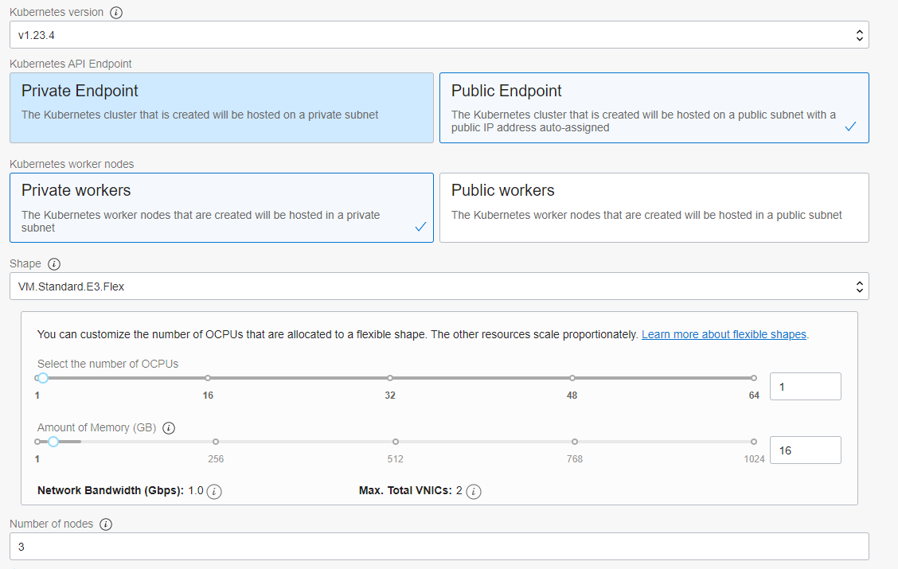
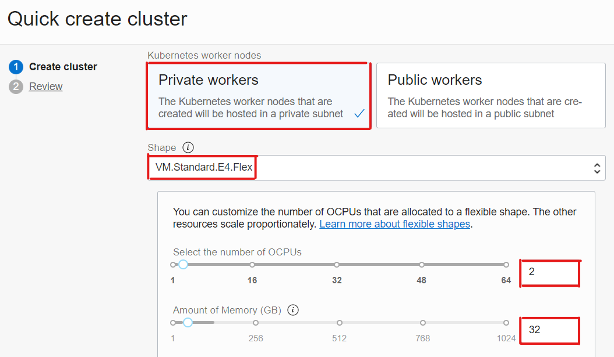
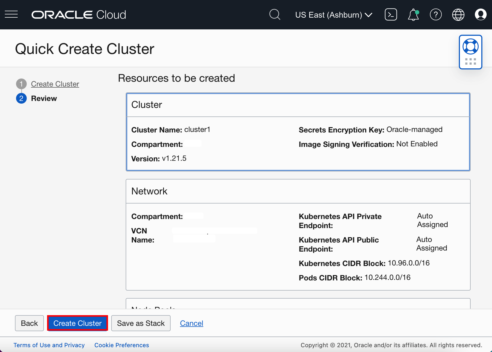
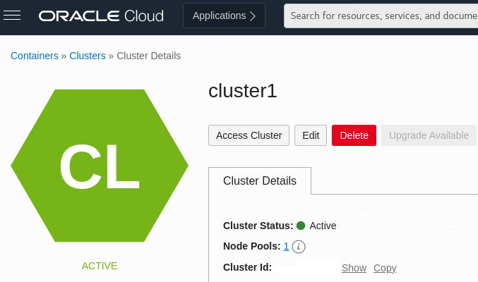

# Alternative Task 1 - Create an OKE cluster manually

<!-- 1. Deploy OKE version 1.21.5 using [terraform-oci-oke](https://github.com/oracle-terraform-modules/terraform-oci-oke) -->
<!-- - You can track the remaining work for K8s 1.22 support in kubeflow/kubeflow#6353 https://github.com/kubeflow/kubeflow/issues/6353 -->
<!-- Create OKE version using Public endpoint -->

## Create OKE cluster manually

<!-- 

<b>Create an OKE cluster manually</b>

 -->

1. In the Console, open the navigation menu and click **Developer Services**. Under **Containers & Artifacts**, click **Kubernetes Clusters (OKE)**.

    

2. On the Cluster List dialog, select the Compartment where you are allowed to create a cluster and then click **Create Cluster**.

    > You must select a compartment that allows you to create a cluster and a repository inside the Oracle Container Registry.

    

3. On the Create Cluster dialog, click **Quick Create** and click **Launch Workflow**.

    

    *Quick Create* will automatically create a new cluster with the default settings, along with new network resources for the new cluster.

4. Specify the following configuration details on the Cluster Creation dialog (pay attention to the value you place in the **Shape** field):

    * **Name**: The name of the cluster. Accept the default value.
    * **Compartment**: The name of the compartment. Accept the default value.
    * **Kubernetes Version**: The version of Kubernetes. Select the **v1.23.4** version.
    * **Kubernetes API Endpoint**: Determines if the cluster master nodes are going to be routable or not. Select the **Public Endpoint** value.
    * **Kubernetes Worker Nodes**: Determines if the cluster worker nodes are going to be routable or not. Accept the default value **Private Workers**.
    * **Shape**: The shape to use for each node in the node pool. The shape determines the number of CPUs and the amount of memory allocated to each node. The list shows only those shapes available in your tenancy that are supported by OKE.  
        Select **VM.Standard.E4.Flex**. You need to select *2* as the number of *OCPUs* and *32* as the *Amount of Memory(GB)*.
    * **Number of nodes**: The number of worker nodes to create. Accept the default value **3**.
 
    > **Caution**: *VM.Standard.E4.Flex is the recommended because Kubeflow has many components. The default VM.Standard2.1 can be enough for testing purposes but the installation takes much longer.*

  
  <!--  -->

1. Click **Next** to review the details you entered for the new cluster.

2. On the Review page, click **Create Cluster** to create the new network resources and the new cluster.

    <!--  -->

    > You see the network resources being created for you. Wait until the request to create the node pool is initiated and then click **Close**.

    

    > The new cluster is shown on the Cluster Details page. When the master nodes are created, the new cluster gains a status of *Active* (it takes about 7 minutes).

    

    

    Now your OKE cluter is ready you can move to Kubeflow installation.
