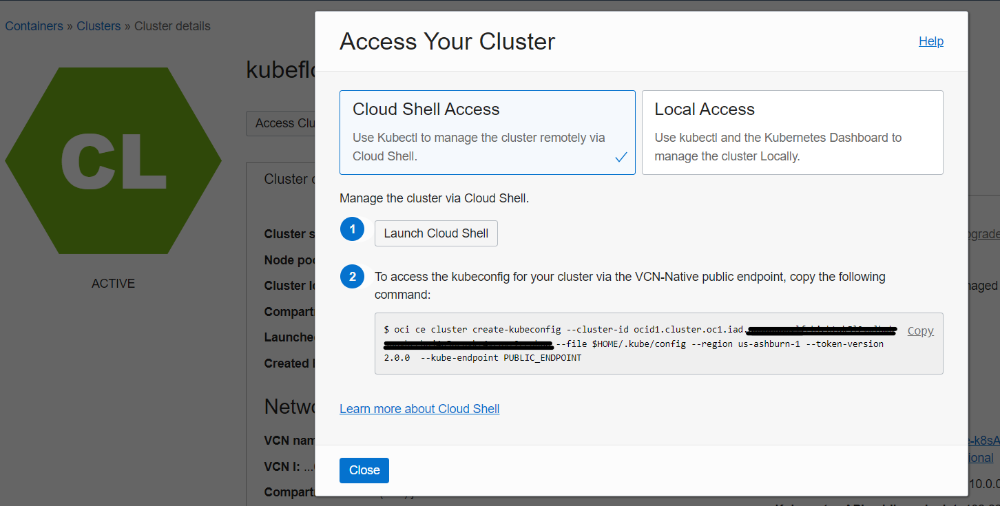
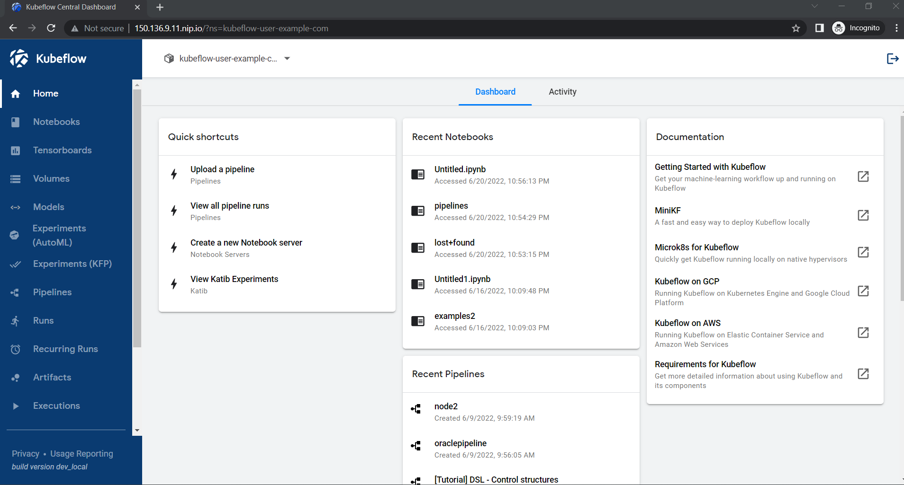

# Setup Kubeflow

## Prerequisites

The following tools are required:
- oci-cli,
- kubectl,
- git are integrated

In this labs we will use OCI Cloud Shell console integrating all these tools.

### Warning

- **Kubeflow 1.6.0 is not compatible with version Kubernetes 1.21 and backwards.**
- Kustomize (version 3.2.0) ([download link](https://github.com/kubernetes-sigs/kustomize/releases/tag/v3.2.0))
    - Kubeflow 1.6.0 is not compatible with the latest versions of Kustomize.

## Preparation steps

1. Install Kustomize in Cloud Shell

    - Open the OCI Cloud Shell

    - Make sure you are in the top level directory

            cd $HOME

    - Download Kustomize version 3.2.0 and install into your OCI Cloud Shell environment.

            curl -L -o kustomize https://github.com/kubernetes-sigs/kustomize/releases/download/v3.2.0/kustomize_3.2.0_linux_amd64
            chmod +x ./kustomize

2. Clone the Kubeflow repository version 1.6.0 into your OCI Cloud Shell environment

        git clone -b v1.6-branch https://github.com/kubeflow/manifests.git kubeflow_1.6
        cd kubeflow_1.6

3. Change the default password

    By default email user@example.com and password is 12341234

    Generate a password and edit Dex config-map.yaml

        PASSWD=$(cat /dev/urandom | tr -dc 'a-zA-Z0-9' | fold -w 16 | head -n 1)
        KF_PASSWD=$(htpasswd -nbBC 12 USER $PASSWORD| sed -r 's/^.{5}//')
        sed -i.orig "s|hash:.*|hash: $KF_PASSWD|" common/dex/base/config-map.yaml
        echo "Random password is: $PASSWD"

    Make sure you are in the kubeflow manifests folder.

## Install Kubeflow

1. Access your cluster

  Click Access Cluster on your cluster detail page.
  Accept the default **Cloud Shell Access** and click **Copy** copy the `oci ce cluster create-kubeconfig ...` command and paste it into the Cloud Shell and run the command.
  > If you installed your cluter using the single-script the access is already set.

  

  Verify that the `kubectl` is working by using the `get node` command. <br>
  You may need to run this command several times until you see the output similar to the following.

  ```bash
    $ kubectl get node
    NAME          STATUS   ROLES   AGE   VERSION
    10.0.10.176   Ready    node    19m   v1.23.4
    10.0.10.203   Ready    node    19m   v1.23.4
    10.0.10.48    Ready    node    19m   v1.23.4
  ```

  > If you see the node's information, then the configuration was successful.

2. Install Kubeflow with a single command

        cd $HOME/kubeflow_1.6 
        while ! $HOME/kustomize build example | kubectl apply -f -; do echo "Retrying to apply resources"; sleep 10; done

> Installation takes about 10 to 15 min.

To check that all Kubeflow-related Pods are ready, use the following commands:

  ```bash
kubectl get pods -n cert-manager
kubectl get pods -n istio-system
kubectl get pods -n auth
kubectl get pods -n knative-eventing
kubectl get pods -n knative-serving
kubectl get pods -n kubeflow
kubectl get pods -n kubeflow-user-example-com
 ```

>It takes about 15 min to have all the containers running.

## Access Kubeflow

1. Expose Kubeflow to Internet

Change istio-ingressgateway to LoadBalancer

```
cat <<EOF | tee $HOME/kubeflow_1.6/patchservice_lb.yaml
  spec:
    type: LoadBalancer
  metadata:
    annotations:
      oci.oraclecloud.com/load-balancer-type: "lb"
      service.beta.kubernetes.io/oci-load-balancer-shape: "flexible"
      service.beta.kubernetes.io/oci-load-balancer-shape-flex-min: "10"
      service.beta.kubernetes.io/oci-load-balancer-shape-flex-max: "100"
EOF
```
    kubectl patch svc istio-ingressgateway -n istio-system -p "$(cat $HOME/kubeflow_1.6/patchservice_lb.yaml)"

1. Enable HTTPS

   1. Generate SSL certificate

  we suggest using https://smallstep.com/

  Make sure you are in the top level directory

        cd $HOME          
        mkdir keys;cd keys
        wget -O step.tar.gz https://dl.step.sm/gh-release/cli/docs-ca-install/v0.20.0/step_linux_0.20.0_amd64.tar.gz
        tar -xf step.tar.gz
        cp step_0.20.0/bin/step .

  Generate root certificate

        cd $HOME/keys
        $HOME/keys/step certificate create root.cluster.local root.crt root.key --profile root-ca --no-password --insecure --kty=RSA

  Get Ingress IP to generate certificate
  
        External_IP=$(kubectl get svc istio-ingressgateway -n istio-system -o=jsonpath="{.status.loadBalancer.ingress[0].ip}")

        cd $HOME/keys
        $HOME/keys/step certificate create $External_IP.nip.io tls-$External_IP.crt tls-$External_IP.key --profile leaf  --not-after 8760h --no-password --insecure --kty=RSA --ca $HOME/keys/root.crt --ca-key $HOME/keys/root.key

  2. Create Kubernetes Secret TLS Certificate

        cd $HOME/keys
        kubectl create secret tls kubeflow-tls-cert --key=tls-$External_IP.key --cert=tls-$External_IP.crt -n istio-system    

  3. Update Kubeflow API Gateway

  Create API Gateway

        cat <<EOF | tee $HOME/kubeflow_1.6/sslenableingress.yaml
        apiVersion: v1
        items:
        - apiVersion: networking.istio.io/v1beta1
          kind: Gateway
          metadata:
            annotations:
            name: kubeflow-gateway
            namespace: kubeflow
          spec:
            selector:
              istio: ingressgateway
            servers:
            - hosts:
              - "*"
              port:
                name: https
                number: 443
                protocol: HTTPS
              tls:
                mode: SIMPLE
                credentialName: kubeflow-tls-cert
            - hosts:
              - "*"
              port:
                name: http
                number: 80
                protocol: HTTP
              tls:
                httpsRedirect: true
        kind: List
        metadata:
          resourceVersion: ""
          selfLink: ""
        EOF

        kubectl apply -f $HOME/kubeflow_1.6/sslenableingress.yaml
        kubectl get gateway -n kubeflow

Congratulations you installed Kubelow !!!

Access $External_IP.nip.io

<!-- > Make sure Security List or NSG give access from outside LB TCP/80 and TCP/443 -->


