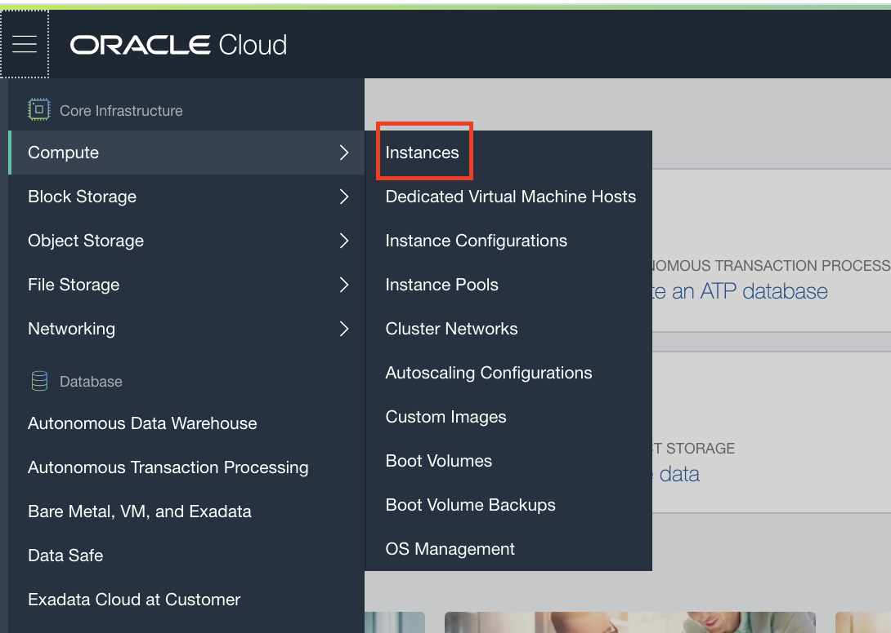

# Creating the Client VM in the OCI tenancy

Only follow the instruction in this module if you have are in an instructor led lab and the instructor has provided you with details of a pre-prepared tenancy to use.

This page will guide you on how to set up a Compute instance on the Oracle Cloud, running a Linux desktop.  You will be using a *Custom Image* that was prepared by your instructor, which contains all the client-side components you need for running this lab, such as Eclipse and a variety of command-line tools.

---

**ATTENTION !!!** 

Your instructor will inform you if the VM's have already been created for you or not.  

- In case you need create the VM yourself, follow all instructions below.
- If the VMs has already been created by your instructor, **Scroll down** to section **Installing a VNC Viewer** and continue from that section.

---

### Self-Registration on the Cloud

- Use the **Self-registration** URL provided by your instructor to obtain an account on the Oracle Cloud tenancy we will be using for this lab.
  - You will be asked to provide a username, password and email.  Your instructor will detail the rules that apply for these elements.

- Log into the **Cloud Console** using the URL provided, and using the username and password you just created.

### Creating the Compute instance

- Use the "Hamburger" menu (top left, three bars)
  - Navigate to the **Core infrastructure** section
  - Select **Compute**, then **Instances**

- Select the correct **Compartment** for this lab
  - On the left side, under **List Scope**,  use the Compartment dropdown chose `CDTOKE` as the compartment.  You might have to click the small **+** button of the root compartment to see the list of compartments.

You will now see the list of instances already running in this compartment.

- Click the **Create Instance** button to start the creation of a new instance.

This will open the **Create Compute Instance** wizard.  Fill in the following elements:

- Enter a meaningfull **name** for your instance: `helidonlabVm-yourInitials`, using your initials to distinguish from other participants.
- Click the **Change Image Source** button.
- In the popup click the `Change Compartment link

- Click the selector to get a dropdown, chose `Admin` from the list

 

  - In the resulting page click the **Custom Images** tab
  - Select the image called H-K8S-Lab-A-Helidon-\<YYYY-MM-DD\> where the YYYY-MM-DD is a date
    - If there is more than one image starting H-K8S-Lab-A-Helidon chose the one with the most recent date. 
    - DO NOT chose any image containing the word Export.
  - Click the **Select Image** button to return to the initial screen.
- Use the **default values** provided for following elements: 
  - **Availability domain** (AD1), **Instance type** (Virtual Machine) and **Instance shape** (VM.Standard.2.1)
  

- Make sure the *Virtual Cloud Network Compartment* is set to **CTDOKE**.
- In the **Virtual cloud Network** dropdown,  select the **CTDVMVCN** network.
- Make sure the *Subnet Compartment* is set to **CTDOKE**. 
- Leave all the other settings in the section as they are in the boot volume section
  - Check the **Assign a public IP address** option is selected
- Scroll down to the **Add SSH Key** section
  - In a separate window, download the public key file provided by your instructor onto your laptop. 
  - Use the **Choose File** button to select the downloaded public key file.

You have finished the wizard!

- Click the **Create** button on the bottom of the wizard to initiate the creation.

Once the create button has been clicked you will see the Vm details page.  Initially the state will be provisioning but after a few minutes it will switch to **Running**, and you will see that a **public IP address** has been assigned.  Make a note of that IP address.

- Give the VM a few minutes to start up it's internal services.

### Installing a VNC viewer

- For **macOS** we recommend realVNC which can be obtained from 

  - https://www.realvnc.com/en/connect/download/viewer/macos/

- For **Windows**, suggested packages are TigerVNC viewer or TightVNC Viewer but if you already have a preferred VNC viewer you can use this. TigerVNC viewer has a simpler install process, as it is a standalone executable, but has fewer features.

  - TigerVNC: Download ‘vncviewer64-1.9.0.exe’ from

    - https://bintray.com/tigervnc/stable/tigervnc/1.9.0#files and save it to your desktop. It is a self-contained executable file, which requires no further installation.

  - TightVNC Viewer: Select the 'Installer for Windows (64-bit)' from

    - https://www.tightvnc.com/download.php

      When prompted, select to save the file.  Next, run the executable to install the program. This requires you have the privileges to install software on your machine

### Connecting to the VM

Use your VNC client to connect to the VM desktop on display 1. The precise format of the VNC connect string will vary depending on your VNC client, but it will be something like:

- ​	`<Your VM Public IP address>:1`
  - Example : `123.23.43.2:1`
    - Note the :1 at the end! 

When you connect you will get warnings about an insecure connection, as this lab does not process any confidential data and is only running for a short time that's OK

You will need to enter a password for the VNC session. The instructor will provide you with this.

### Configuring the database credentials in the VM
If you have not setup the database configuration in the VM yourself as part of the tenancy setup then you will need to configure the database credentials. (In some instructor led labs this may been done for you, in those situations your instructor will advise you)

Please follow the instructions to [get and install the ATP database wallet](../UsingYourOwnTenancy/GetYourATPDatabaseWalletFile.md)