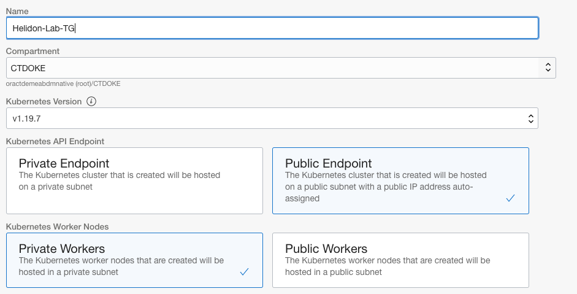
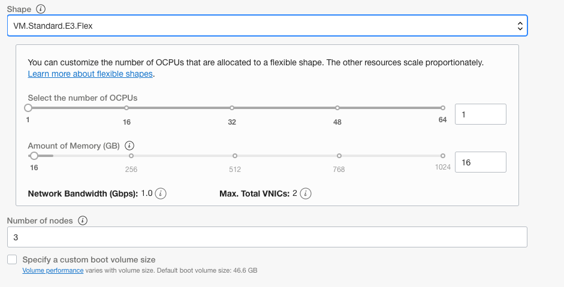

# Creating your own Kubernetes cluster

**ATTENTION !!!** 

If you are doing the lab self guided, or the instructor does not tell you they have created a cluster for you then you need to complete this section.

If you are in an instructor led lab they **may** have already created Kubernetes clusters for you, **only** in the situation where you have been given a kubeconfig file and you do not need to continue with this section.

## Introduction

**Estimated module duration** 5 mins.

### Objectives

Creating a Managed Kubernetes cluster on the Oracle Cloud.  

### Prerequisites

If you are doing the full labs (these include modules on Helidon and Docker) you need to have completed the steps in the **Helidon** modules (including the setup)

If you are only doing the Kubernetes based labs you need to have completed the steps in the **Tenancy Setup for the Kubernetes Labs** module.

## Step 1: Creating your Kubernetes cluster

### Step 1a: Navigate to the Managed Kubernetes dashboard

  A. Log into the **OCI Console** 

  B. Once on the **OCI infrastructure** page, click on the "Hamburger" menu  
  
  C. Scroll down to **Solutions and Platform** section, Click **Developer services**, then **Container Clusters (OKE)**

  D. In the **List Scope** section, use the dropdown to select the `CTDOKE` compartment
  
  - You may have to expand the tree nodes to locate this compartment

  E. Click the **Create Cluster** button at the top of the clusters list

  F. Choose the option for the **Quick Create**, then click the **Launch workflow** button

### Step 1b: Creating the cluster

Fill in the form with following parameters:

  A. Set the cluster **Name** to be something like `Helidon-Lab-YOUR-INITIALS`
  
  B.  Make sure the **Compartment** is `CTDOKE`
  
  C.  Make sure the **Kubernetes version** is the highest on the list (at the time of the last update of this document in August 2021 that was 1.20.8 , but it may have been updated since then)
  
  D. Make sure that the **Kubernetes API Endpoint** is set to **Public Endpoint**

  E. Check the **Kubernetes Worker Node Subnet** is set to **Private Workers**

These images are for creating a 1.19.7 cluster, they may be slightly different for later versions.

  
  
  F. Set the **Shape** dropdown to VM.Standard.E3.Flex and the number of OCPU's to 1 (this should set the memory to 16GB automatically)
  
  G. Set the **Number of nodes** to be 3

There is no need to do anything in the Advanced Options section.

These images are for creating a 1.19.7 cluster, they may be slightly different for later versions.
 
  

  H. Click the **Next** button to go to the review page.

  I. On the review page check the details you have provided are correct

  J. Click the **Create Cluster** button.

You'll be presented with a progress option, if you want read what's happening

  K. Scroll to the bottom and click the **Close** button

The state will be "Creating" for a short while (usually 3-4 mins)

## End of the cluster setup, What's next ?

You can move on to the **Cloud Shell Setup for the Kubernetes Labs** module while the cluster continues to be provisioned.

## Acknowledgements

* **Author** - Jan Leemans, Director Business Development, EMEA Divisional Technology
* **Contributor** - Tim Graves, Cloud Native Solutions Architect, EMEA OCI Centre of Excellence
* **Last Updated By** - Tim Graves, November 2020
