# Setting up your Cloud Tenancy 

## Introduction

**Estimated module duration** 30 mins.

### Objectives

This module takes you through the process of setting up your tenancy to fit the lab instructions, creating a database and a development virtual machine to use in the coding parts of this lab. You only need to do this setup once in your tenancy.

### Prerequisites

You need to an Oracle Cloud tenancy, with either full admin rights (For example a trial tenancy) **OR** if you have a tenancy but not full admin rights you need a existing compartment (ideally called `CTDOKE` to match the instructions) with full admin rights in that compartment.


## Setup needed

This page explains all the steps to set up your **Oracle Cloud Tenancy** so you are ready to run the labs.  Because participants can use different types of tenancies, not all steps need to be executed by everybody.  In the situation that you are using a new **Oracle Free Tier** or **Trial tenancy** environment, you are probably starting from an "empty page" and will most likely have to execute all the steps below. If you are using an existing **paid tenancy** then you may need to get the tenancy administrator to create a compartment, create security roles with the appropriate policies and to assign your user to that role.

**If you are attending an instructor-led lab**, your instructor may have been able to arrange to have some steps complete to speed the lab up, if so they will detail steps you need to execute and which ones you can skip.

While we strongly recommend running the lab in the virtual machine we have built, running on the Oracle Cloud Infrastructure, if you do not want to use this VM and are willing and able to re-create the configuration of the virtual machine on your own computer (and adjust the labs content to reflect your differing environment as you go through it) there are some guidelines [here](https://github.com/oracle/cloudtestdrive/blob/master/AppDev/cloud-native/manual-setup/using-your-own-computer.md)

<details><summary><b>Self guided student - section video introduction</b></summary>

This video is an introduction to this section of the lab. Once you've watched it please press the "Back" button on your browser to return to the labs.

[](https://youtu.be/fxrOnJjCLBc "Lab preparation introduction video")

---

</details>

## Step 1: Create the CTDOKE compartment

If you are in an **instructor led lab** the instructor may have already done this step for you, if so they will tell you.

  1. Click the `hamburger` menu (three bars on the upper left)

  2. Scroll down the list to the `Identity & Security` section

  3. Chose `Compartments`
  
  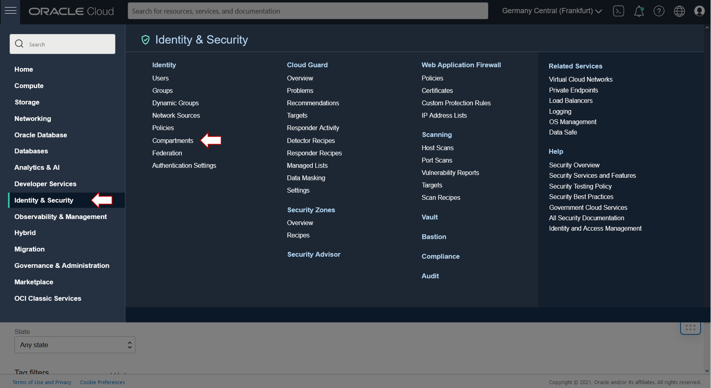

  4. You should see a screen that looks similar to this : 

  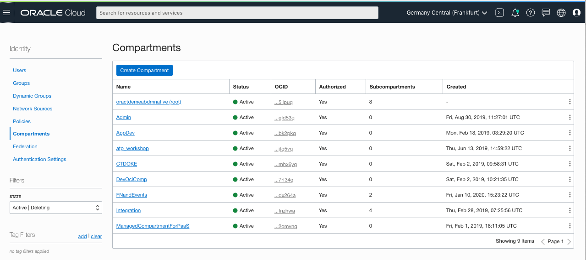

  

**ATTENTION** : if the compartment **CTDOKE** already exists, please move to the next step on this page, Importing the image for the development vm

  5. If the **CTDOKE** compartment is not yet there, **create it** : 
  
  5a. Click the `Create Compartment` button
  
  5b. Provide a name, description
  
  5c. Chose **root** as the parent compartment
  
  5d. Click the `Create Compartment` button.


## Step 2: Import the image for the Development VM

If you are in an **instructor led lab** the instructor may have already done this step for you, if so they will tell you.

  1. Download the image location file [from here](https://objectstorage.eu-frankfurt-1.oraclecloud.com/n/oractdemeabdmnative/b/MonolithToCloudNative/o/MonolithToCloudNativeVMDetails.txt)

  2. Open this file. You will see the pre-authenticated URL to the VM image and also the default VNC password set for this image

  3. Navigate to the **Compute** and **Custom Image** screen

  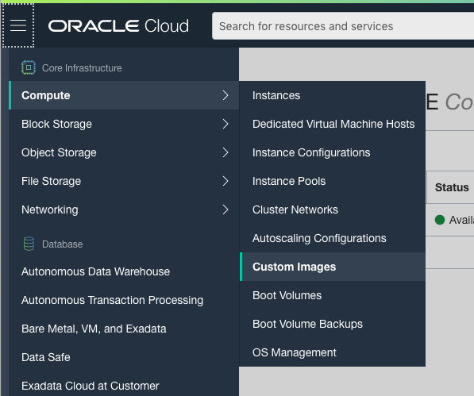

  4. On the right, make sure the **CTDOKE** compartment is selected

  

**ATTENTION** : if an image with a name composed like **H-K8S-Lab-A-Helidon-2020-10-29** already exists and the date at the end (it's in the form year-month-day) is the same as **or later**  than the date above in the import URL your instructor has given you then **you are OK for this step**, please move to the next step on this page creating a virtual cloud network.

  5. If you do not have this image available, import it with following steps:
  
  5a. Click the `Import Image` button
  
  5b. Make sure the **CTDOKE** compartment is selected
  
  5c. Name the image, probably best to have it match the name in the storage URL which will be something like H-K8S-Lab-A-Helidon-2020-10-29 as that way you will know what version of the lab you are using.
  
  5d. Make sure the Operating System is set to **Linux**
  
  5e. Select the option `IMPORT FROM AN OBJECT STORAGE URL` 
  
  5f. Enter the **VM image URL** from the image location file you just downloaded.
  
  5g. Set the image type to **OCI**
  
  5h. Click the `Import image` option - it can take 10 to 15 minutes to finish, you can continue with the next setup actions and check it's completed before you create an instance using the image.

  

## Step 3: Creating a Virtual Cloud Network (VCN)

If you are in an **instructor led lab** the instructor may have already done this step for you, if so they will tell you.

You need to set up a Virtual Cloud Network to run the instances of this lab on.

  1. Click the `hamburger` menu
  
  2. In the `Core Infrastructure` section chose `Networking` and then `Virtual Cloud Networks`
  
  3. Make sure you are using the =`CTDOKE` compartment you created
  
  4. Click the `Start VCN Wizzard`` button
  
  5. Chose the `VCN with Internet Connectivity` option
  
  6. Click the `Start VCN Wizzard` button
  
  7. Enter a name for the VCN : **CTDVMVCN**
  
  8. Make sure that the compartment matches the compartment **CTDOKE** you just chose / created
  
  9. Leave the fields in the Configure VCN and Subnets with their default values.
  
  10. If you are using a non trial tenancy and your organization requires it add the appropriate tags (click the `Show Tagging Options` to see these)
  
  11. Click the `Next` button
  
  12. Double check the information you've provided
  
  13. Click the `Create` button
  
  14. Once the VCN has been created click the `View Virtual Cloud Network` button


## Step 4: Adding an OCI ingress rule for VNC

If you are in an **instructor led lab** the instructor may have already done this step for you, if so they will tell you.

You need to be sure that the Virtual Cloud Network supports remote access using VNC.

  1. Go to the VCN you created earlier:  **CTDVMVCN**

  2. On the VNC page on the left hand side click the `Security Lists` option

  3. Click on the security list in the list, Chose the one with a name something like `Default Security List for CTDVMVCN` (don't select the private subnet one)

  4. In the list click the `Add Ingress Rules` button

  5. Leave the `Stateless` option unchecked (This will provide for the returning traffic)

  6. Leave the `SOURCE TYPE` as CIDR

  7. In the `SOURCE CIDR` enter `0.0.0.0/0` (basically the entire internet, in a production you might limit to your organizations address range)

  8. Leave the `protocol` as `TCP`

  9. Leave the `SOURCE PORT RANGE` blank

  10. Set the `DESTINATION PORT RANGE` as `5800-5910`

  11. Set the `DESCRIPTION` to be VNC

  12. Click the `Add Ingress Rules` button


## Step 5: Setup the database.

If you are in an **instructor led lab** the instructor may have already done this step for you, if so they will tell you.

### 5a. Create a database

  1. Use the Hamburger menu, and select the **Oracle Database** section, then chose  **Autonomous Transaction Processing**
  
  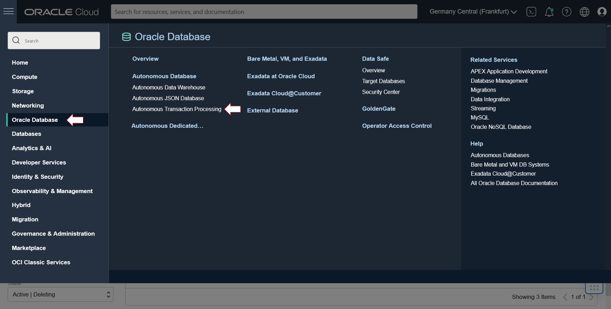

  2. Click **Create DB**

  3. Make sure the **CTDOKE** compartment is selected

  4. Fill in the form, and make sure to give the DB a unique name for you in case multiple users are running the lab on this tenancy.

  5. Make the workload type `Transaction Processing` 

  6. Set the deployment type `Shared Infrastructure` 

  7. Chose the most recent option for the database version, allocate 1 OCPU and 1 GB of storage (this lab only requires a very small database)

  8. Turn off auto scaling
  
  9. Enter the admin password, there are rules for what this shoudl look like, they will appear under the password field.
  
  10. Confirm the admin password

  11. Make sure that the `Allow secure access from everywhere` is enabled.

  12. For a trial tenancy chose the `BYOL License` option, for a paid tenancy chose the `License included` option (Unless your organization already has enough available suitable licenses)

Be sure to remember the **admin password**, save it in a notes document for later reference.

  13. Click the `Create Autonomous Database` button

  14. Once the instance is running go to the database details page, on the center left of the general information column there will be the label OCID and the start of the OCID itself. Click the **Copy** just to the left and then save the ODIC together with the password.


### 5b. Setup your database user

  1. On the details page for the database, click the **Tools** tab 
  
  

  2. On the left side click the **Open Database Actions** button
  
  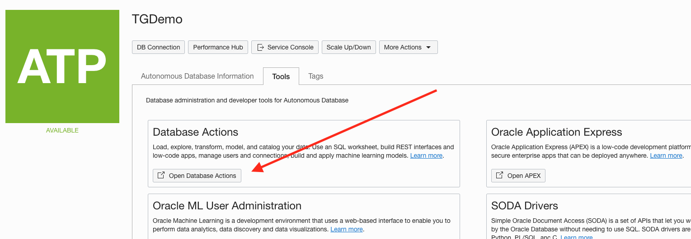

This will open a login form in a new window

  3. Login as ADMIN, using the password you just chose
  
  4. Click the **SQL** button to open the web based SQL developer tool

  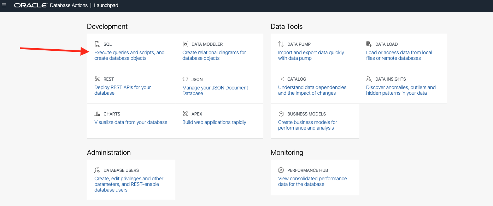

  5. Copy and paste the below SQL instructions into the top section of the page:

  ```
CREATE USER HelidonLabs IDENTIFIED BY H3lid0n_Labs;
GRANT CONNECT TO HelidonLabs;
GRANT CREATE SESSION TO HelidonLabs;
GRANT DWROLE TO HelidonLabs ;
GRANT UNLIMITED TABLESPACE TO HelidonLabs;
```

  6. Run the script (The Page of paper with the green "run" button, identified in the image below.) if it works OK you will see a set of messages in the Script Output window saying the User has been created and grants made.

  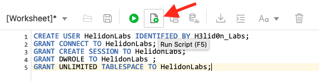


## Step 6: Create a Development VM using the image you imported

If you are running in your tenancy

  1. Return to the Custom Compute Images menu (Hamburger menu -> Core Infrastructure section -> Compute -> Custom Images) 

If you are in an **instructor led** lab, you instructor may provide you with details to locate the Developer VM image to use

  2. Locate image to use which your instructor has provided or you have just imported : If you are in a shared environment and there is more than one image starting H-K8S-Lab-A-Helidon chose the one with the most recent date. (As we recommend naming the images using the date this will be the last part of the image name in the format `yyyy-mm-dd`and if you had to run the import

  3. Check that the image has finished importing and the state is **Available** :

Note sometimes the import image page does not refresh once the image is imported, so if it's is still displaying `Importing` then try refreshing the page.

  

  4. Click on the three dots menu on the **right** of the row for your chosen image

  5. Now click the `Create Instance` in the resulting menu

  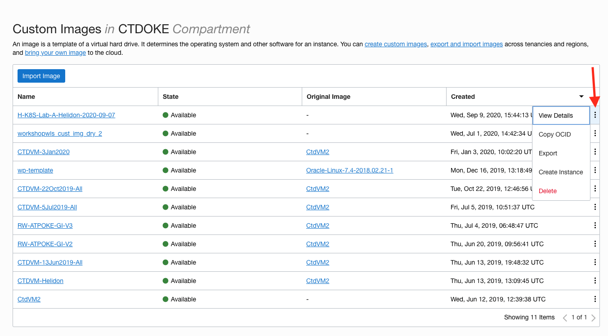

  6. Name the instance based on the image version so you can track what version of the lab you are following. If multiple people are sharing the same tennacy you may want to put your initials in there as well e.g. `H-K8S-Lab-A-Helidon-2020-29-10-tg`

  7. Expand the **Show Shape, Network and Storage Options** selection if it's not visible

  8. Select an **Availability domain** (Which one doesn't matter)

  9. If `VM.Standard.E3.Flex` with 1 OCPU and 16GB memory is not the selected instance shape click the `Change shape` button, select the Instance type to `Virtual machine`, the Processor to `AMD Rome` and the OCPU count to `1` (This will set the memory for you) Then click `Select shape` to use this shape. (You can chose other shapes if you prefer, just at the time of writing this was the most cost effective)
  
  10.The *Virtual Cloud Network Compartment* should already be set to **CTDOKE**.

  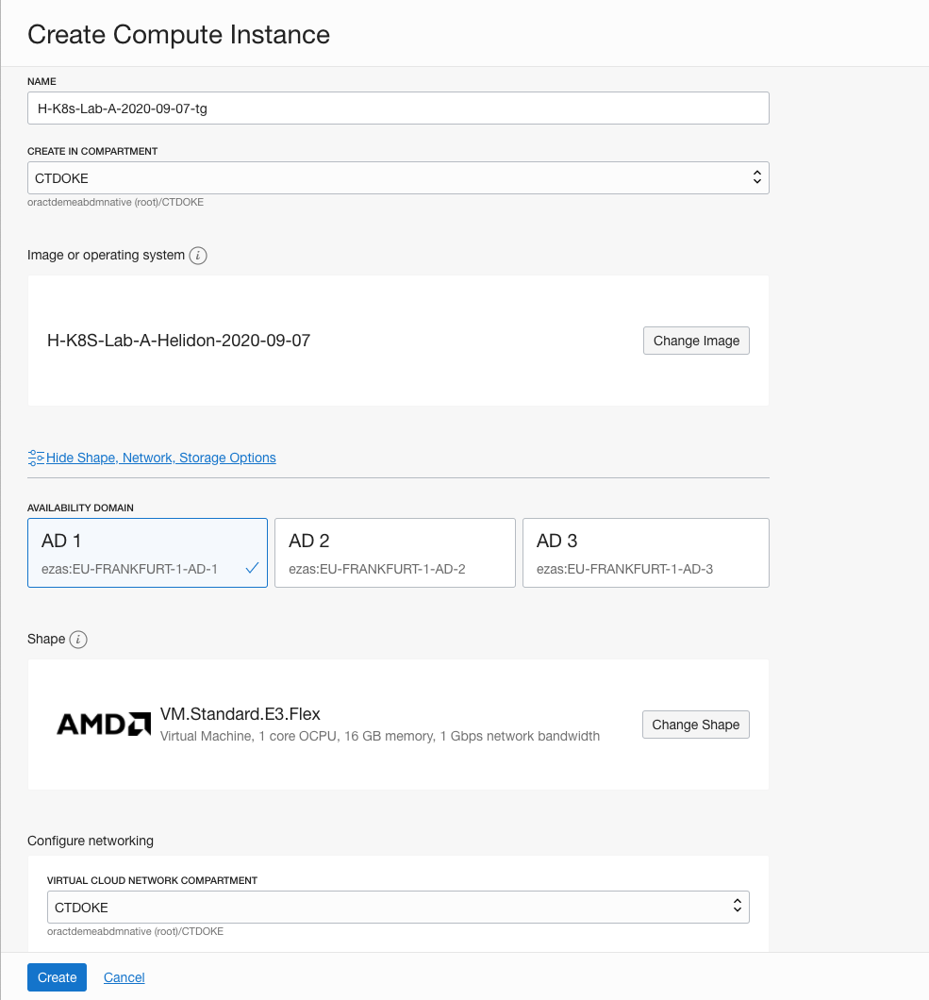

  11. Check the `Virtual Cloud Network Compartment` is set to `CTDOKE`

  12. In the **Virtual cloud Network** dropdown,  select the **CTDVMVCN** network. 

Leave all the other settings in the network section as they are

  13. Check the **Assign a public IP address** option is selected
  
  14. Leave the boot volume settings unchanged (On some newer versions of the UI this may be below the SSH keys section, but you still don't change it)
  


  15. Scroll down to the **Add SSH Key** section

  16. Make sure the **Generate SSH Key Pair** option is selected

  17. If you wish you can download the ssh keys by clicking on the buttons (This is not required as we will be using VNC to access the instance)
  
  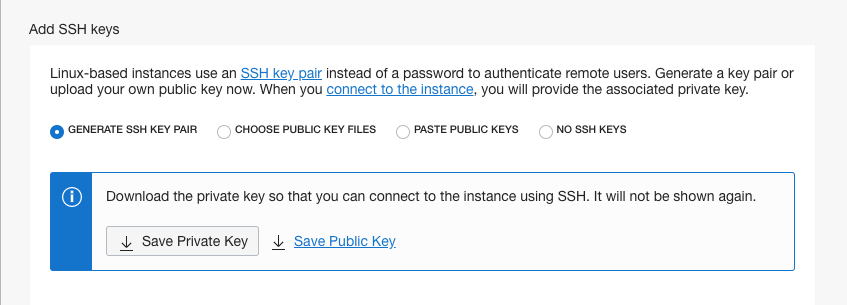

You have finished the wizard!

  18. Click the **Create** button on the bottom of the wizard to initiate the creation.

  19. If you get a **No SSH Access** warning you can ignore it, just click `Yes, Create Instance Anyway`

Once the create button has been clicked you will see the VM details page.  Initially the state will be **Provisioning** but after a few minutes it will switch to **Running**, and you will see that a **public IP address** has been assigned.  Make a note of that IP address (The copy link next to it will copy the address into your computers copy-and-paste buffer.)

  

Give the VM a few minutes to start up it's internal services.


## Step 7: Accessing the Developer VM

You will be using VNC to access the developer VM. There are multiple possible clients, chose from the list below or use another if you already have it. Note that the following may require you to have some level of admin rights on your machine.

### Installing a VNC viewer

For **macOS** we recommend realVNC which can be obtained from 

  - https://www.realvnc.com/en/connect/download/viewer/macos/

For **Windows**, suggested packages are TigerVNC viewer or TightVNC Viewer but if you already have a preferred VNC viewer you can use this. TigerVNC viewer has a simpler install process, as it is a standalone executable, but has fewer features.

  TigerVNC: Download ‘vncviewer64-1.9.0.exe’ from

  - `https://bintray.com/tigervnc/stable/tigervnc/1.9.0#files` and save it to your desktop. It is a self-contained executable file, which requires no further installation.

 TightVNC Viewer: Select the 'Installer for Windows (64-bit)' from

  - `https://www.tightvnc.com/download.php`

  - When prompted, select to save the file.  Next, run the executable to install the program. This requires you have the privileges to install software on your machine

### Accessing Development VM using VNC

We are using VNC to provide you with a remote desktop, this let's us use a Integrated Development Environment for the Helidon labs.

You need to let your VM run for a couple of mins to fully boot and start the VNC server.

  1. Open your VNC Client

  2. Connect to the client VM. Depending on your client you may be asked to different information, but usually you'll be asked for a connect string. This may look like `123.456.789.123:1` where the `123.456.789.123` is the IP address and the `:1` is the display number. Some VNC clients require the use of the port number in which case it will be `123.456.789.123:5901` where the `123.456.789.123` is the IP address and the `:5901` is the port number. Unfortunately this is client specific, so if one approach doesn't work try the other. Note that is an example connection, you will need to use the IP address of your VM.

  3. You VNC client may warn you that you're making an insecure connection, this is expected as we have not setup security certificates. For example for a real VNC client on a Mac this may look like 

  

  4. You will be asked to enter a password to access the virtual screen. Your instructor will have provided this or it will have been in the file with the image import URL. This is an example showing this with the Real VNC client running on a Mac

  

Once you have logged in you will see the Linux desktop, it will look similar to this, though the background and specific icons may differ.

  

### Changing the VNC Password (optional)

We have provided a pre-set VNC password. If you are in a instructor led lab this may have been provided to you by your lab instructor, or it may be in the image location file you downloaded earlier.

While not required we do recommend that you change this password to prevent access by other people.

  5. On the desktop background click right, then tak the "Open Terminal" option

  

  6. In the resulting terminal window type `vncpasswd`

  7. At first the prompt enter your new VNC password

  8. At second the prompt reenter your new VNC password

  9. When prompted if you want a view only password enter `n`

  

The easiest way to apply the new password is to reboot the VM

  10. In the terminal enter `sudo reboot`

  

The VNC connection will probably drop immediately and the VNC client will try to reconnect (in which case close the VNC window) or it may just close the window for you (the specific behavior is VNC client specific.) 

When the VM has rebooted (allow about 60 - 90 seconds) Open a new VNC connection, the IP address shoudl remain the same, and at the VNC login enter the **new** VNC password you just set.

## Step 8: Installing Eclipse in the developer VM

We have installed a developer configuration of Oracle Linux, and added tools like Maven, git and the Java development kit. To ensure that you have the latest integrated developer environments (IDE's) and starting point source code for the labs there are a couple of steps you need to take.

There are many IDE's available. We have chosen Eclipse as it's open source licensed. As Eclipse requires the acceptance of a license we can't automate the process for you.

We have installed the Eclipse installer and places a short cut to it on the desktop. It will look like 

  1. Double click on the `eclipse-installer` icon on the desktop. This will open the installer. It may look like a text page and be named `eclipse-installer.desktop` rather than the icon shown below, if it does still click it. You may be warned it's and `Untrusted application launcher`, if this happens click the `Trust and launch` option. **Do not** click the Post Eclipse Installer icon.
 
  

The Eclipse installer will start.

  2. Select the `Eclipse IDE for Enterprise Java Developers` option

  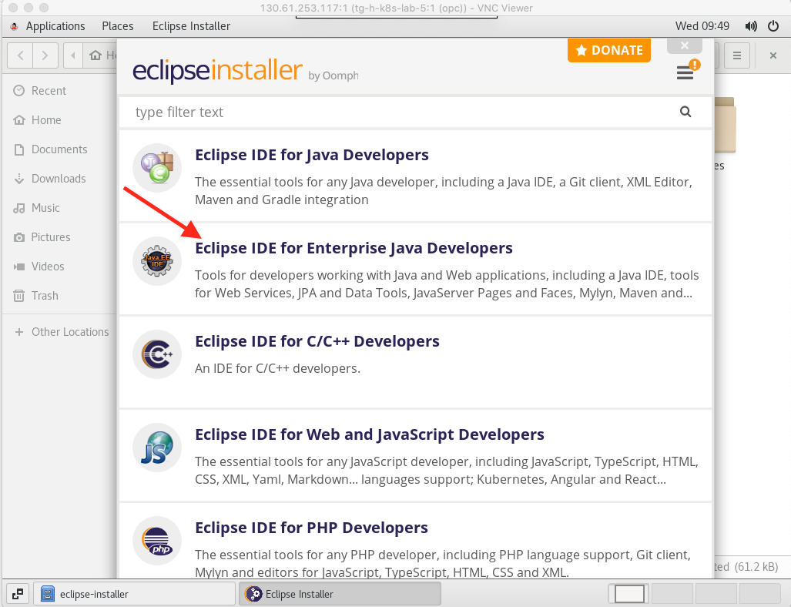

The installer switched to the next page

  3. Select the `/usr/lib/jvm/java-11-openjdk` in the Java JVM dropdown ** DO NOT PRESS INSTALL YET**
 
  4. Set the install path to be `/home/opc`

  
 
  5. Then click the `Install` button
 
  6. Assuming you agree with it click `Accept Now` on the license page. (If you don't agree with the license you can install your own IDE but all of the instructions are on the basis of using Eclipse.)
 
  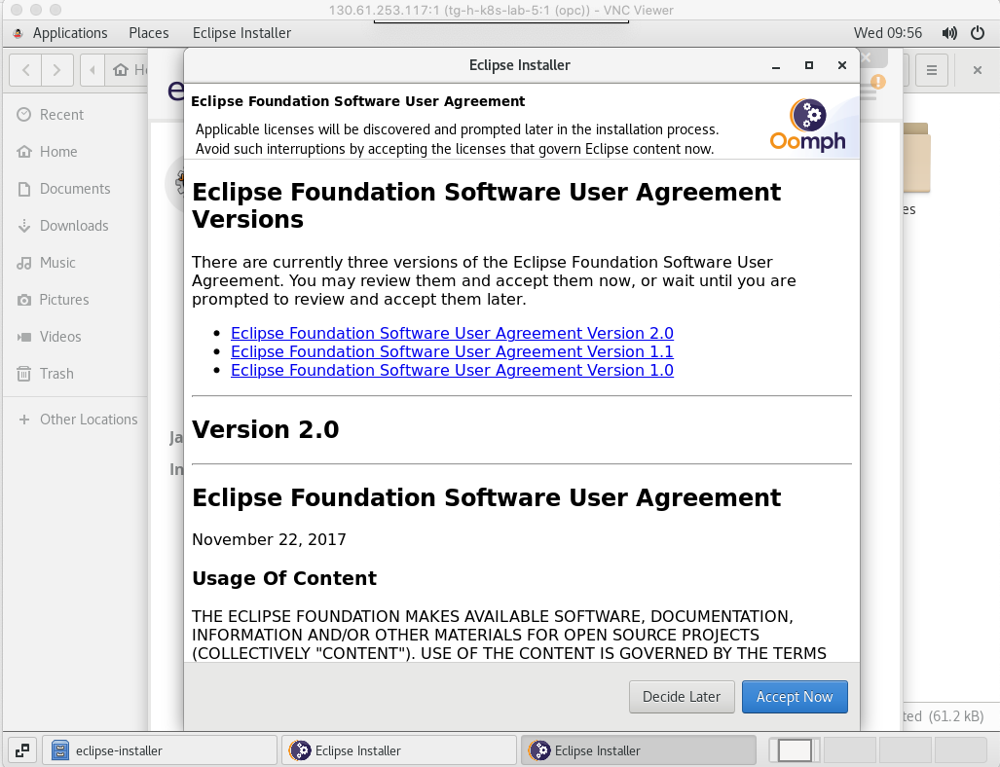
 
The installer progress will be displayed
 
  
 
  7. You **may** be presented with warnings about unsigned content, if you are click the `Accept` button
 
  
 
  8. You **may** be presented with warnings about certificates. If you are click the `Select All` button, then the `Accept Selected` button (this is not enabled until certifcates have been selected)
  
  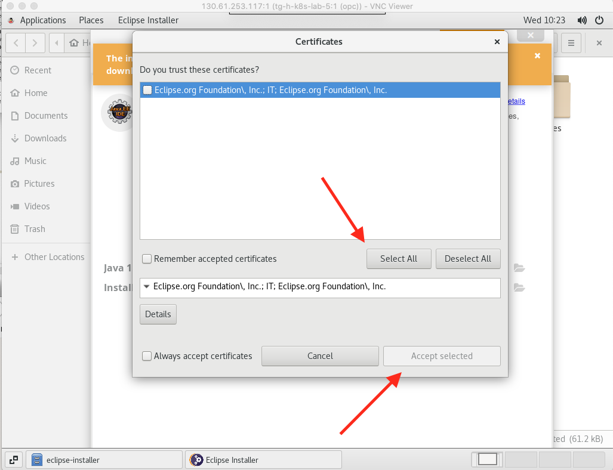
  
  9. On completion close the installer window (X on the upper right.) **Do not** click the `Launch` button.
 
  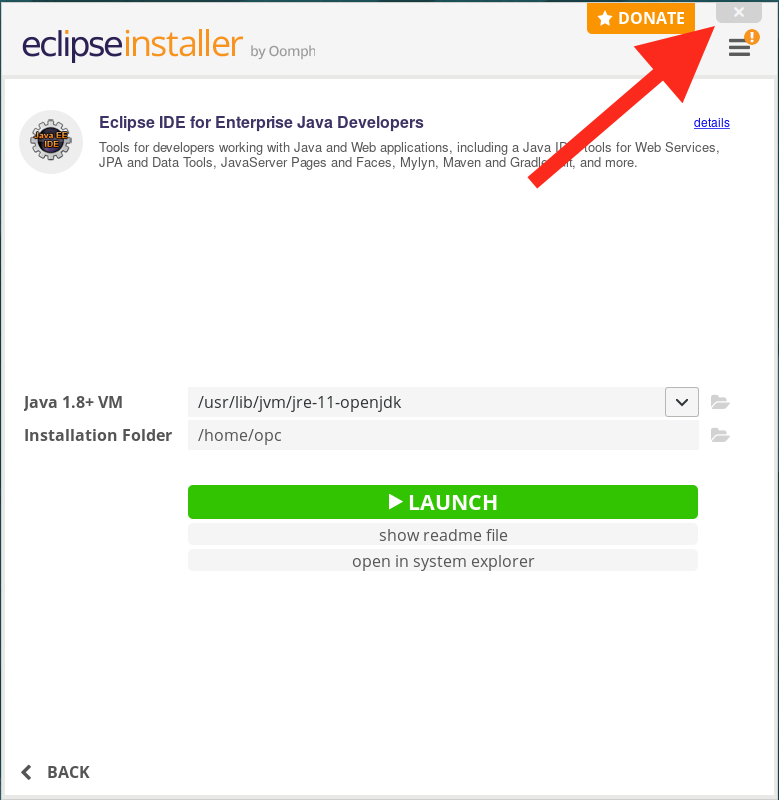

  10. Click `No` on the exit launcher page that's displayed

  

We're now going to run a script that tidies up the desktop and creates an eclipse desktop icon

  11. Double click on the `Post Eclipse Installer` icon on the desktop. This will run the script. It may look like a text page and be called `posteclipseinstal.desktop` rather than the icon shown below, if it does still click it. You may be warned it's an `Untrusted application launcher`, if this happens click the `Trust and launch` option.

  

If the eclipse installation was in the right place then the two desktop icons will disappear and be replaced with an `Eclipse` icon. If the Eclipse installation was in the wrong place then it will exit immediately without making any changes. In that case re-run the installer and ensure you use `/home/opc` as the Eclipse installation path.

Note that sometimes the Eclipse installer will create it's own desktop icon to start Eclipse. This does not happen every time, but if it does create one you can also use that icon to start Eclipse as well.

  12. Double click on the `Eclipse` icon on the desktop. It may look like a text page rather than the icon shown below, if it does still click it. You may be warned it's an `Untrusted application launcher`, if this happens click the `Trust and launch` option.

  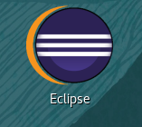

As Eclipse starts you will be presented with a start up "splash" then workspace selection option. 

  13. Set the eclipse workspace to be `/home/opc/workspace` (If you chose a different location you will have to remember to use that new location in many later stages.)

  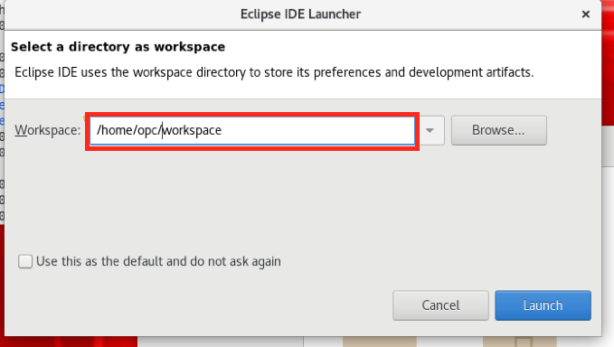

  14. Click the `use this as the default and do not ask again` option, then the `Launch` button

  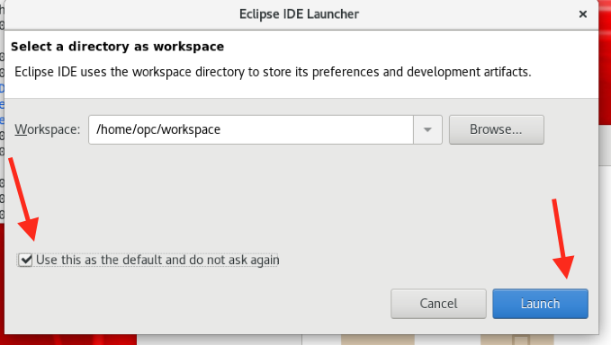

You will be presented with the Eclipse startup. This may include a welcome page. You can close it by clicking the `x` as per normal with sub windows.

  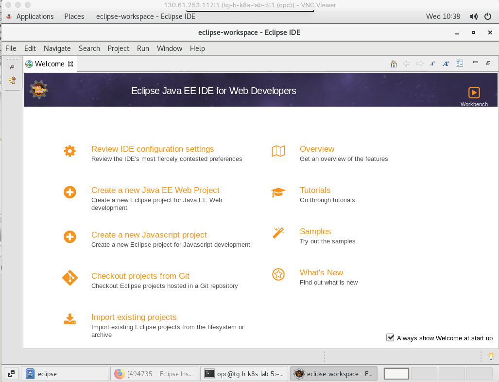

  15. You can close the `Donate` , `Outline` and `Task list` tabs to get the most usage from the screen.

  

This image shows you the empty Eclipse workspace with the non required tabs all closed

  

We need to configure Eclipse to display the course files in a hierarchical manner (this is so it matches the images you will have in the lab instructions, if you prefer to use the Eclipse  "Flat" view then you can ignore this step)

  16. Click on the Three dots in the Project Explorer panel, then take the `Package Presentation` menu option and click the radio button for `Hierarchical`

  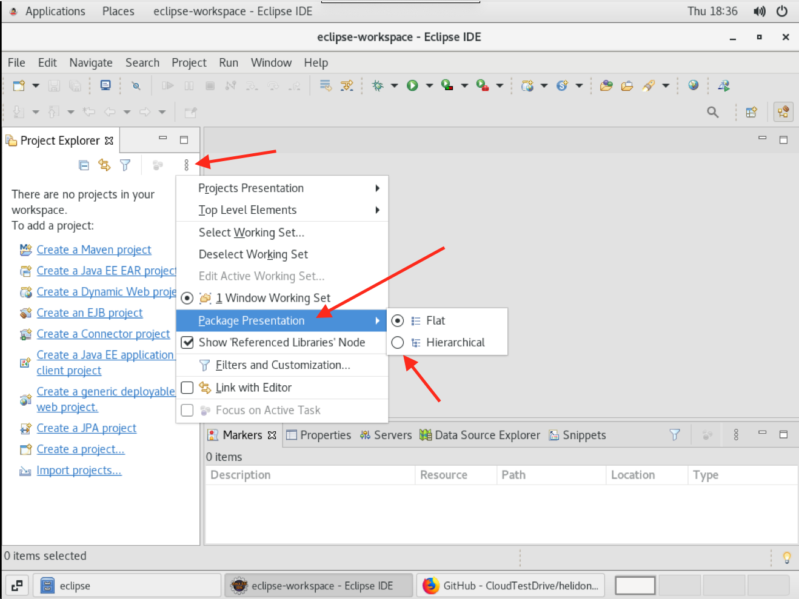

### How to re-open Eclipse if you close it

Double click on the `Eclipse` icon on the desktop. It may look like a text page rather than the icon shown below, if it does still click it. You may be warned it's an `Untrusted application launcher`, if this happens click the `Trust and launch` option.


## Step 9: Downloading and importing the labs initial code

To enable us to update the code used by the labs without having to update the Developer VM image each time we hold the primary copy of the code in a git repository (where we can update it as the lab is enhanced) You need to download this into your development VM and import it into Eclipse

### 9a. Downloading the initial setup code zip file.

  1. Open the Firefox web browser - Click `Applications` then `Internet` then `Firefox`

  

  2. In the browser **in the virtual machine** go to the URL `https://github.com/CloudTestDrive/cloud-native-setup` 

  3. Click the `Code` button

  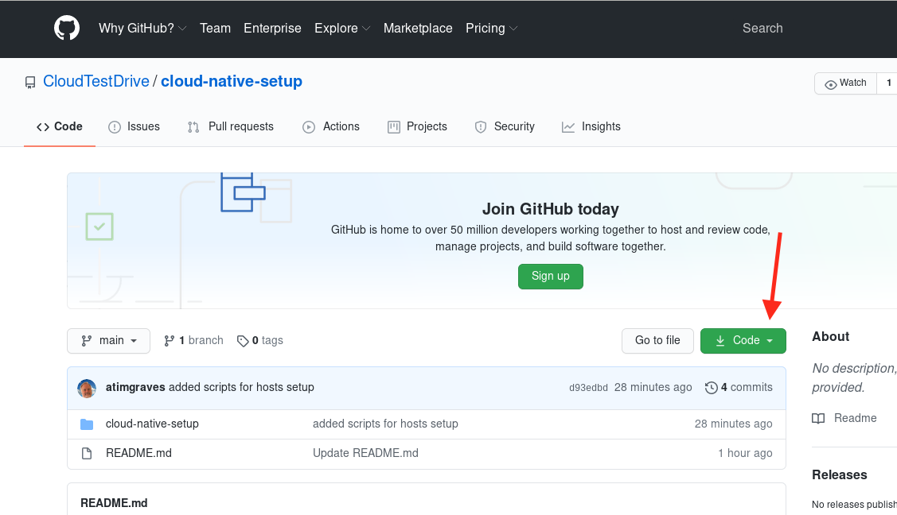

  4. Click the `Download ZIP` option

  

A save options menu may be displayed

  5. Click the `Save file` option, then `OK`

  

When the download is complete the Firefox download icon will turn completely blue

  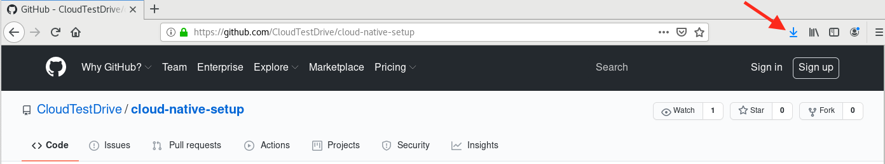

### 9b. Importing the downloaded zip file

  6. Switch back to Eclipse **Do not** close the Firefox window (that may cause it to delete the download file)

  7. Click the `File` menu, then `Import`

  

  8. Open the `General` node, then chose the `Existing projects into Workspace` option. Click `Next`

  

  9. Chose the `Select archive file` radio button, then click `Browse` on that row

  

  10. On the left menu chose `Downloads` then in the resulting list chose the download you just made (probably called `cloud-native-setup-main.zip`)

  11. Click the `Open` button

  

  12. Click `Select All` to make sure all the projects are imported, then click the `Finish` button

  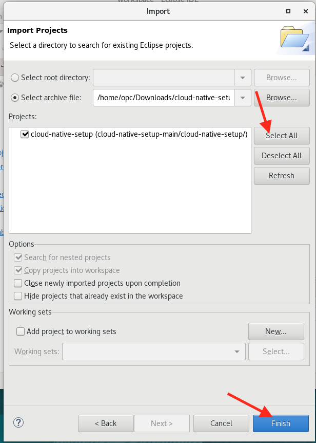

Eclipse will import the projects and start importing the Maven dependencies. Expect to see errors listed on the Eclipse `Problems` tab, and projects marked as having errors (red indicators) in the Project Explorer. 

  

This may take a few mins. **Do not worry if you see errors** these are to be expected as we haven't finished configuring the Eclipse environment yet

Wait until the building indicator (lower right) has gone away.

### 9c. Configuring Lombok

These labs use Lombok to do many of the "standard" functions like automatically creating constructors, getters and so on. Lombok will be covered later in the labs, but for now we need to install it into the Eclipse installation.

  13. Expand the `cloud-native-setup` project (Click the little triangle to the left of the project name)

  14. Expand the `Maven Dependencies` node

  15. In the maven dependencies section locate the `lombok` jar file (it will have a version number after it, at the time of writing that was 1.18.10, but that may have changed as lombok updates often)

  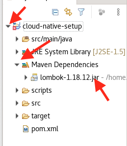

  16. Click right on the lombok jar file, then chose the `Run As` manu option, then `Java Application`

  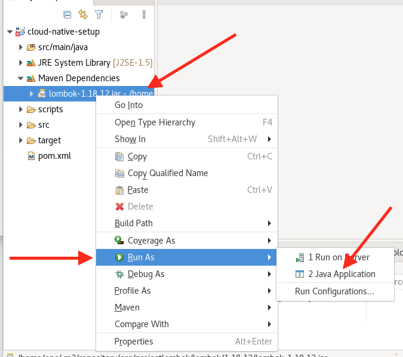

  17. If you get a warning about errors click the `Proceed` button (the point of what we're doing is to fix them !)

  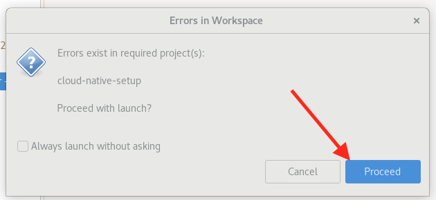

After a short while the lombok UI will be displayed.

If you get a warning that Lombok cannot locate any IDE's you will have to locate it manually, follow these steps in that case

  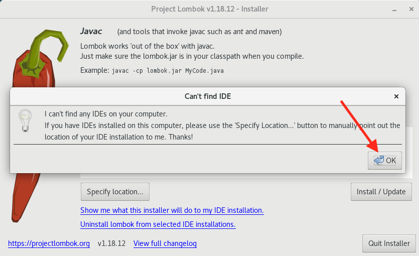
  
If Lombok has located an IDE then skip the following steps that locate the IDE and go to step 23 in this section

  18. Click the `OK` button in the warning popup

  19. Click the `Specify location` button

  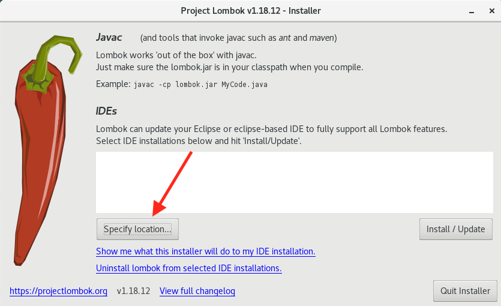

  20. In the file selector popup navigate to the IDE location you noted when you installed Eclipse if you set the install path in the earlier stage this is going to be `/home/opc/eclipse`

  21. Select the `eclipse.ini` file

  22. Click the `Select` button on the file chooser

  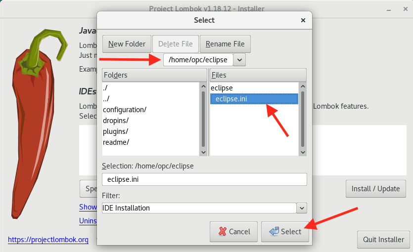

  23. Make sure that the eclipse installation has it's checkbox selected, then click the `Install / Update` button

  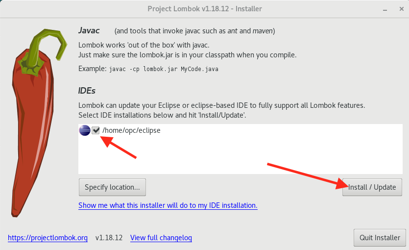

Lombok will do the install (this is very quick) and confirm success 

  24. Click the `Quit Installer` button to close the Lombok installer

  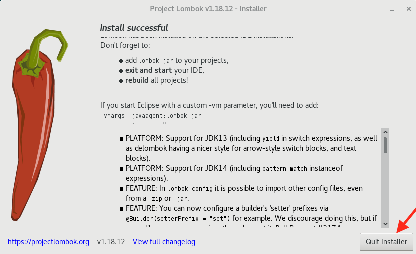

Once Lombok has been installed you need to exit and then start Eclipse to have it recognized (The restart option in Eclipse is not sufficient.)

  25. Click the `File` menu then `Exit` (**do not chose restart**, that does not trigger the reload of the entire Eclipse environment) 

  26. Re-start Eclipse using the method described above, make sure it's Eclipse you are starting, not the installer.

We can check that Lombok has been installed

  27. Click the `Help` Menu then the `About Eclipse IDE` option

  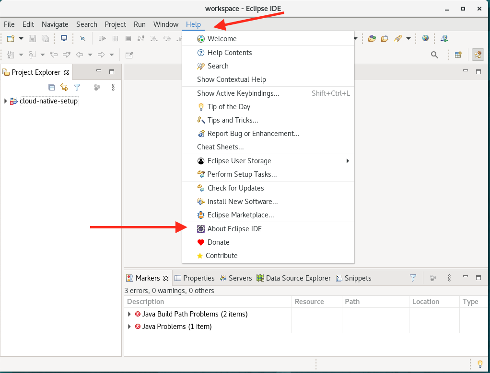

  28. You may need to scroll down in the `About` popup, but towards the end you should see the Lombok installation confirmation (in this case 1.18.12 / Envious Ferret, though updates to the lab may use a newer version)

  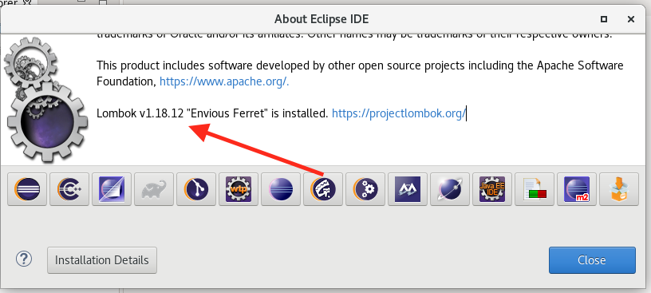

  29. Click the `Close` button to get rid of the popup

### 9d. Updating the project configuration.

Restarting eclipse so it recognizes Lombok does not always trigger a rebuild or Maven update to remove the flagged problems, so we need to do that. 

  30. Select the `cloud-native-setup`  project in the project explorer. Click right on them then chose `Maven` from the menu then `Update project`

  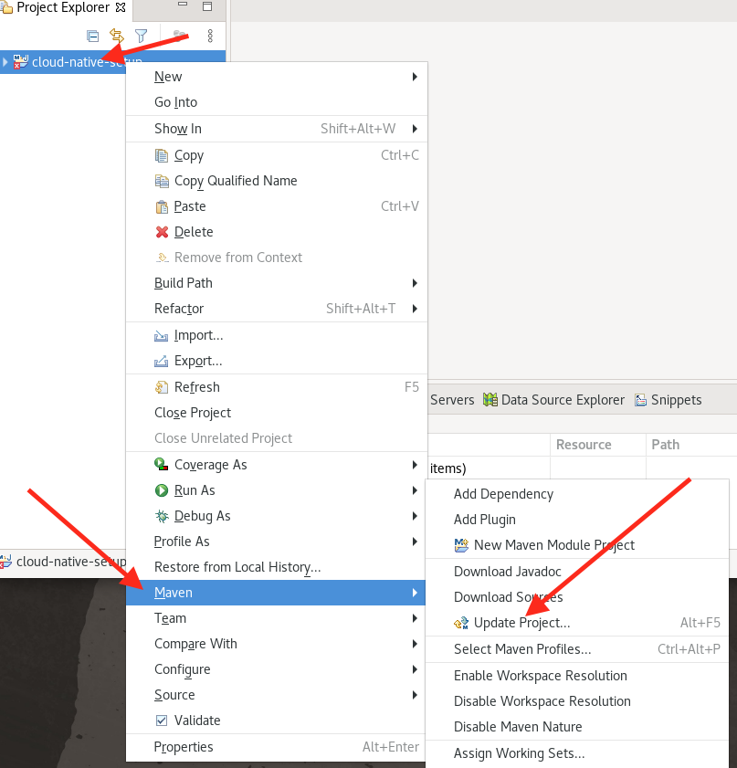

  31. Click the `Select All` button, then click the `OK` button

  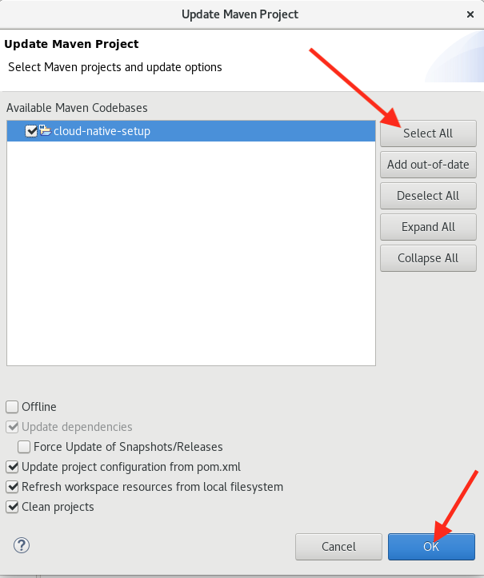

Maven will go and do it's thing, that may take a while.

When Maven finishes there may be warnings about problems (These relate to incomplete code you will be updating in the lab) but there shouldn't be any remaining errors.


## Step 10: Downloading the database Wallet file.

The database Wallet file contains the details needed to connect to your database instance, it needs to be downloaded to the development VM and placed in the right location.

The easiest way to get the database Wallet file into your virtual machine is to use the cloud console to download it.

  1. Open a web browser **inside the virtual machine**
  
  2. Login to the Oracle Cloud Console
  
  3. Open the `hamburger` menu (three bars on the top left)
  
  4. Scroll down (if needed) to the `Database` section. Click on the `Autonomous Transaction Processing` menu option
  
  5. If you need to select the **CTDOKE** compartment you created earlier in the Compartment selector on the left side of the page.
  
  6. Click on your database name in the list (it's a link)
  
  7. On the database page click the `DB Connection` button
  
This will display a Database connection details popup

  8. Leave the `Wallet type` as `Instance connection`
  
  9. Click the `Download Wallet` button
  
  10. A password pop-up will be displayed. Enter and confirm a password, this is used to encrypt some of the details.
  
  11. Once your password is accepted and confirmed click the `Download` button
  
  12. If you are asked what to do with the file make sure you chose the `Save file` option
  
  13. The wallet file will start to download and the password pop-up will disappear and you'll be returned to the `Database connection` pop-up
  
  14. Click `Close` on the `Database Connection` popup


## End of the tenancy level setup

Congratulations, you have successfully prepared your tenancy to do the labs, there will be lab specific setup instruction where appropriate in the labs. 

## Acknowledgements

* **Author** - Tim Graves, Cloud Native Solutions Architect, EMEA OCI Centre of Excellence
* **Author** - Jan Leemans, Director Business Development, EMEA Divisional Technology
* **Last Updated By** - Tim Graves, November 2020

