[Go to Overview Page](../README.md)


# Migration of Monolith to Cloud Native - Setting up your tenancy


## Introduction

<details><summary><b>Self guided student - video introduction</b></summary>

This video is an introduction to the Kubernetes labs setup - for people who have not done the Helidon and docker sections. Once you've watched it please press the "Back" button on your browser to return to the labs.

[](https://youtu.be/o3KqqMqRxPk "Kubernetes labs only setup introduction video")

---

</details>

This page explains the steps to set up your **Oracle Cloud Tenancy** so you are ready to run the Kubernetes modules. 

If you have completed the Helidon labs then you will have already setup the compartment and ATP database, so you can return to the main lab.

**If you are attending an instructor-led lab**, your instructor will detail steps you need to execute and which ones you can skip.

## Step 1: Create the CTDOKE compartment

  1. Click the "Hamburger" menu (three bars on the upper left)

  2. Scroll down the list to the **Governance and Administration** section

  3. Under the **Identity** option chose **Compartments**

  4. You should see a screen that looks like this : 

  

  
**ATTENTION** : if the compartment `CTDOKE` already exists, please move to the next major step on this page, setting up the database

If the `CTDOKE` compartment is not yet there, **create it** : 
  
  5. Click the **Create Compartment** button
  
  6. Provide a name, description
  
  7. Chose `root` as the parent compartment
  
  8. Click the **Create Compartment** button.

  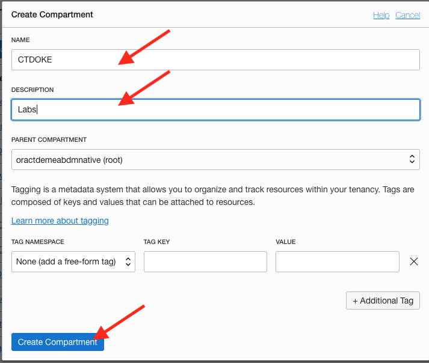

## Step 2: Setup the database

### Step 2a. Create the database

  1. Use the "Hamburger" menu, and select the **Oracle Database** section, then **Autonomous Transaction Processing**

  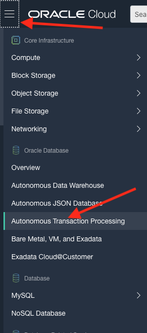

This will switch to the database management page. Note that depending on your tenancy and if others are also using the list of existing database may be empty or differ from what's shown here.

  2. Make sure the `CTDOKE` compartment is selected

  3. Click **Create Autonomous Database** button

  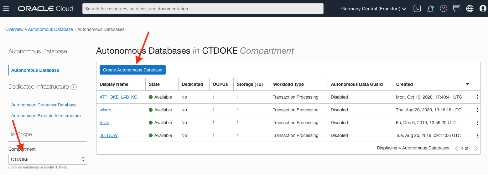

  4. Fill in the form, and make sure to give the DB a unique name and display name for you (use your name or initials) in case multiple users are running the lab on this tenancy.

  5. Make the workload type **Transaction Processing**

  6. Set the deployment type **Shared Infrastructure**

  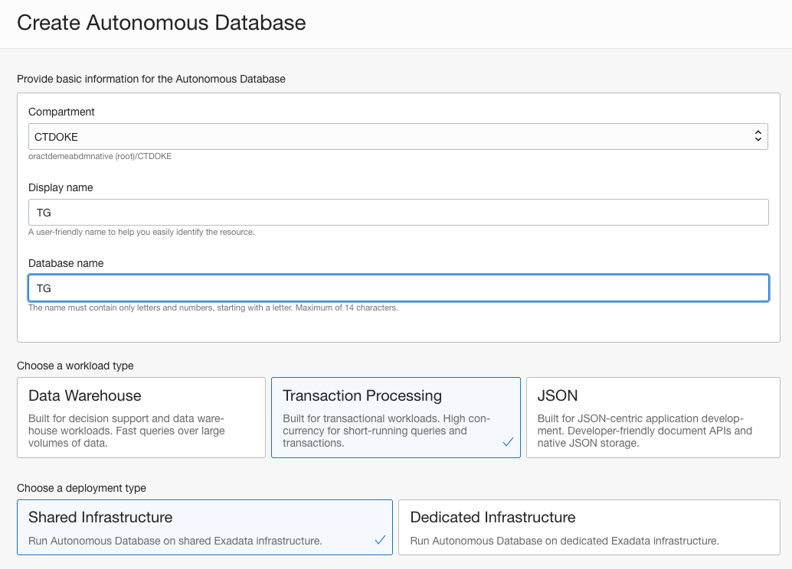

  7. Chose the most recent option for the database version, allocate 1 OCPU and 1 GB of storage (this lab only requires a very small database)

  8. Turn off auto scaling

  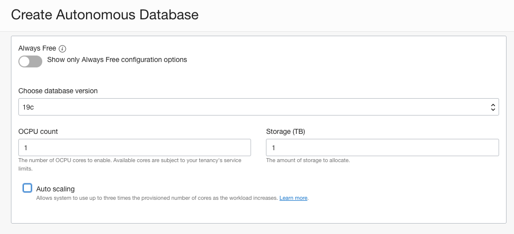

  9. Enter an admin password, be sure to remember it. The current rules are must have at least one number, one upper case, and one lower case letter, if the password does not meet the rules you will get a error displayed when you switch to the next field.

  10. Re-enter the password you chose in the confirm password box

  

  11. Make sure that the **Allow secure access from everywhere** is enabled.

  12. Chose the **License included** option

  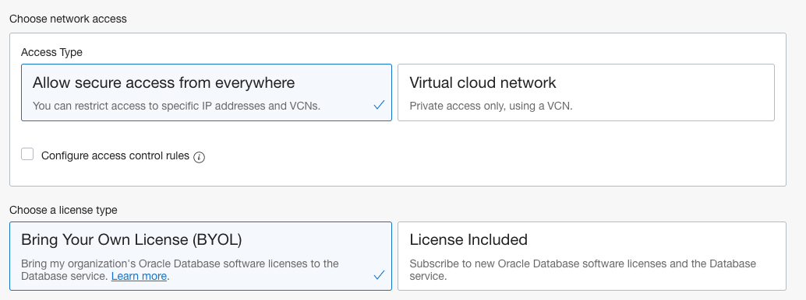

As a reminder - Be sure to remember the admin password, save it in a notes document for later reference.

  13. Click the **Create Autonomous Database** button at the bottom of the page.

  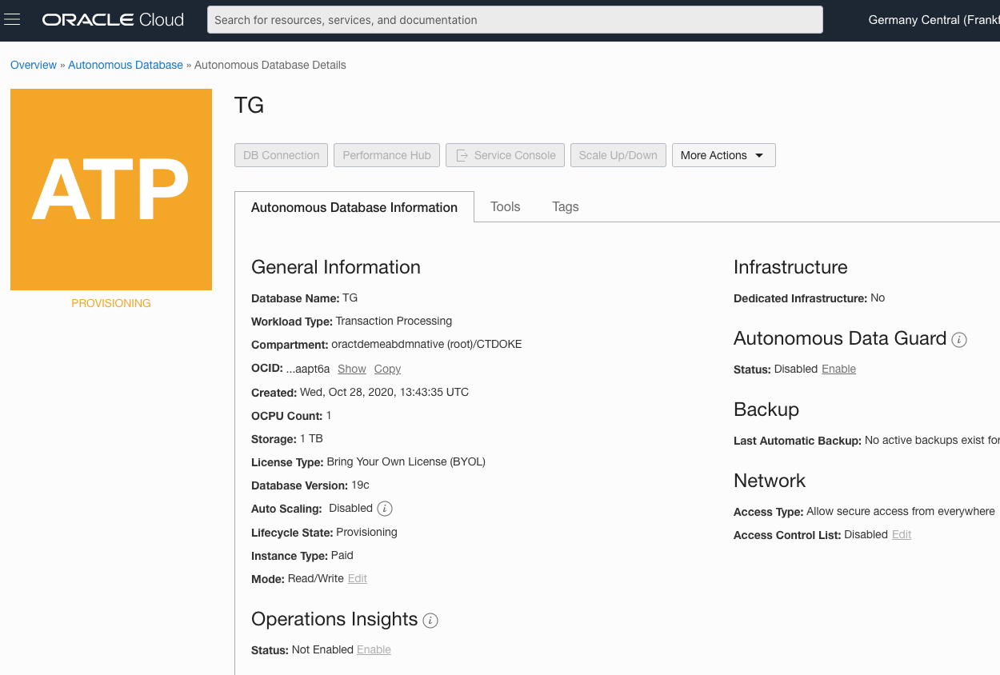

The database will start to be provisioned. This may take a short while, once it is running the orange box will turn green and the buttons will be enabled.

  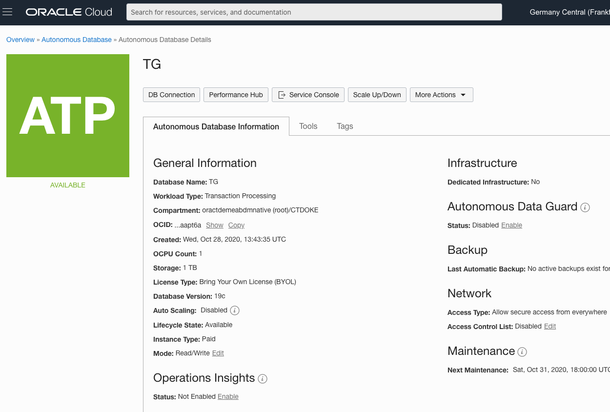

  14. Once the instance is running click on the **Copy** button by the OCID, this will copy the OCID to your computers copy-and-paste buffer.

  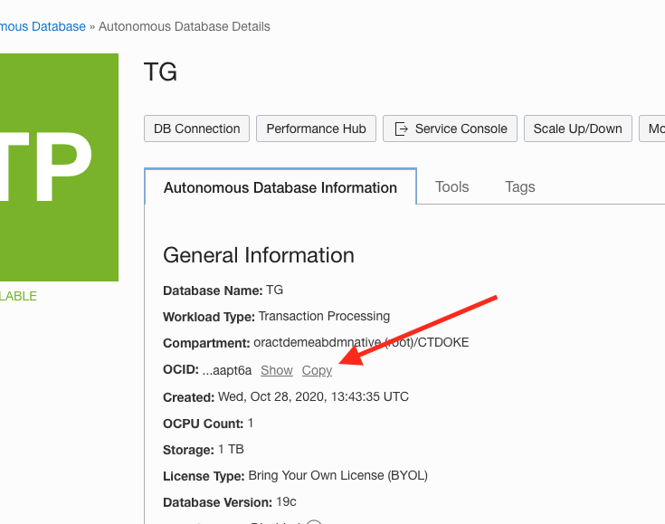

  15. Open a document and paste the OCID, you will need this later in the setup.


### Step 2b. Setup your user in the database

We need to configure the database user so it matches the lab instructions

  1. Now the instance is running click on the **Tools** tab, then **Open SQL Developer Web** button

  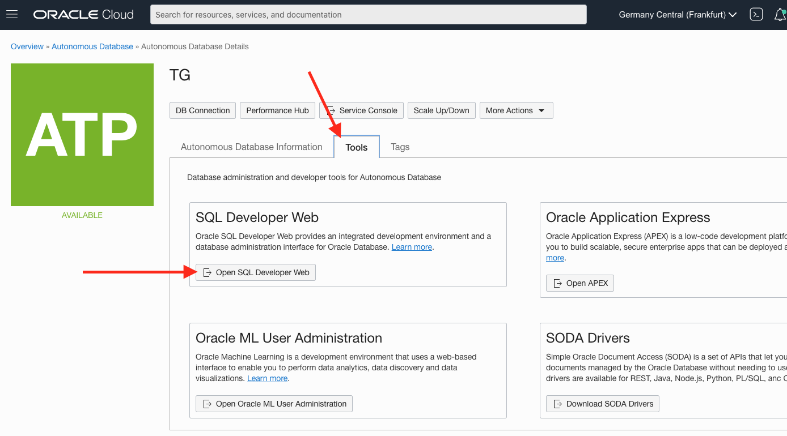

This will open the SQL Developer web login page

  2. Login as `ADMIN` (it's case sensitive), using the password you chose earlier in the database setup.

  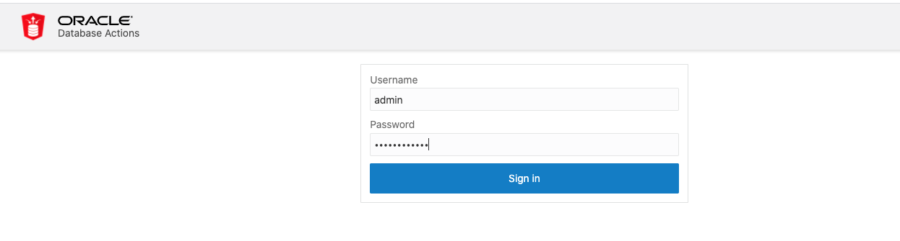
  
  3. Chose **SQL**  in the **Development** section
  
  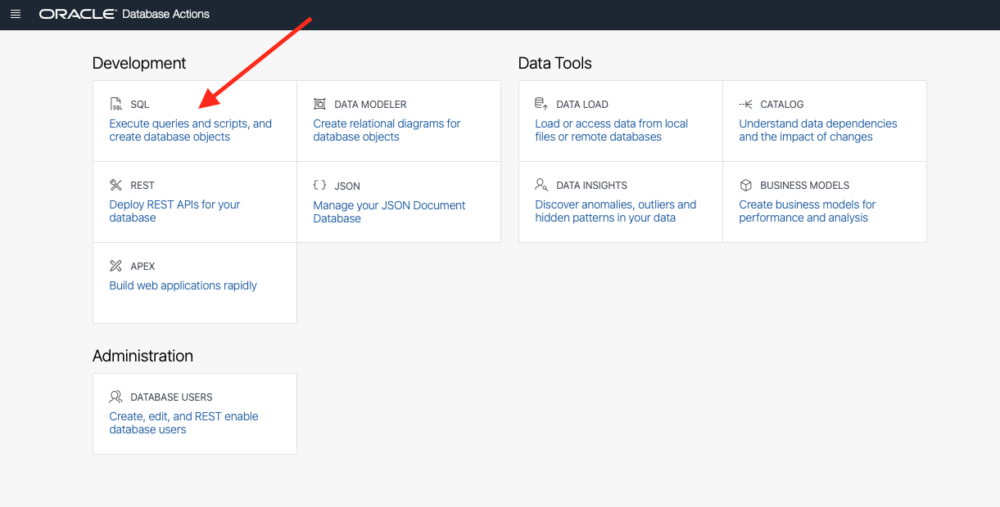
  
  4. If the intro messages popup are displayed (this is uauslly the first time you've opened the tool) then click **X** in the popups to dismiss them - or if you want to read them just click all the way through them.

Once the intro messages are gone you'll get to the main screen

  5. Copy and paste the below SQL instructions into the worksheet (highlighted in red in the image below)

  ```
CREATE USER HelidonLabs IDENTIFIED BY H3lid0n_Labs;
GRANT CONNECT TO HelidonLabs;
GRANT CREATE SESSION TO HelidonLabs;
GRANT DWROLE TO HelidonLabs ;
GRANT UNLIMITED TABLESPACE TO HelidonLabs;
```

  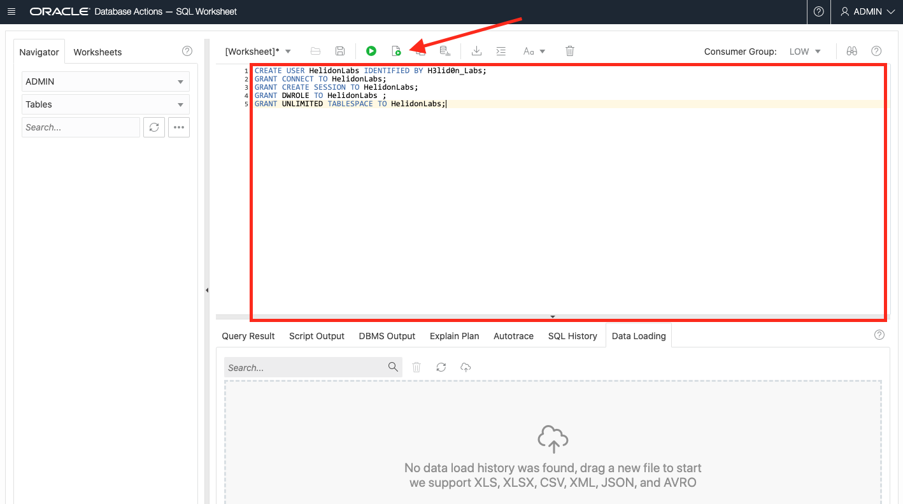

  6. Then Run the script (The Page of paper with the green "run" button.) 

If it works OK you will see a set of messages in the Script Output section of the screen (highlighted in red below) saying the User has been created and grants made.

  


## End of the setup

Go to the **Create your Kubernetes cluster** lab

## Acknowledgements

* **Author** - Tim Graves, Cloud Native Solutions Architect, EMEA OCI Centre of Excellence
* **Author** - Jan Leemans, Director Business Development, EMEA Divisional Technology
* **Last Updated By** - Tim Graves, November 2020

