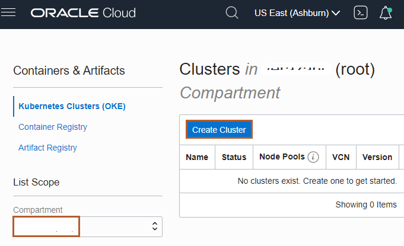
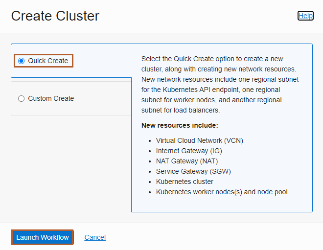
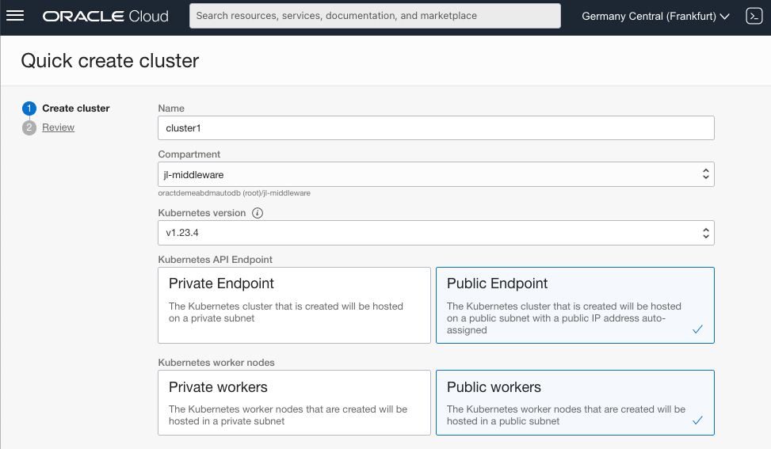
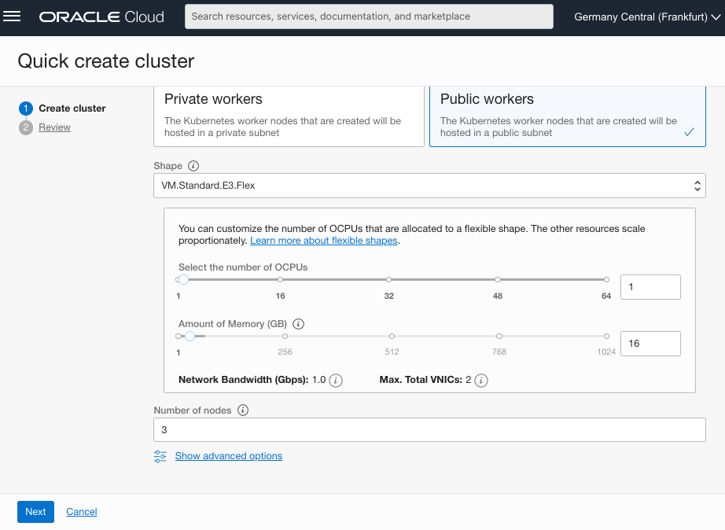
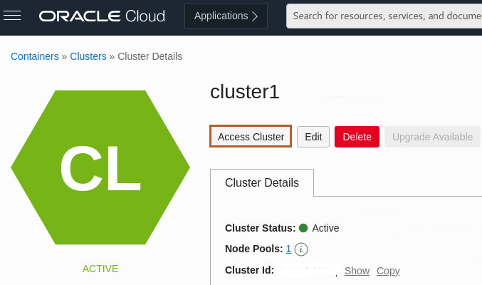
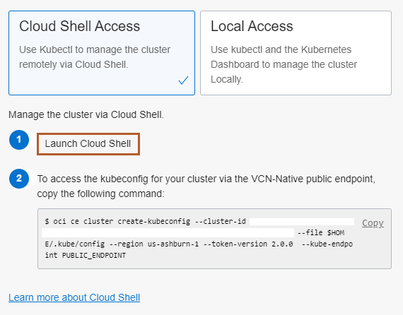
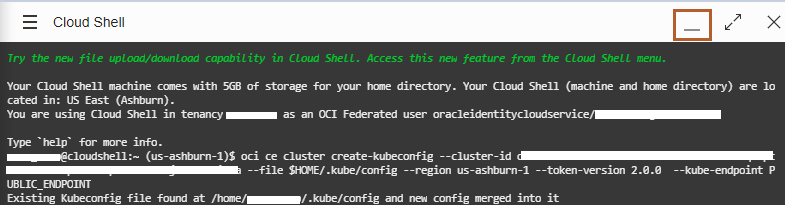

# Create Oracle Container Engine for Kubernetes (OKE) on Oracle Cloud Infrastructure (OCI)

## Introduction

This lab walks you through the steps to create a managed Kubernetes environment on the Oracle Cloud Infrastructure.

Estimated Lab Time: 20 minutes

### About Product/Technology

Oracle Cloud Infrastructure Container Engine for Kubernetes is a fully-managed, scalable, and highly available service that you can use to deploy your container applications to the cloud. Use the Container Engine for Kubernetes (sometimes abbreviated OKE) when your development team wants to reliably build, deploy, and manage cloud-native applications. You specify the compute resources that your applications require, and OKE provisions them on the Oracle Cloud Infrastructure in an existing OCI tenancy.

### Objectives

In this lab, you will:

* Create an OKE (Oracle Kubernetes Engine) instance.
* Open the OCI Cloud Shell and configure `kubectl` to interact with the Kubernetes cluster.

### Prerequisites

You must have an [Oracle Cloud Infrastructure](https://cloud.oracle.com/en_US/cloud-infrastructure) enabled account.

To create the Container Engine for Kubernetes (OKE), complete the following steps:

* Create the network resources (VCN, subnets, security lists, etc.).
* Create a cluster.
* Create a `NodePool`.

This tutorial shows you how the *Quick Start* feature creates and configures all the necessary resources for a 3-node Kubernetes cluster. All the nodes will be deployed in different availability domains to ensure high availability.

For more information about OKE and custom cluster deployment, see the [Oracle Container Engine](https://docs.cloud.oracle.com/iaas/Content/ContEng/Concepts/contengoverview.htm) documentation.

## Task 1: Create an OKE cluster

The *Quick Create* feature uses the default settings to create a *quick cluster* with new network resources as required. This approach is the fastest way to create a new cluster. If you accept all the default values, you can create a new cluster in just a few clicks. New network resources for the cluster are created automatically, along with a node pool and three worker nodes.

1. In the Console, select the *Hamburger Menu -> Developer Services -> Kubernetes Clusters (OKE)* as shown.

    

2. In the Cluster List page, select the Compartment of your choice, where you are allowed to create a cluster, and then click *Create Cluster*.

    

3. In the Create Cluster Solution dialog, select *Quick Create* and click *Launch Workflow*.

    

    *Quick Create* will create a new cluster with the default settings, along with new network resources for the new cluster.

    Specify the following configuration details on the Cluster Creation page (please pay attention to the value you place in the *Shape* field):

    * **Name**: The name of the cluster. Leave the default value.
    * **Compartment**: The name of the compartment. Leave the default value.
    * **Kubernetes version**: The version of Kubernetes. This lab was validated with *v1.23.4*, but higher versions should also work.
    * **Kubernetes API Endpoint**: Are the cluster master nodes going to be routable or not. Select the *Public Endpoint* value.
    * **Kubernetes Worker Nodes**: Are the cluster worker nodes going to be routable or not. Select *Public Workers* value, as this allows direct access to the nodes without necesarily using a load balancer or bastion host.

    

    * **Shape**: The shape to use for each node in the node pool. The shape determines the number of CPUs and the amount of memory allocated to each node. The list shows only those shapes available in your tenancy that are supported by OKE. Select the default *VM.Standard.E3.Flex* (which is typically available in Oracle Free Tier Account).
    * **Number of nodes**: The number of worker nodes to create. Leave the default value, *3*.

    

4. Click *Next* to review the details you entered for the new cluster.

    

5. On the *Review* page, click *Create Cluster* to create the new network resources and the new cluster.

    

    > You see the network resources being created for you. Wait until the request to create the node pool is initiated and then click *Close*.

    

    > Then, the new cluster is shown on the *Cluster Details* page. When the master nodes are created, the new cluster gains a status of *Active* (it takes about 7 minutes).Then, you may continue your labs.

    

    

## Task 2: Configure `kubectl` (Kubernetes Cluster CLI)

Oracle Cloud Infrastructure (OCI) Cloud Shell is a web browser-based terminal, accessible from the Oracle Cloud Console. The Cloud Shell provides access to a Linux shell, with a pre-authenticated Oracle Cloud Infrastructure CLI and other useful tools (*Git, kubectl, helm, OCI CLI*) to complete this lab. The Cloud Shell is accessible from the Console. Your Cloud Shell will appear in the Oracle Cloud Console as a persistent frame of the Console, and will stay active as you navigate to different pages of the Console.


We will use `kubectl` to manage the cluster remotely using the Cloud Shell. It needs a `kubeconfig` file. This will be generated using the OCI CLI which is pre-authenticated, so there’s no setup to do before you can start using it.

1. Click *Access Cluster* on your cluster detail page.

    > If you moved away from that page, then open the navigation menu and under *Developer Services*, select *Kubernetes Clusters (OKE)*. Select your cluster and go the detail page.

    

    > A dialog is displayed from which you can open the Cloud Shell and contains the customized OCI command that you need to run, to create a Kubernetes configuration file.

2. Leave the default *Cloud Shell Access* and first select the *Copy* link to copy the `oci ce...` command to the Cloud Shell.

    

3. Now, click *Launch Cloud Shell* to open the built in console. Then close the configuration dialog before you paste the command into the *Cloud Shell*.

    

4. Copy the command from the clipboard (Ctrl+V or right click and copy) into the Cloud Shell and run the command.

    For example, the command looks like the following:

    ```bash
    oci ce cluster create-kubeconfig --cluster-id ocid1.cluster.oc1.phx.aaaaaaaaaezwen..................zjwgm2tqnjvgc2dey3emnsd --file $HOME/.kube/config --region us-phoenix-1 --token-version 2.0.0
    ```

    

5. Now check that `kubectl` is working, for example, using the `get node` command. you may need to run this command several times until you see the output similar to following.

    ```bash
    <copy>kubectl get node</copy>
    ```

    ```bash
    $ kubectl get node
    NAME          STATUS   ROLES   AGE   VERSION
    10.0.10.193   Ready    node    10m   v1.21.5
    10.0.10.194   Ready    node    10m   v1.21.5
    10.0.10.28    Ready    node    10m   v1.21.5
    ```

    > If you see the node's information, then the configuration was successful.

6. You can minimize and restore the terminal size at any time using the controls at the top right corner of the Cloud Shell.

    

Leave this *Cloud Shell* open; we will use it for further labs.

## Acknowledgements
* **Author** -  Ankit Pandey
* **Contributors** - Maciej Gruszka, Peter Nagy
* **Last Updated By/Date** - Jan Leemans, July 2022
