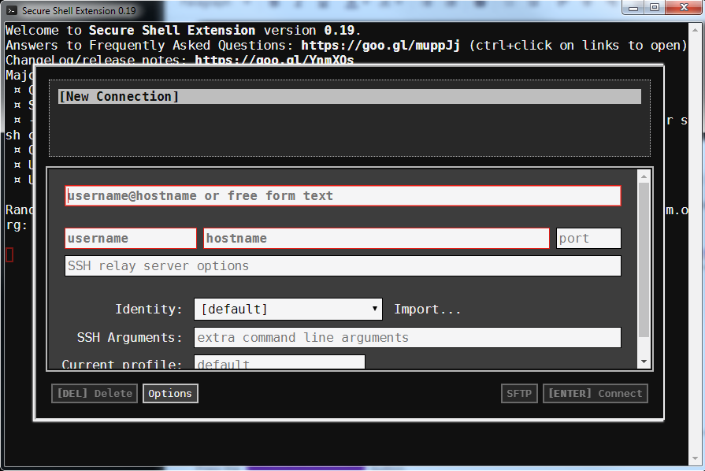
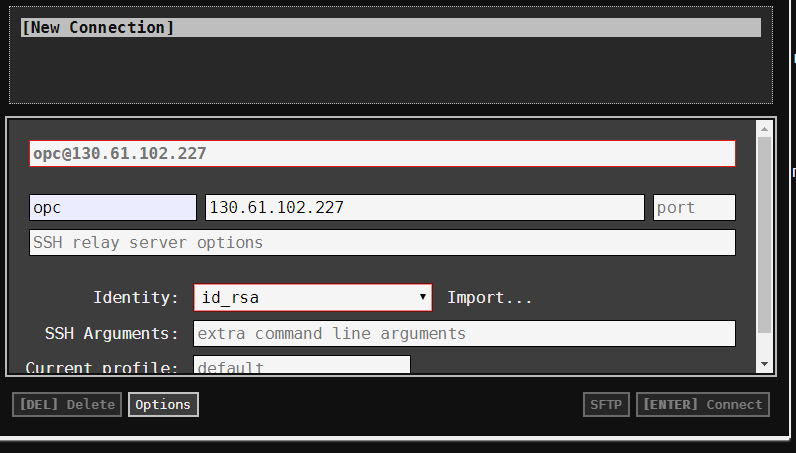

# Appendix B: How do you use the Chrome SSH client extension to ssh to an OCI based virtual machine?

As part of this hands on lab there is a need to use ssh to a virtual machine. If you are using a Windows based laptop and are not sure how to do this, then this guide for using the Chrome browser extension might help.

Open the Chrome browser and open a new tab

Enter this url for the chrome ssh client extension inside the Chrome web store : https://chrome.google.com/webstore/detail/secure-shell-extension/iodihamcpbpeioajjeobimgagajmlibd?hl=en


Press the  button.

Press the 'Add extension' button presented.

After a few seconds you will see that the extension has been added and you are given the option to sync this across devices. You can safely ignore this if you do not want to do it.

At the top right of chrome you should see this new icon for the ssh client.


Click on this icon and select 'Connection Dialog'



In the dialog that appears firstly press the button marked ;Import ...' and select the id.rsa private key that was downloaded as part of this lab in the artifacts.zip.

Enter opc as the 'username'

Put the ip address of the virtual server you have been allocated for this lab in the 'hostname' field.

The details should be similar to those shown below.



When ready press the '[ENTER] Connect' button.

The ssh connection is attempted and if everything is correct you should be asked the following:

Are you sure you want to continue connecting (yes/no/[fingerprint])? 

Enter yes as below

```
Are you sure you want to continue connecting (yes/no/[fingerprint])? yes
```

You now have an ssh session to your virtual machine!