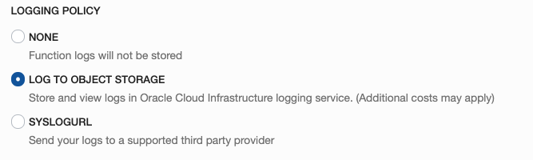
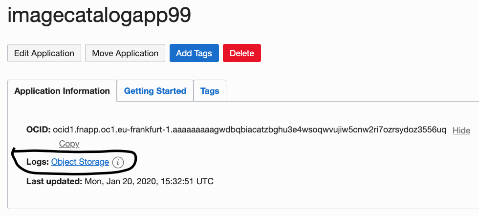
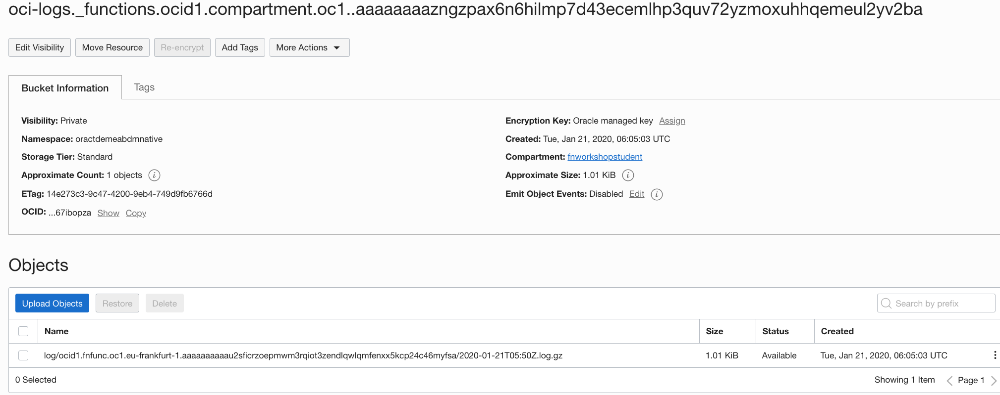
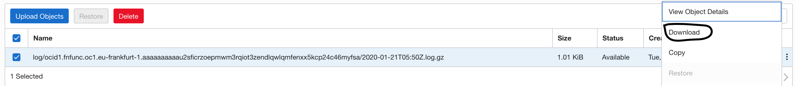

# Appendix C: How do you examine Function logging in Object Storage?

As part of this lab, we utilise one option for the logging capability of OCI based functions. 

You will configure the function application that gets created to store logs in Oracle Cloud Infrastructure Object Storage.

This appendix is available to give some very brief notes on how to access and use the log files generated as your function is invoked, should you encounter problems.

### Setup

During the lab you will have created a new function application and as part of this you will have selected to 'LOG TO OBJECT STORAGE'.

Selecting to use Object Storage will allow a new bucket to be created within the same compartment as your function application. 
This bucket can take up to 15 minutes to appear after you have invoked a function that you have deployed to it. Once the bucket
has been created, a link will appear on the application screen (sse the screenshot below) giving you a simple way to access it.
In order to have the bucket get created and be accessible you need to ensure you have the right policy granted.

For more information on enabling logging go [here](https://docs.cloud.oracle.com/iaas/Content/Functions/Tasks/functionsexportingfunctionlogfiles.htm) 
 
### Accessing the log bucket from the console

Once you have deployed a function and attempted to invoke it, the new logging bucket will get created. This can take up to 15 minutes to happen but when it is available or to check if it is, refresh the browser screen on the function application page.

On clicking on the link shown above, you will be presented with the contents of the bucket.

If for any reason after 15 minutes from a function invocation the logging link does not appear, you can manually open a browser tab within Object Storage and select the same compartment as your function resides from the picker.
Search the list of buckets presented for one that has the same name as the ocid for your function hosting compartment.

Each object uploaded to this bucket will contain a snip of the logs and is named to include the ocid of the function that created it. As there are multiple students using the same compartment, you will need to be sure to grab log files only associated with your function ocid.

### Viewing the log files

To view the contents of a specific log bundle that is available you will need to download it from object storage and then extract the contents.

The log files available include the ocid of the generating function in their name to help find appropriate log bundles if needed.

Below is a snip of one such log file extract. You can use this information to further investigate issues should they occur.

>{"ts":1579585907842,"aid":"ocid1.fnapp.oc1.eu-frankfurt-1.aaaaaaaaagwdbqbiacatzbghu3e4wsoqwvujiw5cnw2ri7ozrsydoz3556uq","cid":"01DZ3AG0RE1806JBRZJ00006XJ","fid":"ocid1.fnfunc.oc1.eu-frankfurt-1.aaaaaaaaaau2sficrzoepmwm3rqiot3zendlqwlqmfenxx5kcp24c46myfsa","rid":"01DZ3AFNV71BT0G48ZJ0008B9M","src":"STDERR","msg":"requestBody={"}
 {"ts":1579585907842,"aid":"ocid1.fnapp.oc1.eu-frankfurt-1.aaaaaaaaagwdbqbiacatzbghu3e4wsoqwvujiw5cnw2ri7ozrsydoz3556uq","cid":"01DZ3AG0RE1806JBRZJ00006XJ","fid":"ocid1.fnfunc.oc1.eu-frankfurt-1.aaaaaaaaaau2sficrzoepmwm3rqiot3zendlqwlqmfenxx5kcp24c46myfsa","rid":"01DZ3AFNV71BT0G48ZJ0008B9M","src":"STDERR","msg":"  \"bucketname\" : \"fnuser99\","}
 {"ts":1579585907842,"aid":"ocid1.fnapp.oc1.eu-frankfurt-1.aaaaaaaaagwdbqbiacatzbghu3e4wsoqwvujiw5cnw2ri7ozrsydoz3556uq","cid":"01DZ3AG0RE1806JBRZJ00006XJ","fid":"ocid1.fnfunc.oc1.eu-frankfurt-1.aaaaaaaaaau2sficrzoepmwm3rqiot3zendlqwlqmfenxx5kcp24c46myfsa","rid":"01DZ3AFNV71BT0G48ZJ0008B9M","src":"STDERR","msg":"  \"name\" : \"trooper.jpg\","}
 {"ts":1579585907842,"aid":"ocid1.fnapp.oc1.eu-frankfurt-1.aaaaaaaaagwdbqbiacatzbghu3e4wsoqwvujiw5cnw2ri7ozrsydoz3556uq","cid":"01DZ3AG0RE1806JBRZJ00006XJ","fid":"ocid1.fnfunc.oc1.eu-frankfurt-1.aaaaaaaaaau2sficrzoepmwm3rqiot3zendlqwlqmfenxx5kcp24c46myfsa","rid":"01DZ3AFNV71BT0G48ZJ0008B9M","src":"STDERR","msg":"  \"uploaded\" : \"2020-01-21T05:51:47.641Z\","}
 {"ts":1579585907842,"aid":"ocid1.fnapp.oc1.eu-frankfurt-1.aaaaaaaaagwdbqbiacatzbghu3e4wsoqwvujiw5cnw2ri7ozrsydoz3556uq","cid":"01DZ3AG0RE1806JBRZJ00006XJ","fid":"ocid1.fnfunc.oc1.eu-frankfurt-1.aaaaaaaaaau2sficrzoepmwm3rqiot3zendlqwlqmfenxx5kcp24c46myfsa","rid":"01DZ3AFNV71BT0G48ZJ0008B9M","src":"STDERR","msg":"  \"compartmentname\" : \"fnworkshopstudent\","}
 {"ts":1579585907842,"aid":"ocid1.fnapp.oc1.eu-frankfurt-1.aaaaaaaaagwdbqbiacatzbghu3e4wsoqwvujiw5cnw2ri7ozrsydoz3556uq","cid":"01DZ3AG0RE1806JBRZJ00006XJ","fid":"ocid1.fnfunc.oc1.eu-frankfurt-1.aaaaaaaaaau2sficrzoepmwm3rqiot3zendlqwlqmfenxx5kcp24c46myfsa","rid":"01DZ3AFNV71BT0G48ZJ0008B9M","src":"STDERR","msg":"  \"url\" : \"https://objectstorage.eu-frankfurt-1.oraclecloud.com/n/oractdemeabdmnative/b/fnuser99/o/trooper.jpg\""}
 {"ts":1579585907842,"aid":"ocid1.fnapp.oc1.eu-frankfurt-1.aaaaaaaaagwdbqbiacatzbghu3e4wsoqwvujiw5cnw2ri7ozrsydoz3556uq","cid":"01DZ3AG0RE1806JBRZJ00006XJ","fid":"ocid1.fnfunc.oc1.eu-frankfurt-1.aaaaaaaaaau2sficrzoepmwm3rqiot3zendlqwlqmfenxx5kcp24c46myfsa","rid":"01DZ3AFNV71BT0G48ZJ0008B9M","src":"STDERR","msg":"}"}

