# Fn Handson: Functions and Notifications

This workshop is optional and can only be attempted if you have completed successfully the [Fn Handson: Functions and Events](FnHandson.md) lab exercise.

## Objective

During this hands on lab we will revisit the integration of Oracle Events and Functions we set up in the initial lab when a function was triggered by the event of a new file arriving in the OCI object storage bucket.  We will introduce a new OCI service, the Oracle Notification Service (ONS). This service will be used to decouple the event producer from the consumer and will also provide a retry mechanism and the ability to fan out consumption from the same initial event. 

First a new ONS topic will be created. Then a new subscriber will be added to the topic to allow it to trigger the existing catalog function. The existing event rule will then be altered to send the cloud event to the ONS topic. Once this is complete and tested an email subscription will be added to the topic to send emails on each event. This will demonstrate how fan out can be added.

### Duration: 20 minutes

### Requirements

The Functions and Events lab needs to be complete. In that lab, the image catalog function was deployed and invoked by uploading a new image to the object storage bucket. As a result a new record was  added to the catalog database. If that is what you have set up please proceed.  

A email account is required for receipt of email notifications. 

## Create a new ONS Topic

If not already, log in to the OCI console at [https://console.eu-frankfurt-1.oraclecloud.com](https://console.eu-frankfurt-1.oraclecloud.com/) using the student username (e.g. fnuserNN) and password you set. Ensure you are still logging in to the tenancy given in your student guide. 

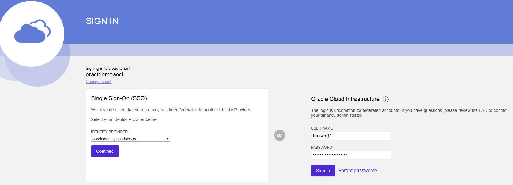

Using the "hamburger" menu in the top left hand corner locate the Notification Service. It's located in the "Application Integration" group alongside the Events Service you've used already. 

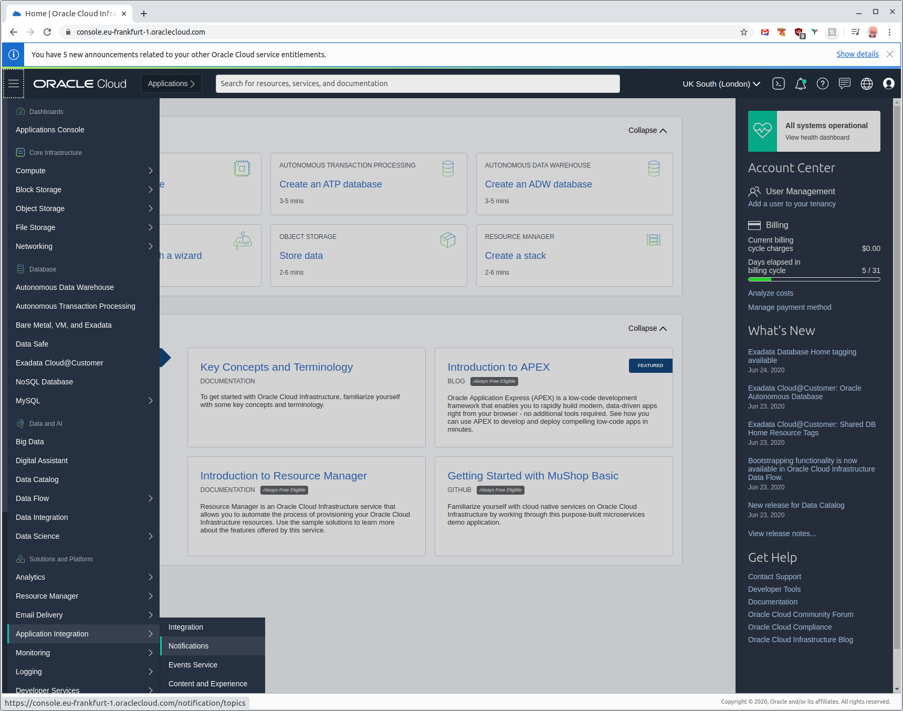

On the notification service homepage ensure you are in the **fnworkshopstudent** compartment by selecting it in the compartment picker on the left of the screen:

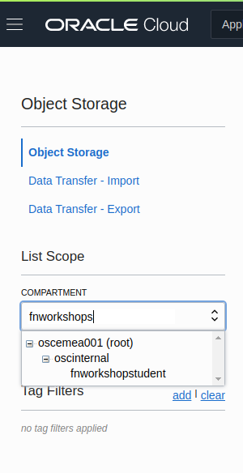

Start the process of creating a new notification topic by pressing the blue **Create Topic** button. Complete the creation form as follows: 

NOTE the Topic name is NewImageTopicNN where NN is your student number. 

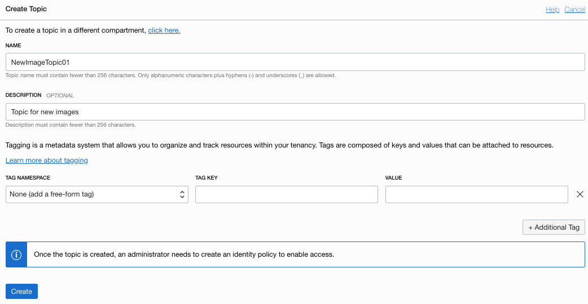

Then press **Create**, the topic will be created quickly and displayed in the table. 

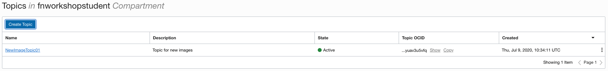

## Create ONS Subscriptions

The next step is to create two subscriptions to the topic which will listen for new image event messages. Switch to the notification view using the **Subscriptions** menu entry on the left. Press the **Create Subscription** button to create first which will trigger the existing image catalog function. 

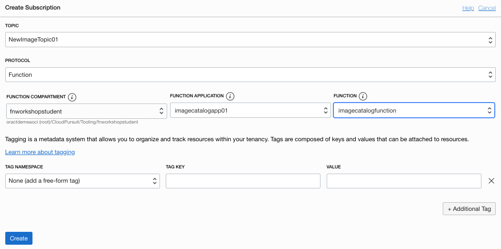

Ensure the **NewImageTopicNN** is selected in the topic field (where NN reflects your student id). Change the protocol used to **Function**. Make sure the **fnworkshopstudent** compartment is selected along with your function application as identified by your student number e.g. **imagecatalogapp01** and finally select the **imagecatalogfunction** in the function field. Your screen should look similar to the image above. Click create and the subscription details will be shown. 

NOTE that the subscription has the default delivery policy of retrying for 120 minutes. 

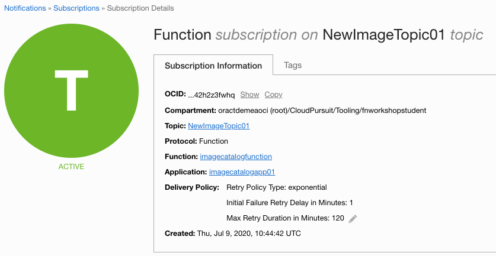

Navigate back to the subscriptions homepage to create the second subscription. This will be an email subscription the the same topic that shows how the fan out pattern can be implemented. Click **Create Subscription** again. 

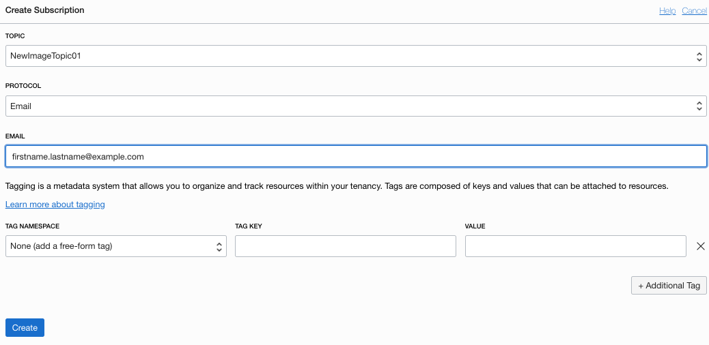

Ensure the **NewImageTopicNN** is selected in the topic field (where NN reflects your student id). Change the protocol used to **Email**. Enter a valid email, the notification service will send a confirmation email so ensure you have access to this inbox! Press **Create**. The subscription details will show that it is pending confirmation. 

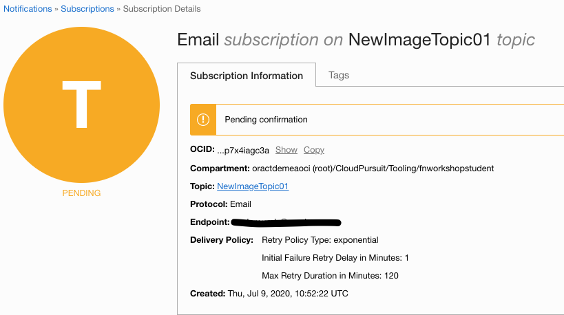

An email should appear in your inbox similar to this:

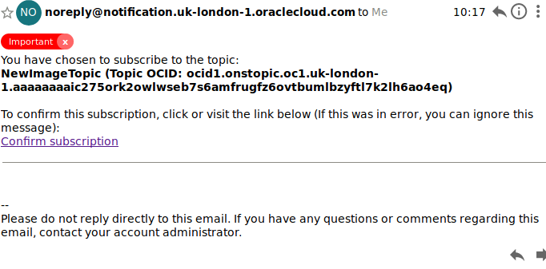

Click the "**Confirm Subscription**" link and you will be taken to a confirmation page that shows you are now subscribed to the NewImageTopic. 

## Alter Oracle Events to Publish to Topic

Now that there are two subscribers to the NewImageTopicNN it's time to set up new events to be published on to the topic. Navigate to the Oracle Events Service using the hamburger menu. 

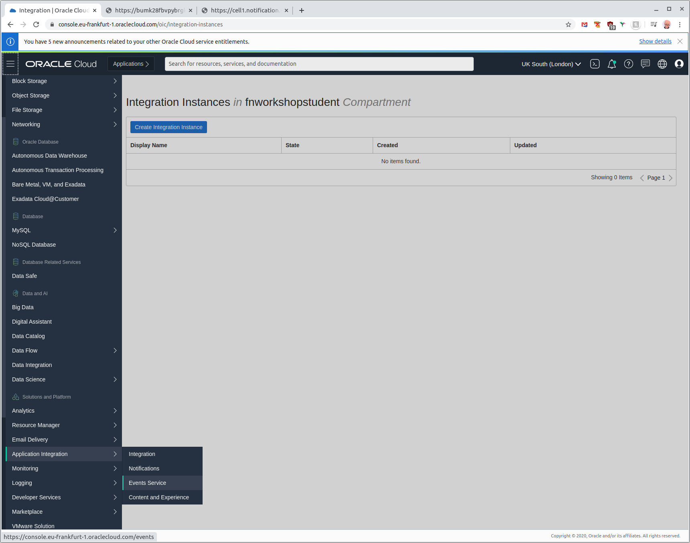


From the events service homepage navigate to the rule you created earlier, it will be named after your student number e.g. fnuserNNrule. From the rule details page navigate to the **Actions** page using the Resource menu on the left. There should be one action listed as shown below. 

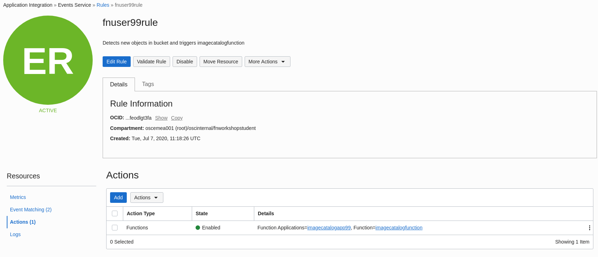


We will disable this action and add a new one that publishes a message to the topic in response to a new image being uploaded to the bucket. Click the three vertical dots on the right of the Actions table and select **Disable**.

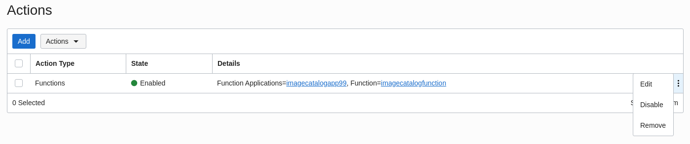

On the confirmation page that appears click the blue **Disable** button. 

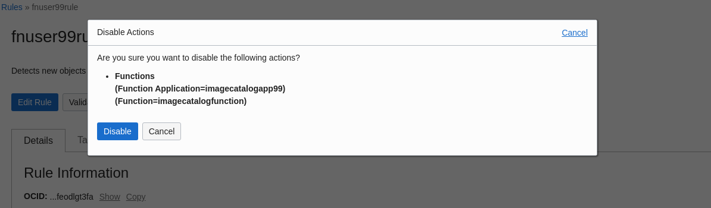

In the Actions section, click the blue Add button to set a new action for the rule. 

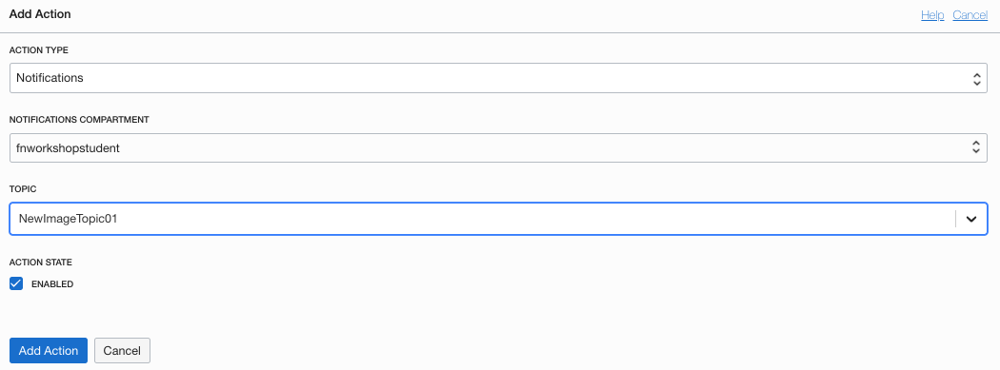

In the window that appears fill in the details for the new action. 

- Set the Action Type to Notifications
- Select the **fnworkshopstudent** compartment. Hint: You can begin typing fnworkshopstudent and the list will be filtered accordingly. 
- Set the Topic as **NewImageTopicNN** (where NN represents your student id and therefore your topic)
- Leave Action State enabled

Click **Add Action** and the new action will appear in the list. 

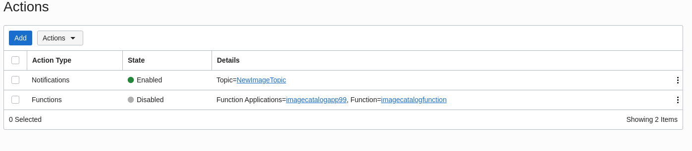

The notification topic has been inserted between the event producer and event consumers, it's now time to test! 

## Test

As in the earlier hands on exercise the event is still triggered by an image being uploaded to your object storage bucket. Using the hamburger menu navigate to the object storage service. 

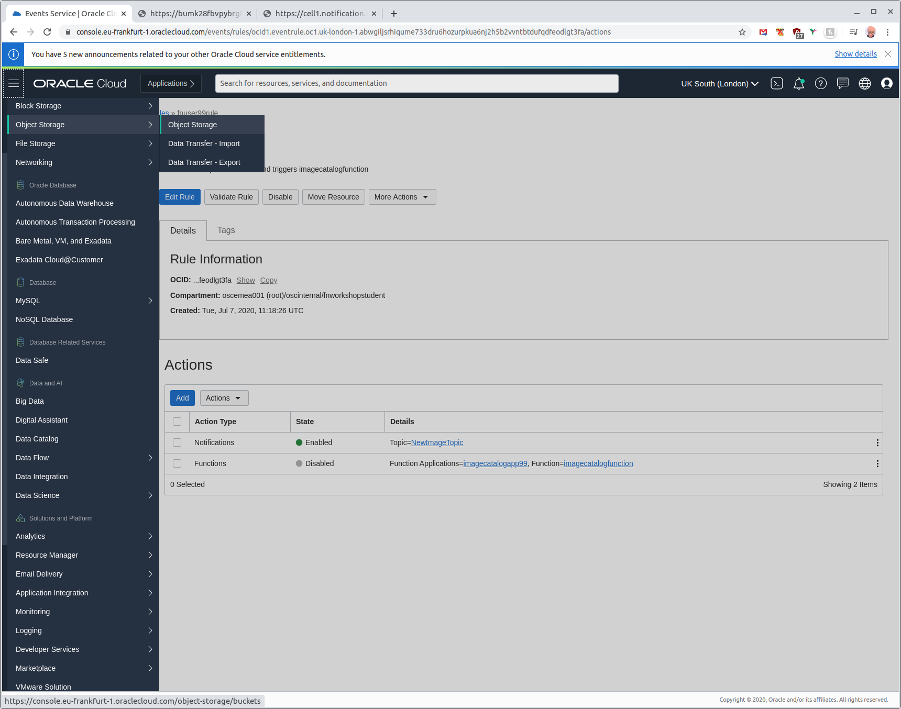

Locate your bucket which will be named after your student number, e.g. fnuserNN, and click on it. 

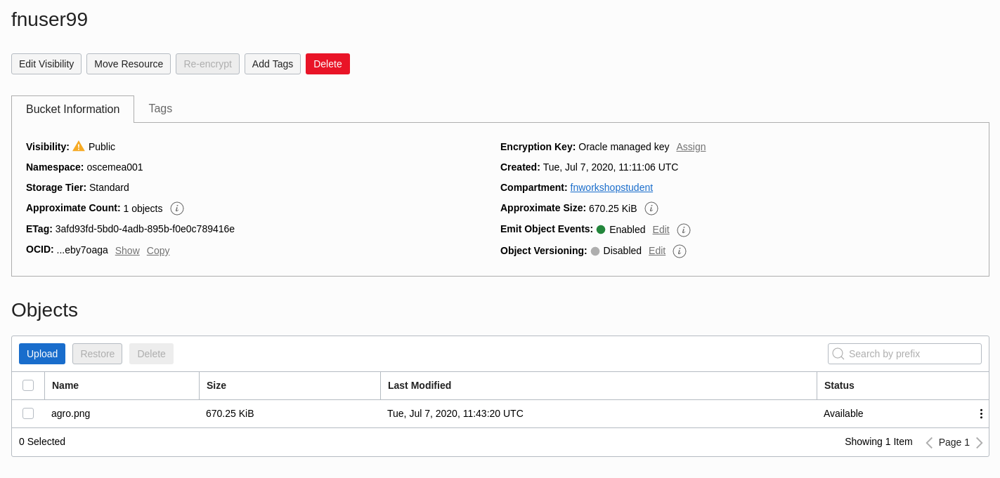

Upload a new image to the bucket. This will trigger the event and eventually fire the function as well as sending an email to your registered email address. 

In the events service the metrics should show an event has now been delivered to ONS rather than FAAS as below:

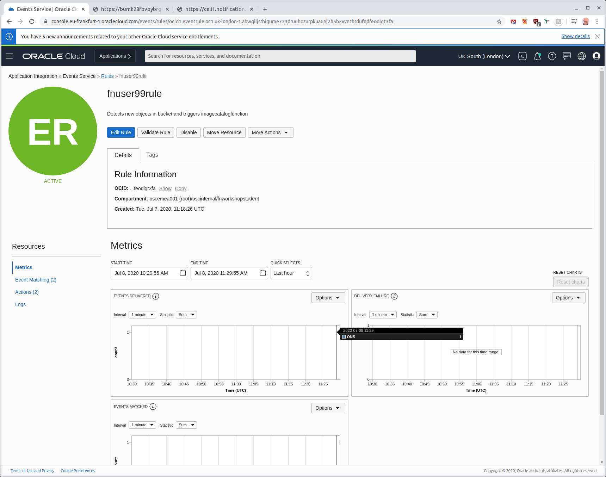

Check the catalog database for the new record that will have been added by the function. You can do this with the imagequeryfunction you deployed or via a curl command to the database ORDS API. To do the latter issue the following curl command as you did earlier to query all the rows in the CATALOG table <i>**replacing fnuser99 with the name of your bucket**</i>:

```
$ curl -X GET -G $ATP_ORDS_URL --data-urlencode 'q={"bucketname":"fnuser99"}' | jq .
```

Check your email inbox, you should see an email with the subject Oracle Event Notification alerting you to the new image upload.

## Congratulations

Congratulations you've completed the lab and have added ONS to your OCI deployment.