# Fn Handson: Functions and Events

## Objective

The objective for this hands on lab is to introduce you to how Functions can be invoked by events occurring within Oracle Cloud Infrastructure. The OCI events service detects a change of state in resources running in your tenancy, the resulting event can be consumed by a variety of end points including Oracle Functions. Using this capability, automation can be created that asynchronously calls Oracle Functions. As a way of demonstrating this, you will generate an event by uploading an image to an OCI object storage bucket. You will then configure an event rule that delivers that event to a new function. This function will parse the details of the event and insert them into a catalogue in an Autonomous Transaction Processing database also running serverless in OCI. 

More details of the Oracle Events Service can be found here: https://docs.cloud.oracle.com/iaas/Content/Events/Concepts/eventsoverview.htm

### Duration: 40 minutes

### Requirements

This hands on lab, although standalone would benefit from a basic understanding of the Fn project and OCI Functions support. If you do not feel you have this sufficiently then it would be worthwhile asking the trainers about arranging a further session on these aspects for you or your team. Experience of using ssh clients would be beneficial but not essential. A picture image on your laptop that can be uploaded to object storage to trigger the function.

###  Download lab artefacts file by clicking on the link in the student handout that you will have been sent prior to the course.

### SSH to your lab VM

We have created you an Oracle Linux 7 based virtual machine within the Oracle Cloud to host this lab. The machine has been installed with Docker and some other prerequisites for installing and running Fn. You will continue this now ...

Use the SSH client of your choice to SSH to your lab virtual machine which will be assigned at the start of the workshop. SSH as the **opc** user and use the id_rsa private key. For example on Mac or Linux use the following command:

```
$ ssh -i /path/to/id_rsa opc@your.vm.ip.address
```

If you are using a windows based laptop, you will need to utilise an ssh client such as Putty or Mobaxterm. If you use Putty then you will need to utilise the .ppk version of the private key also included in the artifacts.zip downloaded earlier.

**NOTE**: Some client setups have experienced ssh session timeouts with Putty and if you get this, please enable connection keepalive.

Please refer to [Appendix A](./Appendix A.md) for some assistance with using Putty if you are unfamiliar with it.

Please refer to [Appendix B](./Appendix B.md) if you would prefer to use the Chrome secure shell extension

### Download & Install the Fn project CLI

Run the following command to install the Fn project CLI on your VM

```
curl -LSs https://raw.githubusercontent.com/fnproject/cli/master/install | sh
```

Once installed you’ll see the Fn CLI version printed out.

You should see something similar to the following displayed (although likely with a later version number):

```txt
fn version 0.5.87
        ______
       / ____/___
      / /_  / __ \
     / __/ / / / /
    /_/   /_/ /_/`
```

### Log in to OCI Console

A new functions application will be used to host the actual function. This can be created via the Fn CLI or via the OCI Functions console, we will use the latter. Log in to the OCI console at [https://console.eu-frankfurt-1.oraclecloud.com](https://console.eu-frankfurt-1.oraclecloud.com/). 

Enter the tenancy name provided in the lab details and then log in with your assigned username and password. 

**If you do not have these details please let the organisers know.**


You will need to reset the password on first login so go ahead and do that. The password and user will be removed at the end of the workshop so to keep things simple go ahead and create your own password or use Welcome#### if you cant think of anything.


Once logged in, in the top right hand corner click the user avatar  and then in the menu that is displayed, select your username which will appear under the heading titled 'Profile'.


Click on your username to navigate to the user detail page.

### Add a public key to your user in the oci console

*As part of the setup for this lab, we have provisioned everyone with a user of Oracle's Cloud Infrastructure (OCI) which you should have the details of. We have also performed some of the configuration steps to get Fn working with Oracle Functions. You will now complete these steps ...*

In order for the Fn CLI to make API calls to OCI it's necessary to set up an API signing key in the OCI console.

Under resources on the left hand side click "API Keys" and then press the  button.

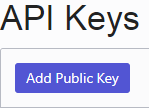

In the dialog box enter the following public key including **all** the hyphens:

-----BEGIN PUBLIC KEY-----
MIIBIjANBgkqhkiG9w0BAQEFAAOCAQ8AMIIBCgKCAQEA7BI3LMlsyeYEvNhknlHY
ABenGj9FatlXsNoRVJcLZvJweg42ON2+N6WtwhujA6qhUEgypR4gx69b/YXiP0Zd
EoZm13Qa0+t931Ww64NX1lFs48JRr8jlyU+oWE7hJBQFbI2TldeLWupbILIA0eL3
pJJFRJ4AizRedOs1G3ISomYCNA/KEO5Mm1/SSJAh8V73D2xNMO4cH2BC5U5MNyRY
uCAmsD4RdpCTBP/AuAyiVyfm7T6dSbf35kUfX/m1u4+ec2DhA7HtXdEr8sXqA1fw
yoTTRlQS9WnIFqQbsvEiwKvMMwzJFmha6axXZhk7joINAg75cEUlD8ZP81Fsq0bX
/wIDAQAB
-----END PUBLIC KEY-----

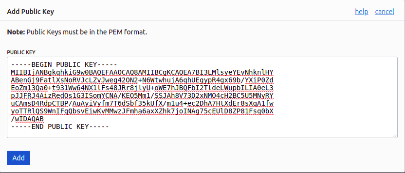

Press 'Add' and the key will appear in the list.

**NOTE**: If you find that the key is not recognised or deemed invalid, this may be due to copy and paste errors from .pdf. 

As an alternative approach the key file is on the virtual machine you are using.

You can:

```
cat /home/opc/.oci/oci_api_key_public.pem
```

Copy the contents and paste this in instead.

Check that once added the fingerprint of the private key is b1:0c:8c:39:c8:eb:25:79:ad:14:46:f1:53:01:dc:0e

The public key and it's matching private key are also located on your lab virtual machine at /home/opc/.oci.

### Create a new Auth Token for your user

As part of the later steps to configure Fn to use OCI, we will need to have the local Docker setup running in your virtual machine be able to authenticate to a remote OCI hosted Docker registry. In order to allow this we need to generate an auth key that can be used. We will generate this now and keep the key safe in a local text file on your laptop until we need it in a later step. **Make sure you have a local text file open for this ahead of time** as the token is only shown once and then not retrievable again.

On the User Details screen locate on the left hand side the 'Auth Tokens' link and press it.

In the centre of the screen you will see a button labelled 'Generate Token'

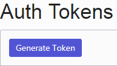

Press the 'Generate Token' button.

A dialogue box will appear where you need to give a description for the token you are about to generate.

Enter the following text

'Token for Fn lab work'

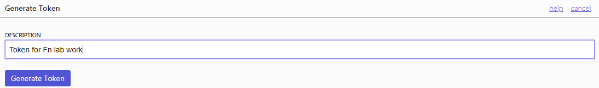

Hit the 'Generate Token' button.

The new token will be displayed and you will need to copy the full token and **make sure you paste it to a local text** file on your laptop for safekeeping.

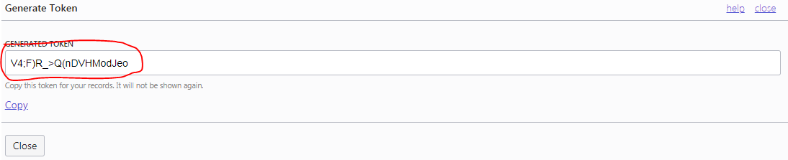

Close the token generation window once you have the token safely copied to a local text file.

### Obtain the user Oracle Cloud ID (OCID)

The user's OCID is also required as part of the set up and this can also be obtained from the OCI console you are logged into.

On the User Details screen locate the 'User Information' tab


There is a field that lists the OCID. Click the 'Copy' link to copy the OCID and paste it to a temporary text file on your laptop. 

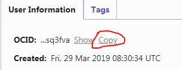

In the SSH session to your lab VM you opened at the start of this lab open the /home/opc/.oci/config file in a suitable text editor such as vi or nano. Locate the line 

```
user=user-ocid
```

and replace "user-ocid" with your OCI user's OCID obtained above. Save the file.

Your config file should look similar to this but with your user OCID:

```
[fnworkshop_profile]
user=ocid1.user.oc1..aaaaaaaa2oiew3puzz6rbplm6uu24bi6wqxulzdc7tg6qqbqs37nvcsq3fva
fingerprint=b1:0c:8c:39:c8:eb:25:79:ad:14:46:f1:53:01:dc:0e
key_file=/home/opc/.oci/oci_api_key.pem
tenancy=ocid1.tenancy.oc1..aaaaaaaafipe4lmow7rfrn5f3egpg3xgur6v2q2wgvb3id4ehwujnpu5mb5q
region=eu-frankfurt-1
```

Save the file and exit when you have made the change (in vi use *ESC* then *wq* then *RETURN*)

For those unfamiliar editing under Linux and using vi please reach out to to one of the trainers. 

### Create a new Fn context for OCI

Fn installs with a default context but now we need to create a second to allow the Fn CLI to interact with the Oracle Functions service.

On your lab virtual machine SSH session issue the following commands:


```
$ fn create context oci --provider oracle $ fn use ctx oci $ fn ls ctx
```

The output should have an asterix against the new Fn context.

We now need to add the specific compartment within OCI to where we will create new Oracle Functions applications. We do this by providing the compartment OCID. For this lab it will be the same compartment for every student. The following Fn command needs to be executed in order to set this up.

```
$ fn update context oracle.compartment-id ocid1.compartment.oc1..aaaaaaaabmmw7jy34fi5cmscp2ui4kvl6vy2lnebwhdki737nxrlp5wnlbrq
```

We now need to provide the api-url to the new context in order for Fn to communicate with Oracle Functions.

Issue the following command to do this.

```
$ fn update context api-url https://functions.eu-frankfurt-1.oraclecloud.com
```

We need to configure the appropriate Oracle Cloud registry to be utilised for the applications and functions that will be deployed.

Issue the following command to do this, **replacing** the 99 with **your** student number (01 to 10).

```
$ fn update context registry fra.ocir.io/oractdemeaoci/fnworkshop99
```

Finally we need to allow the Fn context for oci to utilise the oci configuration you edited earlier. To do this issue the following command:

```
$ fn update context oracle.profile fnworkshop_profile
```

With the configuration of the Fn context complete you can examine this in the .yaml file for the context.

Issue this command:

```
$ more ~/.fn/contexts/oci.yaml
```

The output should look similar to the following:

```
api-url: https://functions.eu-frankfurt-1.oraclecloud.com
oracle.compartment-id: ocid1.compartment.oc1..aaaaaaaabmmw7jy34fi5cmscp2ui4kvl6vy2lnebwhdki737nxrlp5wnlbrq
provider: oracle
registry: fra.ocir.io/oractdemeaoci/fnworkshop02
```

If we now list the contexts that have been created for using Fn you should see 2. The default, local context and a new one called oci that should have an asterix against it to indicate that it is the current context being used.

```
$ fn list contexts
```

### Test our new Fn context for OCI

We can now issue a simple list apps command from the Fn CLI to see if it is is configured properly. This will list all the currently created applications in the compartment within OCI that was configured for you to use. You are sharing this compartment with all the delegates and so it might show one or more applications depending on how far the others have got. The application names should be appended with a number indicating the delegate that created it.

Issue the following command:

```
 $ fn list apps
```

If you get errors please let the organisers of the workshop know.

### Configure Docker to use the Oracle Cloud Image Registry configured in the new context

Before we can use Fn to deploy functions to Oracle Functions, we need to ensure Docker running locally on the VM we are using can access the OCI image registry (OCIR) configured in the new context just created. To do this we need to have Docker login and thus store the credentials locally.

Perform the following command:

```
$ docker login fra.ocir.io/oractdemeaoci
```

When prompted enter your tenancy-name/username assigned at the beginning of this lab. They will take this form:

```
tenancy-name/username
eg: oractdemeaoci/fnuserNN
```

Replace NN with your student number

When prompted for your password paste in the 'Auth token' that you [generated earlier](https://confluence.oraclecorp.com/confluence/display/OSCEMEA/Fn+Handson+Part+1#FnHandsonPart1-AuthToken) and saved to a local text file.

Here is an example of what you should see when successfully logged in to the remote OCI registry:

```
Username:
oractdemeaoci/fnuser99
Password:
Login Succeeded
```

### Create new Functions Application

In the OCI Console change the region to the Frankfurt region in the grey bar across the top of the console. Select the region drop down and pick "Germany Central (Frankfurt)".


In the browser session where you logged into the OCI Console look for the  menu in the top left hand of the screen and press it.


From the list presented hover your mouse over 'Developer Services and more options appear.

Press your mouse on 'Functions'

Before we can use Functions we need to select a compartment to utilise and you will be presented with a screen similar to this:


From the 'Pick a Compartment' expand the root by pressing on the '+' to the side of its name:

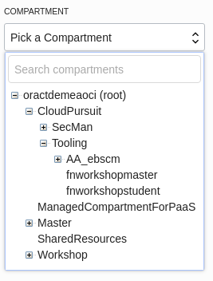

Search the list for 'CloudPursuit' and expand that.

From the sub compartment list **select** 'Tooling', expand that and then select 'fnworkshopstudent'

You will now be presented with the Functions User Interface where we will create a new application. As you are sharing this compartment with other delegates you may well already see applications listed.

Create a new application by pressing on the button 

The 'New Application' window will appear and you need to give a name and the VCN and subnet you will use to access it over.

Give the name as imagecatalogapp*NN where the NN* is replaced with your delegate number (Given at the start of the hands on lab). eg imagecatalogapp01

The **VCN** and subnet to be used are within a different compartment to the one you are creating the application in and so in the VCN field press on the 'Change Compartment' link.

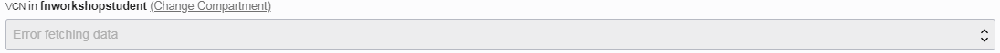

From the list presented look for 'fnworkshopmaster' and select it.

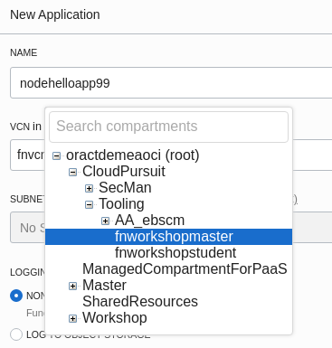

When selected you can choose the VCN fnvcn

Do the same to change compartment for the subnet to be 'fnworkshopmaster'

The **subnet** Fn Public Subnet (Regional) can then be selected.

The screen will look similar to the example below with a different application name depending on your delegate id.

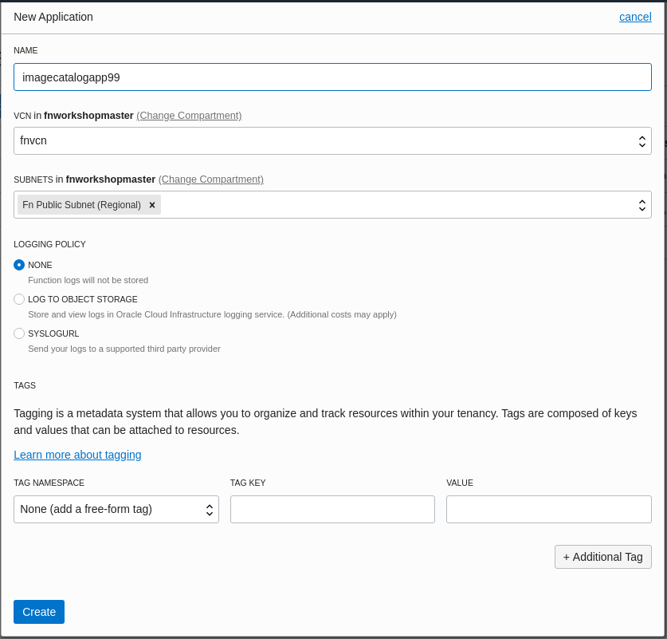

Hit 'Create' when done. Confirm your new application is listed in the compartment.

If you now back in the lab vm shell session test that you can see this new application.

Issue the following command:

```
 $ fn list apps
```

**Create a new function**

The new function will be written in Java, one of the many languages supported by the Fn SDK. from your your lab VM ssh session create a work directory and change into it by issuing these commands:

```
$ mkdir ~/fnwork $ cd ~/fnwork
```

Initialise a new function called "imagecatalogfunction". 

```
$ fn init --runtime java imagecatalogfunction
```

This will create the boilerplate code and configuration for our new function. The func.yaml will have a description of the function. A pom.xml file will also be created. Maven is used to build the Java function and the POM file lists the required libraries and build steps. The src directory contains two code trees, one for the actual function code and one for a test suite. The folder structure should look like this:

```asc
[opc@labvm99 ~]$ tree --charset=ascii imagecatalogfunction/
imagecatalogfunction/
|-- func.yaml
|-- pom.xml
`-- src
    |-- main
    |   `-- java
    |       `-- com
    |           `-- example
    |               `-- fn
    |                   `-- HelloFunction.java
    `-- test
        `-- java
            `-- com
                `-- example
                    `-- fn
                        `-- HelloFunctionTest.java
```

Change directory into the imagecatalogfunction directory:

```
$ cd imagecatalogfunction
```


**Update POM file**

This function will require two extra Java libraries so these will have to be added to the pom.xml file to allow Maven to download them and use in the build process.

- cloudevents-api - Defines the open source cloud events API. In this function the input to the function will be a CloudEvent object that encapsulates all the details of the event.
- jackson-databind - Allows Java objects to be marshalled and unmarshalled to the JSON format used by REST APIs.

Open the pom.xml in your favourite text editor. Paste the the following two dependencies into the file after the opening ***dependencies*** tag:

```xml
 <!-- Added for cloud events api -->
<dependency>
   <groupId>io.cloudevents</groupId>
   <artifactId>cloudevents-api</artifactId>
   <version>0.2.1</version>
</dependency>
<!-- Added for JSON serialization -->
<dependency>
   <groupId>com.fasterxml.jackson.core</groupId>
   <artifactId>jackson-databind</artifactId>
   <version>2.9.9</version>
   <scope>compile</scope>
</dependency> 
```

Close and save the file. 

### Increase Function Memory

This function will require more than the minimum 128MB of memory allocated by default. Memory allocation can be specified in the OCI console or in the func.yaml file as we will do. Open the func.yaml file in your preferred text editor and paste the following on to the last line:

memory: 512

 The file should look like:

```yaml
schema_version: 20180708
name: imagecatalogfunction
version: 0.0.64
runtime: java
build_image: fnproject/fn-java-fdk-build:jdk11-1.0.102
run_image: fnproject/fn-java-fdk:jre11-1.0.102
cmd: com.example.fn.HelloFunction::handleRequest
memory: 512
```

Save and close func.yaml

### Test the database REST API

The function will interact with an Autonomous Transaction Processing database running in the same tenancy. The function will insert rows into the database via the ORDS REST API. Test that the API is accessible from your lab VM with the following command:

```
curl https://vx7tqpyaop2tflx-fnworkshopdb.adb.eu-frankfurt-1.oraclecloudapps.com/ords/fnworkshop/catalog/ | jq . 
```

This should pretty print a JSON payload with all the rows currently in the CATALOG table in the database. 

As an alternate way of viewing the JSON payload you can always use the online JSON editor [https://jsoneditoronline.org/](https://jsoneditoronline.org/#/)

Open the editor in a new browser tab and hit the  button.

Copy the complete JSON payload returned from the command above and paste into the left hand pane deleting the '{}' already there.

Hit the button in the middle of the panes to see the JSON formatted properly in the right hand pane.

In the right hand pane expand items to see the current number of items in the database table.

**Set Function Application Configuration Variables**

The REST end point will be configured as a configuration variable in the Function application. This is done with the Fn CLI (**substitute your student number for NN**):

```
fn config app imagecatalogappNN ordsBaseURL https://vx7tqpyaop2tflx-fnworkshopdb.adb.eu-frankfurt-1.oraclecloudapps.com/ords/fnworkshop/catalog/ 
```

We will also add another configuration variable. Issue the following command **again replacing NN with your student number**:

```
fn config app imagecatalogappNN imageUrl https://objectstorage.eu-frankfurt-1.oraclecloud.com/n/ 
```

These configuration variables will be read as environment variables within the function and can be read in whatever code the function is implemented in. It's also possible to set configurations at the individual function level. 

### Update the Java code 

We require our function to accept the event payload, parse it's content and insert a record into the catalog table in the ATP database using the ORDS REST API. Some sample code has been written to do this for you. Examine the file at /home/opc/HelloFunction.java. 

Copy this file to the source code tree of your new function. 


```
$ cp ~/HelloFunction.java ~/fnwork/imagecatalogfunction/src/main/java/com/example/fn/HelloFunction.java 
```

### Alter Tests

We don't have a mock service for the ATP ORDS REST API so we will comment out the test as we don't want test executions to add rows to our table. 

Open the test java file at ~/fnwork/imagecatalogfunction/src/test/java/com/example/fn/HelloFunctionTest.java and comment out the body (using //) of the shouldReturnGreeting method. It should now look like this:


```java
@Test public void shouldReturnGreeting() { 
    //testing.givenEvent().enqueue(); 
    //testing.thenRun(HelloFunction.class, "handleRequest"); 
    //FnResult result = testing.getOnlyResult(); 
    //assertEquals("Hello, world!", result.getBodyAsString()); 
}
```


Obviously this is not best TDD (Test Driven Development) practice! In a real world situation you would write your tests first and use them to ensure no bugs appear in your code. This shortcut will allow us to build and deploy our function without putting all the testing infrastructure in place. 

### Deploy 

Ensure you are in the imagecatalogfunction directory 

```
$ cd ~/fnwork/imagecatalogfunction 
```

Deploy the function to OCI. Issue the following command **again replacing NN with your student number**:

```
$ fn --verbose deploy --app imagecatalogappNN
```

You should see the familiar Docker and Maven build output and finally a message that the function has updated with a new image.

This deploy takes a little time to complete.

Visit the OCI Function page where you created your application to verify the function has been deployed to it. Be sure to check the application with you student id! 

### Verify Object Storage Bucket

Open the OCI console at [https://console.eu-frankfurt-1.oraclecloud.com](https://console.eu-frankfurt-1.oraclecloud.com/) and login as your student user i.e. fnuserNN where NN is your student number. Open the hamburger menu in the top left-hand corner and navigate to "Object Storage". 

Ensure that you are working in the Frankfurt OCI data centre in the top menu bar:


Ensure that you are in the fnworkshopstudent compartment in the compartment picker:

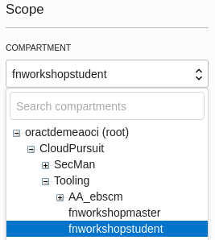

You should see a list of buckets , one for each user. Locate your bucket, it will be named after your user id. 

By clicking on the bucket name created for you, you should see there are no objects currently uploaded.

### Create Event Rule

In order to link events in OCI object storage to the new function it's necessary to create an event rule.

**It makes sense to open the events service in a new browser tab.**

In the OCI console open the hamburger menu in the top left-hand corner and navigate to "Application Integration" and then, right-click new browser tab, "Events Service". 

Click the blue "Create Rule" button and complete the details for your new rule. 

Display Name: fnuserNNrule (replace NN for your student number)

Description: Detects new objects in bucket and triggers imagecatalogfunction

In the Event Matching section leave the first drop down set the "Event Type". In the Service Name drop down select "Object Storage". In the Event Type drop down enter "Object - Create". The Rule Condition should look like:


Add another condition to specify exactly which bucket triggers this rule. Press the "+ Add Condition" button. Select "Attribute" as the condition type and then bucketName as the "Attribute Name". In "Attribute Values" enter the name of your bucket e.g. fnuser99. 

 

In the Actions section specify the Action Type as Functions. Select the fnworkshopstudent compartment, your function application (based on your student number) and your function itself. 


Press "Create Rule" to create your rule - this button is right at the bottom left of the screen and sometimes hard to spot.

### Trigger the function

Navigate back to the Object Storage page in the OCI Console, locate the bucket named after your user and click it to open the details. We will trigger the function by uploading an image to the bucket, this will trigger an event which our rule will channel to the new function.

In the console click the blue Upload Objects button, in the dialog box click "select files" and pick an image file from your laptop (it doesn't matter which).


Press the "Upload Objects" button to upload the object. The function will be triggered in a few seconds.

To check execution navigate to the Functions page in the console, select your application (imagecatalogappNN) and then the function (imagecatalogfunction).

In the metrics graphs you should see a point appear for the first function invocation. 

The backend ATP database can be checked by the REST API.

Issue the following curl command as you did earlier to query all the rows in the CATALOG table:

```
curl https://vx7tqpyaop2tflx-fnworkshopdb.adb.eu-frankfurt-1.oraclecloudapps.com/ords/fnworkshop/catalog/ | jq .
```

The response will be in JSON format and you should see an entry for the file you just uploaded e.g.


```
{
 "id": 11,
 "name": "photo 3.JPG",
 "url": "https://objectstorage.eu-frankfurt-1.oraclecloud.com/n/oractdemeaoci/b/fnuser99/o/photo 3.JPG",
 "uploaded": "2019-10-11T08:51:31Z",
 "bucketname": "fnuser99",
 "compartmentname": "fnworkshopstudent",
 "links": [
 {
 "rel": "self",
 "href": "https://vx7tqpyaop2tflx-fnworkshopdb.adb.eu-frankfurt-1.oraclecloudapps.com/ords/fnworkshop/catalog/11"
 }
 ]
 }
```

There will be other entries from other students but you should recognise the file you uploaded, the timestamp and your object store bucket. The url attribute should link to the file you uploaded, try it in a browser. 

Again you might find it easier to use the online JSON editor [https://jsoneditoronline.org/](https://jsoneditoronline.org/#/) to view the output and then search the items details to find the image you uploaded.

## Links to more information

### Oracle Functions

[Documentation home](https://docs.cloud.oracle.com/iaas/Content/Functions/Concepts/functionsoverview.htm)

[Configuring your client environment to use Oracle Functions](https://docs.cloud.oracle.com/iaas/Content/Functions/Tasks/functionsconfiguringclient.htm)

[Configuring you OCI tenancy to use Oracle Functions](https://docs.cloud.oracle.com/iaas/Content/Functions/Tasks/functionsconfiguringtenancies.htm)

### Oracle Events

[Oracle Events Service](https://docs.cloud.oracle.com/iaas/Content/Events/Concepts/eventsoverview.htm)

### Oracle REST Data Services

[Overview and links to more detail](https://www.oracle.com/rest)

 
