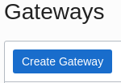
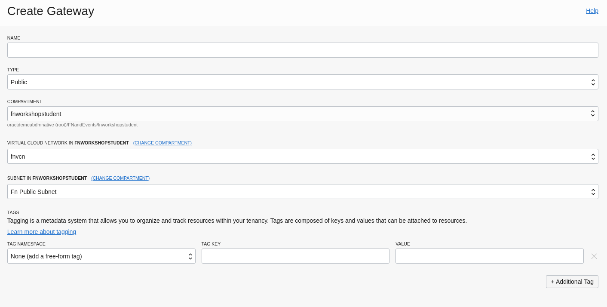

# Fn Handson: Functions and API Gateway

## Deploy Image Query Function

We'll deploy a new function that allows us to query the image catalogue. This function has already been created and is available to deploy in you VM. Locate the imagequeryfunction.zip file in the /home/opc directory and unzip it:

```bash
$ unzip imagequeryfunction.zip
```

Change directory into the newly created imagequeryfunction directory:

```bash
$ cd imagequeryfunction
```

This is a complete java based function that's ready to deploy. Feel free to examine the code. Note the the handleRequest method takes an HTTPGatewayContext object that encapsulates the entire HTTP request used to invoke the function. The Fn framework deals with marshalling everything required and passing the HTTPGatewayContext to the method. The function will read a query parameter from the URL and use this to query the ATP database via the ORDS API. 

Before deploying check you are using the OCI Fn context:

```bash
$ fn ls ctx
```

Ensure that the asterisk is by the context named oci. 

Deploy the function:

```bash
$ fn --verbose deploy --app imagecatalogapp01
```

The output should indicate that the function has been updated. Check in the OCI console that the new function has been deployed to the imagecatalogapp01 application. 


## Create API Gateway

Now that the function is in place we will create a new API gateway to expose the query functionality to the outside world. In the OCI console select the top right "hamburger" menu:


The scroll down the options to "Developer Services" then "API Gateway". To create a new gateway click the blue "Create Gateway" button. 



Complete the details of the new gateway in the form that's presented:

Name: apgatewayNN (where NN is your student number)

Type: Public

Compartment: fnworkshopstudent

Virtual Cloud Network: fnvcn

Subnet: Fn Public Subnet

The form should look like this:



Once completed press the blue "Create" button at the bottom of the page. The API gateway will be provisioned which can take ~3 minutes. 


The gateway will then transition to the active state:


We will now create a deployment in the API gateway that will allow us to route traffic to the new function.

Select "Deployments" in the Resources pane below the green active icon. In the next screen select the blue "Create Deployment" button. In the following wizard we will specify the details of our new deployment step by step, we can also upload a JSON that specifies the deployment's details. Complete page 1 with the following details: 

Name: fndeployment01

Path Prefix: /imagequery

Compartment: fnworkshopstudent


Leave the rest of the values at the default and press Next. 

On page 2 add a single route with the following values:

Path: /name/{query} this specifies a URL query parameter will be sent in calls to the function. 

Methods: GET

Type: Oracle Functions

Application: imagecatalogappNN (where NN is your student number)

Function Name: imagequeryfunction


Press "Next" and on the summary page select "Create" to create the deployment. The deployment will take a few moments to create. 

## Invoke the Function via the API gateway

To invoke the query via the gateway we need to obtain the gateway's public hostname. In the OCI console find the details page for the gateway **deployment** and locate the Endpoint field, select Show to see the public hostname and copy to copy it. The hostname format will be similar to the below:

```
https://j4eqxpligw8vmfybhresyi5lte.apigateway.eu-frankfurt-1.oci.customer-oci.com/imagequery
```

Paste the URL into a browser window on you laptop and you should see a message similar to this: 

```json
{
"message": "Not Found",
"code": 404
}
```

To actually invoke the function we need to append the route's path  (name) and the search query parameter to the URL. For example to search for files that have jpg in the name use the following URL:

```
https://j4eqxpligw8vmfybhresyi5lte.apigateway.eu-frankfurt-1.oci.customer-oci.com/imagequery/name/jpg
```

You should see the response similar to this:

```json
{
"items": [
{
"bucketname": "fnuser99",
"name": "trooper.jpg",
"uploaded": "2020-01-22T14:04:29Z",
"compartmentname": "fnworkshopstudent",
"id": 1,
"url": "https://objectstorage.eu-frankfurt-1.oraclecloud.com/n/oractdemeabdmnative/b/fnuser99/o/trooper.jpg"
}
]
}
```

