# Fn Handson: Functions and Events

## Objective

The objective for this hands on lab is to introduce you to how Functions can be invoked by events occurring within Oracle Cloud Infrastructure. The OCI events service detects a change of state in resources running in your tenancy, the resulting event can be consumed by a variety of end points including Oracle Functions. Using this capability, automation can be created that asynchronously calls Oracle Functions. As a way of demonstrating this, you will generate an event by uploading an image to an OCI object storage bucket. You will then configure an event rule that delivers that event to a new function. This function will parse the details of the event and insert them into a catalogue in an Autonomous Transaction Processing database also running serverless in OCI.

More details of the Oracle Events Service can be found here: https://docs.cloud.oracle.com/iaas/Content/Events/Concepts/eventsoverview.htm

### Duration: 40 minutes

### Requirements

This hands on lab, although standalone would benefit from a basic understanding of the Fn project and OCI Functions support. If you do not feel you have this sufficiently then it would be worthwhile asking the trainers about arranging a further session on these aspects for you or your team. 
Experience of using ssh clients would be beneficial but not essential. 
A picture image on your laptop that can be uploaded to object storage to trigger the function will be needed.

### Download the lab artifacts file by clicking on the link in the student handout that you will have been sent prior to the course.
Once downloaded to a temporary file on your laptop, extract the contents as these will be needed in the lab.

### SSH to your lab VM

We have created for you an Oracle Linux 7 based virtual machine within the Oracle Cloud to host this lab. The machine has been installed with Docker and some other prerequisites for installing and running Fn. You will continue this now ...

Use the SSH client of your choice to SSH to your lab virtual machine which will have been assigned at the start of the workshop. SSH as the **opc** user and use the id\_rsa private key. For example on Mac or Linux use the following commands:

```
$ chmod 600 /path/to/id_rsa
$ ssh -i /path/to/id_rsa opc@your.vm.ip.address
```

If you are using a windows based laptop, you will need to utilise an ssh client such as Putty or Mobaxterm. If you use Putty then you will need to utilise the .ppk version of the private key also included in the artifacts.zip downloaded earlier.

**NOTE**: Some client setups have experienced ssh session timeouts with Putty and if you get this, please enable connection keepalive.

Please refer to [Appendix A](AppendixA.md) for some assistance with using Putty if you are unfamiliar with it\.

Please refer to [Appendix B](AppendixB.md) if you would prefer to use the Chrome secure shell extension.

### Download & Install the Fn project CLI

The Fn project CLI will allow you to develop Functions code locally on your VM and then package it and push it to your OCI tenancy.

Run the following command to install the Fn project CLI on your VM

*curl -LSs https://raw.githubusercontent.com/fnproject/cli/master/install | sh*

Once installed you’ll see the Fn CLI version printed out.

You should see something similar to the following displayed (although likely with a later version number):

``` txt
fn version 0.5.92
        ______
       / ____/___
      / /_  / __ \
     / __/ / / / /
    /_/   /_/ /_/`
```

### Self Registration & Logging in to OCI Console

A new functions application will be used to host the function that will get invoked when a image is uploaded. This can be created via the Fn CLI or via the OCI Functions console, we will use the latter. 
Before you can use the OCI console and utilise the services within, you will need to complete a self registration process.

Log in to the OCI console at [https://console.eu-frankfurt-1.oraclecloud.com](https://console.eu-frankfurt-1.oraclecloud.com/).

Enter the tenancy name provided in the lab details and then log in with your assigned username and password.

**If you do not have these details please let the organisers know.**

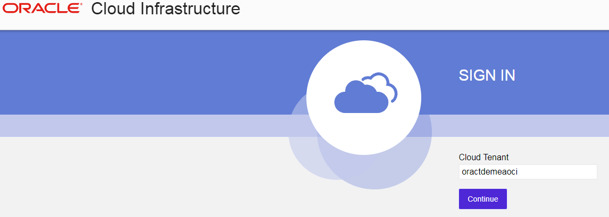


You will need to reset the password on first login so go ahead and do that. The password and user will be removed at the end of the workshop so to keep things simple go ahead and create your own password or use Welcome#### if you cant think of anything.

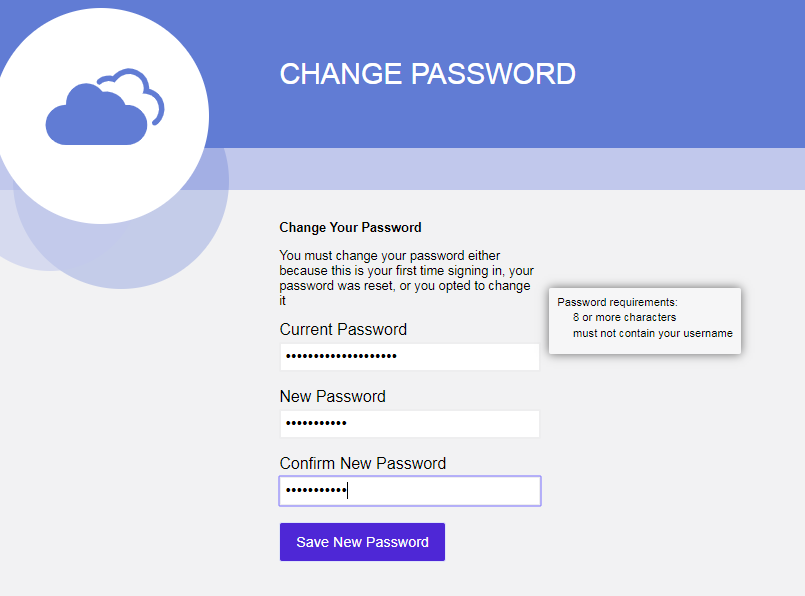

Once logged in, in the top right hand corner click the user avatar  and then in the menu that is displayed, select your username which will appear under the heading titled 'Profile'.

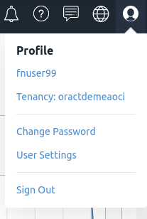

Click on your username to navigate to the user detail page.

This demonstrates that you have been able to successfully log in and that the self registration process has completed.

We will return to the OCI console to configure the Functions and Events services later in the lab. 

### Create a new Fn context for OCI

Fn installs with a default context but now we need to create a second to allow the Fn CLI to interact with the Oracle Functions service on OCI.

On your lab virtual machine SSH session issue the following commands:

```bash
$ fn create context oci --provider oracle 
$ fn use ctx oci 
$ fn ls ctx
```

The output should have an asterisk against the new Fn context.
```bash
CURRENT	NAME	PROVIDER	API URL			REGISTRY
	default	default		http://localhost:8080
*	oci	oracle
```

We now need to add the specific compartment within OCI to where you will create a new Oracle Functions application. 
We do this by providing the compartment OCID, a unique identifier. For this lab it will be the same compartment for every student which is already set as an environment variable in your VM. The following Fn command needs to be executed in order to set this up.

The OCID has been pre-defined as an environment variable in you lab vm to make this simpler.

```
$ fn update context oracle.compartment-id $COMP_OCID
```

We now need to provide the api-url to the new context in order for Fn to communicate with Oracle Functions.

Issue the following command to do this.

```
$ fn update context api-url https://functions.eu-frankfurt-1.oraclecloud.com
```

We need to configure the appropriate Oracle Cloud docker registry (OCIR) which will be used to push the packaged Functions docker image to.

Issue the following command. **NOTE**:

- You will need to replace the _NN_ with **your** student number (01 - 10)

- You will need to replace _tenancyname_ with the tenancy name given at the start of the lab in the student handout


```
$ fn update context registry fra.ocir.io/tenancyname/fnworkshopNN
```

Finally we need to allow the Fn context for oci to utilise the oci cli configuration located in ~/.oci/config. This OCI config file has been set up automatically in your VM and this simply tells the Fn context to use that configuration. To do this issue the following command:

``` $ fn update context oracle.profile fnworkshop_profile ```

With the configuration of the Fn context complete you can examine this in the .yaml file for the context.

Issue this command:

```
$ more ~/.fn/contexts/oci.yaml
```

The output should look similar to the following:

```
api-url: https://functions.eu-frankfurt-1.oraclecloud.com
oracle.compartment-id: ocid1.compartment.oc1..aaaaaaaabmmw7jy34fi5cmscp2ui4kvl6vy2lnebwhdki737nxrlp5wnlbrq
provider: oracle
registry: fra.ocir.io/oractdemeaoci/fnworkshop02
```

If we now list the contexts that have been created for using Fn you should see 2. The default, local context and a new one called oci that should have an asterisk against it to indicate that it is the current context being used.

```
$ fn list contexts

CURRENT	NAME	PROVIDER	API URL							REGISTRY
	default	default		http://localhost:8080
*	oci	oracle		https://functions.eu-frankfurt-1.oraclecloud.com	fra.ocir.io/oractdemeabdmnative/fnworkshop99
```

### Test our new Fn context for OCI

We can now issue a simple list apps command from the Fn CLI to see if it is is configured properly. This will list all the currently created applications in the compartment within OCI that was configured for you to use. 
You are sharing this compartment with all the delegates and so it might show one or more applications depending on how far the others have got. The application names should be appended with a number indicating the delegate that created it.

Issue the following command:

```
 $ fn list apps
```

If no applications have been created yet, you should see output similar to below.

```
No apps found
NAME	ID
```
If you get errors please let the organisers of the workshop know.

### Configure Docker to use the Oracle Cloud Image Registry configured in the new context

Before we can use Fn to deploy functions to Oracle Functions, we need to ensure Docker that is running locally on the VM you are using can access the OCI image registry (OCIR) configured in the new context just created. 
To do this we need to have Docker login and thus store the credentials locally.

A user named *apiuser* will be used to login to OCIR. The apiuser password is stored in an environment variable in the VM named API_AUTH_TOKEN. 

Display the password:

```
$ echo $API_AUTH_TOKEN
```

Copy the password to the clipboard. 

Then perform the following command:

**NOTE** 

You will need to replace _tenancyname_ with the tenancy name given at the start of the lab in the student handout

```
$ docker login fra.ocir.io/tenancyname
```

When prompted enter your _tenancyname_/apiuser 

**NOTE** The user will be apiuser but the _tenancyname_ will be the one you are using and were assigned at the start of the lab

```
tenancyname/apiuser
eg: oractdemeaoci/apiuser
```

When prompted for your password paste in the 'Auth token' that you copied to the clipboard.

Here is an example of what you should see when successfully logged in to the remote OCI registry:

```
Username:oractdemeaoci/apiuser
Password:
Login Succeeded
```
### Verify Object Storage Bucket

Within the OCI console at [https://console.eu-frankfurt-1.oraclecloud.com](https://console.eu-frankfurt-1.oraclecloud.com/) where you logged in earlier, you now need to verify that an object storage bucket has been created and assigned to you and has the correct configuration in order to emit events.

In the OCI Console if not already done, change the region to the Frankfurt region in the grey bar across the top of the console. Select the region drop down and pick "Germany Central (Frankfurt)".

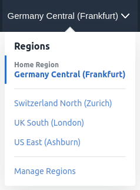

In the browser session where you logged into the OCI Console look for the  menu in the top left hand of the screen and press it.

From the list presented hover your mouse over 'Object Storage' and more options appear.

Press your mouse on 'Object Storage'

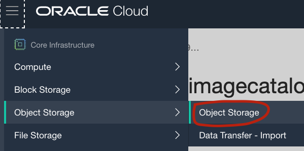

All the assets you will create during this workshop will be in a compartment named fnstudentworkshop in your tenancy. A compartment is a logical container that can be used to isolate workloads in OCI, all students in this workshop will be working in the same compartment.  Ensure that you are in the **fnworkshopstudent** compartment in the compartment picker. You can type the compartment name and this will filter the entries to allow you to find the **fnworkshopstudent** compartment quickly.


You should see a list of buckets , one for each user. 

Locate your bucket, it will be named after your user id that would have been assigned at the start of the lab.
If you are unsure please refer to the delegate handout you will have received at the start of the lab.

If you have any problems please reach out to an instructor.

Click on your bucket name

Note that the property "Emit Object Events" has been enabled which causes changes in the object store to fire events to the events service. This was set when the bucket was created for you.


By clicking on the bucket name created for you, you should see there are no objects currently uploaded.

### Create a new Functions Application

Now that we have completed the Fn based configuration we can turn our attention to the OCI console and start to build our function based application.

In the browser session where you logged into the OCI Console look for the  menu in the top left hand of the screen and press it.

From the list presented hover your mouse over 'Developer Services and more options appear.

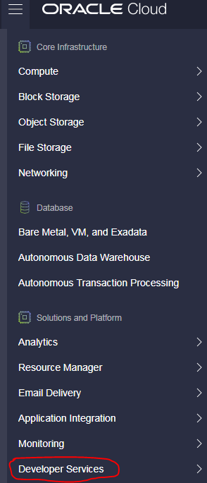

Press your mouse on 'Functions'

Before we can use Functions we need to select a compartment to utilise and you will be presented with a screen similar to this:

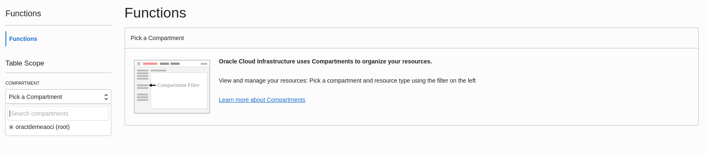


This lab is run for students in a number of OCI tenancies where the compartments used can vary. 
Please refer to the student handout you received at the beginning of this lab for the specific compartment to use and how to find it.

You will now be presented with the Functions User Interface where we will create a new application. As you are sharing this compartment with other delegates you may well already see applications listed.

Create a new application by pressing on the button 

The 'New Application' window will appear and you need to give a name, a description, the VCN and subnet you will use to access it over.

Give the name as imagecatalogapp*NN* where the *NN* is replaced with your delegate number (Given at the start of the hands on lab). eg imagecatalogapp01

The **VCN** and subnet to be used are within the same compartment as the one you are creating the application in. So in the VCN field ensure that the VCN selected is *fnvcn*.

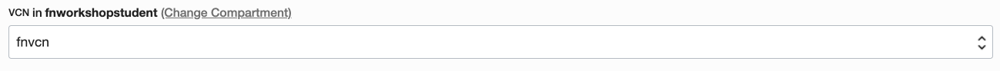

For the subnet ensure 'fnworkshopstudent' is selected as the compartment.

The **subnet** Fn Public Subnet (Regional) can then be selected.

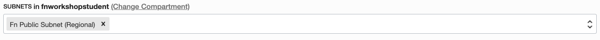

Under logging policy select "LOG TO OBJECT STORAGE", this will facilitate debugging if needed. 

Please refer to [Appendix C](AppendixC.md) if you would like to see more detail on using the logging.

The screen will look similar to the example below with a different application name depending on your delegate id.

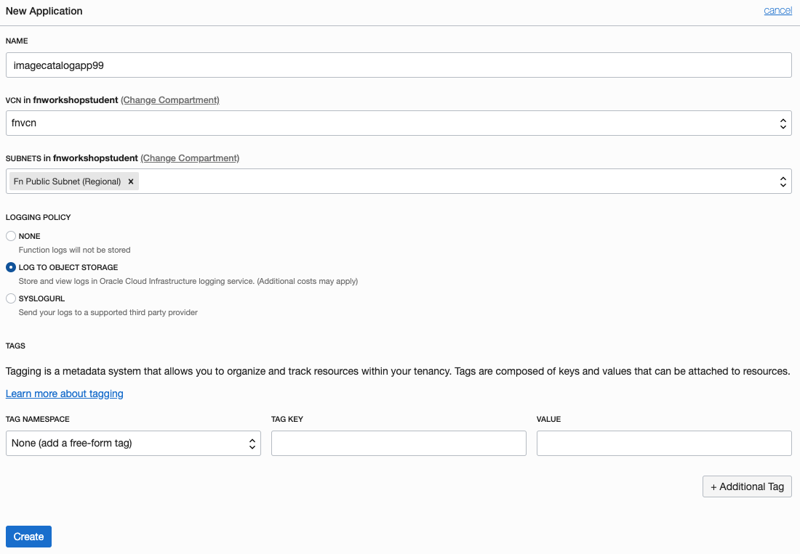

Hit 'Create' when done. Confirm your new application is listed in the compartment.

Back in the lab vm SSH session, test that you can see this new application.

Issue the following command and you should see your new application listed:

```
 $ fn list apps
```

### Create a new function

The new function will be written in Java. This is just one of the many languages supported by the Fn SDK. 
From your your lab VM ssh session, create a working directory and change into it by issuing these commands:

```
$ mkdir ~/fnwork 
$ cd ~/fnwork
```

Initialise a new function called "imagecatalogfunction".

```
$ fn init --runtime java imagecatalogfunction
```

This will create the boilerplate code and configuration for your new function. The func.yaml will have a description of the function. A pom.xml file will also be created. 
Maven is used to build the Java function and the POM file lists the required libraries and build steps. 
The src directory contains two code trees, one for the actual function code and one for a test suite. 
The folder structure should look like this:

``` asc
[opc@labvm99 ~]$ tree --charset=ascii imagecatalogfunction/
imagecatalogfunction/
|-- func.yaml
|-- pom.xml
`-- src
    |-- main
    |   `-- java
    |       `-- com
    |           `-- example
    |               `-- fn
    |                   `-- HelloFunction.java
    `-- test
        `-- java
            `-- com
                `-- example
                    `-- fn
                        `-- HelloFunctionTest.java
```

Change directory into the newly created imagecatalogfunction directory:

```
$ cd imagecatalogfunction
```

**Update POM file**

This function will require two extra Java libraries in order to work correctly and so these will have to be added to the pom.xml file to allow Maven to download them and use in the build process.

* cloudevents-api - Defines the open source cloud events API. In this function the input to the function will be a CloudEvent object that encapsulates all the details of the event.
* jackson-databind - Allows Java objects to be marshalled and unmarshalled to the JSON format used by REST APIs.

Open the pom.xml in your favourite text editor. Paste the the following two dependencies into the file after the opening _**dependencies**_ tag:

``` xml
 <!-- Added for cloud events api -->
<dependency>
   <groupId>io.cloudevents</groupId>
   <artifactId>cloudevents-api</artifactId>
   <version>0.2.1</version>
</dependency>
<!-- Added for JSON serialization -->
<dependency>
   <groupId>com.fasterxml.jackson.core</groupId>
   <artifactId>jackson-databind</artifactId>
   <version>2.9.9</version>
   <scope>compile</scope>
</dependency>
```

Close and save the file.

**Increase Function Memory**

This function will require more than the minimum 128MB of memory allocated by default. Memory allocation can be specified in the OCI console or in the func.yaml file as we will do. 
Open the func.yaml file in your preferred text editor and paste the following on to the last line:

memory: 512

The file should look like:

``` yaml
schema_version: 20180708
name: imagecatalogfunction
version: 0.0.1
runtime: java
build_image: fnproject/fn-java-fdk-build:jdk11-1.0.102
run_image: fnproject/fn-java-fdk:jre11-1.0.102
cmd: com.example.fn.HelloFunction::handleRequest
memory: 512
```

Save and close func.yaml

### Test the database REST API

The function will interact with an Autonomous Transaction Processing database running in the same tenancy. 

The function will insert rows into the database via the ORDS REST API. 

Test that the API is accessible from your lab VM with the following command <i>**replacing fnuser99 with the name of your bucket**</i>:

``` 
$ curl -X GET -G $ATP_ORDS_URL --data-urlencode 'q={"bucketname":"fnuser99"}' | jq .

```

This will pretty print a JSON payload with all the rows currently in the CATALOG table in the database where the bucketname matches the one you have been assigned.

As an alternate way of viewing the JSON payload you can always use the online JSON editor [https://jsoneditoronline.org/](https://jsoneditoronline.org/#/)

Open the editor in a new browser tab and hit the  button.

Copy the complete JSON payload returned from the command above and paste into the left hand pane deleting the '{}' already there.

Hit the button in the middle of the panes to see the JSON formatted properly in the right hand pane.

In the right hand pane expand items to see the current number of items in the database table.

### Set Function Application Configuration Variables

The Database REST endpoint will be configured as a configuration variable in the Function application. This is done with the Fn CLI (**substitute your student number for *NN***):


> fn config app imagecatalogapp***NN*** ordsBaseURL $ATP_ORDS_URL


We will also add another configuration variable. Issue the following command **again replacing *NN* with your student number**:


> fn config app imagecatalogapp***NN*** imageUrl https://objectstorage.eu-frankfurt-1.oraclecloud.com/n/


These configuration variables will be read as environment variables within the function and can be read in whatever code the function is implemented in. 
It's also possible to set configurations at the individual function level.

### Update the Java code

We require our function to accept the event payload, parse it's content and insert a record into the catalog table in the ATP database using the ORDS REST API. 
Some sample code has been written to do this for you. 
Feel free to examine the code at /home/opc/HelloFunction.java.

Copy this file to the source code tree of your new function you created.

```
$ cp ~/HelloFunction.java ~/fnwork/imagecatalogfunction/src/main/java/com/example/fn/HelloFunction.java
```

### Remove Tests

We don't have a mock service for the ATP ORDS REST API so we will delete the test as we don't want test executions to add rows to our table.

Remove the test java file at \~/fnwork/imagecatalogfunction/src/test/java/com/example/fn/HelloFunctionTest.java.

``` bash
$ rm ~/fnwork/imagecatalogfunction/src/test/java/com/example/fn/HelloFunctionTest.java
```

Obviously this is not best TDD (Test Driven Development) practice! In a real world situation you would write your tests first and use them to ensure no bugs appear in your code. This shortcut will allow us to build and deploy our function without putting all the testing infrastructure in place.

### Deploy

Ensure you are in the imagecatalogfunction directory

```bash
$ cd ~/fnwork/imagecatalogfunction
```

Deploy the function to OCI. Issue the following command **again replacing *NN* with your student number**:

```bash
$ fn --verbose deploy --app imagecatalogappNN
```


You should see the familiar Docker and Maven build output and finally a message that the function has updated with a new image.

This deploy takes a little time to complete (roughly 2-3 minutes)

The deployment should complete with messages similar to this below:

```
Updating function imagecatalogfunction using image fra.ocir.io/oractdemeabdmnative/fnworkshop99/imagecatalogfunction:0.0.2...
Successfully created function: imagecatalogfunction with fra.ocir.io/oractdemeabdmnative/fnworkshop99/imagecatalogfunction:0.0.2
```

After the successful deployment, visit the OCI Function page where you created your application to verify the function has been deployed to it. 

**Be sure to check the application with your student id!**

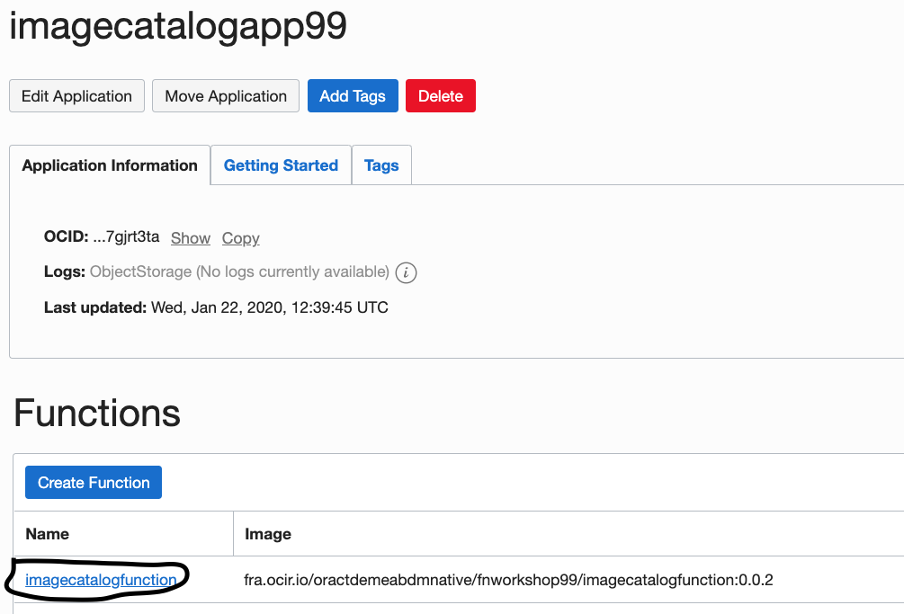

### Create an Event Rule

In order to link events occurring in OCI object storage to the new function it's necessary to create an event rule.

**It makes sense to open the events service in a new browser tab.**

In the OCI console open the hamburger menu in the top left-hand corner and navigate to "Application Integration" and then, **right-click** new browser tab, "Events Service".

**Ensure that you are in the fnworkshopstudent compartment**

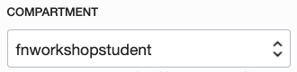

Click the blue "Create Rule" button and complete the details for your new rule.

Display Name: fnuser*NN*rule (replace *NN* for your student number)

Description: Detects new objects in bucket and triggers imagecatalogfunction

In the Rule Conditions section, leave the first drop down set to "Event Type". 

In the Service Name drop down select "Object Storage". 

In the Event Type drop down select "Object - Create". 

The Rule Condition should look like:

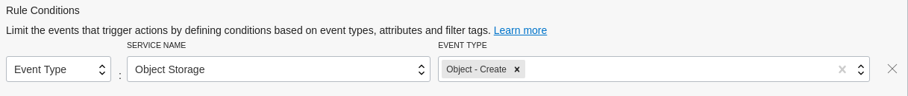

Add another condition to specify exactly which bucket triggers this rule. 

Press the "+ Add Condition" button. 

Select "Attribute" as the condition type and then "bucketName" as the "Attribute Name". 

In "Attribute Values" enter the name of your assigned object storage bucket (see earlier section on object storage) e.g. fnuser99.

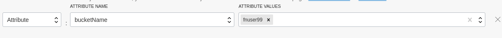

In the Actions section specify the Action Type as Functions. 

Select the fnworkshopstudent compartment, **your** function application (based on your student number) and your deployed function.

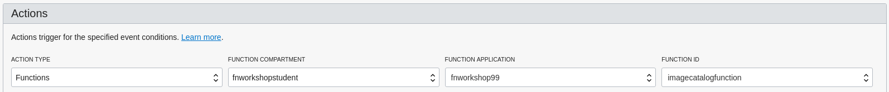

Press "Create Rule" to create your rule - this button is right at the bottom left of the screen and sometimes hard to spot.

### Trigger the function

Navigate back to the Object Storage page in the OCI Console.

Locate the bucket assigned to you again and click on its name to open the details. We will trigger the function by uploading an image to the bucket, this will trigger an event which your rule will channel to the new function.

In the console click the blue Upload Objects button, in the dialog box click "select files" and pick an image file from your laptop (it doesn't matter which).

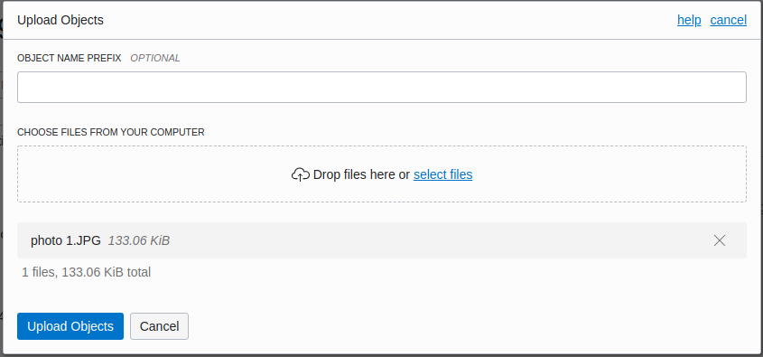

Press the "Upload Objects" button to upload the object. 

The function will be invoked in a few seconds but bear in mind that the function serverless environment needs to be started prior to the first invocation.
This means there will be a delay in seeing anything. 

It is advisable to wait a minute or so before continuing.

To check execution, navigate to the Functions page in the console, select your application (imagecatalogapp*NN*) and then the function (imagecatalogfunction).

In the metrics graphs you should see a point appear for the first function invocation (you might need to refresh your browser a few times).

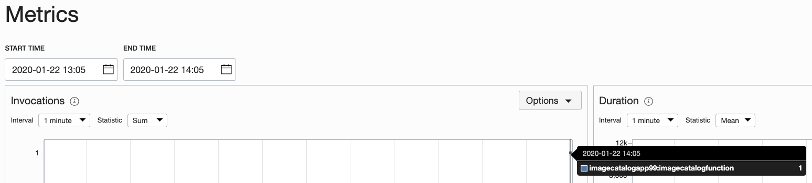

You can further check to see how the function was invoked by going to the Events Service console and finding the event rule that you wrote.

When you have found it, click on it's name and you will see metric graphs. One will show Events Delivered and you will see an event delivered to Functions as a Service (FAAS).

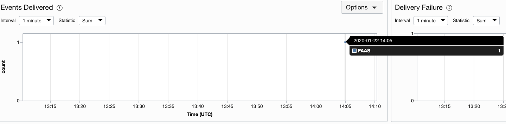

The backend ATP database can be checked by the REST API.

Issue the following curl command as you did earlier to query all the rows in the CATALOG table <i>**replacing fnuser99 with the name of your bucket**</i>:

```
$ curl -X GET -G $ATP_ORDS_URL --data-urlencode 'q={"bucketname":"fnuser99"}' | jq .
```

The response will be in JSON format and you should see an entry for the file you just uploaded e.g.

```
{
 "id": 11,
 "name": "photo 3.JPG",
 "url": "https://objectstorage.eu-frankfurt-1.oraclecloud.com/n/oractdemeaoci/b/fnuser99/o/photo 3.JPG",
 "uploaded": "2019-10-11T08:51:31Z",
 "bucketname": "fnuser99",
 "compartmentname": "fnworkshopstudent",
 "links": [
 {
 "rel": "self",
 }
 ]
 }
```

You should recognise the file you uploaded, the timestamp and your object store bucket. The url attribute should link to the file you uploaded, try it in a browser.

Again you might find it easier to use the online JSON editor [https://jsoneditoronline.org/](https://jsoneditoronline.org/#/) to view the output and then search the items details to find the image you uploaded.

Congratulations! You have successfully completed this lab session!

## Links to more information

### Oracle Functions

[Documentation home](https://docs.cloud.oracle.com/iaas/Content/Functions/Concepts/functionsoverview.htm)

[Configuring your client environment to use Oracle Functions](https://docs.cloud.oracle.com/iaas/Content/Functions/Tasks/functionsconfiguringclient.htm)

[Configuring you OCI tenancy to use Oracle Functions](https://docs.cloud.oracle.com/iaas/Content/Functions/Tasks/functionsconfiguringtenancies.htm)

### Oracle Events

[Oracle Events Service](https://docs.cloud.oracle.com/iaas/Content/Events/Concepts/eventsoverview.htm)

### Oracle REST Data Services

[Overview and links to more detail](https://www.oracle.com/rest)
