[Go to Overview Page](../README.md)


# Migration of Monolith to Cloud Native

## D. Adding API Gateway 


### Introduction

---

A common approach in the Cloud Native Application Development is to expose backend APIs to outside world through a sort of gateway that can control and restrict the access to the APIs. Such component is called *API Gateway* and Oracle Cloud Infrastructure does come with a gateway solution to address this need.

<details><summary><b>Some more words about OCI API Gateway</b></summary>
<p>

The Oracle Cloud Infrastructure API Gateway service enables you to publish APIs with private endpoints that are accessible from within your network, and which you can expose with public IP addresses if you want them to accept internet traffic. The endpoints support API validation, request and response transformation, CORS, authentication and authorization, and request limiting.

Using the API Gateway service, you create one or more API gateways to process traffic from front-end clients and route it to back-end services. You can use a single API gateway to link multiple back-end services (such as load balancers, compute instances, and Oracle Functions) into a single consolidated API endpoint.

You can access the API Gateway service to define API gateways and API deployments using the OCI Console and the OCI REST API.

The API Gateway service is integrated with Oracle Cloud Infrastructure Identity and Access Management (IAM), which provides easy authentication with native Oracle Cloud Infrastructure identity functionality.

</p>
</details>

After running the previous labs, you've probably ended up with a architecture similar with the one in below picture:

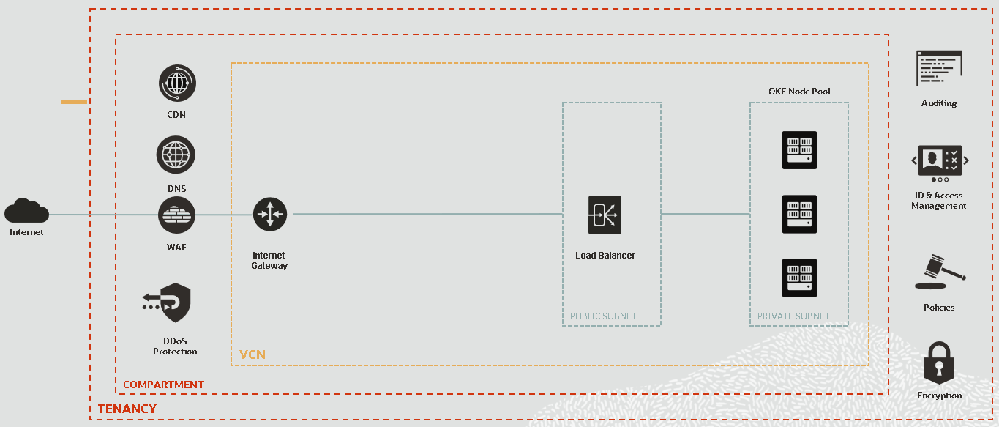

As you have created your OKE cluster using the *Quick create* workflow, the wizard also created for you:

- a Virtual Cloud Network (VCN)
- an Internet Gateway (IG) for allowing traffic from Internet
- a NAT Gateway (NAT) for allowing access to Internet from Kubernetes worker nodes 

The Virtual Cloud Network has been pre-configured with two regional subnets:

- one Regional Private Subnet for the Kubernetes worker nodes
- one Regional Public Subnet for the Load Balancer Services

So each of the Kubernetes worker node got an IP address within the Private Subnet network and each load balancer (for the K8s Dashboard or for the Ingress Controller) got an IP address within the Public Subnet.

Now, to get more control on how the backend REST services are exposed to and access from the Internet, we add an *API Gateway* component in our architecture.

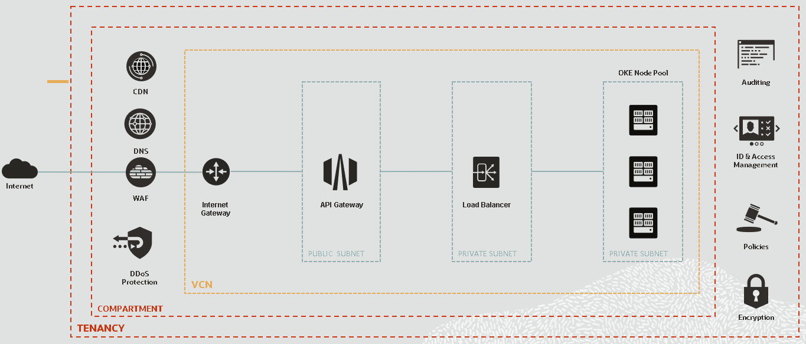

The *API Gateway* will sit in front of the *Load Balancer* and will handle the requests from Internet. As It needs to be visible from the Internet, it has to be part of a Public Subnet and have associated an Public IP address. The OCI API Gateways can be deployed also in Private Subnets, being visible only from internal network, but in our case it has to serve public clients.

As the *Load Balancer* will accept requests only coming from the *API Gateway* the simple way is to put it in a Private Subnet, without the need to have a Public IP address as before.


### Prepare Networking for API Gateway

---

The get to above target architecture, ideally, we would need to:

- Create a new Public Regional Subnet for the API Gateway
- Create a new Private Regional Subnet for the Internal Load Balancer
- Create required Security Lists
- Create  a new Load Balancer in the dedicated Private Regional Subnet
- Delete or reconfigure current Load Balancer to restrict Internet access

But, for making this lab simpler we will re-use existing resources, the Public and the Private Regional Subnets to be more specifically.

It means that we only need to:

- Create a new Load Balancer in the existing Private Regional Subnet and configure associated Listener and Backend Set to point the the Kubernetes Worker Nodes
- Edit existing Private Regional Subnet Security List so that incoming traffic it's allowed to internal Load Balancer Listener port.

The API Gateway will be later on created in the existing Public Regional Subnet so we won't mind creating and configuring dedicated subnet for it. We will leave existing Public Load Balancer configuration as-is for testing/workshop purposes but keep in mind that in a production environment the only way of exposing the backend REST services would be through the API Gateway.


##### Identify your Virtual Cloud Network

In order to get to work, we need to Identify the VCN that has been created by the OKE *Create Cluster* Wizard.

Go to Menu, *Core Infrastructure* > *Networking* > *Virtual Cloud Networks*. Don't forget the compartment you've been working on, **CTDOKE** in this case.

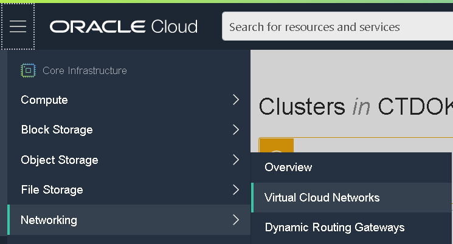


You should see listed all existing VCNs in the Compartment. When you have created the OKE Cluster, you name it *Helidon-lab-YOUR-INITIALS*. During cluster provisioning, a VCN prefixed with *oke-vcn-quick-Helidon-lab-YOUR-INITIALS* has been also created. You should identify it in the list, for example:

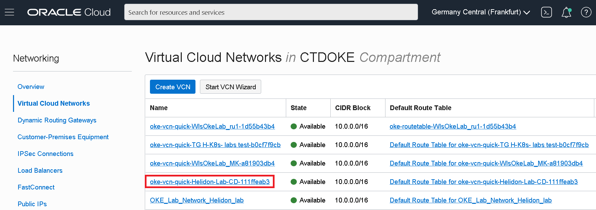


You can also find a reference to the VCN on the OKE Cluster detail page. Note the VCN Name as we need it during Load Balancer provisioning.

Click on the VCN name and observe the two Subnets created in this Virtual Cloud Network.


You can see that the Public Subnet Name it's prefixed with *oke-svclbsubnet-quick*, so intended for the Load Balancers.


##### Inspect existing Load Balancer configuration

Next, before creating the Private Load Balancer, we need to inspect existing Load Balancer Configuration. This will help us creating a new Private Load Balancer that will use the same backend nodes as the public existing one.

In order to identify the OCI Load Balancer associated with out OKE Cluster Ingress Controller, we can search it by the public IP address.

To get the IP address, run the following kubectl command using the OCI Cloud Shell:

- `kubectl get services -n ingress-nginx`

```
NAME                                          TYPE           CLUSTER-IP     EXTERNAL-IP      PORT(S)                      AGE
ingress-nginx-nginx-ingress-controller        LoadBalancer   10.96.196.6    130.61.195.102   80:31969/TCP,443:31302/TCP   26d
ingress-nginx-nginx-ingress-default-backend   ClusterIP      10.96.17.121   <none>           80/TCP                       26d
```

Note the **EXTERNAL-IP** address of *ingress-nginx-nginx-ingress-controller*.


Now, in the OCI Console, navigate to: *Core Infrastructure* > *Networking* > *Load Balancers*:


Identify the Load Balancer with the above External IP address:

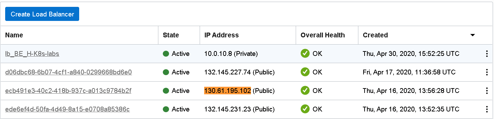


If we look at the Load Balancer Information we can recognize the VCN and the Subnet names:


Now, in order to create a new Load Balancer with similar role (balancing traffic to Kubernetes worker nodes), we need to check for the backend nodes information and for the health check configuration.

Go to *Backend Sets* using the *Resources* left hand side menu. You should see two backend sets:

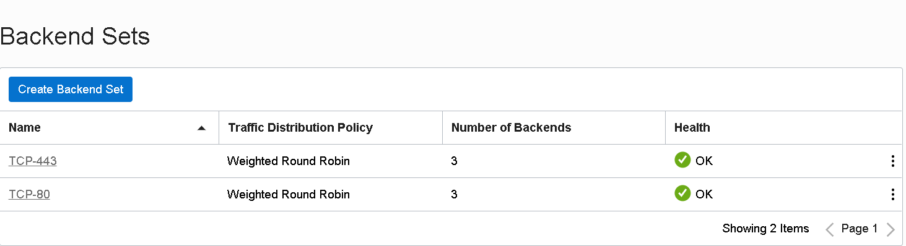


We are interested in **TCP-80** Backend Set information as we will forward plain http traffic to the worker nodes. Click on the Backend Set name (**TCP-80**).


Click on *Backends* in the *Resources* menu to inspect the Kubernetes workers:

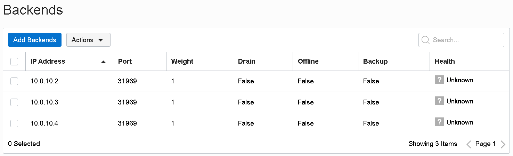


We need to note:

- the IP Addresses of the workers (in this example 10.0.10.2, 10.0.10.3 and 10.0.10.4)
- the listening port (in this example 31969)

We can find the worker nodes IP addresses also by running the `kubectl get nodes` command:

```
NAME        STATUS   ROLES   AGE   VERSION
10.0.10.2   Ready    node    28d   v1.15.7
10.0.10.3   Ready    node    28d   v1.15.7
10.0.10.4   Ready    node    28d   v1.15.7
```


Now, lets go back to the Backend Set information and click on **Update Health Check** button:


Note the values for all the fields in the form:

- Protocol
- Port
- Interval in ms
- Timeout in ms
- Number of retries
- Status code
- URL Path and
- Response body regex

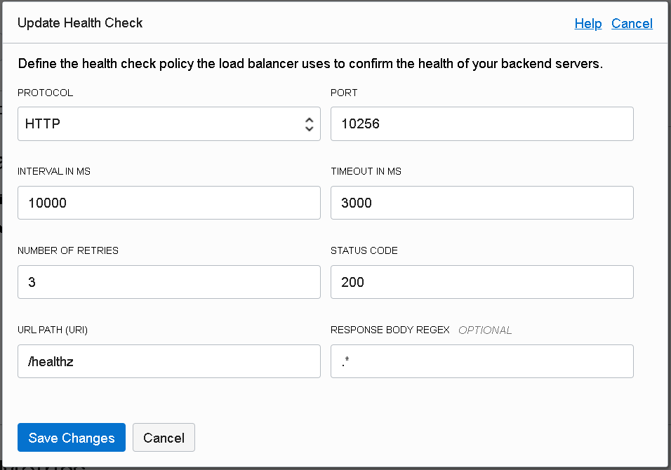


To check the health of each of the backend nodes, the load balancer will try to make a *Http* call on specified *Port* the *URL Path* every *Interval in ms* with a *Timeout in ms* timeout. In case of answer, it will check the provided *Status code* and it will compare the response body with the *Response body regex*.

Now, we have all information to create our private Load Balancer.


##### Create Private Load Balancer

Go to Load Balancers Dashboard page and Choose to **Create Load Balancer**:


Give a name, like *Helidon-Lab-YourInitials-privatelb*; Choose **Private** for the Visibility and **Small 100Mbps** shape:


Scroll down for choosing an existing VCN and Subnet. Choose the Virtual Cloud Network where your OKE cluster runs (identified above) and the the *oke-subnet-quick-[...]* Subnet; Click **Next**:


In the *Backends* section of the wizard, leave the default option for the *Load Balancing Policy*; we will add the backends information later on, after creating the Load Balancer

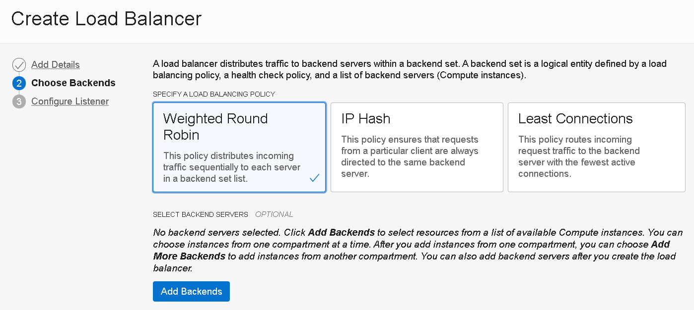


Scroll down to setup the *Health Check Policy*. Here make sure to provide the same values as the existing Load Balancer Health Policy (see above section, *Inspect existing Load Balancer configuration*):

- **Protocol**: *Http*
- **Port**: *10256*
- **Interval in ms**: *10000*
- **Timeout in ms**: *3000*
- **Number of retries**: *3*
- **Status code**: *200*
- **URL Path**: */healthz*
- **Response body regex**: *.\**

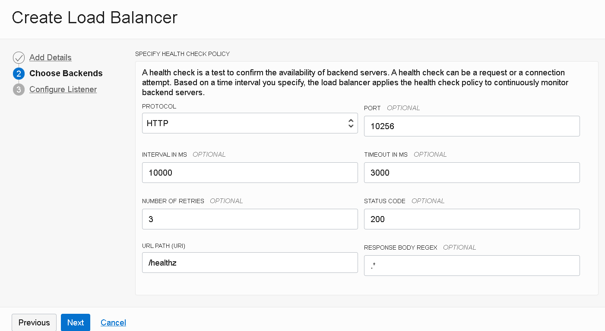


Click **Next** to get to last section of the wizard. Here we configure the a listener for the Load Balancer. With the new topology, having API gateway in front of the internal Load Balancer and the worker nodes, it's sufficient to setup a **HTTP** type of listener. API Gateway will listen only on HTTPS (443), do SSL offloading and then direct the traffic to the private load balancer. 

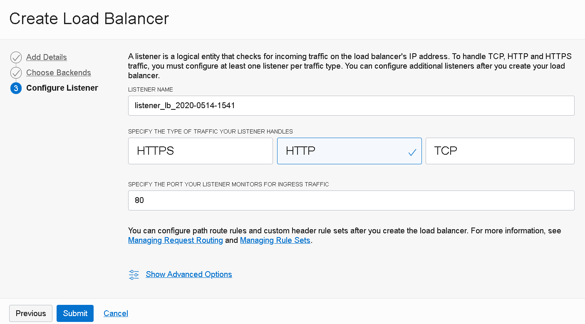


You can overwrite the default *Listener Name*. For simplicity we can leave the default http port **80.** Click **Submit** to trigger Load Balancer provisioning.


 

After some moments, the Load Balancer should become *Active*. Take note of the **IP Address** allocated to the Load Balancer. We will need this information later on, when we'll configure the API Gateway backend routes.

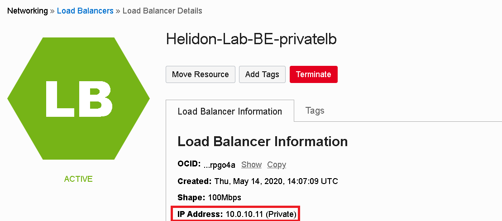


We need now to associate the Kubernetes backend worker nodes. Go to *Backends Sets* option in the *Resources* left hand side menu. Click on the existing backend set:


Now, go to *Backends* menu option of the backend set page. Click on **Add Backends**:


Choose to add backends by entering *IP ADDRESSES*. It's easier to add Kubernetes worker nodes this way as we already have the IP addresses and as it might be more difficult to identify the compute instances in a shared environment. Fill in the *IP ADRESSES* and the *PORT* information. Leave default weight as we want the load balancer to equally distribute the requests. Click **Add** to add the backends.


The Backend nodes should be listed now:

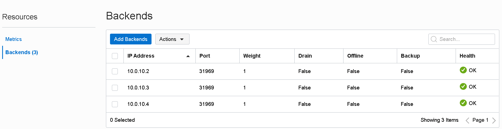


If we return to the Backend Set information, we should see that the backend servers number jumped to 3 and that there's no unhealthy backend server:

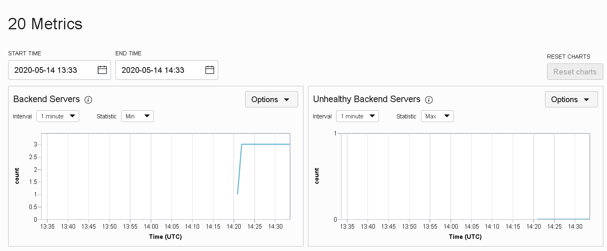


##### Add extra security list rule

Last thing that we need to do is to allow traffic from the Public Regional Subnet to  the newly created private Load Balancer. Incoming traffic from the Public Subnet to the Private Subnet compute nodes is currently possible - as the Public Load Balancer is able to reach out the Kubernetes worker nodes - but it is allowed only to the ports used by the Kubernetes nodes, and not for the port 80 of the new Load Balancer. To permit this, we need to define a new *Ingress Rule* in the associated *Security List* of the Private Subnet.

Let's go to the *Virtual Cloud Network* dashboard page and choose our Kubernetes VCN (the one identified above, with the name *oke-quick-Helidon-Lab-YourInitials-[...]*):


Click on the Private (Regional) Subnet, it should be the one prefixed with *oke-subnet-quick-[...]*:


There should be one security list associated with the Private Subnet. Click on the name:

### 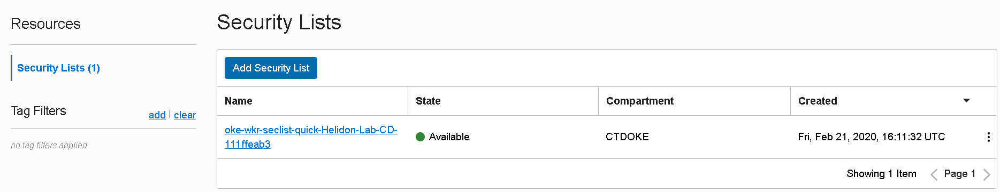Create API Gateway

---


Check the *Ingress Rules*:

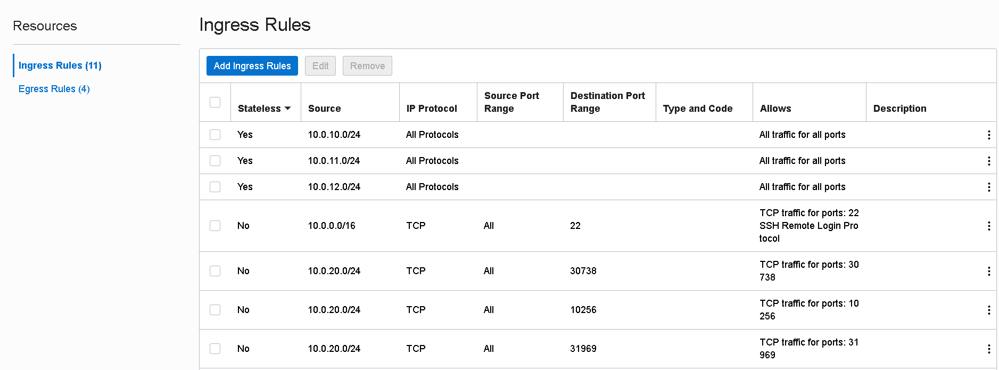 


We need to add a new rule that will allow HTTP traffic from the Public Subnet network to this Private Subnet on port 80 (or to a custom port if you've overwritten the default 80 port in the Load Balancer Listener configuration). Click on **Add Ingress Rules**:


Make sure you set the same *Source CIDR* as the existing rules that allow traffic to 22 or 31969 ports. Click on *Add Ingress Rules*.

Now everything should be in place from networking perspective and we are ready to move on creating the API Gateway.


### Create and Configure OCI API Gateway

---

For creating and configuring an API Gateway, we have to:

- create an OCI API Gateway instance that will run in a certain Virtual Cloud Network and Subnet(s); in care of a public API Gateway it will have a dedicated and unique endpoint accessible from public Internet.
- create an API Deployment for the OCI API Gateway that will define a sub-resource of the API Gateway alongside routing rules and policies that have to be enforced (we refer here at specific OCI API Gateway policies, not to be confused with IAM policies of the Oracle Cloud Infrastructure)


##### Create API Gateway

From the main menu go to *Solutions and Platform* > *Developer Services* > *API Gateway*

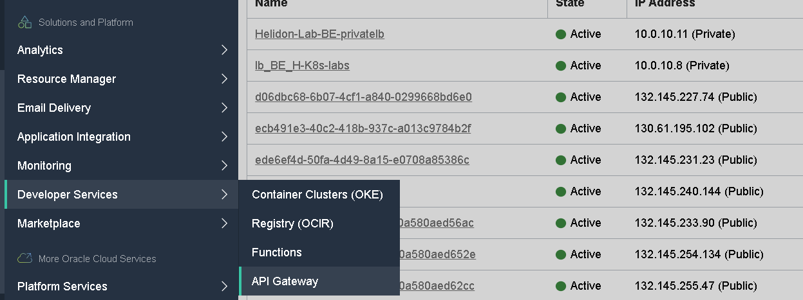


Make sure you are on the same compartment; click **Create Gateway** 

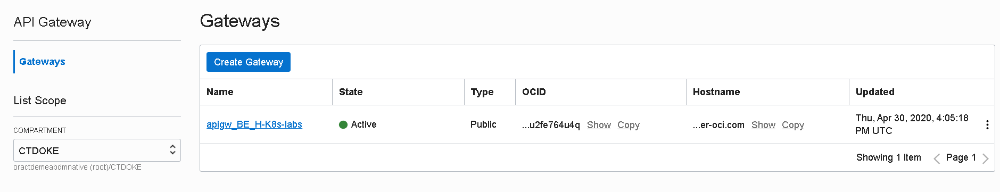


Give a meaningful name for the gateway, for example *Helidon-Lab-YourInitials-apigw*; select the Virtual Cloud Network that we've been using until now and its Public Regional Subnet (prefixed with *oke-svclbsubnet-quick-[...]*); click **Create** to create the gateway:


After some moments, the API Gateway should be available and active. Take notice of the *Hostname* value.

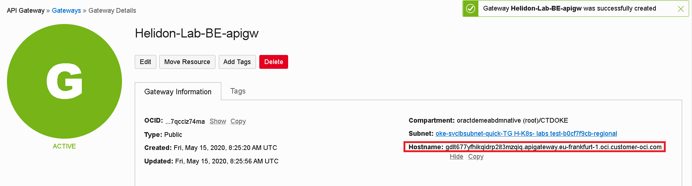


##### Inspect Kubernetes backend service

Before creating the OCI API Gateway Deployment we need to know what are the REST resources that we need to route to / expose using the gateway.  We can easily do this by taking a look at the Open API specification of the StoreFront backend service. As the initial public Load Balancer it's still up & running, we can download the specification using the browser. Open in a new browser tab:

> http://[LB Public IP address]/sf/openapi

This will download an *openapi* file in .yaml format:

```yaml

components: 
  schemas:
    ItemDetails: 
      required:
      - itemCount
      - itemName
      properties:
        itemCount: 
          description: The number of items listed as being available
          example: '10'
          format: int32
          type: integer
        itemName: 
          description: The name of the item
          example: Pencil
          type: string
      description: Details of the item in the database
      example: '[{"itemCount": 470, "itemName": "Pencil"},{"itemCount": 50, "itemName":
        "Eraserl"},{"itemCount": 4600, "itemName": "Pin"},{"itemCount": 100, "itemName":
        "Book"}]'
      type: object
    ItemRequest: 
      required:
      - requestedCount
      - requestedItem
      properties:
        requestedCount: 
          description: Number of the items being requested, this must be larger than
            the minimumChange
          example: '5'
          format: int32
          type: integer
        requestedItem: 
          description: Name of the item being requested
          example: Pin
          type: string
      description: Details of a Item reservation request
      example: '{"requestedItem", "Pin", "requestedCount",5}'
      type: object
info: 
  description: Acts as a simple stock level tool for a post room or similar
  title: StorefrontApplication
  version: 0.0.1
openapi: 3.0.1
paths:
  /store/reserveStock: 
    post: 
      description: reserves a number of stock items in the database. The number of
        stock items being reserved must be greater than the defined minimum change
      requestBody: 
        content:
          application/json: 
            schema: 
              $ref: '#/components/schemas/ItemRequest'
        description: The details of the item being requested
        required: true
      responses:
        '404': 
          description: The requested item does not exist
        '406': 
          description: The requested change does not meet the minimum level required
            for the change (i.e. is <= the minimumChange value)
        '409': 
          description: There are not enough of the requested item to fulfil your request
        '200': 
          content:
            application/json: 
              schema: 
                $ref: '#/components/schemas/ItemDetails'
          description: The updated stock details for the item
      summary: Reserves a number of stock items
  /store/stocklevel: 
    get: 
      description: Returns a list of all of the stock items currently held in the
        database (the list may be empty if there are no items)
      responses:
        '200': 
          content:
            application/json: 
              schema: 
                items: 
                  $ref: '#/components/schemas/ItemDetails'
                type: array
          description: A set of ItemDetails representing the current data in the database
      summary: List stock items

```


Look at the *paths* section. We need to exposed following resources:

- **/store/reserveStock** - **POST** method
- **/store/stocklevel** - **GET** method


##### Create API Deployment

In the OCI API Gateway details page, navigate to *Deployments* from the left hand side menu. Click on **Create Deployment**:


We see two options: either to created the API Deployment from scratch (using the UI wizard) or to use an OCI API Deployment  specification in .json format. We can define the routing and access policies using any of the options, but for lab we choose for the UI wizard.

Give the API Deployment a *Name*, for example **StoreFront**. For the *Path Prefix* we can set **/sf** to keep the same context root as the backend Kubernetes service. So any REST resource we expose through this API Deployment it will be prefixed with **/sf**.


Scroll down to the *API Request Policies*. Here we can define several types of policies that we can attach to the API Deployment:

- *Authentication* - this allows us to enforce authentication and authorization for the API
- *CORS* - configuring CORS access, useful if the APIs will be called directly from JS client-side frontend applications like web or hybrid mobile applications
- *Rate Limiting* - limits fulfilling incoming calls to a specific rate


Before moving forward, let's add a request policy that will limit the number of calls. Click on the **Add** button in the *Rate Limiting* section. Setup:

- *Number of requests per second:* **2**
- *Type of Rate limit*: **Per client (IP)**

Click **Save Changes**:


This will limit to **2** the total number of calls per second (to any of the API resources) that a client can perform. Any subsequent call in the time frame window of 1 second will be denied.


Scroll down to check the *Logging Policies* that we can activate. You can enable or not the *Access Logs* or the *Execution logs*. Click **Next**:

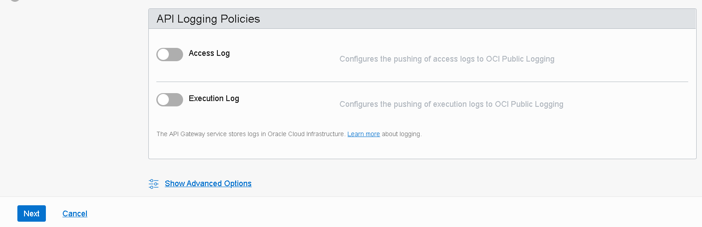


Now we need to define each route that this API Deployment will support.  For each resource in the *openapi* document we'll define a *Route* here. At the moment of writing this article, a feature to allow the API Deployment wizard to dynamically discover all resources exposed by a backend service using it's openapi definition was not yet general available. But our service has only two resources to expose, so it's easy to add them manually.

For each of the paths inspected in the previous section, add a *Route*:

- *PATH*: **/store/reserveStock**
- *METHODES*: **POST**
- *TYPE*: **HTTP**
- *URL*: **http://[Private Load Balancer IP]/sf/store/reserveStock**
- leave the timeout options as default


Scroll down and click **+Another Route**. Fill in:

- *PATH*: **/store/stocklevel
- *METHODES*: **GET**
- *TYPE*: **HTTP**
- *URL*: **http://[Private Load Balancer IP]/sf/store/stocklevel**
- leave the timeout options as default

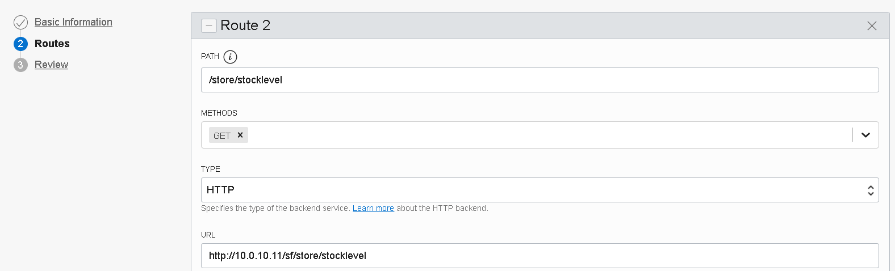


We also want to expose the *openapi* specification of the backend service, so we add a third route; Fill in:

- *PATH*: **/openapi
- *METHODES*: **GET**
- *TYPE*: **HTTP**
- *URL*: **http://[Private Load Balancer IP]/sf/store/openapi**
- leave the timeout options as default

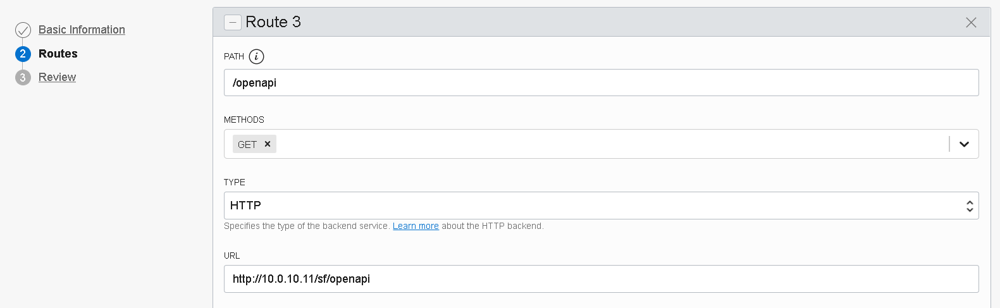


Click on the **Next** button of the wizard to *Review* the API deployment; Click **Create**:

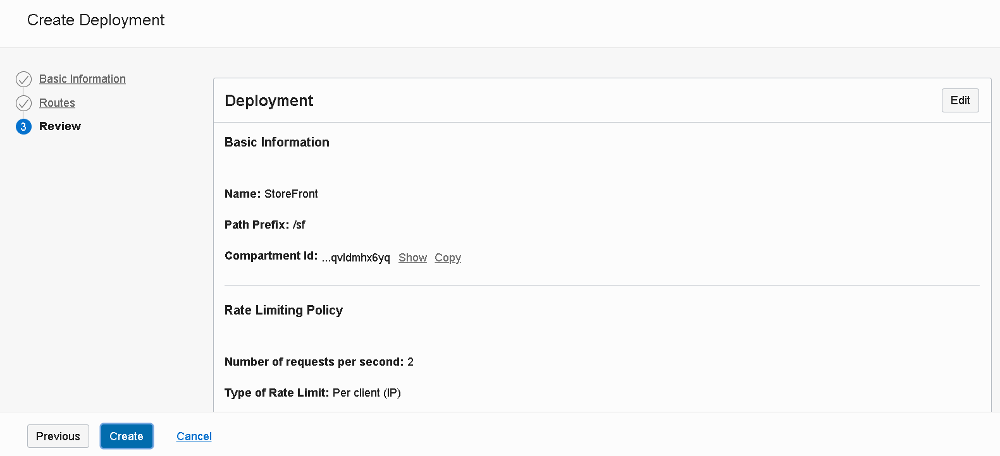


After some moments, the API Deployment should be available and active:

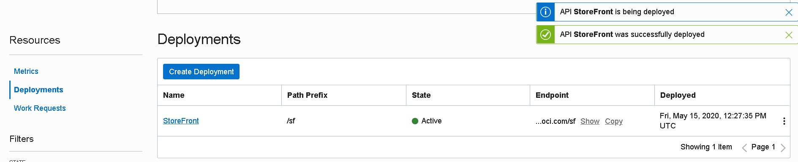


Check the base endpoint of the API Deployment. This will be the base URL that the end-client we'll be using:

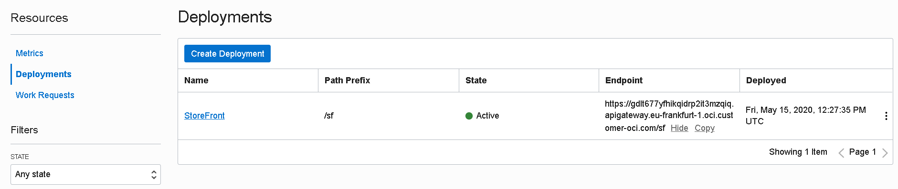


### Testing using Postman

---

*[TO DO]*