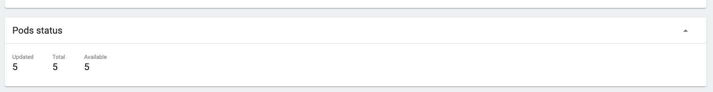
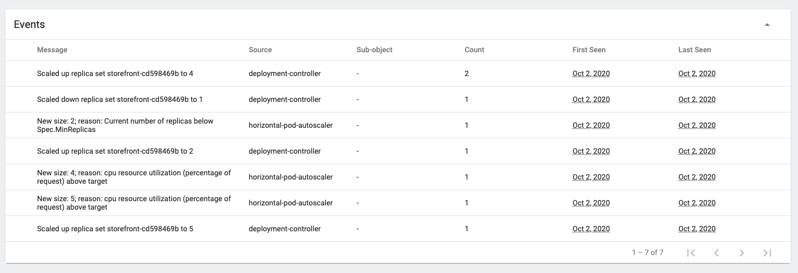

[Go to Overview Page](../Kubernetes-labs.md)


# Migration of Monolith to Cloud Native

## C. Deploying to Kubernetes
## 3b. Auto Scaling labs

<details><summary><b>Self guided student - video introduction</b></summary>
<p>

This video is an introduction to the Kubernetes auto scaling lab. Once you've watched it please press the "Back" button on your browser to return to the labs.

[](https://youtu.be/awmLUpBwqig "Kubernetes auto scaling lab introduction video")

</p>
</details>

---
We've seen how we can increase (or decrease) the number of pods underlying a service and that the service will automatically balance the load across the pods for us as the pod count changes.

This is great, but it required manual intervention to change the number of pods, and that means we need to keep an eye on what's happening. Fortunately for us Kubernetes has support for automating this process based on rules we define.

## Horizontal autoscaling - based on CPU load or Memory usage

This is the simplest form of auto scaling, though it is also the least flexible as CPU and memory usage may not always be the most effective indicator of when scaling is required. 

To gather the data we need to have installed the metrics server. This is a replacement for an older Kubernetes service called heapster. 

Note that it's also possible to use Prometheus as a data source which will allow you to auto-scale on custom metrics, for example the number of requests to your service. 

For now we are going to use the simplest approach of the metrics server.

### Installing the metrics server

- In the OCI Cloud Shell type
  - `helm install metrics-server stable/metrics-server --namespace kube-system`

```
NAME: metrics-server
LAST DEPLOYED: Fri Feb 28 14:58:53 2020
NAMESPACE: kube-system
STATUS: deployed
REVISION: 1
NOTES:
The metric server has been deployed. 

In a few minutes you should be able to list metrics using the following
command:

  kubectl get --raw "/apis/metrics.k8s.io/v1beta1/nodes"
```

It will take a short time for the metrics server to start up, but you can check the progress using kubectl

- In the OCI Cloud Shell type
  - `kubectl get deployments -n kube-system`
  
```
NAME                                   READY   UP-TO-DATE   AVAILABLE   AGE
deployment.apps/coredns                3/3     3            3           17m
deployment.apps/kube-dns-autoscaler    1/1     1            1           17m
deployment.apps/kubernetes-dashboard   1/1     1            1           15m
deployment.apps/metrics-server         0/1     1            0           18s
```

### Using the captured metrics

Once the metrics server is running (it will have an AVAILABLE count of 1) you can get information on the state of the system

let's look at how the nodes in the cluster are doing
- In the OCI Cloud Shell type
  - `kubectl top nodes`

```
NAME        CPU(cores)   CPU%   MEMORY(bytes)   MEMORY%   
10.0.10.2   73m          3%     1561Mi          23%       
10.0.10.3   109m         5%     1834Mi          27%       
10.0.10.4   157m         7%     1232Mi          18%       
 ```
 
If you get an response `error: metrics not available yet` then it just means that the metrics server is running, but hasn't completed it's initial data capture yet. Wait a short while and try the `kubectl top nodes` again.
  
Note that this was from a cluster with three nodes, depending on the size of your cluster you will see a different number of nodes output.
  
We can also see the status of the pods in terms of what they are using

- In the OCI Cloud Shell type
  - `kubectl top pods`

```
NAME                           CPU(cores)   MEMORY(bytes)   
stockmanager-86dbc548d-n956r   1m           227Mi           
storefront-79c465dc6b-6dz2k    1m           228Mi           
zipkin-7db7558998-8q2b4        1m           139Mi    
```

Note that like the other times we've used kubectl this uses the namespace configured as the default when you ran the create-namespace.sh command

Let's have a look at what's happening in the kube-system namespace

- In the OCI Cloud Shell type
  - `kubectl top pods -n kube-system`

```
NAME                                    CPU(cores)   MEMORY(bytes)   
coredns-85f945b85d-c7ddm                4m           10Mi            
coredns-85f945b85d-vrbgp                3m           10Mi            
coredns-85f945b85d-zjzgl                4m           10Mi            
kube-dns-autoscaler-7bcf86584b-8tct6    1m           6Mi             
kube-flannel-ds-5w4k8                   3m           11Mi            
kube-flannel-ds-b7dwm                   5m           13Mi            
kube-flannel-ds-jhvgf                   3m           11Mi            
kube-proxy-chk7h                        1m           12Mi            
kube-proxy-lrlc5                        4m           11Mi            
kube-proxy-mp784                        2m           12Mi            
kubernetes-dashboard-77f54dc48f-9sbdh   1m           10Mi            
metrics-server-55d8d46477-fzztx         5m           17Mi            
proxymux-client-99q9z                   1m           8Mi             
proxymux-client-ffprz                   1m           8Mi             
proxymux-client-lr7ft                   1m           8Mi   
```

<details><summary><b>Kubernetes dashboard and the metrics-server</b></summary>
<p>

The metrics server provides information on the current use of resources in the cluster, the kubernetes dashboard has just been updated to version 2, at some point the plan is that the dashboard will be able to connect to the metrics-server and you will be able to see the pod CPU and memory usage in the dashboard

</p></details>

You can see in the output above that all of the pods are using very small amounts of CPU here, this is because we're not really putting any load on them. Let's run a script that will put load on the services to see what's happening.

<details><summary><b>Getting the service IP address if you don't have it</b></summary>
<p>
If you haven't written it down, or have forgotten how to get the IP address of the ingress controller service you can do the following

- In the OCI Cloud Shell type the following
  - `kubectl get services -n ingress-nginx`
  
```
NAME                                          TYPE           CLUSTER-IP      EXTERNAL-IP       PORT(S)                      AGE
ingress-nginx-nginx-ingress-controller        LoadBalancer   10.96.210.131   132.145.253.186   80:31021/TCP,443:32009/TCP   19m
ingress-nginx-nginx-ingress-default-backend   ClusterIP      10.96.67.181    <none>            80/TCP                       19m
```

The Column EXTERNAL-IP gives you the IP address, in this case the IP address for the ingress-controller load balancer is `132.145.253.186` ** but this of course will be different in your environment !**
</p></details>
---

In the helidon-kubernetes project in the cloud-native-kubernetes/auto-scaling folder run the following. You must to replace <external IP> here with the one for your ingress controller (see the expansion section above for details of how to get this if you've forgotten)

- In the OCI Cloud Shell
  -  `bash generate-load.sh <external IP> 0.1`
  
Note that the 0.1 controls how long the script waits, depending on how fast things respond below you may need to adjust the rate up (fewer requests) or down (more requests) If you chose an especially powerful processor you may need to open another cloud window in your browser and run a second load in that as well, or adjust the CPU available to the pod.

```
Itertation 1
[...]Itertation 2
[...]Itertation 3
[...]Itertation 4
.
.
.
```

The script will just get the stock level data, attempting to do so about 10 times a second (the 0.1 above is the time in seconds to wait after the request returns.) The returned data will be displayed in the [...] (for clarity here it's been removed

- Let the script run for about 75 seconds (the iteration counter reaches over 750) This will let the load statistics level out.

- Type Control-C to stop the script

This will increase the load, to see the increased load
- In the OCI Cloud Shell type
  - `kubectl top pods`
  
```
NAME                           CPU(cores)   MEMORY(bytes)   
stockmanager-86dbc548d-b8cbl   2m           367Mi           
storefront-79c465dc6b-x8fbl    17m          333Mi           
zipkin-7db7558998-cnbjf        1m           218Mi   
```

You'll see the CPU load has increased, as the data is averaged over a short period of time you may have to wait a short while (say 30 seconds) for it to update.

- In the OCI Cloud Shell (after waiting for a littile bit) type
  - `kubectl top pods`
  
```
NAME                           CPU(cores)   MEMORY(bytes)   
stockmanager-86dbc548d-b8cbl   47m          393Mi           
storefront-79c465dc6b-x8fbl    251m         958Mi           
zipkin-7db7558998-cnbjf        33m          265Mi  
```

Notice that in this particular example the CPU here for the storefront is at 251m (your number may be different.) This is actually the limit allowed in the storefront deployment.yaml file, which has a resource restriction of 250 milli CPU specified. 

If the load does not reach 250 then you may need to adjust the request rate, or update the storefront-deployment.yaml file and reduce the CPU limit, then undeploy and redeploy it to ensure you can hit the limit (and auto scaling will kick in once we've configured it)

```
        resources:
          limits:
            # Set this to be quarter of a CPU for now
            cpu: "250m"
```

We can also get the current resource level for the container using kubectl and the jsonpath capability
- In the OCI Cloud Shell (substitute your storefront pod name) type 
  - `kubectl get pod storefront-79c465dc6b-x8fbl -o=jsonpath='{.spec.containers[0].resources.limits.cpu}'`
 
 ```
 250m
 ```

<details><summary><b>Namespace level resource restrictions and implications</b></summary>
<p>

In kubernetes you can place restrictions on pods as we've seen above, however it's also possible to apply a quote on the namespace. To do this you create a ResourceQuota (there is one for each namespace) The ResourceQuota allows you to specify limits on CPU, memory storage and also it's possible to extend these with custom resources (e.g. GPU if your cluster hardware has these) Some resources can also be limited on the resource count e.g. number of configmaps.

If an action like adding an object would cause the limits applied to a namespace to be exceeded then the action will be rejected. This applies to auto scaling as well !

Importantly, if you have a ResourceQuota like CPU or memory usage applied to a namespace, then each pod must also have a limit applied to it, if it's not there then either a default will be applied or the create object request will be rejected. (the exact action is deployment specific)

---

</p></details>

As an aside if you do the above for the zipkin pod you'll see that it has no resource constraint in place, so it can use as much CPU as the cluster allows for a pod by default

That we have hit the limit is almost certainly a problem, it's quite likely that the performance of the service is limited out because of this. Of course it may be that you have made a deliberate decision to limit the service, possibly to avoid overloading the back end database (though as it's an ATP database it can scale automatically for you if the load gets high)

To fix this problem we need to add more pods, but we don't want to do this by hand, that would mean we'd have to be monitoring the system all the time. Let's use a the Kubernetes autoscale functionality to do this for us 

Setup autoscale (normally of course this would be handled using modifications to the YAML file for the deployment)
 - In the OCI Cloud Shell type
  - `kubectl autoscale deployment  storefront --min=2 --max=5 --cpu-percent=50`
  
```
horizontalpodautoscaler.autoscaling/storefront autoscaled

```
The autoscaler will attempt to achieve a target CPU load of 50%, adding or removing pods to the deployment as needed to meet that goal, but never going below two pods or above 5


We can see what the system has found by looking in the Horizontal Pod Autoscalers
- In the OCI Cloud Shell type 
  - `kubectl get horizontalpodautoscaler storefront`

```
NAME         REFERENCE               TARGETS    MINPODS   MAXPODS   REPLICAS   AGE
storefront   Deployment/storefront   50%/50%   2         5         2          44s
```

Note that because we told the auto scaler that we wanted a minimum of 2 pods the REPLICAS has already increased to 2. Because this deployment is "behind" the storefront service the service will automatically arrange for the load to be balanced across both pods for us.

Of course typing `horizontalpodautoscaler` takes some time, so kubectl has an alias setup for us, we can just type `hpa` instead, for example

```
kubectl get hpa storefront
NAME         REFERENCE               TARGETS    MINPODS   MAXPODS   REPLICAS   AGE
storefront   Deployment/storefront   50%/50%   2         5         2          56s
```

A few points on the output The TARGET column tells us what the **current** load is first, this is the average across **all** the pods in the deployment, Then the target load the autoscaler will aim to achieve by adding or removing pods.

You can get more detail on the autoscaler state

- In the OCI Cloud Shell type
  - ` kubectl describe hpa storefront`

```
Name:                                                  storefront
Namespace:                                             tg-helidon
Labels:                                                <none>
Annotations:                                           <none>
CreationTimestamp:                                     Fri, 28 Feb 2020 19:07:36 +0000
Reference:                                             Deployment/storefront
Metrics:                                               ( current / target )
  resource cpu on pods  (as a percentage of request):  50% (126m) / 50%
Min replicas:                                          2
Max replicas:                                          5
Deployment pods:                                       2 current / 2 desired
Conditions:
  Type            Status  Reason              Message
  ----            ------  ------              -------
  AbleToScale     True    ReadyForNewScale    recommended size matches current size
  ScalingActive   True    ValidMetricFound    the HPA was able to successfully calculate a replica count from cpu resource utilization (percentage of request)
  ScalingLimited  False   DesiredWithinRange  the desired count is within the acceptable range
Events:           <none>
```

Now restart the load generator program. Note that you may need to change the sleep time from 0.1 to a different value if the load generated is not high enough to trigger an autoscale operation, but don't set it to low !

- In the OCI Cloud Shell (substitute the IP address for the ingress for your cluster)
  -  `bash generate-load.sh <external IP> 0.1`


```
[...]Itertation 1
[...]Itertation 2
...
```

- Open a second cloud shell window in your browser.

Allow a short time for the load to be recorded, then look at the load on the pods (you may have to adjust the request frequency in the script if the load does not increase enough to trigger autoscaling
- In the OCI Cloud Shell type
  - `kubectl top pods`

```
NAME                           CPU(cores)   MEMORY(bytes)   
stockmanager-86dbc548d-b8cbl   45m          421Mi           
storefront-79c465dc6b-br87r    117m         288Mi           
storefront-79c465dc6b-x8fbl    251m         1931Mi          
zipkin-7db7558998-cnbjf        9m           341Mi
```

Notice that the load on the pods has increased, let's look at the autoscaler
- In the OCI Cloud Shell type
  - `kubectl get horizontalpodautoscaler storefront`

```
NAME         REFERENCE               TARGETS   MINPODS   MAXPODS   REPLICAS   AGE
storefront   Deployment/storefront   73%/50%   2         5         3          16m
```

The current load (in this case 73%) is above the 50% target. The autoscaler will have kicked in and be starting to do it's thing. 

Let's look at the autoscaler details
- In the OCI Cloud Shell type
  - `kubectl describe hpa storefront`
  
```
Name:                                                  storefront
Namespace:                                             tg-helidon
Labels:                                                <none>
Annotations:                                           <none>
CreationTimestamp:                                     Fri, 28 Feb 2020 19:07:36 +0000
Reference:                                             Deployment/storefront
Metrics:                                               ( current / target )
  resource cpu on pods  (as a percentage of request):  75% (189m) / 50%
Min replicas:                                          2
Max replicas:                                          5
Deployment pods:                                       3 current / 5 desired
Conditions:
  Type            Status  Reason              Message
  ----            ------  ------              -------
  AbleToScale     True    SucceededRescale    the HPA controller was able to update the target scale to 5
  ScalingActive   True    ValidMetricFound    the HPA was able to successfully calculate a replica count from cpu resource utilization (percentage of request)
  ScalingLimited  False   DesiredWithinRange  the desired count is within the acceptable range
Events:
  Type    Reason             Age   From                       Message
  ----    ------             ----  ----                       -------
  Normal  SuccessfulRescale  57s   horizontal-pod-autoscaler  New size: 3; reason: cpu resource utilization (percentage of request) above target
  Normal  SuccessfulRescale  11s   horizontal-pod-autoscaler  New size: 5; reason: cpu resource utilization (percentage of request) above target
```

In fact it seems that in the time between the commands above the short term average load increased sufficiently that the autoscaler having determined it wanted three pods then updated to realize it wanted 5 pods to meet the load. In this case if we look at the pods list we can see the details there
- In the OCI Cloud Shell type
  - `kubectl top pods`

```
NAME                           CPU(cores)   MEMORY(bytes)   
stockmanager-86dbc548d-b8cbl   19m          425Mi           
storefront-79c465dc6b-2lvlr    102m         385Mi           
storefront-79c465dc6b-br87r    89m          647Mi           
storefront-79c465dc6b-jk5cq    131m         402Mi           
storefront-79c465dc6b-m55tc    62m          428Mi           
storefront-79c465dc6b-x8fbl    250m         1933Mi          
zipkin-7db7558998-cnbjf        11m          387Mi    
```

All 5 pods are running and the service is distributing the load amongst them. Actually some of the storefront pods above are probably still in their startup phase as I gathered the above data immediately after getting the auto scale description.

Let's get the autoscaler summary again
- In the OCI Cloud Shell type
  - `kubectl get hpa storefront`
  
```
NAME         REFERENCE               TARGETS   MINPODS   MAXPODS   REPLICAS   AGE
storefront   Deployment/storefront   66%/50%   2         5         5          30m
```

We can see that the average load across the deployment is still over 50%, if is had not reached the maximum number of pods then the auto scaler would be trying to meet our goal of no more than 50% average load by adding additional pods.

If you want you can also see the pods being added in the Kubernetes dashboard,  

- Open the Kubernetes Dashboard

- Make sure you are in your namespace

- In the left menu Under workloads select `Deployments` then click on the `storefront` deployment

In the pod section you can see that in this case it's scaled to 5 pods



- Scroll down to the events section and you can seen the changes it's made



You can see the pod details by opening the replica set.


- In the load generator window stop the script by typing Control-C

Note that the metrics server seems to operate on a decaying average basis, so stopping the load generating script will not immediately drop the per pod load. This means that it may take some time after stopping the load generator script for the autoscaler to start removing unneeded pods.   

The autoscaler tries not to "thrash" the system by starting and stopping pods all the time. Because of this it will only remove pods every few minutes rather than immediately the load becomes low, additionally it will also only remove a few pods at a time. The [autoscaler documentation](https://kubernetes.io/docs/tasks/run-application/horizontal-pod-autoscale/#algorithm-details) describes the algorythm.

For now let's delete the autoscaler to we can proceed with the next part of the lab
- In the OCI Cloud Shell type
  - `kubectl delete hpa storefront`

```
horizontalpodautoscaler.autoscaling "storefront" deleted
```

Note that this just stops changes to the number of pods, any existing pods will remain, even if there are more (or less) than specified in the deployment document. Of course now the auto scaler has been deleted regardless of the load that number will no longer change automatically.

To return to the numbers of replicas originally defined we'll use kubectl

- In the OCI Cloud Shell type
  - `kubectl scale --replicas=1 deployment storefront`

```
deployment.apps/storefront scaled
```

Now let's check what's happening

- In the OCI Cloud Shell type
  - `kubectl get deployment storefront`

```
NAME           READY   UP-TO-DATE   AVAILABLE   AGE
stockmanager   1/1     1            1           4d2h
storefront     1/1     1            1           4d2h
zipkin         1/1     1            1           4d2h
```

The number of pods is now back to one (it may be that you get a report of 2 pods still running, in which case try getting the deployments again a little bit later.

## Autoscaling on other metrics
We have here looked at how to use CPU and memory to determine when to autoscale, that may be a good solution, or it may not. Kubernetes autoscaling can support the use of other metrics to manage autoscaling.

These other metrics can be other Kuberneties metrics (known as custom metrics) for example the number of requests to the ingress controller, or (with the provision of the [Prometheus Adaptor (helm chart)](https://github.com/helm/charts/tree/master/stable/prometheus-adapter)) any metric that Prometheus gathers. This last is especially useful as it means you can autoscale on what are effectively business metrics.

It's also possible to autoscale on metrics provides from outside Kubernetes (these are known as external metrics.) this is only recommended as a last resort however due to the security implications, and custom metrics are preferred.

The [autoscaler docs explain some of these](https://kubernetes.io/docs/tasks/run-application/horizontal-pod-autoscale-walkthrough/#autoscaling-on-multiple-metrics-and-custom-metrics)

## Additional information

Note - Removing the autoscaler does not return the pods required to the value before the autoscaler was added, the number of pods in the deployment remains set to whatever value the autoscaler last left it, quite possibly in this case that will be more than 2 (it it hasn't finished scaling down.) This is because the autoscaler works by adjusting the number of pods in the deployment.

Autoscaler and rolling upgrades - The autoscaler will correctly operate in conjunction with rolling upgrades.