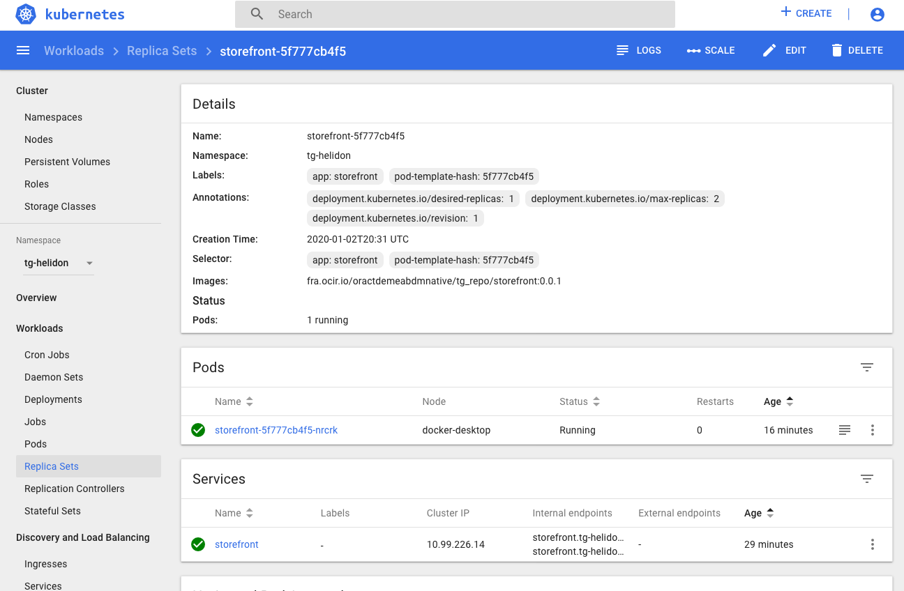
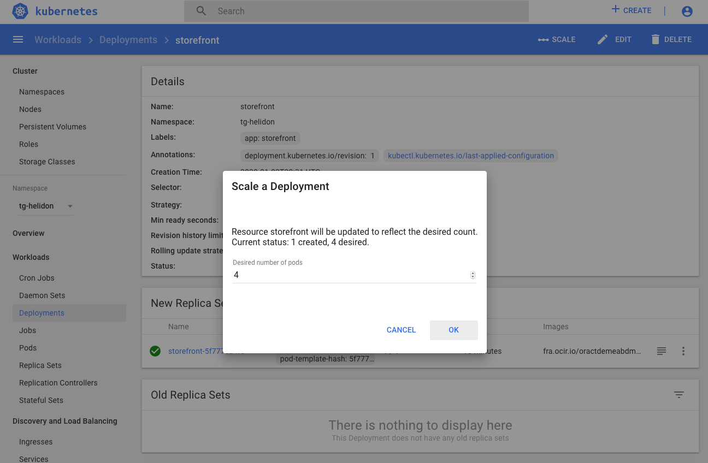
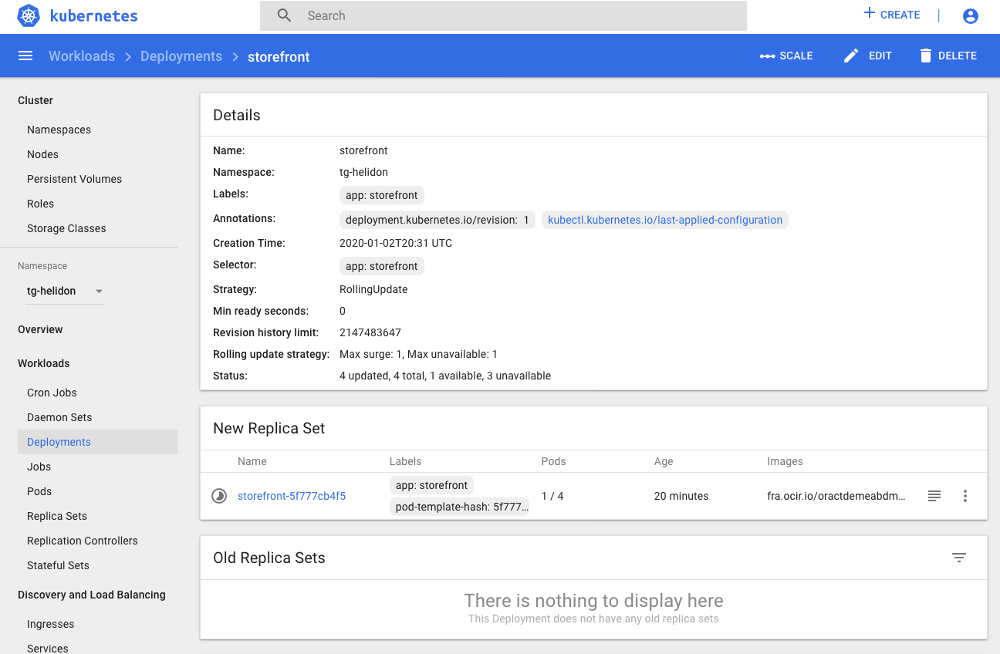
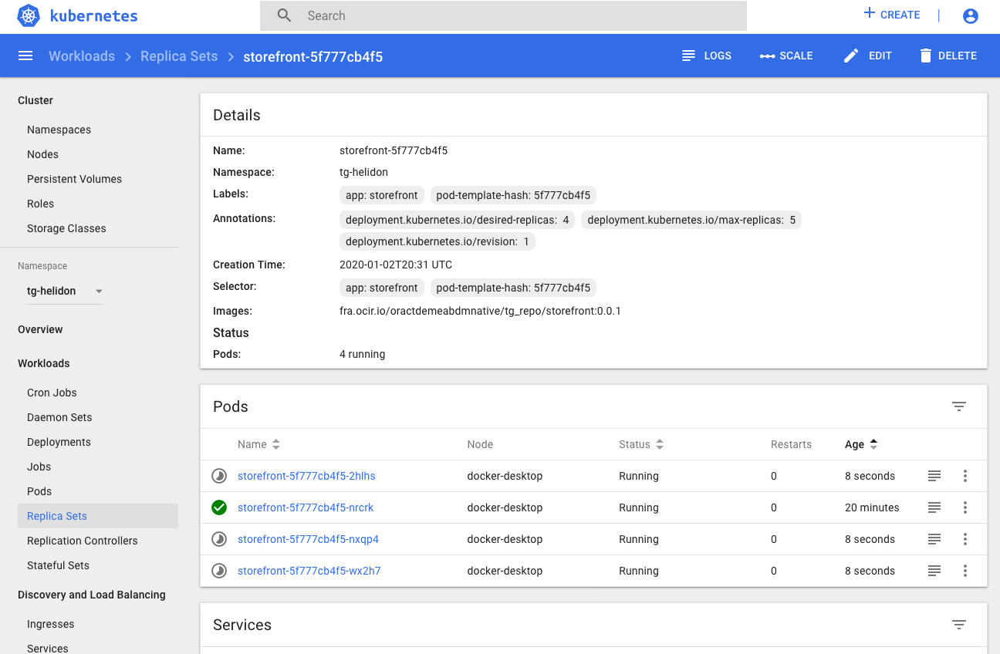
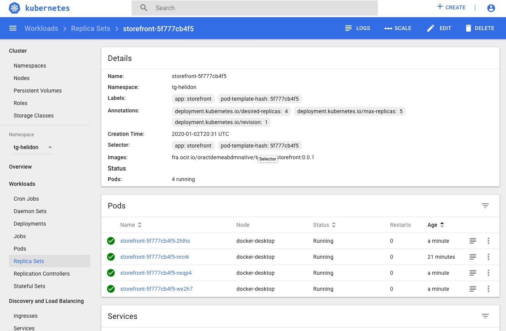
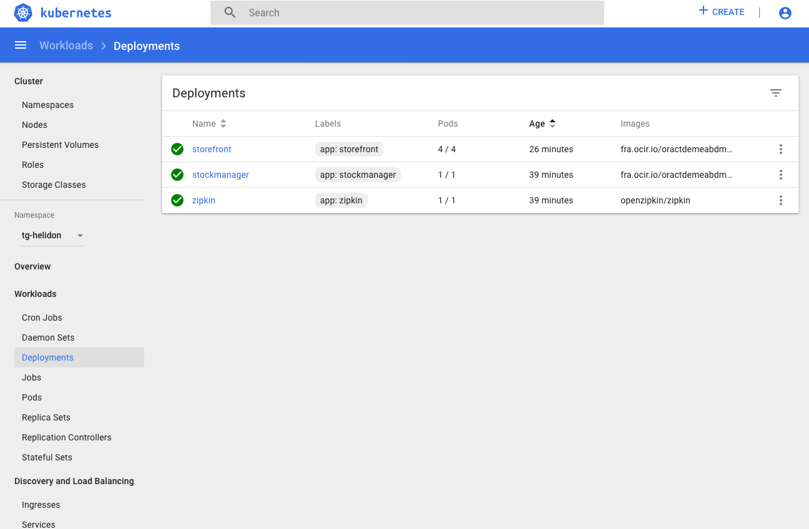
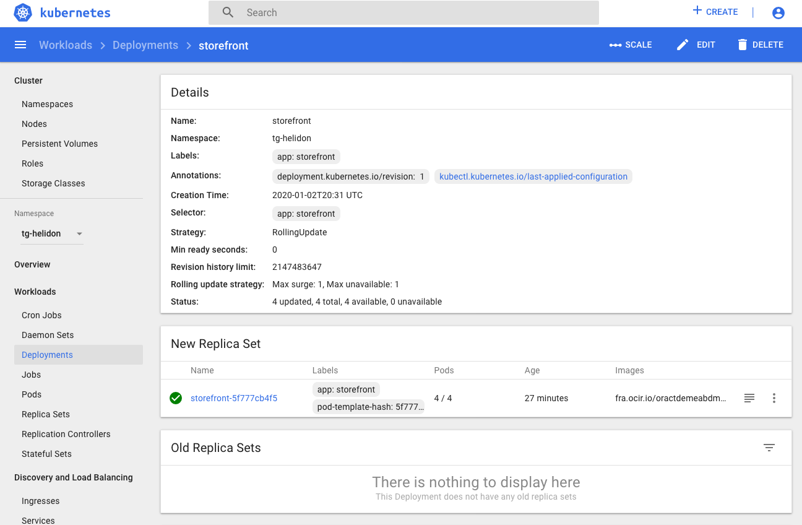
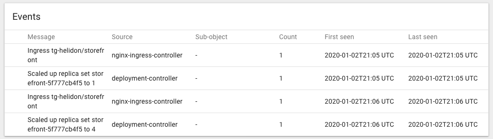

[Go to Overview Page](../Kubernetes-labs.md)


# Migration of Monolith to Cloud Native

## C. Deploying to Kubernetes
## 3a. Horizontal Scaling labs


<details><summary><b>Self guided student - video introduction</b></summary>
<p>

This video is an introduction to the Kubernetes horizontal scaling lab. Once you've watched it please press the "Back" button on your browser to return to the labs.

[](https://youtu.be/1hIQ5TRPt-M "Kubernetes horizontal scaling lab introduction video")

</p>
</details>

---

In most cases a microservice is horizontally scalable, at least if the services were developed using the principles defined in [The 12 factors](https://12factor.net/)

Kubernetes has built in support for easily managing the horizontal scaling of services.

### Manual scaling
In many of the labs when you've looked at the contents of the namespace you'll have seen things called replica sets, and may have wondered what they are. We can get this info using kubectl. 

- In the OCI Cloud Shell, type :
  -  `kubectl get all`

```
NAME                                READY   STATUS    RESTARTS   AGE
pod/stockmanager-6456cfd8b6-4mpl2   1/1     Running   0          118m
pod/storefront-74cd999d8-dzl2n      1/1     Running   0          152m
pod/zipkin-88c48d8b9-vdn47          1/1     Running   0          152m

NAME                   TYPE        CLUSTER-IP      EXTERNAL-IP   PORT(S)             AGE
service/stockmanager   ClusterIP   10.100.65.58    <none>        8081/TCP,9081/TCP   7h14m
service/storefront     ClusterIP   10.96.237.252   <none>        8080/TCP,9080/TCP   7h14m
service/zipkin         ClusterIP   10.104.81.126   <none>        9411/TCP            7h14m

NAME                           READY   UP-TO-DATE   AVAILABLE   AGE
deployment.apps/stockmanager   1/1     1            1           118m
deployment.apps/storefront     1/1     1            1           152m
deployment.apps/zipkin         1/1     1            1           152m

NAME                                      DESIRED   CURRENT   READY   AGE
replicaset.apps/stockmanager-6456cfd8b6   1         1         1       118m
replicaset.apps/storefront-74cd999d8      1         1         1       152m
replicaset.apps/zipkin-88c48d8b9          1         1         1       152m
```

You can see that there is a replica set for each deployment. They are actually implicitly defined in the deployment yaml files, though they don't have an explicit section the `replicas : 1` line tells the Kubernetes deployment to automatically create a replica set for us with one of the pods (as the pod is described later in the file.) If we hadn't specified the `replicas : 1` line it defaults to a single pod. Kubernetes will create a replica set automatically for us with a single pod for each deployment, and as we've seen in the health, liveness and readiness labs if there is a problem it will automatically restart the services so that there is one service available.

<details><summary><b>Deployments vs replica sets</b></summary>
<p>
In Kubernetes a deployment defines the micro-service, this is regardless of the service version.

A replica set manages a specific number of replicas for a specific version.

This is especially useful for things like rolling upgrades as we will see in that section.
</p></details>

We can if we want modify the number of replicas in the deployment by modifying the YAML and then re-applying it, or of course we could use the kubectl scale command to do it as well, but for this lab we're going to use the dashbaord.

- Open the dashboard and switch to your namespace (tg-helidon in my case) In the left menu under the workloads section chose Deployments


You can see our three deployments (Zipkin, storefront and stock manager) and in the Pods column we can see that each has 1 or 1 pods. Click on the storefront deployment for more details.


We can see the replica sets that match the deployment, and if we click on the replica set name we can see the details of it



- Go back to the storefront deployment.

Scaling the deployment is simple, :

- Click on the Scale Icon  
- In the new pop up enter the desired number of pods you want. Enter 4



- Click the Ok button

Kubernetes immediately gets to work creating new pods for us

<details><summary><b>Changing the number of replicas using kubectl</b></summary>
<p>
We can of course change the number of replicas using kubectl as well (it's just more visual using the dashboard)

To do this we can find out the current number of replicas in a deployment. Note that we operate at the deployment, not the replica set. If you tried changing the number in the replica set then you'll find that the deployment will come along and almost instantly reset the count to what the deployment thinks it should be, regardless of what you just told the replica set (I know this doesn't seem right when you first look at it, but it's sensible if you consider what happens in situations like a rolling update, more on which later.)

The following is an example showing how it could be done, please just look at these, but follow the lab and in this section only make changes in the dashboard.

First you would find out how many replicas you have in your deployment

```
$ kubectl get deployments
NAME           READY   UP-TO-DATE   AVAILABLE   AGE
stockmanager   1/1     1            1           4d2h
storefront     1/1     1            1           4d1h
zipkin         1/1     1            1           4d2h
```

Then you'd modify the number of replicas in the deployment, in this case to 2 replicas

```
$ kubectl scale --replicas=2 deployment storefront
deployment.apps/storefront scaled
```

Then you'd see how the upgrade was going

```
kubectl get deployments
NAME           READY   UP-TO-DATE   AVAILABLE   AGE
stockmanager   1/1     1            1           4d2h
storefront     1/2     2            2           4d1h
zipkin         1/1     1            1           4d2h
```

Notice that the deployment now says 1/2 meaning there is one running pod, but 2 are required. The reason we don't see both as being ready is because one is probably waiting for it's readiness checks to start running.

---

</p></details>

The deployment updates


And if we drill down into the replica set we can see the pods themselves being created


Remember that the storefront uses a readiness probe, so it may be a while before those pods are reporting ready, (and you may have to reload the page to get the updates) but once they are ready they will show up in the replica set as ready



And if we go back to the deployments list we'll see the pods is now 4 of 4 ready



Then looking at the storefront deployment itself we'll see


If on the deployments page we scroll down we'll see the list of events for that deployment, our scaling event is there !


If you are on a Kubernetes cluster with multiple physical nodes the scaling operation will try and place the pods on different nodes, protecting the service so if one node fails for any reason the other nodes can still be used to provide the service.

- To prepare for the following lab sections please go back to the storefront deployment and follow the approach described above to scale it back down to a single pod.

---

You have reached the end of this lab !!

Use your **back** button to return to the **C. Deploying to Kubernetes** section