[Go to Overview Page](../README.md)


# Migration of Monolith to Cloud Native

## D. Adding API Gateway 


### Introduction

---

A common approach in the Cloud Native Application Development is to expose backend APIs to outside world through a sort of gateway that can control and restrict the access to the APIs with much greater flexibility than that provided in the load balancer and ingress controller. Such component is called *API Gateway* and Oracle Cloud Infrastructure has an API gateway solution to address this need.

<details><summary><b>Some more words about OCI API Gateway</b></summary>
<p>

The Oracle Cloud Infrastructure API Gateway service enables you to publish APIs with private endpoints that are accessible from within your network, and which you can expose with public IP addresses if you want them to accept internet traffic. The endpoints support API validation, request and response transformation, CORS (Cross-Origin Resource Sharing), authentication and authorization, and request limiting.

Using the API Gateway service, you create one or more API gateways to process traffic from front-end clients and route it to back-end services. You can use a single API gateway to link multiple back-end services (such as load balancers, compute instances, and Oracle Functions) into a single consolidated API endpoint.

You can access the API Gateway service to define API gateways and API deployments using the OCI Console and the OCI REST API.

The API Gateway service is integrated with Oracle Cloud Infrastructure Identity and Access Management (IAM), which provides easy authentication with native Oracle Cloud Infrastructure identity functionality.

</p>
</details>

After running the previous labs, you've probably ended up with a architecture similar with the one in below picture:

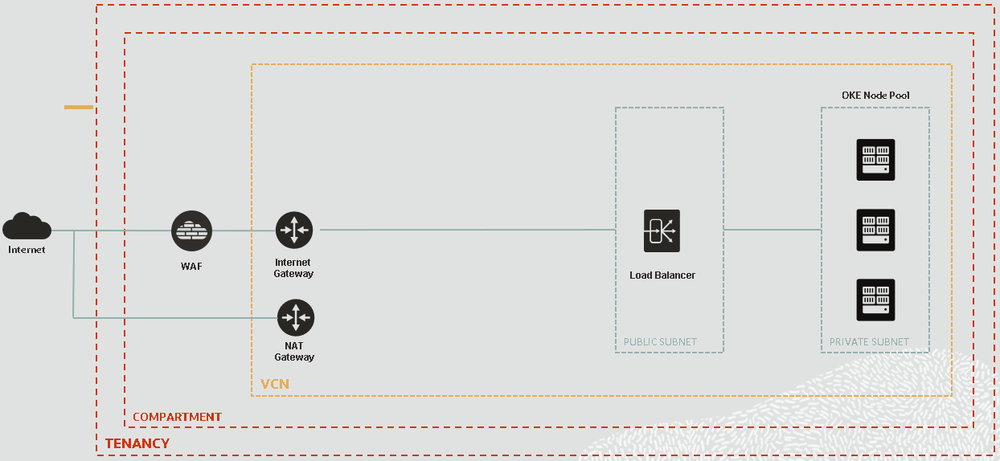

TG - Note, a number of the elements you can see were created automatically by the Cloud Infrastructure.

As you have created your OKE cluster using the *Quick create* workflow, the wizard also created for you:

- a Virtual Cloud Network (VCN)
- an Internet Gateway (IG) for allowing traffic from Internet
- a NAT Gateway (NAT) for allowing outbound access to Internet from Kubernetes worker nodes 

The Virtual Cloud Network has been pre-configured with two regional subnets:

- one Regional Private Subnet for the Kubernetes worker nodes
- one Regional Public Subnet for the Load Balancer Services

TG - Note that is it possible to have the Kubernetes worker nodes on a public network (it is an option in the cluster creation wizard) but it's generally not good practice, as it means you can't ensure they are protected from malicious actors on the internet.

So each of the Kubernetes worker node got an IP address within the Private Subnet network and each load balancer (for the K8s Dashboard or for the Ingress Controller) got an IP address within the Public Subnet.

Now, to get more control on how the backend REST services are exposed to and access from the Internet, we add an *API Gateway* component in our architecture.

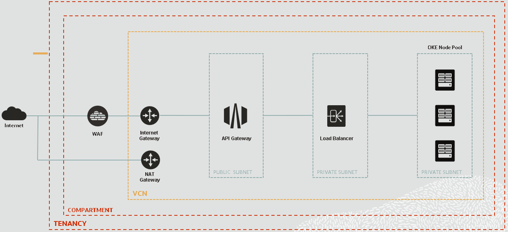

The *API Gateway* will sit in front of the *Load Balancer* and will handle the requests from Internet. As It needs to be visible from the Internet, it has to be part of a Public Subnet and have associated an Public IP address. The OCI API Gateways can be deployed also in Private Subnets, being visible only from internal network (in case you want to apply internal security rules, say to protect core systems) but in our case it will be used to serve public clients, so will be on a public internet facing network.

As the *Load Balancer* will accept requests only coming from the *API Gateway* the normal approach is to put it in a Private Subnet, without the need to have a Public IP address as before. This has the additional benefit of reducing the number of public IP addresses you need (and thus reducing costs.)


### Prepare Networking for API Gateway

---

The get to above target architecture, ideally, we would need to:

- Create a new Public Regional Subnet for the API Gateway
- Create a new Private Regional Subnet for the Internal Load Balancer
- Create required Security Lists
- Create  a new Load Balancer in the dedicated Private Regional Subnet
- Delete or reconfigure current Load Balancer to restrict Internet access

However, to make this lab simpler we will re-use the existing resources created when the Kubernetes cluster quick setup wizard ran, specifically the Public and the Private Regional Subnets.

It means that we only need to:

- Create a new Load Balancer in the existing Private Regional Subnet and configure associated Listener and Backend Set to point the the Kubernetes Worker Nodes
- Edit existing Private Regional Subnet Security List so that incoming traffic it's allowed to internal Load Balancer Listener port.

Later we will create the API Gateway in the existing Public Regional Subnet, so for this module we don't need to creating and configuring a dedicated subnet for it. We will leave existing Public Load Balancer configuration as-is for testing/workshop purposes (this makes it easuer to define other lab modules for people who have not done this module) but keep in mind that in a production environment you should only expose the backend REST services would be through the API Gateway, otherwise people could just bypass it!


#### Identify your Virtual Cloud Network 

To start we need to Identify the Virtual Cloud Network (VCN) that was created for you by the OKE *Create Cluster* Wizard.

Click the "Hamburger" menu  on the upper left, then in the `Developer Services` section click the `Container Clusters (OKE)` option. 

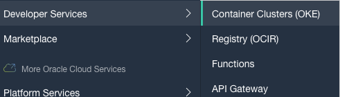

This will take you to the clusters list page

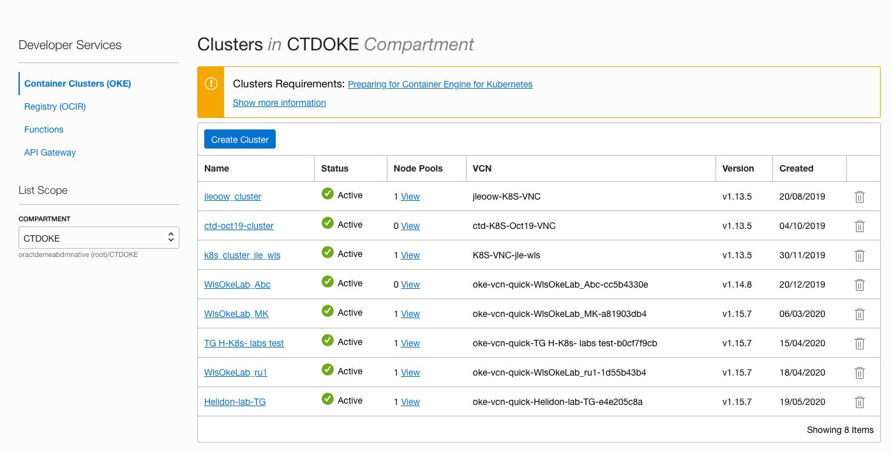

On the left side make sure it's the right compartment (CTDOKE was the one we recommended you use)

When you created the OKE Cluster, you named it `Helidon-lab-<YOUR-INITIALS>`. Locate that in the list and click on it's name to go to the details page for it

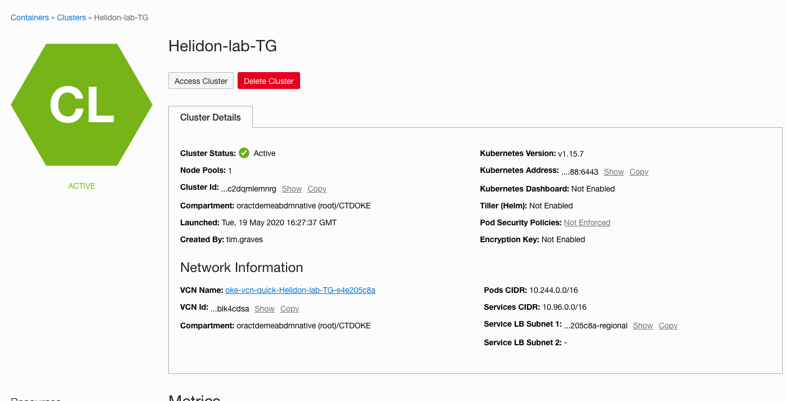

In the `Network details` section you'll see the VCN that was created for your cluster, in this case `oke-vcn-quick-Helidon-lab-TG-e4e205c8a` but yours will of course vary.

- Be sure to save the VCN name in a text editor, you'll need it later.

Click on the VCN name to see it's details page, you can see the two Subnets which were created for you in this Virtual Cloud Network.

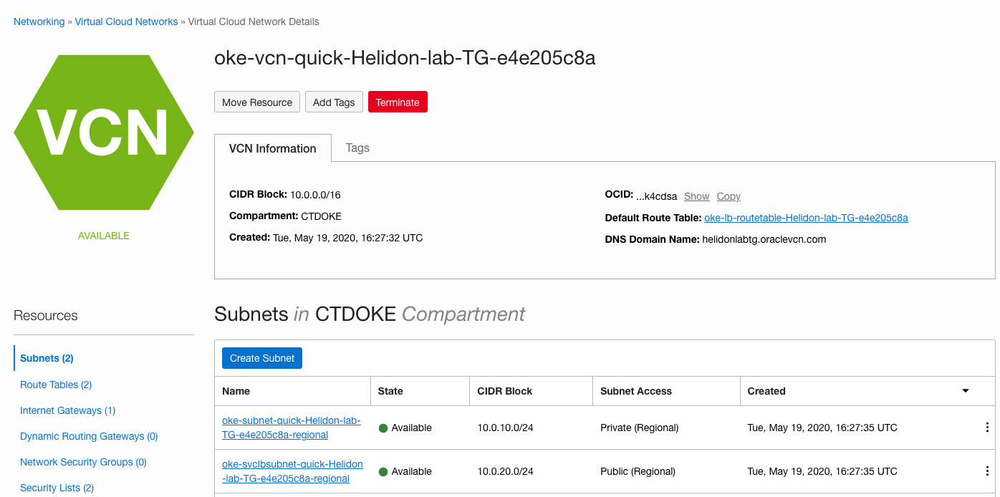

You can see that the Public Subnet Name, `oke-svclbsubnet-quick-Helidon-lab-TG-e4e205c8a-regional` in tis case (yours will of course be different) it's prefixed with `oke-svclbsubnet-quick`, so intended for the Load Balancers.


#### Inspect existing Load Balancer configuration

Next, before creating the Private Load Balancer, we need to inspect existing Load Balancer Configuration. This will help give us the information we need to creating the new Private Load Balancer, as that will use the same backend nodes as the public existing one.

<details><summary><b>Essential concepts when working with OCI Load Balancing</b></summary>
<p>
**Backend Server**.  An application server responsible for generating content in reply to the incoming TCP or HTTP traffic. You typically identify application servers with a unique combination of overlay (private) IPv4 address and port, for example, 10.10.10.1:8080 and 10.10.10.2:8080.

**Backend Set**.  A logical entity defined by a list of backend servers, a load balancing policy, and a health check policy. SSL configuration is optional. The backend set determines how the load balancer directs traffic to the collection of backend servers.

**Certificates**. If you use HTTPS or SSL for your listener, you must associate an SSL server certificate (X.509) with your load balancer. A certificate enables the load balancer to terminate the connection and decrypt incoming requests before passing them to the backend servers.

**Health Check.** A test to confirm the availability of backend servers. A health check can be a request or a connection attempt. Based on a time interval you specify, the load balancer applies the health check policy to continuously monitor backend servers. If a server fails the health check, the load balancer takes the server temporarily out of rotation. If the server subsequently passes the health check, the load balancer returns it to the rotation.

**Health Status**. An indicator that reports the general health of your load balancers and their components.

**Listener**. A logical entity that checks for incoming traffic on the load balancer's IP address. You configure a listener's protocol and port number, and the optional SSL settings. To handle TCP, HTTP, and HTTPS traffic, you must configure multiple listeners.

**Load Balancing Policy**.  A load balancing policy tells the load balancer how to distribute incoming traffic to the backend servers. Common load balancer policies include: *Round robin, Least connections, IP hash*.

**Path Route Set**. A set of path route rules to route traffic to the correct backend set without using multiple listeners or load balancers.

**Session Persistence**. A method to direct all requests originating from a single logical client to a single backend web server.

**Shape**. A template that determines the load balancer's total pre-provisioned maximum capacity (bandwidth) for ingress plus egress traffic. Available shapes include 10Mbps, 100 Mbps, 400 Mbps, and 8000 Mbps.

**SSL**. Secure Sockets Layer (SSL) is a security technology for establishing an encrypted link between a client and a server. You can apply the following SSL configurations to your load balancer:

- SSL TERMINATION: The load balancer handles incoming SSL traffic and passes the unencrypted request to a backend server.
- END TO END SSL: The load balancer terminates the SSL connection with an incoming traffic client, and then initiates an SSL connection to a backend server.
- SSL TUNNELING: If you configure the load balancer's listener for TCP traffic, the load balancer tunnels incoming SSL connections to your application servers.

**Virtual Hostname**. A virtual server name applied to a listener to enhance request routing.

**Visibility**. Specifies whether your load balancer is public or private.

- PUBLIC: A public load balancer has a public IP address that clients can access from the internet.

- PRIVATE: A private load balancer has a private IP address from a VCN local subnet. Clients can access the private load balancer using methods and technology that can provide access to a private IP, such as:

</p>
</details>


In order to identify the OCI Load Balancer associated with our OKE Cluster Ingress Controller, we can search it by the public IP address.

To get the IP address, run the following `kubectl` command using the OCI Cloud Shell:

- `kubectl get services -n ingress-nginx`

```
NAME                                          TYPE           CLUSTER-IP     EXTERNAL-IP      PORT(S)                      AGE
ingress-nginx-nginx-ingress-controller        LoadBalancer   10.96.196.6    130.61.195.102   80:31969/TCP,443:31302/TCP   26d
ingress-nginx-nginx-ingress-default-backend   ClusterIP      10.96.17.121   <none>           80/TCP                       26d
```

Note the **EXTERNAL-IP** address of *ingress-nginx-nginx-ingress-controller*.


Now, in the OCI Console,click the "Hamburger" menu on the upper left  In the `Core Infrastructure` section click `Networking` then `Load Balancers`

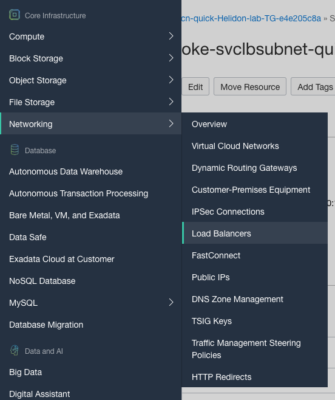

This will go to the load balancers page


Identify the Load Balancer with the above External IP address:

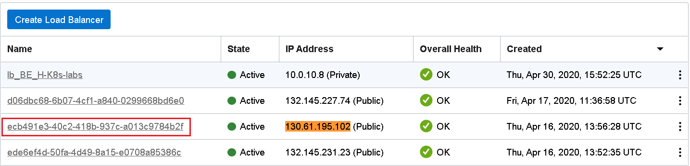

Click on the load balancer name to go to it's details page. (note this image was taken from a different cluster, so the VCN names don't match)


Now, in order to create a new Load Balancer with similar role (balancing traffic to Kubernetes worker nodes), we need to check for the backend nodes information and for the health check configuration.

On the lower left side in the resources menu click `Backend Sets`

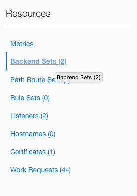

You should see two backend sets:

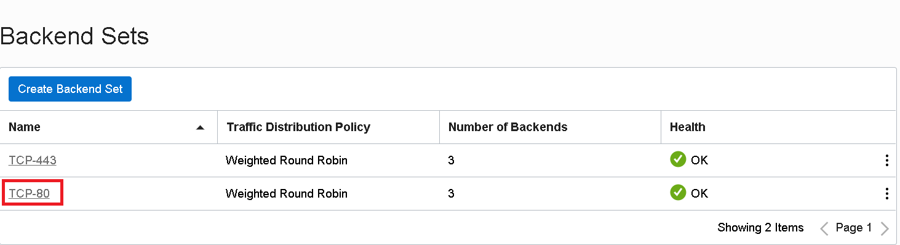


We are interested in **TCP-80** Backend Set information as we will forward plain http traffic to the worker nodes. Click on the Backend Set name (**TCP-80**).

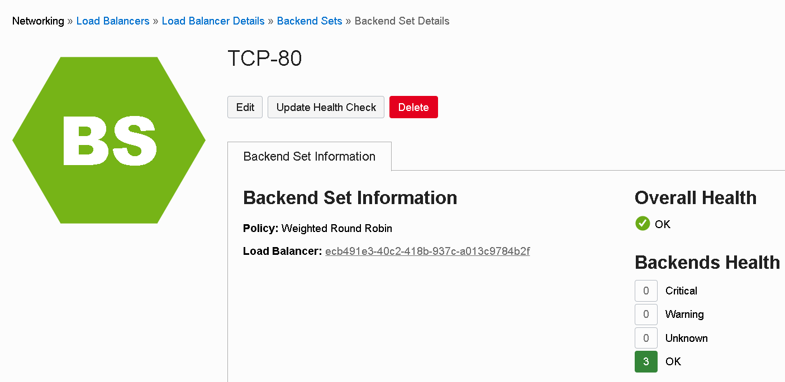


In the `Resources` menu click on `Backends`

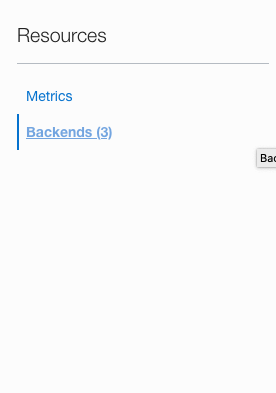

to inspect the Kubernetes workers:


Copy in a text editor or similar :

- the IP Addresses of the workers (in this example 10.0.10.2, 10.0.10.3 and 10.0.10.4)
- the listening port (in this example 31969)

Now, lets go back to the Backend Set information and click on `Update Health Check` button:


Copy all of the values for all the fields in the form into a text editor, here are the field names:

- Protocol
- Port
- Interval in ms
- Timeout in ms
- Number of retries
- Status code
- URL Path and
- Response body regex


<details><summary><b>What do these mean ?</b></summary>
<p>
To check the health of each of the backend nodes (and so know which are active to send requests to) the load balancer will try to connect to the service. If the connection succeeds then the load balancer will include it as it distributes the requests, if it fails then this particular instance will not be included in the load balancer pool of available service instances.

This particular health check will make a call using the `Protocol` (HTTP) on specified `Port` (10256) to the `URL Path` (/healthz) every `Interval in ms` (10000) with a time out of `Timeout in ms` (3000). Assuming the service responds (if it doesn't the load balancer assumes it's failed and retry the `Number of Retries` (3) times) the load balancer will check for the provided HTTP `Status code` (200 - OK) to see if it's what's expected. Optionally the load balancer can examine the response body to see if it matched the `Response body regex` (.* means basically there is some response)

</p></details>

Now, we have collected all information to create our private Load Balancer.


#### Create Private Load Balancer

Go to Load Balancers Dashboard page (Hamburger Menu -> `Core Infrastructure` section -> `Networking` -> `Load Balancers` )


On the load balancers list Choose the `Create Load Balancer`:


Fill in the form

- Give a name, like `Helidon-Lab-<YourInitials>-privatelb` (of course you use your personal initials here !)

- Choose `Private` for the Visibility

- Chose `Small 100Mbps` as the shape:


Scroll down to select the existing VCN and Subnet. 

- Choose the Virtual Cloud Network your OKE cluster runs on from the list (you identified this above)

- For the subnet chose the `oke-svclbsubnet-quick-[...]` from the list

- Click the `Next` button


Leave the policy as `Weighted round robin`

We will add the backends information later on, after creating the Load Balancer


Scroll down to setup the `Health Check Policy`. Here make sure to provide the same values we gathered from the existing Load Balancer Health Policy (see above section, `Inspect existing Load Balancer configuration`):

The following is an example based on the settings in our deployment, you may find the port varies in your environment.

- **Protocol**: `HTTP`
- **Port**: `10256`
- **Interval in ms**: `10000`
- **Timeout in ms**: `3000`
- **Number of retries**: `3`
- **Status code**: `200`
- **URL Path**: `/healthz`
- **Response body regex**: `.\*`


Click `Next` to get to last section of the wizard. Here we configure the a listener for the Load Balancer. With the new topology, having API gateway in front of the internal Load Balancer and the worker nodes, it's sufficient to setup a `HTTP` type of listener as the API Gateway will listen only on HTTPS (443), do SSL offloading and then direct the traffic to the private load balancer. 


You can overwrite the default `Listener Name` if you like. Leave the default http port `80`. Click the `Submit` button to trigger Load Balancer provisioning.


 

After some moments, the Load Balancer should become `Active`. Take note of the `IP Address` allocated to the Load Balancer. We will need this information later on, when we'll configure the API Gateway backend routes.


We need now to associate the Kubernetes backend worker nodes. From the details page for your newly created Load Balancer in the `Resources` menu click the `Backends Sets` option.


 Click on the existing backend set name:


Now, go to `Backends` menu option of the backend set page. Click on `Add Backends`:

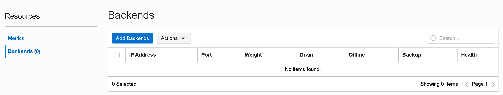


Choose to add backends by entering *IP ADDRESSES*. It's easier to add Kubernetes worker nodes this way as we already have the IP addresses and as it might be more difficult to identify the compute instances in a shared environment. Fill in the *IP ADRESSES* and the *PORT* information. Leave default weight as we want the load balancer to equally distribute the requests. Click `Add` to add the backends.

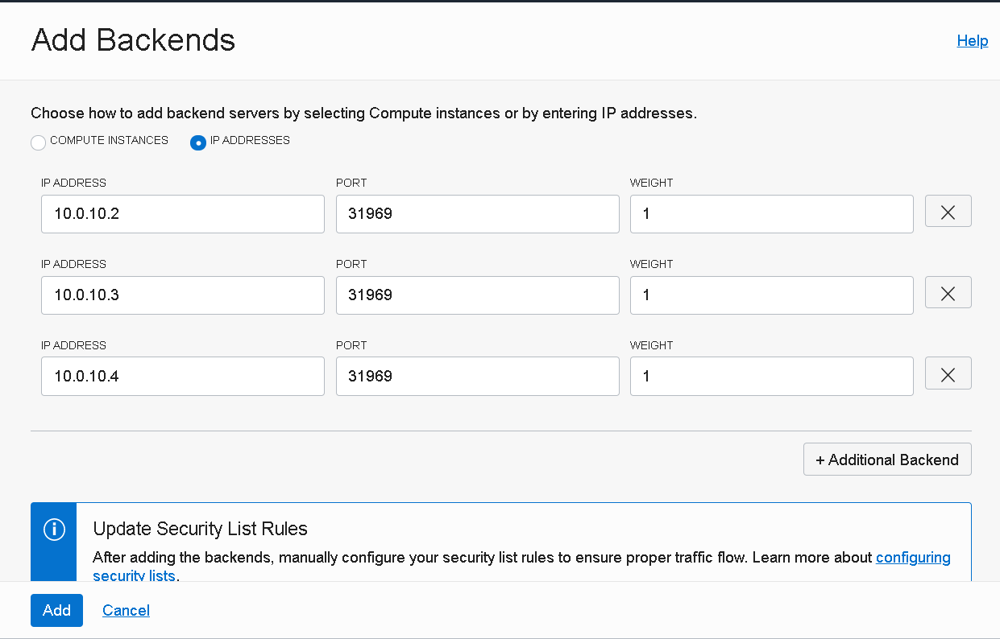


The Backend nodes should be listed now:


**Important**: as we have manually created this Load Balancer - and not through OKE service as when deploying an app with attached load balancer service - any change to the backed Kubernetes worker nodes will not be reflected by the Load Balancer Backend Set configuration. This includes changes of IP addresses, adding or removing worker nodes, changing application listen ports, etc. 


If we return to the Backend Set information, we should see that the backend servers number jumped to 3 and that there's no unhealthy backend server:


#### Add required Ingress Rule

Last thing that we need to do is to allow traffic from the Public Regional Subnet to  the newly created private Load Balancer. Incoming traffic from the Public Subnet to the Private Subnet compute nodes is currently possible - as the Public Load Balancer is able to reach out the Kubernetes worker nodes - but it is allowed only to the ports used by the Kubernetes nodes, and not for the port 80 of the new Load Balancer. To permit this, we need to define a new *Ingress Rule* in the associated *Security List* of the Private Subnet.

Let's go to the `Virtual Cloud Network`s dashboard page and choose our Kubernetes VCN (the one identified above, with the name *oke-quick-Helidon-Lab-YourInitials-[...]*):


Click on the Private (Regional) Subnet name, it should be the one prefixed with *oke-subnet-quick-[...]*:

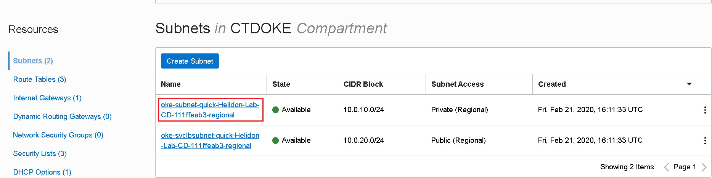


There should be one security list associated with the Private Subnet. Click on the security list name:

### 


Check the `Ingress Rules`:

 


We need to add a new rule that will allow HTTP traffic from the Public Subnet network to this Private Subnet on port 80 (or to a custom port if you've overwritten the default 80 port in the Load Balancer Listener configuration). Click on `Add Ingress Rules`:


Make sure you set the same *Source CIDR* as the existing rules that allow traffic to 22 or 31969 ports. Click on `Add Ingress Rules`.

Now everything should be in place from networking perspective and we are ready to move on creating the API Gateway.


### Create and Configure OCI API Gateway

---

For creating and configuring an API Gateway, we have to:

- create an OCI API Gateway instance that will run in a certain Virtual Cloud Network and Subnet(s); in care of a public API Gateway it will have a dedicated and unique endpoint accessible from public Internet.
- create an API Deployment for the OCI API Gateway that will define a sub-resource of the API Gateway alongside routing rules and policies that have to be enforced (we refer here at specific OCI API Gateway policies, not to be confused with IAM policies of the Oracle Cloud Infrastructure)


#### Create API Gateway

From the main menu go to `Solutions and Platform`, then  `Developer Services` and `API Gateway`:


Make sure you are on the same compartment; click `Create Gateway`:


Give a meaningful name for the gateway, for example *Helidon-Lab-YourInitials-apigw*; select the Virtual Cloud Network that we've been using until now and its Public Regional Subnet (prefixed with *oke-svclbsubnet-quick-[...]*); click `Create` to create the gateway:


After some moments, the API Gateway should be available and active. Take notice of the *Hostname* value.


#### Inspect Kubernetes backend service

Before creating the OCI API Gateway Deployment we need to know what are the REST resources that we need to route to / expose using the gateway.  We can easily do this by taking a look at the Open API specification of the StoreFront backend service. As the initial public Load Balancer it's still up & running, we can download the specification using the browser. Open in a new browser tab:

> http://[LB Public IP address]/sf/openapi

This will download an *openapi* file in .yaml format:

```yaml

components: 
  schemas:
    ItemDetails: 
      required:
      - itemCount
      - itemName
      properties:
        itemCount: 
          description: The number of items listed as being available
          example: '10'
          format: int32
          type: integer
        itemName: 
          description: The name of the item
          example: Pencil
          type: string
      description: Details of the item in the database
      example: '[{"itemCount": 470, "itemName": "Pencil"},{"itemCount": 50, "itemName":
        "Eraserl"},{"itemCount": 4600, "itemName": "Pin"},{"itemCount": 100, "itemName":
        "Book"}]'
      type: object
    ItemRequest: 
      required:
      - requestedCount
      - requestedItem
      properties:
        requestedCount: 
          description: Number of the items being requested, this must be larger than
            the minimumChange
          example: '5'
          format: int32
          type: integer
        requestedItem: 
          description: Name of the item being requested
          example: Pin
          type: string
      description: Details of a Item reservation request
      example: '{"requestedItem", "Pin", "requestedCount",5}'
      type: object
info: 
  description: Acts as a simple stock level tool for a post room or similar
  title: StorefrontApplication
  version: 0.0.1
openapi: 3.0.1
paths:
  /store/reserveStock: 
    post: 
      description: reserves a number of stock items in the database. The number of
        stock items being reserved must be greater than the defined minimum change
      requestBody: 
        content:
          application/json: 
            schema: 
              $ref: '#/components/schemas/ItemRequest'
        description: The details of the item being requested
        required: true
      responses:
        '404': 
          description: The requested item does not exist
        '406': 
          description: The requested change does not meet the minimum level required
            for the change (i.e. is <= the minimumChange value)
        '409': 
          description: There are not enough of the requested item to fulfil your request
        '200': 
          content:
            application/json: 
              schema: 
                $ref: '#/components/schemas/ItemDetails'
          description: The updated stock details for the item
      summary: Reserves a number of stock items
  /store/stocklevel: 
    get: 
      description: Returns a list of all of the stock items currently held in the
        database (the list may be empty if there are no items)
      responses:
        '200': 
          content:
            application/json: 
              schema: 
                items: 
                  $ref: '#/components/schemas/ItemDetails'
                type: array
          description: A set of ItemDetails representing the current data in the database
      summary: List stock items

```


Look at the *paths* section. We need to exposed following resources:

- **/store/reserveStock** - **POST** method
- **/store/stocklevel** - **GET** method


#### Create API Deployment

In the OCI API Gateway details page, navigate to `Deployments` from the left hand side menu. Click on `Create Deployment`:


We see two options: either to created the API Deployment from scratch (using the UI wizard) or to use an OCI API Deployment  specification in .json format. We can define the routing and access policies using any of the options, but for lab we choose for the UI wizard.

Give the API Deployment a *Name*, for example **StoreFront**. For the *Path Prefix* we can set **/sf** to keep the same context root as the backend Kubernetes service. So any REST resource we expose through this API Deployment it will be prefixed with **/sf**.

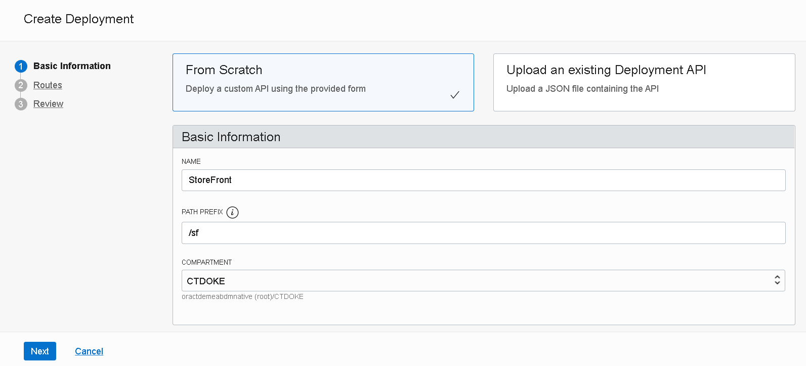


Scroll down to the *API Request Policies*. Here we can define several types of policies that we can attach to the API Deployment:

- *Authentication* - this allows us to enforce authentication and authorization for the API
- *CORS* - configuring CORS access, useful if the APIs will be called directly from JS client-side frontend applications like web or hybrid mobile applications
- *Rate Limiting* - limits fulfilling incoming calls to a specific rate

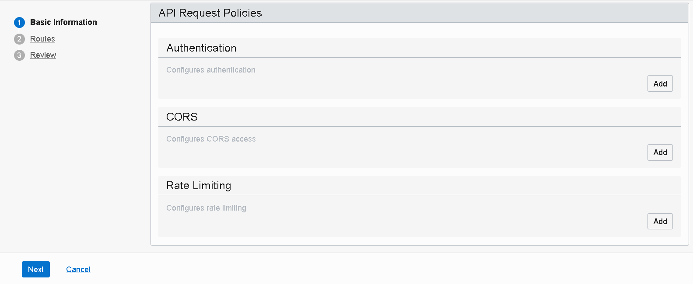


Before moving forward, let's add a request policy that will limit the number of calls. Click on the `Add` button in the *Rate Limiting* section. Setup:

- **Number of requests per second:** `2`
- **Type of Rate limit**: `Per client (IP)`

Click `Save Changes`:


This will limit to **2** the total number of calls per second (to any of the API resources) that a client can perform. Any subsequent call in the time frame window of 1 second will be denied.

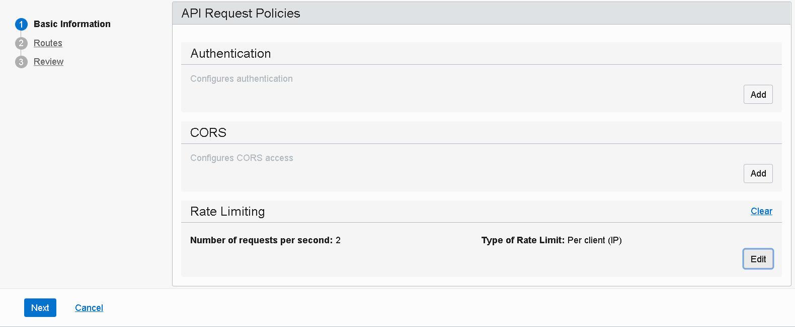


Scroll down to check the *Logging Policies* that we can activate. You can enable or not the *Access Logs* or the *Execution logs*. Click `Next`:


Now we need to define each route that this API Deployment will support.  For each resource in the *openapi* document we'll define a *Route* here. At the moment of writing this article, a feature to allow the API Deployment wizard to dynamically discover all resources exposed by a backend service using it's openapi definition was not yet general available. But our service has only two resources to expose, so it's easy to add them manually.

For each of the paths inspected in the previous section, add a *Route*:

- **PATH**: `/store/reserveStock`
- **METHODES**: `POST`
- **TYPE**: `HTTP`
- **URL**: `http://[Private Load Balancer IP]/sf/store/reserveStock`
- leave the timeout options as default

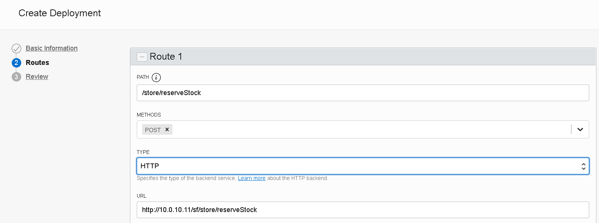


Scroll down and click `+Another Route`. Fill in:

- **PATH**: `/store/stocklevel`
- **METHODES**: `GET`
- **TYPE**: `HTTP`
- **URL**: `http://[Private Load Balancer IP]/sf/store/stocklevel`
- leave the timeout options as default


We also want to expose the *openapi* specification of the backend service, so we add a third route; Fill in:

- **PATH**: `/openapi`
- **METHODES**: `GET`
- **TYPE**: `HTTP`
- **URL**: `http://[Private Load Balancer IP]/sf/store/openapi`
- leave the timeout options as default


Click on the `Next` button of the wizard to *Review* the API deployment; Click `Create`:


After some moments, the API Deployment should be available and active:


Check the base endpoint of the API Deployment. This will be the base URL that the end-clients will be using:

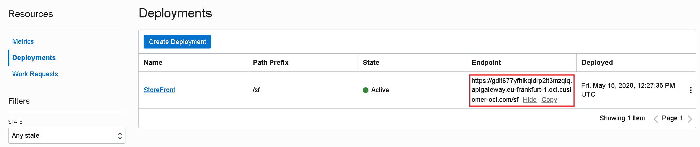


### Testing using cURL

---

The last step is to test the StoreFront services - and implicit the API Gateway. The simple way of doing this, without installing any software tool or browser add-on, it's by using `cURL` command and the Cloud Shell environment. If you can install software and/or if you already have Postman on your local machine, you can jump to the `Testing using Postman` section.


To launch the Cloud Shell, click on the `>_` icon in the header bar of the Cloud Console:


The shell console will load at the bottom of the web page:

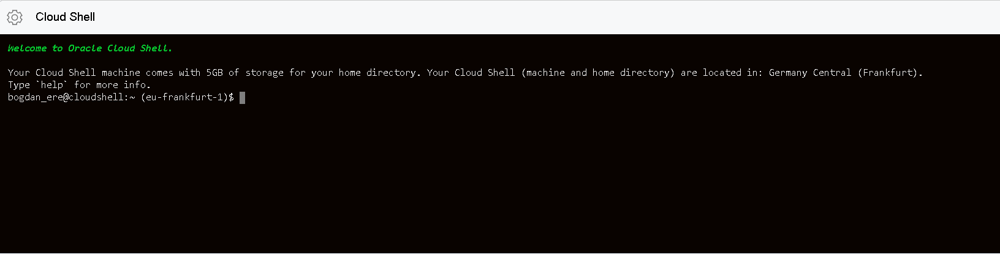


First method that we are going to test, is the one that retrieves the items in stock:

> curl -i [API Gateway Deployment Endpoint]**/store/stocklevel**

Example:

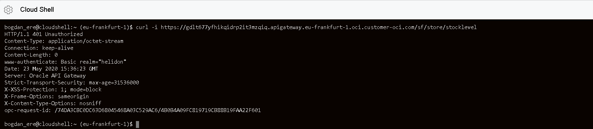


As we can see, there's no response body in the answer as we need to authenticate for calling the StoreFront service. The service requires basic authentication and for that we need to send the `Authorization` header with the following value:

> Basic [base64 encoded username and password]


To get the base64 encoded authentication string, just run the following command:

> echo -n '[username]:[password[' | base64


For example:

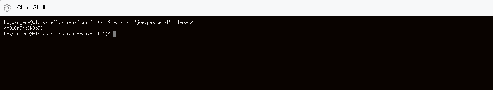

In the case you use the `joe` username and `password` password, the basic64 authentication token is `am9lOnBhc3N3b3Jk`.


Now let's run the `cURL` command again , this time adding the `Authorization` header:

> curl -i -H "Authorization: Basic [base64 token]" [API Gateway Deployment Endpoint]/store/stocklevel


Example:


This time we get a response body in the answer!

Next, let's try to reserve 10 Pencils:

> curl -i -X POST -H "Authorization: Basic [base64 token]" -H "Content-Type: application/json" -d '{"requestedCount": 10, "requestedItem": "Pencil"}' [API Gateway Deployment Endpoint]**/store/reserveStock**


Example:

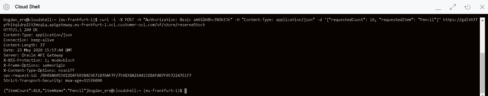


We see that the service replies back with the updated information about Pencils stock. Let's check again the list of items in stock:

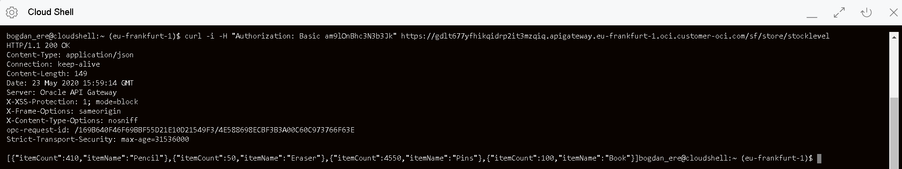


As expected, the answer is consistent with the reserve call response.


### [Optional] Testing using Postman

---

One other easy and visual way of testing  the StoreFront services is using Postman. It allows us to save the REST calls configuration and to group them by Collections and Folders.


#### Import StoreFront *openapi* specification

Launch Postman, click on `Import` button in the upper left menu toolbar, choose `Link` in the *Import* window option tabs.

Enter the URL of our API Deployment to which we append `/openapi` (remember that we have created a Route to expose the *openapi* specification document). Click `Continue`:


Leave default options in the next screen; click `Import`:


We can see that Postman has generated a collection with the two methods:

- **POST** for reserving stock items
- **GET** for listing stock items


Before testing, we need to setup the Authentication method and the *baseURL* variable of the collection. Go to *StorefrontApplication* collection menu, and click on `Edit`:


Go to `Authorization` tab, choose `Basic Auth` for the authentication **Type**; setup:

- **Username**: `joe`
- **Password**: `password`


Go to `Variables` tab and setup the *baseUrl* Postman variable. This variable will be used for all Collection resources, so we can change the endpoints base URL in one single place. For **Current Value**, set the same API Deployment URL that we used before; click `Update`:


#### Testing

First, let's test the *List stock items* method. Click on the method name in the *StorefrontApplication* collection methods list:


In the `Authorization` tab, switch to `Inherit auth from parent`. This will propagate the Basic auth type that we've setup at collection level. Click `Send`:

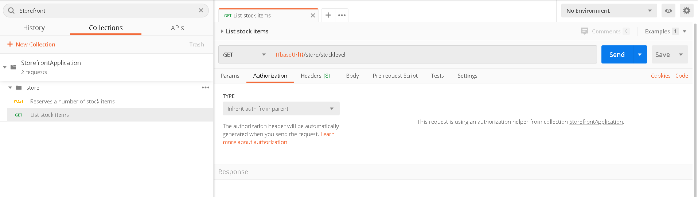


The list of items it's returned:


Let's now try the other method, to reserve some stock items.  Similarly, setup `Inherit auth from parent` in the `Authorization` tab:


In the `Body` tab, we can see that the request structure has been generated accordingly with the schema defined in the *openapi* specification. Let's reserve 50 pencils:

- **requestedCount**: `50`

- **requestedItem**: `Pencil`

  Click `Send`:

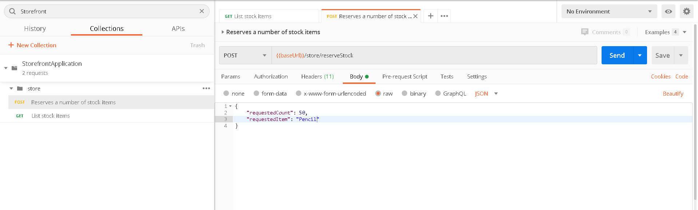


We can see from the response that the pencils stock dropped by 50, in this case to 420:


Let's test the *List stock items*  method again:


### Check API Gateway Metrics

---

After we have done some testing, if we open our API Gateway details page in OCI Console, we can see some activity:

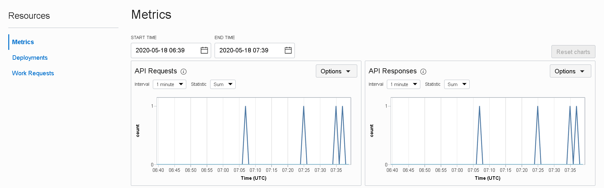


In case we have multiple API Deployments for the same API Gateway, we can check the activity at API Deployment level:

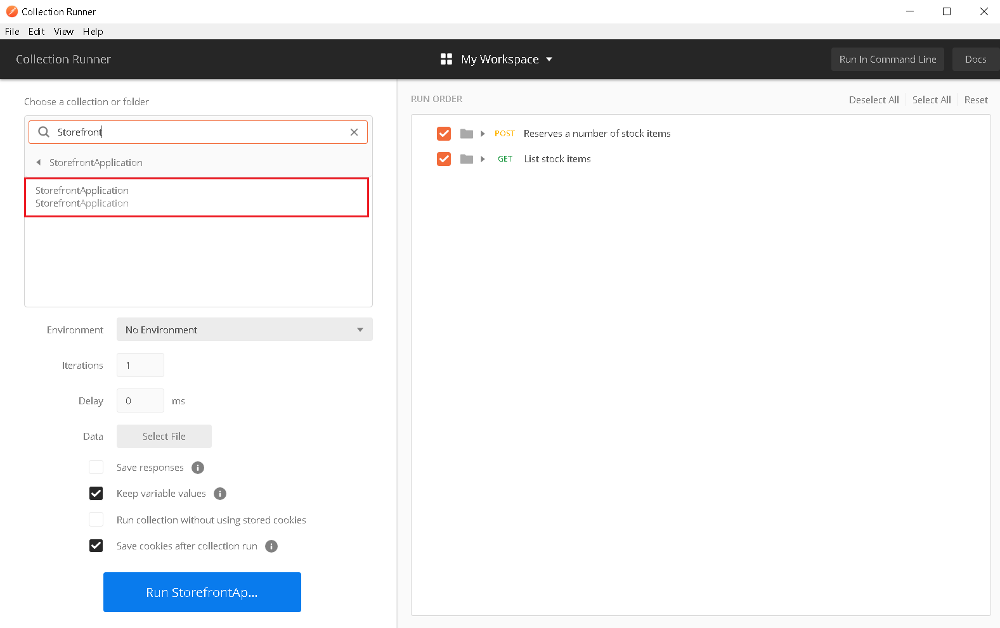
