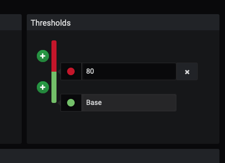

[Go to Overview Page](../Kubernetes-labs.md)


# Migration of Monolith to Cloud Native

## C. Deploying to Kubernetes
## 3. Visualizing using Grafana

### **Introduction**
As we've seen while Prometheus can gather lots of data it's not exactly the most powerful visualization mechanism.

Grafana on the other hand is a very powerful open source visualization engine and it can take data from many sources, including Prometheus.

One point on rafana, the core engine is Open source with all that indicates, however some of the additional component features (for example specific dashboard configurations, plugins for graph types etc.) are not open source and are chargable, for this lab we will only use a small subset of the features that are open source.

### Installing Grafana
Like many other Kubernetes services Grafana is available to install using helm. By default the helm chart does not create a volume for the storage of the grafana configuration. This would be a problem in a production environment, so we're going to use the persistent storage option defined inthe helm chart for Grafana to create a storage volume. Note this is specific to the helm chart, helm charts for different services may do this automatically (e.g. the chart for Prometheus) may use a different property setting, or may not provide an option at all. You'll need to look at the documentation for your specific chart.
In a terminal window type

```
$ helm3 install grafana --namespace monitoring stable/grafana --set persistence.enabled=true
NAME: grafana
LAST DEPLOYED: Tue Dec 31 11:59:27 2019
NAMESPACE: monitoring
STATUS: deployed
REVISION: 1
NOTES:
1. Get your 'admin' user password by running:

   kubectl get secret --namespace monitoring grafana -o jsonpath="{.data.admin-password}" | base64 --decode ; echo

2. The Grafana server can be accessed via port 80 on the following DNS name from within your cluster:

   grafana.monitoring.svc.cluster.local

   Get the Grafana URL to visit by running these commands in the same shell:

     export POD_NAME=$(kubectl get pods --namespace monitoring -l "app=grafana,release=grafana" -o jsonpath="{.items[0].metadata.name}")
     kubectl --namespace monitoring port-forward $POD_NAME 3000

3. Login with the password from step 1 and the username: admin
```

Like many helm charts the output has some useful hints in it, specifically in this case how to get the admin password and setup port-forwarding using Kubectl.

Let's get the login password. In a ***new*** terminal window type 

```
$  kubectl get secret --namespace monitoring grafana -o jsonpath="{.data.admin-password}" | base64 --decode ; echo
wzuiF89rmm2g671fdAkeyZ7GxGrpK71rdCD6YxBd
```

Copy and paste the password (mine starts with `wzui`, but of course yours wil vary) into a text editor so you can use it later.

In the same new terminal window let's setup the port forwarding (the kubectl command won't return to the command prompt but will keep running)

```
$ export POD_NAME=$(kubectl get pods --namespace monitoring -l "app=grafana,release=grafana" -o jsonpath="{.items[0].metadata.name}")
$ kubectl --namespace monitoring port-forward $POD_NAME 3000
```

Now in the browser open a new tab and go to http://localhost:3000

You'll be presented with the Grafana login window


If it's not already there enter admin as the user name and then use the Grafana password you copied a few moments ago. Press enter to login and go to the Grafana initial config page


Before we can do anything useful with Grafana we need to provide it with some data. Click the "Add Data Source" icon to start this process


As we're using Prometheus for our data collection select it from the list


Un the URL field we need to enter the details we got then we installed prometheus. Assuming you used the same name for the helm install and the monitoring namespace this will be `http://prometheus-server.monitoring.svc.cluster.local`

The other values we can leave for now, click the "Save & Test" button at the bottom of the screen. Assuming you entered the details correctly it will report that it's done the save and that the data source is working


Click the "Back" button at the bottom of the page or the grafana logo  at the top left to return to the Grafana home page


We now need to configure a dashboard that will display data for us, Click the "New Dashboard" button to start the process


In the new Panel click the add query button to define the data we want to retrieve


In the Meter dropdown select `application:list`, then `application:list_all_stock_meter_one_min_rate_per_second`. 


You may recall that this it the data set for the number of list stock requests made per second.

Once you've selected it then the display will update with the graph you've selected


One difference you're likely to see in the image above compared to your display is that there are actually two pods listed in the legend one as a green line in the chart, the other as orange, this is because I was testing another part of the lab and re-started the pod. It does however bring up an important point. What would happen if there were *multiple* pods providing this service, how would we get the data for all of them combined ?

It turns out to be very simple, Grafana is making the request to Prometheus for the data using the Prometheus query language, so we can just use the ***SUM*** function in the language to combine all of these. Click in the metics box and change it to `sum(application:list_all_stock_meter_one_min_rate_per_second)` then press return


Now any pod that provides the `application:list_all_stock_meter_one_min_rate_per_second` data will be part of the total, giving us the total rate across all of the pods.


Make a few requests using curl to generate some new data

```
$ curl -i -X GET -u jack:password http://localhost:80/store/stocklevel
HTTP/1.1 200 OK
Server: openresty/1.15.8.2
Date: Tue, 31 Dec 2019 15:37:01 GMT
Content-Type: application/json
Content-Length: 184
Connection: keep-alive

[{"itemCount":4980,"itemName":"rivet"},{"itemCount":4,"itemName":"chair"},{"itemCount":981,"itemName":"door"},{"itemCount":25,"itemName":"window"},{"itemCount":20,"itemName":"handle"}]
```

After a bit of time for Helidon to update it's metrics, Prometheus to get round to scraping them and for Grafana to get round to retrieving and displaying them we see the updated in the chart.


If it hasn't updated after a bit you can force the screen to update, click the refresh icon on the upper right  This is only a visuals update, if the scraping hasn't retrieved the updated data then you'll just have to wait for it to happen.

Once we've defined the query then we can look at the way it's displayed. On the left click the Visualization image 


You can chose the visualization type you want, just click the Graph icon next to the "Visualization" label  to see the selection appear in a grid. For now we're going to leave this as a Graph, but if you want try clicking on some of the other options to see what they display, not all data makes sense in all visualization types though (remember to go back to Graph if you do experiment)

For now (as there is only a single set of numeric data) we are going to leave this as a line graph, but we'll make it a little more interesting, in the Draw options make sure that Bars and Points are turned off and Lines is turned on. In Mode options set Fill to 3, Fill Gradient to 10 and Line Width to 10.


Click on the General icon  then in the Title field enter a suitable title (I chose `Stock Listing Requests per second`)


Click the Back arrow at the top left  to return to the New Dashboard

Now we see out dashboard with a graph panel


Of course this looks pretty basic, It's good to see how many requests we're getting, but let's add an additional panel to give us a history of how fast the service is working. Click on the Add Panel icon on the upper right  The process is basically the same as before, so I won't go into as much detail


Chose the Add Query option

Enter `avg(application:com_oracle_labs_helidon_storefront_resources_storefront_resource_list_all_stock_timer_mean_seconds)` in the metics field (it's best to just copy and paste this as the labels tend to overflow the popups)


Move to the Visualization tab and leave Graph as the type, set the Draw Modes to have both Bars and Lines enabled


Move to the General settings tab and title the panel "Response Times


Then hit the Grafana back arrow  to return to the New Dashboard


We're going to add a 3rd panel with a different visualization type, we're going to go for a dial graph that gives us a view of the most recent data.

Click the add panel icon  

Chose "Add Query" as the type

For the metrics enter `application:com_oracle_labs_helidon_storefront_resources_storefront_resource_list_all_stock_timer_mean_seconds`


On the Visualizations page we're going for a different visualization type. Click the Graph option  to get the list of options


From the menu Chose the Gauge option, the display will update to show a gauge.


In the Display section make sure that both Labels and Markers are enabled


In the field section set the  title to be `Current Response Time` the Unit to be seconds (under time in the dropdown) and set the Min to be 0 and Max to be 5


In the Thresholds 



Click the + button next to the Green bar to get an additional threshold band


In the text boxes representing the thresholds set the Red threshold to be 4 and the yellow threshold to be 1


The final overall display should look something like this


On the General settings remove the Title text so the panel has no visible title (we're using the label in the gauge itself)


Click the Grafana back arrow  to return to the New Dashboard


This however looks a but rigid on the screen space, let's re-arrange these a bit. Click on the working of the middle panels title (Response Times) and drag it to the right of the gauge panel. Now it's a bit easier to look at


Lastly we need to rename out panel, after all "New dashboard" is not especially descriptive. Click on the dashboard settings icon  on the upper right of the window

In the settings page give it a name, let's use `Stock Listing performance` and *disable* the editing option


Then click the Save button then the Back arrow  

Using the duration dropdown in the upper right  change the duration to be the last 5 mins 

Now make a bunch of curl requests to get some new data

```
$ curl -i -X GET -u jack:password http://localhost:80/store/stocklevel
HTTP/1.1 200 OK
Server: openresty/1.15.8.2
Date: Tue, 31 Dec 2019 18:03:39 GMT
Content-Type: application/json
Content-Length: 184
Connection: keep-alive

[{"itemCount":4980,"itemName":"rivet"},{"itemCount":4,"itemName":"chair"},{"itemCount":981,"itemName":"door"},{"itemCount":25,"itemName":"window"},{"itemCount":20,"itemName":"handle"}]
```

and after it updates it'll look something like 


### More complex dashboards
This is a fairly simple dashboard, far more complex ones are easily achievable using a combination or Prometheus and Grafana. As an example we're going to look at a prebuild dashboard for

Click the Grafana logo  on the upper left. Then on the left side menu click the settings "cog" and then Datasources.


To get the list of data sources


Click on the word Prometheus in the data source list to access the prometheus data source config


At the top next to the Settings Tab click on the Dashboards tab


Click on the"import" button for each dashboard, The dashbaords will be imported (there will be a quick "I'm doing an import" message after each click) after which we can see they are all imported


Click the Grafana logo  on the upper left. Then click the Home menu  to get a list of available dashboards


Click on the Prometheus 2.0 Stats option to see an example dashboard of stats for Prometheus (so basically how hard Prometheus has been operating to gather data for us in this lab :-) )


---

You have reached the end of this lab !!

Use your **back** button to return to the **C. Deploying to Kubernetes** section