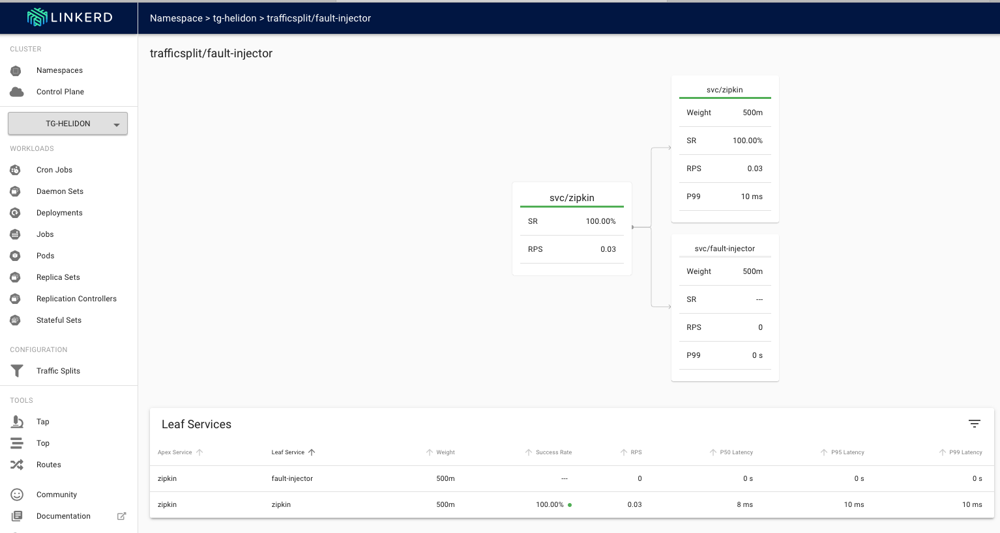

[Go to Overview Page](../Kubernetes-labs.md)


# Migration of Monolith to Cloud Native

## C. Deploying to Kubernetes

## Optional 3d. Exploring traffic splits with a Service mesh.

# IN DEVElOPMENT

# NEED INTRO VIDEO 

<details><summary><b>Self guided student - video introduction</b></summary>
<p>

This video is an introduction to the Service mesh traffic splits lab. Once you've watched it please press the "Back" button on your browser to return to the labs.

[](https://youtu.be/kc1SvmTbvZ8 "Kubernetes core features lab introduction video")

</p>
</details>

---

## What is a a traffic split, and what can I do with it

A traffic split is just what it says, the traffic arriving at a service is split between the implementation instances. In core Kubernetes this is done using the selector in the service to locate pods with matching  labels. Then traffic sent to the service is split between the different pods, often using a round robin approach so each pod responds in turn.

In a service mesh a traffic split can do the traditional Kubernetes round robin approach, but it can do a lot more. For example there could be two different versions of the service, with the service mesh sending a percentage of the traffic to the different versions. This is useful if for example you want to try out one of the versions to see if it produced better business results (called A/B testing) or maybe you want to try out a new version of your micro-service before fully rolling it out. By diverting a small percentage of the traffic to it you can find out in the real deployed environment if it has any faults or returns errors. If it does then the new version is abandoned and the traffic all goes to instances of the old version, but if the new version turns out to be more reliable than the old one then you complete the rollout process and switch entirely to the new version.

Some service mesh implementations even have the ability to examine the headers in the request and make traffic split decisions based on those. An example of this in use would be to test out a new micro-service version in the real live environment, but limiting it's access to only requests with specific headers, thus a test team could deploy the new version, but the service mesh would only route the requests with that specific header to the new version. The rest of the environment would remain the same so the new version is being tested in the real production environment.

You can even use the traffic split to deliberately introduce faults to your environment to see how the system behaves, for example how well the upstream service handles bad result data, or even no response at all. This later function is part of a larger discipline called [Chaos Engineering](https://en.wikipedia.org/wiki/Chaos_engineering) but we will look at a very small part of it here.

Note that in a lot of these cases you use additional external automation tools to manage the service mesh traffic split (and to use it's monitoring) to adjust the traffic split.

This module was written using the information in the [Linkerd fault injection page.](https://linkerd.io/2/tasks/fault-injection/)

## Using a traffic split to test resilience

We're going to use a traffic split to send some messages to a fake zipkin endpoint which will generate errors, this will let us see how well our micro-services handle the situation where zipkin becomes unavailable.

Let's setup the fault injector, this is basically a simple nginx based web server that returns a HTTP 504 error status (Gateway timeout) each time it's accessed.

Setup the config map - if you look at it you'll see it basically defines a config rule for nginx that will always return a 504 error
kubectl apply -f nginx-fault-injector-configmap.yaml

start a service for it

kubectl apply -f fault-injector-service.yaml
service/fault-injector created

start the nginx fault injector deployment
kubectl apply -f nginx-fault-injector-deployment.yaml 

and for testing purposes an ingress

kubectl apply -f fault-injector-ingress.yaml 
ingress.extensions/fault-injector created


test the fault injection returns the right value

curl -i  http://<external IP>/fault
Handling connection for 9411
HTTP/1.1 504 Gateway Time-out
Server: nginx/1.19.0
Date: Wed, 03 Jun 2020 13:22:02 GMT
Content-Type: text/html
Content-Length: 167
Connection: keep-alive

<html>
<head><title>504 Gateway Time-out</title></head>
<body>
<center><h1>504 Gateway Time-out</h1></center>
<hr><center>nginx/1.19.0</center>
</body>
</html>

OK, the 504 / Gateway Time-out response is generated as we expect.


So far all we've done is to create a service that generates 504 errors, we need to look at the traffic split to redirect some of the traffic for the original service to this new one.

Let's look at the traffic split

this is a 50/50 split between fault and working, normally you would to a lower number, especially in a production environment if you wern't sure what would happen, but here we want to be confident we'll see some "failures"  generated.

OK, now we know what it is let's deploy it, note that the traffic split is what's known as a custom resource definition, basically is a mechanism to extend the core Kuberntes capabilities.

kubectl apply -f  fault-injector-traffic-split.yaml
trafficsplit.split.smi-spec.io/fault-injector-split created

Let's look at the traffic split

In your web browser go to `https://<external IP address>`

<details><summary><b>If you need to remind yourself of the ingress controller external IP address</b></summary>
<p>

- In the OCI Cloud Shell type :
  - `kubectl get services -n ingress-nginx`

```
NAME                                          TYPE           CLUSTER-IP     EXTERNAL-IP      PORT(S)                      AGE
ingress-nginx-nginx-ingress-controller        LoadBalancer   10.96.196.6    130.61.195.102   80:31969/TCP,443:31302/TCP   3h
ingress-nginx-nginx-ingress-default-backend   ClusterIP      10.96.17.121   <none>           80/TCP                       3h
```

look at the `ingress-nginx-nginx-ingress-controller` row, IP address inthe `EXTERNAL-IP` column is the one you want, in this case that's `130.61.195.102` **but yours will vary**

---
</p></details>

- Click the namespaces

- Click **your namespace** (tg-helidon in this case, but yours should be different)

- On the left click `Traffic Splits`


This Shows the traffic split

Click on the name of the traffic-split `fault-injector`


We can see the details of the traffic split, the `Apex Service` indicates the service the traffic split is operating on, the `Leaf service` shows where the traffic will be split to and the `Weight` indicates the probability of that split option, in this case it's 500/1000 in each case. Of course you could potentially have additional splits.

keep this page open

Let's generate some requests to see what happens

curl -i -k  -u jack:password https://<external ip>/store/stocklevel
^[[AHTTP/2 200 
server: nginx/1.17.8
date: Wed, 03 Jun 2020 18:38:20 GMT
content-type: application/json
content-length: 149
strict-transport-security: max-age=15724800; includeSubDomains

[{"itemCount":410,"itemName":"Pencil"},{"itemCount":50,"itemName":"Eraser"},{"itemCount":4490,"itemName":"Pins"},{"itemCount":100,"itemName":"Book"}]

Well the good news is that on this occasion we got a result, make a few more requests, then return to your web browser (hopefully you left it on the details page of the fault-injection traffic split)

Below is what **I** saw, and it seems that **in this case** the random number generator means that the few requests I made to the traffic split that was connected to the origional zipkin servicehad all been passed to zipkin which had suceeded.



**Yours may be different**

In this case you can see that requests to the fault-injection traffic split had a 100% success rate, and were passed to the zipkin service which had a 100% success rate.

So I can show you what it looks like if there are failures I made a few more curl requests and came back to the page


**Again yours will almost certainly be different**

Here we see that 53% of the requests to the traffic split had failed (the bar at the top of the service also indicates the failure rate) and that 100% of the requests to zipkin had succeeded, while 100% of the requests to the fault injector service had failed. In this case given the fault-injector service will always fail this is what we would expect, but as you'll see later when we look at canary deployments it's not a pure 100% success or failure in all cases.

Of course this is useful, but in this case all it's telling us is that the `zipkin` service always works and the `fault-injector` service always fails. What does that mean for the requests to the zipkin service.

- Click on `Routes` on the left menu

- In the `Namespace` dropdown chose the name of **your** namespace (tg-helidon in the example below)

- In the `Resource` dropdown chose `deployment`

- in the `To Namespace` dropdown chose the name of **your** namespace (tg-helidon in the example below)

- In the `To resource` dropdown chose `deployment/zipkin`


This will generate reports from any deployment to the `zipkin` deployment (it is of course possible to look at specific deployments, but this shows us a good overview)

- Click the `Start` button

- Make multiple curl requests 
curl -i -k  -u jack:password https://<external ip>/store/stocklevel


(you may have to scroll down a bit to see the deployment details)

We can see that in **this case** 50% of the requests from the storefront deployment to the zipkin deployment have failed, the same is true for the stockmanager. We know that out traffic split is doing what we expected and that we are failing the requests and potentially causing chaos ! (If you feel like it please feel free to do a Dr Evil or Bond villan manic laugh at this point)

This is great, but how is our service handling it ?

Unless something very unexpected from the point of view of the lab writer has happened all the time you have been getting a reply to the curl command of something like 

```
[{"itemCount":410,"itemName":"Pencil"},{"itemCount":50,"itemName":"Eraser"},{"itemCount":4490,"itemName":"Pins"},{"itemCount":100,"itemName":"Book"}]
```

And you have not had any HTTP errors, this is a pretty good indicator that our service is continuing to work, out little experiment in chaos engineering has given us useful information !


# Do details section here

Let's look at the pods log, 

kubectl get pods
NAME                             READY   STATUS    RESTARTS   AGE
fault-injector-b5bf94d48-f7wbq   2/2     Running   0          55m
stockmanager-7945b54576-9f7q7    2/2     Running   0          69m
storefront-7667fc5fdc-5zwbr      2/2     Running   0          69m
zipkin-7db7558998-c5b5j          2/2     Running   0          69m

kubectl logs stockmanager-7945b54576-9f7q7 stockmanager

Note that as the pod now contains multiple containers due to linkerd injecting them automatically we need to specify the container we want the logs for, as it's names in the deployment. In this case that's the stockmanager container.

2020.06.03 18:10:01 INFO com.oracle.labs.helidon.stockmanager.resources.StockResource Thread[helidon-4,5,server]: Getting all stock items
Hibernate: 
    SELECT
        departmentName,
        itemName,
        itemCount 
    FROM
        StockLevel 
    WHERE
        departmentName='Tims Shop'
2020.06.03 18:10:02 INFO com.oracle.labs.helidon.stockmanager.resources.StockResource Thread[helidon-4,5,server]: Returning 4 stock items
2020.06.03 18:10:02 WARNING zipkin2.reporter.AsyncReporter$BoundedAsyncReporter Thread[AsyncReporter{URLConnectionSender{http://zipkin:9411/api/v2/spans}},5,main]: Spans were dropped due to exceptions. All subsequent errors will be logged at FINE level.
2020.06.03 18:10:02 WARNING zipkin2.reporter.AsyncReporter$BoundedAsyncReporter Thread[AsyncReporter{URLConnectionSender{http://zipkin:9411/api/v2/spans}},5,main]: Dropped 8 spans due to IOException(Server returned HTTP response code: 504 for URL: http://zipkin:9411/api/v2/spans)
java.io.IOException: Server returned HTTP response code: 504 for URL: http://zipkin:9411/api/v2/spans
        at java.base/sun.net.www.protocol.http.HttpURLConnection.getInputStream0(HttpURLConnection.java:1919)
        at java.base/sun.net.www.protocol.http.HttpURLConnection.getInputStream(HttpURLConnection.java:1515)
        at zipkin2.reporter.urlconnection.URLConnectionSender.skipAllContent(URLConnectionSender.java:232)
        at zipkin2.reporter.urlconnection.URLConnectionSender.send(URLConnectionSender.java:227)
        at zipkin2.reporter.urlconnection.URLConnectionSender$HttpPostCall.doExecute(URLConnectionSender.java:266)
        at zipkin2.reporter.urlconnection.URLConnectionSender$HttpPostCall.doExecute(URLConnectionSender.java:258)
        at zipkin2.Call$Base.execute(Call.java:380)
        at zipkin2.reporter.AsyncReporter$BoundedAsyncReporter.flush(AsyncReporter.java:285)
        at zipkin2.reporter.AsyncReporter$Flusher.run(AsyncReporter.java:354)
        at java.base/java.lang.Thread.run(Thread.java:834)

Hibernate: 
    SELECT
        departmentName,
        itemName,
        itemCount 
    FROM
        StockLevel 
    WHERE
        departmentName='Tims Shop'
```
        
It will also let us see how the real zipkin service handles the situation where some of the trace updates it's sent don't make it.

For now let's remove the Traffic split and the fault-injector components we created (just so we manage our resources

bash stop-fault-injection.sh
trafficsplit.split.smi-spec.io "fault-injector" deleted
ingress.extensions "fault-injector" deleted
service "fault-injector" deleted
deployment.apps "fault-injector" deleted
configmap "fault-injector-configmap" deleted

## Now let's look at how we can use the service mesh to do a canary deployment

### What is a canary deployment ?

---

You have reached the end of this lab module !!

In the next module we will look at how you can use linkerd and grafana to see the traffic flows in your cluster.

Acknowledgements. I'd like to thank Charles Pretzer of Bouyant, Inc for reviewing and sanity checking parts of this document.

Use your **back** button to return to the lab sequence document to access further service mesh modules.