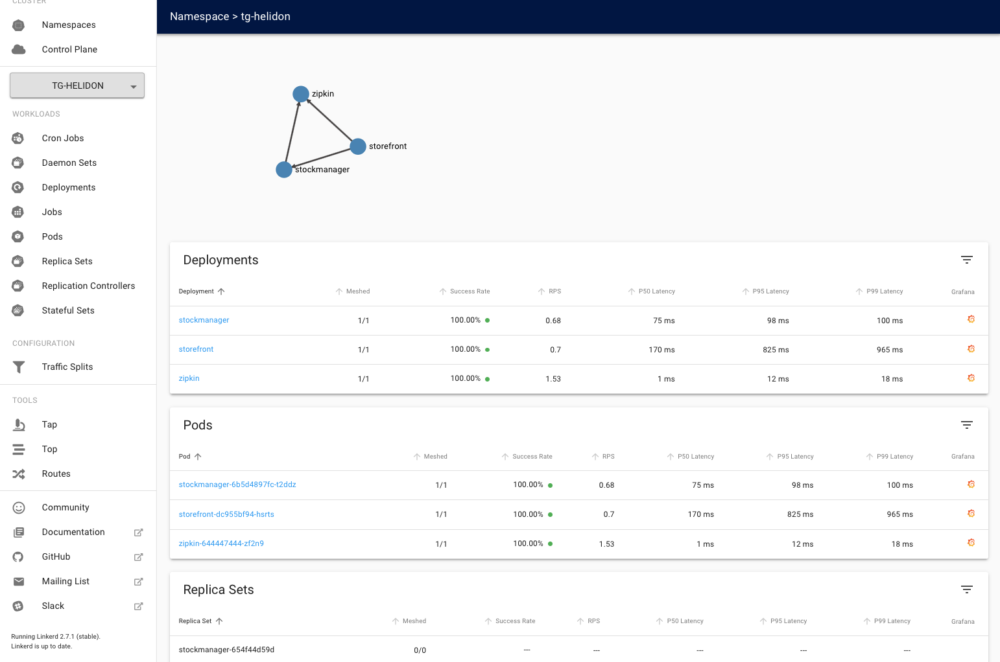

[Go to Overview Page](../Kubernetes-labs.md)


# Migration of Monolith to Cloud Native

## C. Deploying to Kubernetes

## 7b. Service mesh usage


# NEED INTRO VIDEO 

<details><summary><b>Self guided student - video introduction</b></summary>
<p>

This video is an introduction to the Service mesh basics lab. Once you've watched it please press the "Back" button on your browser to return to the labs.

[](https://youtu.be/kc1SvmTbvZ8 "Kubernetes core features lab introduction video")

</p>
</details>

---

## Using the service mesh

We've seen how to install and run the service mesh, we're now doing to look at how to use it.

### Starting a load generator

The first thing we need is some load so we can see what the service mesh is doing, there is a load generator script we can use to do this

Change to the directory for the service mesh scripts

- In the OCI Cloud shell type
  - `cd $HOME/helidon-kubernetes/management/servicemesh`

Once you are in the directory start the load generator

<details><summary><b>If you need to remind yourself of the ingress controller IP address</b></summary>
<p>

- In the OCI Cloud Shell type :
  - `kubectl get services -n ingress-nginx`

```
NAME                                          TYPE           CLUSTER-IP     EXTERNAL-IP      PORT(S)                      AGE
ingress-nginx-nginx-ingress-controller        LoadBalancer   10.96.196.6    130.61.195.102   80:31969/TCP,443:31302/TCP   6d1h
ingress-nginx-nginx-ingress-default-backend   ClusterIP      10.96.17.121   <none>           80/TCP                       6d1h
```

look at the `ingress-nginx-nginx-ingress-controller` row, IP address inthe `EXTERNAL-IP` column is the one you want, in this case that's `130.61.195.102` **but yours will vary**

---
</p></details>


- In the OCI Cloud shell type (remember to replace <external IP> with the I address of your ingress service
  - `bash generate-service-mesh-load.sh <external IP > /dev/null &`
  
 ```
 [1] 614
 ```

This will display the job and process id, then return to the command prompt immediately, but it will continue generating the load.

Note, the OCI Cloud Shell session will terminate (and thus kill off the load generator) after 20 minutes of inactivity. If this happens you will see the throughput figures for your namespace and servcies in the Linkerd and Grafana UI's drop to zero and potentially even disappear if they fall outside the time ranges displayed. 

You can prevent this by interacting with the OCI CLoud Shell at least once every 20 minutes, either by running another command or by simply pressing the return key int he shell.

If that happens while you are doing the service mesh labs the solution is to connect back to the OCI CLoud shell and restart the load generator

### Viewing the load

- In your laptop web browser go to `https://<external IP>`

You may be challenged as you have a self signed certificate. Follow the normal procedures in your browser to accept the connection and proceed.

Next you msy be presented with the login challenge.


If you are login with `admin` as the username, for the password use the one you used when creating the login password during the linkerd installation in the previous module.

You'll be presented with the linkerd-web main page, unlike when you saw this previously now it's showing load for your services.


You can see that in both the HTTP metrics and TCP metrics sections the namespace tg-hekidon (your namespace will be different of course) is showing a request rate.

Unlike the Kubernetes dashboard the linkerd UI is very much about providing you with data abut what's happening. The data is captured by the linkerd-proxies that form the data plane of the servcie mesh and then made available via the Promtheus implementaiton the linkerd install process created. The UI doesn't really offer options for configuring linkerd

A key point here is that this UI is showing you the **current** load (well actually data collated and processed over the very recent history. To see historical data we can use the Grafana instance that the linkerd install process setup. We'll get to that later in the module, for now we're just going to look at the Linkerd UI

<details><summary><b>What are the column headings?</b></summary>
<p>

Note, Clicking on a column name will cause the data in the table to be sorted by that column in ascending order, this is useful for example if you had a lot of namespaces to quickly see which ones had the most traffic or failures. Clicking on the column name a second time will change the sort order to be descending.

In the HTTP Metrics section the columns are :

`Namespace` - The name of the namespace

`Meshed` - the number of deployments in the namespace that are part of the service mesh, in this case it's all of the ones in your namespace and the ingress-nginx namespace, but it is possible that in some cases a deployment may not be included (perhaps a deployment has not been restarted, or a deployment has annotations that explicitly disable the use of the service mesh)

`Success Rate` - How often a request made by a deployment within the namespace succeeds, this can be the start iof diagnosint problems

`RPS` - The number of requests per second

`P50 Latency` - The maximum time taken to respond to for the fastest 50% of requests.

`P95 Latency` - The maximum time taken to respond to for the fastest 95% of requests.

`P99 Latency` - The maximum time taken to respond to for the fastest 99% of requests.

`Grafana` - If the namespace is in the mesh a little Garafana logo will appear here, clicking on it will switch to the Grafana UI showing the HTTP details for the namespace. **Don't do this now**, we'll look at it later on

In the TCP Metrics section the columns are :

`Namespace` - The name of the namespace

`Meshed` - the number of deployments in the namespace that are part of the service mesh

`Connections` - The number of active connections (I believe this has some averaging applied)

`Read Bytes/sec` and `Write Bytes/sec` - The data volumes beinf written and read int he namespace

`Grafana` - If the namespace is in the mesh a little Garafana logo will appear here

---

</p></details>

#### Namespace specific load

Let's now look at the specific data for your namespace. In the HTTP metrics section click on the **name** of your namespace (mine is `tg-helidon`, but yours will be different)



The most obvious thing we see here it the data routing network at the top of the page. This shows us which services are initiating connections to which other services. We've got an easy way to see our data flows between microservices !

You can see the expected `storefront` to `stockmanager` connection, but also that **both** of them are sending data to the `zipkin` service. This is actually the tracing data. I included zipkin in the deployments with the linkerd-proxy so help show more detail in the graph, but in a production environment you may not want want to do this. 

<details><summary><b>How to exclude a service from the service mesh ?</b></summary>
<p>

Once a namespace has the `linkerd.io/inject: enabled` annotation set then all deployments (and thus app pods) started in the namespace will be detected by the linkerd control plane and the linkerd-proxy (and init) containers will be automatically injected without you having to do anything. This allows you to easily use linkerd in situations where you're using a deployment tool (e.g. helm) and not have to modify the helm charts yourself. 

To prevent this from happening simply add the annotation `linkerd.io/inject: disabled` to the pod / deployment, then when the service starts the linkerd control plane will know not to include the pods in the service mesh and will not setup the linkerd-proxy and init containers.

---

</p></details>

<details><summary><b>What about the database connection ?</b></summary>
<p>

There are a couple of points here. Firstly we are looking at HTTP data. It's quite probable that the connection which JDBC uses to actually talk to the database is not HTTP based, so we wouldn't expect it to show up in an HTTP report.

But even it we were looking at the TCP metrics report we still wouldn't see the connections from the stockmanager to the database. This is because the database exists outside the service mesh (and the entire Kubernetes cluster) So though the service mesh can see the TCP connection being setup there os no service mesh at the "other" end to receive the connection, thus it will nto be able to generate the metrics data as it just doesn't have the information.

Of course if the database was implemented as a Kubernetes based service (perhaps we were using MySQL in the cluster as our database) then the connection from the stock manager to the database would show up if we had enabled linkerd on ths pods in that deployment.

---

</p></details>

---

You have reached the end of this lab module !!

In the next module we will look at how you can use linkerd and grafana to see the traffic flows in your cluster and to diagnose problems.

Acknowledgements. I'd like to thank Charles Pretzer of Bouyant, Inc for reviewing and sanity checking parts of this document.

Use your **back** button to return to the lab sequence document to access further service mesh modules.