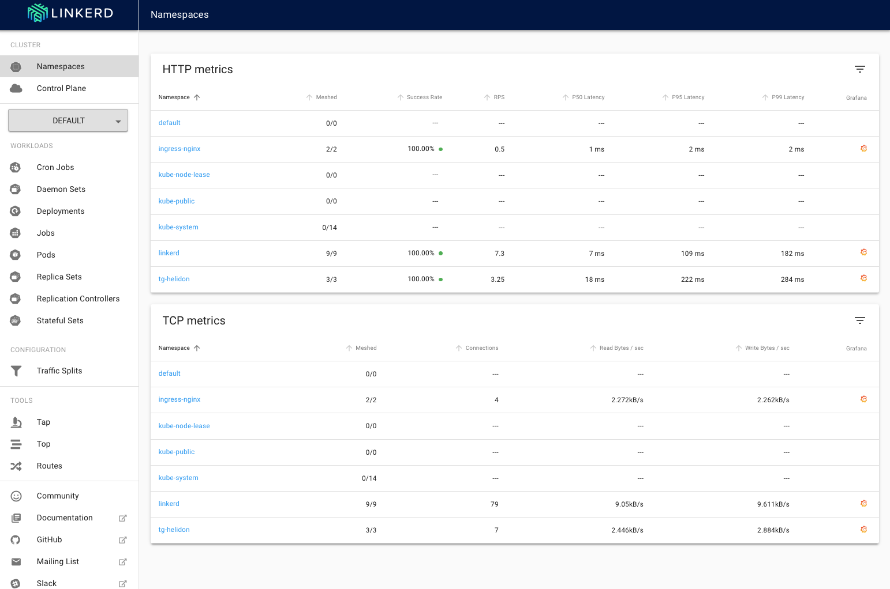
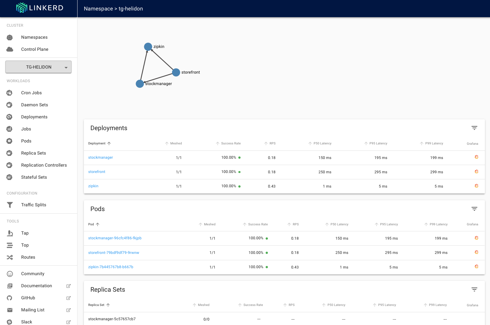
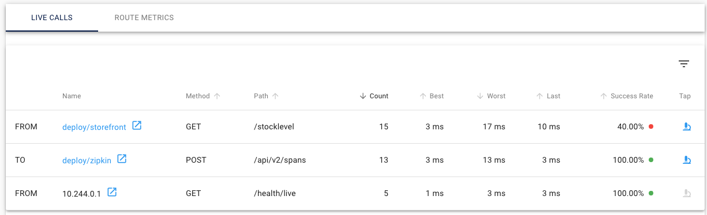

[Go to Overview Page](../Kubernetes-labs.md)


# Migration of Monolith to Cloud Native

## C. Deploying to Kubernetes

## Optional 3c. Using the Service mesh to troubleshoot problems


<details><summary><b>Self guided student - video introduction</b></summary>
<p>

This video is an introduction to the troubleshooting with a Service mesh lab. Once you've watched it please press the "Back" button on your browser to return to the labs.

[](https://youtu.be/2KFBV1vJcGI "Using the service mesh to help troubleshoot introduction video")

</p>
</details>

---

## Using a service mesh to troubleshoot

A service mesh like Linkerd doesn't just provide encryption and traffic statistics. It can also be used to help identify problems though it's monitoring capabilities.

In this module we are going to look at how to use a service mesh to track down the cause of a problem.

### What's the definition of a problem ?

in the case of Linkerd if a service fails to respond at all, or it responds but with a 5xx series response code it's determined to have been a failed request. Note that there are many response codes that an application can return, for example 409 represents a conflict, but these codes are considered valid responses, not failures in that they are reasonably things for the service to respond, a 409 error may for example be a completely justified response if you're trying to create an object which already exists, and 404 could also be completely valid if you're trying to access an object that does not exist. It may be simplistic, but 4xx series error codes could be regarded as a client error for using invalid data for the request.

5xx series error codes (or no connection to / response from the server at all) are pretty fatal however. A 5xx series error code can't be resolved by correcting details in the request, it means there's something pretty major going on that needs to be dealt with, basically it reflect an internal problem with coding, configuration or operational environment in the service.

### Where do we get our problem source from ?

Well fortunately for us I have build a version of the Stock Manager that can be configured to generate deliberate errors (I promise it's not just me doing bad coding :-) ) We will deploy this new version and then configure it to generate errors on half of the requests it makes.

### Start the load generator

The first thing we need is some load so we can see what the service mesh is doing, there is a load generator script we can use to do this

Change to the directory for the service mesh scripts

- In the OCI Cloud shell type
  - `cd $HOME/helidon-kubernetes/service-mesh`

Once you are in the directory start the load generator

<details><summary><b>If you need to remind yourself of the ingress controller IP address</b></summary>
<p>

- In the OCI Cloud Shell type :
  - `kubectl get services -n ingress-nginx`

```
NAME                                          TYPE           CLUSTER-IP     EXTERNAL-IP      PORT(S)                      AGE
ingress-nginx-nginx-ingress-controller        LoadBalancer   10.96.196.6    130.61.195.102   80:31969/TCP,443:31302/TCP   3h
ingress-nginx-nginx-ingress-default-backend   ClusterIP      10.96.17.121   <none>           80/TCP                       3h
```

look at the `ingress-nginx-nginx-ingress-controller` row, IP address inthe `EXTERNAL-IP` column is the one you want, in this case that's `130.61.195.102` **but yours will vary**

---
</p></details>


- In the OCI Cloud shell type (remember to replace `<external IP>` with the IP address of your ingress service
  - `bash generate-service-mesh-load.sh <external IP> 2 > /dev/null &`
  
 ```
 [1] 614
 ```

This will display the job and process id (these may vary in your case) then return to the command prompt immediately, but it will continue generating the load making a request approximately once every two seconds.

Note, the OCI Cloud Shell session will terminate (and thus kill off the load generator) after 20 minutes of inactivity. If this happens you will see the throughput figures for your namespace and services in the Linkerd and Grafana UI's drop to zero and potentially even disappear if they fall outside the time ranges displayed. 

You can prevent this by interacting with the OCI CLoud Shell at least once every 20 minutes, either by running another command or by simply pressing the return key int he shell.

If that happens while you are doing the service mesh labs the solution is to connect back to the OCI CLoud shell and restart the load generator

### Viewing the load

Let's just check that the load is running fine

- In your web browser go to `https://<external IP>`

You may be challenged as you have a self signed certificate. Follow the normal procedures in your browser to accept the connection and proceed.

Next you may be presented with the login challenge.


If you are login with `admin` as the username, for the password use the one you used when creating the login password during the linkerd installation in the previous module.

You'll be presented with the linkerd-web main page, unlike when you saw this previously now it's showing load for your services.



- Click on the page for your namespace (tg-helidon in my case)



We can see that the services are running with a 100% success rate.

For now let's stop the load generator while we deploy our "broken" service

- In the OCI cloud shell type
  - `jobs`

```
[1]+  Running                 bash generate-service-mesh-load.sh 130.61.195.102 2 > /dev/null &
```

We can see that our load generator is running, and at the beginning of the line we see `[1]` which tells us it's job id is 1 (in the []) It's possible that you may have additional lines, if you have other jobs running, in which case look for the job that's running the `generate-service-mesh-load.sh` line and get it's job id

We can now get the OCI Cloud Shell to stop the job

- In the OCI cloud shell type (replace 1 with the job id if you had multiple jobs running)
  - `kill %1`

```
[1]+  Terminated              bash generate-service-mesh-load.sh 130.61.195.102 2 > /dev/null
```


### Deploying our broken service

We are going to edit one of the configurations for the stock manager to specify that we want a 50% failure rate on requests to the stock manager. The deliberately "broken" stockmanager will pay attention to this, but the normal one will not.

- In the OCI Cloud Shell use your preferred editor (vi, nano etc.) to edit `$HOME/helidon-kubernetes/configurations/stockmanagerconf/conf/stockmanager-config.yaml`

- Add the following to the end of the file on a line of it's own, not that this is **not** indented `errorgenerationrate: 0.5`

The resulting file will look something like this **the department name should be different in your case** it should not be `Tims shop` unless your name is Tim !

```yaml
app:
  persistenceUnit: "HelidonATPJTA"
  department: "Tims Shop"
  
tracing:
  service: "stockmanager"
  host: "zipkin"
 
errorgenerationrate: 0.5
```

- Save the updated file

Strangely `kubectl` doesn't seem to have a mechanism to replace a config map that's been created using multiple files in a directory, so we will have to delete and then re-create the stockmanager

- In the OCI Cloud shell type
  - `kubectl delete configmap sm-config-map`
  
```
configmap "sm-config-map" deleted
```

- In the OCI Cloud shell type
  - `kubectl create configmap sm-config-map --from-file=$HOME/helidon-kubernetes/configurations/stockmanagerconf/conf`

```
configmap/sm-config-map created
```

Now we can apply the update, we'll use the Kubernetes rolling upgrade process (as we're going to want to revert this one !)

- In the OCI Cloud shell type
  - `kubectl apply -f $HOME/helidon-kubernetes/service-mesh/stockmanager-deployment-broken.yaml`

```
deployment.apps/stockmanager configured
```

Wait a short while for the update to be applied.
  
Now let's check that the change has applied by going direct to the stockmanager and seeing how it behaves, remember that we said that 0.5 (so 50%) of the requests should generate an error.

- In the OCI Cloud shell type the following (remember to replace `<external IP>` )
  - `curl -i -k -X GET -u jack:password https://<external IP>/sm/stocklevel`

(As usual the first response may take a short while)
 
Depending on if you get an error you'll get something similar to the following

If the code randomly throws the error

```
HTTP/1.1 500 Internal Server Error
Server: nginx/1.17.8
Date: Mon, 01 Jun 2020 18:52:11 GMT
Content-Length: 0
Connection: keep-alive
Strict-Transport-Security: max-age=15724800; includeSubDomains
```

If the code randomly works correctly

```
HTTP/1.1 200 OK
Server: nginx/1.17.8
Date: Mon, 01 Jun 2020 18:52:09 GMT
Content-Type: application/json
Content-Length: 149
Connection: keep-alive
Strict-Transport-Security: max-age=15724800; includeSubDomains

[{"itemCount":410,"itemName":"Pencil"},{"itemCount":50,"itemName":"Eraser"},{"itemCount":4490,"itemName":"Pins"},{"itemCount":100,"itemName":"Book"}]
```

Repeat the request several times and you should see that approximately half the time you get a response of `500 Internal Server Error` and half the time a response of `200 OK`

Now try making the request a few times to the storefront service

- In the OCI Cloud shell type the following (remember to replace `<external IP>` )
  - `curl -i -k -X GET -u jack:password https://<EXTERNAL IP>/store/stocklevel`
  
You will get either error messages like this

```
HTTP/1.1 424 Failed Dependency
Server: nginx/1.17.8
Date: Mon, 01 Jun 2020 19:15:21 GMT
Content-Type: application/json
Transfer-Encoding: chunked
Connection: keep-alive
Strict-Transport-Security: max-age=15724800; includeSubDomains

{"errormessage":"Unable to connect to the stock manager service"}
```

Or it will succeed 

```
HTTP/1.1 200 OK
Server: nginx/1.17.8
Date: Mon, 01 Jun 2020 19:15:17 GMT
Content-Type: application/json
Content-Length: 149
Connection: keep-alive
Strict-Transport-Security: max-age=15724800; includeSubDomains

[{"itemCount":410,"itemName":"Pencil"},{"itemCount":50,"itemName":"Eraser"},{"itemCount":4490,"itemName":"Pins"},{"itemCount":100,"itemName":"Book"}]
```

As before repeat this a few times, approximately half the time it will succeed and half the time it will fail.

Restart the load generator

- In the OCI Cloud shell type (remember to replace `<external IP>` with the IP address of your ingress service
  - `bash generate-service-mesh-load.sh <external IP> 2 > /dev/null &`
  
 ```
 [1] 619
 ```


### Looking at the results using the service mesh

We'll open the LinkerdUI and see what it's reporting.

- In your web browser go to `https://<external IP>` (replace `<external IP>` of course) If asked login with the user name admin and the password you chose when setting up the Linkerd ingress

Locate the HTTP metrics entry for your namespace (mine is tg-helidon, yours will have a different name)


While the precise numbers will of course vary you should see that the success rate is not 100%, it's likely to be around 95% It's not a surprise, but it looks like we have a bit of a problem !

<details><summary><b>Why only 95% ?</b></summary>
<p>

Remember that here we're looking at all the HTTP REST API calls that happen in the entire namespace, including those inbound from the Ingress controller as well as calls to the Zipkin tracing, so while we'd expect to see some calls fail we wouldn't expect to see all of them.

---

</p>
</details>

- Click on the name of your namespace to access it.


We can see that it's the stockmanager service that has a problem, the rest are all reporting 100% success

- Click on the stockmanager **in the deployments list** then scroll down so you can see the inbound and outbound HTTP metrics, pods and the live calls


Now we can see that it's the inbound requests on the stockmanager that's the problem, the outbound ones are working fine, and (in this case) there is one pod that has the problem (if there were multiple pods you wild see them listed, and might be able to see if the problem was pod specific, or a problem across all pods in the deployment)

Now look at the Live calls section



We can see that the from deploy/storefront to /stocklevel call is the one that's generating a lot of failures

- Click on the `Tap` icon  for this row to access the call history

- Click the `Start` button at the top of this page and wait for a few calls to come in, then click the `Stop` button


- Locate a row where the HTTP status is 500, click the `Expand` icon 


You can now see the details of the failed call. Click the `Close` button on the lower right to close this popup.

### Diagnostics summary

Of course this is only showing us the network part of the troubleshooting process, but it's given us a lot of useful information to we can easily understand where the problems might be, and at least some information as to the details surrounding the failures. It's a lot better than just getting a `424 Failed Dependency` result !


## Resetting the environment


### Stopping the load generator

- In the OCI cloud shell type
  - `jobs`

```
[1]+  Running                 bash generate-service-mesh-load.sh 130.61.195.102 2 > /dev/null &
```

We can see that our load generator is running, and at the beginning of the line we see `[1]` which tells us it's job id is 1 (in the []) It's possible that you may have additional lines, if you have other jobs running, in which case look for the job that's running the `generate-service-mesh-load.sh` line and get it's job id

We can now get the OCI Cloud Shell to stop the job

- In the OCI cloud shell type (replace 1 with the job id if you had multiple jobs running)
  - `kill %1`

```
[1]+  Terminated              bash generate-service-mesh-load.sh 130.61.195.102 2 > /dev/null
```

### Removing the failing service

Let's use the Kubernetes rollout mechanism to reverse our "upgrade"

- In the OCI Cloud Shell type
  - `kubectl rollout undo deployment stockmanager`

```
deployment.apps/stockmanager rolled back
```


---

You have reached the end of this lab module !!

In the next module we will look at how you can use linkerd and grafana to see the traffic flows in your cluster.

Acknowledgments. I'd like to thank Charles Pretzer of Bouyant, Inc for reviewing and sanity checking parts of this document.

Use your **back** button to return to the lab sequence document to access further service mesh modules.