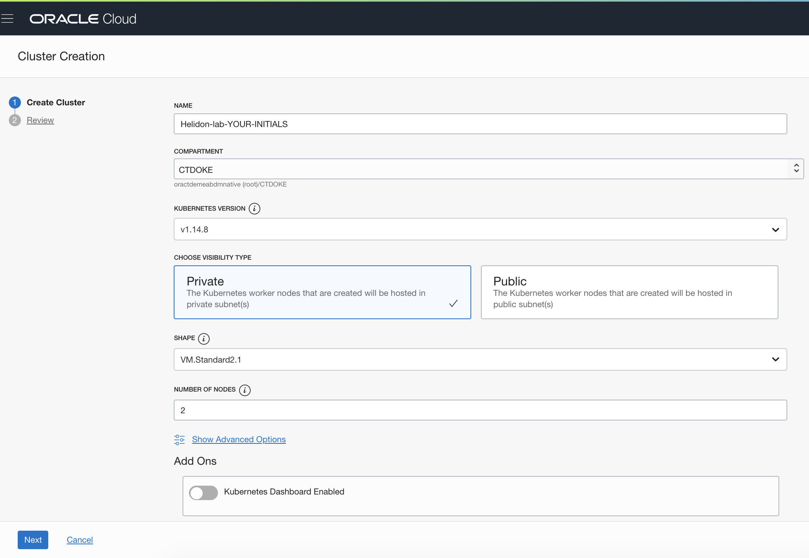

# Creating your own Kubernetes cluster in the OCI tenancy

This page details the instructions to spin up a Managed Kubernetes cluster on the Oracle Cloud.  

---

**ATTENTION !!!** 

Your instructor will inform you if the Kubernetes clusters have already been created for you or not.  

- In case you need create them yourselves, follow the instructions below.
- If the clusters are already running, your kubeconfig file will be provided by your instructor

---

- Make sure you are working in your Virtual Linux environment using your VNC viewer. 

**Navigate to the Managed Kubernetes dashboard**

- Log into the **Cloud Console** using the URL provided, and using the username and password you created earlier.
- Once on the **OCI infrastructure** page, click on the hamburger menu to navigate to 
  - **Developer services**, then **Container Clusters (OKE)**

- In the **List Scope** section, use the dropdown to select the **CTDOKE** compartment
  - You may have to expand the tree nodes to locate this compartment
- Click the **Create Cluster** button at the top of the clusters list

- Choose the option for the **Quick Create**, then click the **Launch workflow** button

**Creating the cluster**

- Fill in the form with following parameters:

  - In the next form name the cluster something like Helidon-Lab-YOUR-INITIALS
  - Make sure the compartment is **CTDOKE**
  - Make sure the Kubernetes version is the highest on the list (at the time of writing in Summer 2020 that was 1.16.8, but it will have been updated since then)
  - Leave the visibility type as **private**
  - Set the shape to VM.Standard2.1
  - Set the number of nodes to be 2

There is no need to do anything in the `Advanced Options` section.

This images is for creating a 1.16.8 cluster, it may be slightly different for later versions.
 

- Click the Next button to go to the review page.

- On the review page check the details you have provided are correct
- Click the Create Cluster button.

You'll be presented with a progress option, if you want read what's happening

- Scroll to the bottom and click the **Close** button

The state will be "Creating" for **a few minutes** (usually 3-4 mins)

