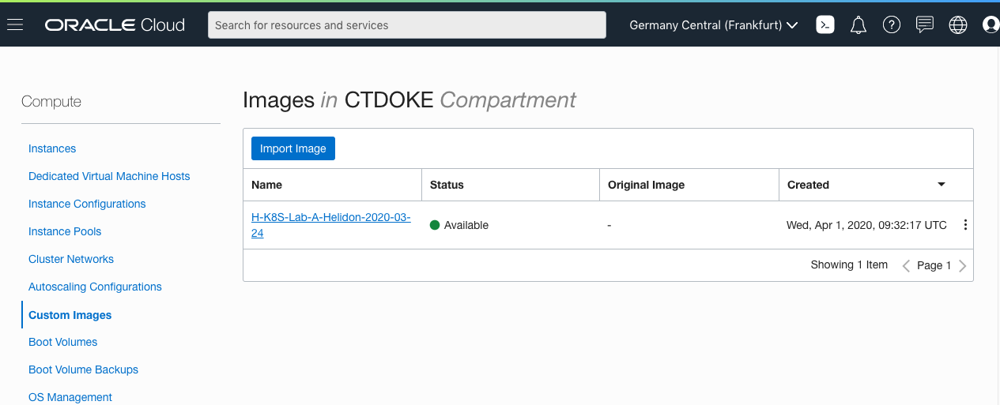

[Go to Overview Page](../README.md)


# Migration of Monolith to Cloud Native

## Setting up your Cloud Tenancy 

### Introduction

This page explains all the steps to set up your **Oracle Cloud Tenancy** so you are ready to run the labs.  Because participants can use different types of tenancies, not all steps need to be executed by everybody.  In case you are using a new **Oracle Free Tier** environment, you are starting from an "empty page" and will most likely have to execute all the steps below.

**If you are attending an instructor-led lab**, your instructor will detail steps you need to execute and which ones you can skip.

### 1. Create the CTDOKE compartment

- Click the `hamburger` menu (three bars on the upper left)

- Scroll down the list to the `Governance and Administration` section

- Under the `Identity` option chose `Compartments`

- You should see a screen that looks like this : 

  

  

- **ATTENTION** : if the compartment **CTDOKE** already exists, please move to the next item on this page
- If the **CTDOKE** compartment is not yet there, **create it** : 
  - Click the `Create Compartment` button
  - Provide a name, description
  - Chose **root** as the parent compartment
  - Click the `Create Compartment` button.


### 2. Import the image for the Client VM

- Navigate to the **Compute** and **Custom Image** screen


- On the right, make sure the **CTDOKE** compartment is selected

  

- **ATTENTION** : if an image with a name composed like **H-K8S-Lab-A-Helidon-2020-03-13** already exists and the date at the end (it's in the form year-month-day) is the same as or newer than the date in the import URL your instructor has given you then **you are OK for this step**, please move to the next item on this page.
- If you do not have this image available, import it with following steps:
  - Click the `Import Image` button
  - Make sure the **CTDOKE** compartment is selected
  - Name the image, probably best to have it match the name in the storage URL which will be something like H-Lab-A-Helidon-2020-03-23 as that way you will know what version of the lab you are using.
  - Make sure the Operating System is set to **Linux**
  - Select the option `IMPORT FROM AN OBJECT STORAGE URL` 
  - Enter the **VM image URL** you received from your instructor
  - Set the image type to **OCI**
  - Leave the launch mode unchanged
  - Click the `Import image` option - it can take 10 to 15 minutes to finish, you can navigate way from this screen and continue with the next setup actions


### 3. Creating a Virtual Cloud Network (VCN)

You need to set up a Virtual Cloud Network to run the instances of this lab on.

- Click the `hamburger` menu
- In the `Core Infrastructure` section chose `Networking` and then `Virtual Cloud Networks`
- Click the `Networking Quickstart` button
- Chose the `VCN with Internet Connectivity` option
- Click the `Start Workflow` button
- Enter a name for the VCN : **CTDVMVCN**
- Make sure that the compartment matches the compartment **CTDOKE** you just chose / created
- Leave the fields in the Configure VCN and Subnets with their default values.
- If you are using a non trial tenancy and your organization requires it add the appropriate tags (click the `Show Tagging Options` to see these)
- Click the `Next` button
- Double check the information you've provided
- Click the `Create` button
- Once the VCN has been created click the `View Virtual Cloud Network` button


### 4. Adding an OCI ingress rule for VNC

You need to be sure that the Virtual Cloud Network supports remote access using VNC.

- Go to the VCN you created earlier:  **CTDVMVCN**

- On the VNC page on the left hand side click the `Security Lists` option

- Click on the security list in the list, Chose the one with a name something like `Default Security List for CTDVMVCN` (don't select the private subnet one)

- In the list click the `Add Ingress Rules` button

- Leave the `Stateless` option unchecked

- Leave the `SOURCE TYPE` as CIDR

- In the `SOURCE CIDR` enter `0.@0.0.0/0` (basically the entire internet, in a production you might limit to your organizations address range)

- Leave the `protocol` as `TCP`

- Leave the `SOURCE PORT RANGE` blank

- Set the `DESTINATION PORT RANGE` as `5800-5910`

- Set the `DESCRIPTION` to be VNC

- Click the `Add Ingress Rules` button


### 5. Create a database

- Use the Hamburger menu, and select the Database section, **Autonomous Transaction Processing**
- Click **Create DB**

- Make sure the **CTDOKE** compartment is selected
- Fill in the form, and make sure to give the DB a unique name for you in case multiple users are running the lab on this tenancy.

- Make the workload type `Transaction Processing` 
- Set the deployment type `Shared Infrastructure` 

- Chose the most recent option for the database version, allocate 1 OCPU and 1 GB of storage (this lab only requires a very small database)

- Turn off auto scaling

- Make sure that the `Allow secure access from everywhere` is enabled.

- Chose the `License included` option

Be sure to remember the **admin password**, save it in a notes document for later reference.

- Once the instance is running go to the database details page, on the center left of the general information column there will be the label OCID and the start of the OCID itself. Click the **Copy** just to the left and then save the ODIC together with the password.


### 6. Setup your database user

- On the details page for the database, click the **Service Console** button

- On the left side click the **Development** option

- Open up the **SQL Developer Web** console

- Login as admin, using the appropriate password

- Copy and paste the below SQL instructions:

```
CREATE USER HelidonLabs IDENTIFIED BY H3lid0n_Labs;
CREATE USER HelidonLabs IDENTIFIED BY H3lid0n_Labs;
GRANT CONNECT TO HelidonLabs;
GRANT CREATE SESSION TO HelidonLabs;
GRANT DWROLE TO HelidonLabs ;
GRANT UNLIMITED TABLESPACE TO HelidonLabs;
```

- Run the script (The Page of paper with the green "run" button.) if it works OK you will see a set of messages in the Script Output window saying the User has been created and grants made.


### 7. Create a VM using the image you imported

- Return to the Custom Compute Images menu, and if you had to run the import, validate it is **Available** :
- 

- Click on the correct image name : If you are in a shared environment and there is more than one image starting H-K8S-Lab-A-Helidon chose the one with the most recent date. 
- Now click the `Create Instance` button

- Name the instance based on the image version so you can track what version of the lab you are following. e.g. `H-K8S-Lab-A-Helidon-2020-03-23`
- Expand the **Show Shap, Network and Storage Options** selection
- Select an **Availability domain**
- Select **Instance shape** : VM.Standard.2.1
- The *Virtual Cloud Network Compartment* should already be set to **CTDOKE**.

- In the **Virtual cloud Network** dropdown,  select the **CTDVMVCN** network. 
- Leave all the other setings in the section as they are in the boot volume section
  - Check the **Assign a public IP address** option is selected
- Scroll down to the **Add SSH Key** section
  - In a separate browser window, download [this public key file](atpkey.pub) onto your laptop. 
  - Use the **Choose File** button to select the downloaded public key file.

You have finished the wizard!

- Click the **Create** button on the bottom of the wizard to initiate the creation.

Once the create button has been clicked you will see the Vm details page.  Initially the state will be provisioning but after a few minutes it will switch to **Running**, and you will see that a **public IP address** has been assigned.  Make a note of that IP address.

- Give the VM a few minutes to start up it's internal services.


 ### 8. Accessing the client VM

You will be using VNC to access the client VM. There are multiple possible clients, chose from the list below or use another if you already have it. Note that the following may require you to have some level of admin rights on your machine.

 #### Installing a VNC viewer

- For **macOS** we recommend realVNC which can be obtained from 

  - https://www.realvnc.com/en/connect/download/viewer/macos/

- For **Windows**, suggested packages are TigerVNC viewer or TightVNC Viewer but if you already have a preferred VNC viewer you can use this. TigerVNC viewer has a simpler install process, as it is a standalone executable, but has fewer features.

  - TigerVNC: Download ‘vncviewer64-1.9.0.exe’ from

    - https://bintray.com/tigervnc/stable/tigervnc/1.9.0#files and save it to your desktop. It is a self-contained executable file, which requires no further installation.

  - TightVNC Viewer: Select the 'Installer for Windows (64-bit)' from

    - https://www.tightvnc.com/download.php

      When prompted, select to save the file.  Next, run the executable to install the program. This requires you have the privileges to install software on your machine

#### Accessing using VNC

You need to let your VM run for a couple of mins to fully boot and start the VNC server.

- Open your VNC Client

- Connect to the client VM. Depending on your client you may be asked to different information, but usually you'll be asked for a connect string. Thsi will typically look like 123.456.789.123:1 where the first part is the IP address and the :1 is the display number which is a constant (this is an example, the IP address won't work, you need to use your own.)

- You VNC client may warn you that you're making an insecure connection, this is expected as we have not setup security certificates.

- You will be asked to enter a password to access the virtual screen. Your instructor will have provided this.


### 9. Getting the Wallet file

The easiest way to get the database Wallet file into your virtual machine is to use the cloud console to download it.

- Open a web browser **inside the virtual machine**
- Login to the Oracle Cloud Console
- Open the `hamburger` menu (three bars on the top left)
- Scroll down (if needed) to the `Database` section. Click on the `Autonomous Transaction Processing` menu option
- Click on your database name in the list (it's a link)
- On the database page click the `DB Connection` button
  - This will display a Database connection popup
- Leave the `Wallet type` as `Instance connection`
- Click the `Download Wallet` button
- A password pop-up will be displayed. Enter and confirm a password, this is used to encrypt some of the details. if you have a password manager let it generate a password for you if you like
- Once your password is accepted and confirmed click the `Download` button
- If you are asked what to do with the file make sure you chose the `Save file` option
- The wallet file will start to download and the password pop-up will disappear and you'll be returned to the `Database connection` pop-up
- Click `Close` on the `Database Connection` popup


### 10. Using the Wallet file

The Wallet file will have been downloaded to $HOME/Downloads, we want to place it in the right location for the labs and with the right name. It is **very** important that you follow the exact instructions below to ensure you are in the right directory as otherwise you may delete the lab files !

- Delete any existing wallet information
  - `rm -rf $HOME/workspace/helidon-labs-stockmanager/Wallet_ATP`

- Create a new wallet directory
  - `mkdir -p $HOME/workspace/helidon-labs-stockmanager/Wallet_ATP`

- Navigate to the stock manager folder
  - `cd $HOME/workspace/helidon-labs-stockmanager/Wallet_ATP`

- Move the downloaded wallet file from the downloads to the folder
  - `mv $HOME/Downloads/Wallet_*.zip .`

- Unpack the wallet 
  - `unzip Wallet_*.zip`

We now need to locate the wallet connection details.

- Look at the contents of the tnsnames.ora file to get the database connection name

  - `cat tnsnames.ora`

  ```
  tg_high = (description= (retry_count=20)(retry_delay=3)(address=(protocol=tcps)(port=1522)(host=adb.eu-frankfurt-1.oraclecloud.com))(connect_data=(service_name=cgipkrq1hwcdlkv_jleoow_high.atp.oraclecloud.com))(security=(ssl_ser
  ver_cert_dn="CN=adwc.eucom-central-1.oraclecloud.com,OU=Oracle BMCS FRANKFURT,O=Oracle Corporation,L=Redwood City,ST=California,C=US")))
  
  tg_low = (description= (retry_count=20)(retry_delay=3)(address=(protocol=tcps)(port=1522)(host=adb.eu-frankfurt-1.oraclecloud.com))(connect_data=(service_name=cgipkrq1hwcdlkv_jleoow_low.atp.oraclecloud.com))(security=(ssl_serve
  r_cert_dn="CN=adwc.eucom-central-1.oraclecloud.com,OU=Oracle BMCS FRANKFURT,O=Oracle Corporation,L=Redwood City,ST=California,C=US")))
  
  tg_medium = (description= (retry_count=20)(retry_delay=3)(address=(protocol=tcps)(port=1522)(host=adb.eu-frankfurt-1.oraclecloud.com))(connect_data=(service_name=cgipkrq1hwcdlkv_jleoow_medium.atp.oraclecloud.com))(security=(ssl
  _server_cert_dn="CN=adwc.eucom-central-1.oraclecloud.com,OU=Oracle BMCS FRANKFURT,O=Oracle Corporation,L=Redwood City,ST=California,C=US")))
  
  tg_tp = (description= (retry_count=20)(retry_delay=3)(address=(protocol=tcps)(port=1522)(host=adb.eu-frankfurt-1.oraclecloud.com))(connect_data=(service_name=cgipkrq1hwcdlkv_jleoow_tp.atp.oraclecloud.com))(security=(ssl_server_
  cert_dn="CN=adwc.eucom-central-1.oraclecloud.com,OU=Oracle BMCS FRANKFURT,O=Oracle Corporation,L=Redwood City,ST=California,C=US")))
  
  tg_tpurgent = (description= (retry_count=20)(retry_delay=3)(address=(protocol=tcps)(port=1522)(host=adb.eu-frankfurt-1.oraclecloud.com))(connect_data=(service_name=cgipkrq1hwcdlkv_jleoow_tpurgent.atp.oraclecloud.com))(security=
  (ssl_server_cert_dn="CN=adwc.eucom-central-1.oraclecloud.com,OU=Oracle BMCS FRANKFURT,O=Oracle Corporation,L=Redwood City,ST=California,C=US")))
  ```

- Locate the "high" connection and take a note of the name, in the example above this is tg_high **Your file will contain different names**

- Edit the database configuration file to specify the database name. This file is `$HOME/workspace/helidon-labs-stockmanager/confsecure/stockmanager-database.yaml`

  - Locate the javax.sql.DataSource.stockLevelDataSourceOraATPJTA.datasource.url line. This will look something like 

    ```
    url: jdbc:oracle:thin:@<connection name>?TNS_ADMIN=./Wallet_ATP
    ```
  - update the name of the connection (shown here as `<connection name>`) and replace `<connection name>` with the name from the tnsnames.ora file, for example `tg_high`.  In this particular case the resulting line will look like the following. ** Yours will need to reflect your connection name, not tg_high**

    ```
    url: jdbc:oracle:thin:@tg_high?TNS_ADMIN=./Wallet_ATP
    ```

- Save the changes


## End of the setup

Congratulations, you have successfully prepared your tenancy ! 

Hit the **Back** button of your browser to return to the top level and start the Helidon lab !


------

[Go to Overview Page](../README.md)