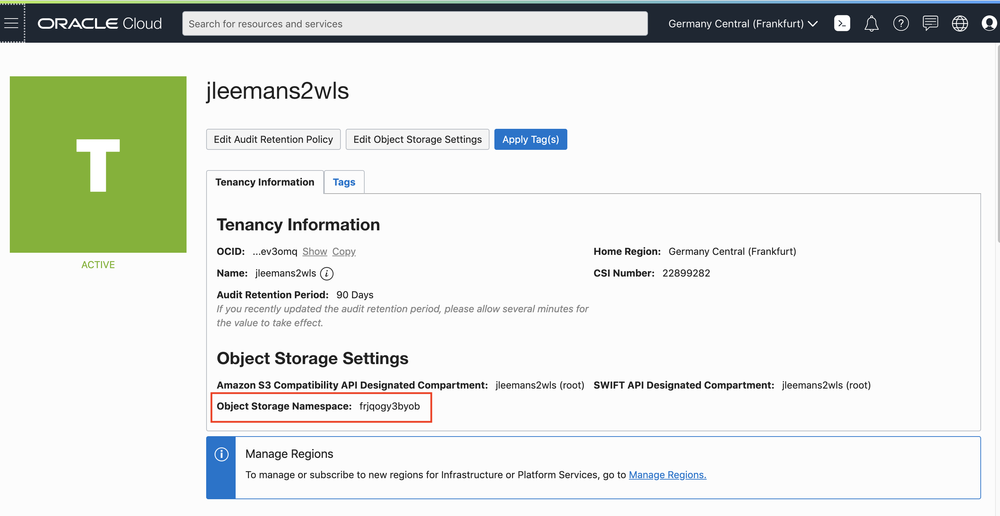

# Getting the docker login details

The following instructions cover how to prepare to interact with the Oracle Cloud Infrastructure **Docker Registry**. They tell you how to get the following bits of information

- Oracle Cloud Infrastructure Registry region code
- Tenancy Object Storage Namespace
- Full Username
- Authentication Token

Once you have got this information please save it in a notepad or something as you will need it later.

### Determining the Oracle Cloud Infrastructure Registry region code

The OCIR region code is based on the IATA code for the city hosting the region, for example Frankfurt has an IATA core of `fra` and Amsterdam is `ams`. Unfortunately some cities (e.g. London) have multiple airports, in others the IATA airport code refers to an old name for the city, or the airport itself is not directly named after the city it serves, so we need to look the right code up based on our region.

To determine your region look at the top of your Oracle Cloud GUI in the web browser and you'll see your current region.

If you click on the name you'll get a list of regions enabled for your tenancy and your home region

You can see here in this example we're using the Frankfurt region, which is also our home region.

Now go to the [OCIR Availability By Region list.](https://docs.cloud.oracle.com/en-us/iaas/Content/Registry/Concepts/registryprerequisites.htm#Availab)

Locate your region on the list and then to the right identify the region code, for example we can see below in the case of Frankfurt the OCIR region code to use is `fra` for Sydney it's `syd`

### Determining your tenancy Object Storage Namespace

- Navigate to the **Tenancy Information** screen
  - Click the Hambueger menu
  - In the menu, scroll down to **Administration**, 
  - Click **Administration** then **Tenancy Details**

 

- Note down the **Object Storage Namespace** of your tenancy, in the example above this is `frjqogy3byob` **but yours will be different** (this is what we mean when we say mytenancystoragenamespace in these labs)

  

### Getting your Authentication Token

OCIR uses an authentication token rather than a password. To set an authentication token you need to take the following steps. 

- Click on the **Magnifying glass** on the top of your console, and enter your username.  For example, if your name was **ppan** : 

  

- Select the user **that looks like :  oracleidentitycloudservice/(your_name)**

  

- Select **Token** in the right-hand menu, then click the button **Create Token**.

  - Enter a name for the token

  - Use the **Copy** button to copy the token in your buffer, and **immediately paste it** in a notebook of your choice, you will need this later.

    

## Chosing the repo name 

You now need to chose a name for your repository,this is a combination of the OCIR registry and tenancy you determined above and a repo name you chose. 

An OCIR repo name looks like \<OCIR region code\>.ocir.io/\<Object Storage Namespace\>/\<repo_name\>

- Chose something unique **TO YOU** e.g. your initials : tg_repo 
- this must be in **lower case** and can **only contain letters, numbers, underscore and hyphen**

The ultimate full repository name will look something like `fra.ocir.io/oractdemeabdmnative/tg_repo` 

**Please save the information you gathered in a text file or similar, some of it can only be retrieved once**

