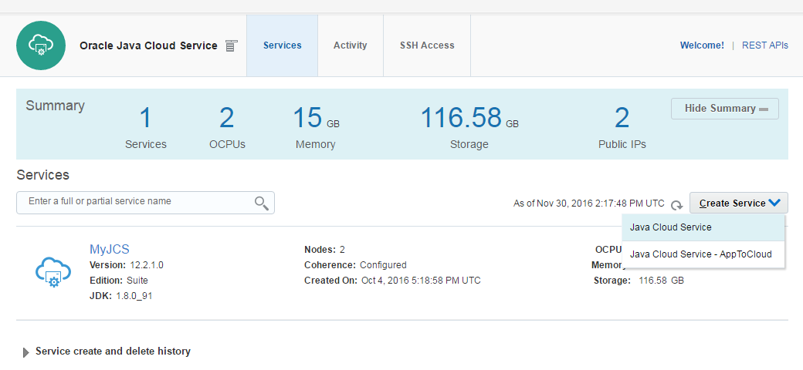
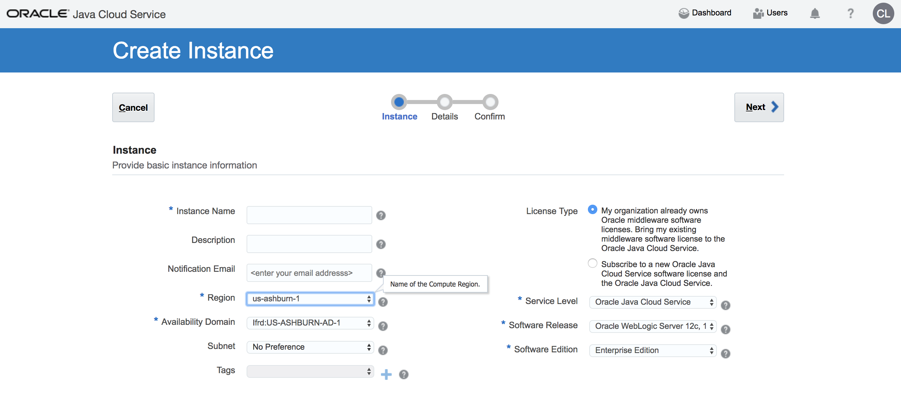
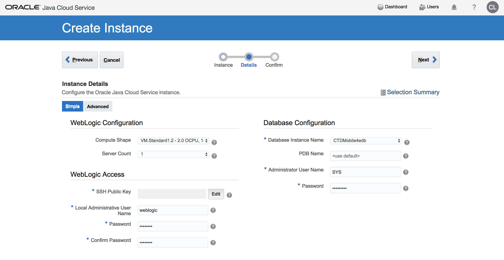
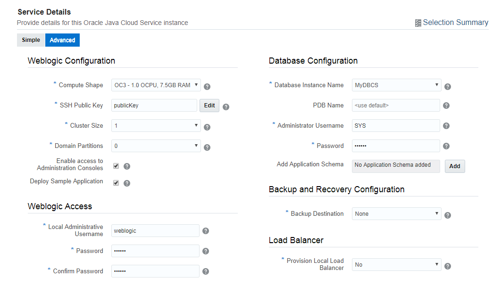
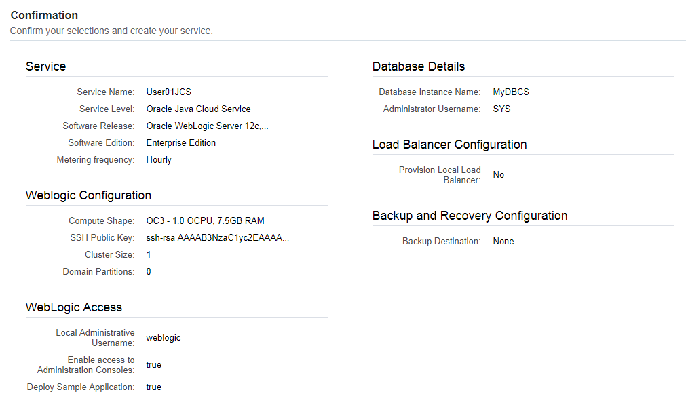

[Go back to Overview Page](../AppDevInfra.md)

## Application Development Infrastructure lab ##
### Create Java Cloud Service instance using the user interface ###

### Introduction ###

By using Oracle Java Cloud Service, you can quickly create and configure an Oracle WebLogic Server domain and set up your Java EE application environment without worrying about setting up any infrastructure or platform details yourself. All Oracle Java Cloud Service instances that you create are also preconfigured to use your database deployment in Oracle Database Cloud Service, and an object storage container that you create in your Oracle Storage Cloud Service.

### Prerequisites

This exercise assumes you already executed the creation of a Database Cloud Service as [described in this page](../dbcs-create/README.md).  

To run these labs you will need access to an Oracle Cloud tenancy.  If you are participating in a live event, your instructor will provide you the required credentials.

In this lab we will use the option to deploy to "OCI" infrastructure (as opposed to the older OCI-C or Classic).  In order to be able to use OCI, you first need to create a few OCI artefacts: a valid Virtual Network Configuration (VCN) and a Storage Bucket.  See [this page](https://docs.cloud.oracle.com/iaas/Content/General/Reference/PaaSprereqs.htm) for all details.

### Steps ###

Go to the Console (see Access information that was delivered to you in the workshop, or login to your [Oracle Cloud Free Tier environment](https://cloud.oracle.com/sign-in) ).

Make sure you have the tile "Java" displayed.  If this is not the case, use the button "Customize Dashboard", scroll down to the "Java" service in the list, and select "Show".

- On the dashboard click the hamburger icon on the Java tile.
- Select **Open Service Console**.

+ To create new instance click **Create Service** button and select **Java Cloud Service** in the drop down list.

Now choose the basic parameters for your Weblogic instance :
+ **Instance Name** : the name of the new instance, please include your username, eg. User10JcsInstance1
+ **Region**: choose one of the available regions.  This will typically be Frankfurt or Ashburn.
  - **Availability Domain**: Select one of the available availability domains.
  - **Subnet**: Select an available subnet.
  - You can also Select "No Preference" to instantiate the DB on Compute Classic (OCI-C). In this case, no Network info needs to be provided.
+ For the Service Level, select the  fully managed Oracle Java Cloud Service : "Oracle Java Cloud Service"
+ Weblogic Release : choose the latest version
+ Software Edition : Enterprise Edition

For more details about subscription types see the [documentation](https://docs.oracle.com/cloud/latest/jcs_gs/JSCUG/GUID-31F00F2C-221F-4069-8E8A-EE48BFEC53A2.htm#JSCUG-GUID-98DD6CE1-480F-4AA9-8131-A1D3D274440F)

Hit the "Next" button to go to the Instance Details screen

+ **Compute Shape**: number of OCPU and size of the RAM. Choose the appropriate size for your project, for example *VM.Standard2.1 - 1 OCPU, 7 GB RAM*.  In case of a shared environment provided by your instructor, please follow the instructions as to which shape to choose.  If you are running this lab on your own instance, make sure to check out the available shapes in your instance, or the creation
+ **Server Count**:  leave the default 1. Which means one managed server.

+ Now edit the **SSH Public key** you will use to access this instance : it allows to connect to the VM through ssh connection using the private key. Select **Create a New Key** option and download the newly generated keypair for later usage.

Now enter the following parameters on the screen:
​

+ **Local Administrative User Name**: username of WebLogic administrator. For demo purposes keep the default : weblogic
+ **Password**: WebLogic administrator's password. Don't forget to note the password you selected.

+ **Database Configuration / Name**: Database Cloud Service name to store WebLogic repository data. Basically the list populated with database services within the same identity domain.  Select either the database provided by your instructor, or the database you created in the proevious step.
+ **Database Configuration / PDB Name**: pluggable database service identifier of the Database Cloud Service instance -provided above- which will be used to store repository schema. If you have choosen default (PDB1) during Database Cloud Service creation then leave the default here too.
+ **Database Configuration / Administrator User Name**: DBA admin to create repository schema for Java Cloud Service instance. Enter: sys.
+ **Database Configuration / Password**: DBA admin password you specified during the database creation (or on your access document if a seeded database has been provided to you)

Now Select the "Advanced" mode on the top of the screen

+ **Domain Partitions**: Create mutitenant instance. Select 1 to enable partitioning.

+ **Enable Access to Administration Console**: because this instance will be available on public internet the default is that the WebLogic Admin console is not enabled. Do not forget to check in to get access to the Admin console.
+ **Deploy Sample Application**: deploy the sample application. It can be useful to test accessibility (correct LB configuration, etc.) of the Java Cloud Service Instance.

+ **Provision Load Balancer**: to save resources we will not create Load Balancer instance. Leave default: No

- **Backup Destination** : Keep the default "None".  In case you would like to setup a backup service, the format is the following:
  - For OCI : https://swiftobjectstorage.REGION.oraclecloud.com/v1/IDENTITYDOMAIN/BUCKETNAME, for example:  https://swiftobjectstorage.us-ashburn-1.oraclecloud.com/v1/gse00014344/PaasBucket.  Replace the REGION and IDENTITYDOMAIN value according to your environment and use the BUCKETNAME you specified when creating the OCI PaaS prerequisite artefacts
  - For OCI-C : Storage-IDENTITYDOMAIN/CONTAINERNAME, for example: Storage-gse00002323/User06.  The credentials for the storage are the same username/password you used to sign in to Oracle Cloud Services.

For more details about parameters see the [documentation](https://docs.oracle.com/cloud/latest/jcs_gs/JSCUG/GUID-31F00F2C-221F-4069-8E8A-EE48BFEC53A2.htm#JSCUG-GUID-88BD737C-8DA9-419A-8DBF-489BDFF9C512). Click **Next**.

The final page is the summary page showing the chosen configuration before you submit the instance creation request.

So now click the **Create** button to start the creation, or **Cancel** to abort.

---
[Go back to Overview Page](../AppDevInfra.md)
