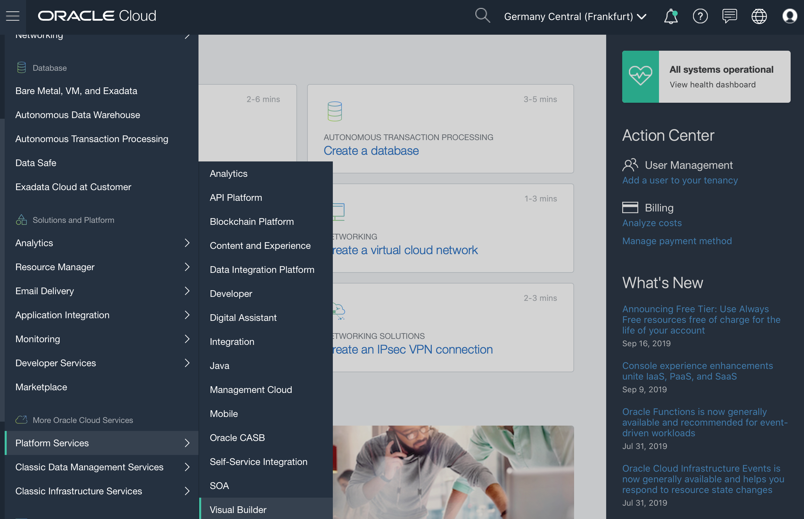
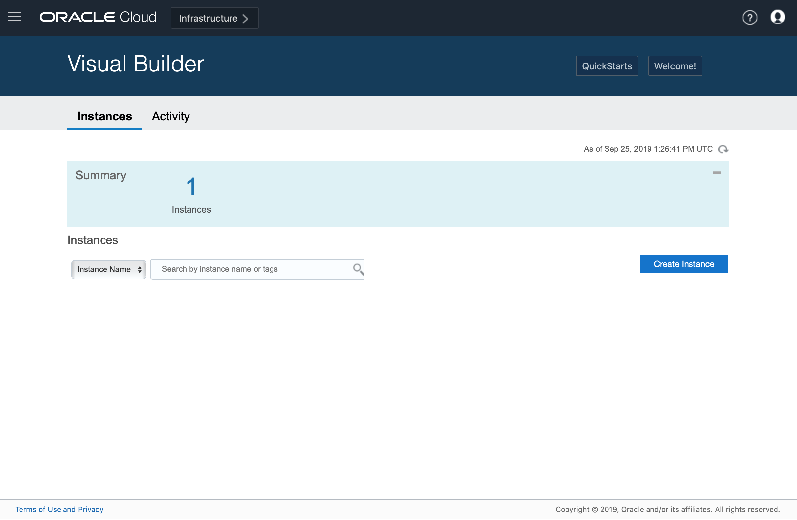
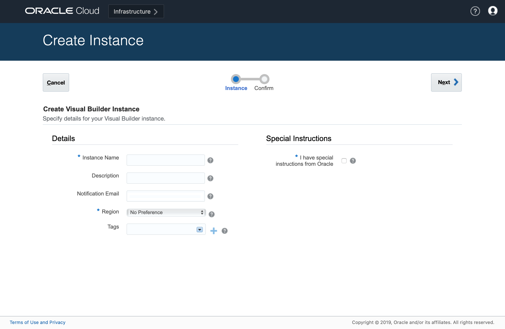
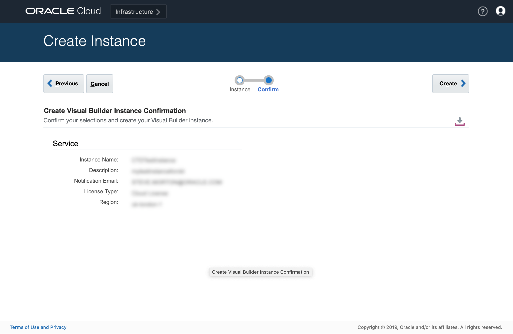
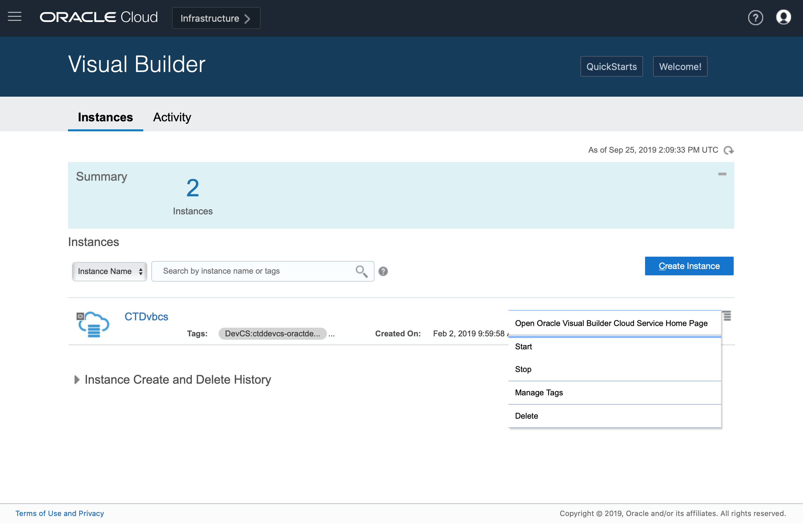

# Visual Cloud Builder Test Drive

Instructions to set up a VBCS instance in your tenancy.

## Prerequisites

This lab covers a set of prerequisites for running workshop hands-on activities

### Create Oracle Integration Cloud Instance

-	Login to your Oracle Cloud Trial Account. Click on the **hamburger menu** on the top left corner

-	Click on **Platform Services** and select **Visual Builder**	

-	Click on **Create Instance**

- Fill in the simple form then press **NEXT** 
  - **Instance Name :**  Will be used to identify this new instance. Service name cannot have more than 50 chars, must start with a letter and can contain only letters, numbers and hyphens. i.e. myvbcsinstance
  - **Region :** Select any of the available regions - this is where your instance will reside.
  - **Special Instructions :** Do not select.

- Press **CREATE**

- You will see the creation in process screen

- When complete you wil see your VBCS instance - use the burger menu on the right to show the pop-up - select OPEN VISUAL BUILDER CLOUD SERVICE HOMEPAGE to access the running VBCS environment.

Now you can use the **Back** button of your browser to return to the initial tutorial.

