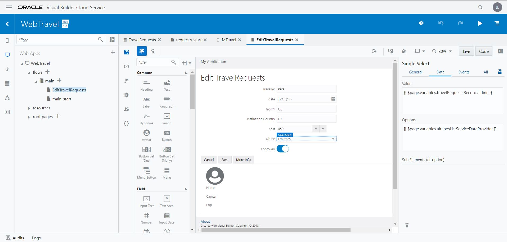
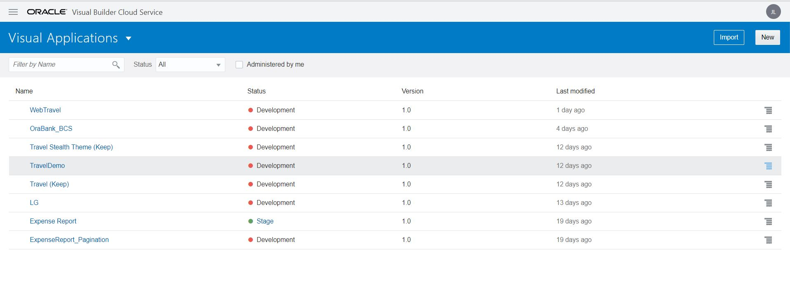

[Go to the Cloud Test Drive Overview](../../README.md)

# Visual Builder Cloud Service Lab #

## Use visual development to easily build sophisticated Web or Mobile apps

### Introduction ###

Oracle Visual Builder Cloud Service is a visual development tool for creating web and mobile applications by simply dragging and dropping user interface (UI) components onto a page. It is aimed at professional developers who want to enhance their productivity by using a low-code tool to help build javascript apps.

You can create custom business objects with the click of a button, and you can add data by importing CSV files or XLS spreadsheets to your application. You can access any data available via a REST API. You can define the processing logic needed for web and mobile pages. Since there are QuickStarts (Wizards) for most common actions you don't need any programming experience to develop an application. However, you can extend the functionality and change the appearance of your apps at any point using standard HTML, CSS and javascript. You can switch between visual and code mode as required.

This basic lab will showcase the development of a simple HR web or mobile application, based on Department, Employee and Location data objects by going through the following steps;

Developing a Web App

+ Create a visual application
+ Create pages for business objects
+ Add navigation and importing data
+ Add pages for data manipulation
+ Stage and publish an application
+ Create business rules
+ Add bar and area charts
+ Add pie charts and queries

Developing a Mobile App

+ Create a mobile application
+ Create pages in the mobile application
+ Import sample data
+ Add pages for data manipulation
+ Package the mobile application for the Android or iOS platform
+ Publish the mobile application

## Prerequisites ##

To run these labs you will need access to an Oracle Cloud Account.  If you are participating in a live event, your instructor will provide you the required credentials.

If you are running these labs on your own, please get a [Trial account](https://myservices.us.oraclecloud.com/mycloud/signup?sourceType=:eng:eo:ie::RC_EMMK190802P00027:Vlab_Visualbuilder) or set up your corporate UC subscription for this lab.   In this case you also need to **perform one extra step**: instantiate your VBCS instance inside your tenancy.  You can find [the detailed instructions for this task here](create_instance/lab00.md).

### Lab Instructions ###

1. Follow the links provided during the workshop to access the Visual Builder Console. You should land on a screen similar to the one below, but you will not see any existing apps if this is the first time you login.

2. Choose to build a web or mobile app. To start, right-click on the link below and then open a new tab to follow the instructions to build whichever flavour you prefer. You can return to it at any time to do more.

+ [Oracle VBCS Tutorial; Build a Web or Mobile App](https://docs.oracle.com/en/cloud/paas/app-builder-cloud/tutorials.html)

---
## Further Info ##
[More VBCS Tutorials](https://blogs.oracle.com/vbcs/oracle-visual-builder-cloud-service-learning-path)
[Oracle VBCS documentation](https://docs.oracle.com/en/cloud/paas/app-builder-cloud/books.html)

---
[Go to the Cloud Test Drive Overview](../../README.md)