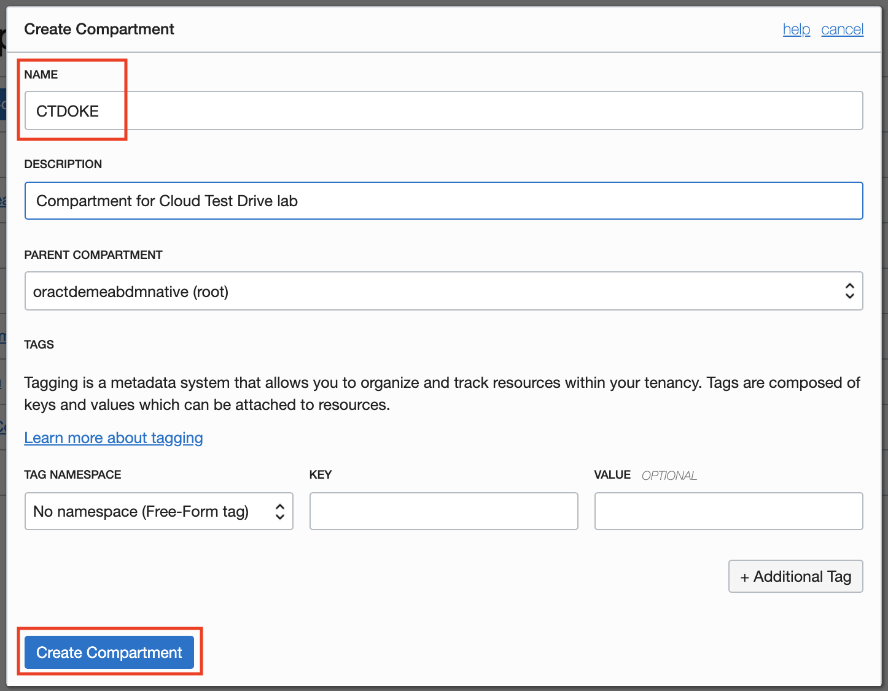
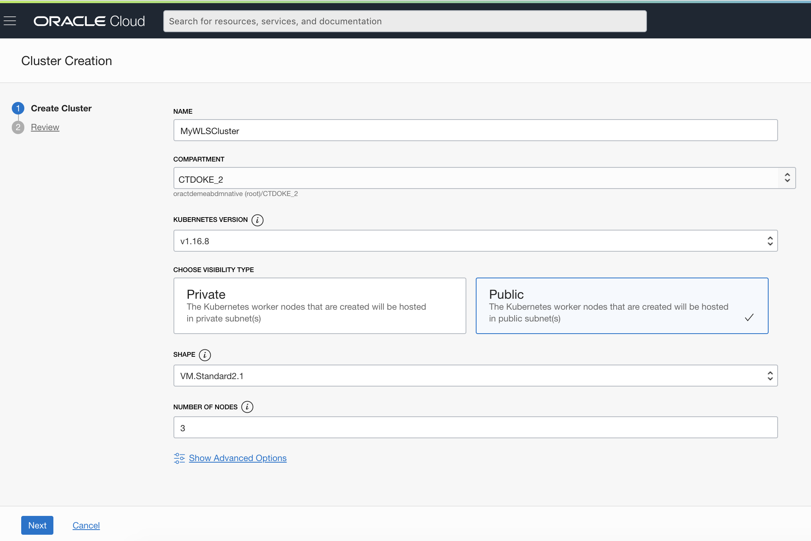
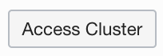
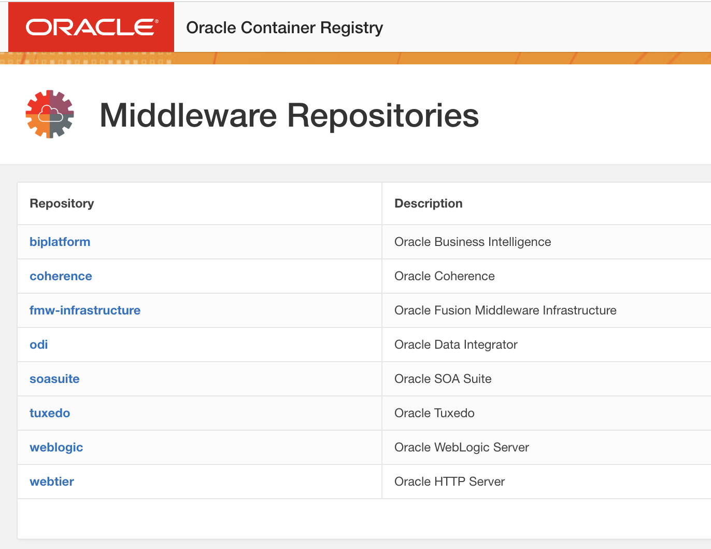

# Running WebLogic on Kubernetes

## Introduction
This lab will showcase running WebLogic on a Kubernetes cluster, using the Operator to manage the WebLogic domains.  This tutorial is based on the [Quick Start Guide](https://oracle.github.io/weblogic-kubernetes-operator/quickstart/) that is part of the official WebLogic Kubernetes Operator page, but now using the **Cloud Shell** , allowing you to run this lab using just a browser and your Oracle Cloud account.

## Prerequisites

To run these labs you will need access to an Oracle Cloud Tenancy, either via a **Free Tier**, using a **Pay-as-you-Go** account, or using the **Corporate account** of your organization. 

If you do not have an account yet, you can obtain an Oracle Free Tier account by [clicking here.](https://myservices.us.oraclecloud.com/mycloud/signup?sourceType=:ow:wb:sh:em::RC_WWMK200517P00003:Vlab_Weblogic_July&intcmp=:ow:wb:sh:em::RC_WWMK200517P00003:Vlab_Weblogic_July)


## 1. Preparing your environment

- Open the [OCI console](https://console.eu-frankfurt-1.oraclecloud.com), log in using the **Single Sign On** menu on the **left** 

Create a token for your user (will be used to login to the docker repository):

- Open your **User Settings** by clicking on the icon on the top right of the console, then select *User Settings* 

- You can now see the details of your user account:

  

- Select **Auth Token** in the left-hand menu, then click the button **Generate Token**.

    - Enter a name for the token

    - Use the **Copy** button to copy the token in your buffer, and **immediately paste it** in a notebook of your choice, you will need this later.

    

    

- Obtain the name of your Docker repository so you can reference it when pushing or pulling images:

    - Navigate to the "Tenancy Details" screen by scrolingl down in the menu to the section **Governance and Administration**, then expand **Administration**, then select **Tenancy Details**

    - Note down the name of your Object Storage Namespace:

    


### Creating a Compartment

First check if you already have the **CTDOKE** compartment

- In the Cloud Infrastructure Console, click on the hamburger menu on the top left of the screen. From the pull-out menu, under Identity, click Compartments.


  - You will see the list of compartments currently available in your instance, which will include at least the root compartment of your tenancy (with has the tenancy name). 

    

    

- If you already see the **CTDOKE** compartment in this list, 
  **==> no need to create a new compartment !!**.    You can move to the next step (2. Creating a Kubernetes cluster)

  

If you are using a new **Free Tier** account, you will probably only have the root compartment, in that case: 

- Click on **Create Compartment** button to start the compartment creation process

  

  

Enter the following in create Compartment window

- **Name**: Enter **CTDOKE**
- **Description**: Enter a description for the compartment
- **Parent Compartment**:  select the root compartment.
- Click on the **Create Compartment** link 
- You can verify the compartment created on Compartments page


## 2. Setting up a Kubernetes cluster

We will be using an Oracle Cloud Managed Kubernetes cluster to deploy weblogic.

- Navigate to the ***Developer Services***, then ***Container Clusters (OKE)***.

  

- Use the **Create Cluster** button, and select the **Quick Create** type of installation

- Click the **Launch Workflow** button to start the configuration

- On the **Create cluster** screen, enter following parameters:

    - Name : the name of your cluster.  We will be using the name *WlsOkeLab_(your_initials)* in this tutorial.  Please replace (your_initials) by a 3-letter code, for example Abc
    - Choose the CTDOKE compartment if it is available in the tenancy.
    - Select **Public** worker nodes
    - Choose the shape VM_Standard2.1
    - **Remark**: you might have to check available compute shapes on your tenancy.  You can do this by visualizing the **Service Limits** on the "Administration" , "Tenancy Details" page.
    - Select the **Number of nodes** you want to create in the node pool.  For example you could make this correspond to the number of *Availability Domains* in the *Region* you are using : in Frankfurt this is **3**, in Amsterdam this is **1**.  More details [here](https://docs.cloud.oracle.com/en-us/iaas/Content/General/Concepts/regions.htm).
    - Click the **Next** button to confirm the configuration, then **Create Cluster** to start the creation.

  


  


Once the cluster is created (the nodes will continue to be created), you can access the button , and copy the command to download the kubeconfig file of your cluster.

This command will look like: 

```
oci ce cluster create-kubeconfig --cluster-id ocid1.cluster.oc1.eu-frankfurt-1.aaaaaaymqyweojygcqwinbwg4yw --file $HOME/.kube/config --region eu-frankfurt-1 --token-version 2.0.0
```


- Open the **Cloud Shell** using the button **">_"** in the upper right of the console.

- execute the command you copied.  Example :

  ```
  EXAMPLE ONLY : oci ce cluster create-kubeconfig --cluster-id ocid1.cluster.oc1.eu-frankfurt-1.aaaaaaaaae4wmmjvmzobzmojqmy3dqz4ggntbgcrtqzrvmy4d --file $HOME/.kube/config --region eu-frankfurt-1 --token-version 2.0.0 
  ```
  
- Validate you are able to access the cluster with kubectl, and see the nodes that are up and running

  ```
  kubectl get nodes
  ```
  
  ```
  NAME        STATUS   ROLES   AGE   VERSION
  10.0.10.2   Ready    node    15h   v1.16.8
  10.0.10.3   Ready    node    15h   v1.16.8
  10.0.10.4   Ready    node    15h   v1.16.8
  ```


## 3. Configuring the WebLogic Operator

- Clone the repository containing the Kubernetes operator to your Cloud Shell :

  ```
  git clone https://github.com/oracle/weblogic-kubernetes-operator
  ```

- To be able to download the Oracle Container image with WebLogic, you need to first accept the license terms for the software.  

    - Navigate to the [Oracle Container Registry](https://container-registry.oracle.com) 

    - Select **Middleware**
    

    - Select  **weblogic**

    

    - Sign in to the Oracle Website

    - ATTENTION: you are logging into the Oracle website to download the docker image, and you need to use your **Oracle Account**, so ***not*** your **Oracle Cloud Tenancy** credentials !  This is the account you also use to register for Oracle events and seminars for example.
      In case you don't have an Oracle account yet, please do so via the "Create Account" button on the login screen.

      

    - Accept the T&C.

    - You are now ready to download the image :

    ```
    docker login container-registry.oracle.com
    
    docker pull container-registry.oracle.com/middleware/weblogic:12.2.1.4
    ```


- Setting up the necessary Roles for the Helm service:

```
cat <<EOF | kubectl apply -f -
apiVersion: rbac.authorization.k8s.io/v1
kind: ClusterRoleBinding
metadata:
  name: helm-user-cluster-admin-role
roleRef:
  apiGroup: rbac.authorization.k8s.io
  kind: ClusterRole
  name: cluster-admin
subjects:
- kind: ServiceAccount
  name: default
  namespace: kube-system
EOF
```


### Setting up a Traefik loadbalancer

- First cd into the wls operator directory

  ```
  cd weblogic-kubernetes-operator/
  ```

- Set up Helm:

  `helm repo add stable https://kubernetes-charts.storage.googleapis.com/`

- Create a namespace for the traefik loadbalancer:

  `kubectl create namespace traefik`

- Then execute the Helm chart:

  ```
  helm install traefik-operator stable/traefik \
      --namespace traefik \
      --values kubernetes/samples/charts/traefik/values.yaml \
      --set "kubernetes.namespaces={traefik}" \
      --wait
  ```
  
- Validate the Traefik service is up and running

  ```
  kubectl get services -n traefik
  ```


### Setting up the WebLogic Operator

- Create a namespace for the operator:

  ```bash
  kubectl create namespace sample-weblogic-operator-ns
  ```

- Create a service account for the operator in the operator’s namespace:

  ```bash
  kubectl create serviceaccount -n sample-weblogic-operator-ns sample-weblogic-operator-sa
  ```

- Use `helm` to install and start the operator from the directory you just cloned:

  ```bash
  helm install sample-weblogic-operator kubernetes/charts/weblogic-operator \
    --namespace sample-weblogic-operator-ns \
    --set image=oracle/weblogic-kubernetes-operator:3.0.0 \
    --set serviceAccount=sample-weblogic-operator-sa \
    --set "domainNamespaces={}" \
    --wait
  ```

- Verify that the operator’s pod is running, by listing the pods in the operator’s namespace. You should see one for the operator.
  
  ```bash
    kubectl get pods -n sample-weblogic-operator-ns
  ```
  
- Create namespace where your WebLogic will run and that can host one or more domains:

  ```bash
kubectl create namespace sample-domain1-ns
  ```
  
- Use `helm` to configure the operator to manage domains in this namespace:

  ```bash
helm upgrade sample-weblogic-operator  kubernetes/charts/weblogic-operator \
      --namespace sample-weblogic-operator-ns \
      --reuse-values \
      --set "domainNamespaces={sample-domain1-ns}" \
      --wait
  ```
  
- Configure Traefik to manage Ingresses created in this namespace:

  ```bash
  helm upgrade traefik-operator stable/traefik \
      --namespace traefik \
      --reuse-values \
      --set "kubernetes.namespaces={traefik,sample-domain1-ns}" \
      --wait
  ```

- Create a Kubernetes secret for the WebLogic administrator credentials containing the `username` and `password` for the domain, using the [create-weblogic-credentials](http://github.com/oracle/weblogic-kubernetes-operator/blob/master/kubernetes/samples/scripts/create-weblogic-domain-credentials/create-weblogic-credentials.sh) script:

  ```bash
  kubernetes/samples/scripts/create-weblogic-domain-credentials/create-weblogic-credentials.sh \
    -u weblogic -p welcome1 -n sample-domain1-ns -d sample-domain1
  ```

- Set up a "Secret" to allow you to pull images from your private repository:

    - Run the following command, where you need to insert your specific parameters:

    ```bash
    kubectl create secret docker-registry <your-initials>-ocirsecret \
    --docker-server=<region-code>.ocir.io \
    --docker-username='<Object-Storage-Namespace>/<oci-username>' \
    --docker-password='<oci-auth-token>' \
    --docker-email='<email-address>' \
    -n sample-domain1-ns
    ```

    - **your-initials** as part of the name of the secret so this is your individual secret in case you are working in a shared environment

    - **region-code** is for example **fra** for Frankfurt, **iad** for Ashburn, etc.  See [here](https://docs.cloud.oracle.com/iaas/Content/Registry/Concepts/registryprerequisites.htm#Availab) for details.

    - **Object-Storage-Namespace** is the name of Object Storage Namespace you noted down.

    - **oci-username** is the fully qualified username for which you created a token: 

      `oracleidentitycloudservice/<user_name>`

    - **oci-auth-token** is the **Auth Token** you just created and noted down

  - **email-address** is mandatory but not used, can be jdoe@acme.com

  - Example command:

    ```bash
  kubectl create secret docker-registry jle-ocirsecret \
    --docker-server=fra.ocir.io \
    --docker-username='frpqldntjs/oracleidentitycloudservice/ppan' \
    --docker-password='k]j64r{1sJSSF-;)K8' \
    --docker-email='jdoe@acme.com' \
    -n sample-domain1-ns
    ```
    
    The result should be 
    
    ```
    secret/jle-ocirsecret created
    ```

  


## 4. Configuring WebLogic

We'll now start configuring the WebLogic setup itself.  For this we will use the **create-domain** utility, which will generate a custom WLS image based on the standard image you previously downloaded.

This build will be performed based on a config file you first need to set up for your Kubernetes cluster

- Cd into the sample scripts directory for a **domain home in image** type of deployment.  

  ```
    cd kubernetes/samples/scripts/create-weblogic-domain/domain-home-in-image
  ```

- Copy the template config file to edit your version : 

  ```
  cp create-domain-inputs.yaml my-create.yaml
  ```

- Now edit the file with your favourite editor, either vi or nano, and perform the following updates:

    - `domainUID`: `sample-domain1`
    - `image`: this line is commented out in the example, please remove the `#` .
    Just in case you might be sharing your tenancy repository with colleagues, we will add your initials to the image name you will be using.  
    The format to use is : `<region code>.ocir.io/<Object-Storage-Namespace>/<your_initials>-wls/weblogic:12.2.1.4`
      - Example : `fra.ocir.io/frpqldntjs/ppa-wls/weblogic:12.2.1.4`
    - `imagePullSecretName`: `<your initials>-ocirsecret` 
    Note this line is commented out in the example, please remove the `#` . 
    - `weblogicCredentialsSecretName`: `sample-domain1-weblogic-credentials`
    - `exposeAdminNodePort: true` 
    - `namespace`: `sample-domain1-ns`
    - `domainHomeImageBase`: `container-registry.oracle.com/middleware/weblogic:12.2.1.4`

- The creation script will generate output, we'll create a directory for this
  
  ```
  mkdir out_dir
  ```
  
- Now launch the build, using the file you just edited as the paramater file : 

  ```
  ./create-domain.sh -i my-create.yaml \
  	-o out_dir \
  	-u weblogic -p welcome1
  ```


Lets take a look at the artifacts generated : 

- the updated docker image, tagged to be pushed to the private registry of your tenancy

  ```
  docker images
  ```

  you should see a line containing something like : 

   	`fra.ocir.io/frpqldntjs/ppa-wls/weblogic    12.2.1.4`

  

- a definition file of the kubernetes domain resource

  ```
  more out_dir/weblogic-domains/sample-domain1/domain.yaml
  ```

  ```
  # Copyright (c) 2017, 2019, Oracle Corporation and/or its affiliates. All rights reserved.
  # Licensed under the Universal Permissive License v 1.0 as shown at https://oss.oracle.com/licenses/upl.
  #
  # This is an example of how to define a Domain resource.
  #
  apiVersion: "weblogic.oracle/v8"
  kind: Domain
  metadata:
    name: sample-domain1
    namespace: sample-domain1-ns
    labels:
      weblogic.resourceVersion: domain-v2
      weblogic.domainUID: sample-domain1
  spec:
    # The WebLogic Domain Home
    domainHome: /u01/oracle/user_projects/domains/sample-domain1
  
    # If the domain home is in the image
    domainHomeInImage: true
  
  ....
  
  ```

  


### Launching your WLS instance

First we need to push the generated docker image to the private registry of our tenancy.  Execute following operations to achieve this.

- Execute a "docker login" into your **private registry on Oracle OCI**.

  ```
  docker login <region-code>.ocir.io/<storage namespace>
  ```

  For example : `docker login fra.ocir.io/frpqldntjs`

  - username to use : `<storage namespace>/<full_username>`

    - For example:  `frpqldntjs/oracleidentitycloudservice/ppan`

  - Password: you need to use the password token, see the provided access document

    - ATTENTION : in the beginning of this tutorial you created the  token for a specific user, and in order to make things simple we suggested the user provided through the Oracle Identity Cloud Service.  This is where you will use that token, so if the login should fail, double-check you created the token for the correct user called for example `oracleidentitycloudservice/ppan` , as opposed to the "non-idcs" user called `ppan` ! 

    

- Now you can push the image : *pay attention to replace (your_initials)*

  ```
  docker push <region-code>.ocir.io/<storage namespace>/<your_initials>-wls/weblogic:12.2.1.4
  ```

  For example :
   `docker push fra.ocir.io/frpqldntjs/ppa-wls/weblogic:12.2.1.4`

  - Remark: if you are not the administrator of the Cloud Tenancy, you need to ask your administrator to allow you the use of the registry service through a **policy**:
    - `allow group <your_group> to manage repos in tenancy `


- Create the kubernetes custom artifact *domain*, using the config file that was generated by the creation script:

  ```
  kubectl apply -f out_dir/weblogic-domains/sample-domain1/domain.yaml
  ```


This definition will be picked up by the operator, who will try to activate the required WLS elements, in this case the domain controller and 2 managed servers

- Use `kubectl` to show that the domain resource was created:

  ```bash
  kubectl describe domain sample-domain1 -n sample-domain1-ns
  ```


- After a short time, you will see the Administration Server and Managed Servers running.

  ```bash
  kubectl get pods -n sample-domain1-ns
  ```

- You should also see all the Kubernetes services for the domain.

  ```bash
  kubectl get services -n sample-domain1-ns
  ```


### Setting up an Ingress

Before we can access the WLS environment, we need to set up an Ingress using the traefik loadbalancer we already prepared.

- Return to the top directory of the repository, *weblogic-kubernetes-operator*

  ```
  cd $HOME/weblogic-kubernetes-operator
  ```

  

- Create an Ingress for the domain, in the domain namespace, by using a Helm chart:

```bash
helm install sample-domain1-ingress kubernetes/samples/charts/ingress-per-domain \
  --namespace sample-domain1-ns \
  --set wlsDomain.domainUID=sample-domain1 \
  --set traefik.hostname=sample-domain1.org
```

- To confirm that the load balancer noticed the new Ingress and is successfully routing to the domain’s server pods, you can send a request to the URL for the “WebLogic ReadyApp framework” which will return a HTTP 200 status code, as shown in the example below.

   - First obtain the external IP address of one of the nodes of your kubernetes cluster:

      ```
      kubectl get nodes -o wide
      ```
      
      This should give a result looking like : 
      
      ```
      NAME        STATUS   ROLES   AGE   VERSION   INTERNAL-IP   EXTERNAL-IP       OS-IMAGE                  KERNEL-VERSION                   CONTAINER-RUNTIME
      10.0.10.2   Ready    node    41h   v1.14.8   10.0.10.2     158.101.173.126   Oracle Linux Server 7.7   4.14.35-1902.8.4.el7uek.x86_64   docker://18.9.8
      10.0.10.3   Ready    node    41h   v1.14.8   10.0.10.3     130.61.34.87      Oracle Linux Server 7.7   4.14.35-1902.8.4.el7uek.x86_64   docker://18.9.8
      10.0.10.4   Ready    node    41h   v1.14.8   10.0.10.4     130.61.78.251     Oracle Linux Server 7.7   4.14.35-1902.8.4.el7uek.x86_64   docker://18.9.8
      ```
      
      Take a note of one of the External IP addresses, for example 130.61.34.87
      
   - Now use curl on this IP address: 

      ```
      curl -v -H 'host: sample-domain1.org' http://130.61.34.87:30305/weblogic/ready
      ```
      
      
      

    Result:

   ```
     About to connect() to localhost port 30305 (#0)
       Trying 10.196.1.64...
       Connected to localhost (10.196.1.64) port 30305 (#0)
   > GET /weblogic/ HTTP/1.1
   > User-Agent: curl/7.29.0
   > Accept: */*
   > host: domain1.org
   >
   < HTTP/1.1 200 OK
   < Content-Length: 0
   < Date: Thu, 20 Dec 2018 14:52:22 GMT
   < Vary: Accept-Encoding
   <   Connection #0 to host localhost left intact
   ```

   

- To access the WLS Administration Console:

   - Open a browser and navigate to the WebLogic Console :

      - Use the IP address you obtained in the previous step

      - Use port 30701

      - Path:  /console/

      - Example :

      ```
   http://130.61.34.87:30701/console/
      ```
   
      

   You will be asked for the username and password, remember we set this to **weblogic/welcome1** as tradition requires ;-)

   


Congratulations, your WebLogic is running on OKE !


### Cleaning up

In case you want to remove the resources you created during this lab, please find below a quick summary : 

- Delete your Kubernetes cluster :
    - Navigate to **Developer Services**, then **Kubernetes Clusters**
    - Click Hamburger Menu of your cluster
    - Select **Delete**
- Delete the images in your Docker repository :
    - Navigate to **Developer Services** , then **Container Registry**
    - Click the on the repository you created, probably starting with your initials-wls/weblogic
    - Click **Actions**
    - Select **Delete Repository**
- In Cloud Shell
    - Execute the command `rm -rf ~/weblogic-kubernetes-operator`


---

Use the ***Back*** button of your browser to return to the home page of the tutorials.