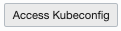

[Go to the Cloud Test Drive Welcomer Page](../../readme.md)


# Running WebLogic on Kubernetes

## Introduction
This lab will showcase running WebLogic on a Kubernetes cluster, using the Operator to manage the WebLogic domains.  This tutorial is based on the [Quick Start Guide](https://oracle.github.io/weblogic-kubernetes-operator/quickstart/) that is part of the official WebLogic Kubernetes Operator page, but with most prerequisites already taken care of in our Test Drive Cloud Tenancy and using a Linux Desktop with all local software already installed and configured.

### Prerequisites

To run this lab, you need following elements : 

- An Oracle account to download the docker image.  To create an account, follow instructions [here](https://profile.oracle.com/myprofile/account/create-account.jspx)

- If you are following this lab as part of an **Oracle physical event**, your instructor will provide you with a Linux Virtual machine, in which case you can simply access the desktop of that environment via a VNC viewer.  All software will already be available on that environment.

- If you prefer to install the various tools on your own laptop, please make sure you have following components available:
  - [git](https://git-scm.com/book/en/v2/Getting-Started-Installing-Git)
  - [kubectl](https://kubernetes.io/docs/tasks/tools/install-kubectl/)
  - [helm version 2](https://github.com/helm/helm/releases/tag/v2.16.1)
  - [oci cli](https://docs.cloud.oracle.com/iaas/Content/API/SDKDocs/cliinstall.htm) (Oracle Cloud Infrastructure - Command Line Interface)
  
  Installation of these tools is out of the scope of this tutorial, please follow the above links for installation instructions of each tool.


### Setting up a Kubernetes cluster

We will be using an Oracle Cloud Managed Kubernetes cluster to deploy weblogic.

This chapter gives a quick overview of the steps to follow, using the OCI Console to set up a *Quick Start* OKE cluster.

- Open the [OCI console](https://console.eu-frankfurt-1.oraclecloud.com), log in using the **Single Sign On** menu on the **left** and navigate to the ***Developer Services***, then ***Container Clusters (OKE)***.

  

- Use the **Create Cluster** button, and select the **Quick Create** type of installation

- On the Create cluster screen, enter following parameters:

  - Name : the name of your cluster.  We will be using the name *WlsOkeLab_(your_initials)* in this tutorial.  Please replace (your_initials) by a 3-letter code, for example Abc
  - Choose the CTDOKE compartment
  - Select version 14.8
  - Select Public worker nodes
  - Change the shape to VM_Standard2.1
  - Activate the Add-ons (Dashboard and Tiller)
    

  


Once the cluster is created (the nodes will continue to be created), you can access the button , and copy the commands to download the kubeconfig file of your cluster.

- Open a terminal window where you have the oci cli installed, and execute the commands you copied.  Example :

  ```
  $ mkdir -p $HOME/.kube
  $ oci ce cluster create-kubeconfig --cluster-id ocid1.cluster.oc1.eu-frankfurt-1.aaaaaaaaae4wmmjvmzobzmojqmy3dqzdbgq4ggntbgcrtqzrvmy4d --file $HOME/.kube/config --region eu-frankfurt-1 --token-version 2.0.0 
  ```

- Validate you are able to access the cluster with kubectl, and see the nodes that are up and running

  ```
  [oracle@jle-for-wls ~]$ kubectl get nodes
  NAME        STATUS   ROLES   AGE   VERSION
  10.0.10.2   Ready    node    15h   v1.14.8
  10.0.10.3   Ready    node    15h   v1.14.8
  10.0.10.4   Ready    node    15h   v1.14.8
  ```


### Preparing your environment

- Clone the repository containing the Kubernetes operator to your local machine :

  ```
  git clone https://github.com/oracle/weblogic-kubernetes-operator
  ```

- To be able to download the Oracle Container image with WebLogic, you need to first accept the license terms for the software.  

  - Navigate to the [Oracle Container Registry](https://container-registry.oracle.com) 

  - Select **Middleware**
    

  - Select  **weblogic**

    

  - Sign in to Oracle

  - Accept the T&C.

  - You are now ready to download the image :

    ```
    docker login
    
    docker pull container-registry.oracle.com/middleware/weblogic:12.2.1.3
    ```


### Configuring the Kubernetes cluster

- Setting up the necessary Roles for the Helm service:

```
$ cat <<EOF | kubectl apply -f -
apiVersion: rbac.authorization.k8s.io/v1
kind: ClusterRoleBinding
metadata:
  name: helm-user-cluster-admin-role
roleRef:
  apiGroup: rbac.authorization.k8s.io
  kind: ClusterRole
  name: cluster-admin
subjects:
- kind: ServiceAccount
  name: default
  namespace: kube-system
EOF
```


- Setting up a Traefik loadbalancer

  - First cd into the wls operator directory

    ```
    cd weblogic-kubernetes-operator/
    ```

  - Then execute the Helm chart:

    ```
    helm install stable/traefik \
      --name traefik-operator \
      --namespace traefik \
      --values kubernetes/samples/charts/traefik/values.yaml  \
      --set "kubernetes.namespaces={traefik}" \
      --wait
    ```

  - Validate the Traefik service is up and running

    ```
    kubectl get services -n traefik
    ```

- Setting up the WebLogic Operator

  - Create a namespace for the operator:

    ```bash
    $ kubectl create namespace sample-weblogic-operator-ns
    ```

  - Create a service account for the operator in the operator’s namespace:

    ```bash
    $ kubectl create serviceaccount -n sample-weblogic-operator-ns sample-weblogic-operator-sa
    ```

  - Use `helm` to install and start the operator from the directory you just cloned:

    ```bash
    $ helm install kubernetes/charts/weblogic-operator \
      --name sample-weblogic-operator \
      --namespace sample-weblogic-operator-ns \
      --set image=oracle/weblogic-kubernetes-operator:2.4.0 \
      --set serviceAccount=sample-weblogic-operator-sa \
      --set "domainNamespaces={}" \
      --wait
    ```

  - Verify that the operator’s pod is running, by listing the pods in the operator’s namespace. You should see one for the operator.

    ```bash
    $ kubectl get pods -n sample-weblogic-operator-ns
    ```

- Create namespace where your WebLogic will run

  - Create a namespace that can host one or more domains:

    ```bash
    $ kubectl create namespace sample-domain1-ns
    ```

  - Use `helm` to configure the operator to manage domains in this namespace:

    ```bash
    $ helm upgrade \
      --reuse-values \
      --set "domainNamespaces={sample-domain1-ns}" \
      --wait \
      sample-weblogic-operator \
      kubernetes/charts/weblogic-operator
    ```

  - Configure Traefik to manage Ingresses created in this namespace:

    ```bash
    $ helm upgrade \
      --reuse-values \
      --set "kubernetes.namespaces={traefik,sample-domain1-ns}" \
      --wait \
      traefik-operator \
      stable/traefik
    ```

  - Create a Kubernetes secret for the WebLogic administrator credentials containing the `username` and `password` for the domain, using the [create-weblogic-credentials](http://github.com/oracle/weblogic-kubernetes-operator/blob/master/kubernetes/samples/scripts/create-weblogic-domain-credentials/create-weblogic-credentials.sh) script:

    ```bash
    $ kubernetes/samples/scripts/create-weblogic-domain-credentials/create-weblogic-credentials.sh \
      -u weblogic -p welcome1 -n sample-domain1-ns -d sample-domain1
    ```


### Configuring WebLogic

We'll now start configuring the WebLogic setup itself.  For this we will use the **create-domain** utility, which will generate a custom WLS image based on the starard image you previously downloaded.

- This build will be performed based on a config file you first need to set up for your Kubernetes cluster

  - Cd into the sample scripts directory for a **domain home in image** type of deployment.  

    ```
    cd kubernetes/samples/scripts/create-weblogic-domain/domain-home-in-image
    ```

  - Copy the template config file to edit your version : 

    ```
    cp create-domain-inputs.yaml my-create.yaml
    ```

  - Now edit the file with your favourite editor, either vi or the text editor of your Linux desktop, and perform the following updates:

    - `domainUID`: `sample-domain1`
    - image name: because we will all be using a common registry, you need to add your initials to the image name you will be using.  The format to use is *fra.ocir.io/oractdemeabdmnative/**(your_initials)**-wls/weblogic:12.2.1.3*
      Example for abc :  `image: fra.ocir.io/oractdemeabdmnative/abc-wls/weblogic:12.2.1.3`
    - `weblogicCredentialsSecretName`: `sample-domain1-weblogic-credentials`
    - `namespace`: `sample-domain1-ns`
    - `domainHomeImageBase`: `container-registry.oracle.com/middleware/weblogic:12.2.1.3`
    - `exposeAdminNodePort: true` 

  - The creation script will generate output, we'll create a directory for this

    ```
    mkdir out_dir
    ```

    

- Now launch the build, using the file you just edited as the paramater file : 

  ```
  ./create-domain.sh -i my-create.yaml \
  	-o /home/oracle/weblogic-kubernetes-operator/kubernetes/samples/scripts/create-weblogic-domain/domain-home-in-image/out_dir \
  	-u weblogic -p welcome1
  ```


Lets take a look at the artifacts generated : 

- the updated docker image, tagged to be pushed to the private registry of your tenancy

  ```
  docker images | grep 
  ```

  you should see a line containing `fra.ocir.io/oractdemeabdmnative/(your_initials)-wls/weblogic    12.2.1.3`

- a definition file of the kubernetes domain resource

  ```
  more out_dir/weblogic-domains/sample-domain1/domain.yaml
  ```

  ```
  # Copyright (c) 2017, 2019, Oracle Corporation and/or its affiliates. All rights reserved.
  # Licensed under the Universal Permissive License v 1.0 as shown at https://oss.oracle.com/licenses/upl.
  #
  # This is an example of how to define a Domain resource.
  #
  apiVersion: "weblogic.oracle/v6"
  kind: Domain
  metadata:
    name: sample-domain1
    namespace: sample-domain1-ns
    labels:
      weblogic.resourceVersion: domain-v2
      weblogic.domainUID: sample-domain1
  spec:
    # The WebLogic Domain Home
    domainHome: /u01/oracle/user_projects/domains/sample-domain1
  
    # If the domain home is in the image
    domainHomeInImage: true
  
  ....
  
  ```


#### Launching your WLS instance

First we need to push the generated docker image to the private registry of our tenancy.  Execute following operations to achieve this.

- Execute a "docker login" into the registry.
  - username to use : (tenancy_name)/(username)
    - For our environment, use `oractdemeabdmnative/api.user`
  - Password: you need to use the password token, see the provided access document

  ```
  docker login fra.ocir.io/oractdemeabdmnative
  ```


- Now you can push the image : *pay attention to replace (your_initials)*

  ```
  docker push fra.ocir.io/oractdemeabdmnative/(your_initials)-wls/weblogic:12.2.1.3
  ```


- Create the kubernetes custom artifact *domain*, using the config file that was generated by the creation script:

  ```
  kubectl apply -f out_dir/weblogic-domains/sample-domain1/domain.yaml
  ```


This definition will be picked up by the operator, who will try to activate the required WLS elements, in this case the domain controller and 2 managed servers

- Use `kubectl` to show that the domain resource was created:

  ```bash
  $ kubectl describe domain sample-domain1 -n sample-domain1-ns
  ```


- After a short time, you will see the Administration Server and Managed Servers running.

  ```bash
  $ kubectl get pods -n sample-domain1-ns
  ```

- You should also see all the Kubernetes services for the domain.

  ```bash
  $ kubectl get services -n sample-domain1-ns
  ```


#### Setting up an Ingress

Before we can access the WLS environment, we need to set up an Ingress using the traefik loadbalancer we already prepared.

- Return to the top directory of the repository, *weblogic-kubernetes-operator*

  ```
  cd $HOME/weblogic-kubernetes-operator
  ```

  

- Create an Ingress for the domain, in the domain namespace, by using a Helm chart:

```bash
$ helm install kubernetes/samples/charts/ingress-per-domain \
  --name sample-domain1-ingress \
  --namespace sample-domain1-ns \
  --set wlsDomain.domainUID=sample-domain1 \
  --set traefik.hostname=sample-domain1.org
```

- To confirm that the load balancer noticed the new Ingress and is successfully routing to the domain’s server pods, you can send a request to the URL for the “WebLogic ReadyApp framework” which will return a HTTP 200 status code, as shown in the example below.

   - First obtain the external IP address of one of the nodes of your kubernetes cluster:

      `kubectl get nodes -o wide`
      
      This should give a result looking like : 
      
      ```
      NAME        STATUS   ROLES   AGE   VERSION   INTERNAL-IP   EXTERNAL-IP       OS-IMAGE                  KERNEL-VERSION                   CONTAINER-RUNTIME
      10.0.10.2   Ready    node    41h   v1.14.8   10.0.10.2     158.101.173.126   Oracle Linux Server 7.7   4.14.35-1902.8.4.el7uek.x86_64   docker://18.9.8
      10.0.10.3   Ready    node    41h   v1.14.8   10.0.10.3     130.61.34.87      Oracle Linux Server 7.7   4.14.35-1902.8.4.el7uek.x86_64   docker://18.9.8
      10.0.10.4   Ready    node    41h   v1.14.8   10.0.10.4     130.61.78.251     Oracle Linux Server 7.7   4.14.35-1902.8.4.el7uek.x86_64   docker://18.9.8
      ```
      
      Take a note of one of the External IP addresses, for example 130.61.34.87
      
   - Now use curl on this IP address: 

   ```
   $ curl -v -H 'host: sample-domain1.org' http://130.61.34.87:30305/weblogic/ready
     About to connect() to localhost port 30305 (#0)
       Trying 10.196.1.64...
       Connected to localhost (10.196.1.64) port 30305 (#0)
   > GET /weblogic/ HTTP/1.1
   > User-Agent: curl/7.29.0
   > Accept: */*
   > host: domain1.org
   >
   < HTTP/1.1 200 OK
   < Content-Length: 0
   < Date: Thu, 20 Dec 2018 14:52:22 GMT
   < Vary: Accept-Encoding
   <   Connection #0 to host localhost left intact
   ```

   

- To access the WLS Administration Console:

   Open a browser to `http://130.61.34.87:30701/console/`, **and replace the address with your IP address**.


Congratulations, your WebLogic is running on OKE !


---

Use the ***Back*** button of your browser to return to the home page of the tutorials.