# WebLogic-Cloud-Workshop
Provisioning a Weblogic domain with WebLogic Cloud from OCI Marketplace

# 0. Prerequisites

- [Oracle Cloud Infrastructure](https://cloud.oracle.com/en_US/cloud-infrastructure) enabled account. The tutorial has been tested using [Trial account](https://myservices.us.oraclecloud.com/mycloud/signup) (as of January, 2019).

# 1. Required Keys and OCIDs
Execute the following 3 steps as per [Required Keys and OCIDs](https://docs.cloud.oracle.com/en-us/iaas/Content/API/Concepts/apisigningkey.htm):

1. Create a user in IAM for the person or system who will be calling the API, and put that user in at least one IAM group with any desired permissions. See Adding Users. **You can skip this if the user exists already.**

2. Keep a record of the following items for later use in the lab:

  * RSA key pair in PEM format (minimum 2048 bits)
  * Private key passphrase
  * Path to the private key: /Your_directory/.oci/oci_api_key.pem
  * Fingerprint of the public key.
  * Tenancy's OCID and user's OCID.

3. Upload the public key from the key pair in the Console

---

**Note:** Keep a record of: **Fingerptint of the public key**, **Tenancy's OCID**, **user's OCID**, and **Path of the private key on your desktop** for later use in this lab.

---

# 2. Encode the WebLogic administrator password in base64 format

1. Choose a password (minimum password length of 8 characters, of which one is non-alphabetic)

2. Encode the password in base64 format

  For example, on Linux:

```
$ echo -n 'Your_Password' | base64
```

---

**Note:** Keep a record of the output of the above **'echo -n 'Your_Password' | base64'** command for later use in this lab.

---

# 3. Create an SSH Key 

Create a secure shell (SSH) key pair so that you can access the compute instances in your Oracle WebLogic Server domains.

A key pair consists of a public key and a corresponding private key. When you create a domain using Oracle WebLogic Cloud, you specify the public key. You then access the compute instances from an SSH client using the private key.

On a **Windows** platform, you can use the PuTTY Key Generator utility. See [Creating a Key Pair ](https://www.oracle.com/pls/topic/lookup?ctx=en/cloud/paas/weblogic-cloud/user&id=oci_general_keypair) in the Oracle Cloud Infrastructure documentation.

On a **UNIX or UNIX-like** platform, use the ssh-keygen utility. For example:

```
$ ssh-keygen -b 2048 -t rsa -f mykey
    
$ cat mykey.pub  
```

---

**Note:** Keep a record of the output of the above **'cat mykey.pub'** command for later use in this lab.

---


# 4. Install terraform on your desktop

---

**Important Note:**

The Oracle Cloud Infrastructure Terraform provider version 3.27.0 and greater requires Terraform version 0.12 or greater.

---

Follow this [video](https://learn.hashicorp.com/terraform/getting-started/install.html) to install terraform on your laptop. Note: The first part of the video provides instructions for **macOS and Linux** and the second for **Windows**.

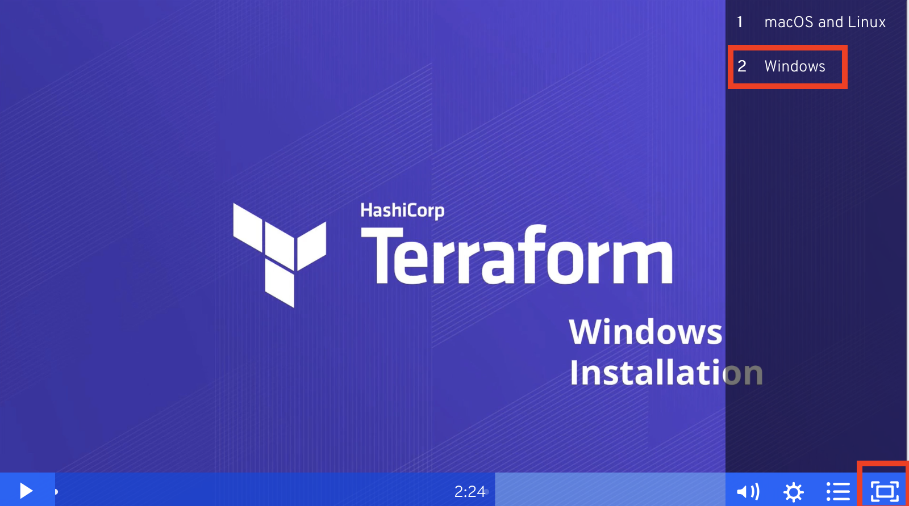


# 5. Clone this github repository on your laptop

Clone the WebLogic Cloud Workshop git repository to your desktop.
```
git clone https://github.com/StephaneMoriceau/WebLogic-Cloud-Workshop.git
```

---

**Note:**

If git is not already install on your desktop, you may want to simply create a directory named **terraform** and manually copy all the files from https://github.com/StephaneMoriceau/WebLogic-Cloud-Workshop.git/tree/master/terraform in newly created files under your terraform directory.

---

# 6. Update the terraform configuration file with the specifics of your environment

1. Copy the terraform configuration variables example file

```
$ cd ~/WebLogic-Cloud-Workshop/terraform

$ cp terraform.tfvars.example terraform.tfvars
```

2. Open the terraform.tfvars file

Use your preferred editor and open the file terraform.tfvars. it should look like this:

```
# Identity and access parameters

oci_base_identity = {
  api_fingerprint      = "64:8c:3b:..."
  api_private_key_path = "/Your_directory/.oci/oci_api_key.pem"
  api_private_key_password = "api_private_key_passphrase"
  compartment_id       = "ocid1.compartment.oc1..aaaaaaaa3l..."
  tenancy_id           = "ocid1.tenancy.oc1..aaaaaaaaznlqfv..."
  user_id              = "ocid1.user.oc1..aaaaaaaajbvljcmjw..."
}

oci_base_general = {
  label_prefix = "base"
  region       = "us-MYREGION-1"
}


# Base 64 password

Base64_Password = "bWlu..."


# Infrastructure parameters (if you change either Compartment_name or Dynamic_Group_name update the statement accordingly in the Create Policy for the Dynamic group in main.tf)

Compartment_name = "WLS_Compartment"
Dynamic_Group_name = "WLS_Dynamic_Group"
Policy_name = "WLS_Policy"
Vault_name = "WLS_Vault"
Key_name = "WLS_Key"
```


3. Update the terraform.tfvars file with the specific of your environment

Update the following variables with the values your recorded earlier in the lab

- api_fingerprint            [(See section #1)](https://github.com/StephaneMoriceau/WebLogic-Cloud-Workshop/blob/readme/README.md#1-required-keys-and-ocids)
- api_private_key_path       [(See section #1)](https://github.com/StephaneMoriceau/WebLogic-Cloud-Workshop/blob/readme/README.md#1-required-keys-and-ocids)
- api_private_key_password   [(See section #1)](https://github.com/StephaneMoriceau/WebLogic-Cloud-Workshop/blob/readme/README.md#1-required-keys-and-ocids) 
- compartment_id             (use the Tenancy OCID as per [section #1](https://github.com/StephaneMoriceau/WebLogic-Cloud-Workshop/blob/readme/README.md#1-required-keys-and-ocids)) Note: using the Tenancy OCID selects the root compartment in that tenancy.
- tenancy_id                 [(See section #1)](https://github.com/StephaneMoriceau/WebLogic-Cloud-Workshop/blob/readme/README.md#1-required-keys-and-ocids))           
- user_id                    [(See section #1)](https://github.com/StephaneMoriceau/WebLogic-Cloud-Workshop/blob/readme/README.md#1-required-keys-and-ocids)

- region (see note below)
---

**Note:** To confirm your home region: Open the Console, open the Region menu, and then click Manage Regions.
A list of the regions offered by Oracle Cloud Infrastructure is displayed. Select your **home region code** e.g. us-ashburn-1, us-phoenix-1.

---

- Base64_Password            [(See section #2)](https://github.com/StephaneMoriceau/WebLogic-Cloud-Workshop/blob/readme/README.md#2-encode-the-weblogic-administrator-password-in-base64-format)

4. Save terraform.tfvars


# 7. Create the required infrasture to provision a Domain in WebLogic Cloud from the OCI Marketplace

1. Initialize Terraform:

```
$ terraform init
```

2. View what Terraform plans do before actually doing it:

```
$ terraform plan
```

3. Use Terraform to Provision resources:

```
$ terraform apply
```

The result has to be similar:

```
oci_kms_key.WLS_Key: Still creating... [1m10s elapsed]
oci_kms_key.WLS_Key: Still creating... [1m20s elapsed]
oci_kms_key.WLS_Key: Still creating... [1m30s elapsed]
oci_kms_key.WLS_Key: Creation complete after 1m39s [id=ocid1.key.oc1.phx.a5pc75peaafqw.abyhqlj[..........]f5tskaoaa
oci_kms_encrypted_data.WLS_Encrypted_Data: Creating...
oci_kms_encrypted_data.WLS_Encrypted_Data: Creation complete after 2s [id=]

Apply complete! Resources: 3 added, 0 changed, 2 destroyed.

Outputs:

Encrypted_data = IcsoJqtmC[..........]WJcMcUgAAAAA=
compartment_id = ocid1.compartment.oc1..aaaaaaaa[..........]hlybyag3ibeza
cryptographic_endpoint = https://a5[..........]w-crypto.kms.us-phoenix-1.oraclecloud.com
key_OCID = ocid1.key.oc1.phx.a5pc75peaafqw.abyhqlj[..........]f5tskaoaa
```

---

**Note:** Keep a record of the values of the following variables for later use in the lab:
- **Encrypted_data**
- **cryptographic_endpoint**
- **key_OCI**

---


# 8. Provision a Domain in WebLogic Cloud from the OCI Markeplace

**Launch a Stack**

Sign in to Marketplace and specify initial stack information.

1. Sign in to the Oracle Cloud Infrastructure Console.

2. Click the  Navigation Menu icon and select Marketplace.


3. You can choose to browser-search for WebLogic Cloud, or for faster search you can apply the filters:

Type: Stack
Publisher: Oracle
Category: Application Development

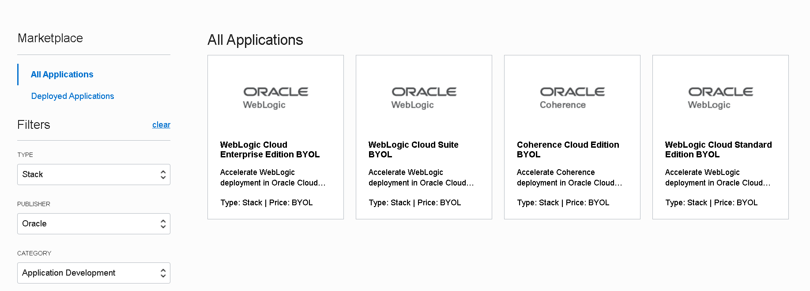

3. Choose **WebLogic Cloud Enterprise Edition BYOL**; This brings you to the Stack Overview page:

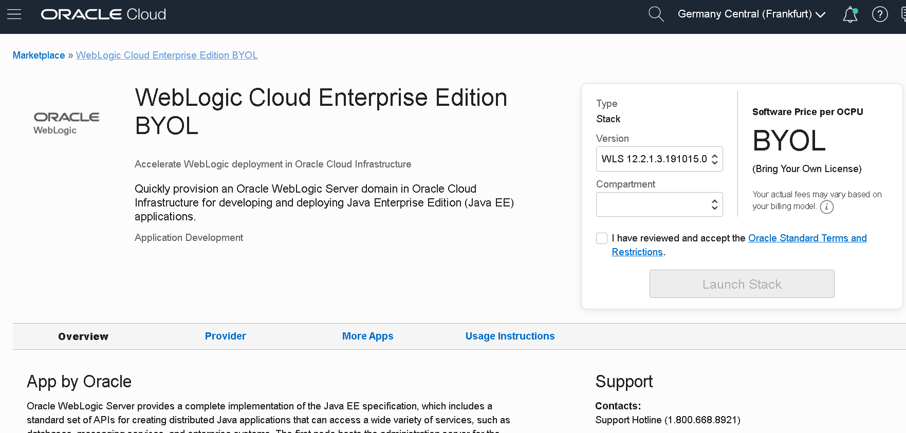

4. Select a version of Oracle WebLogic Server 12c.
If there's more than one 12c patch, the latest patch is the default.

5. Select the compartment **"WLS_Compartment"** in which we will create the stack.

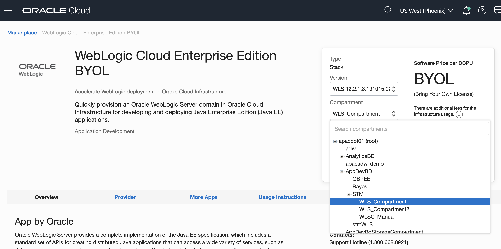

By default the stack compartment is used to contain the domain compute instances and network resources. If later on you specify a network compartment on the Configure Variables page of the Create Stack wizard, then only the compute instances are created in the stack compartment that you select here.

6. Select the Terms and Restrictions check box, and then click Launch Stack.

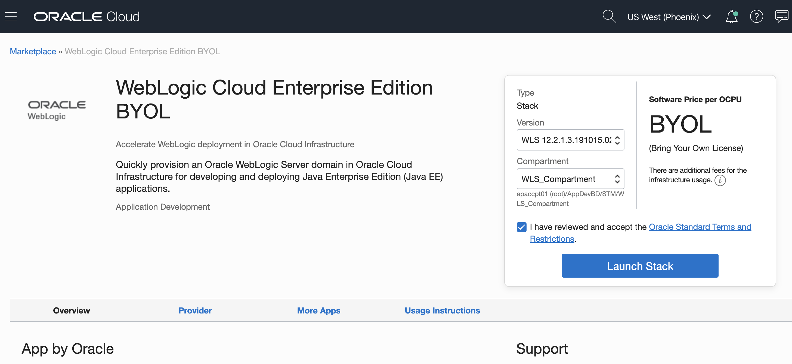

The Create Stack wizard is displayed.

**Specify Stack Information**

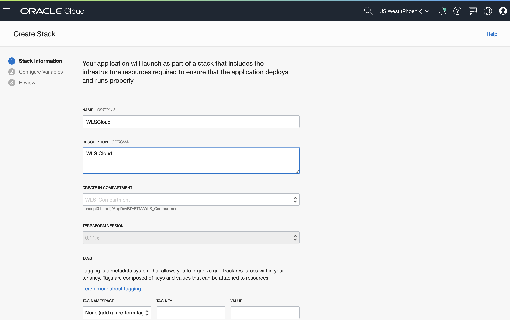

Specify the name, description, and tags for the stack.

8. On the Stack Information page of the Create Stack wizard, enter a name for your stack.

9. Enter a description for the stack (optional).

10. Specify one or more tags for your stack (optional).

11. Click Next.

The Configure Variables page opens.

**Configure WebLogic Instance Parameters**

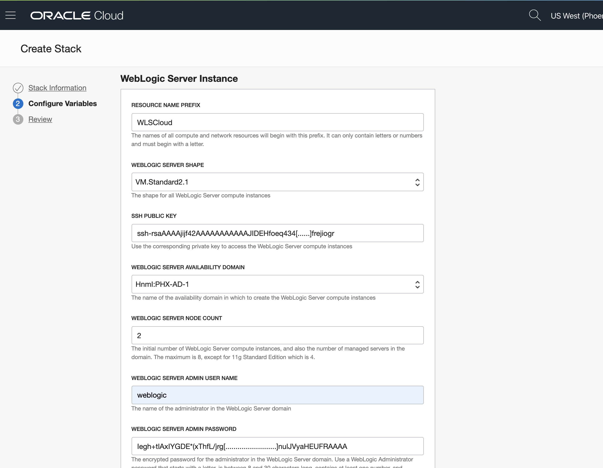

Specify the parameters needed to configure the WebLogic instance domain.

12. In the WebLogic Server Instance section, enter the resource name prefix.(The maximum character length is 8.
This prefix is used by all the created resources.)

13. Select the WebLogic Server shape for the compute instances: **VM.Standard2.1**. (Fyi, only the following shapes are supported: VM.Standard2.x, VM.Standard.E2.x, BM.Standard2.x, BM.Standard.E2.x 

14. Enter the SSH public key. [(See section #3)](https://github.com/StephaneMoriceau/WebLogic-Cloud-Workshop/tree/readme#3-create-an-ssh-key)

15. Select the availability domain where you want to create the domain.**Choose one of the displyed ADs**

16. Select the number of managed servers you want to create. **Select 2**
The managed servers will be members of a cluster, unless you selected WebLogic Server Standard Edition.

17. Enter a user name for the WebLogic Server administrator. **Enter weblogic**

18. Enter an encrypted password for the WebLogic Server administrator. **Enter the value of Encrypted-data in the output of the terraform apply command that you run in [section #7](https://github.com/StephaneMoriceau/WebLogic-Cloud-Workshop/blob/readme/README.md#7-create-the-required-infrasture-to-provision-a-domain-in-weblogic-cloud-from-the-oci-marketplace)**

**Configure Advanced Parameters for a Domain**


19. Don't change / select WebLogic Server Instance Advanced Configuration

20. Network Compartment: Select **WLS_compartment**

21. VCN Strategy: Select **Create New VCN**

22. WLS Network: Enter **WLSCloudVCN** 

23. WLS Network CIDR: Keep the default

24. Subnet Strategy: Select **Create New Subnet**

25. Subnet Type: Keep the default **Use Public Subnet** selection.

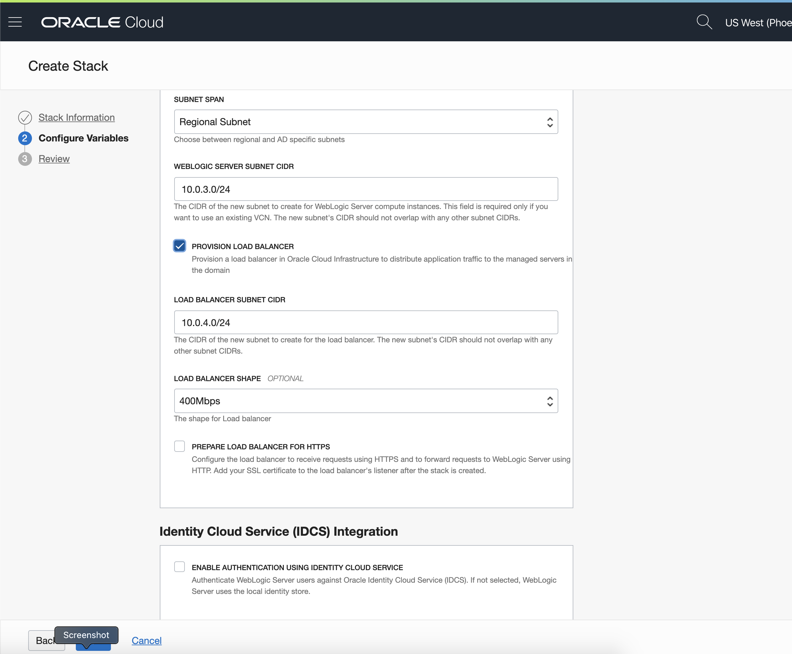

26. Subnet span: Select **Regional Subnet**

27. Select **Provision Load Balancer**

28. LB Network CIDR: Keep the default

29. LB Shape: Select **400Mbps**

30. Do **NOT** select **Prepare Load Balancer for https**

31. Do **NOT** select **Enable authentification using Identity Cloud Service**

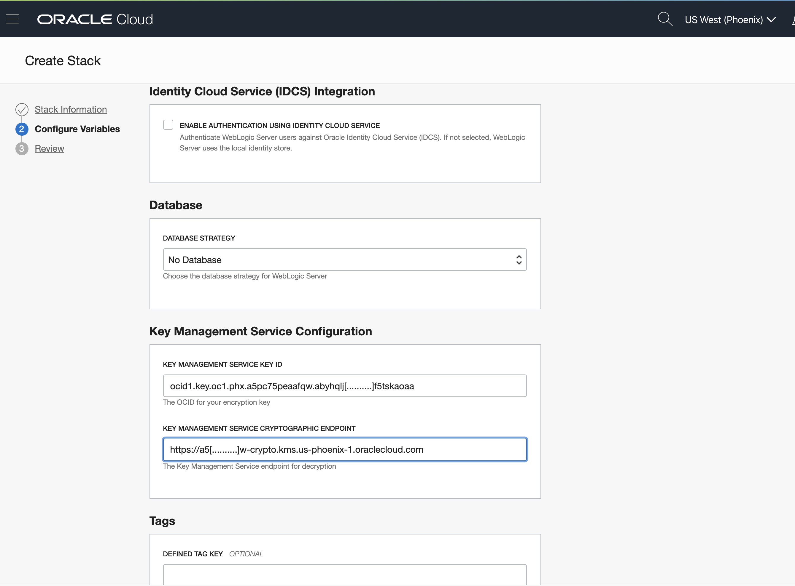

32. Database Strategy: keep the default **No Database**

33. Key Management Service Key ID: **Enter the value of key_OCID in the output of the terraform apply command that you run in [section #7](https://github.com/StephaneMoriceau/WebLogic-Cloud-Workshop/blob/readme/README.md#7-create-the-required-infrasture-to-provision-a-domain-in-weblogic-cloud-from-the-oci-marketplace)**

34. Key Management Service Endpoint: **Enter the value of crypographic_endpoint in the output of the terraform apply command that you run in [section #7](https://github.com/StephaneMoriceau/WebLogic-Cloud-Workshop/blob/readme/README.md#7-create-the-required-infrasture-to-provision-a-domain-in-weblogic-cloud-from-the-oci-marketplace)**

35. At the bottom of the Configure Variables page, click **Next**

You are now ready to create the stack.

37. Review the Stack configuration and Click **Create**


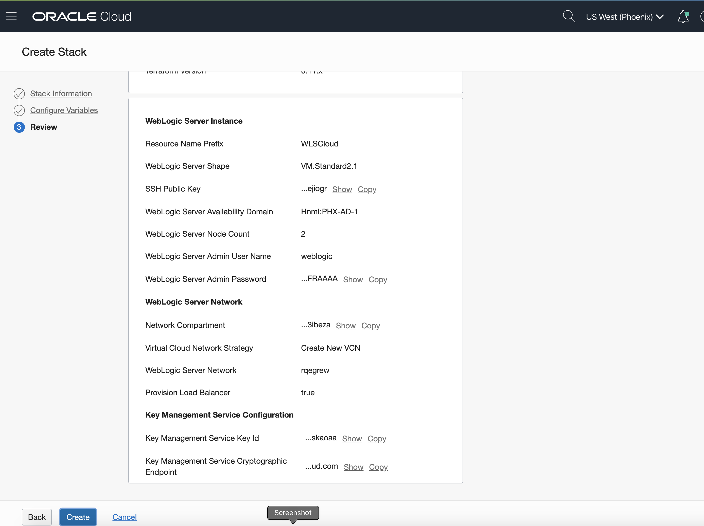


38. A Stack Job is being run and our WLS Server is being provisioned


39. While all resources being created we can check the Job Logs; it helps fixing potentially configuration errors if the provisioning fails


40. After a while (~ 15 minutes), the Job should complete with success

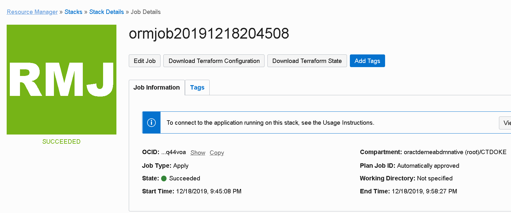


41. We can check the Outputs section of Job Resources and check for two important values:

- Sample Application URL
- WebLogic Server Administration Console


42. Let's check the WLS admin console of the newly created WebLogic Server

- As we have chosen a Public Subnet for the WLS network, both Compute instances that have been created have public IPs associated.
- In a new browser window, enter the **URL** as displayed in **WebLogic Server Administration Console**
- Login with weblogic username (weblogic) and the **plain text password** you selected in [section #2](https://github.com/StephaneMoriceau/WebLogic-Cloud-Workshop/blob/readme/README.md#2-encode-the-weblogic-administrator-password-in-base64-format)


43. We can see that our domain has one admin server and two managed servers:


44. Let's check the WLS sample-app deployed in the newly created WebLogic Server

- In a new browser window, enter the **URL** as displayed in **WebLogic Server sample application**

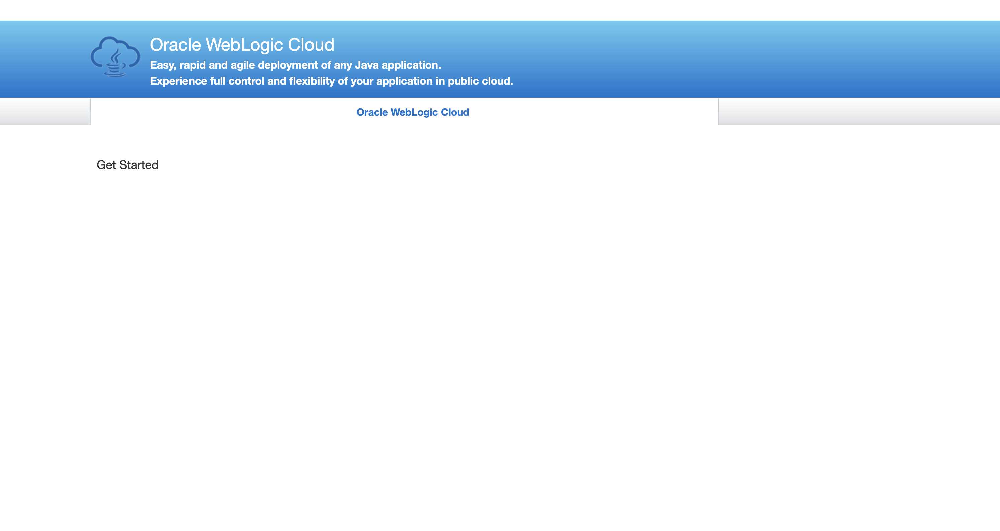

45. We can check the Compute Instances to see what has been provisioned 

From  choose Core Infrastructure -> Compute -> Instances:


46. We can see two instances having our prefix mentioned during Stack configuration; one of them runs the admin server and a managed server and the other runs the second managed server:

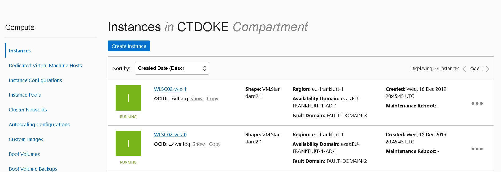


**Congratulations! Your WLS domain is up & running!**
