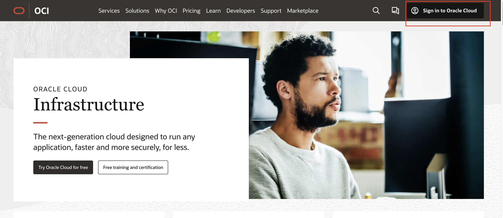
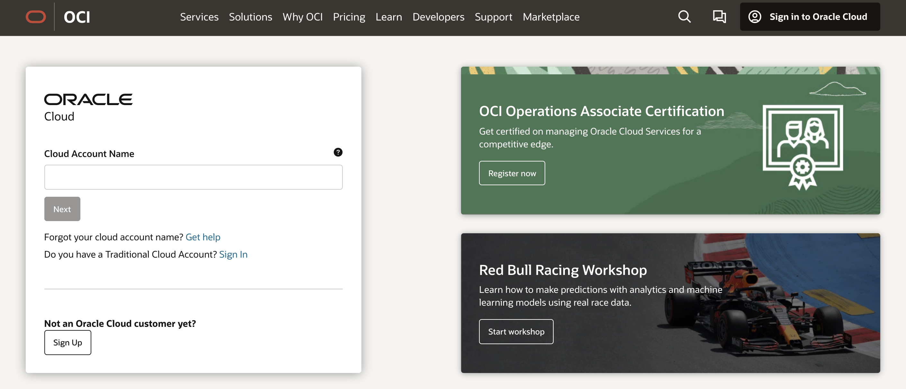
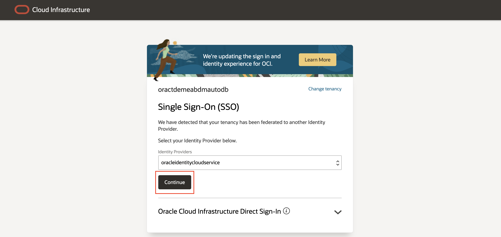

# Access your Cloud Account #

## Introduction

This lab step will guide you through accessing your cloud accound.

As explained in the introduction, the Oracle experts running this session will provide you with login details to access your personal cloud account.  Please note however that you will be using a **common cloud tenancy**, so you will see the OCI objects your colleagues will be creating during this session.

Therefore please make sure to prefix the core infrastructure elements you will be creating with your initials or the unique number assiged to you in the live session (specifically : the Kubernetes instance)

Estimated Lab Time: 5 minutes

### Objectives

In this lab, you will:
* Identify the required details for logging into your account
* Login to your account and identify the compartment that is available for you

## Task 1: Collect your access details ####

The Oracle experts running this session will provide you with following details : 

- your **Cloud Account Name**, sometimes called the Tenancy name
- your **User Name**
- your **Password**
- the **Compartment** to use in this lab

Compartments are a way to segment the cloud tenancy between different user groups.  For this lab a specific Compartment has been created, and you only have create rights in that compartment.  If you arttempt to create entities outside of this compartment you will encounter an error.

## Task 2: Login to your account

To login to your account, please use the following URL : 

- [oracle.com/cloud](http://oracle.com/cloud)

On this page, use the **Sign in to Oracle Cloud** button on the top right of your screen :

- Next provide your **Cloud Account Name** as provided by your instructors

The Sign-on screen is now opening, offering you various options to log in.

- Use the **Single Sign-On** section of the dialog, keeping the default Identity Provider **oracleindentitycloudservice** and click the **Continue** button:

You are now presented with the actual login screen

- Please enter the username and password provided to you, and click the **Sign In** button.

Congratulations, you are now on the top level page of the Cloud Management console : 

You may now **proceed to the next lab**.

## Acknowledgements
* **Author** : Jan Leemans, January-2022
* **Last Updated By/Date : ** Jan Leemans, Feb-2022
