# Explore Verrazzano and Consoles

## Introduction

You deployed the Helidon *quickstart-mp* application. In this lab, we will access the application and verify using multiple management tools provided by Verrazzano.

### Grafana

Grafana is an open source solution for running data analytics, pulling up metrics that make sense of the massive amount of data & to monitor our apps with the help of nice customizable dashboards. The tool helps to study, analyse & monitor data over a period of time, technically called time series analytics.
Useful to track the user behaviour, application behaviour, frequency of errors popping up in production or a pre-prod environment, type of errors popping up and the contextual scenarios by providing relative data.

[https://grafana.com/grafana/](https://grafana.com/grafana/)

### Kibana

Kibana is a frontend application that sits on top of the Elastic Stack, providing search and data visualization capabilities for data indexed in Elasticsearch. Verrazzano uses Elasticsearch to store applications log entries.

[https://www.elastic.co/kibana/](https://www.elastic.co/kibana/)

### Prometheus

Prometheus is a monitoring and alerting toolkit. Prometheus collects and stores its metrics as time series data, i.e. metrics information is stored with the timestamp at which it was recorded, alongside optional key-value pairs called labels.

[https://prometheus.io/](https://prometheus.io/)

### Rancher

Rancher is a platform that enables Verrazzano to run containers on multiple Kubernetes clusters in production. It enables hybrid which means single pane of glass management of on-prem clusters and hosted on cloud services like.

[https://rancher.com/](https://rancher.com/)

### Objectives

In this lab, you will:

* Explore the Verrazzano console.
* Explore the Grafana console.
* Explore the Kibana console.
* Explore the Prometheus console.
* Explore the Rancher console.

### Prerequisites

* Kubernetes (OKE) cluster running on the Oracle Cloud Infrastructure.
* Verrazzano installed on a Kubernetes (OKE) cluster.
* Deployed Helidon *quickstart-mp* application.


## Task 1: Explore the Verrazzano Console

Verrazzano installs several consoles. The endpoints for an installation are stored in the `Status` field of the installed Verrazzano Custom Resource.

1. To get the endpoints for these consoles, copy the following command and paste it in the *Cloud Shell* and look at the `Status.Instance` field:

```bash
<copy>kubectl get vz -o yaml</copy>
```

```bash
$ kubectl get vz -o yaml
apiVersion: v1
items:
- apiVersion: install.verrazzano.io/v1alpha1
  kind: Verrazzano
  metadata:
    annotations:
      kubectl.kubernetes.io/last-applied-configuration: |
        {"apiVersion":"install.verrazzano.io/v1alpha1","kind":"Verrazzano","metadata":{"annotations":{},"name":"my-verrazzano","namespace":"default"},"spec":{"profile":"dev"}}
    creationTimestamp: "2021-08-23T15:19:23Z"
    finalizers:
    - install.verrazzano.io
    generation: 2
    managedFields:
    - apiVersion: install.verrazzano.io/v1alpha1
      fieldsType: FieldsV1
      fieldsV1:
        f:metadata:
          f:annotations:
            .: {}
            f:kubectl.kubernetes.io/last-applied-configuration: {}
        f:spec:
          .: {}
          f:profile: {}
      manager: kubectl
      operation: Update
      time: "2021-08-23T15:19:23Z"
    - apiVersion: install.verrazzano.io/v1alpha1
      fieldsType: FieldsV1
      fieldsV1:
        f:metadata:
          f:finalizers: {}
        f:spec:
          f:components:
            .: {}
            f:fluentd:
              .: {}
              f:extraVolumeMounts: {}
          f:security: {}
        f:status:
          .: {}
          f:conditions: {}
          f:instance:
            .: {}
            f:consoleUrl: {}
            f:elasticUrl: {}
            f:grafanaUrl: {}
            f:keyCloakUrl: {}
            f:kibanaUrl: {}
            f:prometheusUrl: {}
            f:rancherUrl: {}
          f:state: {}
          f:version: {}
      manager: verrazzano-platform-operator
      operation: Update
      time: "2021-08-23T15:30:06Z"
    name: my-verrazzano
    namespace: default
    resourceVersion: "49073970"
    selfLink: /apis/install.verrazzano.io/v1alpha1/namespaces/default/verrazzanos/my-verrazzano
    uid: c37cc781-1d16-4aa9-8e08-7111d786fe51
  spec:
    components:
      fluentd:
        extraVolumeMounts:
        - source: /u01/data/docker/containers/
    profile: dev
    security: {}
  status:
    conditions:
    - lastTransitionTime: "2021-08-23T15:19:24Z"
      message: Verrazzano install in progress
      status: "True"
      type: InstallStarted
    - lastTransitionTime: "2021-08-23T15:30:05Z"
      message: Verrazzano install completed successfully
      status: "True"
      type: InstallComplete
    instance:
      consoleUrl: https://verrazzano.default.XX.XX.XX.XX.nip.io
      elasticUrl: https://elasticsearch.vmi.system.default.XX.XX.XX.XX.nip.io
      grafanaUrl: https://grafana.vmi.system.default.XX.XX.XX.XX.nip.io
      keyCloakUrl: https://keycloak.default.XX.XX.XX.XX.nip.io
      kibanaUrl: https://kibana.vmi.system.default.XX.XX.XX.XX.nip.io
      prometheusUrl: https://prometheus.vmi.system.default.XX.XX.XX.XX.nip.io
      rancherUrl: https://rancher.default.XX.XX.XX.XX.nip.io
    state: Ready
    version: 1.0.0
kind: List
metadata:
  resourceVersion: ""
  selfLink: ""
```

2. Use the `https://verrazzano.default.YOUR_UNIQUE_IP.nip.io` to open the Verrazzano console.

3. Verrazzano *dev* profile use self-signed certificates, so you need to click **Advanced** to accept risk and skip warning.

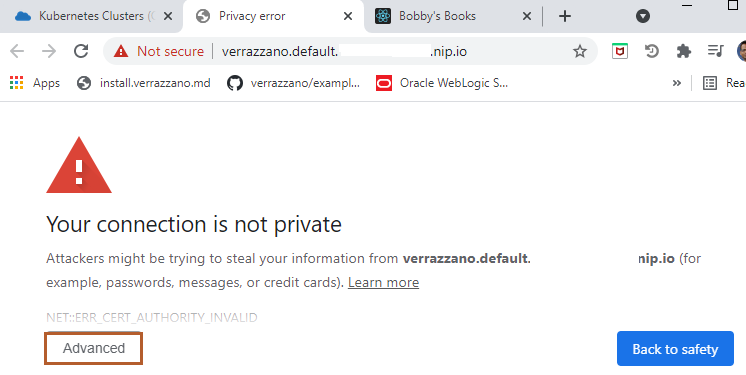

4. Click **Proceed to verrazzano default XX.XX.XX.XX.nip.io(unsafe)**.


5. Because it redirects to the Keycloak console URL for authentication, click **Advanced**.

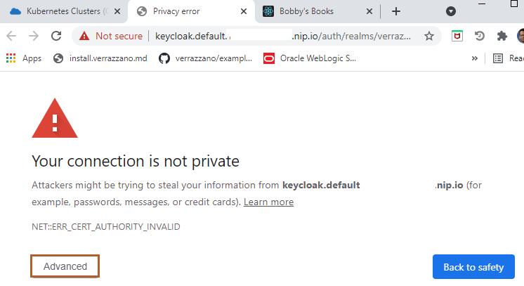

6. Click **Proceed to Keycloak default XX.XX.XX.XX.nip.io(unsafe)**.


7. Now we need the username and password for the Verrazzano console. *Username* is *verrazzano* and to find out the password, go back to the *Cloud Shell* and paste the following command to find out the password for the *Verrazzano Console*.

```bash
<copy>kubectl get secret --namespace verrazzano-system verrazzano -o jsonpath={.data.password} | base64 --decode; echo</copy>
```

8. Copy the password and go back to the browser, where the *Verrazzano Console* is open. Paste the password in the *Password* field and enter *verrazzano* as *Username* and then click **Sign In**.

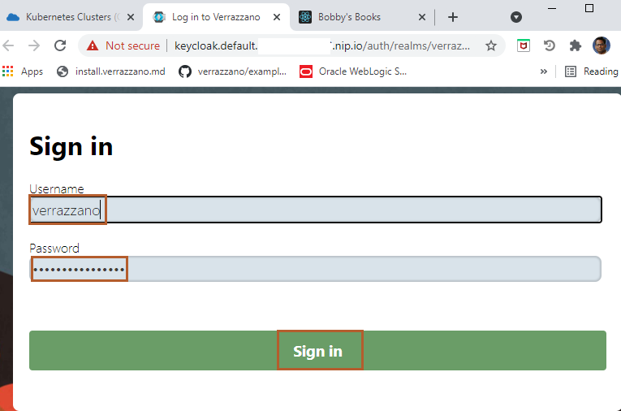

9. From the home page of the Verrazzano Console, you can see *System Telemetry*, and because we installed the *Development Profile* of Verrazzano, you can see it in the **General Information** section. You can see the Helidon *quickstart-mp* application under **OAM Applications**. Click **hello-helidon-appconf** to view components of this application.

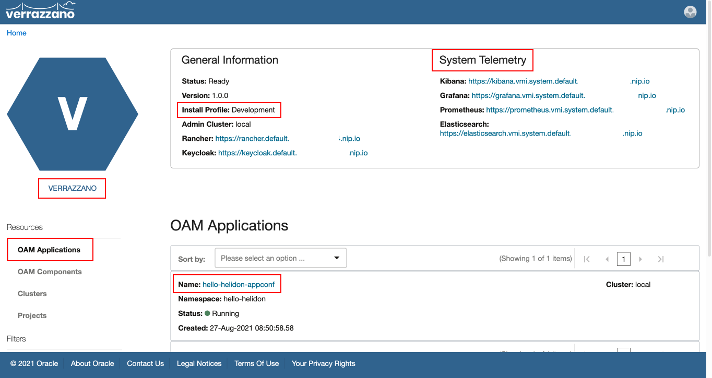

10. There is only one component for this application as you can see under **Components**. To explore the configuration click the **OAM Component Ref:** *hello-helidon-component* component as shown:

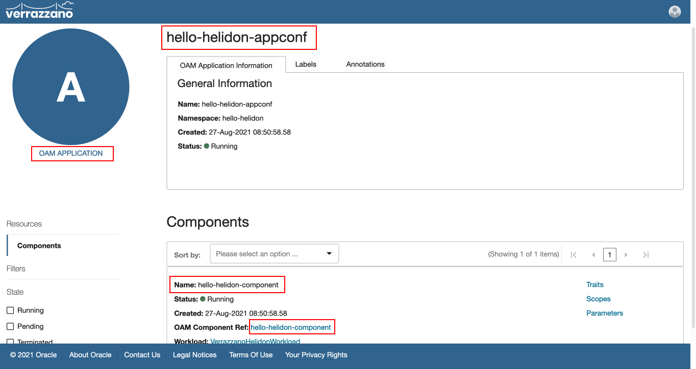

11. You can see *General Information* for this component. To learn about the *Workload Spec*, click **hello-helidon-component** as shown:

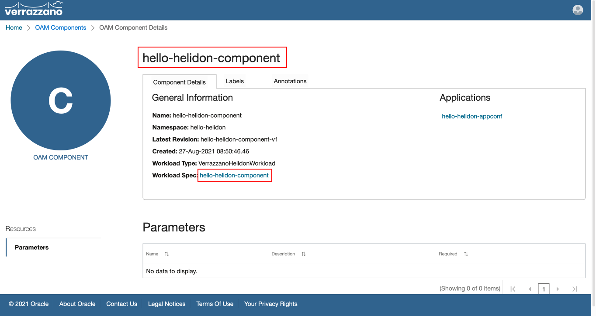

12. Here you can see the configuration details for the *hello-helidon-component* component. Click **Close**.

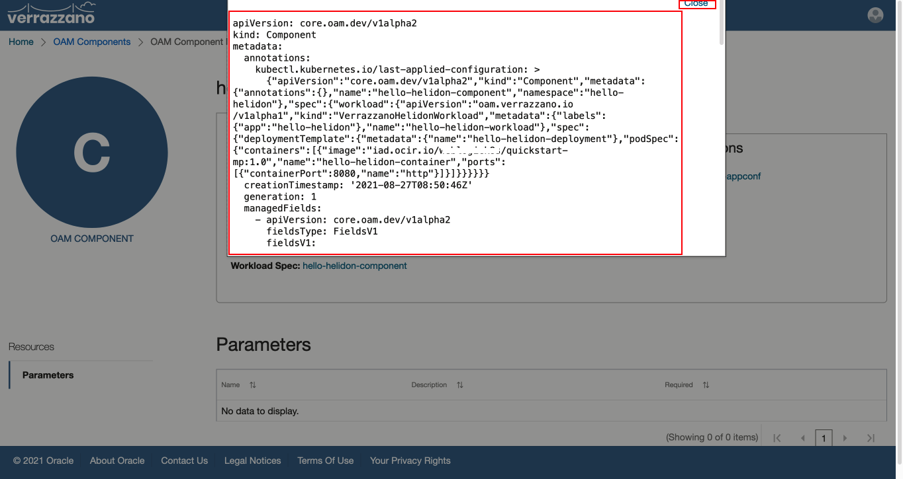

## Task 2: Explore the Grafana Console

1. Click **Home** to go back to Verrazzano Console Home Page.

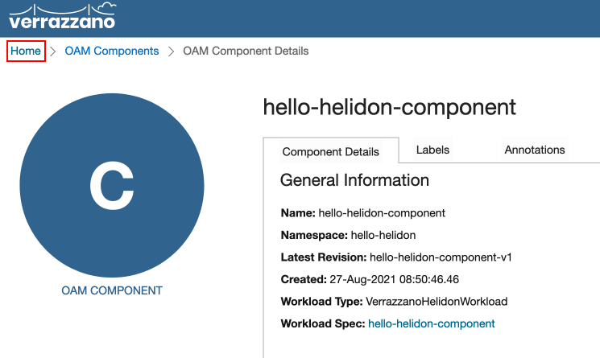

2. On the home page, you'll see the link for opening the *Grafana console*. Click the link for the **Grafana Console** as shown:


3. Click **Advanced**.


4. Click **Proceed to grafana.vmi.system.default.XX.XX.XX.XX.nip.io(unsafe)**.

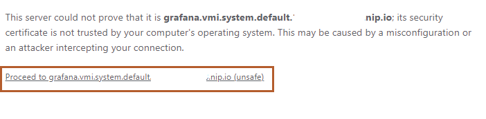

5. The Grafana home page opens. Click **Home** at the top left.

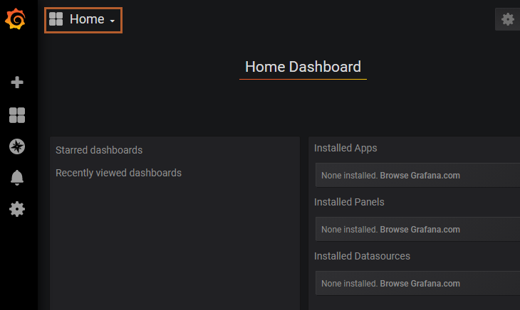

6. Type `Helidon` and you will see *Helidon Monitoring Dashboard* under **General**. Click **Helidon Monitoring Dashboard**.

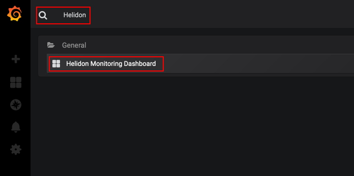

7. Observe the JVM details of the Helidon *quickstart-mp* application such as Status, Heap Usage, Running Time, JVM Heap, Thread Count, HTTP Requests, etc. This is a prebuilt dashboard specifically for Helidon workloads. Of course you can customize this dashboard according to your needs and add custom diagnostics information.

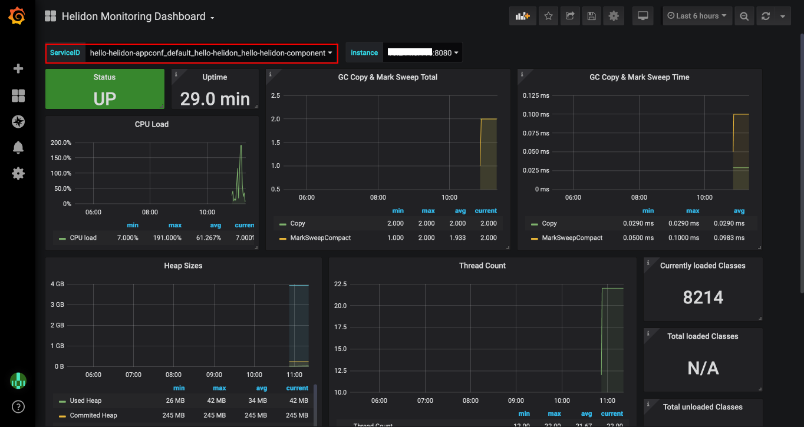

## Task 3: Explore the Kibana Console

1. Go back to the Verrazzano home page and click **Kibana** console.

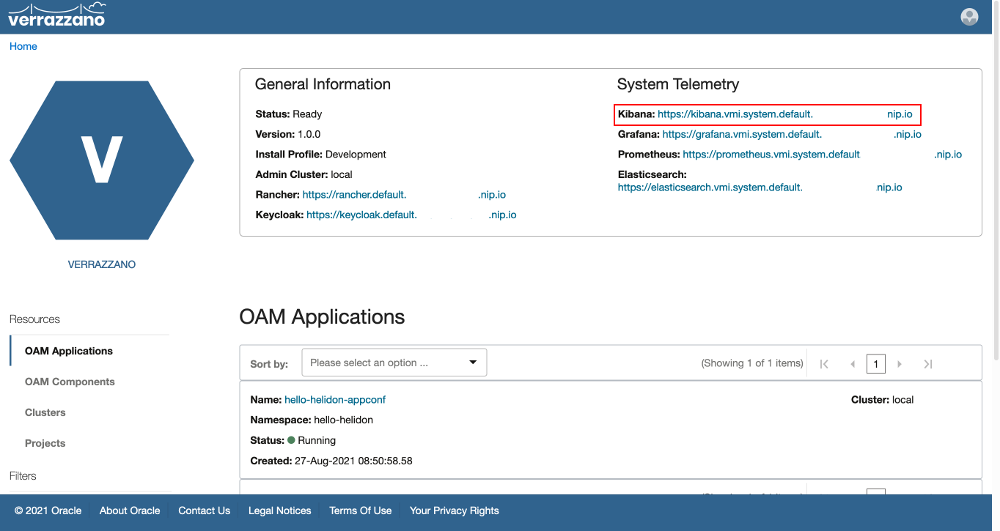

2. Click *Proceed to ... default XX.XX.XX.XX.nip.io(unsafe)* if necessary. First time Kibana shows the welcome page. It offers built in sample data to try Kibana but you can select the **Explore on my own** option, because Verrazzano completed the necessary configuration and the application data is already available.

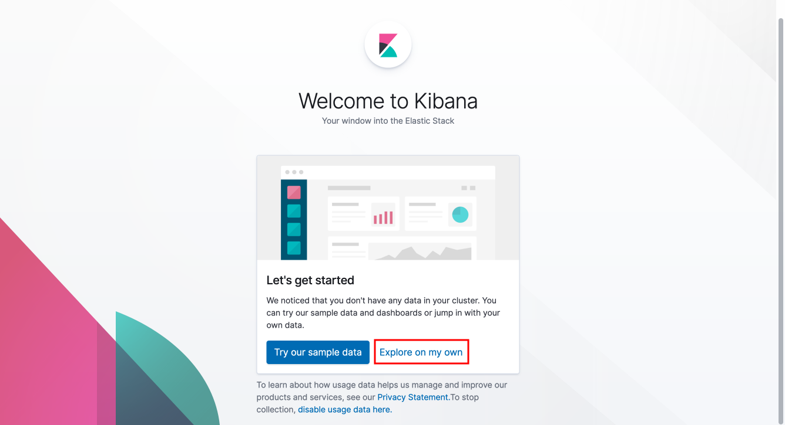

3. On the Kibana homepage click the **Discover** link or its shortcut menu icon on the left side.

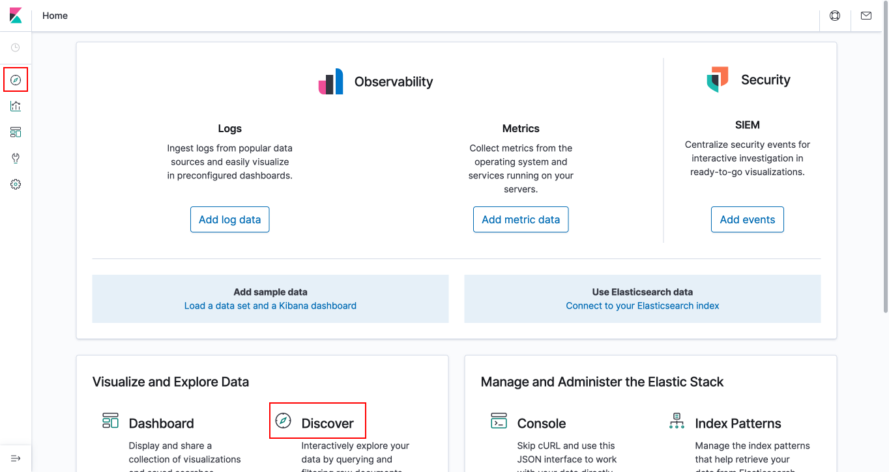

4. In order to find log entry in Elasticsearch first you need to define index pattern. Type `verrazzano-namespace-hello-helidon` in the **Index Pattern**. Select the result from the list below and click **Next**.

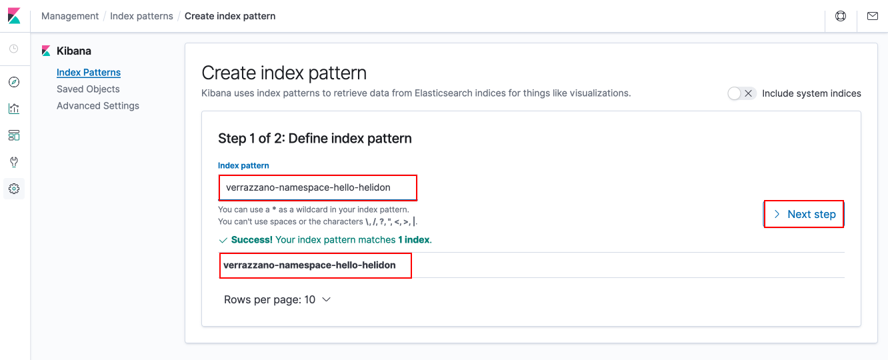

5. On the next page select *@timestamp* as **Time Filter** field name and click **Create Index pattern**.

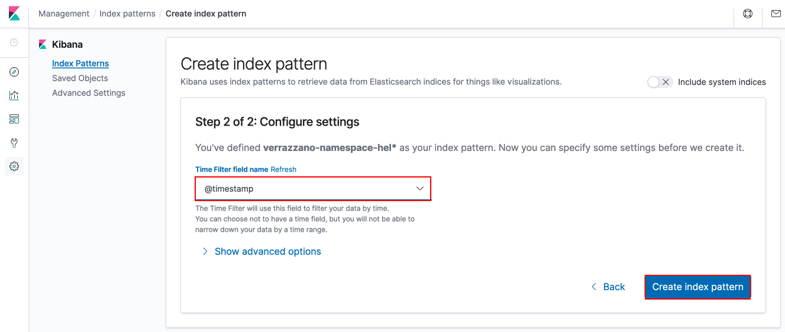

6. When the index is ready you need to click the *Discover* shortcut icon on the left side.

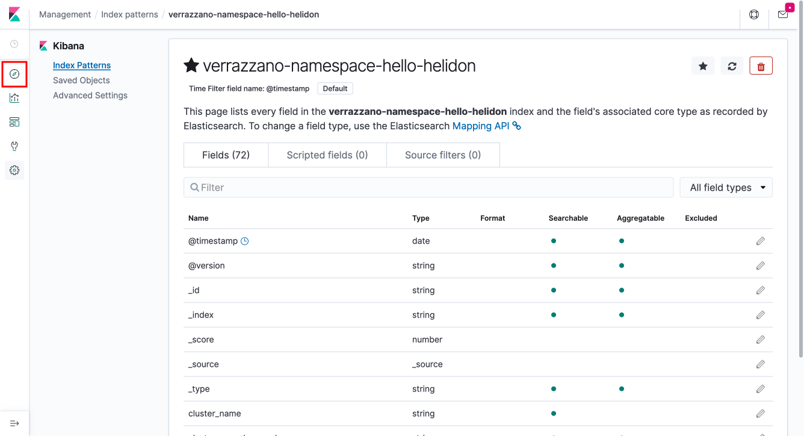

7. Type the custom log entry value you created in the Helidon application: `Help requested` into the filter textbox. Press **Enter** or click **Refresh**. You should get at least one result. <br>
>If you haven't hit the application endpoint, or that happened a long time ago, simply invoke again the following HTTP request in the Cloud Shell against your endpoint. You can execute request multiple times.
```bash
<copy>curl -k https://$(kubectl get gateway hello-helidon-hello-helidon-appconf-gw -n hello-helidon -o jsonpath={.spec.servers[0].hosts[0]})/help/allGreetings; echo</copy>
```

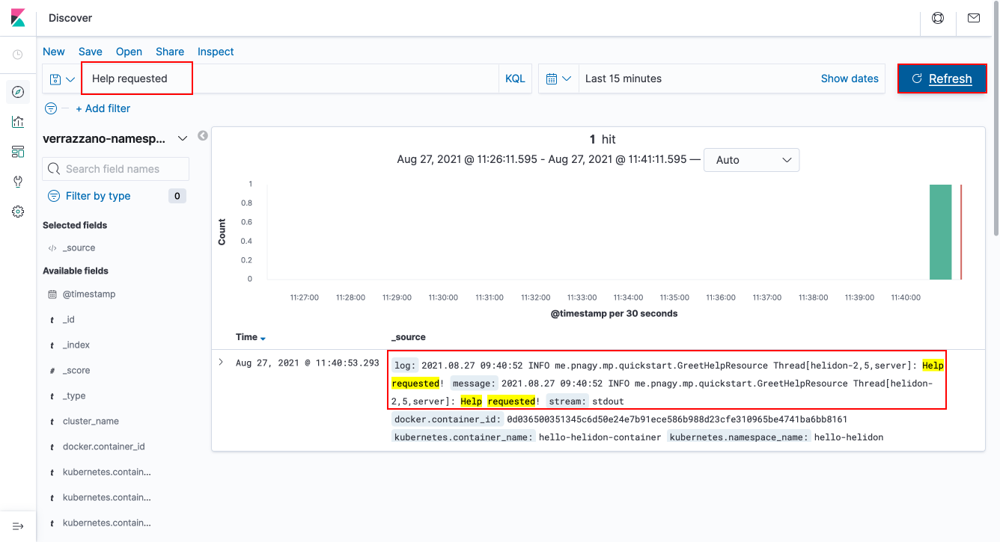

## Task 4: Explore the Prometheus Console

1. Go back to the Verrazzano home page and click **Prometheus** console.

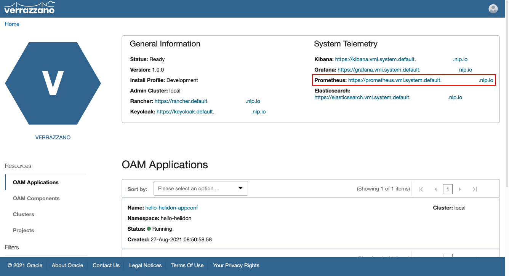

2. Click **Proceed to ... default XX.XX.XX.XX.nip.io(unsafe)** if prompted.

3. On the Prometheus dashboard page type *help* into the search field and click your custom metric *application _me _user _mp _quickstart _GreetHelpResource _helpCalled _total*.

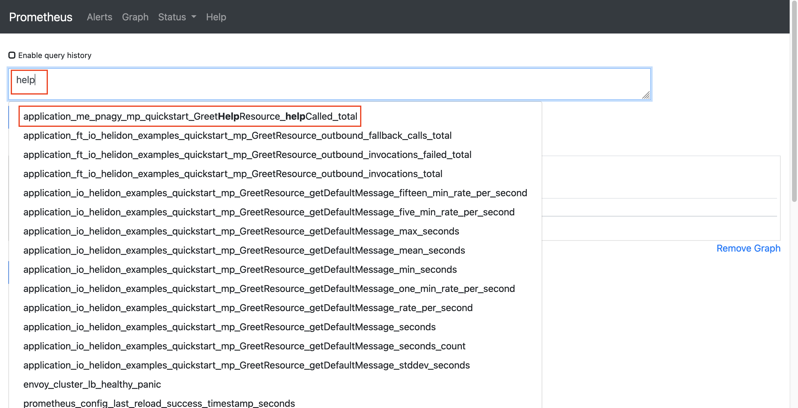

4. Click **Execute** and check the result below. You should see your metric's current value which means how many requests were completed by your endpoint. You can also switch to *Graph* view instead of the *Console* mode.

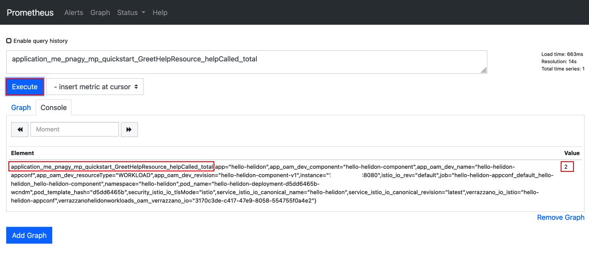

>You can also add another metric to your dashboard. Discover the available, default metrics in the list.

## Task 5: Explore the Rancher Console

1. Go back to the Verrazzano home page and click **Rancher** console.

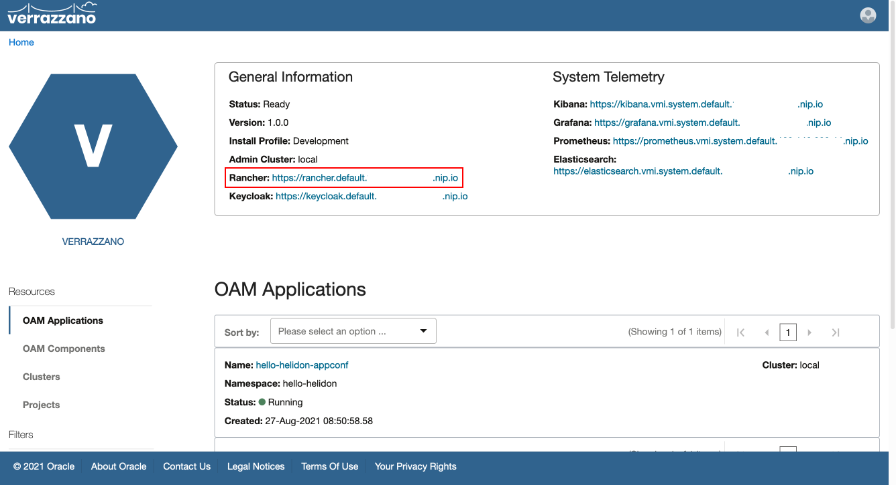

2. Click **Proceed to ... default XX.XX.XX.XX.nip.io(unsafe)** if prompted.

3. Rancher requires separate credentials. In the Verrazzano `dev` profile the username is *admin*. To get the password execute the following command in Cloud Shell which extracts from the proper secret configuration:
```bash
<copy>kubectl get secret --namespace cattle-system rancher-admin-secret -o jsonpath={.data.password} | base64 --decode; echo</copy>
```
4. Using the values above login to the Rancher console.


5. On the Cluster Manager page you can monitor and manage multiple cluster controlled by Verrazzano. In this lab you have only one (OKE) cluster. Click on the **Explorer** button to open the *Cluster Explorer*. The *Cluster Explorer* allows you to view and manipulate all of the custom resources and CRDs in a Kubernetes cluster from the Rancher UI.

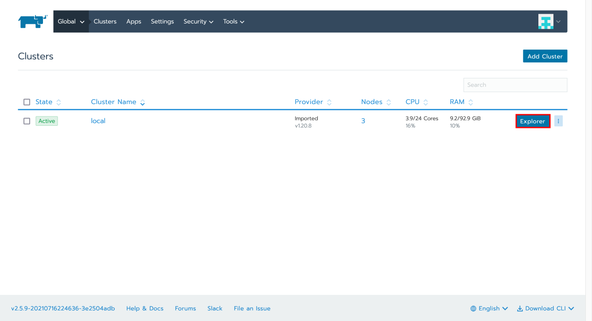

6. The dashboard gives an overview about the cluster and the deployed applications. The number of resources belong to the *User Namespaces* which is practically almost all the resources including the system too. You can filter by namespace at top of the dashboard, but this is not necessary now. Click on the **Nodes** item in the left side menu to get an overview about the current load of the nodes.

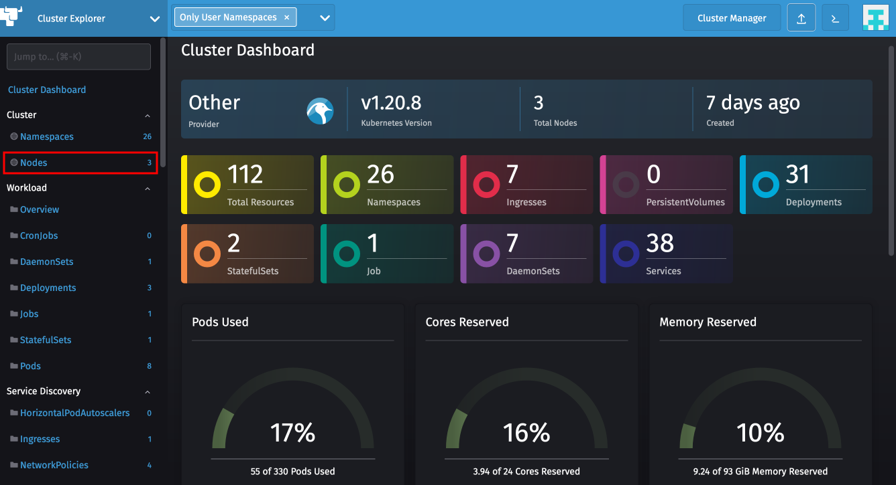

7. The whole deployment doesn't have any impact on the OKE cluster. Now click on the **Deployment** item in the left side menu to check your Helidon quickstart-mp application.

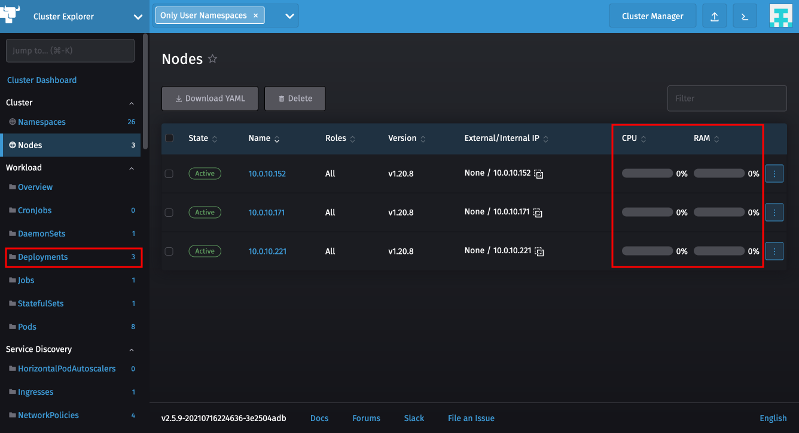

8. You can see several deployments. Click on the *hello-helidon-deployment*.

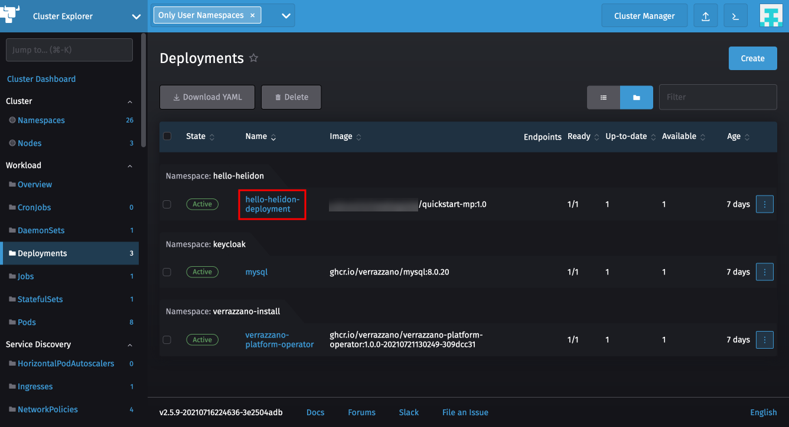

9. On the *Deployment* page you can see your application deployment. A deployment provides declarative updates for pods and replicasets. The pod name contains an auto generated unique string to identify that particular replica. To see how many and what type of containers are running in this pod click on the name.

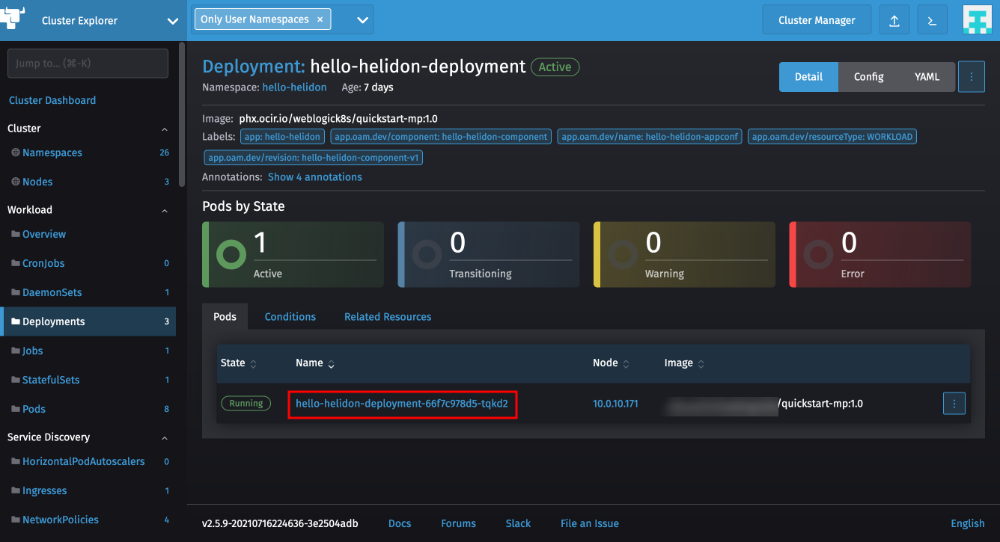

10. You should see two containers in the pod. The *hello-helidon-container* runs the "real" application and the other is the sidecar container which is automatically injected and necessary to take the advantage of the Istio features. Here you can check the application's log in the container. Click on the dotted menu button at top right corner and select **View Logs**.

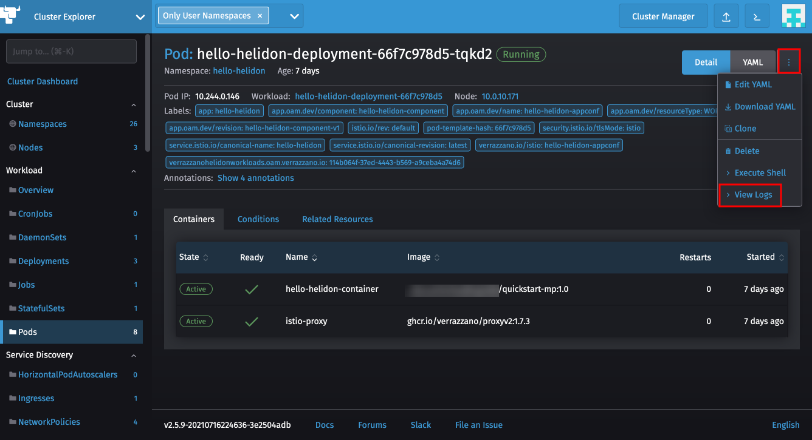

11. Make sure that the Helidon quickstart-mp application's container is selected in the log window. Find the custom `Help requested!` log entry. If you can't see the application log then click the **Settings** (blue button with the gear icon) and change the time filter to show all the log entries from the container start.

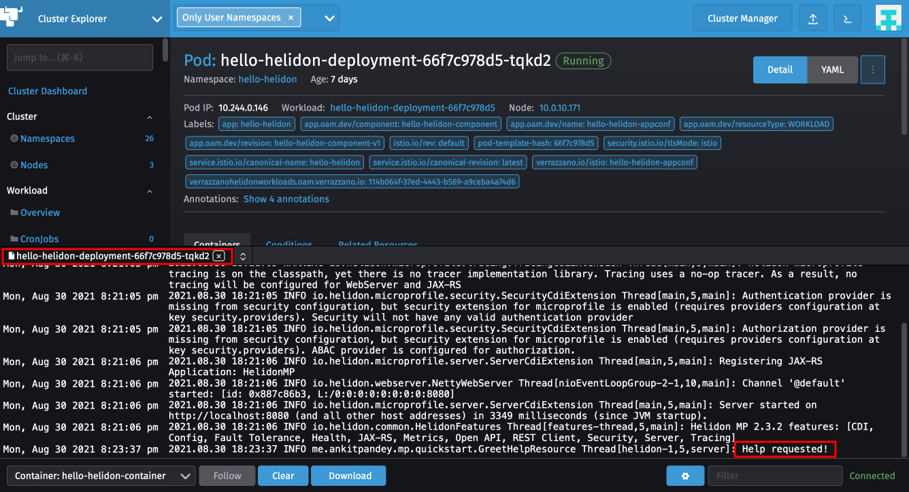

Congratulations you have successfully completed the Helidon application deployment on Verrazzano lab.

## Acknowledgements

* **Author** -  Peter Nagy
* **Contributors** - Maciej Gruszka, Peter Nagy
* **Last Updated By/Date** - Peter Nagy, August 2021
