# Create Helidon Greeting Application

## Introduction

This lab walks you through the steps to create a Helidon MP application.

### About Product/Technology

Helidon is designed to be simple to use, with tooling and examples to get you going quickly. Since Helidon is just a collection of libraries running on a fast Netty core, there is no extra overhead or bloat. Helidon supports MicroProfile and provides familiar APIs like JAX-RS, CDI and JSON-P/B. Our MicroProfile implementation runs on our fast Helidon Reactive WebServer. The Reactive WebServer provides a modern, functional, programming model and runs on top of Netty. Lightweight, flexible and reactive, the Helidon WebServer provides a simple to use and fast foundation for your microservices.

With support for health checks, metrics, tracing and fault tolerance, Helidon has what you need to write cloud-ready applications that integrate with Prometheus, Jaeger/Zipkin and Kubernetes.

### About Helidon CLI

The Helidon CLI lets you easily create a Helidon project by picking from a set of archetypes. It also supports a developer loop that performs continuous compilation and application restart, so you can easily iterate over source code changes.

The CLI is distributed as a standalone executable (compiled using GraalVM) for ease of installation. It is currently available as a download for Linux, Mac and Windows. Simply download the binary, install it at a location accessible from your PATH and you’re ready to go.

### Objectives
* Install the Helidon CLI
* Create a MicroProfile supported microservice called Helidon Greeting
* Run and exercise the Helidon Greeting app
* View health and metrics data
* Add new functionality to the app

## Task 1: Creating the environment in the Cloud Shell

* Helidon requires Java 11+
* Maven 3.6.x
* Java and `mvn` are in your path.

 
Oracle Cloud Infrastructure (OCI) Cloud Shell is a web browser-based terminal, accessible from the Oracle Cloud Console. The Cloud Shell provides access to a Linux shell, with a pre-authenticated Oracle Cloud Infrastructure CLI and other useful tools (*Git, kubectl, helm, OCI CLI*) to complete the Verrazzano tutorials. The Cloud Shell is accessible from the Console. Your Cloud Shell will appear in the Oracle Cloud Console as a persistent frame of the Console, and will stay active as you navigate to different pages of the Console.

1. Click on Cloud Shell icon to launch the "Cloud Shell".

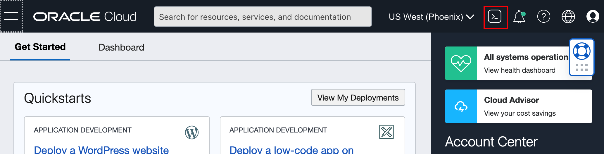

You will use the *Cloud Shell* to complete this workshop.

2. Copy the following commands and paste in the Cloud Shell. It downloads the required version of JDK and Maven and set the PATH variable to use the required Maven and JDK.

```bash
<copy>
wget https://mirrors.estointernet.in/apache/maven/maven-3/3.6.3/binaries/apache-maven-3.6.3-bin.tar.gz
tar -xvf apache-maven-3.6.3-bin.tar.gz
wget https://download.java.net/java/GA/jdk14.0.2/205943a0976c4ed48cb16f1043c5c647/12/GPL/openjdk-14.0.2_linux-x64_bin.tar.gz
tar -xzvf openjdk-14.0.2_linux-x64_bin.tar.gz
PATH=~/jdk-14.0.2/bin:~/apache-maven-3.6.3/bin:$PATH
cd ~
</copy>
```


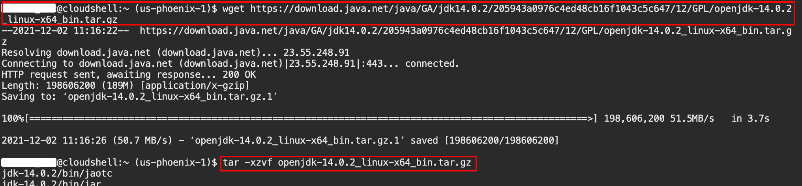

3. Copy the following command and run in the Cloud Shell to verify that required JDK and Maven version are configured properly.

```bash
<copy>
mvn -v
</copy>
```
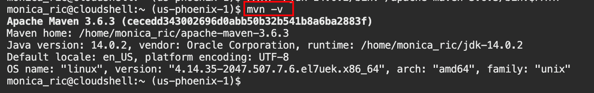

## Task 2: Install the Helidon CLI

```bash
<copy>
curl -O https://helidon.io/cli/latest/linux/helidon
chmod +x ./helidon
</copy>
```
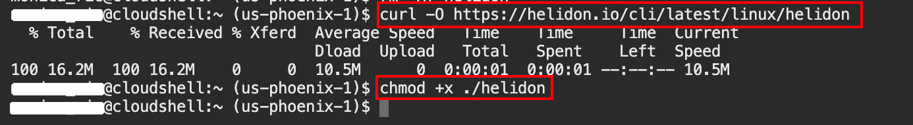


## Task 3: Create Helidon Greeting Application
1. In your console enter:
```bash
<copy>./helidon init --version 2.4.0 </copy>
```


> To avoid any potential issues, define the specific Helidon version that was tested for this lab's environment.

2. For this demo we will create a MicroProfile supported microservice, so choose option **(2)** for **Helidon MP Flavor**:

```bash
Using Helidon version 2.4.0
Helidon flavor
  (1) SE
  (2) MP
Enter selection (Default: 1): 2
```

3. For the most functionality, choose option **(2) quickstart** then **Enter** for the default answers. Note that you can have different default package and project group names because it uses the OS user name.


```bash
Select archetype
  (1) bare | Minimal Helidon MP project suitable to start from scratch
  (2) quickstart | Sample Helidon MP project that includes multiple REST operations
  (3) database | Helidon MP application that uses JPA with an in-memory H2 database
Enter selection (Default: 1): 2
Project name (Default: quickstart-mp):
Project groupId (Default: me.buzz-helidon):
Project artifactId (Default: quickstart-mp):
Project version (Default: 1.0-SNAPSHOT):
Java package name (Default: me.buzz.mp.quickstart):
Switch directory to /Users/mitia/Desktop/quickstart-mp to use CLI

Start development loop? (Default: n):
```

>For the **development loop** accept the default (**n**) for now.

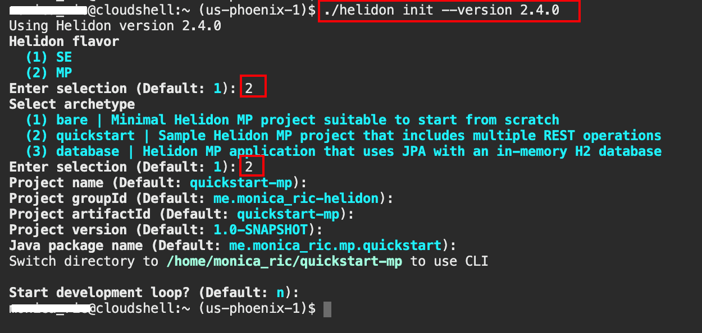

You now have a fully functional Microservice Maven Project:

```bash
quickstart-mp
├── Dockerfile
├── Dockerfile.jlink
├── Dockerfile.native
├── README.md
├── app.yaml
├── pom.xml
└── src
    ├── main
    │   ├── java
    │   │   └── me
    │   │       └── buzz
    │   │           └── mp
    │   │               └── quickstart
    │   │                   ├── GreetResource.java
    │   │                   ├── GreetingProvider.java
    │   │                   └── package-info.java
    │   └── resources
    │       ├── META-INF
    │       │   ├── beans.xml
    │       │   ├── microprofile-config.properties
    │       │   └── native-image
    │       │       └── reflect-config.json
    │       └── logging.properties
    └── test
        └── java
            └── me
                └── buzz
                    └── mp
                        └── quickstart
                            └── MainTest.java

```

## Task 3: Run the Helidon Greeting Application
In the Cloud Shell, navigate to the quickstart-mp directory and run the following commands:

```bash
<copy> cd quickstart-mp
mvn package
java -jar target/quickstart-mp.jar &
</copy>
```
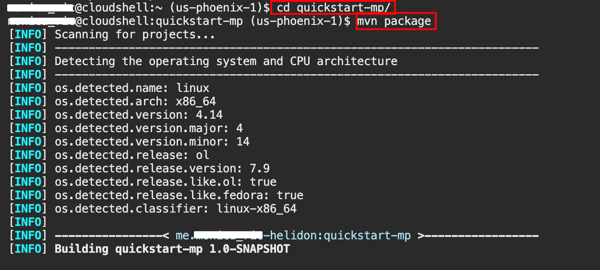
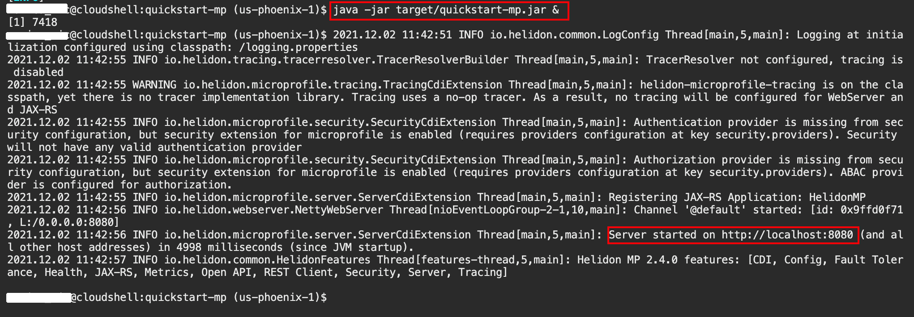

Press Enter to get the prompt.

### Exercise the Application

Run the following commands to check the application:

```bash
<copy>
curl -X GET http://localhost:8080/greet
</copy>
{"message":"Hello World!"}
```

```bash
<copy>
curl -X GET http://localhost:8080/greet/Joe
</copy>
{"message":"Hello Joe!"}
```

```bash
<copy>
curl -X PUT -H "Content-Type: application/json" -d '{"greeting" : "Hola"}' http://localhost:8080/greet/greeting
</copy>
```

```bash
<copy>
curl -X GET http://localhost:8080/greet/Jose
</copy>
{"message":"Hola Jose!"}
```

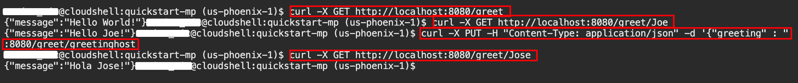

### Review Health and Metrics Data

1. Run the following commands to check health and metrics:

```bash
<copy>
curl -s -X GET http://localhost:8080/health
</copy>
{"outcome":"UP",...
. . .
```

```bash
# Prometheus Format
<copy>
curl -s -X GET http://localhost:8080/metrics
</copy>
# TYPE base:gc_g1_young_generation_count gauge
. . .
```
```bash
# JSON Format
<copy>
curl -H 'Accept: application/json' -X GET http://localhost:8080/metrics
</copy>
{"base":...
. . .
```

2. Stop the *quickstart-mp* application by entering `ps aux` in the Cloud Shell and note the pid associated with "java -jar target/quickstart-mp.jar &" and run the command `kill -9 <pid>` to kill the associated process. You need to replace the `<pid>` with the process id associated with the application.

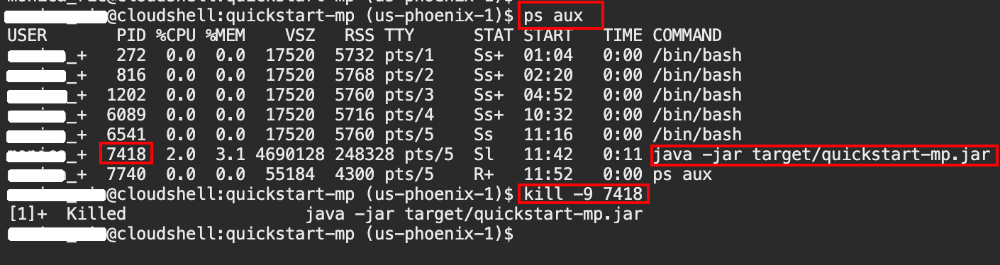

## Task 4: Modify the Application

1. Create a new endpoint that provides help for different greetings in different languages. To create this new functionality, create a new class called **GreetHelpResource** with the following code:

```java
<copy>
import java.util.Arrays;
import java.util.List;
import java.util.logging.Logger;

import javax.enterprise.context.ApplicationScoped;
import javax.ws.rs.GET;
import javax.ws.rs.Path;

import org.eclipse.microprofile.metrics.annotation.Counted;

@ApplicationScoped
@Path("/help")
public class GreetHelpResource {

	Logger LOGGER = Logger.getLogger(GreetHelpResource.class.getName());

    @GET
    @Path("/allGreetings")
    @Counted(name = "helpCalled", description = "How many time help was called")
    public String getAllGreetings(){
    	LOGGER.info("Help requested!");
        return Arrays.toString(List.of("Hello","Привет","Hola","Hallo","Ciao","Nǐ hǎo", "Marhaba","Olá").toArray());
    }
}
</copy>
```
For example, create the file with the similar command, make sure to use your own project location.

```bash
<copy>
vi ~/quickstart-mp/src/main/java/me/<user_name>/mp/quickstart/GreetHelpResource.java
</copy>
```
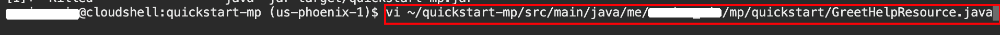
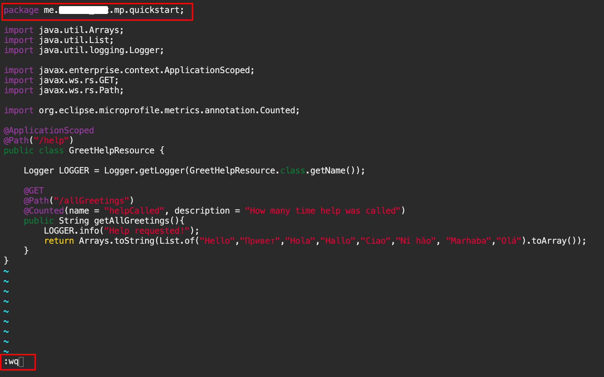

>The class has only one method *getAllGreetings* which returns a list with greetings in different languages. While copying the code, be sure to add the necessary package name on top of class.

Press Esc and then :wq to save the changes.


3. Build and run the application:

```bash
<copy>
cd ~/quickstart-mp/
mvn package -DskipTests
java -jar target/quickstart-mp.jar &
</copy>
```


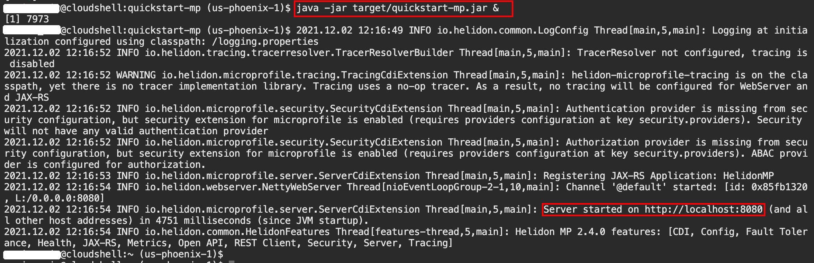


4. Execute the following command and notice the results:

```bash
<copy>curl http://localhost:8080/help/allGreetings</copy>
```
The expected result:
```bash
[Hello, Привет, Hola, Hallo, Ciao, Nǐ hǎo, Marhaba, Olá]
```

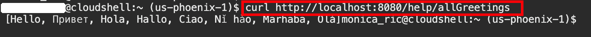

5. Look at the metrics and you will see that a new counter appeared. Whenever this endpoint is called the value will increment:

```bash
curl http://localhost:8080/metrics

...
# TYPE application_me_buzz_mp_quickstart_GreetHelpResource_helpCalled_total counter
# HELP application_me_buzz_mp_quickstart_GreetHelpResource_helpCalled_total How many time help was called
application_me_buzz_mp_quickstart_GreetHelpResource_helpCalled_total 1
...
```


And the new endpoint has been added.

>Working with Helidon and its tooling is really easy and fast!

> Run the **ps aux**` command to know the process id associated with "java -jar target/quickstart-mp.jar &" process and then use **kill -9 <pid>** to kill this process.

6. Leave your Cloud Shell open and continue with Verrazzano installation lab.

## Acknowledgements

* **Author** -  Dmitry Aleksandrov
* **Contributors** - Maciej Gruszka, Peter Nagy
* **Last Updated By/Date** - Peter Nagy, September 2021
