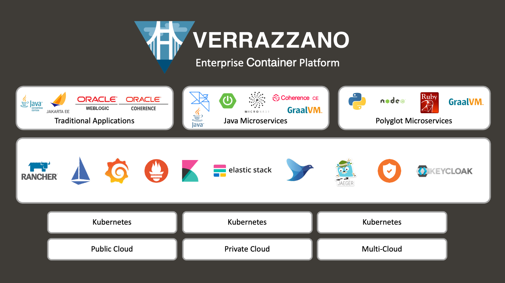

# Introduction

## About this Workshop

This lab offers attendees an intro-level, hands-on session with Helidon and Verrazzano. You will learn how to make and assemble services and deploy them on an enterprise container platform.

This is a BYOL (Bring Your Own Laptop) session, so bring your Windows, OSX, or Linux laptop. You will need JDK 11+, Apache Maven (3.6), and Docker installed before you begin.

During this lab you will install Helidon CLI tools and develop the HTTP microservice application. For Verrazzano you will set up Oracle Kubernetes Engine (OKE) on Oracle Cloud Infrastructure using Oracle Cloud Free Tier account. The Free Tier account is sufficient to explore and learn how to run and operate microservice applications on an enterprise level.

The goal of this workshop is that you learn the basics of using Helidon and Verrazzano and understand how they can help you in your projects. If you want to learn more about the capabilities of these projects, then continue to explore using your Oracle Free Tier cloud account and Oracle Cloud Infrastructure.

This workshop is designed to be as self-explanatory as possible, but feel free to ask for clarification or assistance along the way.

>Provisioning the Oracle Kubernetes Engine (OKE) and installing Verrazzano can take several minutes. To save time, you will be asked to do your development and environment setup in parallel. Follow the instructions and switch between tasks when it is required and necessary.

### Objectives

* Set up your Oracle Cloud Free Tier account (if you haven't done so already).
* Set up an Oracle Kubernetes Engine instance on the Oracle Cloud Infrastructure.
* Install the Verrazzano platform.
* Deploy the *Helidon MP* application.
* Monitor the *Helidon MP* application using Verrazzano tools, including Kibana, Grafana and Prometheus.

### Prerequisites
This lab assumes you have the following installed on your machine:
* JDK 11+
* Apache Maven (3.6)
* Docker

## About Helidon
Helidon is a open source microservices framework introduced by Oracle that provides a collection of Java libraries designed for creating lightweight and fast microservices-based applications. The framework supports two programming models for writing microservices: Helidon SE and Helidon MP.
While Helidon SE is designed to be a microframework that supports the reactive programming model, Helidon MP is an implementation of the MicroProfile specification. Since MicroProfile has its roots in Java EE, the MicroProfile APIs follow a familiar, declarative approach with heavy use of annotations. This makes it a good choice for Java EE developers.
The MicroProfile features aim at the implementation of microservices. You can find APIs for defining REST Clients, monitoring the application, reading technical and functional statistics and for configuring the application.
Helidon has also  added additional APIs to the core set of Microprofile APIs giving you all the capabilities you need for writing modern cloud native applications.

> The [MicroProfile](https://microprofile.io/) standard builds on Jakarta EE. Like Jakarta EE, MicroProfile is open source and is developed by the Eclipse Foundation. Implementation with MicroProfile takes place in the libraries or application servers implementing the standard, just like Jakarta EE.

## About Verrazzano
Verrazzano is an end-to-end enterprise container platform for deploying cloud-native and traditional applications in multicloud and hybrid environments. It is made up of a curated set of open source components – many that you may already use and trust, and some that were written specifically to pull together all of the pieces that make Verrazzano a cohesive and easy to use platform.

Verrazzano includes the following capabilities:
- Hybrid and multicluster workload management
- Special handling for WebLogic, Coherence, and Helidon applications
- Multicluster infrastructure management
- Integrated and pre-wired application monitoring
- Integrated security
- DevOps and GitOps enablement

## Learn More

* [https://helidon.io](https://helidon.io)
* [https://verrazzano.io/](https://verrazzano.io/)

## Acknowledgements

* **Author** -  Peter Nagy
* **Contributors** - Maciej Gruszka, Peter Nagy
* **Last Updated By/Date** - Peter Nagy, September 2021
