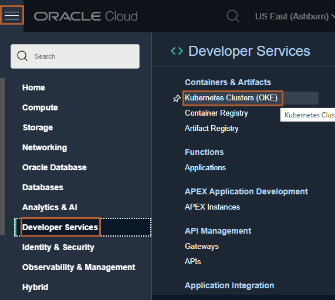
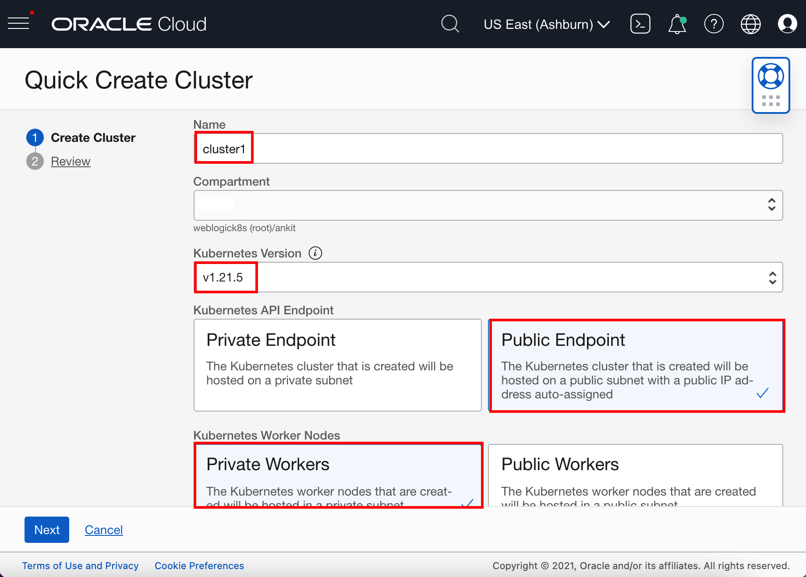
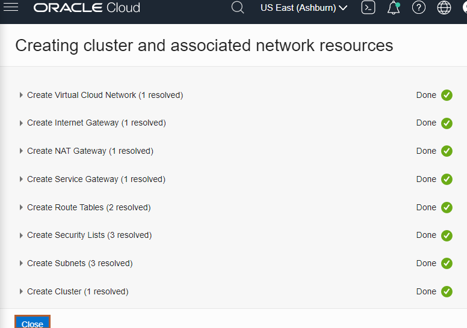
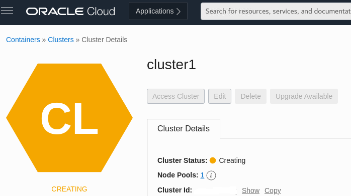

# Create Oracle Container Engine for Kubernetes (OKE) on Oracle Cloud Infrastructure (OCI)

## Introduction

In this lab you will create a 3-node Kubernetes cluster configured with all of the necessary network resources. The nodes will be deployed in different availability domains to ensure high availability.

For more information about OKE and custom cluster deployment, see the [Oracle Container Engine](https://docs.cloud.oracle.com/iaas/Content/ContEng/Concepts/contengoverview.htm) documentation.

### About Product/Technology

Oracle Cloud Infrastructure Container Engine for Kubernetes is a fully-managed, scalable, and highly available service that you can use to deploy your container applications to the cloud. Use the Container Engine for Kubernetes (sometimes abbreviated OKE) when your development team wants to reliably build, deploy, and manage cloud-native applications. You specify the compute resources that your applications require, and OKE provisions them on the Oracle Cloud Infrastructure in an existing OCI tenancy.

### Objectives

You will use the *Quick Create* cluster feature to create an OKE (Oracle Kubernetes Engine) instance with the required network resources, a node pool, and three worker nodes. The *Quick Create* approach is the fastest way to create a new cluster. If you accept all the default values, you can create a new cluster in just a few clicks.

### Prerequisites

You must have an [Oracle Cloud Infrastructure](https://cloud.oracle.com/en_US/cloud-infrastructure) enabled account.

## Task 1: Create an OKE cluster

1. In the Console, open the navigation menu and click **Developer Services**. Under **Containers & Artifacts**, click **Kubernetes Clusters (OKE)**.

    

2. On the Cluster List dialog, select the Compartment where you are allowed to create a cluster and then click **Create Cluster**.

    > You must select a compartment that allows you to create a cluster and a repository inside the Oracle Container Registry.

    

3. On the Create Cluster dialog, click **Quick Create** and click **Launch Workflow**.

    

    *Quick Create* will automatically create a new cluster with the default settings, along with new network resources for the new cluster.

4. Specify the following configuration details on the Cluster Creation dialog (pay attention to the value you place in the **Shape** field):

    * **Name**: The name of the cluster. Accept the default value.
    * **Compartment**: The name of the compartment. Accept the default value.
    * **Kubernetes Version**: The version of Kubernetes. Select the **v1.21.5** version.
    * **Kubernetes API Endpoint**: Determines if the cluster master nodes are going to be routable or not. Select the **Public Endpoint** value.
    * **Kubernetes Worker Nodes**: Determines if the cluster worker nodes are going to be routable or not. Accept the default value **Private Workers**.
    * **Shape**: The shape to use for each node in the node pool. The shape determines the number of CPUs and the amount of memory allocated to each node. The list shows only those shapes available in your tenancy that are supported by OKE. Select **VM.Standard.E4.Flex**. You need to select *3* as the number of *OCPUs* and *48* as the *Amount of Memory(GB)*. 
    > **Caution**: *VM.Standard.E4.Flex is the recommended because Verrazzano has many components. The default VM.Standard2.1 can be enough for testing purposes but the installation takes much longer.*

    * **Number of nodes**: The number of worker nodes to create. Accept the default value, **3**.

    
    

5. Click **Next** to review the details you entered for the new cluster.

6. On the Review page, click **Create Cluster** to create the new network resources and the new cluster.

    

    > You see the network resources being created for you. Wait until the request to create the node pool is initiated and then click **Close**.

    

    > The new cluster is shown on the Cluster Details page. When the master nodes are created, the new cluster gains a status of *Active* (it takes about 7 minutes).

    

    

7. To save time don't wait to the Active state, continue with the next Helidon application development lab. Before the Verrazzano installation you will come back to verify and configure the OKE cluster access.

## Acknowledgements

* **Author** -  Ankit Pandey
* **Contributors** - Maciej Gruszka, Peter Nagy
* **Last Updated By/Date** - Ankit Pandey, March 2022
