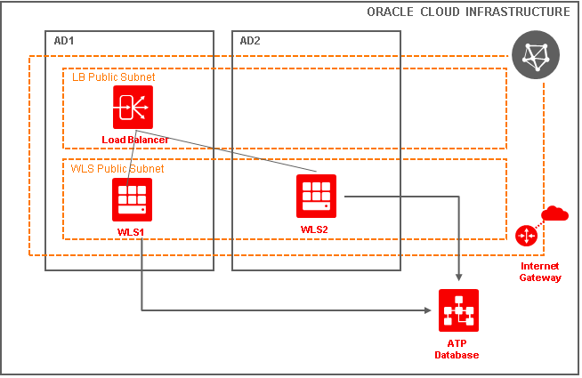
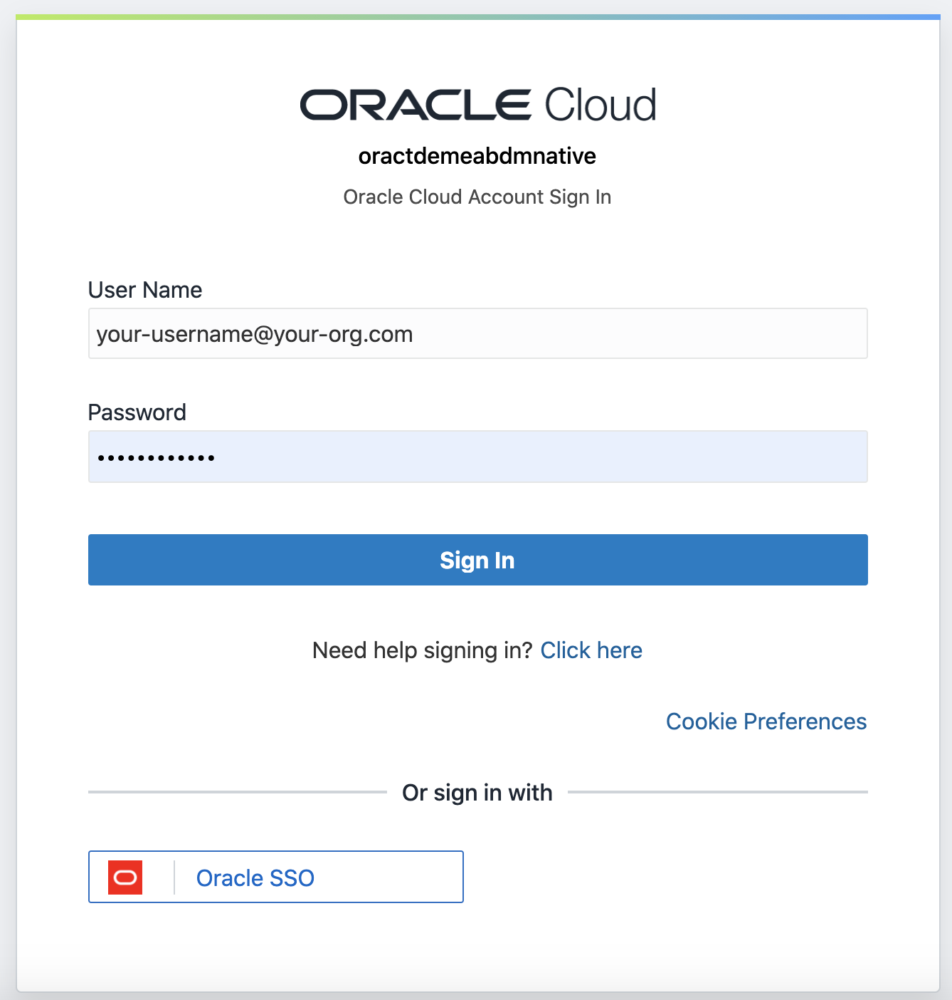

# WebLogic for OCI (JRF) - Introduction

## Objective

This lab will guide you through the steps to create a WebLogic for OCI Instance, more specifically using the *Virtual Machine* flavor, and using the JRF option (repository database required).

- If you are running this lab on a personal **free tier** account, you will need to do some initial setup in order to prepare your tenancy for this lab.  These steps are described in the first chapter of this lab, called **WebLogic for OCI as a VM - Prerequisites**.  You can obtain a **free tier** account via [this link](https://signup.oraclecloud.com/).
- The actual creation of the WLS instance is described in the second chapter of this lab, called **WebLogic for OCI as a VM**.  Once the WLS instance is up and running, you can access the management console and deploy several test applications.  In case you are running this lab on a shared instance, your instructor will provide you with the required information to be able to start this part immediately.

## 1. Overview of the WebLogic for OCI - VM flavor

In this lab we will spin up a simple configuration of WebLogic, composed of the following elements : 

We will be using the "WebLogic for OCI" Marketplace to select an image with the following properties:

- Running as a Virtual Machine on the Infrastructure
- Using the EE edition of WebLogic
- Using the **UCM** or **Universal Credits Model** license model
- Running in a public network
- Using a Repository database

Much more sophisticated setups are possible, you can explore these on your own after the initial lab :

- Using a private network and a *bastion host* to access this network

Below an example of a setup with private networks and a Database:

 

## 2. Logging in to your tenancy

- Open the console of your cloud tenancy via https://www.oracle.com/cloud/sign-in.html and login to your tenancy

  

- Choose Single Sign On:

- Login with your cloud account *User Name* and *Password* 

