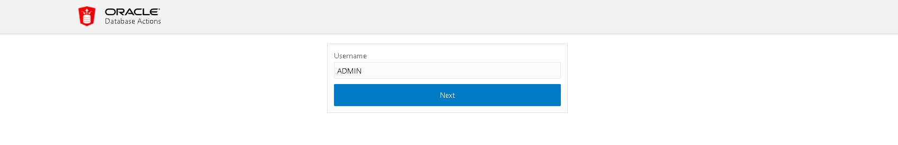
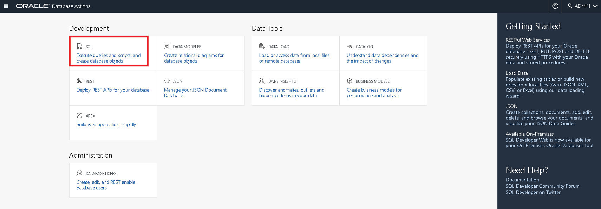
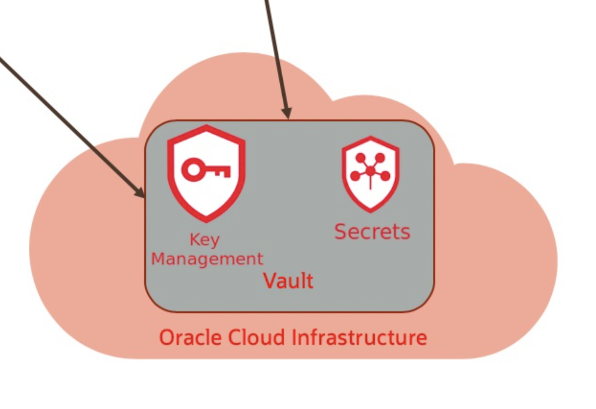

# WebLogic for OCI (JRF) - prerequisites

### Step 1 - Prepare your tenancy for the lab


## Objective

In this first step of the lab we will prepare your tenancy to be able to create the WebLogic instance and deploy your ADF application:

- Create a compartment
- Provision an Oracle Autonomous Database
- Create a Vault, an encryption key and a few secrets
- Create an ssh key pair for your compute nodes


## 1. Create an OCI Compartment for the lab

When provisioning WebLogic for OCI through Marketplace, you need to specify an OCI Compartment where all resources will be created.

Make sure you have a Compartment that you can use or create a new one.

Take note of the compartment **OCID**:


The Compartment name is referred as **CTDOKE** in the Hands on Lab.


##  2. Provision Repository Database and Database Objects

When deploying a JRF enabled WebLogic domain, a database repository is required. We will use Autonomous Transaction Processing - ATP - Database. As in the next part we'll deploy a sample ADF application that requires a database table and some records data, we should create the DB schema in advance.


### 2.1 Provision ATP Database

Go to *Oracle Database* > *Autonomous Transaction Processing*:


Choose to create a new Autonomous Database:


Give it a meaningful name, for example **WLSATPDB**; Keep default workload type **Transaction Processing**:


Scroll down and keep default setting for:

- **Deployment type**: *Shared Infrastructure*
- **Database version**: *19c*
- **OCPU count**: *1*
- **Storage (TB)**: *1*
- **Auto scaling**: *Enabled*


Next setup a password for the ADMIN user: must be 12 to 30 characters and contain at least one uppercase letter, one lowercase letter, and one number. The password cannot contain the double quote (") character or the username "admin.

Keep default setting to **Allow secure access from everywhere**; this will provision ATP database with public endpoints (access can still be restricted by allowing incoming traffic from trusted IP addresses or whitelisted Virtual Cloud Networks):


For the last step choose **License included** for license type and click on **Create Autonomous Database**:


The provisioning process will start:


After a few minutes the Database should be available:


### 2.2 Prepare DB Objects

Once the ATP database available, we can use the SQL Development Web tool to created a DB schema and some required tables and records needed in the next part.

Go to *Service Console*:


From *Development* submenu open **Database Actions**:


This will open in a new tab the Database Actions Login screen. Use **ADMIN** and click on *Next*:




Now type in the password setup during provisioning of the ATP Database:


Once logged in, go to **SQL** Development tool:




You can follow a waking tour to discover the main user interface features: 


Once ready, copy and paste the contents of **[this](https://objectstorage.eu-frankfurt-1.oraclecloud.com/n/oractdemeabdmnative/b/ll-wls-bucket/o/adf_app_db_script.sql)** sql file into *Worksheet* window:


Execute the script by clicking the *Run script* play button. All statements should execute with success:


## 3. Create OCI Secrets

When you provision a WebLogic instance you need to specify the WebLogic Admin password and the Database Admin Password. For security reasons, passing these passwords in a readable format into the instance creation script is a bad idea.  Oracle Cloud provides a solution for this problem via the **OCI Vault**.

A **vault** will contain **encryption keys** that are used to encrypt and decrypt secret content, and also the  **secrets** that contain the actual content you want to secure - in this case the admin passwords of the database and the WebLogic instance.





### 3.1 Create a Vault

Go to *Governance and Administration* > *Security* > Vault


Create a new Shared Vault (leave the *Make it a Virtual Private Vault* option **unchecked**):


The new Vault should be listed as Active:


Take a look at the Vault Information:


### 3.2 Create an Encryption Key

Go to *Master Encryption Keys* submenu of the Vault Information page and create an new Key:


Give the key a Name and leave the other settings as default:


The new key should be listed as *Enabled*:


### 3.3 Create an OCI Secret for the WebLogic Admin password

Go to *Secrets* submenu of the Vault Information page and create an new Secret:


Setup a name for the OCI Secret; choose previously created Encryption Key (**WLSKey**) in the *Encryption Key* dropdown. If you leave default value for *Secret Type Template* (**Plain-Text**), you have to enter the plain WebLogic Admin password in the *Secret Contents* aria. If you switch to **Base64** template, you need to provide the password pre-encoded in base64.

> The password must start with a letter, should be between 8 and 30 characters long, should contain at least one number, and, optionally, any number of the special characters ($ # _).


Shortly, the Secret should be listed as *Active*:


Click on the Secret name and take note of its **OCID**. We need to provide this value in the WebLogic for OCI Stack configuration form:


### 3.4 Create an OCI Secret for the Database Admin password

In the same way as in previous step, create a new OCI secret for your ATP Admin user Password. Instead of the WebLogic Admin password, pass the ADMIN password created during ATP Instance provisioning. Give Secret a name, for example **ATPDBSecret**


Click on the new Secret name (**ATPDBSecret**) and take note of its **OCID**. We need to provide this value in the WebLogic for OCI Stack configuration form.


### 3.5 Create an OCI Secret for the Sample Application Schema password

We need to create one more OCI secret, for the Sample Application Schema password. As we'll see in the next part, when creating the WebLogic Stack, we have an option to create in advance an Application Datasource on WebLogic Domain. To securely pass the Schema password, we need to create an OCI secret.

In the same way as in previous step, create a new OCI secret for the Sample Application Schema (*ADFAPP*). Give Secret a name, for example **ADFAppSecret**. Setup the **Welcome1234#** password (or a custom password if you have changed the default password setup in the SQL script executed earlier).


Click on the new Secret name (**ADFAppSecret**) and take note of its **OCID**. We need to provide this value in the WebLogic for OCI Stack configuration form.


##  4. Create ssh keys

You need to generate a public and private ssh key pair. During provisioning using Marketplace, you have to specify the ssh public key that will be associated with each of the WebLogic VM nodes.

We will be using the **Cloud Shell** to generate the keys in this tutorial.

- Open your Cloud Console by clicking on the **>** icon


- Create a directory to contain your keys

  ```
  mkdir keys
  
  cd keys
  ```

  

- Now create your key set :

  ```
  ssh-keygen -t rsa -b 4096 -f weblogic_ssh_key
  ```


This will create the **weblogic_ssh_key** containing the private key. The public key will be saved at the same location, with the .pub extension added to the filename: **weblogic_ssh_key.pub**.

```
Generating public/private rsa key pair.
Enter passphrase (empty for no passphrase): 
Enter same passphrase again: 
Your identification has been saved in weblogic_ssh_key.
Your public key has been saved in weblogic_ssh_key.pub.
The key fingerprint is:
SHA256:jnmUBEH3HnwxcibOvcpPLi5/c1p55PoE7LNLHRmijRI jan_leeman@5e83aaf6d012
The key's randomart image is:
+---[RSA 4096]----+
|     .+.. o =    |
|       o = * o   |
|        .E* o. . |
|       . o.o+o. o|
|        S..o..oo.|
|       = ... . *.|
|      o o o . * =|
|       .. .+oo.* |
|         +oo+++o.|
+----[SHA256]-----+
```


You should be prepared now to run the Hands on Lab on your own cloud environment.