# Running Verrazzano for various workloads

## Introduction
Verrazzano is an end-to-end Enterprise Container Platform for deploying cloud-native and traditional applications in multi-cloud and hybrid environments. It is made up of a curated set of open source components – many that you may already use and trust, and some that were written specifically to pull together all of the pieces that make Verrazzano a cohesive and easy to use platform.

Verrazzano Enterprise Container Platform includes the following capabilities:

- Hybrid and multi-cluster workload management
- Special handling for WebLogic, Coherence, and Helidon applications
- Multi-cluster infrastructure management
- Integrated and pre-wired application monitoring
- Integrated security
- DevOps and GitOps enablement

In this lab you will install Verrazzano on your OKE Cluster and deploy a sample application with it. This sample application consists of multiple workloads stemming from Helidon, Coherence and Weblogic. The main parts of the application consists of:

   - A back-end "order processing" application, which is a Java EE application with REST services and a very simple JSP UI, which stores data in a MySQL database. This application runs on WebLogic Server.
   - A front-end web store "Robert's Books", which is a general book seller. This is implemented as a Helidon microservice, which gets book data from Coherence (using CDI) and has a React web UI.
   - A front-end web store "Bobby's Books", which is a children's book store. This is implemented as a Helidon microservice which gets book data from a (different) Coherence using CDI and has a JSF web UI running on WebLogic Server.


Verrazzano will also spin up various telemetry components for you to be able to monitor and manage the different workloads in your environment. 

## Prerequisites

To run these labs you will need access to an Oracle Cloud Tenancy, either via a **Free Tier**, using a **Pay-as-you-Go** account, or using the **Corporate account** of your organization. 

If you do not have an account yet, you can obtain an Oracle Free Tier account by [clicking here.](https://myservices.us.oraclecloud.com/mycloud/signup?sourceType=:ow:wb:sh:em::RC_WWMK200517P00003:Vlab_Weblogic_July&intcmp=:ow:wb:sh:em::RC_WWMK200517P00003:Vlab_Weblogic_July)

## 1. Preparing your environment

Open the [OCI console](https://console.eu-frankfurt-1.oraclecloud.com), log in using the **Single Sign On** menu on the **left** 

### Creating a Compartment

First check if you already have the **CTDOKE** compartment

- In the Cloud Infrastructure Console, click on the hamburger menu on the top left of the screen. From the pull-out menu, under Identity, click Compartments.

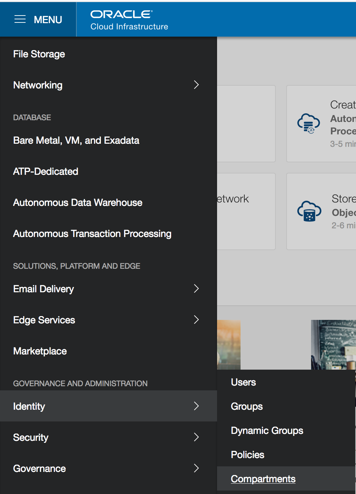


  - You will see the list of compartments currently available in your instance, which will include at least the root compartment of your tenancy (with has the tenancy name). 

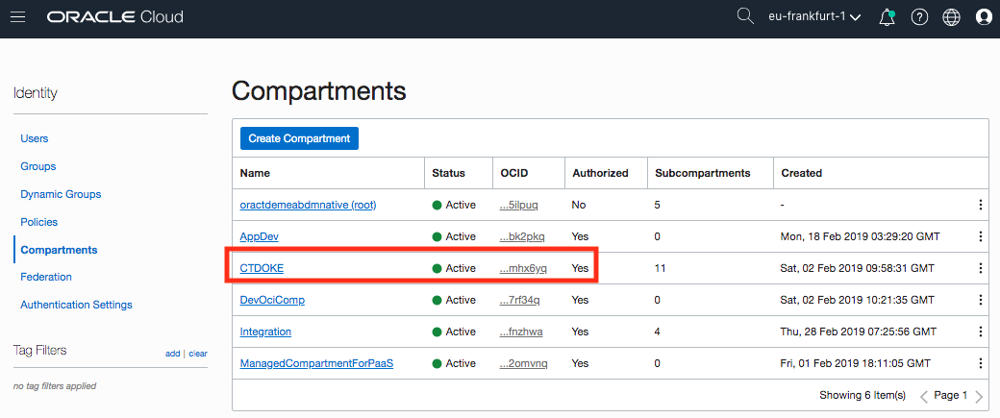

    

- If you already see the **CTDOKE** compartment in this list, 
  **==> no need to create a new compartment !!**.    You can move to the next step (2. Creating a Kubernetes cluster)

  

If you are using a new **Free Tier** account, you will probably only have the root compartment, in that case: 

- Click on **Create Compartment** button to start the compartment creation process


  

Enter the following in create Compartment window

- **Name**: Enter **CTDOKE**
- **Description**: Enter a description for the compartment
- **Parent Compartment**:  select the root compartment.
- Click on the **Create Compartment** link 
- You can verify the compartment created on Compartments page


## 2. Setting up a Kubernetes cluster

We will be using an Oracle Cloud Managed Kubernetes cluster to deploy weblogic.

- Navigate to the ***Developer Services***, then ***Container Clusters (OKE)***.

  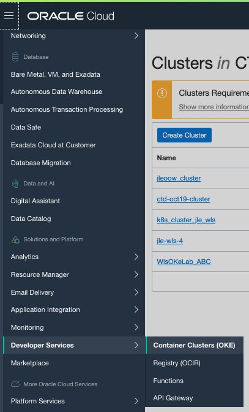

- Use the **Create Cluster** button, and select the **Quick Create** type of installation

- Click the **Launch Workflow** button to start the configuration

- On the **Create cluster** screen, enter following parameters:

    - Name : the name of your cluster.  We will be using the name `verrazzano_OkeLab_(your_initials)` in this tutorial.  Please replace `(your_initials)` by a 3-letter code, for example `Abc`
    - Choose the `CTDOKE` compartment if it is available in the tenancy.
    - Select `v1.16.8` in the Kubernetes Version section
    - Select `Public` worker nodes
    - Choose the shape `VM_Standard2.4`
    - **Remark**: you might have to check available compute shapes on your tenancy.  You can do this by visualizing the **Service Limits** on the "Administration" , "Tenancy Details" page.
    - Select the **Number of nodes** you want to create in the node pool.  For example you could make this correspond to the number of *Availability Domains* in the *Region* you are using : in Frankfurt this is `3`, in Amsterdam this is `1`.  More details [here](https://docs.cloud.oracle.com/en-us/iaas/Content/General/Concepts/regions.htm).
    - Click the **Next** button to confirm the configuration, then **Create Cluster** to start the creation.

  


  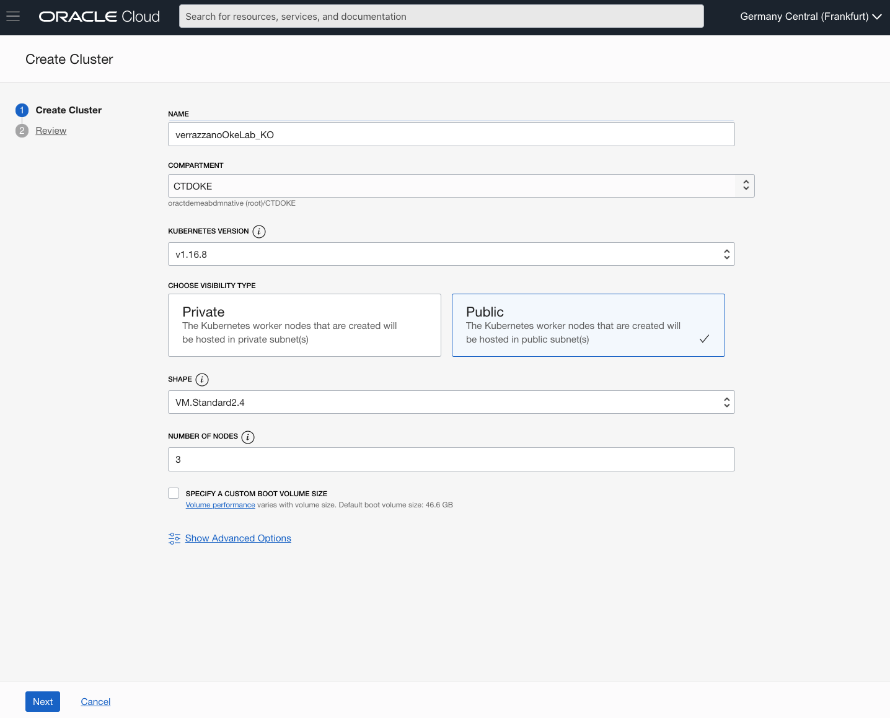


Once the cluster is created (the nodes will continue to be created), you can access the button , and copy the command to download the kubeconfig file of your cluster.

This command will look like: 

```
oci ce cluster create-kubeconfig --cluster-id ocid1.cluster.oc1.eu-frankfurt-1.aaaaaaymqyweojygcqwinbwg4yw --file $HOME/.kube/config --region eu-frankfurt-1 --token-version 2.0.0
```


- Open the **Cloud Shell** using the button **">_"** in the upper right of the console.

- Execute the command you copied.  Example :

  ```
  EXAMPLE ONLY : oci ce cluster create-kubeconfig --cluster-id ocid1.cluster.oc1.eu-frankfurt-1.aaaaaaaaae4wmmjvmzobzmojqmy3dqz4ggntbgcrtqzrvmy4d --file $HOME/.kube/config --region eu-frankfurt-1 --token-version 2.0.0 
  ```
  
- (Optional) We will be running this command to validate that the cluster is up and running. Give it some time, generally it takes a couple of minutes before you can see the nodes listed.

  ```
  kubectl get nodes
  ```
  
  ```
  NAME        STATUS   ROLES   AGE   VERSION
  10.0.10.2   Ready    node    15h   v1.16.8
  10.0.10.3   Ready    node    15h   v1.16.8
  10.0.10.4   Ready    node    15h   v1.16.8
  ```

## 3. Installing Verrazzano in your OKE cluster

1. First we clone the Verrazzano repo. This has all of the scripts we need to set it up in our OKE cluster.

   ```
   git clone https://github.com/verrazzano/verrazzano.git
   ```

2. Create a secret for OCR so you can pull from the Oracle Container Registry repos. **Use the same credentials you used when you signed in to accept the Terms and Conditions in the Container Registry page**.

   ```
   kubectl create secret docker-registry ocr \
           --docker-server=container-registry.oracle.com \
           --docker-username='<your-oracle-username>' \
           --docker-password='<your-oracle-password>' \
           --docker-email='<your-email>'
   ```
   
3. Now we need to install helm and the version must be v3.0.x, v.3.1.x or v3.2.x. To not make it conflict with current versions of helm / upcoming downloads of helm to the later version we'll create a bin directory and refer to it in this lab.
  
   Download the helm installation file

   ```
   wget https://get.helm.sh/helm-v3.2.0-linux-amd64.tar.gz
   ```

   Unpack the `.gz` file

   ```gunzip helm-v3.2.0-linux-amd64.tar.gz```
   ```gunzip helm-v3.2.0-linux-amd64.tar.gz```
   ```tar -xf helm-v3.2.0-linux-amd64.tar```

   Create a bin directory for helm

   ```mkdir $HOME/bin```

   Move the version of helm into that direcory

   ```mv linux-amd64/helm $HOME/bin```

   Edit the profile to include the bin directory

   ```nano $HOME/.bashrc```

   Add the path to the bin folder

   ```export PATH=$HOME/bin:$PATH```

4. We also need to set up the correct env variables for the Verrazzano installation. When setting the ```VERRAZZANO_KUBECONFIG``` variable you need to refer to your **.config** file. It's usually in ```/home/<user-home-folder-name>/.kube/config```, you can see an example down below.

   ```
   export CLUSTER_TYPE=OKE
   export VERRAZZANO_KUBECONFIG=/home/koucif/.kube/config
   export KUBECONFIG=$VERRAZZANO_KUBECONFIG
   ```

   When you've added these to the `.bashrc` file press `control + X` on Mac or `Ctrl + X` on Windows and then `Y`to Save

5. Install Verrazano

   To install Verrazzano we need to run the scripts that we got from the Verrazzano git repo
   
   Go to
   ```cd /verrazzano/install/```
   
   Run the 1st script, which installs Istio

   ```./1-install-istio.sh```

   Next some open-source components that verrazano relies on

   ``` ./2a-install-system-components-magicdns.sh``` 

   Let's now install a couple of necessary components for Verrazzano such as the operators and admission controllers etc

   ```./3-install-verrazzano.sh```

   For the security of the system, we install key cloak

   ```./4-install-keycloak.sh```

6. If all of the steps are showing you a green <span style="color:#2c9320">**OK**</span> then you've most probably successfully installed Verrazzano. By using the scripts **Rancher**, **CertManager**, **Istio** and **Ingress Controllers** have been installed for you and set up for you. You can see the urls for a couple of services and the UI endpoint. Each password is saved in the secrets presented, save the commands. We're going to use some of them at the end. 

   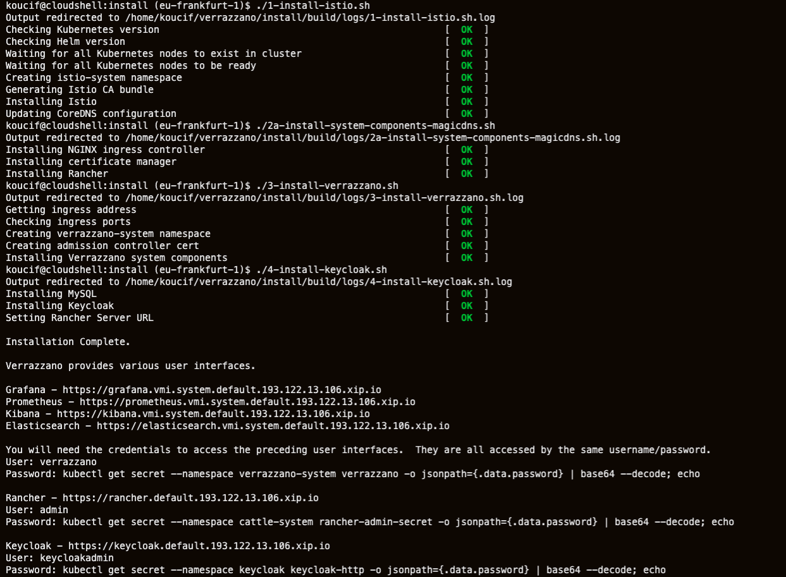

   

   

## 4. Deploying the application

1. We're now going to deploy the sample application on top of our OKE Cluster.

2. Let's make sure we're allowed to pull the containers for *Weblogic*, *Coherence* and *Verrazzano*. If you have not done so already, in a web browser, navigate to the [Oracle Container Registry](https://container-registry.oracle.com/):

   - Select **Middleware** **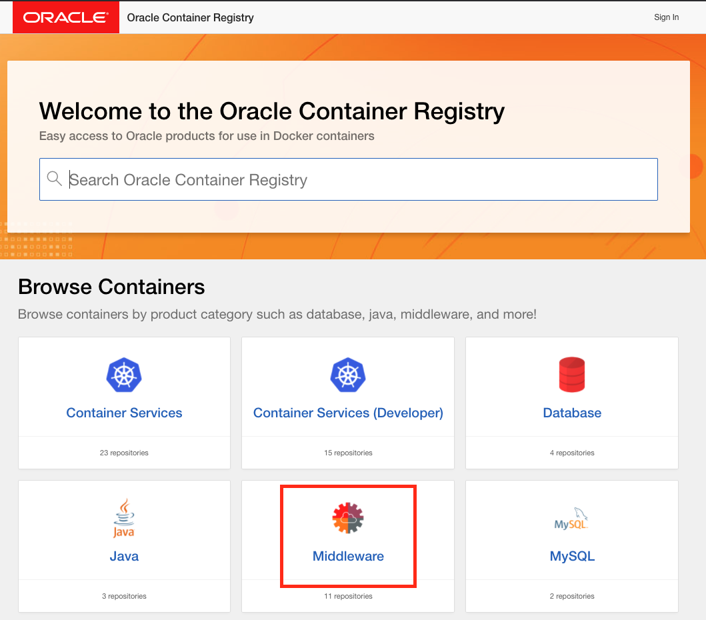**
     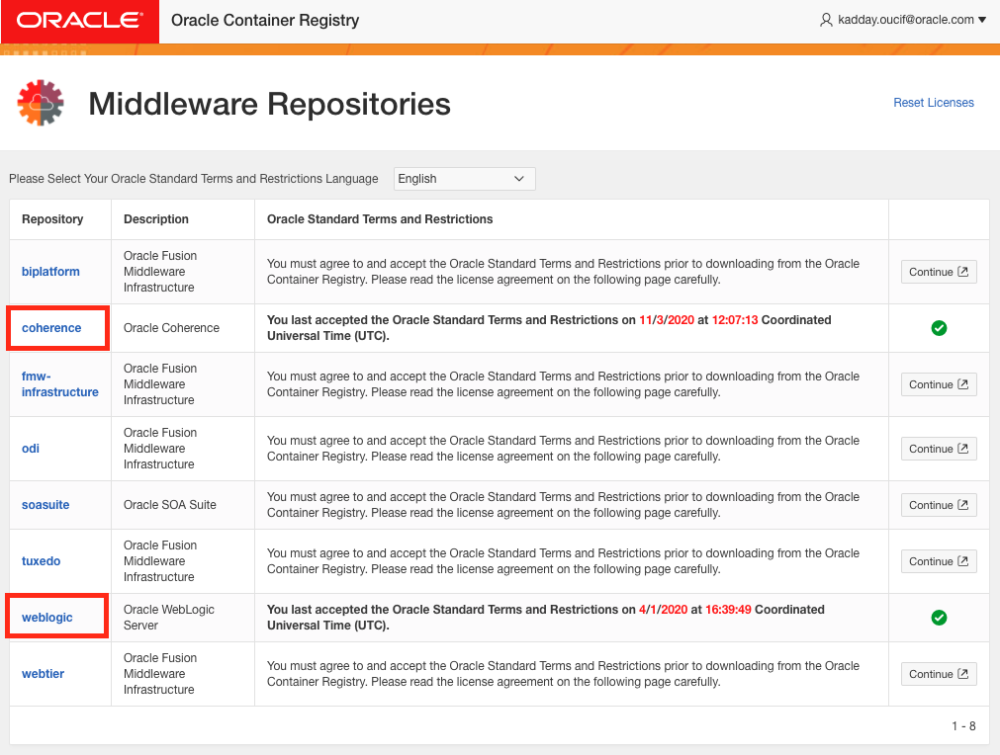

   - On the right hand-side, you can review and ***Sign in*** to accept the licenses for the WebLogic images. Go back and do the same thing for the Coherence images. 
     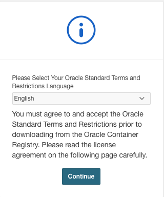

   - Go back to the [Oracle Container Registry](https://container-registry.oracle.com/) home page and do the same thing, this time for the **Verrazzano** container. You can find it bottom right.
      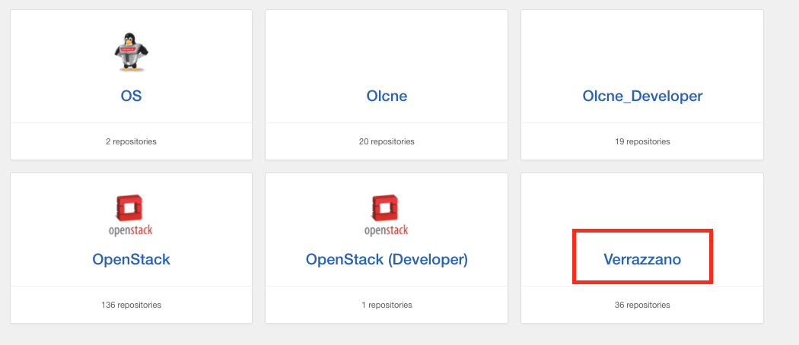

   - Review and accept the licenses for these four repositories: `example-bobbys-coherence`, `example-bobbys-front-end`, `example-bobs-books-order-manager`, and `example-roberts-coherence`.
     This time, press the on the right hand-side and accept *Terms and Conditions*

     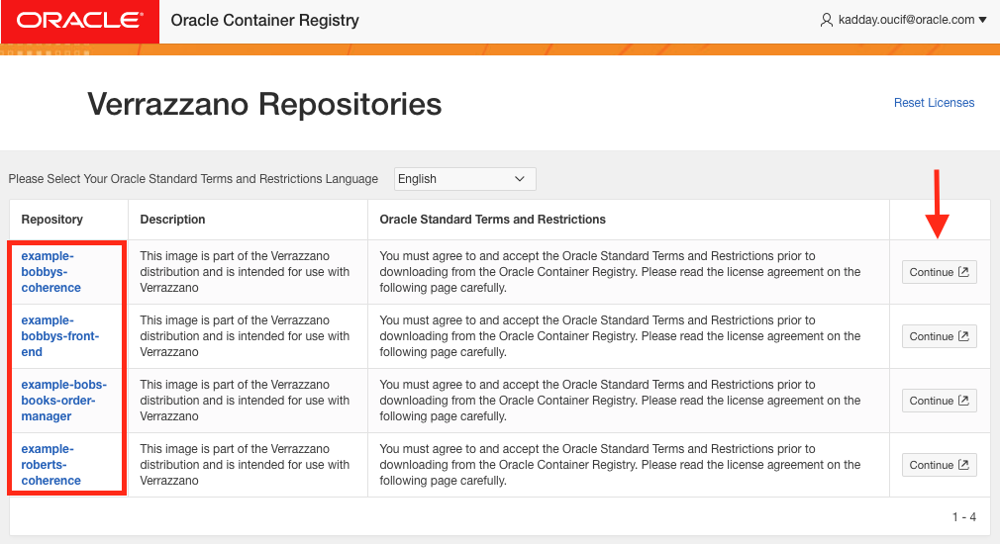

   You will not be able to pull these images until you have accepted the licenses.

3. Create secrets containing the WebLogic administration credentials for the two domains:

   ```
   kubectl create secret generic bobs-bookstore-weblogic-credentials \
           --from-literal=username=weblogic \
           --from-literal=password=welcome1
   ```

   ```
   kubectl create secret generic bobbys-front-end-weblogic-credentials \
           --from-literal=username=weblogic \
           --from-literal=password=welcome1
   ```

   Note that the example applications are pre-configured to use these credentials. If you want to use different credentials, you will need to rebuild the Docker images for the example application. The source code for the example applications is in the [examples repository](https://github.com/verrazzano/examples).

4. Before we deploy the database, let's create a secret containing the MySQL credentials:

   ```
   kubectl create secret generic mysql-credentials \
           --from-literal=username=books \
           --from-literal=password=WebLogic1234
   ```

5. And now let's deploy the MySQL database. Let's open up the example application folder. From the home folder do this (or if you're not in the home folder do `cd` and then the upcoming command;

   ```
   cd verrazzano/examples/bobs-books/
   ```

   Let's deploy the database

   ```
   kubectl apply -f mysql.yaml
   ```

   You should now have a similar output;
   ```
   koucif@cloudshell:bobs-books (eu-frankfurt-1)$ kubectl apply -f mysql.yaml
   namespace/bob created
   configmap/mysql-initdb-config created
   deployment.apps/mysql created
   service/mysql created
   ```

6. Now that the database is in place, let's deploy the Verrazzano Application Model for Bob's Books.

   Start with opening the `model` file:

   ```
   nano bobs-books-model.yaml 
   ```

   The model file (as well as the binding file) is a Kubernetes custom resource definition (CRD) that tells Verrazzano what workloads it should deploy and what relationships the    components should have. Let's examine some of the key attributes. 
   - `name` tells us what name the service should have, in this case `bobbys-front-end` is the first service name
   - `image` gives us the repo from which we will pull our image. In this case we're pulling it from the Oracle Container registry, but you could also host your    own custom images in `OCIR` and pull them from their
   - Under the `weblogicCredentialsSecret.name` we can find `bobbys-front-end-weblogic-credentials` which is the credentials the weblogic domain admin should        have
   - `imagePullSecrets` is the secret used to pull the image from the url we provided under `image` earlier. Keep in mind that doing this from the OCIR requires     you to have the right credentials to that privare repository as well.
   - The last highlighted value is the `prefix` mentioned at the end, showing us at what endpoint we can reach the application.
   
   You can see that all of the segments are split up in workloads, in the beginning you can see `weblogicDomains` listed but further down `helidonApplications`      and `coherenceClusters` are also specified. 
   
   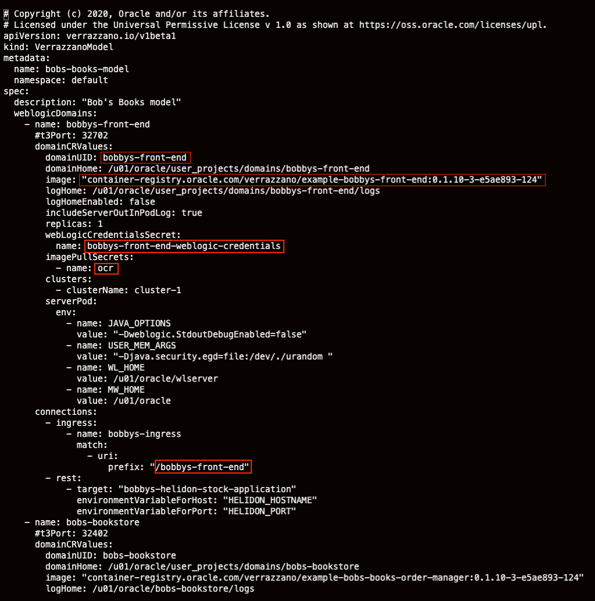

   Press `ctrl + X`if you're on Windows or `Control + X`if you're on Mac. If you get asked to Save anything just press `N`.
  
7. Deploy the model .yaml

   ```
   kubectl apply -f bobs-books-model.yaml
   ```

8. The binding maps the Verrazzano model to an environment and defines a placement to the different components within the model file to it's right places. If you    `nano` the binding just as we did in the previous section, you can see that each service is defined under the desired namespace etc. Here you can find some       more information about the [model](https://verrazzano.io/docs/reference/model/) and [binding](https://verrazzano.io/docs/reference/binding/).

 9. Deploy the Verrazzano Application Binding for Bob's Books:

      ```
      kubectl apply -f bobs-books-binding.yaml
      ```

## 5. Access the example application

1. Now let's give the services a couple of minutes to spin up. I suggest you get a coffee or read an email and then when you've done that, let's continue.

2. First get the external address of the Istio ingress gateway. Access to the example application is through the ingress gateway of the Istio mesh.

   Run this command to get the external IP address of the Istio ingress gateway:

   ```
   kubectl get service istio-ingressgateway -n istio-system
   ```

   The resposne will look like this. Save the `EXTERNAL-IP` :

   ```
   NAME                   TYPE           CLUSTER-IP     EXTERNAL-IP      PORT(S)                      AGE
   istio-ingressgateway   LoadBalancer   10.96.39.106   123.456.78.901   80:31380/TCP,443:31390/TCP   4d2h
   ```

   Now use the `EXTERNAL IP` to access your application front-ends and the **Weblogic** admin console. You can see an example of how you can reach them below (the IP provided in the beginning is an example).

   | Description                    | End Point                              | Credentials           |
   | ------------------------------ | -------------------------------------- | --------------------- |
   | Bobby's Books                  | http://123.456.78.901/bobbys-front-end |                       |
   | Robert's Books                 | http://123.456.78.901/                 |                       |
   | Bobby's Books WebLogic Console | http://123.456.78.901/console          | `weblogic`/`welcome1` |

4. If everything went as it should then you should be seeing this if you visit Bobbys book store: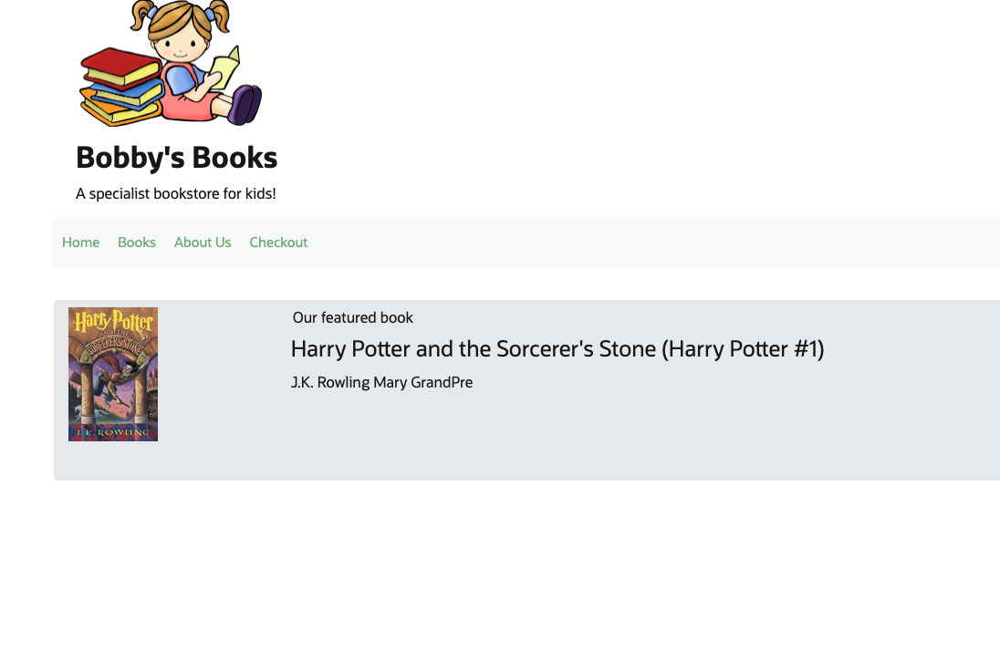
   
   And this if you visit Roberts Book store:
   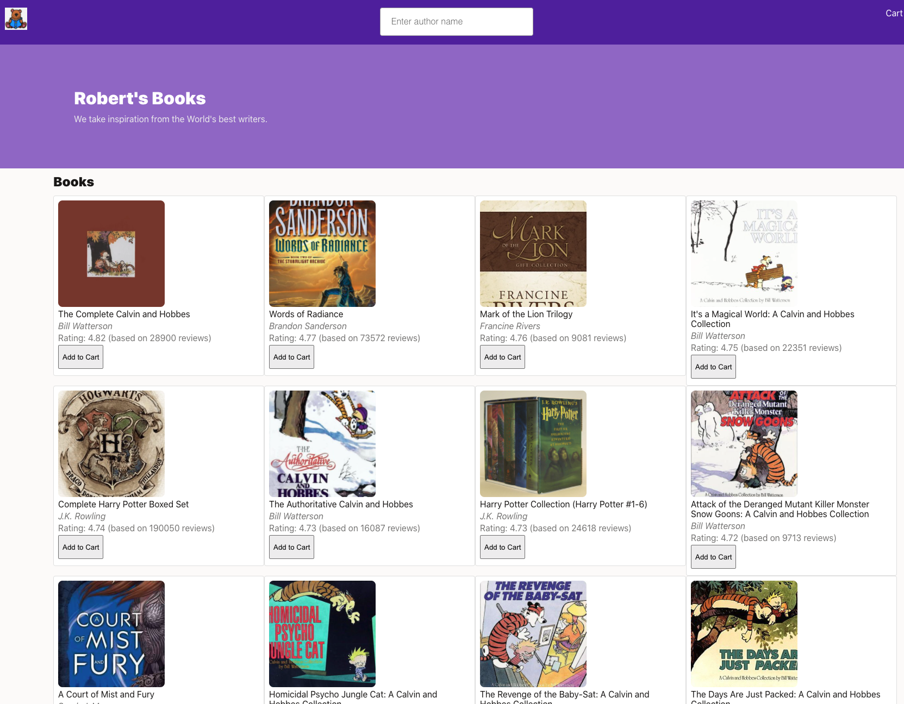

5. `kubectl get ingress -A` gives you the endpoint names for your services. 
   
    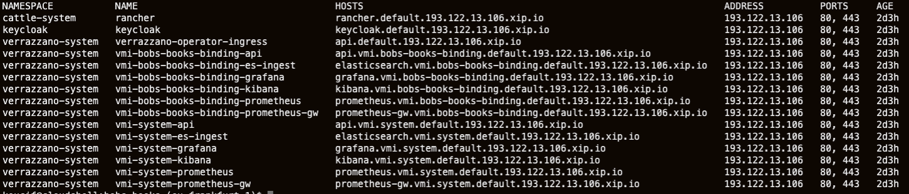

   You access the **ElasticSearch**, **Kibana**, **Grafana** and **Prometheus** services by logging in with the username `Verrazzano`. Password can be retrieved by running the `kubectl get secret` command shown at the end of our Verrazzano installation:

   ```
   kubectl get secret --namespace verrazzano-system verrazzano -o jsonpath={.data.password} | base64 --decode; echo
   ```
   To reach the other services, see below.

   **The Keycloak admin console**

   **User:** `keycloakadmin`

   Run the following command to get the password:  

   `kubectl get secret --namespace keycloak keycloak-http -o jsonpath={.data.password} | base64 --decode; echo`


   **The Rancher console**

   **User:** `admin`

   Run the following command to get the password:  

   `kubectl get secret --namespace cattle-system rancher-admin-secret -o jsonpath={.data.password} | base64 --decode; echo`


6. Congratulations - you've completed the lab!
